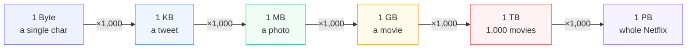
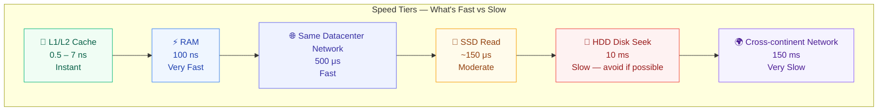
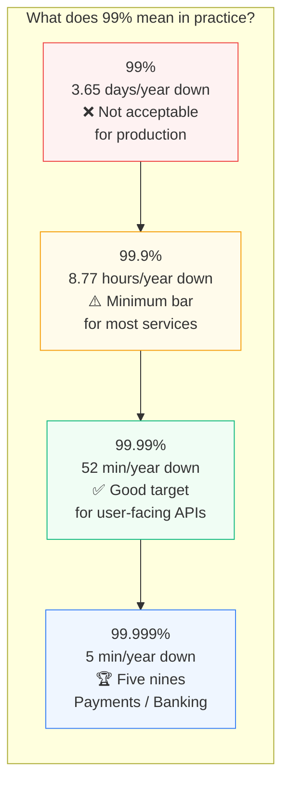
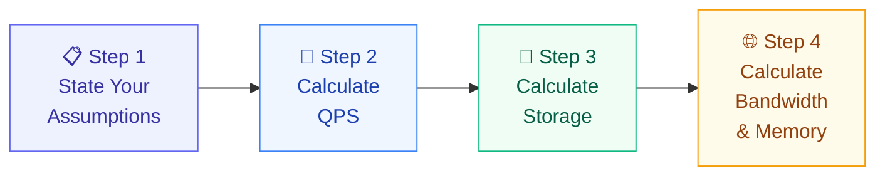
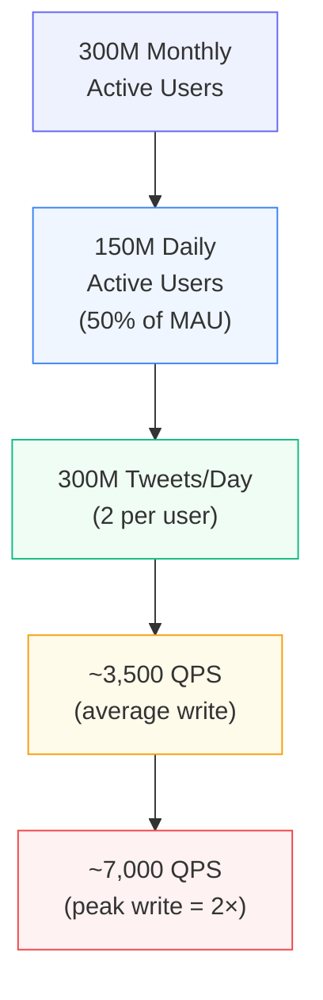
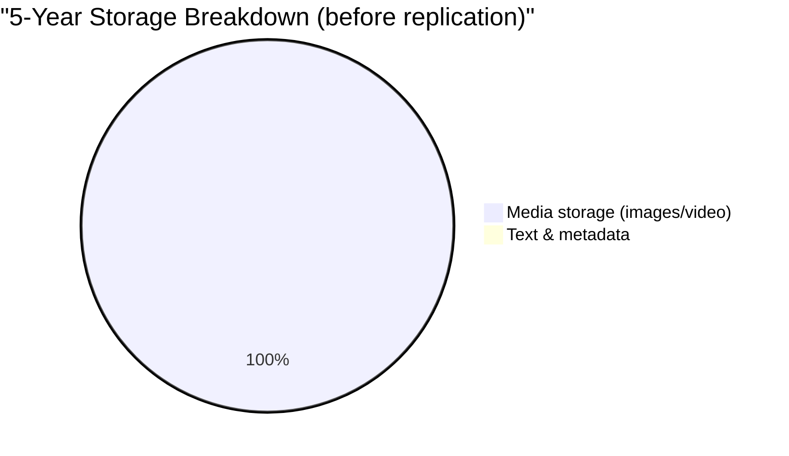
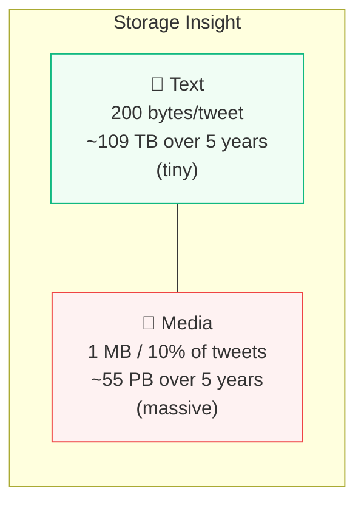
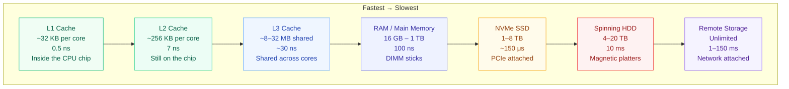
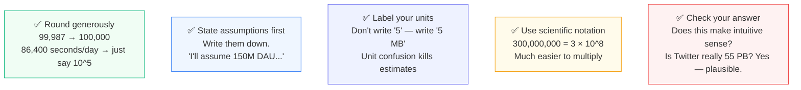
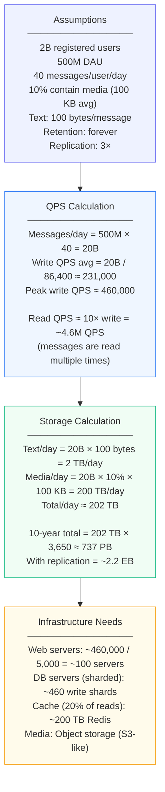

Imagine your interviewer says: *"We're designing Instagram Stories. How much storage do we need per year?"*

Most junior engineers freeze. They don't know where to begin. They feel like they need exact numbers — the real database size, the real compression ratios, the real usage stats.

Here's the secret: **you are not supposed to be exact. You are supposed to be directionally correct.**

Back-of-the-envelope estimation is the skill of producing a reasonable answer in 2–3 minutes using simple math and a handful of memorized numbers. Google's Jeff Dean calls it:

> *"Estimates you create using a combination of thought experiments and common performance numbers to get a good feel for which designs will meet your requirements."*

This skill separates engineers who *guess* from engineers who *reason from numbers*. Let's build it from the ground up.

---

## Why This Skill Matters

Before any system design, you need to answer three questions:

1. **How much traffic will hit my servers?** (QPS — queries per second)
2. **How much data will I store?** (Storage)
3. **How fast does each component need to be?** (Latency)

Without answers to these, you're guessing at architecture. With them, you can make decisions like:
- "We need a CDN because our image reads are 50,000/sec"
- "One database can handle this — we don't need sharding yet"
- "This operation touches disk — it'll be too slow, we need a cache"

---

## Foundation 1: The Power of Two — How Big Is Your Data?

All data in computers is stored in bytes. When dealing with large systems, you work with large multiples. These are the numbers to memorize cold:

```
1 KB  =  1,000 bytes         (10^3)   ← a short text message
1 MB  =  1,000,000 bytes     (10^6)   ← a 1-minute MP3 song
1 GB  =  1,000,000,000 bytes (10^9)   ← a 2-hour HD movie
1 TB  =  10^12 bytes                  ← 1,000 HD movies
1 PB  =  10^15 bytes                  ← Netflix's daily data volume
```



### Real-world anchor points

| Object | Size |
|--------|------|
| A single character (ASCII) | 1 byte |
| An integer (32-bit) | 4 bytes |
| A tweet (280 chars) | ~280 bytes |
| A profile photo (compressed) | ~300 KB |
| A high-res photo | 3–5 MB |
| A 4K video minute | ~350 MB |
| 1 million user rows in a DB | ~1 GB |

> **Tip:** In estimates, treat 1 KB ≈ 1,000 bytes, not 1,024. The 2.4% error is irrelevant for rough estimates. Keep the math simple.

---

## Foundation 2: Latency Numbers — How Fast Is Fast?

This is the single most important table in system design. Memorize the order of magnitude for each operation. Originally measured by Dr. Jeff Dean at Google in 2010, the relative order still holds.

```
Operation                              Time
───────────────────────────────────────────────────────
L1 cache reference                     0.5 ns
Branch mispredict                      5 ns
L2 cache reference                     7 ns
Mutex lock/unlock                      100 ns
Main memory reference (RAM)            100 ns
─ ─ ─ ─ ─ ─ ─ ─ ─ ─ ─ ─ ─ ─ ─ ─ ─ ─ ─ ─ ─ ─ ─ ─
Compress 1 KB with Zippy               10,000 ns  = 10 μs
Send 2 KB over 1 Gbps network          20,000 ns  = 20 μs
Read 1 MB sequentially from memory    250,000 ns  = 250 μs
Round trip within same datacenter     500,000 ns  = 500 μs
─ ─ ─ ─ ─ ─ ─ ─ ─ ─ ─ ─ ─ ─ ─ ─ ─ ─ ─ ─ ─ ─ ─ ─
Disk seek (HDD)                    10,000,000 ns  = 10 ms
Read 1 MB sequentially from network 10,000,000 ns = 10 ms
Read 1 MB sequentially from disk    30,000,000 ns = 30 ms
─ ─ ─ ─ ─ ─ ─ ─ ─ ─ ─ ─ ─ ─ ─ ─ ─ ─ ─ ─ ─ ─ ─ ─
Send packet CA → Netherlands → CA  150,000,000 ns = 150 ms
```

### Visualizing the gap — the "zoom out" perspective

The difference between a cache hit and a disk seek is hard to grasp in nanoseconds. Here's a human-scale analogy:

```
If 1 ns = 1 second, then...

L1 Cache          │█│                        0.5 seconds
RAM               │██████████│               100 seconds (1.6 min)
SSD read          │████████████████████│     ~150,000 seconds (41 hours)
HDD disk seek     │                        │ 10,000,000 seconds (116 DAYS!)
CA→Netherlands    │                        │ 150,000,000 seconds (4.75 YEARS!)
```



### What these numbers teach us

1. **Memory is fast, disk is slow** — A disk seek (10ms) is 20,000× slower than a RAM read (0.5 μs). If your hot path touches disk for every request, your system will be slow regardless of how fast the rest is.

2. **Avoid disk seeks** — Sequential reads from disk are far better than random seeks. HDD random I/O is the enemy. SSD is much better but still 1,000× slower than RAM.

3. **Simple compression algorithms are fast** — Compressing 1 KB takes only 10 μs, but sending uncompressed over the network takes 20 μs. **Compress before sending over the network.**

4. **Data centers within the same region are fast** — 500 μs round trip within a DC. Cross-continent adds 150 ms, which is 300× slower. This is why geographic data center placement matters.

5. **L1/L2 cache is your friend** — Algorithms and data structures that fit in CPU cache can run 200× faster than those requiring main memory.

---

## Foundation 3: Availability Numbers — How Reliable Is Your System?

**High availability** is the ability of a system to be continuously operational for a desirably long period of time. It is measured as a percentage. 100% means zero downtime (impossible in practice). Most services target 99%–99.999%.

A **Service Level Agreement (SLA)** is a formal agreement between a service provider and a customer defining the level of uptime. Amazon, Google, and Microsoft all set SLAs at 99.9% or above.

Uptime is measured in **nines**. More nines = more availability = less downtime:

| Availability | Downtime per Day | Downtime per Year | Nines |
|:---:|:---:|:---:|:---:|
| 99% | 14.4 minutes | 3.65 days | Two nines |
| 99.9% | 1.44 minutes | 8.77 hours | Three nines |
| 99.99% | 8.64 seconds | 52.6 minutes | Four nines |
| 99.999% | 864 ms | 5.26 minutes | Five nines |
| 99.9999% | 86 ms | 31.5 seconds | Six nines |



### A mental model for availability

Think of availability like a chain. If your system has 3 components each at 99.9% availability, the combined availability is:

```
0.999 × 0.999 × 0.999 = 0.997 = 99.7%
```

**Every component in the critical path reduces your overall availability.** This is why you add redundancy — running two components in parallel dramatically improves combined availability:

```
Parallel availability = 1 - (1 - 0.999) × (1 - 0.999)
                      = 1 - 0.000001
                      = 99.9999%  ← Six nines!
```

---

## The Estimation Framework: 4 Steps

Every good estimation follows the same structure. Don't skip steps.



### Step 1: State your assumptions out loud

Never start calculating without stating what you're assuming. This shows systematic thinking and lets the interviewer correct you early rather than after 10 minutes.

Always define:
- Monthly Active Users (MAU) or Daily Active Users (DAU)
- Read-to-write ratio (most apps are 80:20 or 100:1 read-heavy)
- Average size of each object
- Data retention period (1 year? 5 years? Forever?)
- Replication factor (typically 3 for durability)

### Step 2: Calculate QPS (Queries Per Second)

This is the heartbeat of your system. Everything else flows from this number.

**The formula:**

```
Daily Active Users (DAU) × average requests per user per day
QPS (average) = ──────────────────────────────────────────────
                              86,400 seconds/day

Peak QPS = average QPS × 2   (safe rule of thumb)
```

> 86,400 = 24 hours × 60 minutes × 60 seconds. Memorize this.

**Quick mental shortcuts:**

```
1M  requests/day  →  ~12 QPS
10M requests/day  →  ~116 QPS ≈ 100 QPS
100M requests/day →  ~1,160 QPS ≈ 1,000 QPS
1B  requests/day  →  ~11,600 QPS ≈ 10,000 QPS
```

### Step 3: Calculate Storage

```
Daily Storage = writes per day × average object size

Total Storage = daily storage × retention years × replication factor
```

Replication factor = 3 is the default for distributed systems (you keep 3 copies of every file for durability).

### Step 4: Calculate Bandwidth

```
Read bandwidth  = read QPS × average response size
Write bandwidth = write QPS × average request size
```

---

## Worked Example: Estimate Twitter-Scale QPS and Storage

Let's walk through a real estimation, step by step, the way you'd do it in an interview.

### Problem

*"We're building a Twitter-like service. Estimate the QPS and storage requirements."*

### Step 1: State assumptions

```
Monthly active users:     300 million
Daily active users:       50% of MAU = 150 million
Tweets per user per day:  2 tweets on average
% of tweets with media:   10%
Media size per tweet:     1 MB (image or short video)
Text + metadata per tweet: tweet_id (64 bytes) + text (140 bytes) = ~204 bytes ≈ 200 bytes
Data retention period:    5 years
Replication factor:       3
```

### Step 2: Calculate QPS

```
Total tweets per day = 150 million users × 2 tweets = 300 million tweets/day

Tweet write QPS (average) = 300,000,000 / 86,400 ≈ 3,500 QPS

Peak tweet write QPS       = 3,500 × 2 = ~7,000 QPS
```



### Step 3: Calculate Storage

**Text storage:**
```
Text bytes per day  = 300M tweets × 200 bytes = 60 GB/day
5-year text storage = 60 GB × 365 × 5         = ~109 TB
With replication ×3 = ~327 TB
```

**Media storage (10% of tweets have 1 MB media):**
```
Media bytes per day  = 300M × 10% × 1 MB = 30 TB/day
5-year media storage = 30 TB × 365 × 5   = ~54,750 TB = ~55 PB
With replication ×3  = ~165 PB
```



> **Key insight:** Media utterly dominates storage. Text is negligible. This is why Instagram, Twitter, and TikTok use dedicated object storage (like Amazon S3) for media — not databases.

### Step 4: Calculate bandwidth

```
Write bandwidth = 7,000 QPS × (200 bytes text + 10% chance × 1 MB)
               ≈ 7,000 × (200 + 100,000) bytes
               ≈ 7,000 × ~100 KB
               ≈ 700 MB/s write bandwidth at peak
```



---

## Common Estimation Scenarios — Cheat Sheet

Here are the most frequently asked estimation types in interviews, with formulas:

### QPS Estimation

```
Given: N million DAU, each makes R requests/day

Average QPS = (N × 1,000,000 × R) / 86,400
Peak QPS    = Average QPS × 2
```

**Example:** 10M DAU, 10 requests each:
```
Average QPS = 10M × 10 / 86,400 ≈ 1,157 ≈ ~1,000 QPS
Peak QPS    ≈ 2,000 QPS
```

### Storage Estimation

```
Given: W writes/day, S bytes per write, Y years retention, RF replication factor

Total Storage = W × S × 365 × Y × RF
```

**Example:** 1M uploads/day, 500 KB each, 3 years, replicated 3×:
```
= 1,000,000 × 500,000 × 365 × 3 × 3
= 500 GB/day × 365 × 9
≈ 1.6 PB
```

### Cache Memory Estimation

A common rule of thumb: **cache 20% of daily read requests** (the 80/20 rule — 20% of data accounts for 80% of reads).

```
Daily reads  = read QPS × 86,400
Cache memory = daily reads × average response size × 20%
```

**Example:** 10,000 read QPS, 1 KB avg response:
```
Daily reads  = 10,000 × 86,400 = 864,000,000 reads
Cache memory = 864M × 1 KB × 20% = ~172 GB
```

Two Redis servers with 96 GB RAM each would handle this comfortably.

### Number of Servers Estimation

```
Servers needed = QPS / queries_per_server_per_second

A typical web server handles: ~1,000–5,000 QPS
A typical DB server handles:  ~1,000 QPS (reads), ~500 QPS (writes)
```

**Example:** 50,000 peak QPS:
```
Web servers = 50,000 / 5,000 = 10 servers minimum
(Add 2–3× headroom for spikes → 20–30 servers)
```

---

## The Memory Hierarchy — Where Your Data Lives

Understanding where data lives is critical for latency decisions. Here's the full picture:



### The key design implication

**Every cache layer in a real system maps to this hierarchy:**

| System Layer | Maps to |
|---|---|
| In-process memory (application cache) | L3 / RAM |
| Redis / Memcached (in-memory cache) | RAM on a remote server |
| CDN edge cache | RAM on a geographically close server |
| Database with SSD storage | SSD reads |
| Cold storage (S3 Glacier, archival) | Slow HDD / tape |

When you design a cache, you're choosing which layer of this hierarchy to promote your "hot" data into. Promoting from HDD → RAM makes operations 100,000× faster.

---

## Tips for Interviews: How to Not Freeze Up

Back-of-the-envelope estimation is **all about the process**. Solving the problem is more important than getting the exact right number. Here are the rules:



### The numbers to have memorized

| Fact | Value |
|---|---|
| Seconds in a day | 86,400 (~10^5) |
| Seconds in a year | ~31.5 million (~3 × 10^7) |
| 1 million | 10^6 |
| 1 billion | 10^9 |
| Average web response | 1–10 KB |
| Average image | 300 KB – 3 MB |
| Average video (per minute) | 50–350 MB |
| Redis throughput | ~100,000 QPS |
| MySQL throughput | ~1,000–5,000 QPS |
| CDN cache hit ratio | ~95% |
| Typical read:write ratio | 80:20 to 100:1 |

### Common mistakes to avoid

**❌ "I don't know the exact numbers"** — You don't need them. Make a reasonable assumption and state it.

**❌ Jumping straight to the answer** — Always walk through your assumptions. An interviewer who sees your reasoning can guide you even if you're off-track.

**❌ Confusing MB and GB** — Being off by 1,000× breaks your estimate. Write units. Always.

**❌ Forgetting replication** — If you calculate raw storage and forget to multiply by 3 for replication, you underestimate by 3×.

**❌ Using average QPS as peak QPS** — Systems must handle peaks, not just averages. Traffic spikes 2–10× above average during events (product launches, sports finals, etc.).

---

## Full Estimation Summary: WhatsApp-Scale Messaging

Let's run through one more example end-to-end to solidify the process.

**Problem:** *"Estimate the infrastructure needs for a WhatsApp-like messaging service."*



This is how you'd arrive at the same conclusion WhatsApp engineers reach when deciding to use Erlang (for concurrency), Mnesia (for in-memory storage), and horizontal sharding across hundreds of database nodes.

---

## Summary

Back-of-the-envelope estimation is a learnable skill. Practice these numbers until they're automatic:

| Concept | Key numbers |
|---|---|
| Data sizes | KB → MB → GB → TB → PB (each ×1,000) |
| L1 cache | 0.5 ns |
| RAM | 100 ns |
| Datacenter round trip | 500 μs |
| HDD seek | 10 ms |
| Cross-continent | 150 ms |
| Seconds per day | 86,400 |
| Availability nines | 99.9% = 8.77 hrs/yr downtime |
| Peak vs average QPS | Peak = 2× average |
| Storage replication | Always ×3 |

The more you practice, the faster and more confident you become. In interviews, interviewers aren't testing whether you get 54 PB or 60 PB — they're testing whether you *think like an engineer* who reasons systematically from numbers to architecture decisions.

---

## What's Next

In the next post, we cover **A Framework for System Design Interviews** — the exact 4-step process for approaching any open-ended system design question, from clarifying requirements to doing a deep dive, without freezing up or going in circles.
