Amazon DynamoDB stores **hundreds of trillions of items** and handles **tens of millions of requests per second** at peak. Netflix uses it to keep track of what you were watching. Airbnb uses it for availability calendars. Discord uses it for message storage.

What do all of these have in common? They all need to store and retrieve data by a simple key — blazingly fast, at global scale, with near-zero downtime. That's what a **key-value store** does.

In this chapter, we're going to build one from scratch. Not a toy version — a real, production-grade distributed key-value store based on the same principles behind Amazon's Dynamo and Apache Cassandra. By the end, you'll understand every design decision, every trade-off, and why the engineers at Amazon and Google made the choices they did.

---

## What Is a Key-Value Store?

A key-value store is the simplest possible database model. It's a giant dictionary. You give it a key, you get a value. You give it a key and a value, it stores it.

```
put("user:1001:name",  "Alice Chen")
put("user:1001:score", "9850")
put("session:abc123",  "{token: xyz, expires: 1748649600}")

get("user:1001:name")   → "Alice Chen"
get("session:abc123")   → "{token: xyz, expires: 1748649600}"
```

That's it. No joins, no foreign keys, no complex queries. Just two operations: `put(key, value)` and `get(key)`.

Real-world examples you already know:
- **Redis** — in-memory key-value store used for caching and sessions
- **Amazon DynamoDB** — fully managed, scales to planetary scale
- **Memcached** — distributed memory caching system
- **Apache Cassandra** — wide-column key-value store with tunable consistency

Keys can be plain text (`"last_logged_in_at"`) or hashed values (`"253DDEC4"`). Values can be anything: strings, numbers, JSON blobs, binary data. The key must be unique. The value is opaque — the store doesn't care what's inside.

---

## Step 1 — Design Requirements

Before designing anything, nail down the requirements. For our distributed key-value store:

| Requirement | Detail |
|---|---|
| Key-value pair size | Small — less than 10 KB per pair |
| Big data | Must be able to store a massive dataset |
| High availability | Responds quickly, even during failures |
| High scalability | Scales to support large datasets |
| Automatic scaling | Add/remove servers automatically based on traffic |
| Tunable consistency | We can dial between consistency and availability |
| Low latency | Sub-millisecond reads and writes |

Notice **tunable consistency** — this is a key differentiator from traditional databases. We'll understand exactly what this means when we get to quorum consensus.

---

## Step 2 — Why a Single Server Isn't Enough

The simplest key-value store is just a hash table in memory on a single server:

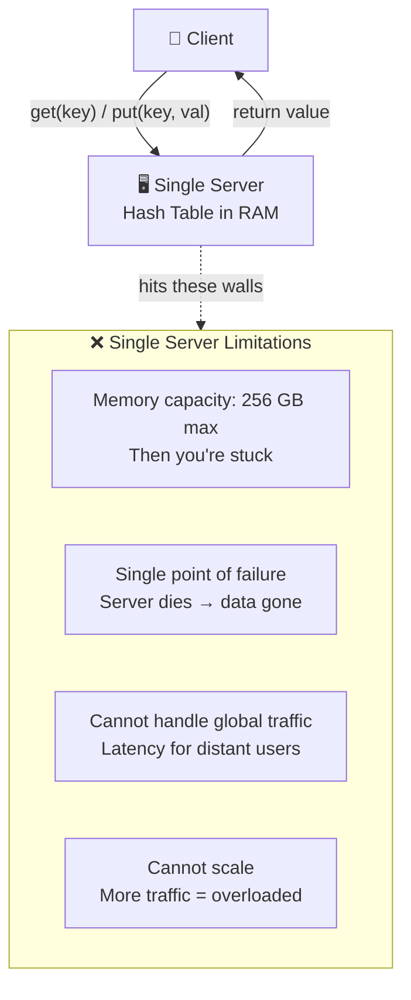
```mermaid
flowchart TD
    CLIENT["👤 Client"] -->|"get(key) / put(key, val)"| SINGLE["🖥️ Single Server\nHash Table in RAM"]
    SINGLE -->|"return value"| CLIENT

    subgraph SINGLE_LIMITS["❌ Single Server Limitations"]
        L1["Memory capacity: 256 GB max\nThen you're stuck"]
        L2["Single point of failure\nServer dies → data gone"]
        L3["Cannot handle global traffic\nLatency for distant users"]
        L4["Cannot scale\nMore traffic = overloaded"]
    end

    SINGLE -.->|"hits these walls"| SINGLE_LIMITS
```

You can extend a single server temporarily:
- **Data compression** — pack values tighter
- **Hot/cold tiering** — keep hot keys in memory, cold keys on disk

But these only delay the inevitable. For any serious application, you need a **distributed key-value store** — data spread across many servers, coordinated to act as one system.

This is where the real complexity begins.

---

## Step 3 — The CAP Theorem: The Fundamental Constraint

Before designing any distributed system, you must understand the **CAP theorem**. It defines the boundaries of what's physically possible.

**CAP stands for:**

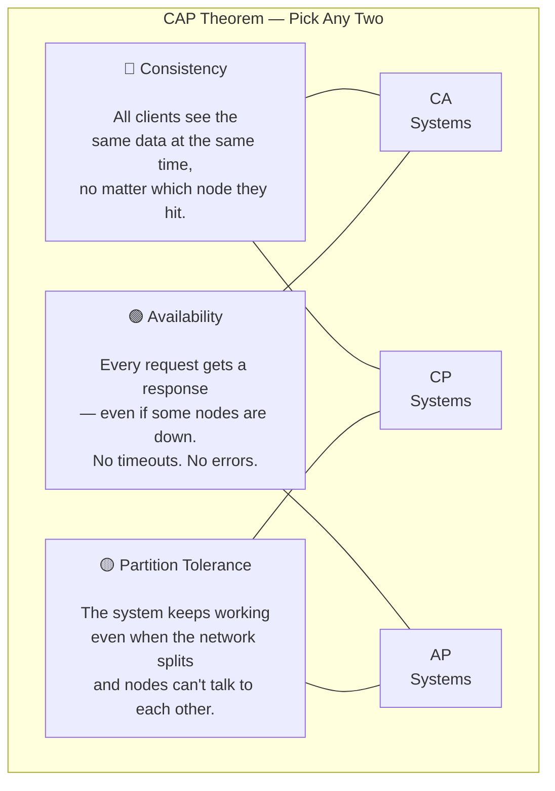
```mermaid
graph TD
    subgraph CAP["CAP Theorem — Pick Any Two"]
        C["🔵 Consistency\n\nAll clients see the\nsame data at the same time,\nno matter which node they hit."]
        A["🟢 Availability\n\nEvery request gets a response\n— even if some nodes are down.\nNo timeouts. No errors."]
        P["🟡 Partition Tolerance\n\nThe system keeps working\neven when the network splits\nand nodes can't talk to each other."]

        C --- CA["CA\nSystems"]
        C --- CP["CP\nSystems"]
        A --- CA
        A --- AP["AP\nSystems"]
        P --- CP
        P --- AP
    end
```

**The cruel truth:** In any real distributed system, **network partitions are unavoidable**. Cables fail. Data centers lose connectivity. Network switches malfunction. You cannot build a system that pretends partitions don't happen.

This means **P is non-negotiable** in practice. The real choice is always between **C and A**:

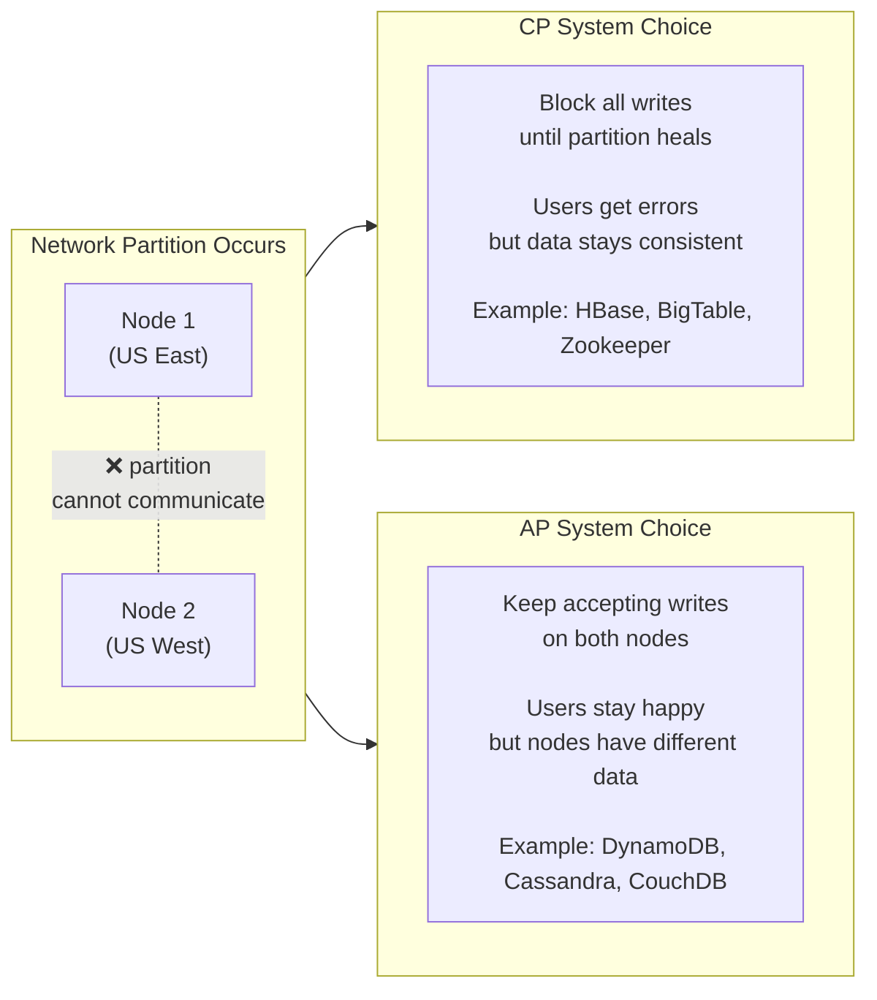
```mermaid
flowchart LR
    subgraph SCENARIO["Network Partition Occurs"]
        N1["Node 1\n(US East)"] 
        N2["Node 2\n(US West)"]
        N1 -. "❌ partition\ncannot communicate" .- N2
    end

    subgraph CP_CHOICE["CP System Choice"]
        CP_ACTION["Block all writes\nuntil partition heals\n\nUsers get errors\nbut data stays consistent\n\nExample: HBase, BigTable, Zookeeper"]
    end

    subgraph AP_CHOICE["AP System Choice"]
        AP_ACTION["Keep accepting writes\non both nodes\n\nUsers stay happy\nbut nodes have different data\n\nExample: DynamoDB, Cassandra, CouchDB"]
    end

    SCENARIO --> CP_CHOICE
    SCENARIO --> AP_CHOICE
```

**CP systems** sacrifice availability. If nodes can't sync, they refuse writes. Banks and financial systems use this — a stale balance is worse than a brief error.

**AP systems** sacrifice consistency. If nodes can't sync, they accept writes anyway and reconcile later (eventual consistency). Social media feeds, shopping carts, and session stores use this — brief staleness is fine.

**CA systems** don't exist in distributed settings. A system that ignores partitions will simply break when a partition occurs.

For our key-value store, we'll follow the lead of **Dynamo and Cassandra** — we'll build an **AP system with tunable consistency**, so operators can dial up consistency when needed.

---

## Step 4 — Data Partitioning with Consistent Hashing

Our first core problem: how do we decide which server stores which key?

**Consistent hashing** (covered deeply in Chapter 5) is the answer. Rather than rehashing everything when servers change, consistent hashing places servers on a virtual ring and routes keys to the first server clockwise from their hash position.

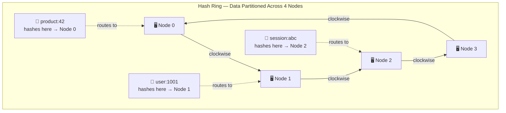
```mermaid
graph LR
    subgraph RING["Hash Ring — Data Partitioned Across 4 Nodes"]
        direction LR
        N0["🖥️ Node 0"]
        N1["🖥️ Node 1"]
        N2["🖥️ Node 2"]
        N3["🖥️ Node 3"]
        K_USER["🔑 user:1001\nhashes here → Node 1"]
        K_SESS["🔑 session:abc\nhashes here → Node 2"]
        K_PROD["🔑 product:42\nhashes here → Node 0"]

        N3 -->|"clockwise"| N0
        N0 -->|"clockwise"| N1
        N1 -->|"clockwise"| N2
        N2 -->|"clockwise"| N3

        K_USER -.->|"routes to"| N1
        K_SESS -.->|"routes to"| N2
        K_PROD -.->|"routes to"| N0
    end
```

**Why consistent hashing for partitioning?**

- **Automatic scaling** — add a node → only that node's adjacent keys migrate. Zero manual resharding.
- **Heterogeneity** — powerful servers get more virtual nodes → handle more keys automatically.
- **Minimal data movement** — removing a node moves only `k/n` keys on average.

---

## Step 5 — Data Replication for High Availability

Storing each key on only one server is asking for data loss. Servers crash. Disks fail. Data centers flood.

The solution: **replicate every key on N servers** (where N is a configurable replication factor, typically 3).

**The replication strategy:** After hashing a key to its position, walk **clockwise** on the ring and store copies on the next **N unique physical servers**.

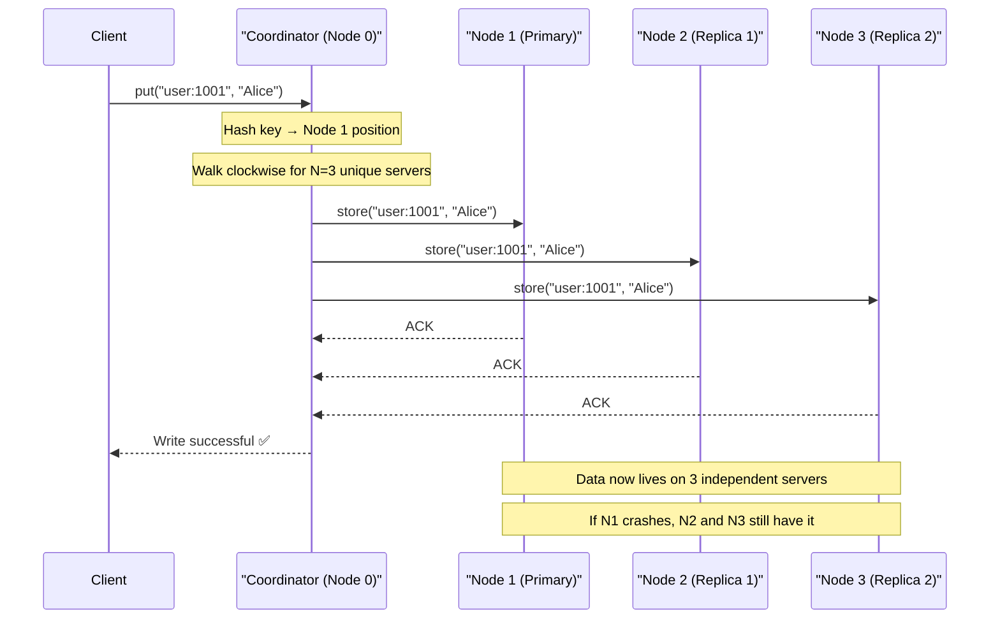
```mermaid
sequenceDiagram
    participant Client
    participant Coord as "Coordinator (Node 0)"
    participant N1 as "Node 1 (Primary)"
    participant N2 as "Node 2 (Replica 1)"
    participant N3 as "Node 3 (Replica 2)"

    Client->>Coord: put("user:1001", "Alice")
    Note over Coord: Hash key → Node 1 position
    Note over Coord: Walk clockwise for N=3 unique servers
    Coord->>N1: store("user:1001", "Alice")
    Coord->>N2: store("user:1001", "Alice")
    Coord->>N3: store("user:1001", "Alice")
    N1-->>Coord: ACK
    N2-->>Coord: ACK
    N3-->>Coord: ACK
    Coord-->>Client: Write successful ✅

    Note over N1,N3: Data now lives on 3 independent servers
    Note over N1,N3: If N1 crashes, N2 and N3 still have it
```

**Critical rule with virtual nodes:** If `node1_vnode0` and `node1_vnode1` are both virtual nodes for Node 1, we skip the second one during replication — we want N *physical* servers to hold copies, not N virtual nodes on the same machine.

**For maximum resilience**, replicas should be placed in **different data centers**. A power outage, flood, or natural disaster can take down an entire data center. Having replicas in Virginia, Ireland, and Tokyo means one disaster can never destroy your data.

---

## Step 6 — Quorum Consensus: Tuning Consistency

Here's where things get truly interesting. With 3 replicas of every key, how do reads and writes actually work?

**Three variables define your consistency level:**

- **N** = number of replicas (typically 3)
- **W** = write quorum — how many replicas must acknowledge a write before it's considered successful
- **R** = read quorum — how many replicas must respond to a read

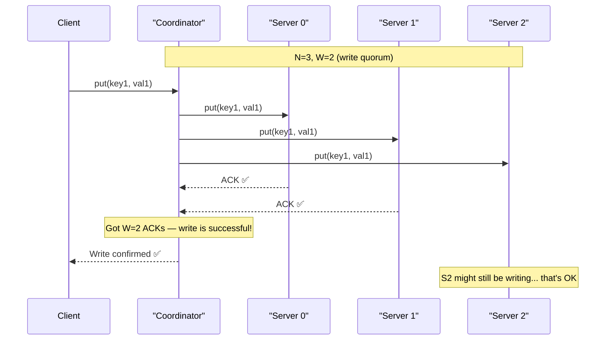
```mermaid
sequenceDiagram
    participant Client
    participant Coord as "Coordinator"
    participant S0 as "Server 0"
    participant S1 as "Server 1"
    participant S2 as "Server 2"

    Note over Coord,S2: N=3, W=2 (write quorum)
    Client->>Coord: put(key1, val1)
    Coord->>S0: put(key1, val1)
    Coord->>S1: put(key1, val1)
    Coord->>S2: put(key1, val1)
    S0-->>Coord: ACK ✅
    S1-->>Coord: ACK ✅
    Note over Coord: Got W=2 ACKs — write is successful!
    Coord-->>Client: Write confirmed ✅
    Note over S2: S2 might still be writing... that's OK
```

**The key insight:** `W=2` does NOT mean data is only written to 2 servers. It's still sent to all 3. It means we only *wait* for 2 acknowledgements before declaring success. The third server eventually catches up.

### Tuning the W, R, N Knobs

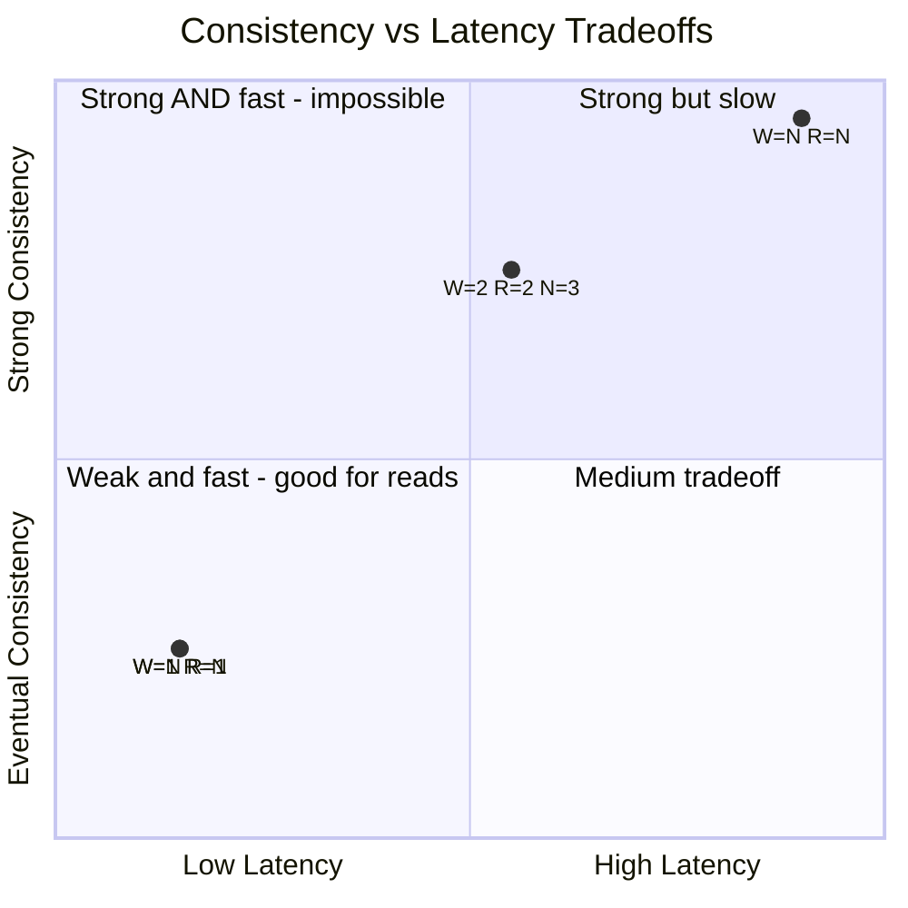
```mermaid
quadrantChart
    title Consistency vs Latency Tradeoffs
    x-axis "Low Latency" --> "High Latency"
    y-axis "Eventual Consistency" --> "Strong Consistency"
    quadrant-1 Strong but slow
    quadrant-2 Strong AND fast - impossible
    quadrant-3 Weak and fast - good for reads
    quadrant-4 Medium tradeoff

    W=1 R=N: [0.15, 0.25]
    W=N R=1: [0.15, 0.25]
    W=2 R=2 N=3: [0.55, 0.75]
    W=N R=N: [0.90, 0.95]
```

| Configuration | What it means | Best for |
|---|---|---|
| **R=1, W=N** | Read from 1, write to all. Fast reads, slow writes. | Read-heavy systems like content delivery |
| **W=1, R=N** | Write to 1, read from all. Fast writes, slow reads. | Write-heavy systems like logging |
| **W+R > N** (e.g. N=3, W=R=2) | Guaranteed overlap — at least one server has the latest data. **Strong consistency.** | Banking, inventory, anything critical |
| **W+R ≤ N** | No guaranteed overlap. Possible stale reads. **Eventual consistency.** | Social media, shopping carts, caches |

**The golden rule:** If `W + R > N`, there must be at least one server that received both the latest write AND is in your read quorum. That server always returns the most recent value. Strong consistency guaranteed.

The configurability is what makes Cassandra special — you literally tune a `consistency_level` per query: `ONE`, `QUORUM`, `ALL`. Different parts of your application can have different guarantees.

---

## Step 7 — Consistency Models: What "Consistency" Actually Means

Three levels of consistency exist in the distributed systems world:

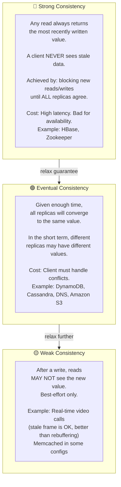
```mermaid
flowchart TD
    subgraph STRONG["🔵 Strong Consistency"]
        SC["Any read always returns\nthe most recently written value.\n\nA client NEVER sees stale data.\n\nAchieved by: blocking new reads/writes\nuntil ALL replicas agree.\n\nCost: High latency. Bad for availability.\nExample: HBase, Zookeeper"]
    end

    subgraph EVENTUAL["🟢 Eventual Consistency"]
        EC["Given enough time,\nall replicas will converge\nto the same value.\n\nIn the short term, different\nreplicas may have different values.\n\nCost: Client must handle conflicts.\nExample: DynamoDB, Cassandra, DNS, Amazon S3"]
    end

    subgraph WEAK["🟡 Weak Consistency"]
        WC["After a write, reads\nMAY NOT see the new value.\nBest-effort only.\n\nExample: Real-time video calls\n(stale frame is OK, better than rebuffering)\nMemcached in some configs"]
    end

    STRONG -->|"relax guarantee"| EVENTUAL
    EVENTUAL -->|"relax further"| WEAK
```

For our key-value store, we recommend **eventual consistency** — the same choice made by Dynamo and Cassandra. Here's the reasoning:

- Blocking writes until all replicas agree (strong consistency) can make the whole system unavailable if just one replica is temporarily slow
- In practice, "eventual" usually means milliseconds to seconds — barely noticeable to users
- The conflict resolution mechanisms (coming up next) handle the rare cases where replicas diverge

---

## Step 8 — Inconsistency Resolution: Vector Clocks

With eventual consistency, here's the nightmare scenario: two clients update the same key simultaneously on two different replicas. Now the replicas have different values. Which one wins?

**First, let's see the problem:**

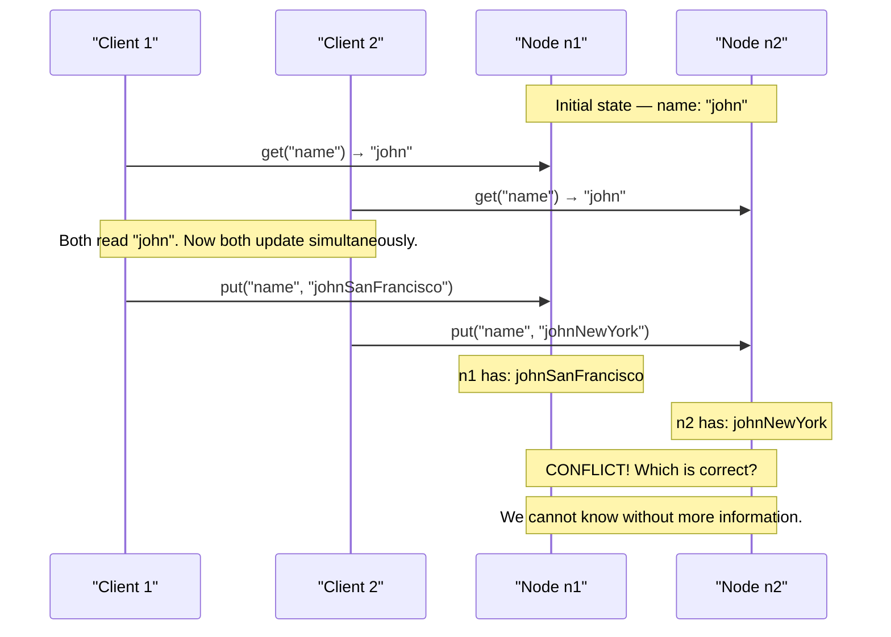
```mermaid
sequenceDiagram
    participant Client1 as "Client 1"
    participant Client2 as "Client 2"
    participant N1 as "Node n1"
    participant N2 as "Node n2"

    Note over N1,N2: Initial state — name: "john"
    Client1->>N1: get("name") → "john"
    Client2->>N2: get("name") → "john"

    Note over Client1,Client2: Both read "john". Now both update simultaneously.

    Client1->>N1: put("name", "johnSanFrancisco")
    Client2->>N2: put("name", "johnNewYork")

    Note over N1: n1 has: johnSanFrancisco
    Note over N2: n2 has: johnNewYork
    Note over N1,N2: CONFLICT! Which is correct?
    Note over N1,N2: We cannot know without more information.
```

This conflict happens because both clients read `"john"` and independently modified it. Neither is "wrong" — both are valid updates. We need a mechanism to **detect** and **resolve** such conflicts.

The solution: **Vector Clocks**.

### How Vector Clocks Work

A vector clock is a `[server, version]` pair attached to every data item. It tracks which servers have seen and modified the data.

**Rules:**
- When a server writes data: if it already has a `[Si, vi]` entry → increment `vi`. Otherwise → add `[Si, 1]`.
- This creates a version history that can detect conflicts.

**Step-by-step example** (from the book):

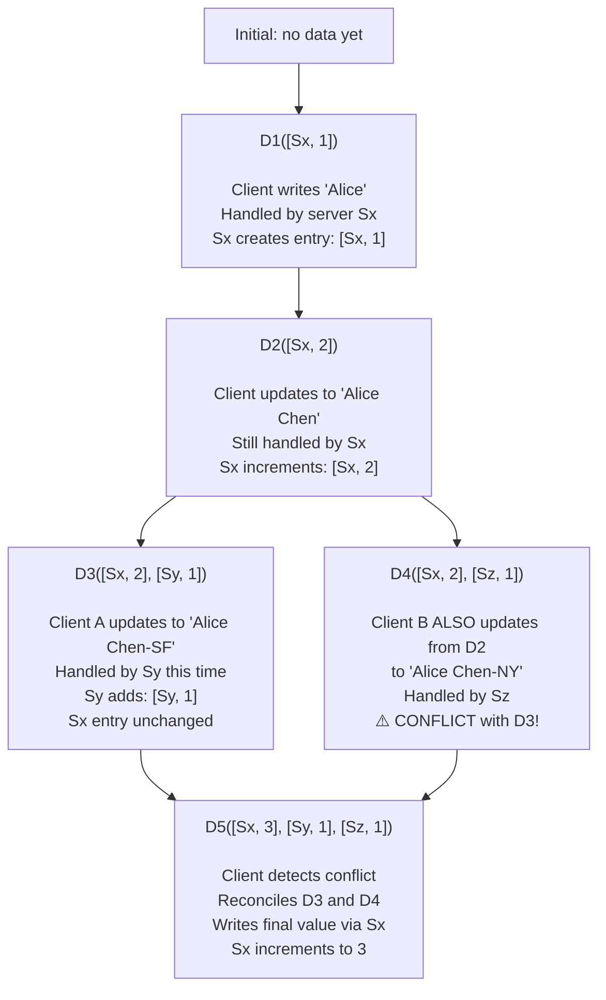
```mermaid
flowchart TD
    D0["Initial: no data yet"]

    D1["D1([Sx, 1])\n\nClient writes 'Alice'\nHandled by server Sx\nSx creates entry: [Sx, 1]"]

    D2["D2([Sx, 2])\n\nClient updates to 'Alice Chen'\nStill handled by Sx\nSx increments: [Sx, 2]"]

    D3["D3([Sx, 2], [Sy, 1])\n\nClient A updates to 'Alice Chen-SF'\nHandled by Sy this time\nSy adds: [Sy, 1]\nSx entry unchanged"]

    D4["D4([Sx, 2], [Sz, 1])\n\nClient B ALSO updates from D2\nto 'Alice Chen-NY'\nHandled by Sz\n⚠️ CONFLICT with D3!"]

    D5["D5([Sx, 3], [Sy, 1], [Sz, 1])\n\nClient detects conflict\nReconciles D3 and D4\nWrites final value via Sx\nSx increments to 3"]

    D0 --> D1 --> D2
    D2 --> D3
    D2 --> D4
    D3 --> D5
    D4 --> D5
```

**How do we detect conflicts?**

Vector clock `X` is an **ancestor** of `Y` (no conflict) if every version counter in `X` is less than or equal to the corresponding counter in `Y`.

- `D([s0,1],[s1,1])` is an ancestor of `D([s0,1],[s1,2])` → **no conflict**, D2 supersedes D1

Vector clock `X` is a **sibling** of `Y` (conflict exists) if any counter in `X` is less than the corresponding in `Y` AND any counter in `X` is greater than the corresponding in `Y`.

- `D([s0,1],[s1,2])` vs `D([s0,2],[s1,1])` → **CONFLICT** — s0 saw something s1 didn't, and vice versa

**Downsides of vector clocks:**

1. **Client complexity** — the client must implement conflict resolution logic. Not the server.
2. **Growing clock size** — each write adds a `[server, version]` pair. Long history = large metadata. Fix: set a length threshold and remove the oldest entries. Dynamo does this in production.

---

## Step 9 — Failure Detection: Gossip Protocol

In a distributed system, you can't trust a single node's report that another node is down. That node might be wrong, or lying, or suffering its own network issues.

**The rule:** A node is only marked offline when at least **two independent sources** confirm it hasn't been heard from.

**All-to-all multicasting** (every node pings every other node) would work but doesn't scale. With 1000 nodes, that's 1,000,000 pings per round. Too much network overhead.

**Gossip protocol** is the elegant alternative — inspired by how rumors spread in real life:

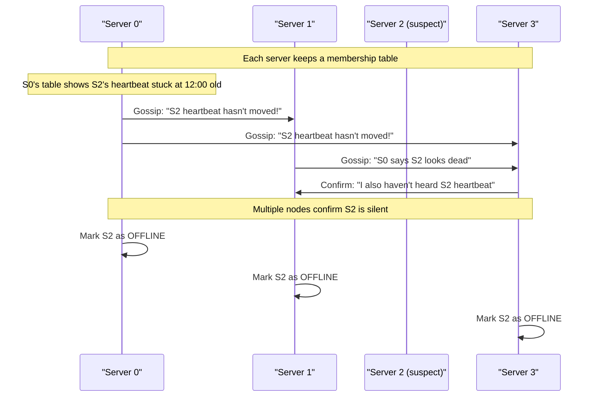
```mermaid
sequenceDiagram
    participant S0 as "Server 0"
    participant S1 as "Server 1"
    participant S2 as "Server 2 (suspect)"
    participant S3 as "Server 3"

    Note over S0,S3: Each server keeps a membership table
    Note over S0: S0's table shows S2's heartbeat stuck at 12:00 old

    S0->>S1: Gossip: "S2 heartbeat hasn't moved!"
    S0->>S3: Gossip: "S2 heartbeat hasn't moved!"

    S1->>S3: Gossip: "S0 says S2 looks dead"
    S3->>S1: Confirm: "I also haven't heard S2 heartbeat"

    Note over S0,S3: Multiple nodes confirm S2 is silent
    S0->>S0: Mark S2 as OFFLINE
    S1->>S1: Mark S2 as OFFLINE
    S3->>S3: Mark S2 as OFFLINE
```

**How gossip works in detail:**

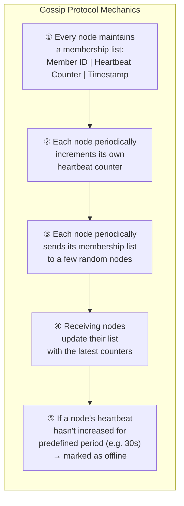
```mermaid
flowchart TD
    subgraph GOSSIP_MECHANICS["Gossip Protocol Mechanics"]
        direction TB
        G1["① Every node maintains\na membership list:\nMember ID | Heartbeat Counter | Timestamp"]
        G2["② Each node periodically\nincrements its own\nheartbeat counter"]
        G3["③ Each node periodically\nsends its membership list\nto a few random nodes"]
        G4["④ Receiving nodes\nupdate their list\nwith the latest counters"]
        G5["⑤ If a node's heartbeat\nhasn't increased for\npredefined period (e.g. 30s)\n→ marked as offline"]

        G1 --> G2 --> G3 --> G4 --> G5
    end
```

**Why gossip is brilliant:** Information propagates exponentially. Each round, each node spreads what it knows to random neighbors. Within `log(N)` rounds, every node knows about every failure. For 1000 nodes, that's just 10 gossip rounds. No central coordinator, no single point of failure — completely decentralized.

---

## Step 10 — Handling Failures

Once we detect failures, we need strategies to deal with them. Three levels of failure need different solutions.

### Temporary Failures: Sloppy Quorum + Hinted Handoff

Imagine server S2 goes offline temporarily. With strict quorum (W=2, N=3), writes would need responses from S0 and S1 — but what if S1 is also slow right now? Do we block the write indefinitely?

**Sloppy quorum** says: instead of requiring the quorum from the "correct" servers, pick the **first W healthy servers** available on the ring — even if they're not the designated replicas.

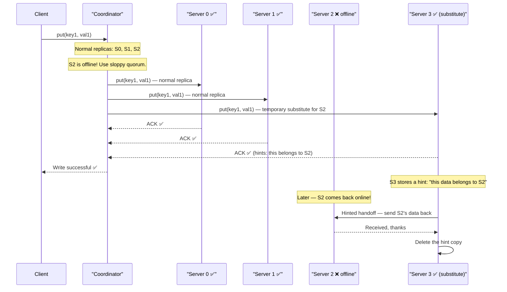
```mermaid
sequenceDiagram
    participant Client
    participant Coord as "Coordinator"
    participant S0 as "Server 0 ✅"
    participant S1 as "Server 1 ✅"
    participant S2 as "Server 2 ❌ offline"
    participant S3 as "Server 3 ✅ (substitute)"

    Client->>Coord: put(key1, val1)
    Note over Coord: Normal replicas: S0, S1, S2
    Note over Coord: S2 is offline! Use sloppy quorum.
    Coord->>S0: put(key1, val1) — normal replica
    Coord->>S1: put(key1, val1) — normal replica
    Coord->>S3: put(key1, val1) — temporary substitute for S2
    S0-->>Coord: ACK ✅
    S1-->>Coord: ACK ✅
    S3-->>Coord: ACK ✅ (hints: this belongs to S2)
    Coord-->>Client: Write successful ✅

    Note over S3: S3 stores a hint: "this data belongs to S2"

    Note over S2: Later — S2 comes back online!
    S3->>S2: Hinted handoff — send S2's data back
    S2-->>S3: Received, thanks
    S3->>S3: Delete the hint copy
```

This technique is called **hinted handoff**. S3 acts as a temporary substitute, stamps the data with a "hint" that it belongs to S2, and pushes it back once S2 recovers. High availability maintained, data consistency restored automatically.

### Permanent Failures: Anti-Entropy with Merkle Trees

What if a server fails permanently and its data is lost? Or two replicas slowly drift apart over time? We need a way to detect **exactly which keys** differ between replicas without comparing every single key-value pair (could be billions of keys!).

**Merkle trees** solve this with mathematical elegance.

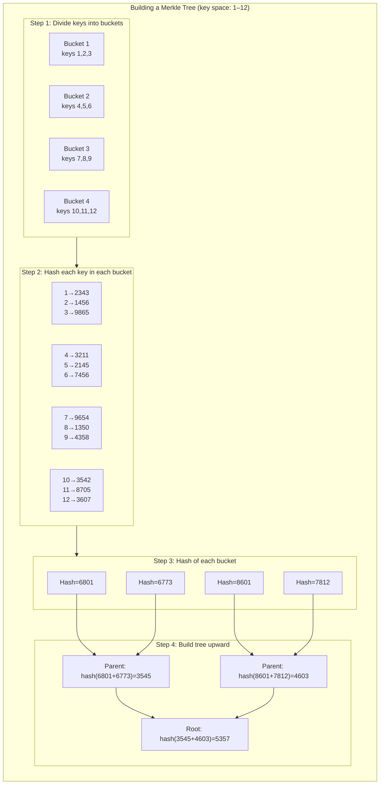
```mermaid
flowchart TD
    subgraph MERKLE_BUILD["Building a Merkle Tree (key space: 1–12)"]
        direction TB

        subgraph BUCKETS["Step 1: Divide keys into buckets"]
            B1["Bucket 1\nkeys 1,2,3"]
            B2["Bucket 2\nkeys 4,5,6"]
            B3["Bucket 3\nkeys 7,8,9"]
            B4["Bucket 4\nkeys 10,11,12"]
        end

        subgraph BUCKET_HASHES["Step 2: Hash each key in each bucket"]
            H1["1→2343\n2→1456\n3→9865"]
            H2["4→3211\n5→2145\n6→7456"]
            H3["7→9654\n8→1350\n9→4358"]
            H4["10→3542\n11→8705\n12→3607"]
        end

        subgraph LEAF_HASHES["Step 3: Hash of each bucket"]
            L1["Hash=6801"]
            L2["Hash=6773"]
            L3["Hash=8601"]
            L4["Hash=7812"]
        end

        subgraph INTERNAL["Step 4: Build tree upward"]
            I1["Parent: hash(6801+6773)=3545"]
            I2["Parent: hash(8601+7812)=4603"]
            ROOT["Root: hash(3545+4603)=5357"]
        end

        BUCKETS --> BUCKET_HASHES --> LEAF_HASHES
        L1 & L2 --> I1
        L3 & L4 --> I2
        I1 & I2 --> ROOT
    end
```

**Comparing two servers' Merkle trees:**

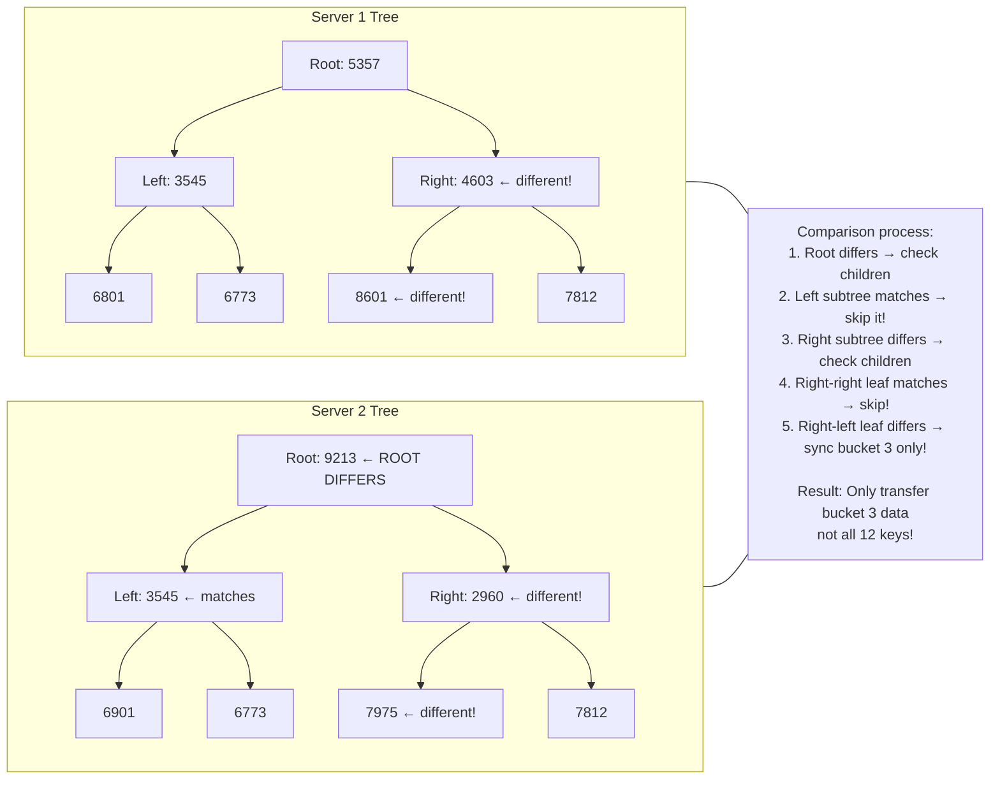
```mermaid
flowchart LR
    subgraph SERVER1["Server 1 Tree"]
        R1["Root: 5357"]
        IL1["Left: 3545"]
        IR1["Right: 4603 ← different!"]
        LL1["6801"]
        LR1["6773"]
        RL1["8601 ← different!"]
        RR1["7812"]

        R1 --> IL1 & IR1
        IL1 --> LL1 & LR1
        IR1 --> RL1 & RR1
    end

    subgraph SERVER2["Server 2 Tree"]
        R2["Root: 9213 ← ROOT DIFFERS"]
        IL2["Left: 3545 ← matches"]
        IR2["Right: 2960 ← different!"]
        LL2["6901"]
        LR2["6773"]
        RL2["7975 ← different!"]
        RR2["7812"]

        R2 --> IL2 & IR2
        IL2 --> LL2 & LR2
        IR2 --> RL2 & RR2
    end

    COMPARE["Comparison process:\n1. Root differs → check children\n2. Left subtree matches → skip it!\n3. Right subtree differs → check children\n4. Right-right leaf matches → skip!\n5. Right-left leaf differs → sync bucket 3 only!\n\nResult: Only transfer bucket 3 data\nnot all 12 keys!"]

    SERVER1 --- COMPARE
    SERVER2 --- COMPARE
```

**The genius:** We only synchronize the **data that differs**, not all data. If Server 1 has 1 billion keys and Server 2 has drifted on 1000 of them, a Merkle tree comparison will find exactly those 1000 keys in `O(log N)` operations — without reading all 1 billion keys.

In production, bucket sizes are huge — one million buckets for one billion keys means each bucket contains 1000 keys. The entire tree comparison is extremely efficient.

### Data Center Outage

The final failure scenario: an entire data center goes offline — earthquake, flood, power failure, ISP outage.

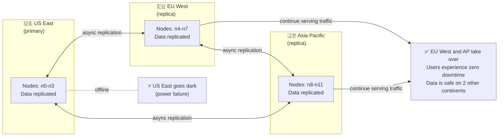
```mermaid
graph LR
    subgraph US["🇺🇸 US East\n(primary)"]
        US_N["Nodes: n0-n3\nData replicated"]
    end
    subgraph EU["🇪🇺 EU West\n(replica)"]
        EU_N["Nodes: n4-n7\nData replicated"]
    end
    subgraph AP["🇯🇵 Asia Pacific\n(replica)"]
        AP_N["Nodes: n8-n11\nData replicated"]
    end

    US_N <-->|"async replication"| EU_N
    EU_N <-->|"async replication"| AP_N
    AP_N <-->|"async replication"| US_N

    OUTAGE["⚡ US East goes dark\n(power failure)"]
    US_N -. "offline" .- OUTAGE

    RESULT["✅ EU West and AP take over\nUsers experience zero downtime\nData is safe on 2 other continents"]
    EU_N & AP_N -->|"continue serving traffic"| RESULT
```

This is why the major cloud providers (AWS, Google, Azure) obsess over **multi-region availability**. DynamoDB automatically replicates across availability zones within a region, and supports global tables across regions. An entire AWS region can fail — your application keeps running.

---

## Step 11 — System Architecture: Everything Together

Now let's look at the complete architecture. The beautiful thing about our design is that it's **completely decentralized** — every node is equal, there's no master, no single point of failure.

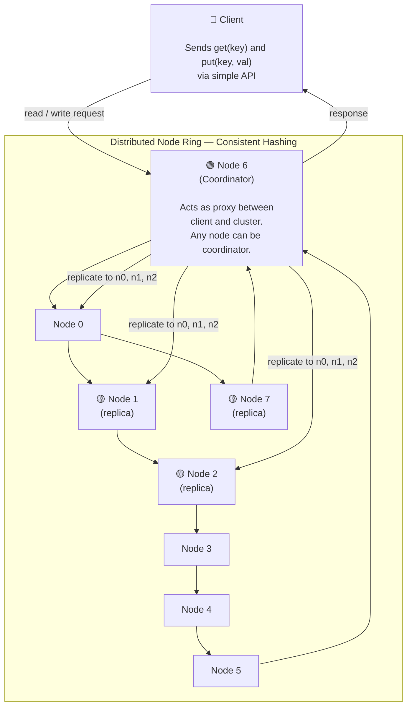
```mermaid
graph TD
    CLIENT["👤 Client\n\nSends get(key) and put(key, val)\nvia simple API"] 

    subgraph RING["Distributed Node Ring — Consistent Hashing"]
        COORD["🟢 Node 6\n(Coordinator)\n\nActs as proxy between\nclient and cluster.\nAny node can be coordinator."]
        N0["Node 0"]
        N1["🟡 Node 1\n(replica)"]
        N2["🟡 Node 2\n(replica)"]
        N3["Node 3"]
        N4["Node 4"]
        N5["Node 5"]
        N7["🟡 Node 7\n(replica)"]

        COORD --> N0 --> N7 --> COORD
        N0 --> N1 --> N2 --> N3 --> N4 --> N5 --> COORD
    end

    CLIENT -->|"read / write request"| COORD
    COORD -->|"replicate to n0, n1, n2"| N0 & N1 & N2
    COORD -->|"response"| CLIENT
```

**Every node is responsible for:**

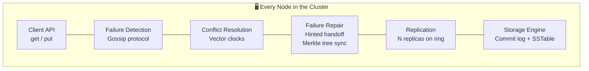
```mermaid
graph TD
    subgraph NODE["🖥️ Every Node in the Cluster"]
        direction LR
        API["Client API\nget / put"]
        FD["Failure Detection\nGossip protocol"]
        CR["Conflict Resolution\nVector clocks"]
        FR["Failure Repair\nHinted handoff\nMerkle tree sync"]
        REP["Replication\nN replicas on ring"]
        SE["Storage Engine\nCommit log + SSTable"]

        API --- FD --- CR --- FR --- REP --- SE
    end
```

No central coordinator. No master node to be a bottleneck. Any node can serve any request. The system grows by just adding more nodes to the ring — no configuration changes, no downtime, no resharding scripts.

---

## Step 12 — The Write Path: How Data Gets Stored

When a client writes `put("user:1001", "Alice Chen")`, what happens inside the node?

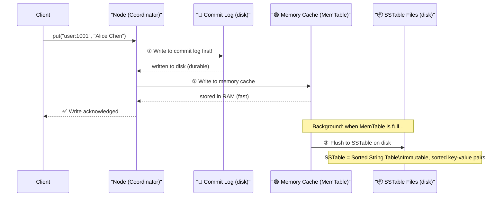
```mermaid
sequenceDiagram
    participant Client
    participant Node as "Node (Coordinator)"
    participant CommitLog as "💾 Commit Log (disk)"
    participant MemCache as "🟢 Memory Cache (MemTable)"
    participant SSTable as "📦 SSTable Files (disk)"

    Client->>Node: put("user:1001", "Alice Chen")

    Node->>CommitLog: ① Write to commit log first!
    CommitLog-->>Node: written to disk (durable)

    Node->>MemCache: ② Write to memory cache
    MemCache-->>Node: stored in RAM (fast)

    Node-->>Client: ✅ Write acknowledged

    Note over MemCache,SSTable: Background: when MemTable is full...
    MemCache->>SSTable: ③ Flush to SSTable on disk
    Note over SSTable: SSTable = Sorted String Table\nImmutable, sorted key-value pairs
```

**Why commit log first?** The commit log is the safety net. If the server crashes after writing to the commit log but before flushing to SSTable, the commit log replays on restart — no data loss. It's append-only (fast) and sequential (efficient disk I/O).

**Why memory cache (MemTable)?** Disk I/O is slow. By batching writes in memory and flushing periodically, we get much higher write throughput. Cassandra achieves hundreds of thousands of writes per second this way.

**What is an SSTable?** A Sorted-String Table — an immutable file on disk containing key-value pairs sorted by key. Once written, never modified. When you "update" a key, you write a new entry with a higher timestamp — the old entry is compacted away later.

---

## Step 13 — The Read Path: How Data Gets Retrieved

Reading involves checking multiple layers, from fastest (memory) to slowest (disk):

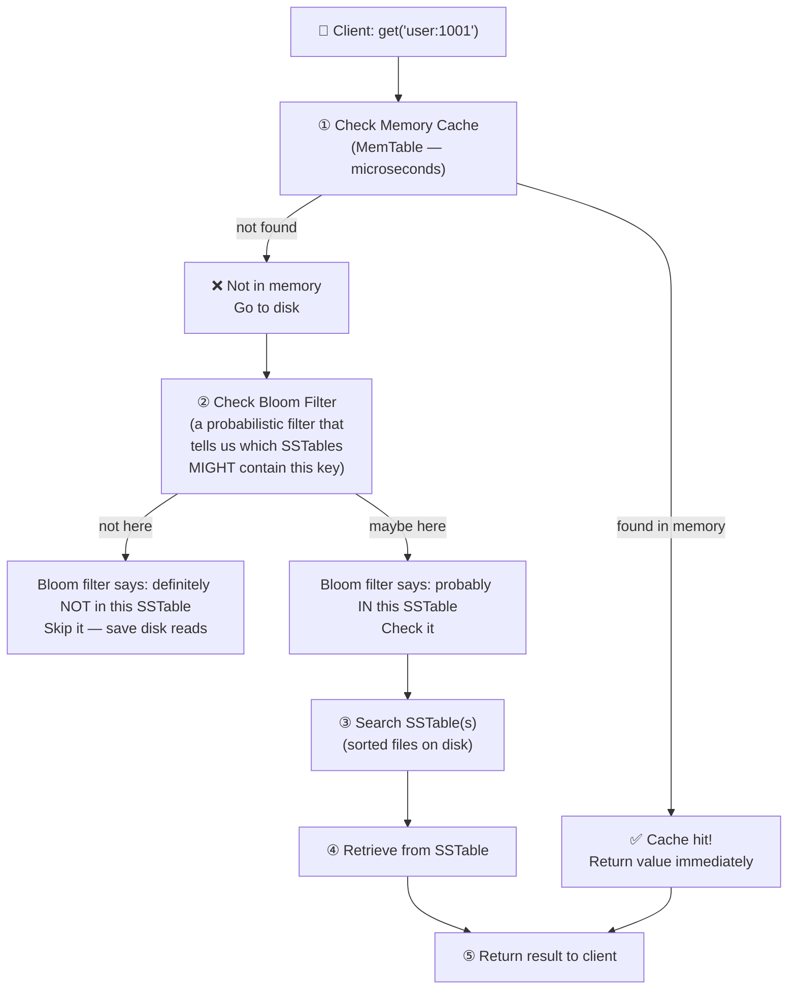
```mermaid
flowchart TD
    CLIENT["👤 Client: get('user:1001')"]

    STEP1["① Check Memory Cache\n(MemTable — microseconds)"]
    HIT["✅ Cache hit!\nReturn value immediately"]
    MISS["❌ Not in memory\nGo to disk"]

    STEP2["② Check Bloom Filter\n(a probabilistic filter that\ntells us which SSTables\nMIGHT contain this key)"]
    BLOOM_NO["Bloom filter says: definitely NOT in this SSTable\nSkip it — save disk reads"]
    BLOOM_YES["Bloom filter says: probably IN this SSTable\nCheck it"]

    STEP3["③ Search SSTable(s)\n(sorted files on disk)"]

    STEP4["④ Retrieve from SSTable"]

    STEP5["⑤ Return result to client"]

    CLIENT --> STEP1
    STEP1 -->|"found in memory"| HIT
    STEP1 -->|"not found"| MISS
    MISS --> STEP2
    STEP2 -->|"not here"| BLOOM_NO
    STEP2 -->|"maybe here"| BLOOM_YES
    BLOOM_YES --> STEP3
    STEP3 --> STEP4 --> STEP5
    HIT --> STEP5
```

**What is a Bloom Filter?**

A Bloom filter is a probabilistic data structure that answers the question: "Is this key in this SSTable?" in O(1) time with zero disk reads.

- If it says **NO** → definitely not in this SSTable. Skip it. (No false negatives)
- If it says **YES** → probably in this SSTable. Check it. (Small chance of false positive — you might check unnecessarily, but never skip the right SSTable)

Without bloom filters, a read might need to scan multiple SSTable files on disk. With bloom filters, you skip all the SSTables that definitely don't have your key and only read the right one(s). This is the difference between milliseconds and microseconds.

---

## The Complete Summary: Goals → Techniques

The book provides this beautiful summary table that maps every design goal to its technique:

| Goal / Problem | Technique Used |
|---|---|
| Ability to store big data | Consistent Hashing — spread load across servers |
| High availability reads | Data Replication + Multi-data center setup |
| Highly available writes | Versioning + Vector Clocks for conflict resolution |
| Dataset partition | Consistent Hashing |
| Incremental scalability | Consistent Hashing — add nodes without downtime |
| Heterogeneity | Consistent Hashing — more vnodes for powerful servers |
| Tunable consistency | Quorum Consensus (N, W, R knobs) |
| Handling temporary failures | Sloppy Quorum + Hinted Handoff |
| Handling permanent failures | Anti-entropy with Merkle Trees |
| Handling data center outage | Cross-data center replication |

Every technique connects to every other. This is not a collection of independent features — it's an integrated system where each mechanism compensates for the limitations of the others.

---

## How Real Systems Make These Trade-offs

```mermaid
graph TD
    subgraph DYNAMO["☁️ Amazon DynamoDB"]
        D1["AP system — availability first"]
        D2["Consistent hashing with virtual nodes"]
        D3["N=3 replication across 3 AZs"]
        D4["Tunable consistency (eventually consistent default)"]
        D5["Vector clocks for conflict resolution"]
        D6["Gossip protocol for failure detection"]
        D7["Sloppy quorum + hinted handoff"]
        D1 --- D2 --- D3 --- D4 --- D5 --- D6 --- D7
    end

    subgraph CASSANDRA["🔵 Apache Cassandra"]
        C1["AP system — tunable to CP"]
        C2["Token ring with vnodes (256 default)"]
        C3["Configurable replication factor"]
        C4["Consistency levels: ONE, QUORUM, ALL"]
        C5["Lightweight transactions (Paxos) for strong consistency"]
        C6["Gossip-based failure detection"]
        C7["Hinted handoff + Merkle tree sync"]
        C1 --- C2 --- C3 --- C4 --- C5 --- C6 --- C7
    end

    subgraph BIGTABLE["🟡 Google Bigtable"]
        B1["CP system — consistency first"]
        B2["Range-based partitioning (tablets)"]
        B3["Strong consistency via Chubby lock service"]
        B4["GFS for distributed storage"]
        B5["No eventual consistency — always consistent"]
        B1 --- B2 --- B3 --- B4 --- B5
    end
```

---

## Interview Quick Reference

```mermaid
mindmap
  root(("Key-Value Store\nDesign"))
    API
      put key value
      get key
      Simple two operations
    CAP Theorem
      Pick two of C A P
      P is always required
      Real choice is C vs A
      CP for banks
      AP for social media
    Partitioning
      Consistent hashing
      Virtual nodes for balance
      Automatic scaling
    Replication
      N replicas on ring
      Walk clockwise for unique servers
      Different data centers
    Quorum
      N replicas W writes R reads
      W plus R greater N = strong consistency
      Tunable per query in Cassandra
    Consistency Models
      Strong — always latest data
      Eventual — converges over time
      Weak — best effort
    Conflict Resolution
      Vector clocks
      Server version pairs
      Client resolves conflicts
    Failure Detection
      Gossip protocol
      Heartbeat counters
      2 sources to confirm offline
    Temporary Failures
      Sloppy quorum
      Skip offline servers
      Hinted handoff
      Data returned when server recovers
    Permanent Failures
      Anti-entropy protocol
      Merkle tree
      Compare root hashes
      Sync only differing buckets
    Write Path
      Commit log on disk first
      Memory cache MemTable
      Flush to SSTable when full
    Read Path
      Check memory first
      Bloom filter for SSTable lookup
      Read from SSTable if not in memory
```

---

## Key Takeaways

1. **A key-value store is the simplest possible database** — just `put` and `get`. But making it distributed and fault-tolerant requires solving some of the hardest problems in computer science.

2. **CAP theorem is not optional knowledge.** Every distributed system design decision traces back to it. In practice, P is always required — so you're always choosing between consistency and availability.

3. **Quorum consensus (N, W, R) gives you tunable consistency.** `W + R > N` guarantees strong consistency. `W + R ≤ N` gives you speed at the cost of potential staleness. Cassandra lets you choose per query.

4. **Vector clocks detect conflicts that timestamps can't.** Simultaneous writes from different clients create genuine conflicts. Vector clocks give you enough information to reconcile them — but push the reconciliation logic to the client.

5. **Gossip protocol scales to thousands of nodes.** Every node talks to a few random neighbors. Information propagates exponentially. No central coordinator needed.

6. **Merkle trees make replica sync blazingly efficient.** Instead of comparing all keys, you compare tree hashes and descend only into differing subtrees. Sync is proportional to differences, not total data size.

7. **The write path optimizes for durability and speed.** Commit log → MemTable → SSTable is a pattern used by Cassandra, HBase, LevelDB, and RocksDB. It's the foundation of modern write-optimized storage engines.

8. **Bloom filters make reads fast even with many SSTables.** A probabilistic filter that eliminates most unnecessary disk reads — critical when you have hundreds of SSTable files on disk.

---

## References and Further Reading

**The foundational papers**

- [Dynamo: Amazon's Highly Available Key-value Store](https://www.allthingsdistributed.com/files/amazon-dynamo-sosp2007.pdf) — SOSP 2007. Consistent hashing, vector clocks, quorums, hinted handoff and Merkle trees all in one paper. If you read one thing, read this
- [Bigtable: A Distributed Storage System for Structured Data](https://static.googleusercontent.com/media/research.google.com/en//archive/bigtable-osdi06.pdf) — OSDI 2006. Where SSTables and the LSM-tree write path come from
- [Cassandra: A Decentralized Structured Storage System](https://www.cs.cornell.edu/projects/ladis2009/papers/lakshman-ladis2009.pdf) — Dynamo's ideas plus a Bigtable data model

**Mechanisms in detail**

- [Merkle tree](https://en.wikipedia.org/wiki/Merkle_tree) — how anti-entropy compares replicas without shipping the data
- [Bloom filter](https://en.wikipedia.org/wiki/Bloom_filter) — how a read skips SSTables that cannot contain the key
- [SSTable and log-structured storage: LevelDB](https://www.igvita.com/2012/02/06/sstable-and-log-structured-storage-leveldb/) — Ilya Grigorik, the clearest walkthrough of the write path
- [Cassandra architecture](https://cassandra.apache.org/doc/latest/cassandra/architecture/) — the same ideas as shipped code

**Implementations**

- [Amazon DynamoDB](https://aws.amazon.com/dynamodb/), [Apache Cassandra](https://cassandra.apache.org/), [Redis](https://redis.io/), [memcached](https://memcached.org/)
- [Amazon DynamoDB: A Scalable, Predictably Performant, and Fully Managed NoSQL Database Service](https://www.usenix.org/system/files/atc22-elhemali.pdf) — USENIX ATC 2022. What Amazon actually changed in the fifteen years after the Dynamo paper, and notably it abandoned vector clocks for a managed, single-leader-per-partition design. Newer than the book and a strong point to raise
- [RocksDB](https://rocksdb.org/) — the LSM engine underneath a large share of modern stores

**Going deeper**

- *Designing Data-Intensive Applications* — Martin Kleppmann. Chapters 5, 6 and 9 cover replication, partitioning and consistency far more rigorously than any interview guide
- [Jepsen](https://jepsen.io/analyses) — Kyle Kingsbury's consistency analyses. Sobering reading on what these systems actually guarantee under partition

---

## What's Next?

In **Chapter 7**, we'll design a **Unique ID Generator in Distributed Systems** — tackling the surprisingly complex problem of generating globally unique, sortable, numeric IDs at 10,000+ IDs per second without any central coordination. We'll look at multi-master replication, UUIDs, ticket servers, and the famous Twitter Snowflake approach.

*Every concept in this chapter builds on the previous ones — if you understand consistent hashing, quorum, and gossip, the rest of distributed systems becomes much more approachable. You're building a mental model that compounds.*
