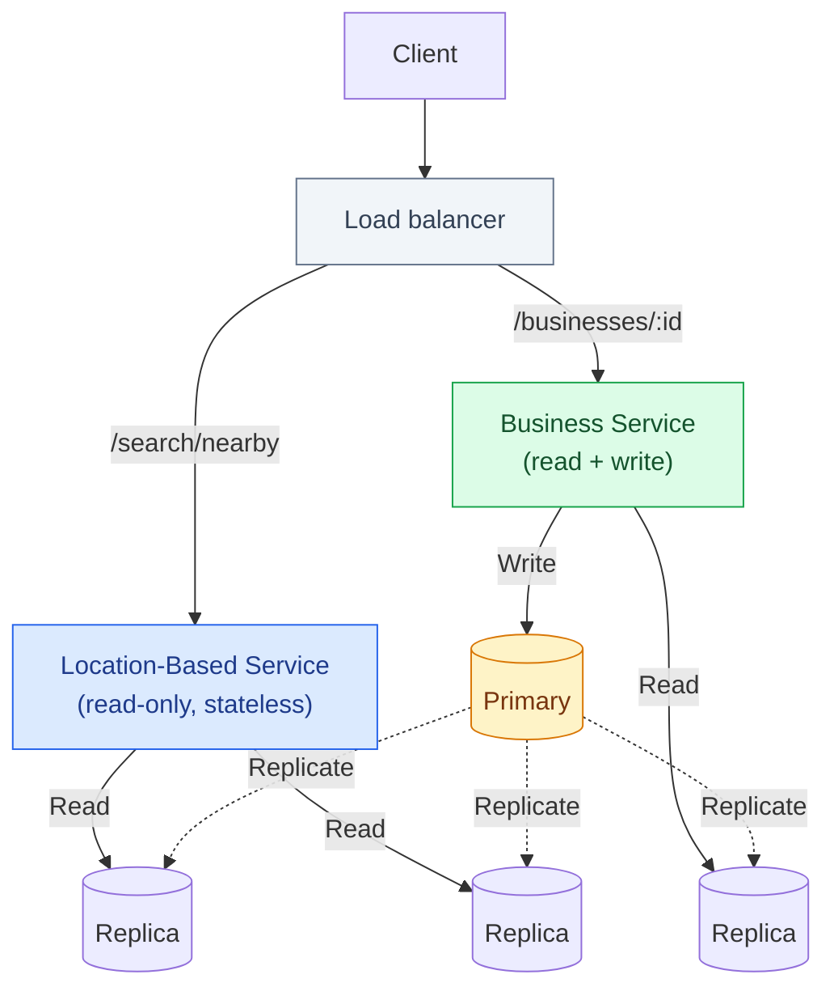
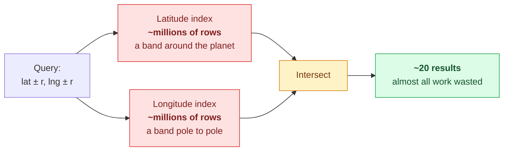
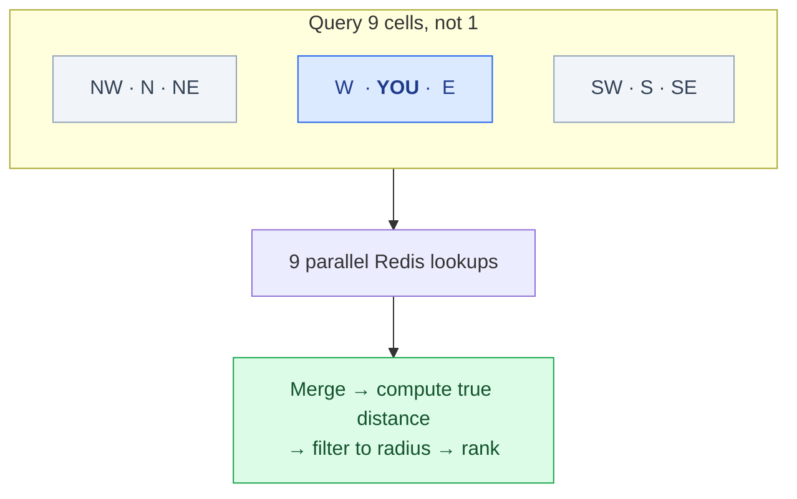
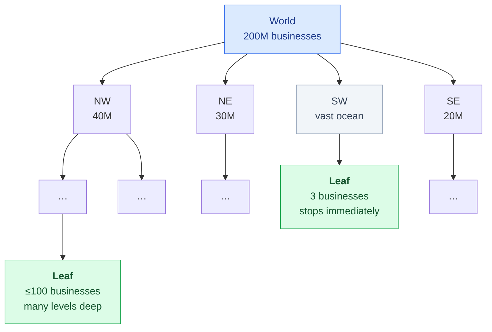
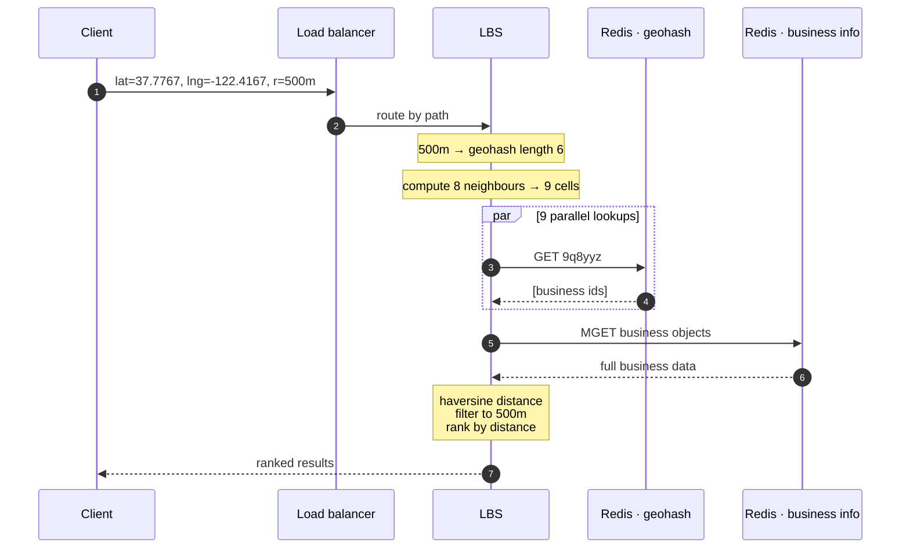
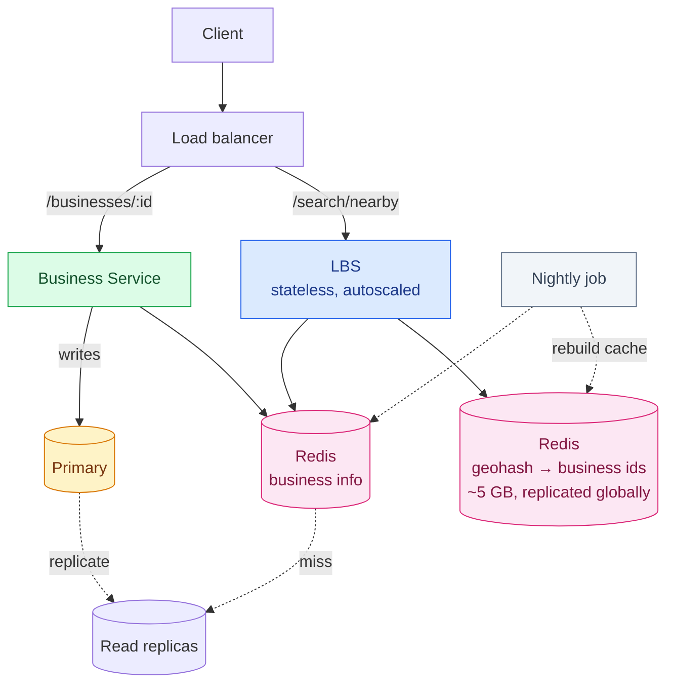

You open Yelp and tap **restaurants near me**.

Under a second later, you have a ranked list. Somewhere behind that tap, a system just searched 200 million businesses, found the handful within 500 metres of you, sorted them by distance, and shipped them back — while doing the same thing for a few thousand other people that second.

The obvious implementation is a `WHERE` clause on latitude and longitude. It does not work, and *why* it does not work is one of the more interesting failures in system design: the query is perfectly indexable in each dimension separately, and that turns out to be useless.

This chapter is about the fix. The short version is that **you cannot index two dimensions at once, so you fold them into one.** Every serious geospatial system — Geohash, Google's S2, Uber's H3 — is a different answer to the question of how to do that folding well.

---

## Step 1 — Scope the problem

### The conversation

Before designing anything, pin down what "nearby" means. A realistic exchange:

**Can the user set the search radius?** Yes — 0.5 km, 1 km, 2 km, 5 km, and 20 km.

**What if there aren't enough businesses in that radius?** Handle the fixed radius first; expanding the search is a good follow-up if time allows.

**How do businesses get added and updated?** Owners can add, edit and delete. Crucially: **there is a business agreement that changes take effect the next day.** That single sentence is worth more than it looks — it turns cache invalidation from a hard real-time problem into a nightly batch job.

**Does the result need to follow a moving user?** No. Assume walking speed, no constant refresh.

### Functional requirements

- Return all businesses near a user's location (latitude/longitude) within a given radius.
- Business owners can add, delete and update businesses. **Not** reflected in real time.
- Customers can view a business's detail page.

### Non-functional requirements

- **Low latency.** Nearby results should feel instant.
- **Data privacy.** Location is among the most sensitive data a system can hold. GDPR and CCPA apply, and some jurisdictions require that location data never leaves the country.
- **High availability and scalability.** Traffic is extremely spiky — dinner time in a dense city is nothing like 4 a.m. in a rural one.

### Back-of-the-envelope

Assume **100 million daily active users** and **200 million businesses**.

Seconds in a day is 86,400, which we round to 10⁵ — the standard trick throughout this series, and it makes the arithmetic something you can do out loud.

If each user runs **5 searches a day**:

```
Search QPS = (100,000,000 × 5) / 100,000 = 5,000
```

**5,000 QPS.** Note how modest that is. This is not a scale problem — a handful of servers can serve 5,000 QPS of almost anything. It is a *data structure* problem. Get the index right and the hardware is easy; get it wrong and no amount of hardware saves you.

---

## Step 2 — High-level design

### The API

Two families of endpoint. Search:

```
GET /v1/search/nearby
```

| Field | Description | Type |
|---|---|---|
| `latitude` | Latitude of the search origin | decimal |
| `longitude` | Longitude of the search origin | decimal |
| `radius` | Optional. Default 5,000 m (about 3 miles) | int |

Returning:

```json
{
  "total": 10,
  "businesses": [ { "business object" } ]
}
```

The objects here only need what the *result list* renders — name, distance, rating, thumbnail. The detail page needs photos, reviews, and hours, which is a separate call. Sending everything up front would multiply the response size for data most users never look at.

And business CRUD:

| API | Detail |
|---|---|
| `GET /v1/businesses/:id` | Detailed information about a business |
| `POST /v1/businesses` | Add a business |
| `PUT /v1/businesses/:id` | Update a business |
| `DELETE /v1/businesses/:id` | Delete a business |

### Read/write ratio

Reads dominate, overwhelmingly. Searching and viewing happen constantly; adding or editing a business is rare. A restaurant's address changes maybe once in its lifetime.

That ratio drives everything downstream: it justifies a relational database with read replicas, it makes aggressive caching safe, and it means we can afford an index that is expensive to update but very cheap to query.

### High-level architecture

Two services, split by their opposite traffic shapes.



The **Location-Based Service (LBS)** is the interesting half: high QPS, read-only, completely stateless, and therefore trivially horizontally scalable. Add servers at dinner time, remove them at 3 a.m.

The **Business Service** handles both owner writes (low volume) and detail-page reads (high volume).

Replication lag between primary and replicas is fine here. If a restaurant's new phone number takes thirty seconds to appear, nobody notices — and we already agreed changes only take effect the next day.

---

## The core problem: why two-dimensional search fails

Here is the naive approach, and it is worth understanding properly before dismissing it.

Draw a box around the user and query it:

```sql
SELECT business_id, latitude, longitude
FROM business
WHERE  latitude  BETWEEN {:my_lat}  - radius AND {:my_lat}  + radius
  AND  longitude BETWEEN {:my_long} - radius AND {:my_long} + radius
```

Full table scan across 200 million rows. Obviously bad.

**So add indexes on `latitude` and `longitude`.** This is the part people get wrong, because it feels like it should work.

It doesn't, and here's why. The database can use *one* index efficiently. Suppose it picks latitude: it retrieves every business in a horizontal band that wraps the entire planet. Millions of rows — everything at your latitude, from San Francisco to Seville. Then it does the same for longitude, getting a vertical band from pole to pole. Now it has to **intersect two enormous sets** to find the tiny overlap you actually asked for.



A B-tree index is a one-dimensional structure. It sorts things along a line. Latitude and longitude are two independent lines, and *proximity in 2D is not proximity along either one*. Two restaurants across the street from each other may sit at opposite ends of the longitude index.

Which gives us the question the entire field is built around:

> **Can we map two-dimensional space onto one dimension, in a way that keeps nearby things nearby?**

Yes. Imperfectly — and the imperfections are exactly where the interesting engineering lives.

---

## Option 1: An evenly divided grid

The simplest idea: chop the world into fixed-size squares. Each business belongs to exactly one square. To search, look in your square and its neighbours.

This works, and it has one fatal flaw: **the world is not evenly populated.**

A grid fine enough to be useful in Manhattan produces hundreds of millions of empty cells over the Pacific. A grid coarse enough to be efficient over the Pacific puts 40,000 restaurants in a single Manhattan cell. There is no cell size that is right for both, because the underlying data varies in density by many orders of magnitude.

What we want is **small cells where it's dense, large cells where it's sparse.** Hold that thought — it's the entire argument for quadtrees.

---

## Option 2: Geohash

Geohash reduces a latitude/longitude pair to a short string like `9q9hvu`. It is the most widely deployed geospatial index in the world, and the mechanism is genuinely simple.

### How it works

Start with the whole planet. Cut it in half by longitude. Is your point in the left half or the right half? Left is `0`, right is `1`. Now cut the surviving half by latitude: bottom is `0`, top is `1`.

Repeat, alternating longitude and latitude, each bit halving the remaining area. Then group the bits in fives and encode each group as one base-32 character.

That's the whole algorithm. Each additional character makes the cell about 32× smaller.

- **Google HQ** → `1001 10110 01001 10000 11011 11010` → **`9q9hvu`**
- **Facebook HQ** → `1001 10110 01001 10001 10000 10111` → **`9q9jhr`**

Note that those two share the prefix `9q9` — they are about 10 km apart. **The longer the shared prefix, the closer two points are.** That property is what makes the whole thing work: a proximity query becomes a prefix query, and prefix queries are exactly what B-trees are good at.

### Try it

The widget below runs the real algorithm. Drag the precision slider and watch the cell shrink; the coloured bits show which are longitude (blue) and which are latitude (pink).

<div class="geohash-demo" id="gh-demo"><div class="gh-controls"><div class="gh-field"><label for="gh-lat">Latitude</label><input type="number" id="gh-lat" value="37.4220" step="0.0001" min="-90" max="90"></div><div class="gh-field"><label for="gh-lng">Longitude</label><input type="number" id="gh-lng" value="-122.0840" step="0.0001" min="-180" max="180"></div></div><div class="gh-presets"><button data-lat="37.4220" data-lng="-122.0840">Google HQ</button><button data-lat="37.4847" data-lng="-122.1477">Meta HQ</button><button data-lat="45.1500" data-lng="0.1500">La Roche-Chalais</button><button data-lat="44.9300" data-lng="-0.1900">Pomerol</button><button data-lat="40.7580" data-lng="-73.9855">Times Square</button></div><div class="gh-field gh-slider"><label for="gh-prec">Precision <span id="gh-prec-val">6</span> characters</label><input type="range" id="gh-prec" min="1" max="12" value="6"></div><div class="gh-out"><div class="gh-hash-label">GEOHASH</div><div class="gh-hash" id="gh-hash">9q9hvu</div></div><div class="gh-bits" id="gh-bits"></div><div class="gh-legend"><span><i class="gh-sw-lng"></i> longitude bit</span><span><i class="gh-sw-lat"></i> latitude bit</span></div><table class="gh-table"><tbody><tr><td>Cell size</td><td id="gh-size">—</td></tr><tr><td>Latitude range</td><td id="gh-latr">—</td></tr><tr><td>Longitude range</td><td id="gh-lngr">—</td></tr></tbody></table></div>
<script>
(function () {
  var B32 = "0123456789bcdefghjkmnpqrstuvwxyz";
  function encode(lat, lng, prec) {
    var latI = [-90, 90], lngI = [-180, 180];
    var bits = [], even = true, out = "", chunk = [];
    while (out.length < prec) {
      for (var i = 0; i < 5; i++) {
        var b;
        if (even) {
          var m = (lngI[0] + lngI[1]) / 2;
          if (lng > m) { b = 1; lngI[0] = m; } else { b = 0; lngI[1] = m; }
        } else {
          var n = (latI[0] + latI[1]) / 2;
          if (lat > n) { b = 1; latI[0] = n; } else { b = 0; latI[1] = n; }
        }
        bits.push({ bit: b, axis: even ? "lng" : "lat" });
        chunk.push(b);
        even = !even;
      }
      out += B32[chunk[0] * 16 + chunk[1] * 8 + chunk[2] * 4 + chunk[3] * 2 + chunk[4]];
      chunk = [];
    }
    return { hash: out, bits: bits, latI: latI, lngI: lngI };
  }
  function metres(latI, lngI) {
    var dLat = (latI[1] - latI[0]) * 111320;
    var midLat = (latI[0] + latI[1]) / 2;
    var dLng = (lngI[1] - lngI[0]) * 111320 * Math.cos(midLat * Math.PI / 180);
    return [dLat, dLng];
  }
  function fmt(m) {
    if (m >= 1000) return (m / 1000).toFixed(m >= 10000 ? 0 : 1) + " km";
    if (m >= 1) return m.toFixed(m >= 100 ? 0 : 1) + " m";
    return (m * 100).toFixed(1) + " cm";
  }
  var elLat = document.getElementById("gh-lat"),
      elLng = document.getElementById("gh-lng"),
      elPrec = document.getElementById("gh-prec"),
      elPrecVal = document.getElementById("gh-prec-val"),
      elHash = document.getElementById("gh-hash"),
      elBits = document.getElementById("gh-bits"),
      elSize = document.getElementById("gh-size"),
      elLatR = document.getElementById("gh-latr"),
      elLngR = document.getElementById("gh-lngr");
  if (!elLat) return;
  function render() {
    var lat = parseFloat(elLat.value), lng = parseFloat(elLng.value);
    var prec = parseInt(elPrec.value, 10);
    elPrecVal.textContent = prec;
    if (isNaN(lat) || isNaN(lng) || lat < -90 || lat > 90 || lng < -180 || lng > 180) {
      elHash.textContent = "invalid"; elBits.innerHTML = ""; return;
    }
    var r = encode(lat, lng, prec);
    elHash.textContent = r.hash;
    var html = "";
    for (var i = 0; i < r.bits.length; i++) {
      if (i % 5 === 0) html += (i > 0 ? "</span>" : "") + '<span class="gh-group">';
      html += '<span class="gh-bit gh-' + r.bits[i].axis + '">' + r.bits[i].bit + "</span>";
    }
    if (html) html += "</span>";
    elBits.innerHTML = html;
    var d = metres(r.latI, r.lngI);
    elSize.textContent = fmt(d[1]) + " × " + fmt(d[0]);
    elLatR.textContent = r.latI[0].toFixed(5) + " to " + r.latI[1].toFixed(5);
    elLngR.textContent = r.lngI[0].toFixed(5) + " to " + r.lngI[1].toFixed(5);
  }
  [elLat, elLng, elPrec].forEach(function (el) {
    el.addEventListener("input", render);
  });
  var btns = document.querySelectorAll("#gh-demo .gh-presets button");
  for (var i = 0; i < btns.length; i++) {
    btns[i].addEventListener("click", function () {
      elLat.value = this.getAttribute("data-lat");
      elLng.value = this.getAttribute("data-lng");
      render();
    });
  }
  render();
})();
</script>

### Choosing a precision

Each character costs you a factor of ~32 in area. The standard table:

| Length | Cell width × height |
|---:|---|
| 1 | 5,009 km × 4,993 km |
| 2 | 1,252 km × 624 km |
| 3 | 156 km × 156 km |
| 4 | 39.1 km × 19.5 km |
| 5 | 4.9 km × 4.9 km |
| **6** | **1.2 km × 610 m** |
| 7 | 153 m × 152 m |
| 8 | 38 m × 19 m |

For this design we only care about lengths **4 to 6**. Shorter than 4 and the cell is a country; longer than 6 and the cell is smaller than a city block, so you would need to scan hundreds of neighbours.

The rule is: **pick the shortest geohash whose cell still covers the user's search circle.**

| Radius | Geohash length |
|---|---:|
| 0.5 km | 6 |
| 1 km | 5 |
| 2 km | 5 |
| 5 km | 4 |
| 20 km | 4 |

### Boundary problem 1: neighbours with nothing in common

Here is where the naive implementation breaks.

`SELECT * FROM geohash_index WHERE geohash LIKE '9q8zn%'` looks correct. It is not, because **the reverse of the prefix property is false.** A long shared prefix means two points are close. But two points being close does *not* guarantee a shared prefix.

The book's example is perfect, and you can reproduce it in the widget above. In France:

- **La Roche-Chalais** → `u000`
- **Pomerol** → `ezzz`

They are **30 km apart**. Their geohashes share *not a single character*.

Why? Because the very first bit splits the world at the prime meridian, and these two towns sit on opposite sides of it. Split at the top of the tree and you never rejoin, no matter how physically close the points are. The same happens at the equator, and — worse — at the ±180° line.

### Boundary problem 2: same neighbourhood, different cell

The subtler version: two points can share a long prefix and *still* be in different cells. Any grid has edges, and a user standing near one will have the best restaurant just across the line.

**The fix for both is the same:** don't query only your cell. Query your cell *and all eight neighbours*.



Neighbour geohashes can be computed in constant time from the hash itself — no lookup required. And since the nine reads are independent, fire them in parallel and pay the latency of the slowest one, not the sum.

This also explains why you always compute **real distances** at the end. The grid is a coarse filter to shrink the candidate set from 200 million to a few hundred. The precise answer comes from the haversine formula on those few hundred.

### Not enough results?

If nine cells don't yield enough businesses — quite likely in rural areas — **drop the last character of the geohash and search again.** One character shorter is one cell ~32× larger. Keep dropping until you have enough.

This is remarkably elegant: zooming out is a string truncation.

---

## Option 3: Quadtree

A quadtree attacks the density problem head-on. Instead of a fixed grid, **subdivide only where the data is dense.**

Start with the whole world as one node. If it contains more than 100 businesses, split it into four quadrants. Recurse into each. Stop when a node holds 100 or fewer.



```java
public void buildQuadtree(TreeNode node) {
    if (countBusinessesInGrid(node) > 100) {
        node.subdivide();
        for (TreeNode child : node.getChildren()) {
            buildQuadtree(child);
        }
    }
}
```

The result is exactly what we wanted: **dense areas get deep, fine subdivisions; empty ocean stops after one level.** Manhattan ends up many levels deeper than the Pacific.

### Does it fit in memory?

This is the calculation interviewers love, and it's quick.

**Leaf node** — two corner coordinate pairs (32 bytes) plus up to 100 business IDs at 8 bytes each (800 bytes) = **832 bytes**.

**Internal node** — two corner coordinate pairs (32 bytes) plus four child pointers (32 bytes) = **64 bytes**.

With 100 businesses per leaf:

- Leaf nodes = 200M ÷ 100 = **2 million**
- Internal nodes ≈ 2M ÷ 3 = **0.67 million** *(in a full quadtree, internal nodes are about a third of the leaves)*
- Total ≈ (2M × 832) + (0.67M × 64) ≈ **1.71 GB**

**1.71 GB.** The entire spatial index for every business on Earth fits comfortably in the RAM of one ordinary server.

This number matters more than it appears, and we will use it again in the deep dive to reject a bad decision.

### The operational catch

A quadtree is an in-memory structure built at server startup. Building it over 200 million businesses **takes minutes**, and during those minutes the server cannot serve traffic.

That has real consequences:

- **Roll out incrementally.** Restarting the fleet at once takes the whole service offline. Deploy to a few servers at a time.
- **Blue/green is possible but brutal on the database** — an entire new cluster pulling 200 million rows simultaneously is a self-inflicted thundering herd.
- **Updates are awkward.** Rebuilding incrementally means some servers serve stale data for a while. Acceptable here — remember the next-day agreement.
- **Live updates are worse than they look.** Mutating a shared tree from multiple threads needs locking, and rebalancing a quadtree when a leaf overflows is genuinely fiddly.

That startup cost is the real price of a quadtree, and it is easy to overlook while admiring the data structure.

---

## Option 4: Google S2

S2 takes a different route. It projects the sphere onto the six faces of a cube, then walks each face with a **Hilbert curve** — a space-filling curve that visits every cell exactly once.

The Hilbert curve's defining property is exactly what we need: **points close together on the 1D curve are close together in 2D space.** Unlike geohash's Z-order curve, the Hilbert curve never makes long jumps, so locality holds up much better at boundaries.

Two things make S2 stand out:

**Geofencing.** S2 can cover an arbitrary shape — a school zone, a delivery area, a country border — with cells at *mixed* levels: large cells in the interior, small cells hugging the edge. Geohash, with its fixed precision, cannot do this without a lot of extra machinery.

**Region Cover.** Rather than fixing a precision up front, you specify a minimum level, a maximum level, and a maximum cell count, and S2 picks the best combination. The result approximates your query region far more tightly than a uniform grid.

The cost is complexity. S2 is a large, subtle library, and explaining its internals under interview pressure is a poor use of your time.

---

## Option 5: Uber H3 — the hexagon argument

H3 is not in the book, and by 2026 it is too widely used to leave out. It is also the option with the most interesting *design* argument behind it.

### Why hexagons?

Start with a question that sounds pedantic and isn't: **how far away is your neighbour?**

In a square grid, there are two answers. Four neighbours share an edge with you. Four more touch only at a corner, and those are √2 times further away. Any analysis over the grid — smoothing, diffusion, "how busy is the area around this cell" — needs two sets of coefficients and a decision about whether corner-touching even counts as adjacent.

In a hexagonal grid, **every neighbour is the same distance away.** All six share an edge; none touch at a corner. As Uber puts it, this "greatly simplifies performing analysis and smoothing over gradients."

For Uber's actual problem — measuring supply and demand across a city to compute surge pricing — that uniformity is not cosmetic. It is the difference between a clean model and one full of correction factors.

### The projection, and the twelve pentagons

Geohash projects onto a rectangle, which is why its cells stretch badly near the poles. S2 projects onto a cube, which is much better. H3 projects onto an **icosahedron** — a 20-sided solid — which is better still, because it hugs the sphere more closely and cell sizes vary less.

But there is a mathematical catch that H3 cannot escape, and it is a nice piece of trivia: **you cannot tile a sphere with hexagons alone.** Every hexagonal tiling of a sphere needs exactly twelve pentagons. H3 has twelve, one at each vertex of the icosahedron.

Uber's response is delightfully pragmatic: they used Buckminster Fuller's orientation of the icosahedron, which **puts all twelve vertices in the ocean.** The pentagons still exist, they are just somewhere no one is hailing a ride.

### Resolutions

H3 has 16 resolutions, 0 to 15:

| Resolution | Cells worldwide | Avg. hexagon area | Avg. edge |
|---:|---:|---:|---:|
| 0 | 122 | 4,357,449 km² | 1,281 km |
| 3 | 41,162 | 12,393 km² | 69 km |
| 5 | 2,016,842 | 253 km² | 9.9 km |
| 7 | 98,825,162 | 5.16 km² | 1.4 km |
| **9** | **4,842,432,842** | **0.105 km²** | **201 m** |
| 12 | 1.66 × 10¹² | 0.0003 km² | 11 m |
| 15 | 5.70 × 10¹⁴ | 0.9 m² | 0.6 m |

Resolution 9 — roughly a city block — is the common working resolution for ride-hailing.

### The property that matters operationally

Encoding is **O(1) with no data structure to maintain.** `latLngToCell(lat, lng, res)` is pure arithmetic. There is no tree to build, no startup cost, no warmup, no rebalancing.

Compare that with the quadtree's multi-minute startup and its locking problems on update, and you can see why H3 wins for **moving objects**. Re-encoding a driver's position every few seconds across millions of drivers is millions of cheap function calls, not millions of tree mutations.

For *this* chapter's problem — static businesses, fixed radius — H3's advantage is smaller. Businesses don't move. But it is worth knowing exactly which property you are paying for.

---

## Choosing between them

| | Geohash | Quadtree | S2 | H3 |
|---|---|---|---|---|
| **Structure** | String prefix | In-memory tree | Hilbert curve on a cube | Hexagons on an icosahedron |
| **Adapts to density** | ✗ fixed cell size | ✓ that's the point | ✓ via region cover | ✗ fixed per resolution |
| **Build cost** | None | Minutes at startup | None | None |
| **Update cost** | Delete one row | Traverse + maybe rebalance | Low | None |
| **k-nearest-neighbour** | Awkward | ✓ natural fit | ✓ | ✓ |
| **Geofencing** | Poor | Moderate | ✓ best in class | Good |
| **Uniform neighbours** | ✗ | ✗ | ✗ | ✓ only one |
| **Used by** | Redis, MongoDB, Bing, Lyft | Yext | Google Maps, Tinder | Uber, and much of the analytics world |

**Recommendation for this design: geohash.** The data is static, the radii are fixed, and the index updates are trivially simple. Geohash's inability to adapt to density is largely paid off by caching, and its simplicity is worth a great deal.

**In an interview, pick geohash or quadtree.** Both can be explained completely in a few minutes. S2 and H3 cannot, and reaching for them mostly signals that you have read about them rather than used them.

---

## Step 3 — Deep dive

### Scaling the business table

Straightforward: **shard by `business_id`.** Business IDs are uniformly distributed, so load spreads evenly, and every lookup is by ID anyway.

### The geospatial index table

Two ways to lay it out.

**Option A — one row per geohash**, with a JSON array of business IDs:

| geohash | list_of_business_ids |
|---|---|
| `9q8zn` | `[1, 5, 12, ...]` |

**Option B — one row per (geohash, business)** pair:

| geohash | business_id |
|---|---|
| `9q8zn` | 1 |
| `9q8zn` | 5 |
| `9q8zn` | 12 |

**Option B, decisively.** Option A looks more compact, but every mutation becomes a nightmare: to update a business you fetch the array, scan it, modify it, and write it back. To insert, you scan the whole array checking for duplicates. And you must lock the row throughout, or two concurrent writers will silently clobber each other.

With a compound key of `(geohash, business_id)`, adding is an `INSERT` and removing is a `DELETE`. No read-modify-write, no locking, no lost updates.

**This is a general principle worth carrying elsewhere.** A collection stored as one blob turns every write into a read-modify-write cycle, and every read-modify-write cycle is a concurrency bug waiting for enough traffic to show up.

### Sharding the index — don't

Here is where a lot of candidates go wrong, and it's a trap made of good instincts.

Asked to scale a table, the reflex is "shard it." But look at the number we computed earlier: **the entire index is about 1.71 GB.** It fits in the working set of any modern database server with room to spare.

Sharding buys nothing here and costs plenty — routing logic in the application layer, cross-shard queries, rebalancing, a much harder operational story.

The actual constraint is not storage, it is **read throughput**. And the right tool for read throughput on a small dataset is **read replicas**. Simple, well understood, and it scales exactly the dimension that is under pressure.

> **The lesson:** sharding solves *data too big for one machine*. Replication solves *too many reads for one machine*. Diagnose which one you actually have before reaching for either.

### Caching — do we even need it?

Also worth questioning rather than assuming.

The dataset is small enough to sit entirely in the database's buffer pool. Queries are not I/O-bound; they are already served from memory. A cache in front of a database that is already answering from RAM adds a network hop, an invalidation problem, and a new failure mode — in exchange for very little.

If read throughput is the problem, replicas are the simpler fix.

That said, at 5,000 QPS with global users, caching is a reasonable call. So let's do it properly.

#### The cache key is the interesting part

The obvious key is the user's latitude and longitude. **This is a bad key, and understanding why is the point.**

Phone GPS coordinates are estimates. Stand perfectly still and request your position twice, and you get two slightly different answers. Every request produces a distinct key. Your hit rate is approximately zero, and you have built an elaborate machine for caching nothing.

You want small changes in position to map to the *same* key — and that is exactly what a geohash gives you. Everyone in a 1.2 km × 610 m cell shares a key.

**The index we chose for querying turns out to be the right cache key too.** That is not a coincidence: both jobs need "close enough to be treated as the same place."

#### What to cache

| Key | Value |
|---|---|
| `geohash` | List of business IDs in that cell |
| `business_id` | The full business object |

The user can pick four radii, mapping to geohash lengths 4, 5, and 6. Precompute and cache all three:

```
Storage = 8 bytes × 200 million × 3 precisions ≈ 5 GB
```

**5 GB** — one Redis server, comfortably. Which means we can afford to replicate the *entire* cache to every region rather than partition it, so no user ever pays a cross-continent round trip for a cache read.

Invalidation is a non-problem, thanks to that requirement from Step 1: a **nightly job** rebuilds the cache. The one thing to watch is that expiring millions of keys simultaneously hammers the cache servers, so stagger the TTLs.

### Regions and availability zones

Deploy the LBS to multiple regions:

- **Latency.** A user in Frankfurt should not be querying Oregon. Physics sets a floor, and the only fix is to be closer.
- **Load shaping.** Population density is wildly uneven. Dense regions can be given their own capacity rather than competing with everyone else.
- **Privacy law.** Some countries require citizens' data to stay within their borders. A regional deployment plus DNS routing satisfies that requirement structurally, rather than through policy and hope.

That third point is the one people forget, and for a location service it may be the binding constraint — GDPR treats location as a special category of personal data.

### Filtering by opening hours or category

A likely follow-up: *only show restaurants that are open now.*

The answer is easy, and it's easy **because of the design**. After the geohash lookup, the candidate set is a few hundred businesses, not 200 million. Filtering a few hundred objects in the application layer is free.

Trying to filter 200 million rows on `is_open AND category = 'restaurant' AND` a spatial predicate would be a nightmare. Reducing the candidate set first makes every subsequent question cheap. **Order of operations is the whole trick.**

---

## What you'd actually use in production

The chapter teaches you to build this from parts. In practice you'd reach for something existing — but you should know what it's doing.

### Redis

Redis has native geospatial support, and the implementation is a nice piece of design: a **geo set is just a sorted set** whose score is a 52-bit geohash integer. Everything else falls out of sorted-set operations, which is why Redis got geo support without a new data type.

```
GEOADD businesses -122.084 37.422 "google-hq"
GEOSEARCH businesses FROMLONLAT -122.084 37.422 BYRADIUS 500 m ASC
```

**One thing to get right:** `GEORADIUS` — the command in most tutorials and in the book's era — has been **deprecated since Redis 6.2**. Use `GEOSEARCH`, which does everything `GEORADIUS` did plus rectangular (`BYBOX`) queries.

### PostGIS

If your data is already in Postgres, PostGIS is excellent and you should not build any of this yourself. Two things decide whether it's fast:

**Use a GiST index, and use `ST_DWithin`, not `ST_Distance`.**

```sql
-- Fast: can use the index
WHERE ST_DWithin(location, ST_MakePoint(-122.084, 37.422)::geography, 500)

-- Slow: computes distance for every row, then filters
WHERE ST_Distance(location, ST_MakePoint(-122.084, 37.422)::geography) < 500
```

`ST_Distance < X` forces a distance calculation on every row before anything can be discarded. `ST_DWithin` pushes the constraint into the index.

For k-nearest-neighbour, the `<->` operator with `ORDER BY` gets index assistance and can be **orders of magnitude** faster than the naive form:

```sql
SELECT name FROM businesses
ORDER BY location <-> ST_MakePoint(-122.084, 37.422)::geography
LIMIT 10;
```

Also: use `geography` rather than `geometry` when you want real distances in metres on a globe. `geometry` treats the earth as flat, which is fine for a city and badly wrong for a continent.

---

## Putting it together



The whole architecture:



**The search path:**

1. Client sends location and radius.
2. Load balancer routes to the LBS by URL path.
3. LBS maps 500 m to **geohash length 6**.
4. LBS computes the eight neighbouring cells — constant time, no lookup.
5. Nine parallel Redis reads return candidate business IDs.
6. LBS hydrates those IDs from the business-info cache, computes true haversine distances, filters to the radius, ranks, returns.

**The write path** is entirely separate. An owner's edit goes to the primary and replicates out. The nightly job rebuilds the caches. The read path never waits on a write.

---

## What to take away

The interesting content of this design is not the architecture — two stateless services and a cache is about as ordinary as it gets. It is the **index**.

Four things worth keeping:

**A B-tree indexes one dimension.** Two separate indexes on latitude and longitude do not give you a 2D index; they give you two enormous sets to intersect. Every geospatial system exists to fold 2D into 1D while preserving locality.

**Every folding leaks somewhere.** Geohash leaks at the prime meridian and the equator, where neighbours share no prefix at all. The fix is not a cleverer encoding — it's to accept the leak and query nine cells. Knowing *where* your abstraction fails is worth more than believing it doesn't.

**Compute the number before choosing the architecture.** The whole index is 1.71 GB. That single figure kills the sharding argument outright and turns a hard distributed-systems problem into "add a read replica." Sharding is for data too big for one machine; replication is for too many reads. They are not interchangeable.

**Your index and your cache key want the same property.** Both need "close enough to count as the same place." Raw coordinates fail at both. That is not a coincidence — it is a hint that you found the right abstraction.

---

## References and Further Reading

**Geospatial indexing**

<ul>
<li><a href="https://www.movable-type.co.uk/scripts/geohash.html">Geohash explained, with neighbour computation</a> — Chris Veness</li>
<li><a href="https://en.wikipedia.org/wiki/Geohash">Geohash</a> · <a href="https://en.wikipedia.org/wiki/Quadtree">Quadtree</a> · <a href="https://en.wikipedia.org/wiki/R-tree">R-tree</a> · <a href="https://en.wikipedia.org/wiki/Hilbert_curve">Hilbert curve</a></li>
<li><a href="https://s2geometry.io/">S2 Geometry</a> and the <a href="https://s2geometry.io/devguide/s2cell_hierarchy">S2 cell hierarchy</a></li>
<li><a href="https://www.uber.com/us/en/blog/h3/">H3: Uber's Hexagonal Hierarchical Spatial Index</a> — the hexagon argument, first-hand</li>
<li><a href="https://h3geo.org/docs/core-library/restable/">H3 resolution table</a> — cell counts, areas and edge lengths for all 16 resolutions</li>
<li><a href="https://github.com/uber/h3">uber/h3 on GitHub</a></li>
<li><a href="https://benfeifke.com/posts/geospatial-indexing-explained/">Geospatial Indexing Explained: Geohash, S2 and H3</a></li>
</ul>

**Databases and implementations**

<ul>
<li><a href="https://redis.io/docs/latest/commands/geosearch/">Redis GEOSEARCH</a> — the replacement for the deprecated GEORADIUS family</li>
<li><a href="https://postgis.net/">PostGIS</a> and the <a href="https://postgis.net/docs/geometry_distance_knn.html">KNN distance operator</a></li>
<li><a href="https://www.crunchydata.com/blog/a-deep-dive-into-postgis-nearest-neighbor-search">A Deep Dive into PostGIS Nearest Neighbor Search</a> — Crunchy Data</li>
<li><a href="https://docs.mongodb.com/manual/tutorial/build-a-2d-index/">MongoDB 2d indexes</a></li>
<li><a href="https://www.elastic.co/guide/en/elasticsearch/reference/current/geo-shape.html">Elasticsearch geo-shape types</a></li>
</ul>

**Real-world systems**

<ul>
<li><a href="https://www.youtube.com/watch?v=cSFWlF96Sds">Geospatial Indexing: The 10 Million QPS Redis Architecture Powering Lyft</a></li>
<li><a href="https://medium.com/tinder-engineering/geosharded-recommendations-part-1-sharding-approach-d5d54e0ec77a">Geosharded Recommendations — Tinder Engineering</a></li>
<li><a href="http://web.archive.org/web/20230505074926/https://engblog.yext.com/post/geolocation-caching">Improved Location Caching with Quadtrees</a> — Yext (via the Wayback Machine; the original has since gone)</li>
<li><a href="https://developers.google.com/maps/documentation/places/web-service/search">Google Places API</a> · <a href="https://docs.developer.yelp.com/reference/v3_business_search">Yelp business search</a></li>
</ul>

**Privacy**

<ul>
<li><a href="https://en.wikipedia.org/wiki/General_Data_Protection_Regulation">GDPR</a> · <a href="https://en.wikipedia.org/wiki/California_Consumer_Privacy_Act">CCPA</a></li>
</ul>

**In this series**

<ul>
<li><a href="/guide/">The complete guide</a> — every article in order</li>
<li><a href="/2026/05/design-consistent-hashing/">Design Consistent Hashing</a> — the other great "map things onto a ring" algorithm</li>
<li><a href="/2026/05/design-a-key-value-store/">Design a Key-Value Store</a> — replication and quorums in depth</li>
<li><a href="/2026/06/what-to-read-next/">What to Read Next</a></li>
</ul>
