Picture this: it's Black Friday. Millions of shoppers hammer your checkout API at the same moment. Without a rate limiter, your servers buckle, legitimate customers get errors, and your database melts. A rate limiter is the bouncer at the door — it decides who gets in and how fast.

In this article, we'll build a rate limiter from scratch — understanding every algorithm, every tradeoff, and every subtle distributed-systems problem you'll hit in real life. By the end, you'll know exactly how companies like **AWS**, **Stripe**, **Shopify**, and **Cloudflare** throttle billions of requests per day.

---

## Why Do We Need a Rate Limiter?

Before diving into *how*, let's be crystal clear about *why*.

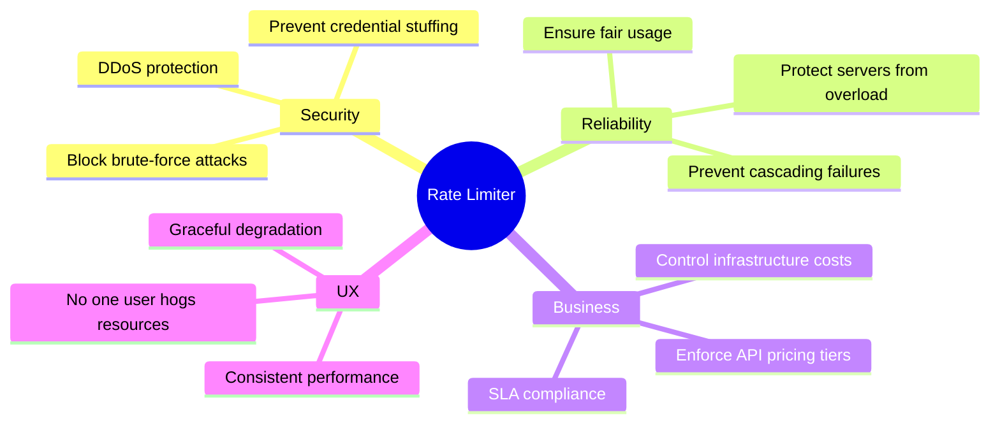
```mermaid
mindmap
  root((Rate Limiter))
    Security
      Block brute-force attacks
      Prevent credential stuffing
      DDoS protection
    Reliability
      Protect servers from overload
      Ensure fair usage
      Prevent cascading failures
    Business
      Enforce API pricing tiers
      Control infrastructure costs
      SLA compliance
    UX
      Consistent performance
      No one user hogs resources
      Graceful degradation
```

**Real-world examples of what happens without rate limiting:**

- A malicious bot tries 10,000 password combinations against your login endpoint in 30 seconds → account takeover
- A poorly written client SDK has a bug and fires 500 requests/second per user → your database crashes for everyone
- A competitor scrapes your entire product catalogue in one hour → massive AWS bill, site slowdown
- A flash sale sends 100× normal traffic to `/checkout` → revenue-generating traffic gets dropped

A rate limiter prevents all of these. It's not optional for any serious API.

---

## Step 1 — Understand the Requirements

In a system design interview (and in real life), you always start by clarifying what you're building. Here are the key questions:

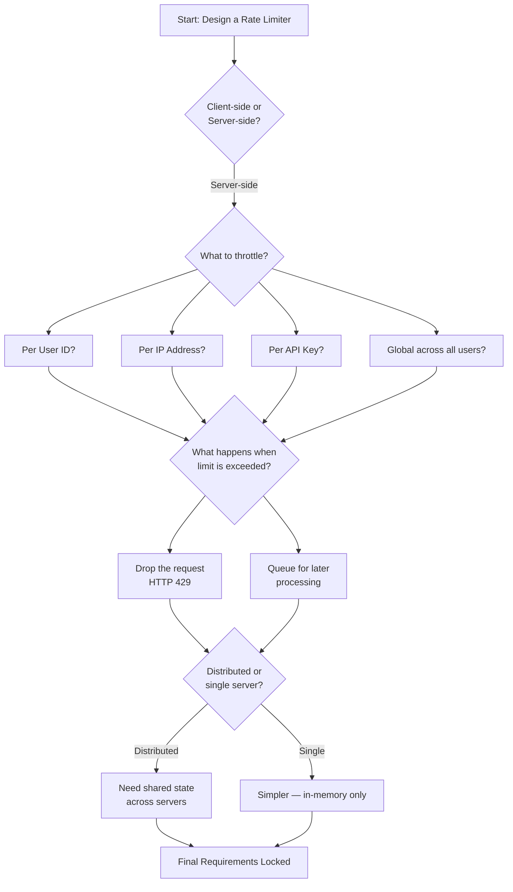
```mermaid
flowchart TD
    A[Start: Design a Rate Limiter] --> B{Client-side or\nServer-side?}
    B -->|Server-side| C{What to throttle?}
    C --> D[Per User ID?]
    C --> E[Per IP Address?]
    C --> F[Per API Key?]
    C --> G[Global across all users?]
    D & E & F & G --> H{What happens when\nlimit is exceeded?}
    H --> I[Drop the request\nHTTP 429]
    H --> J[Queue for later\nprocessing]
    I & J --> K{Distributed or\nsingle server?}
    K -->|Distributed| L[Need shared state\nacross servers]
    K -->|Single| M[Simpler — in-memory only]
    L --> N[Final Requirements Locked]
    M --> N
```

For our design, we'll assume:
- **Server-side** rate limiter (never trust clients to rate-limit themselves)
- Throttle on **User ID**, **IP Address**, and **API Key** depending on the rule
- Return **HTTP 429** with helpful headers when throttled
- Must work in a **distributed environment** with multiple rate limiter servers
- **Highly available** — the rate limiter itself must not be a single point of failure
- **Low latency** — adding < 1ms overhead per request

---

## Step 2 — The Five Rate Limiting Algorithms

This is the heart of the chapter. There are five main algorithms, each with different tradeoffs. Let's understand all of them deeply.

---

### Algorithm 1: Token Bucket 🪣

**Used by: AWS API Gateway, Stripe, most REST APIs**

Imagine a bucket that holds tokens. Every second, new tokens drip in. Every request spends one token. No tokens left? Request denied.

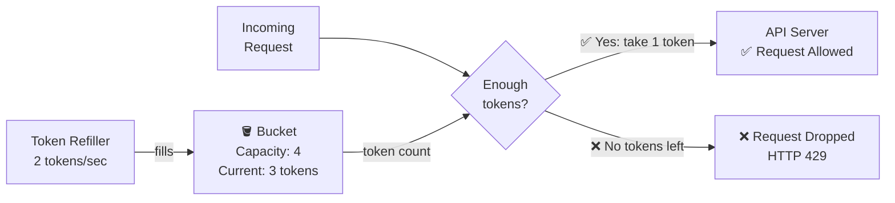
```mermaid
flowchart LR
    R[Token Refiller\n2 tokens/sec] -->|fills| B["🪣 Bucket\nCapacity: 4\nCurrent: 3 tokens"]
    REQ[Incoming\nRequest] --> CHECK{Enough\ntokens?}
    B -->|token count| CHECK
    CHECK -->|✅ Yes: take 1 token| SERVER[API Server\n✅ Request Allowed]
    CHECK -->|❌ No tokens left| DROP[❌ Request Dropped\nHTTP 429]
```

**How it works step by step:**

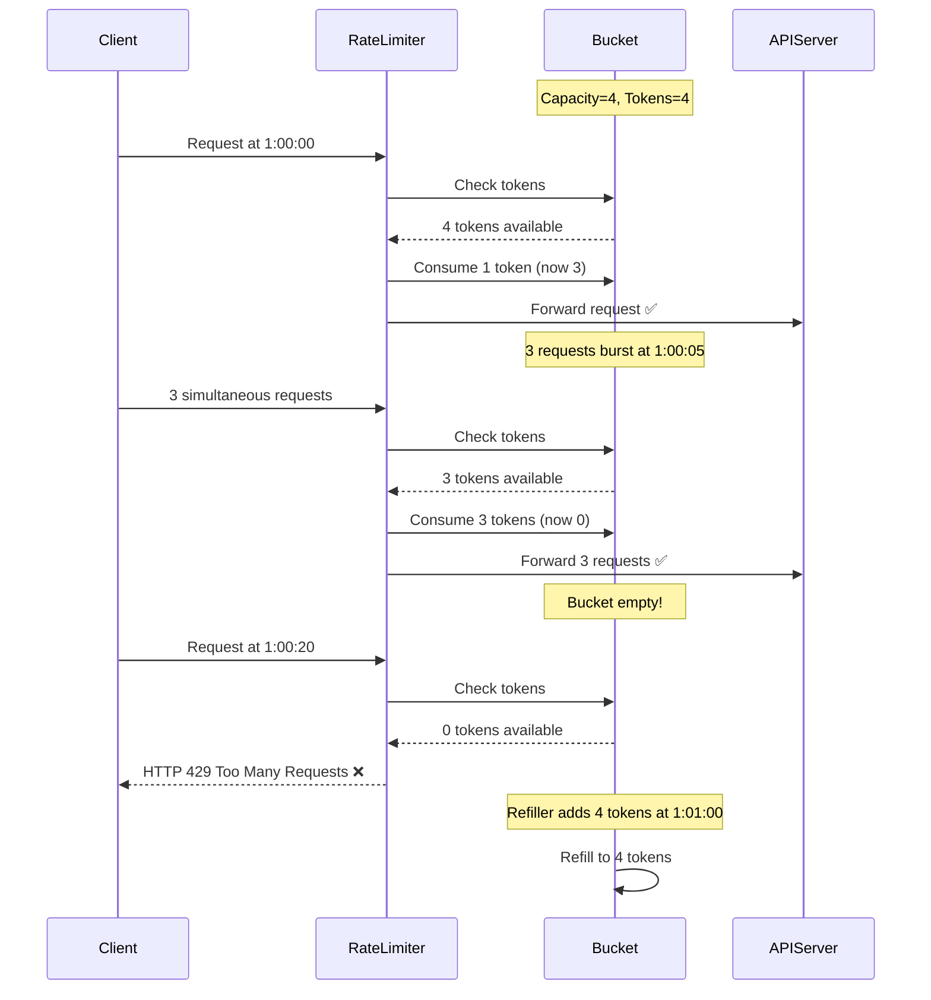
```mermaid
sequenceDiagram
    participant Client
    participant RateLimiter
    participant Bucket
    participant APIServer

    Note over Bucket: Capacity=4, Tokens=4
    Client->>RateLimiter: Request at 1:00:00
    RateLimiter->>Bucket: Check tokens
    Bucket-->>RateLimiter: 4 tokens available
    RateLimiter->>Bucket: Consume 1 token (now 3)
    RateLimiter->>APIServer: Forward request ✅

    Note over Bucket: 3 requests burst at 1:00:05
    Client->>RateLimiter: 3 simultaneous requests
    RateLimiter->>Bucket: Check tokens
    Bucket-->>RateLimiter: 3 tokens available
    RateLimiter->>Bucket: Consume 3 tokens (now 0)
    RateLimiter->>APIServer: Forward 3 requests ✅

    Note over Bucket: Bucket empty!
    Client->>RateLimiter: Request at 1:00:20
    RateLimiter->>Bucket: Check tokens
    Bucket-->>RateLimiter: 0 tokens available
    RateLimiter-->>Client: HTTP 429 Too Many Requests ❌

    Note over Bucket: Refiller adds 4 tokens at 1:01:00
    Bucket->>Bucket: Refill to 4 tokens
```

**Two key parameters:**
- **Bucket size** — maximum tokens the bucket can hold (caps burst size)
- **Refill rate** — how many tokens per second are added

**How many buckets do you need?**

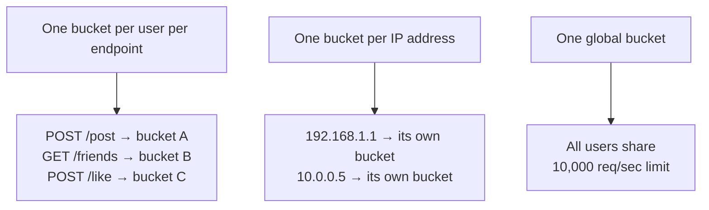
```mermaid
graph TD
    A[One bucket per user per endpoint] --> B["POST /post → bucket A\nGET /friends → bucket B\nPOST /like → bucket C"]
    C[One bucket per IP address] --> D["192.168.1.1 → its own bucket\n10.0.0.5 → its own bucket"]
    E[One global bucket] --> F["All users share\n10,000 req/sec limit"]
```

**Pros and Cons:**

| Pros | Cons |
|------|------|
| Easy to implement | Tuning two parameters is tricky |
| Memory efficient | A burst can still be large at bucket boundary |
| Allows short bursts | — |
| Used in production everywhere | — |

---

### Algorithm 2: Leaky Bucket 🚿

**Used by: Shopify**

Instead of tokens, imagine requests flowing into a bucket that has a small hole at the bottom. Requests *drip out* at a fixed, constant rate. If the bucket overflows, requests are dropped.

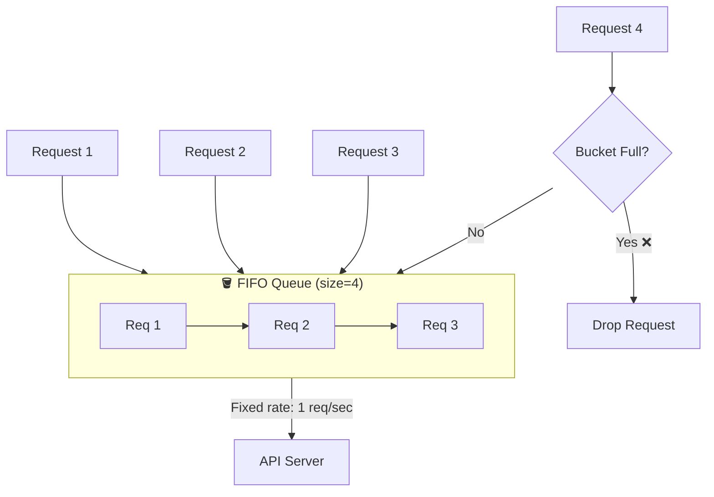
```mermaid
flowchart TD
    REQ1[Request 1] --> BUCKET
    REQ2[Request 2] --> BUCKET
    REQ3[Request 3] --> BUCKET
    REQ4[Request 4] --> FULL{Bucket Full?}
    FULL -->|No| BUCKET
    FULL -->|Yes ❌| DROP[Drop Request]

    subgraph BUCKET["🪣 FIFO Queue (size=4)"]
        direction LR
        Q1[Req 1] --> Q2[Req 2] --> Q3[Req 3]
    end

    BUCKET -->|Fixed rate: 1 req/sec| SERVER[API Server]
```

**The key difference from Token Bucket:** Token bucket allows bursting (many requests at once, as long as tokens exist). Leaky bucket forces a *constant output rate* — no matter how many requests come in, only N go out per second.

**Two parameters:**
- **Bucket size** — queue capacity (how many requests can wait)
- **Outflow rate** — requests processed per second (the "leak" rate)

**Pros and Cons:**

| Pros | Cons |
|------|------|
| Smooths out bursty traffic | A burst fills the queue with OLD requests |
| Stable, predictable outflow rate | Recent requests may be delayed unnecessarily |
| Memory efficient | Hard to tune for bursty workloads |

**Best for:** Payment processors, downstream services that need a steady, predictable flow. Shopify uses it to protect their backend from merchant bursts.

---

### Algorithm 3: Fixed Window Counter 🪟

This algorithm divides time into fixed-size windows (e.g., 1-minute buckets) and counts requests per window.


```mermaid
gantt
    title Fixed Window — 3 requests/second limit
    dateFormat  ss
    axisFormat  %S

    section Window 1 (1:00:00)
    ✅ Request 1 :done, 00, 1s
    ✅ Request 2 :done, 01, 1s
    ✅ Request 3 :done, 02, 1s

    section Window 2 (1:00:01)
    ✅ Request 4 :done, 03, 1s
    ✅ Request 5 :done, 04, 1s
    ❌ Request 6 (dropped) :crit, 05, 1s
    ❌ Request 7 (dropped) :crit, 06, 1s

    section Window 3 (1:00:02)
    ✅ Request 8 :done, 07, 1s
    ✅ Request 9 :done, 08, 1s
```

**The critical bug — boundary burst problem:**

Here's a subtle but dangerous flaw. If your limit is 5 requests/minute:

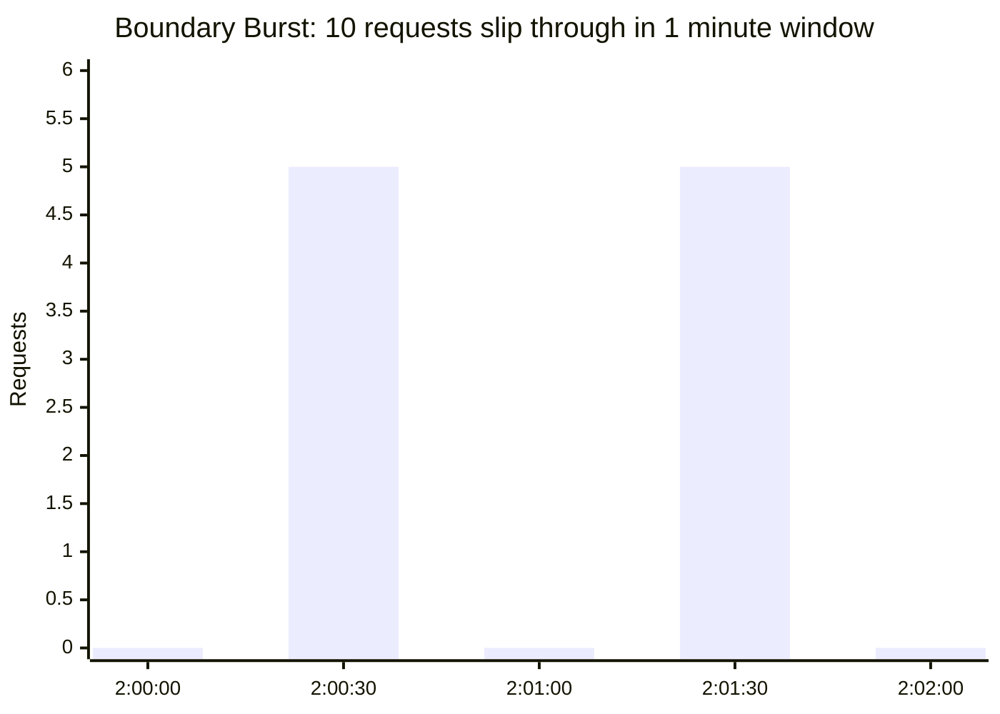
```mermaid
xychart-beta
    title "Boundary Burst: 10 requests slip through in 1 minute window"
    x-axis ["2:00:00", "2:00:30", "2:01:00", "2:01:30", "2:02:00"]
    y-axis "Requests" 0 --> 6
    bar [0, 5, 0, 5, 0]
```

- At **2:00:30** → 5 requests hit (uses up Window 1's quota)
- At **2:01:00** → Window 2 resets! 5 more requests immediately hit
- In the 60 seconds from **2:00:30 to 2:01:30**, you've allowed **10 requests** — double the limit!

This is a known vulnerability. The sliding window algorithms below fix it.

**Pros and Cons:**

| Pros | Cons |
|------|------|
| Very easy to understand | Boundary burst can 2× your limit |
| Memory efficient | Not suitable for strict traffic control |
| Counter resets cleanly | — |

---

### Algorithm 4: Sliding Window Log 📜

Instead of counting per window, we store a **log of timestamps** for every request.

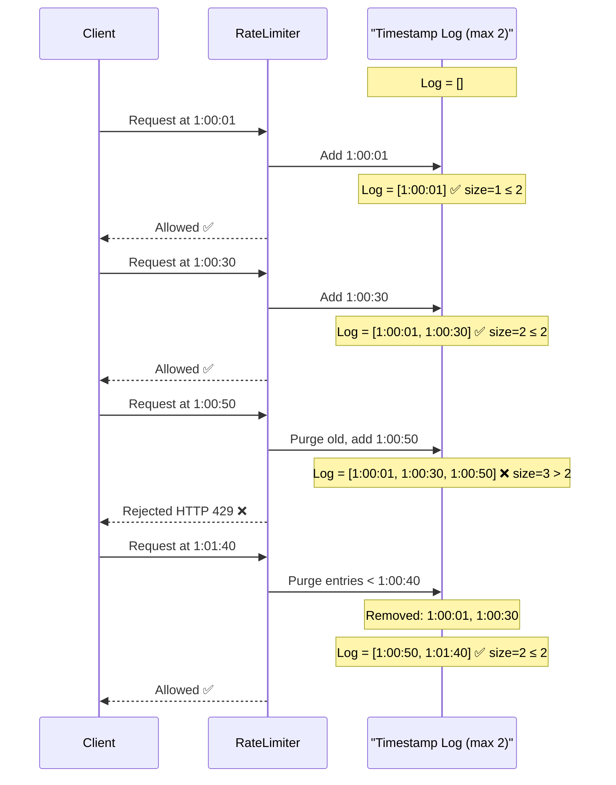
```mermaid
sequenceDiagram
    participant Client
    participant RateLimiter
    participant Log as "Timestamp Log (max 2)"

    Note over Log: Log = []
    Client->>RateLimiter: Request at 1:00:01
    RateLimiter->>Log: Add 1:00:01
    Note over Log: Log = [1:00:01] ✅ size=1 ≤ 2
    RateLimiter-->>Client: Allowed ✅

    Client->>RateLimiter: Request at 1:00:30
    RateLimiter->>Log: Add 1:00:30
    Note over Log: Log = [1:00:01, 1:00:30] ✅ size=2 ≤ 2
    RateLimiter-->>Client: Allowed ✅

    Client->>RateLimiter: Request at 1:00:50
    RateLimiter->>Log: Purge old, add 1:00:50
    Note over Log: Log = [1:00:01, 1:00:30, 1:00:50] ❌ size=3 > 2
    RateLimiter-->>Client: Rejected HTTP 429 ❌

    Client->>RateLimiter: Request at 1:01:40
    RateLimiter->>Log: Purge entries < 1:00:40
    Note over Log: Removed: 1:00:01, 1:00:30
    Note over Log: Log = [1:00:50, 1:01:40] ✅ size=2 ≤ 2
    RateLimiter-->>Client: Allowed ✅
```

**The algorithm:**
1. New request arrives
2. Remove all timestamps older than `now - window_size`
3. Add current timestamp
4. If log size ≤ limit → allow. Else → reject (but still keep the timestamp in the log)

**Pros and Cons:**

| Pros | Cons |
|------|------|
| Very accurate — no boundary burst | High memory usage (store every timestamp) |
| Any rolling window is accurate | Even rejected requests consume log space |

---

### Algorithm 5: Sliding Window Counter 🔄

**Used by: Cloudflare (processes 400 million requests with only 0.003% error)**

This is the **best of both worlds** — combine fixed window counters with a rolling calculation.

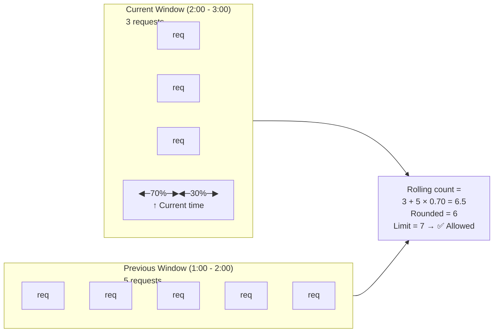
```mermaid
flowchart LR
    subgraph PREV["Previous Window (1:00 - 2:00)\n5 requests"]
        P1[req] 
        P2[req]
        P3[req]
        P4[req]
        P5[req]
    end
    subgraph CURR["Current Window (2:00 - 3:00)\n3 requests"]
        direction LR
        C1[req]
        C2[req]
        C3[req]
        TIMELINE["◀─70%─▶◀─30%─▶\n     ↑ Current time"]
    end
    FORMULA["Rolling count = \n3 + 5 × 0.70 = 6.5\nRounded = 6\nLimit = 7 → ✅ Allowed"]
    CURR --> FORMULA
    PREV --> FORMULA
```

**The magic formula:**

> `Rolling count = requests_in_current_window + requests_in_previous_window × overlap_percentage`

**Example:** Limit is 7/min. Current time is 30% into the current window.
- Previous window: 5 requests
- Current window: 3 requests
- Overlap = 70% of previous window overlaps rolling window
- Rolling count = 3 + 5 × 0.70 = **6.5 → rounded to 6** → under limit → **allowed!**

**Pros and Cons:**

| Pros | Cons |
|------|------|
| Smooths spikes from previous window | Approximate (not 100% accurate) |
| Memory efficient — only 2 counters | Assumes uniform distribution in prev window |
| Cloudflare proved 99.997% accuracy at scale | — |

---

### Algorithm Comparison — The Decision Matrix

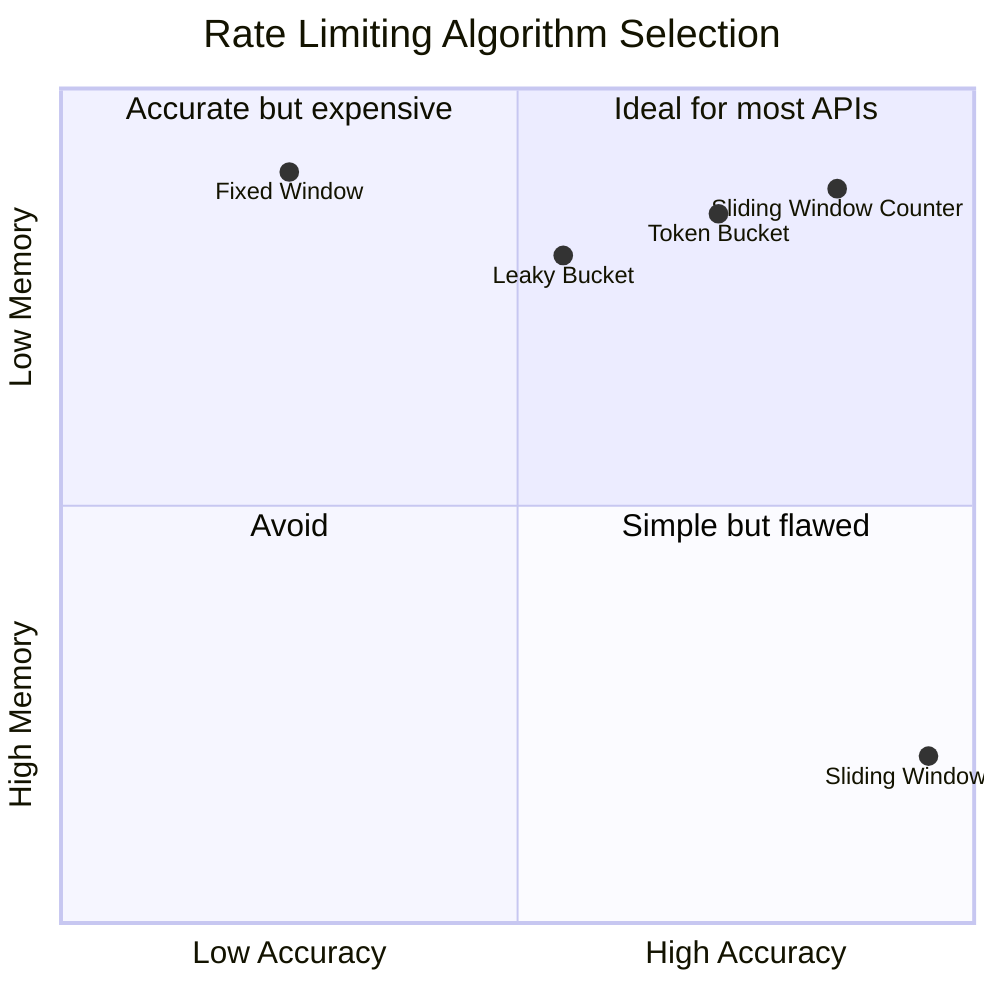
```mermaid
quadrantChart
    title Rate Limiting Algorithm Selection
    x-axis Low Accuracy --> High Accuracy
    y-axis High Memory --> Low Memory
    quadrant-1 Ideal for most APIs
    quadrant-2 Accurate but expensive
    quadrant-3 Avoid
    quadrant-4 Simple but flawed

    Token Bucket: [0.72, 0.85]
    Leaky Bucket: [0.55, 0.80]
    Fixed Window: [0.25, 0.90]
    Sliding Window Log: [0.95, 0.20]
    Sliding Window Counter: [0.85, 0.88]
```

| Algorithm | Memory | Accuracy | Burst-friendly | Best for |
|---|---|---|---|---|
| Token Bucket | Low | Medium | ✅ Yes | Most REST APIs (AWS, Stripe) |
| Leaky Bucket | Low | Medium | ❌ No | Stable outflow systems |
| Fixed Window | Very Low | Low | ✅ Yes (exploitable) | Simple internal services |
| Sliding Window Log | High | Very High | ❌ No | Strict compliance APIs |
| Sliding Window Counter | Low | High | ✅ Yes | High-scale APIs (Cloudflare) |

---

## Step 3 — High-Level Architecture

Now that we know the algorithms, let's design the actual system.

### Where to Put the Rate Limiter?

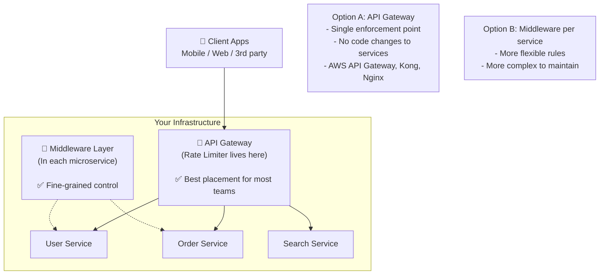
```mermaid
graph TD
    CLIENT[📱 Client Apps\nMobile / Web / 3rd party] --> GW

    subgraph YOUR_INFRA["Your Infrastructure"]
        GW["🚦 API Gateway\n(Rate Limiter lives here)\n\n✅ Best placement for most teams"] --> SVC1[User Service]
        GW --> SVC2[Order Service]
        GW --> SVC3[Search Service]

        MW["🔧 Middleware Layer\n(In each microservice)\n\n✅ Fine-grained control"] -.-> SVC1
        MW -.-> SVC2
    end

    NOTE1["Option A: API Gateway\n- Single enforcement point\n- No code changes to services\n- AWS API Gateway, Kong, Nginx"] 
    NOTE2["Option B: Middleware per service\n- More flexible rules\n- More complex to maintain"]
```

**Recommendation:** For most teams, put it at the **API Gateway layer**. You get one enforcement point with no code changes to individual microservices. AWS API Gateway, Kong, Nginx, and Envoy all have built-in rate limiting.

### The Basic Architecture

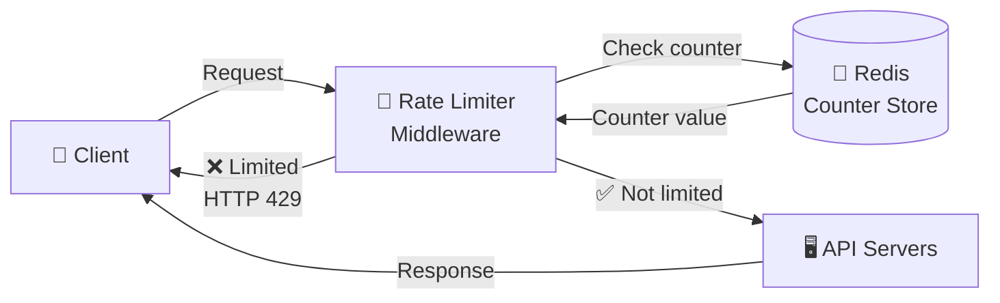
```mermaid
graph LR
    CLIENT[👤 Client] -->|Request| RL["🚦 Rate Limiter\nMiddleware"]
    RL -->|Check counter| REDIS[("🔴 Redis\nCounter Store")]
    REDIS -->|Counter value| RL
    RL -->|✅ Not limited| API[🖥️ API Servers]
    RL -->|❌ Limited\nHTTP 429| CLIENT
    API -->|Response| CLIENT
```

**Why Redis and not a database?**

A traditional database like MySQL or PostgreSQL stores data on disk. A rate limiter check happens on **every single request** — that's potentially millions of checks per second. Disk access at that rate would be catastrophic.

Redis is an **in-memory** data store. It:
- Responds in under **1 millisecond**
- Supports atomic operations (`INCR`, `EXPIRE`) that prevent race conditions
- Can handle **100,000+ operations per second** on a single node

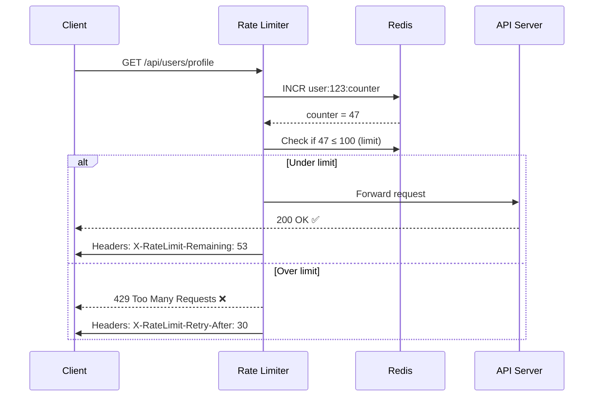
```mermaid
sequenceDiagram
    participant C as Client
    participant RL as Rate Limiter
    participant R as Redis
    participant API as API Server

    C->>RL: GET /api/users/profile
    RL->>R: INCR user:123:counter
    R-->>RL: counter = 47
    RL->>R: Check if 47 ≤ 100 (limit)
    
    alt Under limit
        RL->>API: Forward request
        API-->>C: 200 OK ✅
        RL->>C: Headers: X-RateLimit-Remaining: 53
    else Over limit
        RL-->>C: 429 Too Many Requests ❌
        RL->>C: Headers: X-RateLimit-Retry-After: 30
    end
```

---

## Step 4 — Rate Limiting Rules

Rules define *what* to throttle and *how much*. They're typically stored in config files:

```yaml
# Example rules (similar to Lyft's ratelimit config)

domain: auth
descriptors:
  - key: auth_type
    value: login
    rate_limit:
      unit: minute
      requests_per_unit: 5      # Max 5 login attempts per minute

domain: messaging  
descriptors:
  - key: message_type
    value: marketing
    rate_limit:
      unit: day
      requests_per_unit: 100    # Max 100 marketing messages per day

domain: search
descriptors:
  - key: user_tier
    value: free
    rate_limit:
      unit: hour
      requests_per_unit: 60     # Free tier: 60 searches/hour
  - key: user_tier
    value: paid
    rate_limit:
      unit: hour
      requests_per_unit: 3600   # Paid tier: 3600 searches/hour
```

**How rules flow through the system:**

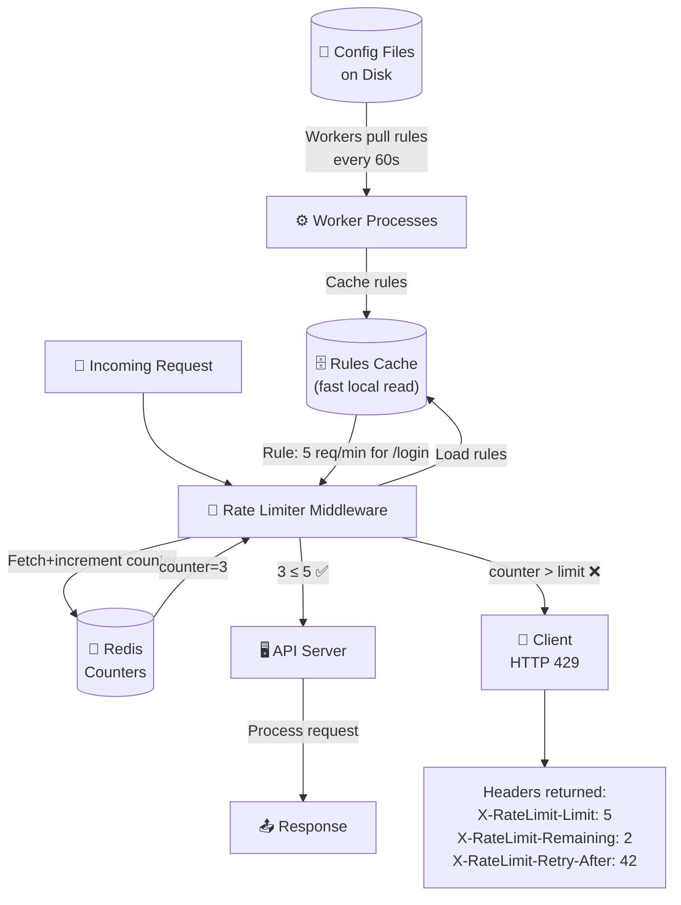
```mermaid
flowchart TD
    DISK[("📁 Config Files\non Disk")] -->|Workers pull rules\nevery 60s| WORKERS[⚙️ Worker Processes]
    WORKERS -->|Cache rules| CACHE[("🗄️ Rules Cache\n(fast local read)")]
    
    REQ[📨 Incoming Request] --> RL["🚦 Rate Limiter Middleware"]
    RL -->|Load rules| CACHE
    CACHE -->|Rule: 5 req/min for /login| RL
    RL -->|Fetch+increment counter| REDIS[("🔴 Redis\nCounters")]
    REDIS -->|counter=3| RL
    
    RL -->|3 ≤ 5 ✅| API[🖥️ API Server]
    RL -->|counter > limit ❌| CLIENT[👤 Client\nHTTP 429]
    
    API -->|Process request| RESP[📤 Response]
    CLIENT --> HEADERS["Headers returned:\nX-RateLimit-Limit: 5\nX-RateLimit-Remaining: 2\nX-RateLimit-Retry-After: 42"]
```

---

## Step 5 — HTTP Headers That Clients Need

When a client gets rate limited, it's cruel to just drop the connection silently. Well-designed APIs return **informative headers**:

```
HTTP/1.1 429 Too Many Requests
X-RateLimit-Limit: 100
X-RateLimit-Remaining: 0
X-RateLimit-Reset: 1685484800
Retry-After: 30
Content-Type: application/json

{
  "error": "rate_limit_exceeded",
  "message": "You have exceeded 100 requests per minute. Please retry after 30 seconds.",
  "limit": 100,
  "window": "1 minute"
}
```

| Header | Meaning |
|--------|---------|
| `X-RateLimit-Limit` | Max requests allowed in the window |
| `X-RateLimit-Remaining` | How many requests left in current window |
| `X-RateLimit-Reset` | Unix timestamp when the window resets |
| `Retry-After` | Seconds until the client can retry |

A good client should **read these headers** and implement exponential backoff:

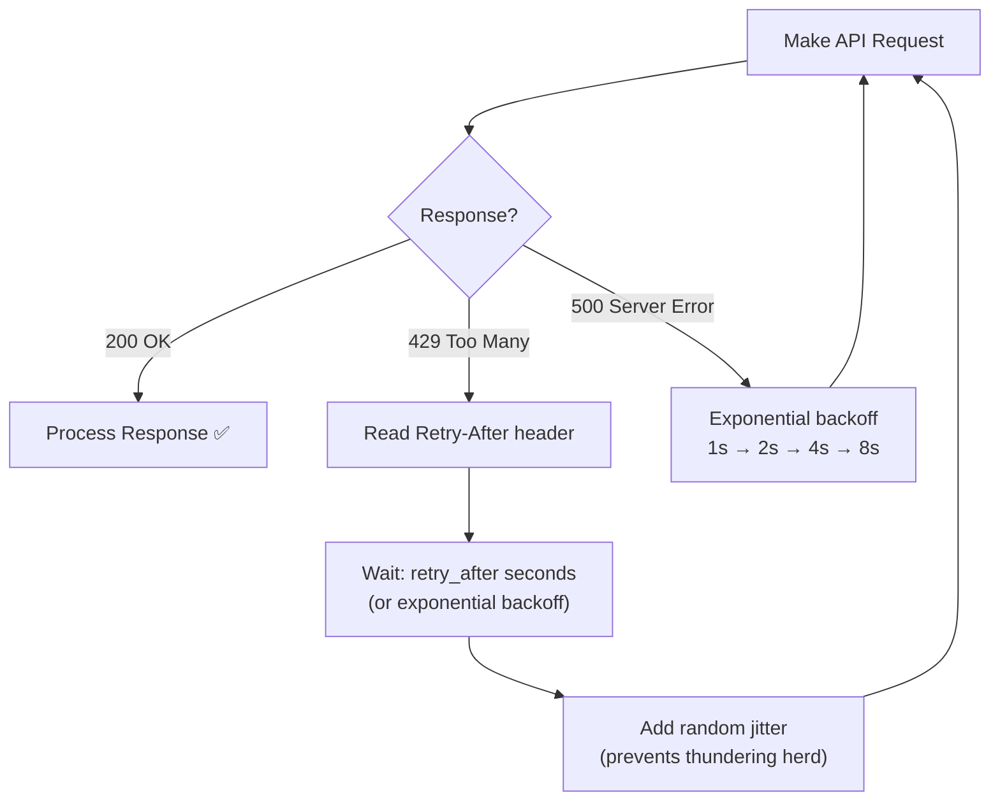
```mermaid
flowchart TD
    REQ[Make API Request] --> RESP{Response?}
    RESP -->|200 OK| SUCCESS[Process Response ✅]
    RESP -->|429 Too Many| READ[Read Retry-After header]
    READ --> WAIT["Wait: retry_after seconds\n(or exponential backoff)"]
    WAIT --> JITTER["Add random jitter\n(prevents thundering herd)"]
    JITTER --> REQ
    RESP -->|500 Server Error| BACKOFF[Exponential backoff\n1s → 2s → 4s → 8s]
    BACKOFF --> REQ
```

---

## Step 6 — Detailed System Design

Here's the full production-grade architecture:

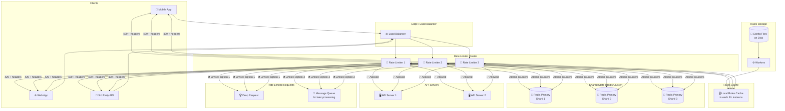
```mermaid
graph TB
    subgraph CLIENTS["Clients"]
        C1[📱 Mobile App]
        C2[🌐 Web App]
        C3[🤖 3rd Party API]
    end

    subgraph EDGE["Edge / Load Balancer"]
        LB[⚖️ Load Balancer]
    end

    subgraph RATE_LIMITERS["Rate Limiter Cluster"]
        RL1[🚦 Rate Limiter 1]
        RL2[🚦 Rate Limiter 2]
        RL3[🚦 Rate Limiter 3]
    end

    subgraph CACHE["Rules Cache"]
        RC[🗄️ Local Rules Cache\nin each RL instance]
    end

    subgraph STORAGE["Shared State (Redis Cluster)"]
        R1[(🔴 Redis Primary\nShard 1)]
        R2[(🔴 Redis Primary\nShard 2)]
        R3[(🔴 Redis Primary\nShard 3)]
    end

    subgraph API["API Servers"]
        API1[🖥️ API Server 1]
        API2[🖥️ API Server 2]
    end

    subgraph RULES["Rules Storage"]
        DISK[("📁 Config Files\non Disk")]
        WORKERS[⚙️ Workers]
    end

    subgraph OVERFLOW["Rate Limited Requests"]
        DROP[🗑️ Drop Request]
        MQ[📨 Message Queue\nfor later processing]
    end

    C1 & C2 & C3 --> LB
    LB --> RL1 & RL2 & RL3
    DISK --> WORKERS --> RC
    RL1 & RL2 & RL3 --> RC
    RL1 & RL2 & RL3 <-->|Atomic counters| R1 & R2 & R3
    RL1 & RL2 & RL3 -->|✅ Allowed| API1 & API2
    RL1 & RL2 & RL3 -->|❌ Limited Option 1| DROP
    RL1 & RL2 & RL3 -->|❌ Limited Option 2| MQ
    RL1 & RL2 & RL3 -->|429 + headers| C1 & C2 & C3
```

**Flow explanation:**
1. Client hits the load balancer → routed to one of the rate limiter instances
2. Rate limiter loads rules from its local cache (fast — no network hop)
3. Rate limiter performs an **atomic** read-increment on Redis
4. If under limit → forward to API servers
5. If over limit → return 429 with headers, then either drop or queue the request

---

## Step 7 — The Distributed Challenge

Building a rate limiter for one server is easy. Building one for 50 rate limiter servers is **hard**. Two nasty problems emerge:

### Problem 1: Race Condition 🏁

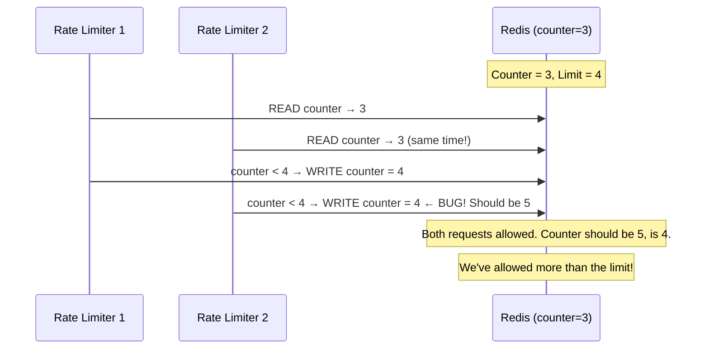
```mermaid
sequenceDiagram
    participant RL1 as Rate Limiter 1
    participant RL2 as Rate Limiter 2
    participant R as Redis (counter=3)

    Note over R: Counter = 3, Limit = 4

    RL1->>R: READ counter → 3
    RL2->>R: READ counter → 3 (same time!)
    
    RL1->>R: counter < 4 → WRITE counter = 4
    RL2->>R: counter < 4 → WRITE counter = 4 ← BUG! Should be 5

    Note over R: Both requests allowed. Counter should be 5, is 4.
    Note over R: We've allowed more than the limit!
```

**The fix:** Use Redis **Lua scripts** to make read-check-increment **atomic**:

```lua
-- Atomic Lua script executed in Redis (single-threaded)
local key = KEYS[1]
local limit = tonumber(ARGV[1])
local expiry = tonumber(ARGV[2])

local current = redis.call("INCR", key)
if current == 1 then
    redis.call("EXPIRE", key, expiry)
end

if current > limit then
    return 0  -- rejected
else
    return 1  -- allowed
end
```

Because Redis executes Lua scripts **atomically**, no two scripts can interleave. Race condition eliminated.

### Problem 2: Synchronization 🔄

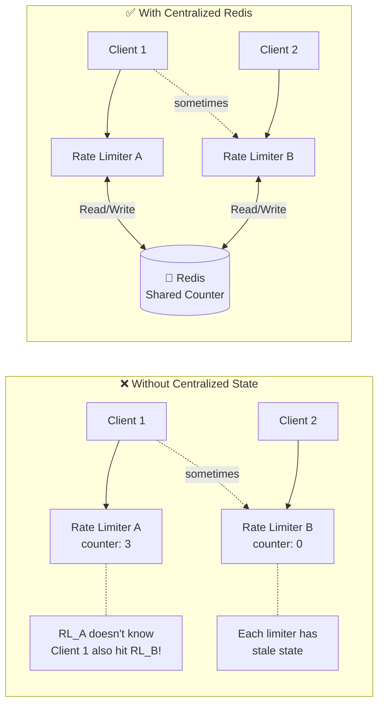
```mermaid
flowchart LR
    subgraph BAD["❌ Without Centralized State"]
        C1[Client 1] --> RL_A[Rate Limiter A\ncounter: 3]
        C1 -.->|sometimes| RL_B[Rate Limiter B\ncounter: 0]
        C2[Client 2] --> RL_B
        RL_A -.- NOTE1["RL_A doesn't know\nClient 1 also hit RL_B!"]
        RL_B -.- NOTE2["Each limiter has\nstale state"]
    end

    subgraph GOOD["✅ With Centralized Redis"]
        C3[Client 1] --> RL_C[Rate Limiter A]
        C3 -.->|sometimes| RL_D[Rate Limiter B]
        C4[Client 2] --> RL_D
        RL_C <-->|Read/Write| REDIS[(🔴 Redis\nShared Counter)]
        RL_D <-->|Read/Write| REDIS
    end
```

**The solution:** All rate limiter servers read and write to the **same Redis cluster**. The counter for user `123` always lives in the same Redis shard — no inconsistency.

---

## Step 8 — Scaling to Millions of Requests

A single Redis node handles ~100,000 operations/second. What if you have 10 million requests/second?

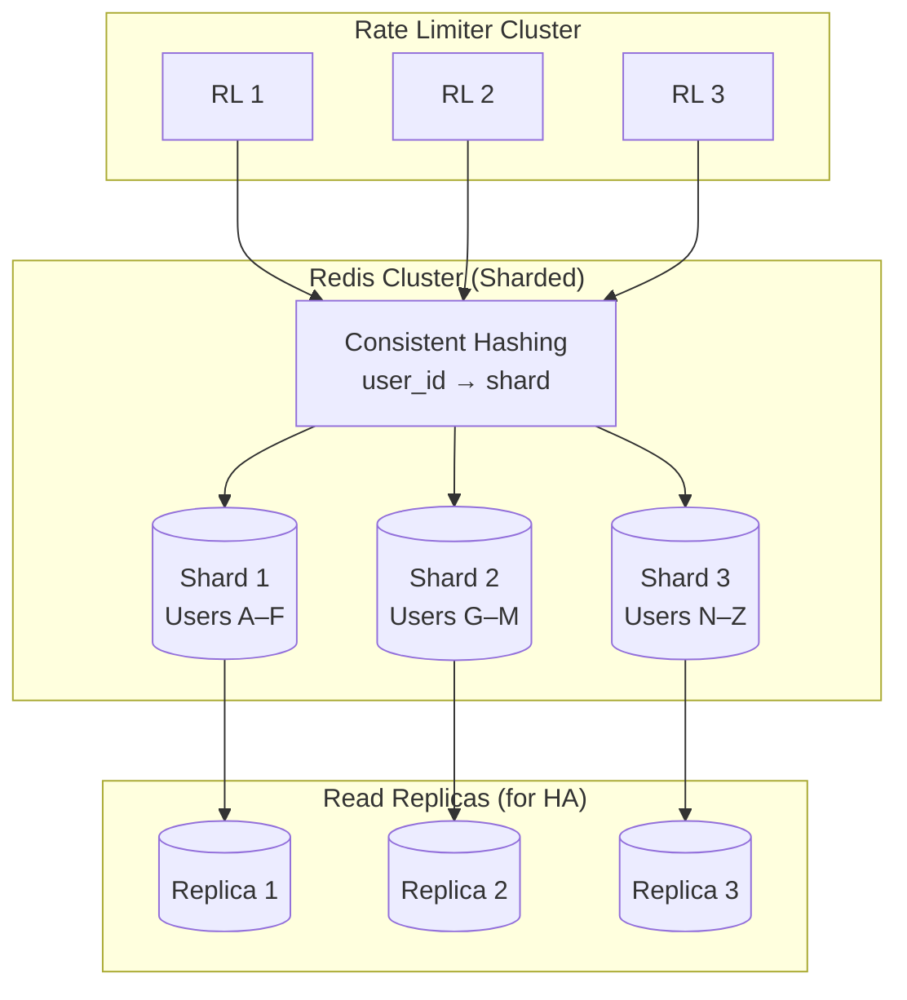
```mermaid
graph TB
    subgraph RL_CLUSTER["Rate Limiter Cluster"]
        RL1[RL 1]
        RL2[RL 2]
        RL3[RL 3]
    end

    subgraph REDIS_CLUSTER["Redis Cluster (Sharded)"]
        direction LR
        HASH["Consistent Hashing\nuser_id → shard"]
        R1[(Shard 1\nUsers A–F)]
        R2[(Shard 2\nUsers G–M)]
        R3[(Shard 3\nUsers N–Z)]
        HASH --> R1 & R2 & R3
    end

    subgraph REPLICAS["Read Replicas (for HA)"]
        R1R[(Replica 1)]
        R2R[(Replica 2)]
        R3R[(Replica 3)]
    end

    RL1 & RL2 & RL3 --> HASH
    R1 --> R1R
    R2 --> R2R
    R3 --> R3R
```

**Sharding strategy:** Hash the user ID (or IP/API key) to determine which Redis shard holds that user's counter. All requests from `user:123` always go to `shard-2`. This ensures no cross-shard coordination needed.

**Multi-region deployment for global scale:**

```mermaid
graph LR
    subgraph US["🇺🇸 US East"]
        US_RL[Rate Limiter\nUS]
        US_R[(Redis US)]
    end
    subgraph EU["🇪🇺 EU West"]
        EU_RL[Rate Limiter\nEU]
        EU_R[(Redis EU)]
    end
    subgraph AP["🇯🇵 Asia Pacific"]
        AP_RL[Rate Limiter\nAP]
        AP_R[(Redis AP)]
    end

    US_R <-->|Async replication\nEventual consistency| EU_R
    EU_R <-->|Async replication| AP_R
    AP_R <-->|Async replication| US_R

    USER_US[US User] --> US_RL
    USER_EU[EU User] --> EU_RL
    USER_AP[AP User] --> AP_RL
```

**Trade-off:** Eventual consistency means a user could briefly exceed the limit if two regions count independently. Cloudflare accepts this — they allow a small margin of error (0.003% of requests) in exchange for much lower latency.

---

## Step 9 — Hard vs Soft Rate Limiting

This is often asked as a follow-up in interviews:

```mermaid
flowchart TD
    REQ[Request Arrives] --> CHECK{Limit Check}

    CHECK -->|Under limit| ALLOW[✅ Allow]
    
    CHECK -->|Over limit| TYPE{Hard or Soft?}
    
    TYPE -->|Hard limit| REJECT["❌ Strict Reject\nHTTP 429\nNo exceptions ever\n\nUse for: security-critical\napis, billing, auth"]
    
    TYPE -->|Soft limit| GRACE{Within grace\nperiod/burst?}
    GRACE -->|Yes| ALLOW2["✅ Allow with warning\nHTTP 200 with header:\nX-RateLimit-Warning: approaching limit"]
    GRACE -->|No| REJECT2["❌ Reject\nHTTP 429"]
```

**Hard rate limiting:** The number of requests cannot exceed the threshold. Full stop. Used for: login endpoints (security), billing APIs (cost control), admin APIs.

**Soft rate limiting:** Requests can slightly exceed the threshold for a short period. Used for: less sensitive endpoints where user experience matters more than strict enforcement.

---

## Step 10 — Rate Limiting at Different Layers

We've focused on Layer 7 (HTTP/application). But rate limiting can happen anywhere:

```mermaid
graph TD
    L7["Layer 7 — Application (HTTP)\n✅ Most common\nThrottle by: user ID, API key, endpoint\nTool: API Gateway, Nginx, middleware"]
    L4["Layer 4 — Transport (TCP/UDP)\nThrottle by: connections per IP\nTool: Load balancer connection limits"]
    L3["Layer 3 — Network (IP)\nThrottle by: packets per IP\nTool: iptables, cloud firewall\ngreat for DDoS protection"]

    L3 --> L4 --> L7
    
    ATTACKER[🦹 DDoS Attacker] -->|Layer 3 blocks first| L3
    BOT[🤖 Bot] -->|Layer 7 blocks| L7
    LEGIT[✅ Legitimate User] -->|Passes all layers| APP[Your Application]
```

**Pro tip for interviews:** Mention you can layer these — use IP-based blocking at L3 for DDoS, per-user throttling at L7 for API abuse.

---

## Step 11 — Monitoring and Alerting

A rate limiter is useless without observability:

```mermaid
flowchart LR
    RL[Rate Limiter] -->|Metrics| PROM[(Prometheus\nMetrics)]
    PROM --> GRAFANA[📊 Grafana Dashboard]
    PROM --> ALERT{Alert Rules}
    
    ALERT -->|> 10% requests\nbeing rate-limited| SLACK[📢 Slack Alert\n'Rate limiting too aggressive'\nConsider relaxing rules]
    
    ALERT -->|Sudden 100×\ntraffic spike| PAGERDUTY[🚨 PagerDuty\n'Possible DDoS'\nConsider stricter rules]
    
    GRAFANA --> METRICS["Key Metrics to Watch:
    • requests_allowed_total
    • requests_rejected_total
    • rejection_rate_per_endpoint
    • p99 latency overhead
    • Redis memory usage"]
```

**Two things to validate:**
1. **Algorithm effectiveness** — Are the right requests being blocked? Too strict = legitimate users blocked. Too loose = abuse slips through.
2. **Rule effectiveness** — Flash sale traffic might need a temporary rule relaxation, or token bucket instead of fixed window.

---

## Real-World Examples: How the Giants Do It

```mermaid
graph TD
    subgraph STRIPE["💳 Stripe"]
        S1["Token Bucket\n100 req/sec per API key\nBurst allowed up to 1000\nretry-after header on 429"]
    end
    subgraph AWS["☁️ AWS API Gateway"]
        A1["Token Bucket\nDefault: 10,000 req/sec\nBurst: 5,000\nPer-stage or per-route limits"]
    end
    subgraph SHOPIFY["🛍️ Shopify"]
        SH1["Leaky Bucket\n40 req/sec steady state\nBucket size: 80\nREST + GraphQL APIs"]
    end
    subgraph CLOUDFLARE["🌐 Cloudflare"]
        CF1["Sliding Window Counter\n400M requests/day\n0.003% error rate\n194 edge locations"]
    end
    subgraph TWITTER["🐦 Twitter/X"]
        T1["Fixed Window per endpoint\n15 min windows\nDifferent limits per app tier\n15 req/15min on free tier"]
    end
```

---

## Common Interview Follow-Up Questions

```mermaid
mindmap
  root((Rate Limiter\nFollow-ups))
    Distributed
      How to handle eventual consistency?
      What if Redis goes down?
      How to shard Redis?
    Edge Cases
      What if client IPs are behind NAT?
      Handling IPv6?
      VPN users sharing IPs
    Design Choices
      Where to place: gateway vs middleware?
      Hard vs soft limits?
      What algorithm for flash sales?
    Monitoring
      How to detect if rules are too strict?
      How to measure overhead?
      Alerting on rejection rate spikes
    Security
      Can clients spoof user IDs?
      What about distributed attacks?
      Rate limit at DNS level?
```

**The Redis failure question:** If Redis goes down, should you block all traffic or allow all traffic?

- **Fail open** (allow all): Users experience no downtime. Risk: abuse during outage window.
- **Fail closed** (block all): No abuse risk. Risk: complete outage.

**Best answer:** Fail open with circuit breakers. If Redis is unhealthy, temporarily bypass rate limiting (fail open) but immediately alert on-call. The brief window of no rate limiting is better than a complete outage for your users.

---

## Designing for Your Client: Best Practices

If you're calling a rate-limited API, here's how to write a well-behaved client:

```mermaid
flowchart TD
    REQ[API Request] --> CACHE{Cache hit?}
    CACHE -->|Yes| RETURN[Return cached response\nNo API call needed]
    CACHE -->|No| CALL[Make API call]
    
    CALL --> RESP{Response}
    RESP -->|200 OK| STORE[Store in cache\nwith TTL] --> USE[Use response]
    RESP -->|429| RETRY_AFTER[Read Retry-After header]
    RETRY_AFTER --> SLEEP["Wait: retry_after + random_jitter seconds"]
    SLEEP --> CALL
    RESP -->|5xx| BACKOFF["Exponential backoff\n1s → 2s → 4s → 8s → 16s\nMax 5 retries"]
    BACKOFF --> CALL
    
    NOTE["Always:\n• Cache aggressively\n• Read X-RateLimit-Remaining\n• Slow down before hitting 0\n• Add jitter to retries"]
```

---

## Summary: The Complete Picture

```mermaid
graph TB
    subgraph WHAT["What is it?"]
        W["A system that controls\nhow many requests a client\ncan make in a time window"]
    end

    subgraph ALGOS["5 Algorithms"]
        A1[Token Bucket\n🏆 Most popular]
        A2[Leaky Bucket\nSmooth output]
        A3[Fixed Window\nSimple but flawed]
        A4[Sliding Window Log\nMost accurate]
        A5[Sliding Window Counter\nBest balance]
    end

    subgraph INFRA["Infrastructure"]
        I1[Redis\nAtomic counters]
        I2[API Gateway\nEnforcement point]
        I3[Rules Config\nYAML/disk]
        I4[Workers\nCache rules]
    end

    subgraph CHALLENGES["Distributed Challenges"]
        D1[Race conditions\n→ Lua scripts]
        D2[Synchronization\n→ Centralized Redis]
        D3[Scale\n→ Redis sharding]
        D4[Latency\n→ Edge deployment]
    end

    subgraph EXTRAS["Interview Extras"]
        E1[Hard vs Soft limits]
        E2[L3/L4/L7 layers]
        E3[Monitoring metrics]
        E4[Client best practices]
    end

    WHAT --> ALGOS --> INFRA --> CHALLENGES --> EXTRAS
```

---

## Key Takeaways

1. **Token Bucket** is the default choice for most APIs — allows bursting, memory efficient, used by AWS and Stripe
2. **Sliding Window Counter** is best when you need accuracy at massive scale — Cloudflare proved it at 400M req/day
3. **Never store counters in a relational database** — use Redis for sub-millisecond atomic operations
4. **Race conditions in distributed systems** are solved with Redis Lua scripts (atomic operations)
5. **Synchronization across rate limiter servers** is solved by centralizing state in Redis
6. **Always return helpful headers** — `X-RateLimit-Remaining`, `Retry-After` — so clients can behave well
7. **Monitor your rate limiter** — rules that are too strict block real users; rules too loose allow abuse

---

## What's Next?

In **Chapter 5**, we'll tackle **Consistent Hashing** — the algorithm that makes it possible to distribute data across hundreds of servers while minimizing data movement when servers join or leave the cluster. It's the backbone of Redis Cluster, Cassandra, and DynamoDB.

*If you found this useful, share it with a friend preparing for system design interviews. Every engineer deserves to understand how the systems they use every day actually work.*
