It's 11:59 PM on Black Friday. Your e-commerce platform has been running smoothly all day. Then at midnight, 500,000 shoppers simultaneously hammer your `/checkout` API. Your servers start queuing requests. Then they start dropping requests. Then they crash. Every second of downtime costs thousands of dollars in lost sales.

Meanwhile, a competitor's site — running the exact same infrastructure — handles the load just fine. The difference? They had a **rate limiter**.

A rate limiter is like the bouncer at an exclusive club. It doesn't care who you are. It enforces one rule: you can only enter at a certain pace. Too fast? You wait outside. This single mechanism protects your entire system from overload, abuse, and runaway costs.

In this article, we're going to build one — from scratch — understanding every algorithm, every architectural decision, and every subtle problem that bites teams in production. By the end, you'll understand exactly how **Amazon**, **Stripe**, **Shopify**, and **Cloudflare** throttle billions of API calls every single day.

---

## What Exactly Is a Rate Limiter?

In plain English: a rate limiter controls how many requests a client can make to your system within a given time window.

Here are concrete examples straight from real systems:

- Twitter limits each user to **300 tweets per 3 hours**
- Google Docs APIs allow **300 requests per user per 60 seconds**
- GitHub API allows **60 unauthenticated requests per hour** per IP
- Stripe allows **100 API requests per second** per API key
- You can create a maximum of **10 accounts per day** from the same IP address
- A user can write no more than **2 posts per second** on a social platform

When a client exceeds these limits, the server returns an **HTTP 429 Too Many Requests** response and the excess calls are blocked.

---

## Why Does Every Serious API Need One?

There are three core reasons, and they're all compelling:

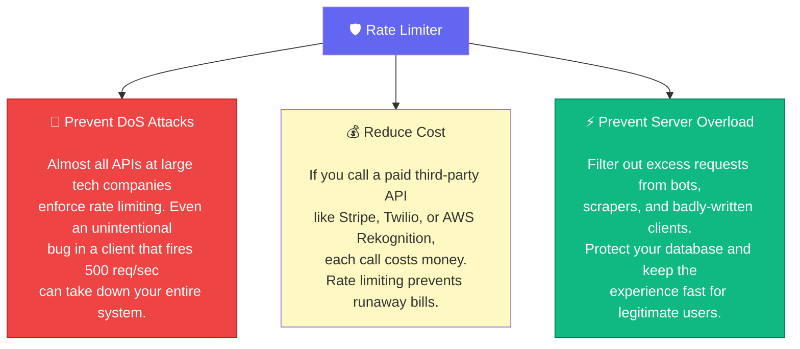

**The DoS angle is especially important.** DoS (Denial of Service) attacks don't have to be malicious. A junior developer at a client company accidentally puts their API call inside a `while(true)` loop. Without a rate limiter, they'll take your system down just as effectively as an attacker would.

---

## Step 1 — Understand the Problem First

In a real system design interview (and in real life), you never jump straight to the solution. You ask questions. Here's how a great interview conversation about this problem looks:

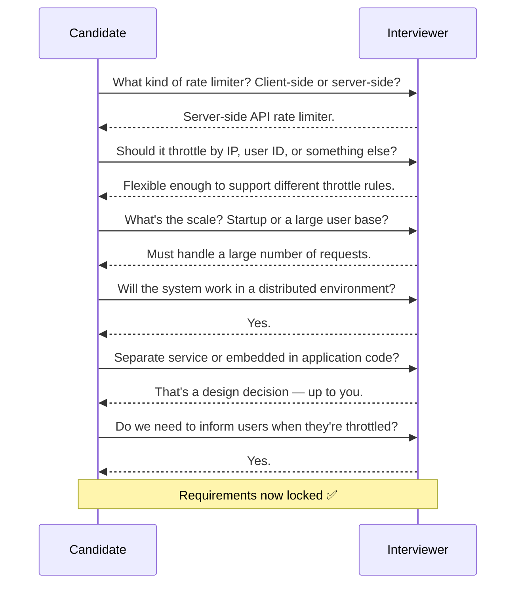

After clarifying, here's the requirements summary we're designing for:

| Requirement | Detail |
|---|---|
| Accuracy | Accurately limit excessive requests |
| Low latency | Must not slow down HTTP response time |
| Memory | Use as little memory as possible |
| Distributed | Shared across multiple servers or processes |
| Exception handling | Show clear error when requests are throttled |
| Fault tolerance | If cache server goes offline, system still works |

---

## Step 2 — Where Should the Rate Limiter Live?

This is the first real architectural decision, and it has more nuance than most people realise.

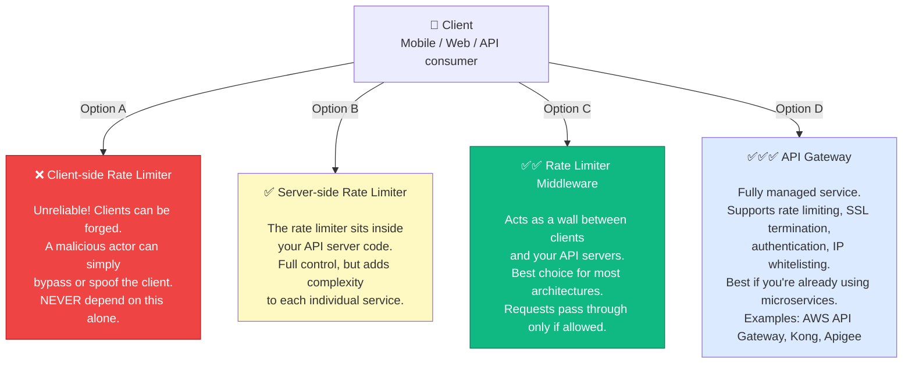

**The practical guidance from the book:**

- If you already use an **API gateway** for authentication and SSL termination, add rate limiting there — it's already in the request path
- If you need **fine-grained algorithm control** that third-party gateways don't support, implement it in your server-side code
- If your team **doesn't have bandwidth** to build a custom rate limiter, use a commercial gateway — it's better to have imperfect rate limiting than none

The rest of this article focuses on designing the rate limiting logic itself, which applies regardless of *where* you deploy it.

---

## Step 3 — The Five Algorithms: A Deep Dive

This is the most important section. There are five well-known rate limiting algorithms. Each has different properties, tradeoffs, and ideal use cases. Understanding all five is what separates a junior engineer from a senior one.

---

### Algorithm 1: Token Bucket 🪣

> **Used by: Amazon AWS, Stripe, most REST APIs in production**

**The everyday analogy:** Imagine you have a bucket that holds coins. Every second, the refiller drops 2 coins in. You need 1 coin to make an API call. If the bucket is full and more coins arrive, they spill over (overflow). If you want to make a call but the bucket is empty — sorry, your request is dropped.

Here's the visual of the bucket itself:

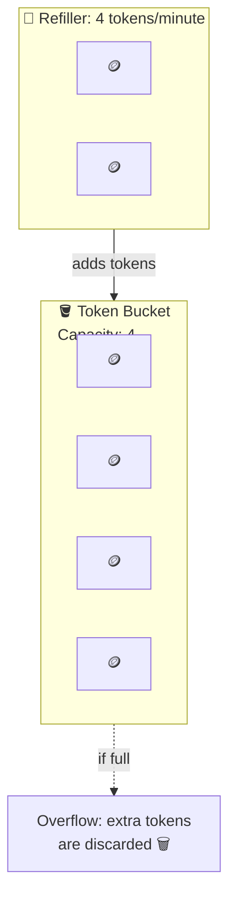

**How a request is processed:**

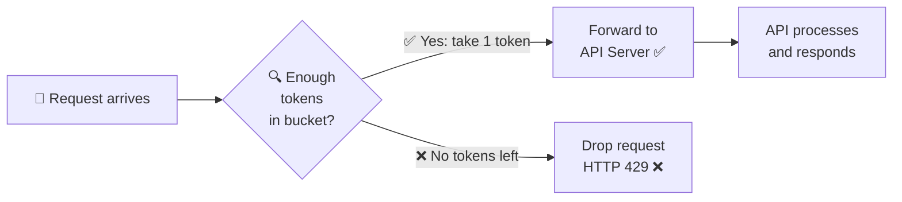

**Let's walk through a concrete example step by step:**

The bucket size is 4. Refill rate is 4 tokens per minute.

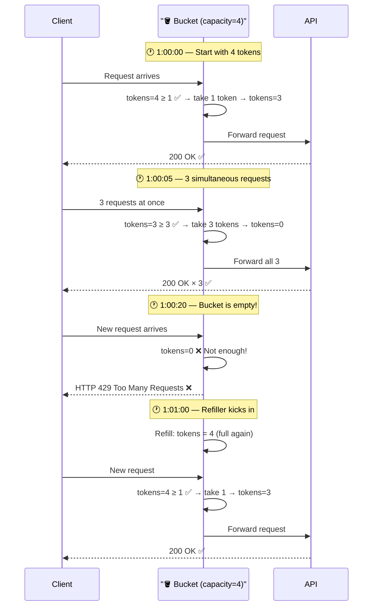

**The two parameters you tune:**
- **Bucket size** — maximum tokens the bucket can hold (controls max burst)
- **Refill rate** — tokens added per second (controls sustained rate)

**How many buckets do you create?**

This depends on your throttle rules. You might need multiple buckets per user:

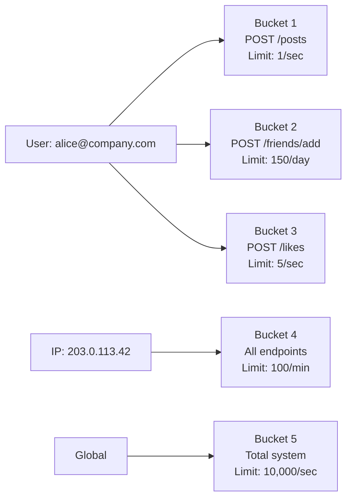

**Pros and Cons:**

| ✅ Pros | ❌ Cons |
|---------|---------|
| Easy to implement | Two parameters — can be tricky to tune correctly |
| Very memory efficient | A burst is possible right at refill time |
| Allows short bursts (real usage patterns) | — |
| Used everywhere in production | — |

---

### Algorithm 2: Leaky Bucket 🚿

> **Used by: Shopify**

**The analogy:** Instead of a bucket of tokens, picture a regular bucket with a small hole in the bottom. Water (requests) pours in from the top. It drips out at a constant, fixed pace from the hole. If water pours in faster than it drips out, the bucket overflows and excess water is lost.

The key difference from Token Bucket: requests are processed at a **fixed, constant rate** regardless of how many come in.

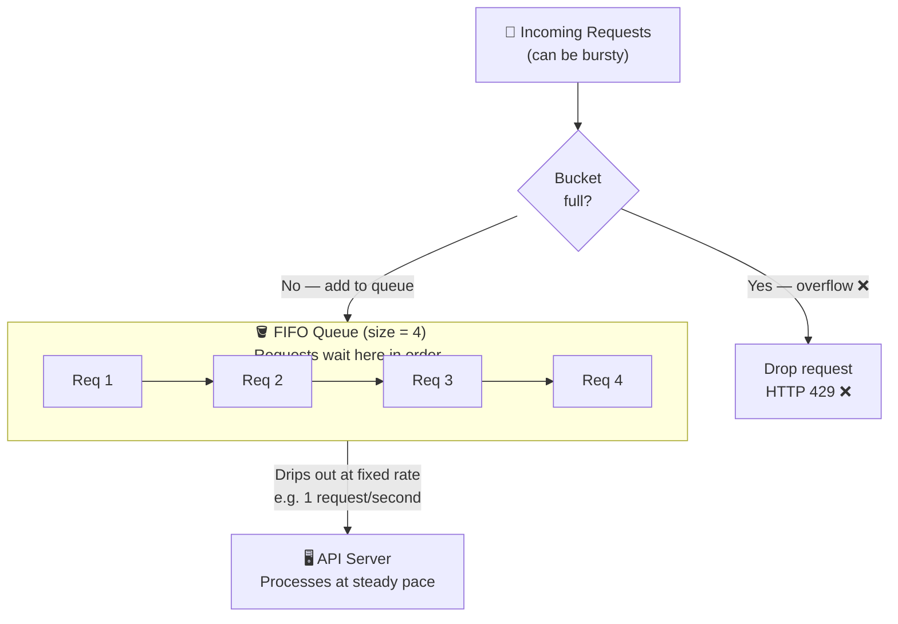

**The crucial difference, illustrated:**

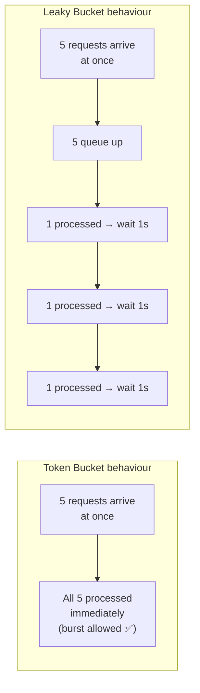

**The two parameters:**
- **Bucket size** = queue size (how many requests can wait)
- **Outflow rate** = how many requests processed per second (the "leak")

**Pros and Cons:**

| ✅ Pros | ❌ Cons |
|---------|---------|
| Memory efficient (fixed queue size) | A burst fills the queue with OLD requests |
| Stable, predictable processing rate | Recent requests get dropped even if the system recovers |
| Great for downstream services needing steady input | Two parameters are hard to tune for bursty workloads |

**Best for:** Payment processing pipelines, email sending queues, systems that talk to downstream services with strict rate requirements.

---

### Algorithm 3: Fixed Window Counter 🗓️

**The analogy:** Think of a day planner divided into exact 1-minute slots. Each slot has a counter. Every request in that minute increments the counter. When the counter hits the limit, all remaining requests that minute are rejected. When the next minute starts, the counter resets to zero.

```mermaid
gantt
    title Fixed Window Counter — Limit: 3 requests/second
    dateFormat  X
    axisFormat  Second %S

    section Second :00
    ✅ Request 1  : done, 0, 1
    ✅ Request 2  : done, 1, 1
    ✅ Request 3  : done, 2, 1

    section Second :01
    ✅ Request 4  : done, 3, 1
    ✅ Request 5  : done, 4, 1
    ❌ Request 6 (dropped)  : crit, 5, 1
    ❌ Request 7 (dropped)  : crit, 6, 1

    section Second :02
    ✅ Request 8  : done, 7, 1
    ✅ Request 9  : done, 8, 1
```

The implementation is dead simple. In Redis: `INCR user:123:window:1685484000` with an `EXPIRE` matching the window size.

**BUT — there's a critical bug you must know about.**

The Fixed Window algorithm has a nasty edge-case vulnerability called the **boundary burst problem**. Here's how an attacker (or just unlucky timing) can let **2× the allowed requests** through:

Assume the limit is **5 requests per minute**, and windows reset at the top of each minute:

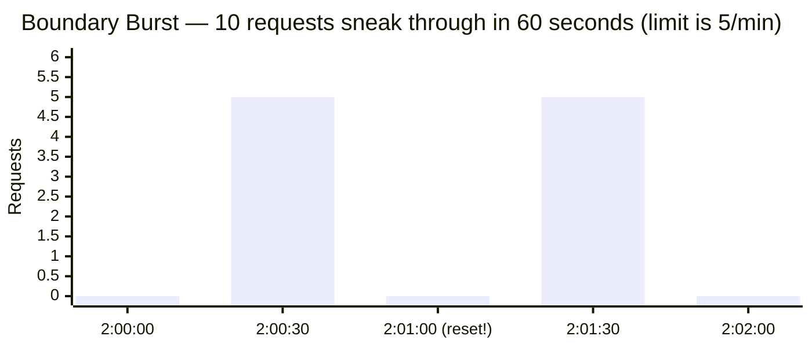

- At **2:00:30**, attacker fires 5 requests → uses up minute 1's quota. ✅ (5 allowed)
- Window resets at **2:01:00**
- At **2:01:00**, attacker fires 5 more requests → uses up minute 2's quota. ✅ (5 allowed)
- Between **2:00:30 and 2:01:30** — a single 60-second span — **10 requests went through**, which is double the intended limit of 5 per minute.

**This is the core flaw** the sliding window algorithms fix.

**Pros and Cons:**

| ✅ Pros | ❌ Cons |
|---------|---------|
| Very easy to understand and implement | Boundary burst can allow 2× the intended limit |
| Extremely memory efficient (just a counter) | Strict use cases (auth, billing) should avoid this |
| Resetting quota at window boundary is intuitive | — |

---

### Algorithm 4: Sliding Window Log 📋

**The core idea:** Instead of counting per fixed window, we log the **exact timestamp** of every request. When a new request arrives, we:

1. Remove all timestamps older than `now - windowSize`
2. Add the current timestamp
3. If the log size ≤ limit → allow. If log size > limit → reject.

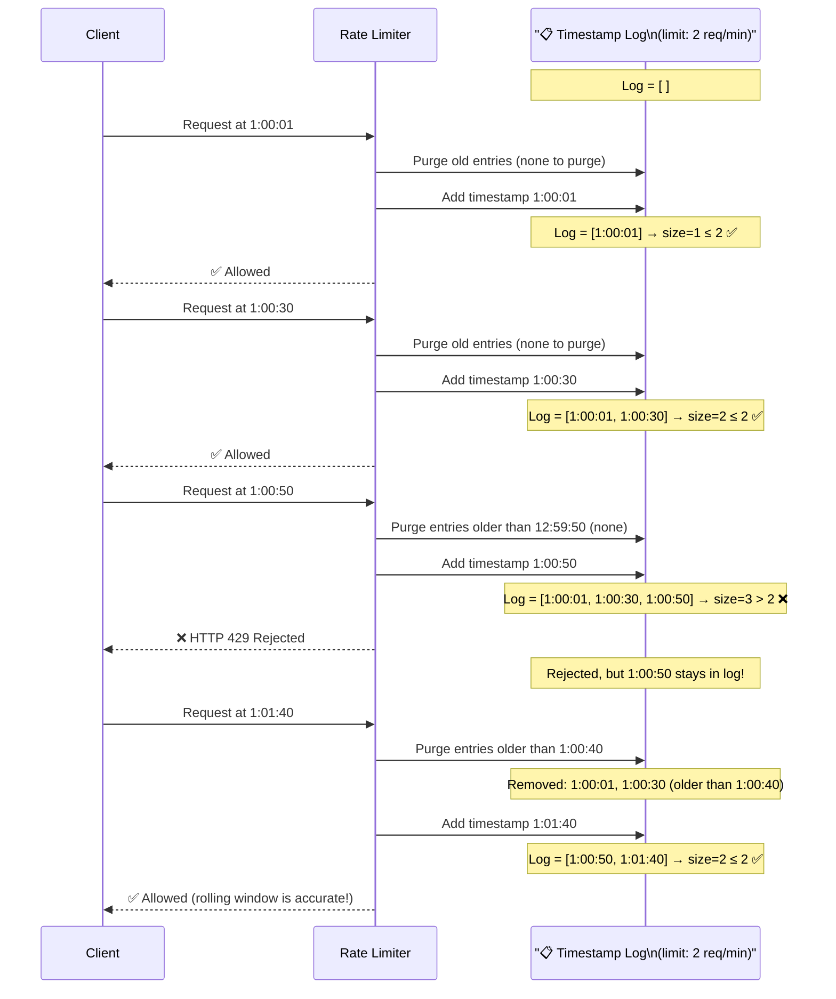

Notice that at **1:01:40**, the entries from **1:00:01 and 1:00:30** were purged because they fall outside the 1-minute rolling window. The rolling window always stays accurate.

**Pros and Cons:**

| ✅ Pros | ❌ Cons |
|---------|---------|
| Highly accurate — no boundary burst problem | High memory usage: every timestamp is stored |
| True rolling window, always precise | Even rejected requests consume memory (their timestamp stays) |

**When to use:** Strict compliance APIs where you cannot allow any boundary burst — financial transaction limits, regulatory rate limits.

---

### Algorithm 5: Sliding Window Counter — The Best of Both Worlds 🏆

> **Used by: Cloudflare (400 million requests/day, 0.003% error rate)**

This algorithm is a **hybrid** that combines the memory efficiency of Fixed Window Counter with the accuracy of Sliding Window Log. It doesn't store timestamps — it only stores two simple counters.

**The core insight:** Instead of tracking exact timestamps, we approximate the rolling count by assuming requests in the previous window were evenly distributed.

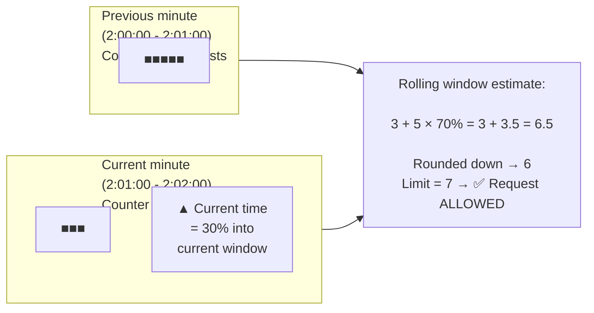

**The formula:**

> **Rolling count = current_window_requests + previous_window_requests × overlap_percentage**

Where `overlap_percentage` = what fraction of the previous window overlaps with the rolling window.

If we're 30% into the current minute, then 70% of the previous minute is within our rolling window.

**Worked example:**
- Limit: 7 requests/minute
- Previous window: 5 requests
- Current window (so far): 3 requests
- We're 30% into current window → previous window overlap = 70%
- Rolling estimate = 3 + 5 × 0.70 = **6.5 → rounded to 6**
- 6 < 7 → Request allowed ✅

One more request arrives:
- Rolling estimate = 4 + 5 × 0.70 = **7.5 → rounded to 7**
- 7 = 7 → Right at the limit, request allowed (or denied depending on implementation)

**Why does Cloudflare trust this approximation?**

This algorithm assumes requests in the previous window were evenly distributed across time. That's not always true. But in Cloudflare's experiment across **400 million requests**, this assumption was wrong only **0.003% of the time**. That's an extraordinary level of accuracy with essentially no extra memory cost.

**Pros and Cons:**

| ✅ Pros | ❌ Cons |
|---------|---------|
| Smooths out edge-case spikes | Approximate — not 100% accurate |
| Very memory efficient (just 2 counters) | Assumes uniform distribution in previous window |
| Proven accurate at Cloudflare scale | — |
| No timestamp storage needed | — |

---

### Comparing All Five Side by Side


| Algorithm | Memory | Accuracy | Burst OK? | Real-world usage |
|---|---|---|---|---|
| Token Bucket | Low ✅ | Medium | Yes ✅ | AWS, Stripe |
| Leaky Bucket | Low ✅ | Medium | No | Shopify |
| Fixed Window | Very Low ✅ | Low ❌ | Yes (exploitable) | Simple internal tools |
| Sliding Window Log | High ❌ | Very High ✅ | No | Strict compliance APIs |
| Sliding Window Counter | Low ✅ | High ✅ | Yes ✅ | Cloudflare |

**My recommendation:** For most teams building a public API, **Token Bucket** is the right default. For high-scale systems that need accuracy without memory cost, use **Sliding Window Counter**.

---

## Step 4 — High-Level Architecture

Now that we understand the algorithms, let's design the actual system around them.

### Why Redis (and not a database)?

The basic idea: we need a counter per user (or IP, or API key) that we can increment atomically on every single request.

You might think: "Why not use PostgreSQL?" Let's think about that:

- A busy API might handle **50,000 requests per second**
- Each request needs a counter read + increment
- That's 100,000 database operations per second
- A typical PostgreSQL instance maxes out at **~10,000 simple operations per second**
- With disk-based storage and connection overhead — **you'd never keep up**

Redis is different:
- **In-memory** — no disk I/O
- **Single-threaded** — operations are naturally serialized, no locking needed
- **Sub-millisecond** response time
- **INCR + EXPIRE** — atomic operations purpose-built for this

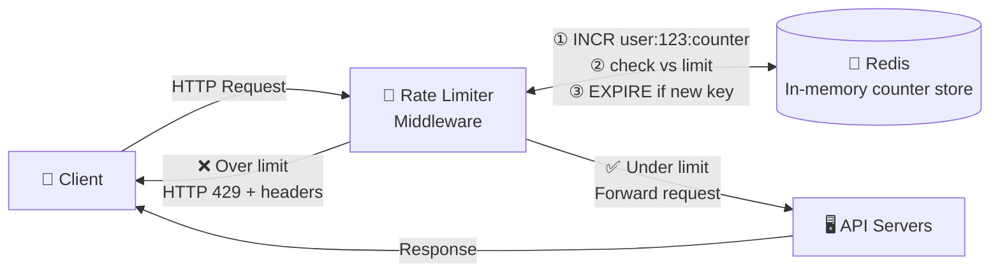

**The flow in detail:**

1. Client sends request to rate limiter middleware
2. Rate limiter fetches the counter from Redis for this user/IP/key
3. If counter + 1 > limit → reject with HTTP 429, return headers
4. If counter + 1 ≤ limit → increment counter, forward to API servers
5. If the counter key doesn't exist yet → create it with an EXPIRE matching the window

---

## Step 5 — Rate Limiting Rules

Rules define the policies. A rate limiter without rules is useless. Inspired by [Lyft's open-source rate limiter](https://github.com/lyft/ratelimit), rules are typically stored in config files:

```yaml
# 5 marketing messages per day
domain: messaging
descriptors:
  - key: message_type
    value: marketing
    rate_limit:
      unit: day
      requests_per_unit: 5

# 5 login attempts per minute (brute-force protection)
domain: auth
descriptors:
  - key: auth_type
    value: login
    rate_limit:
      unit: minute
      requests_per_unit: 5

# Free tier: 60 API calls/hour, Paid tier: 3600/hour
domain: api
descriptors:
  - key: user_tier
    value: free
    rate_limit:
      unit: hour
      requests_per_unit: 60
  - key: user_tier
    value: paid
    rate_limit:
      unit: hour
      requests_per_unit: 3600
```

**How rules flow through the system:**

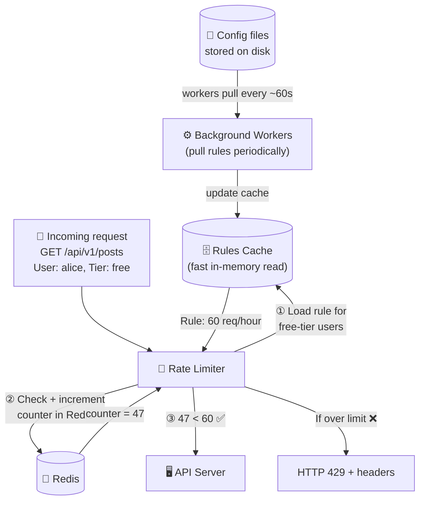

---

## Step 6 — Communicating Rate Limits to Clients

When you rate limit a client, don't just drop them silently. Give them the information they need to behave properly. The standard headers are:

```
HTTP/1.1 429 Too Many Requests
Content-Type: application/json
X-RateLimit-Limit: 100
X-RateLimit-Remaining: 0
X-RateLimit-Reset: 1748649600
Retry-After: 42

{
  "error": "rate_limit_exceeded",
  "message": "You have exceeded your rate limit of 100 requests/minute.",
  "retry_after_seconds": 42
}
```

| Header | What it tells the client |
|--------|--------------------------|
| `X-RateLimit-Limit` | Your total allowed requests per window |
| `X-RateLimit-Remaining` | How many you have left right now |
| `X-RateLimit-Reset` | Unix timestamp when your quota resets |
| `Retry-After` | Seconds to wait before retrying |

A well-behaved client reads these headers and adapts. A poorly-written client ignores them and keeps hammering — which is exactly why you need the rate limiter in the first place.

---

## Step 7 — The Full Detailed Design

Now let's put it all together into a production-grade design. This is the system we'd actually build.

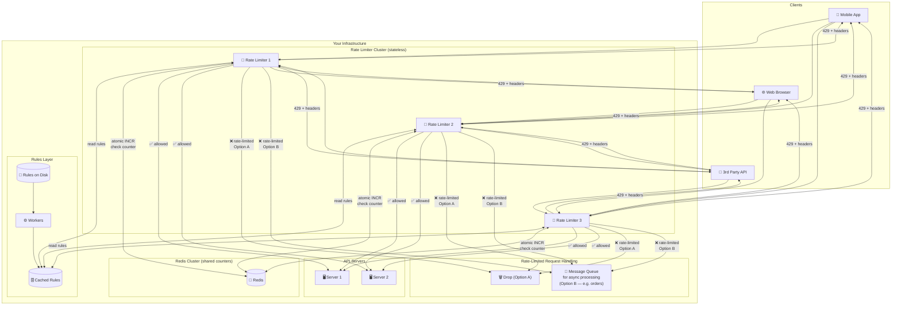

**The detailed flow:**

1. **Rules** are stored on disk. Background workers periodically pull the latest rules and store them in a fast local cache. Each rate limiter instance has its own rules cache — no network hop needed to look up a rule.

2. **A client request** arrives at one of the rate limiter instances (via load balancer).

3. **The rate limiter** loads the applicable rule from its local cache (e.g. "free-tier users: 60/hour").

4. **It fetches the current counter** from Redis and atomically increments it.

5. **Decision:**
   - If counter ≤ limit → forward request to API servers
   - If counter > limit → return 429 to the client. The excess request is either:
     - **Option A:** Dropped entirely
     - **Option B:** Queued in a message queue for later processing (useful when requests must eventually be processed, e.g. order submissions)

---

## Step 8 — The Hard Problem: Distributed Rate Limiting

Here's where it gets interesting. Running a rate limiter on one server is easy. But what happens when you have **10 rate limiter servers** running simultaneously? Two nasty problems emerge.

---

### Problem 1: Race Condition ⚡

Every rate limiter follows this sequence:
1. Read counter from Redis
2. Check if counter + 1 > limit
3. If not, increment counter in Redis

In a concurrent system, this sequence can interleave dangerously:

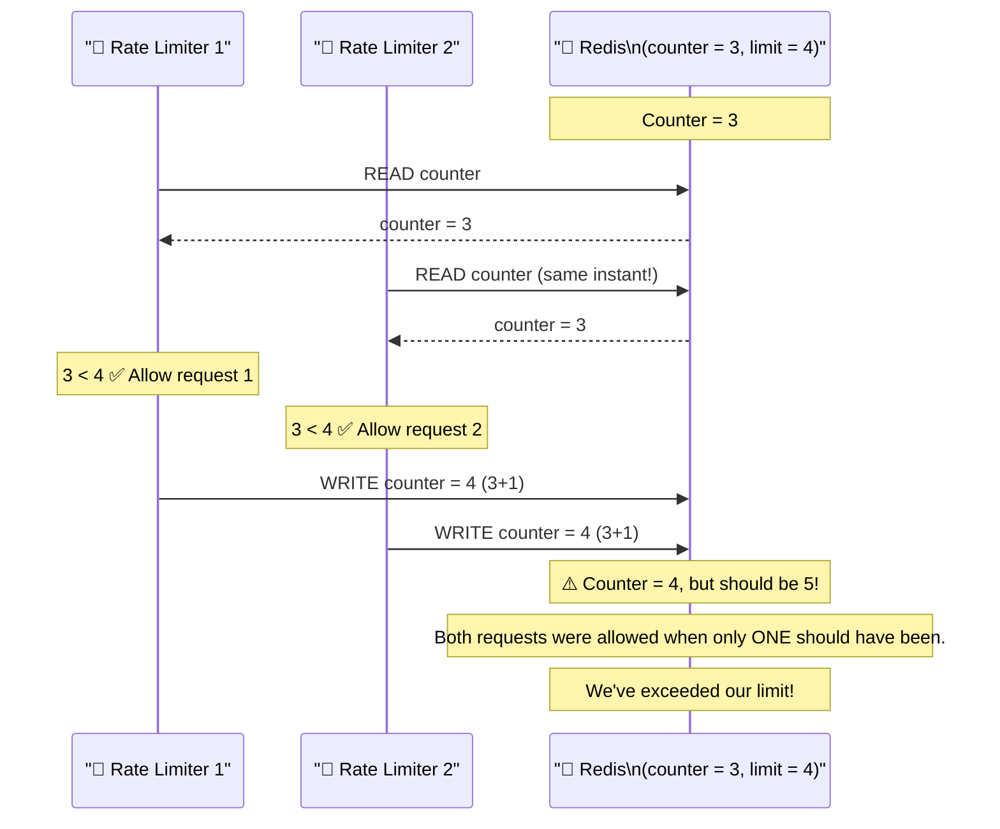

Both rate limiters read `3`, both think it's safe to proceed, both increment to `4`. But the correct value is `5`. We've allowed one extra request beyond our limit.

**The fix: Lua scripts in Redis**

Redis is single-threaded. If you wrap your entire read-check-increment logic in a Lua script, Redis executes it as a single, atomic, uninterruptible operation. No two Lua scripts can interleave.

```lua
-- This entire script runs atomically in Redis
-- No other command can execute between these lines
local key = KEYS[1]
local limit = tonumber(ARGV[1])
local window_seconds = tonumber(ARGV[2])

local current = redis.call("INCR", key)

-- Set expiry only when first creating the key
if current == 1 then
    redis.call("EXPIRE", key, window_seconds)
end

-- Return 1 (allowed) or 0 (rejected)
if current > limit then
    return 0
else
    return 1
end
```

Because the script is atomic, the race condition is impossible. Lua scripts are the standard solution — also used internally by popular rate limiting libraries.

---

### Problem 2: Synchronization 🔄

Imagine you have two rate limiter servers. A client sends requests that are load-balanced between them:

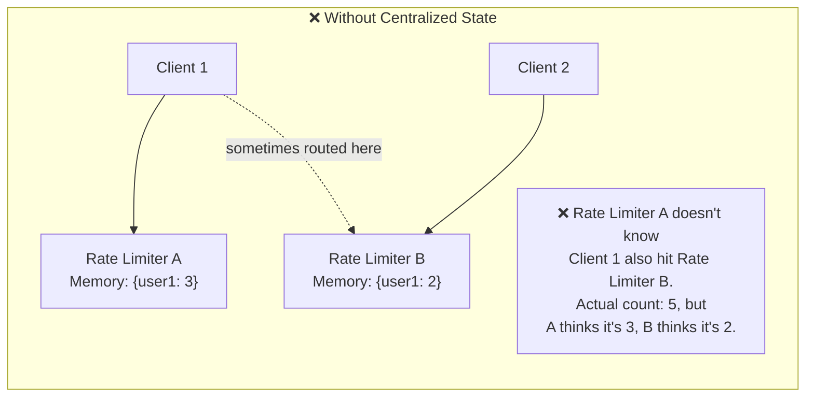

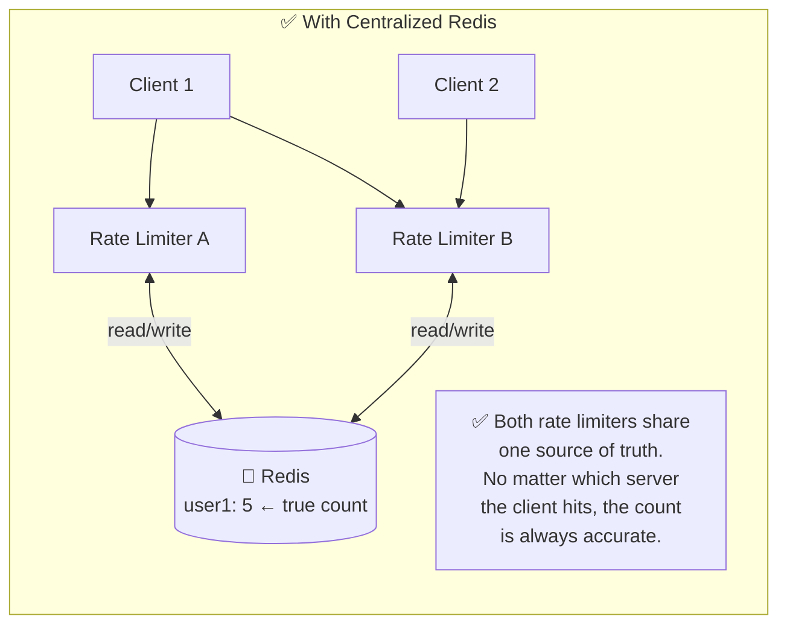

**The solution is simple:** All rate limiter servers must share state through a centralized Redis cluster. The rate limiters themselves are **stateless** — they hold no local counters, only local rules cache.

---

## Step 9 — Performance Optimization

Once you've solved correctness, optimize for speed and global scale.

### Optimization 1: Multi-Data Center Deployment

A user in Tokyo calling a rate limiter in Virginia adds 150ms of latency *just for the rate limit check*. That's unacceptable.

```mermaid
graph TD
    subgraph GLOBAL["Global Deployment"]
        subgraph US["🇺🇸 US East\n(Virginia)"]
            US_RL["Rate Limiter"]
            US_R[("Redis Cluster")]
            US_API["API Servers"]
            US_RL <--> US_R
            US_RL --> US_API
        end

        subgraph EU["🇪🇺 EU West\n(Ireland)"]
            EU_RL["Rate Limiter"]
            EU_R[("Redis Cluster")]
            EU_API["API Servers"]
            EU_RL <--> EU_R
            EU_RL --> EU_API
        end

        subgraph AP["🇯🇵 Asia Pacific\n(Tokyo)"]
            AP_RL["Rate Limiter"]
            AP_R[("Redis Cluster")]
            AP_API["API Servers"]
            AP_RL <--> AP_R
            AP_RL --> AP_API
        end

        US_R <-.->|"async replication\n(eventual consistency)"| EU_R
        EU_R <-.->|"async replication"| AP_R
        AP_R <-.->|"async replication"| US_R
    end

    USER_JP["👤 User in Tokyo"] --> AP_RL
    USER_US["👤 User in NY"] --> US_RL
    USER_EU["👤 User in London"] --> EU_RL
```

Cloudflare runs 194 edge server locations worldwide, so every rate limit check happens within a few milliseconds of the client.

### Optimization 2: Eventual Consistency

When you replicate Redis across multiple regions asynchronously, the counters aren't perfectly synchronized in real time. A user's counter in Tokyo and Virginia might differ by a few requests for a fraction of a second.

This is a deliberate tradeoff: **slightly imprecise counting** vs **low latency for every user in the world**. Cloudflare's data shows this imprecision affects only 0.003% of requests — a perfectly acceptable trade.

If you need strict consistency (e.g. financial APIs), synchronize data with a **strong consistency model** and accept the latency cost.

---

## Step 10 — Monitoring

Deploying a rate limiter and forgetting about it is a mistake. You must monitor it continuously.

```mermaid
flowchart LR
    RL["🚦 Rate Limiter"]

    RL -->|"Emit metrics"| METRICS[("📊 Prometheus\nMetrics Store")]
    METRICS --> GRAFANA["📈 Grafana Dashboard"]
    METRICS --> ALERTS{"🔔 Alert Rules"}

    ALERTS -->|"Rejection rate > 15%"| ALERT1["⚠️ Rules too strict!\nLegitimate users being blocked.\nConsider relaxing limits."]

    ALERTS -->|"Rejection rate drops to 0%"| ALERT2["⚠️ Rules too loose?\nOr attack bypassing limiter.\nCheck for anomalies."]

    ALERTS -->|"Flash sale detected:\n100× traffic spike"| ALERT3["🚨 Consider switching\nto Token Bucket\nfor burst tolerance."]
```

**Two things to validate constantly:**

1. **Algorithm effectiveness** — Are the right requests being blocked?
   - If a flash sale sends real users into 429s → your rules are too strict for burst events. Consider switching to Token Bucket which allows short bursts.
   - If a bot is bypassing your limiter → check if they're rotating IPs, using distributed networks, or exploiting algorithm weaknesses.

2. **Rule effectiveness** — Are the rules the right thresholds?
   - If 15% of requests are being rejected for a normally well-behaved endpoint → your limit is probably too low.
   - If an endpoint that should be protected shows 0% rejections during an attack → your limit is too high.

---

## Bonus — Advanced Topics for Interviews

These are points you can raise in the "wrap-up" phase of a system design interview to show depth:

### Hard vs Soft Rate Limiting

```mermaid
flowchart TD
    REQ["📨 Request arrives\n(over limit)"]

    REQ --> HARD["🔴 Hard Rate Limiting\n\nCannot exceed threshold.\nPeriod.\n\nHTTP 429 — no exceptions.\n\nBest for: login endpoints,\nbilling APIs, admin actions"]

    REQ --> SOFT["🟡 Soft Rate Limiting\n\nCan temporarily exceed\nfor short bursts.\n\nHTTP 200 with warning header:\nX-RateLimit-Warning: near-limit\n\nBest for: content APIs,\nnon-critical endpoints"]
```

### Rate Limiting at Different OSI Layers

Most of this article covers **Layer 7 (HTTP/Application)**. But rate limiting can happen at multiple layers:

```mermaid
graph TD
    L3["🌐 Layer 3 — Network (IP)\nBlock by source IP packets\nTool: iptables, cloud firewalls\nBest for: volumetric DDoS attacks"]
    L4["🔌 Layer 4 — Transport (TCP)\nLimit TCP connections per IP\nTool: Load balancer connection limits\nBest for: connection flood attacks"]
    L7["📡 Layer 7 — Application (HTTP)\nThrottle by user ID, API key, endpoint\nTool: API Gateway, middleware\nBest for: API abuse, scraping"]

    L3 -->|"Passes to"| L4 -->|"Passes to"| L7
    
    DDOS["🦹 DDoS Attacker\n(millions of packets)"] -->|"Blocked at L3"| L3
    BOT["🤖 Scraper Bot\n(many connections)"] -->|"Blocked at L4"| L4
    USER["😤 Abusive User\n(too many API calls)"] -->|"Blocked at L7"| L7
```

**Pro tip:** Layer your defences. A well-architected system uses cloud firewall rules at L3 for volumetric attacks, connection limits at L4, and application-level rate limiting at L7.

### How to Write a Well-Behaved API Client

```mermaid
flowchart TD
    REQUEST["Make API Call"] --> CHECK_CACHE{"Response\ncached?"}
    CHECK_CACHE -->|"Yes"| USE_CACHE["Use cached response\n(no API call needed) 🎉"]
    CHECK_CACHE -->|"No"| CALL["Make HTTP request"]

    CALL --> RESPONSE{"HTTP\nResponse?"}
    RESPONSE -->|"200 OK"| CACHE_RESP["Cache response\nwith appropriate TTL"]
    CACHE_RESP --> READ_HEADERS["Read X-RateLimit-Remaining\nSlow down proactively\nif remaining < 10%"]

    RESPONSE -->|"429 Too Many"| READ_RETRY["Read Retry-After header"]
    READ_RETRY --> JITTER["Wait: retry_after + random jitter\n(jitter prevents thundering herd\nwhen many clients retry at once)"]
    JITTER --> REQUEST

    RESPONSE -->|"5xx Server Error"| BACKOFF["Exponential backoff:\n1s → 2s → 4s → 8s → 16s\nMax 5 retries, then give up"]
    BACKOFF --> REQUEST
```

**Client best practices from the book:**
- **Cache responses** aggressively — fewer API calls = less chance of hitting limits
- **Read `X-RateLimit-Remaining`** — slow down before you hit zero, don't wait for 429
- **Add jitter to retries** — if 1000 clients all get 429 at the same time and all retry after exactly 30 seconds, you create a thundering herd
- **Handle exceptions gracefully** — catch 429 errors, never let them bubble up to the user as a crash

---

## Interview Cheat Sheet

Here's everything you need to ace a rate limiter question in one diagram:

```mermaid
mindmap
  root(("🚦 Rate Limiter\nDesign"))
    Requirements
      Server-side, not client
      Low latency < 1ms overhead
      Distributed across servers
      Fault tolerant
      Inform clients on throttle
    Algorithms
      Token Bucket
        AWS Stripe default
        Allows bursting
        Low memory
      Leaky Bucket
        Shopify uses it
        Constant outflow rate
        Good for stable downstream
      Fixed Window
        Simple to implement
        Boundary burst bug
        Avoid for strict limits
      Sliding Window Log
        Highest accuracy
        High memory cost
        Use for compliance APIs
      Sliding Window Counter
        Cloudflare at scale
        Best balance of both
        0.003% error rate
    Architecture
      Redis for counters
        Atomic Lua scripts
        Sub-millisecond latency
        INCR + EXPIRE commands
      Rules in config files
        Workers cache rules
        YAML format
        Domain + descriptor model
      API Gateway placement
        Single enforcement point
        No code changes to services
    Distributed Challenges
      Race condition
        Lua script atomicity
        Single-threaded Redis
      Synchronization
        Centralized Redis cluster
        All limiters share state
      Global scale
        Multi-region deployment
        Eventual consistency
        Edge servers
    HTTP Behaviour
      429 Too Many Requests
      X-RateLimit-Limit header
      X-RateLimit-Remaining header
      Retry-After header
    Extras
      Hard vs Soft limits
      L3 L4 L7 layers
      Monitor rejection rate
      Client backoff + jitter
```

---

## Summary

A rate limiter is one of the most impactful components you can add to a production API. Here are the key takeaways:

1. **Always put it on the server side** — client-side rate limiting is trivially bypassed
2. **Token Bucket** is the right default for most REST APIs — memory efficient, allows bursting, battle-tested by AWS and Stripe
3. **Sliding Window Counter** is the best choice for high-scale systems — Cloudflare proved it handles 400M requests/day with 0.003% inaccuracy
4. **Use Redis** for counter storage — sub-millisecond, atomic, in-memory
5. **Use Lua scripts** to eliminate race conditions in distributed environments
6. **All rate limiter servers must share state** via a centralized Redis cluster — never use local in-memory counters across multiple servers
7. **Always return helpful headers** — `X-RateLimit-Remaining`, `Retry-After` — so well-behaved clients can adapt
8. **Monitor your rejection rate** — too high means your rules are too strict, too low means they're too loose or you're being bypassed
9. **Layer your defences** — combine L3 firewall rules for DDoS with L7 application rate limiting for API abuse

---

## What's Next?

In **Chapter 5**, we'll design a **Consistent Hashing** system — the brilliant algorithm that powers Redis Cluster, Apache Cassandra, and Amazon DynamoDB. It solves one of the hardest problems in distributed systems: how do you add or remove servers without redistributing all your data?

*Share this article with a colleague preparing for system design interviews — understanding rate limiters is essential knowledge for any senior engineer.*
