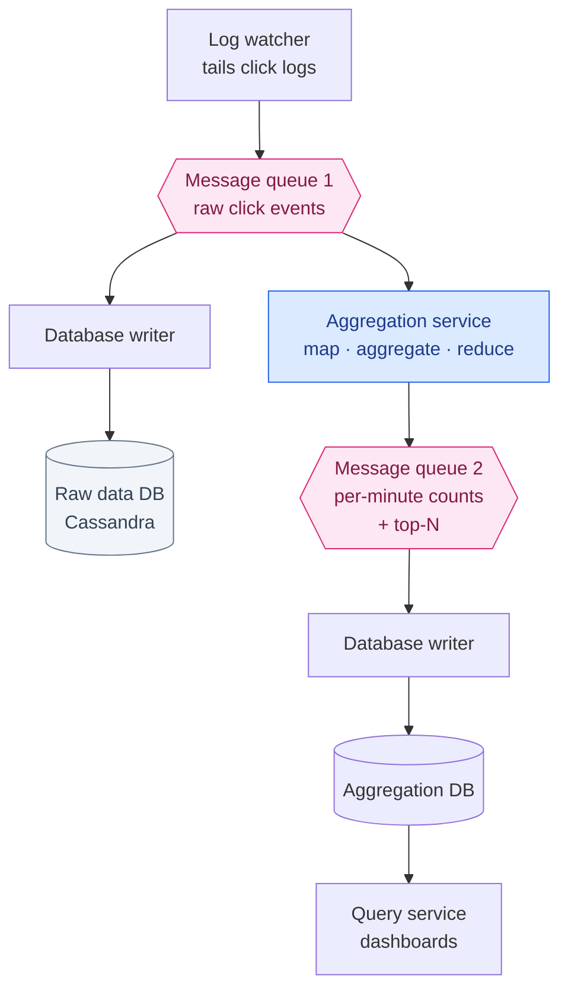
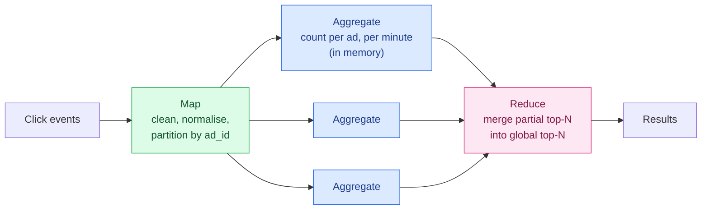
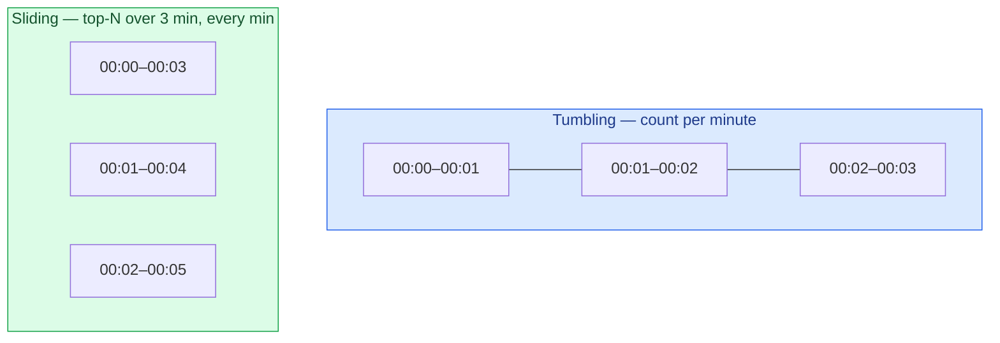
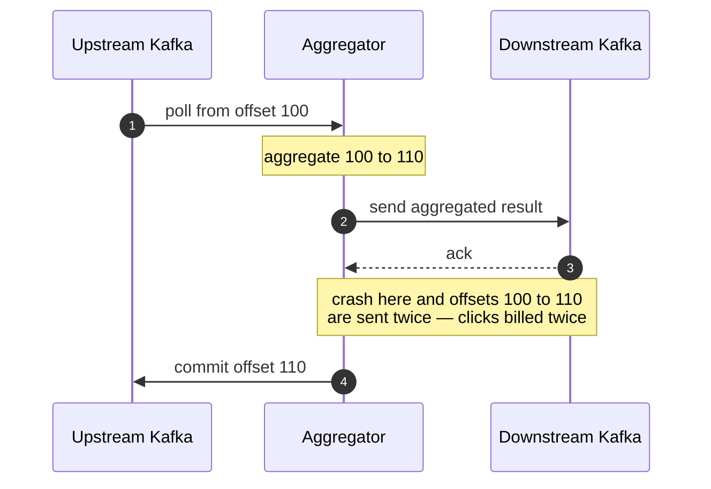
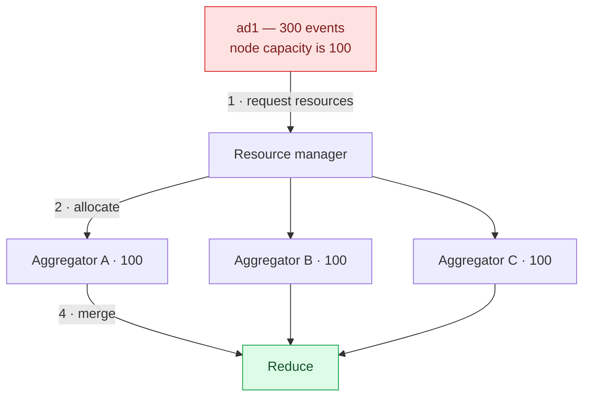

Most systems in this series can lose a little data and survive. A dropped metric leaves a gap on a chart. A missed location update is corrected 30 seconds later.

This one is different, and the difference changes everything: **these numbers become invoices.**

Ad click aggregation decides how much advertisers pay and how much publishers earn. A 1% error on a billion clicks a day is millions of dollars, in someone's favour, every month. That single fact is why this design reaches for **exactly-once** processing — which we spent [the last chapter](/2026/06/design-distributed-message-queue/) establishing is expensive and usually unnecessary.

Here it is necessary. That makes this the design where the expensive option is the correct one.

---

## Step 1 — Scope

### Requirements

**Input**: log files on many servers, appended with each click. Each event has `ad_id`, `click_timestamp`, `user_id`, `ip`, `country`.

**Three queries to support:**

1. Number of clicks for a given `ad_id` in the last **M** minutes.
2. The **top 100** most clicked ads in the past minute — both parameters configurable.
3. Filtering by `ip`, `user_id` or `country` on either of the above.

**Edge cases explicitly in scope**: events arriving late, duplicate events, and partial system failure.

**Latency**: a few minutes end-to-end is fine.

That last one deserves attention, because it's easy to misread. Real-time bidding operates in **under a second** — an auction runs while the page loads. But aggregation is for **billing and reporting**, and nobody needs their spend dashboard accurate to the second.

**Being handed a relaxed latency budget is a gift, and it should be spent.** Those minutes are what buy room for watermarks, deduplication, and exactly-once machinery. A system with a one-second budget could not be correct in the same way.

### Back-of-the-envelope

- **1 billion** ad clicks per day, 2 million ads total
- Growth: **30% year over year** — traffic doubles about every three years

```
Click QPS = 10⁹ / 10⁵ = 10,000
Peak QPS (5×)          = 50,000
Storage = 0.1 KB × 10⁹ = 100 GB/day ≈ 3 TB/month
```

Note the shape of this: **50,000 QPS is a serious write load, but 3 TB a month is nothing.** The difficulty is throughput and correctness, not volume.

---

## Step 2 — High-level design

### The query API

The client here is a dashboard, and the requirements name exactly two questions it asks:

| Endpoint | Answers |
|---|---|
| `GET /v1/ads/{ad_id}/aggregated_count` | How many clicks did this ad get in the last M minutes? |
| `GET /v1/ads/popular_ads` | Which N ads were clicked most in the last M minutes? |

Both take `from` and `to` minute bounds — defaulting to the last minute — and both take a **`filter` identifier** rather than free-form filter expressions. `001` might mean "non-US clicks".

That last choice looks like a limitation and is actually the design. **Arbitrary filtering means arbitrary aggregation at query time**, which is what this whole pipeline exists to avoid. A fixed set of filter identifiers means each one can be pre-aggregated, and the query stays a lookup. It reappears as the star schema below.

### Two kinds of data

**Raw events** — every click, as it happened:

```
ad_id    click_timestamp        user_id   ip              country
ad001    2021-01-01 00:00:01    user1     207.148.22.22   USA
ad001    2021-01-01 00:00:02    user1     207.148.22.22   USA
ad002    2021-01-01 00:00:02    user2     209.153.56.11   USA
```

**Aggregated data** — counts per ad per minute:

| ad_id | click_minute | filter_id | count |
|---|---|---|---|
| ad001 | 202101010000 | 0012 | 2 |
| ad001 | 202101010000 | 0023 | 3 |

**Keep both.** Aggregated data is what you query — the raw form is far too large to scan for every dashboard refresh. But raw data is the **backup you compute from when the aggregation is wrong**, and aggregation logic will eventually be wrong. Old raw data moves to cold storage; aggregated data stays hot.

That's the whole argument for keeping raw events, and it's the same instinct as an append-only log: **a derived value can always be rebuilt from a source of truth, and never the other way round.**

### Filtering with a star schema

Requirement three — filter by country, IP, user — is handled by **pre-aggregating along each dimension**:

| ad_id | click_minute | country | count |
|---|---|---|---|
| ad001 | 202101010001 | USA | 100 |
| ad001 | 202101010001 | GBR | 200 |
| ad001 | 202101010001 | others | 3000 |

This is a **star schema**, standard in data warehousing, and the filtering fields are **dimensions**. Queries are fast because every answer is precomputed.

The cost is combinatorial: **each new dimension multiplies the number of rows.** If that sounds familiar, it's the same multiplication as [the cardinality problem in the last chapter](/2026/06/design-metrics-monitoring-alerting/) — precomputed aggregates and time-series labels blow up for identical reasons.

### The pipeline

A synchronous pipeline would be fragile. If producers outrun consumers — a traffic spike, a slow node — consumers run out of memory, and one failed component stops everything.

**Two message queues** fix that:



**Why a second queue rather than writing results straight to the database?** Because the boundary between "aggregation finished" and "result durably stored" is exactly where exactly-once guarantees are won or lost. A queue that supports atomic commit lets the aggregator commit its output and its input offset **together**. Writing directly to a database splits that into two operations that can disagree.

### The aggregation service as a DAG

Aggregation is a MapReduce-shaped problem, expressed as a directed acyclic graph:



**Why a Map node at all?** You could partition in Kafka and let aggregators subscribe directly. Two reasons not to: input often needs cleaning or normalising first, and **you may not control how events were produced** — so events for the same `ad_id` can land in different partitions. The Map node re-partitions on a key you actually chose.

**Top-N reduces beautifully.** Each aggregator keeps a heap of its own top 3. The reducer takes 3 candidates from each of 3 nodes — 9 total — and picks the global top 3. Each node ships a tiny summary rather than its full counts, which is what makes the whole approach scale.

---

## Step 3 — Deep dive

### Event time or processing time?

The most important decision in this design, and it is not close.

**Event time** is when the click happened. **Processing time** is when your server got round to it.

They diverge — sometimes enormously. A phone goes through a tunnel and its event arrives **five hours late**.

| | Advantage | Problem |
|---|---|---|
| **Event time** | Results are correct — the click genuinely happened then | Depends on a client-supplied clock, which may be wrong or forged |
| **Processing time** | The server's clock is reliable | A delayed event is counted in the wrong minute |

**Use event time.** When the output is an invoice, a click must be billed to the minute it occurred, not the minute your pipeline noticed. Processing time produces results that are *reliably computed* and *wrong*.

Which creates the problem that defines every streaming system: **if you aggregate by event time, when do you stop waiting?**

### Watermarks

A minute-long window covering 00:00–00:01 could theoretically receive a matching event at any point in the future. Wait forever and you never emit a result. Close at 00:01 and you lose every event still in flight.

A **watermark** extends the window by a grace period. Close the 00:00–00:01 window at 00:01:15 and events up to 15 seconds late still land correctly.

**The dial is pure trade-off:**

- A **long** watermark catches more late events — more accuracy, more latency.
- A **short** watermark emits sooner — less latency, less accuracy.

### Find the right watermark

Below is a fixed set of clicks, each with a real arrival delay. The distribution is realistic: most events are nearly instant, a handful lag by tens of seconds, and two are hopelessly late. Drag the watermark and watch what you buy:

<div class="wm-sim" id="wm"><div class="wm-row"><label for="wm-w">Watermark <b><span id="wm-wv">15</span>s</b></label><input type="range" id="wm-w" min="0" max="120" step="5" value="15"></div><div class="wm-grid"><div class="wm-stat"><span class="wm-num" id="wm-acc">—</span><span class="wm-lbl">Events in the right window</span></div><div class="wm-stat"><span class="wm-num" id="wm-miss">—</span><span class="wm-lbl">Missed / miscounted</span></div><div class="wm-stat wm-cost"><span class="wm-num" id="wm-lat">—</span><span class="wm-lbl">Added latency per window</span></div></div><div class="wm-events" id="wm-events"></div><p class="wm-note" id="wm-note"></p></div>
<script>
(function () {
  var w = document.getElementById("wm-w");
  if (!w) return;
  // offset = seconds into the 60s window when the click happened
  // delay  = seconds between the click and its arrival at the aggregator
  var events = [
    { id: "a", offset: 4,  delay: 1 },   { id: "b", offset: 9,  delay: 2 },
    { id: "c", offset: 14, delay: 1 },   { id: "d", offset: 21, delay: 3 },
    { id: "e", offset: 27, delay: 2 },   { id: "f", offset: 33, delay: 8 },
    { id: "g", offset: 38, delay: 4 },   { id: "h", offset: 44, delay: 12 },
    { id: "i", offset: 49, delay: 6 },   { id: "j", offset: 52, delay: 14 },
    { id: "k", offset: 55, delay: 9 },   { id: "l", offset: 57, delay: 22 },
    { id: "m", offset: 58, delay: 35 },  { id: "n", offset: 59, delay: 55 },
    { id: "o", offset: 46, delay: 900 }, { id: "p", offset: 12, delay: 18000 }
  ];
  var wv = document.getElementById("wm-wv"),
      accEl = document.getElementById("wm-acc"),
      missEl = document.getElementById("wm-miss"),
      latEl = document.getElementById("wm-lat"),
      listEl = document.getElementById("wm-events"),
      note = document.getElementById("wm-note");
  function render() {
    var wm = +w.value;
    wv.textContent = wm;
    var hit = 0, html = "";
    for (var i = 0; i < events.length; i++) {
      var e = events[i];
      // the window closes at 60 + watermark; the event arrives at offset + delay
      var ok = (e.offset + e.delay) < (60 + wm);
      if (ok) hit++;
      var lateLabel = e.delay >= 60 ? (e.delay >= 3600 ? Math.round(e.delay / 3600) + "h" : Math.round(e.delay / 60) + "m") : e.delay + "s";
      html += '<span class="wm-ev ' + (ok ? "wm-in" : "wm-out") + '">' + e.id + ' <i>+' + lateLabel + '</i></span>';
    }
    listEl.innerHTML = html;
    var miss = events.length - hit;
    accEl.textContent = hit + "/" + events.length;
    missEl.textContent = miss;
    latEl.textContent = "+" + wm + "s";
    if (wm === 0) note.textContent = "With no watermark you lose every event still in flight when the minute ends — including ones only a second late.";
    else if (miss <= 2) note.textContent = "Diminishing returns. The two stragglers are 15 minutes and 5 hours late; no practical watermark catches them, and waiting for them would delay every window.";
    else note.textContent = "Each extra second of watermark buys a few more events — and costs every window that much more latency.";
  }
  w.addEventListener("input", render);
  render();
})();
</script>

Two lessons come out of dragging that slider.

**Every second you wait buys progressively less.** With no watermark you land 9 of 16 events in the right window — you lose even the ones only a second or two late, because they were unlucky enough to click near the end of the minute. Fifteen seconds gets you to 11. A full minute gets you to 14.

**Then it stops.** Push the slider to 120 seconds and you still get 14. Events `o` and `p` are 15 minutes and 5 hours late, and no watermark you would ever accept reaches them — waiting five hours to close a one-minute window is absurd. **The curve flattens hard, and where it flattens is where you stop paying.**

So watermarks are explicitly **not** a correctness mechanism — they're a cheap way to capture the bulk of lateness. Genuine correctness comes from somewhere else.

### Reconciliation

That somewhere else is a nightly **batch job** that re-reads the raw events, sorts them by event time, and compares its totals against what the streaming pipeline produced.

There's no third party to reconcile against — unlike banking, where you compare your ledger to the bank's. So the check is **the same data computed a different way**: a slow, complete, order-insensitive batch pass against a fast, approximate, streaming one.

**That is the actual answer to late events.** The watermark catches 95% cheaply. Reconciliation catches the rest, slowly, and corrects the record before anyone is billed.

### Windows

**Tumbling windows** are fixed-length and non-overlapping — 00:00–00:01, 00:01–00:02. Right for "clicks per minute", since every event belongs to exactly one window.

**Sliding windows** overlap: "top ads in the last 3 minutes", recomputed every minute. Right for query two, where the window is longer than the update interval.



### Exactly-once, and why it's genuinely hard

Duplicates come from two places: **clients** resending (malicious repetition is a fraud problem, not an aggregation one), and **server failure** mid-aggregation.

The failure case is the instructive one. An aggregator consumes offsets 100–110, aggregates them, sends the result downstream, then commits offset 110 upstream. If it dies **after sending but before committing**, a replacement starts again at 100 — and those clicks are billed twice.

The obvious fixes each fail:

**Save the offset to external storage before processing?** Then if the send fails, the offset says 110 and those events are **never processed at all**. You traded duplication for loss.

**Save the offset after the downstream acknowledges?** Better — but the gap between "downstream acked" and "offset saved" is still a window where a crash duplicates.



**You cannot close the gap by reordering two operations.** Whichever you do first, a crash between them produces either loss or duplication. The only real fix is to make the send and the commit **one atomic transaction** — which is why the second message queue exists, and why the design needs a system that supports distributed transactions.

**Exactly-once isn't a setting. It's a transaction boundary drawn around two operations that must agree.**

### Scaling, and the hotspot

The three components — queue, aggregation, database — are decoupled and scale independently.

**Partition by `ad_id`** so all events for one ad land in one partition and one aggregator. **Pre-allocate partitions generously**: changing the partition count remaps ad IDs to different partitions, which scrambles in-flight aggregation state.

Which creates the problem this design has and the previous ones didn't: **hotspots**.

Ad traffic is extremely skewed. A company with a multi-million-dollar budget generates orders of magnitude more clicks than a local shop. Partitioning by `ad_id` sends all of that to **one** node.

The fix is dynamic: when a node exceeds capacity, it requests more resources, splits its events across additional nodes, and the partial results are merged back.



**Partition keys that are natural are often skewed.** `ad_id` is the obvious key and the skewed one. Detecting hot keys and splitting them dynamically is the general answer — the same shape as [the celebrity problem in the news feed chapter](/2026/06/design-news-feed-system/).

### Fault tolerance

Aggregation happens in memory, so a node crash loses its counts. You can replay from Kafka — but replaying from the beginning is impossibly slow.

**Snapshot the state periodically**: not just the upstream offset, but the aggregation state itself — the running counts and the top-N heaps. On failure, a new node loads the latest snapshot and replays only the events after it.

### Lambda or Kappa?

The design has two processing paths: streaming for live results, batch for historical replay and reconciliation. That's **Lambda architecture**, and its well-known flaw is **two codebases computing the same thing** — which drift, and disagree in ways nobody can explain.

**Kappa architecture** uses one path. Reprocessing history means replaying old events through the *same* streaming engine.

This design is Kappa: recalculation reads raw data and pushes it through a **dedicated instance of the same aggregation service**, so live traffic isn't disturbed but the logic is identical. One implementation, two data sources.

**If two paths must agree, make them literally the same code.** Anything else is a reconciliation problem you invented for yourself.

---

## What has changed since the book

### Flink's checkpointing is the mechanism this needs

"Wrap it in a distributed transaction" is where most treatments stop, filing the rest under advanced topics. It's worth knowing how stream processors actually do it.

Flink implements a variant of the **Chandy-Lamport** distributed snapshot algorithm called **asynchronous barrier snapshotting**. The job manager injects **barriers** into the source streams. Barriers flow along with the data; when an operator has received the barrier on all its inputs, it snapshots its state and forwards the barrier downstream. When every operator acknowledges, the checkpoint is complete.

That gives a **consistent cut** across a distributed pipeline without stopping it.

End-to-end exactly-once then needs **transactional sinks**: the sink writes inside a transaction and **commits nothing until the checkpoint completes**. A crash rolls the transaction back and the pipeline restarts from the last checkpoint — the two-phase commit described above, built into the framework.

This is the practical answer to that unwinnable ordering problem: **don't hand-roll it.** Use an engine where the transaction boundary is part of the execution model.

### Real-time OLAP databases took over the serving layer

ClickHouse and Druid are often listed as an alternative. They've become the mainstream answer.

Columnar, real-time OLAP stores — **Druid, ClickHouse, Apache Pinot** — ingest streaming data and serve aggregate queries over billions of rows in milliseconds. They absorb both jobs the design splits between an aggregation service and an aggregation database: **ingest the stream, pre-aggregate on the way in, serve slice-and-dice queries**.

That collapses much of the architecture. You still need the streaming layer for exactly-once and windowing, but the star-schema tables and the query service become one system.

### The industry tried to make this obsolete — and failed

The most interesting development, and it goes well beyond architecture.

This entire design assumes you can identify and count clicks across sites. That assumption came under sustained attack: Apple's App Tracking Transparency, browsers blocking third-party cookies, and Google's **Privacy Sandbox** — launched 2019 to replace cookie-based measurement with privacy-preserving APIs.

The **Attribution Reporting API** was the replacement for exactly what this design builds. Rather than a log of individual clicks, it offered **aggregated, deliberately noisy reports**: summary reports processed through an aggregation service that returns only noisy aggregates, and event-level reports carrying just **3 bits of conversion data for a click, 1 bit for a view**, delivered with deliberate delay. Differential privacy applied to ad measurement.

It did not survive.

- **July 2024** — Google reversed course and said it would not deprecate third-party cookies.
- **April 2025** — the replacement plan, a user prompt, was dropped too.
- **October 2025** — Google **retired ten Privacy Sandbox APIs**, Attribution Reporting among them, citing "low levels of adoption" alongside sustained regulatory pressure. Chrome began deprecating them in Chrome 144 and targeted removal for Chrome 150.

A smaller set survives — CHIPS, FedCM, Private State Tokens — chosen for having actually been adopted.

**Two things worth taking from that.**

The design above is **not** obsolete. A platform counting clicks on its own inventory — the first-party case — is unaffected by any of this, and that is precisely what's designed here. What the privacy work targeted was *cross-site* attribution.

And the industry attempted to replace exact counting with **statistically noisy aggregates**, deliberately trading accuracy for privacy — the exact opposite of the premise here, that a 1% error is millions of dollars. It's a striking example of a **non-technical requirement reshaping an architecture**, and of an ambitious redesign failing not on engineering merit but on adoption.

---

## What to take away

**Correctness requirements come from what the output is used for.** Metrics tolerate loss because a gap in a chart is survivable. Clicks don't, because they become invoices. Ask what the number *does* before choosing a delivery guarantee — the answer determines whether exactly-once is worth its cost.

**Event time versus processing time is the fundamental streaming decision.** Processing time is easy and produces confidently wrong answers. Event time is correct and forces you to decide when to stop waiting — which is the whole discipline of watermarks and windows.

**Watermarks are an optimisation, not a correctness mechanism.** They cheaply catch the bulk of lateness. The genuinely late tail is unreachable at any acceptable latency, so correctness comes from a batch reconciliation pass, not a longer wait.

**Exactly-once is a transaction boundary, not a config value.** Sending downstream and committing an offset must be atomic. Reorder them all you like — a crash in the gap gives you loss one way and duplication the other.

**Natural partition keys are usually skewed.** `ad_id` is the obvious key, and a handful of advertisers dwarf everyone else. Expect hot keys and plan to split them; the alternative is one overloaded node while the rest idle.

**Keep the raw data.** Aggregates are derived, and derived values are eventually wrong. Raw events are what let you recompute after the bug is fixed — which is also what makes reconciliation possible at all.

---

## References and Further Reading

**Stream processing**

<ul>
<li><a href="https://nightlies.apache.org/flink/flink-docs-master/docs/learn-flink/fault_tolerance/">Flink fault tolerance</a> — checkpoints, barriers and exactly-once</li>
<li><a href="https://nightlies.apache.org/flink/flink-docs-release-1.0/internals/stream_checkpointing.html">Data streaming fault tolerance</a> — asynchronous barrier snapshotting in detail</li>
<li><a href="https://en.wikipedia.org/wiki/Chandy%E2%80%93Lamport_algorithm">The Chandy–Lamport algorithm</a> — the 1985 paper Flink's checkpointing derives from</li>
<li><a href="https://flink.apache.org/">Apache Flink</a> · <a href="https://spark.apache.org/streaming/">Spark Streaming</a></li>
<li><a href="https://dataintensive.net/">Designing Data-Intensive Applications</a> — Chapter 11 on stream processing and window types</li>
</ul>

**Analytics stores**

<ul>
<li><a href="https://clickhouse.com/">ClickHouse</a> · <a href="https://druid.apache.org/">Apache Druid</a> · <a href="https://pinot.apache.org/">Apache Pinot</a></li>
<li><a href="https://cassandra.apache.org/">Apache Cassandra</a></li>
<li><a href="https://parquet.apache.org/">Apache Parquet</a> · <a href="https://orc.apache.org/">Apache ORC</a> · <a href="https://avro.apache.org/">Apache Avro</a></li>
<li><a href="https://en.wikipedia.org/wiki/Star_schema">Star schema</a></li>
</ul>

**Architecture patterns**

<ul>
<li><a href="https://en.wikipedia.org/wiki/Lambda_architecture">Lambda architecture</a> · <a href="https://www.oreilly.com/radar/questioning-the-lambda-architecture/">Questioning the Lambda Architecture</a> — Jay Kreps's original Kappa argument</li>
<li><a href="https://hadoop.apache.org/docs/current/hadoop-yarn/hadoop-yarn-site/YARN.html">Apache Hadoop YARN</a></li>
</ul>

**Advertising and privacy**

<ul>
<li><a href="https://privacysandbox.google.com/private-advertising/attribution-reporting/web">Attribution Reporting API</a> — the privacy-preserving replacement, now being retired</li>
<li><a href="https://en.wikipedia.org/wiki/Privacy_Sandbox">Privacy Sandbox</a> — the initiative's history and its retirement</li>
<li><a href="https://en.wikipedia.org/wiki/Real-time_bidding">Real-time bidding</a> · <a href="https://en.wikipedia.org/wiki/Click-through_rate">Click-through rate</a></li>
<li><a href="https://arxiv.org/html/2412.16916">On the Differential Privacy and Interactivity of Privacy Sandbox Reports</a></li>
</ul>

**In this series**

<ul>
<li><a href="/guide/">The complete guide</a> — every article in order</li>
<li><a href="/2026/06/design-distributed-message-queue/">Design a Distributed Message Queue</a> — delivery semantics, and what exactly-once costs</li>
<li><a href="/2026/06/design-metrics-monitoring-alerting/">Metrics Monitoring and Alerting</a> — the same aggregation shape where loss is acceptable</li>
<li><a href="/2026/06/design-news-feed-system/">Design a News Feed System</a> — the other design ruined by skewed keys</li>
</ul>
