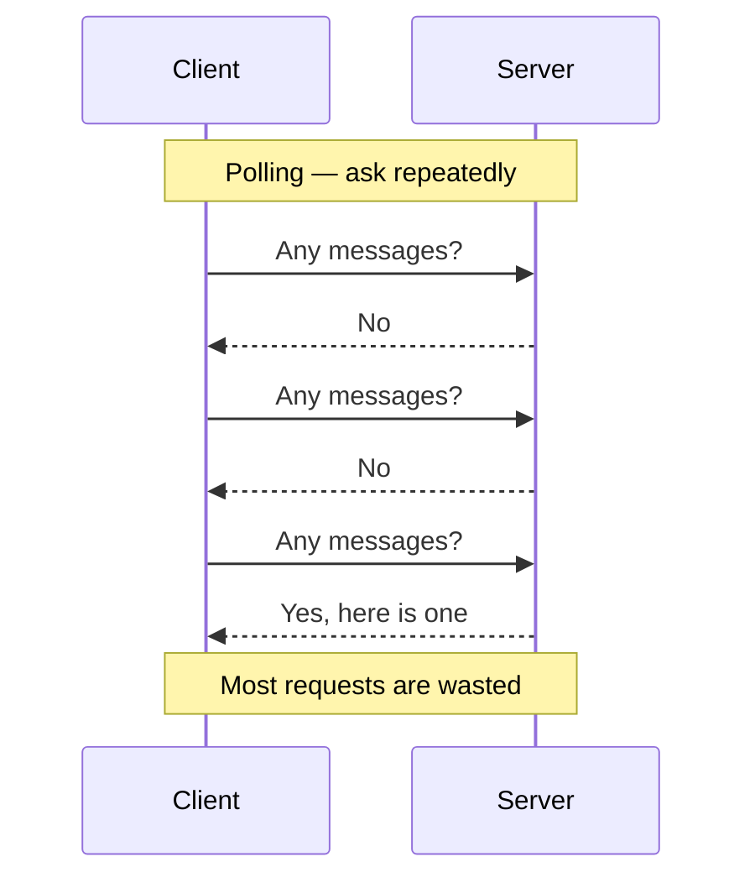
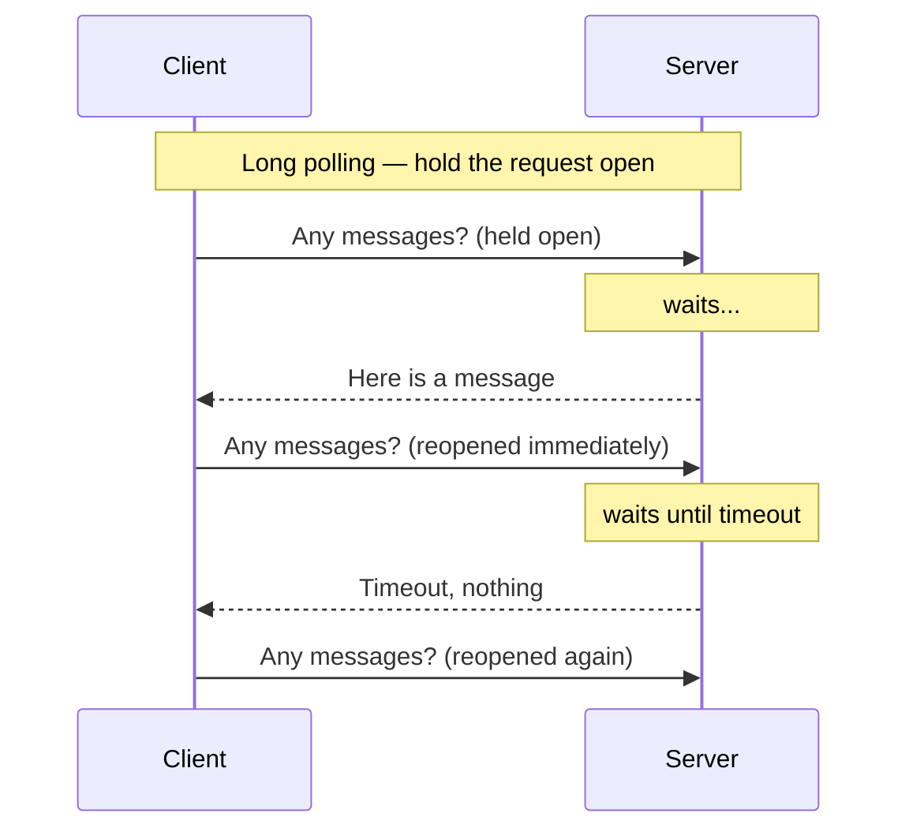
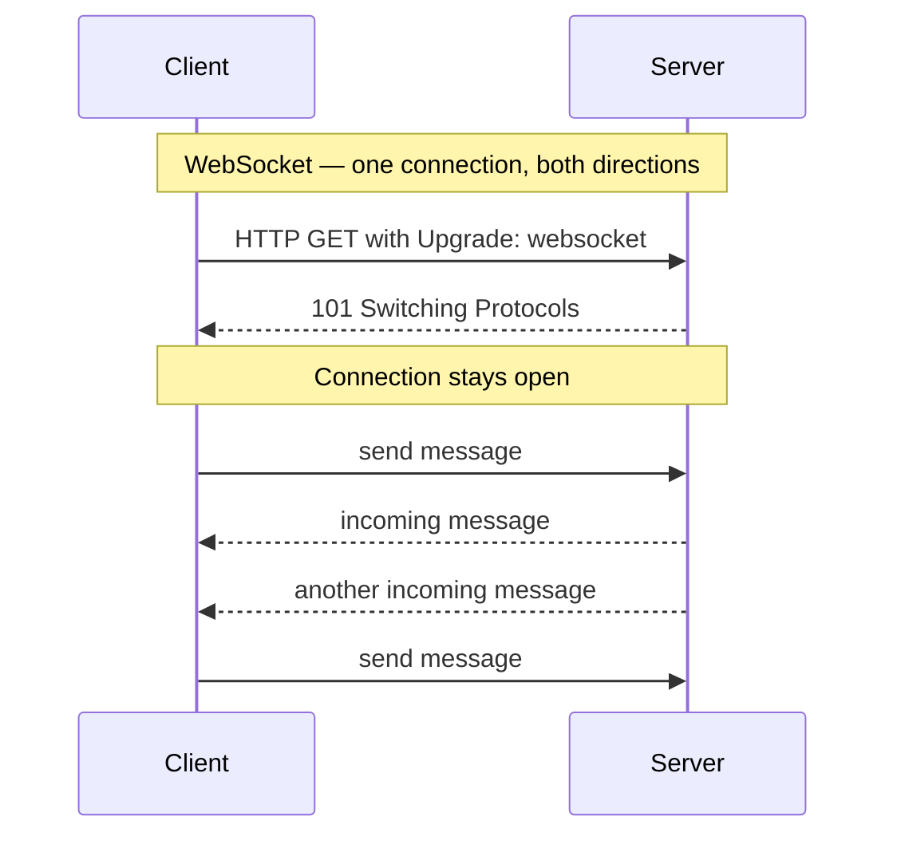
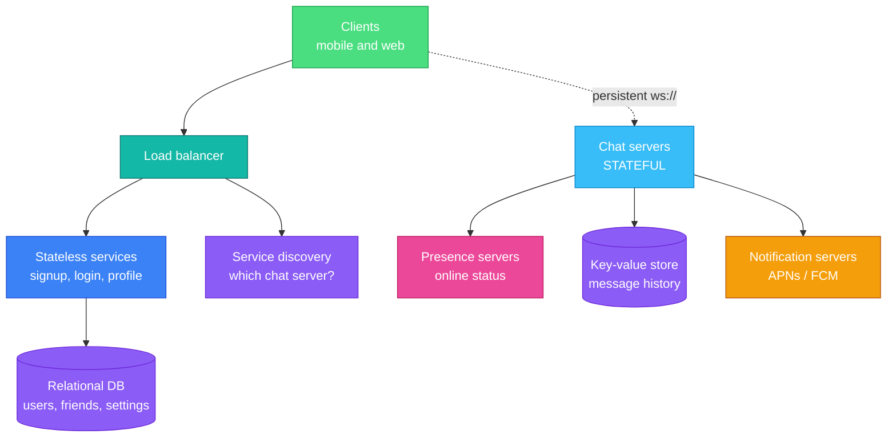
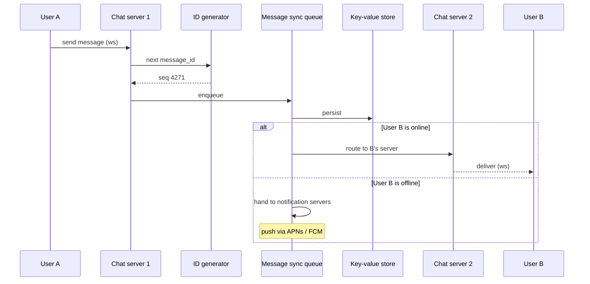
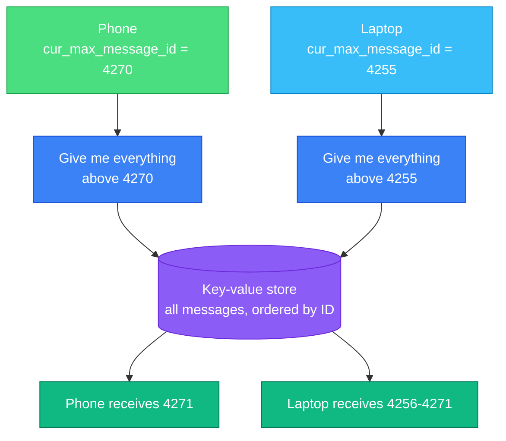
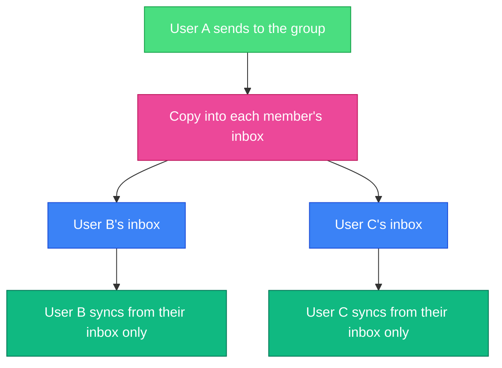
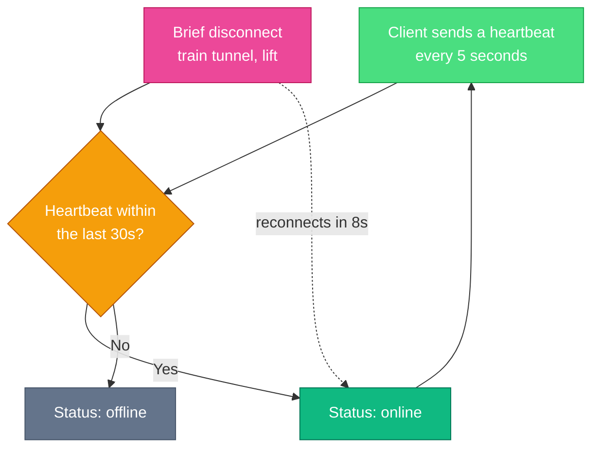

The [news feed](/2026/06/design-news-feed-system/) we built last chapter can be seconds stale and nobody notices. Chat inverts every one of those assumptions.

A message that arrives thirty seconds late is a broken product. A message that arrives twice is a visible bug. A message that arrives out of order makes a conversation nonsensical — the reply shows up before the question. And unlike a feed, where the user pulls, **the server must push**, to a client that may be behind a firewall, on a train, or asleep.

Three problems define this design:

- **The server needs to initiate.** HTTP is client-initiated. Everything below follows from working around that.
- **Ordering must be guaranteed**, and you cannot use timestamps to get it. Two messages can share a millisecond, and client clocks lie.
- **Connections are stateful and sticky**, which breaks the stateless-web-tier assumption every previous chapter relied on.

---

## Step 1 — Understand the Problem and Establish Scope

> **Candidate:** One-on-one, group, or both?  
> **Interviewer:** Both.
>
> **Candidate:** Mobile, web, or both?  
> **Interviewer:** Both.
>
> **Candidate:** What scale?  
> **Interviewer:** 50 million daily active users.
>
> **Candidate:** Group size limit?  
> **Interviewer:** 100 members.
>
> **Candidate:** Which features matter?  
> **Interviewer:** One-on-one chat, group chat, online presence. Text only.
>
> **Candidate:** Message size limit?  
> **Interviewer:** Under 100,000 characters.
>
> **Candidate:** End-to-end encryption?  
> **Interviewer:** Not for now.
>
> **Candidate:** How long do we keep history?  
> **Interviewer:** Forever.

Two answers there are load-bearing:

- **A 100-member group cap** makes the simple design viable. Copying each message into every member's inbox costs 100 writes — fine. At 100,000 members it is not, and the design would have to change. WeChat caps groups at 500 for exactly this reason.
- **"Forever" plus 50M DAU** is an enormous amount of data. Facebook Messenger and WhatsApp together process around **60 billion messages a day**. That number drives the storage choice.

---

## Step 2 — High-Level Design

### The protocol problem

Clients never talk to each other directly; they talk to a chat service. Sending is easy — that is an ordinary HTTP request. **Receiving is the hard half**, because HTTP gives the server no way to speak first.

Three techniques, in historical order:

**Polling** is simple and wasteful. Poll every second and you spend almost all your capacity answering "no". Poll every thirty seconds and chat feels broken.

**Long polling** holds the request open until a message arrives or it times out. Much better, but three problems remain, and the first is the interesting one:

- **The sender's server and the receiver's server may be different machines.** The server holding Bob's open request is not necessarily the one that received Alice's message. You now need inter-server routing — a problem long polling does not solve for you.
- **The server cannot reliably tell that a client has vanished.**
- **It still reconnects on every timeout**, even for a user who never chats.

**WebSocket** starts as HTTP, upgrades, then stays open and bidirectional. It works through firewalls because it uses ports 80 and 443. Since it is bidirectional, use it for sending too — no reason to run two mechanisms.

The catch, and it shapes the architecture: **a WebSocket connection is stateful and pinned to one server**. You cannot round-robin individual messages across a stateless pool. Every other chapter assumed a stateless web tier; this one cannot.

### The architecture

The split into **stateless**, **stateful** and **third-party** is the organising idea:

- **Stateless services** — login, signup, profile. Ordinary request/response behind a load balancer. Nothing novel.
- **The chat service is the only stateful one.** Each client holds a persistent connection to one specific chat server, and stays there while that server lives.
- **Service discovery** hands a client the right chat server at login, balancing by geography and current load. ZooKeeper is the classic choice.

A note on scale that is worth saying out loud: at roughly 10 KB of memory per connection, **1 million concurrent connections is about 10 GB** — one large machine could hold them. Do not propose that. The point of saying it is to show you know the limit is not memory; it is that a single server is a single point of failure taking a million users down with it.

### Storage: why a key-value store

Two kinds of data, with completely different shapes:

| Data | Store | Why |
|---|---|---|
| Users, friends, settings | **Relational** | Small, relational, needs joins and transactions |
| Message history | **Key-value** | Enormous, append-heavy, accessed by conversation |

Message history gets a key-value store because:

- The volume is extreme, and KV stores scale horizontally without drama.
- **Access is overwhelmingly recent** — people read the last few messages, rarely the ones from 2019. That long tail is exactly what relational indexes handle badly once they grow large.
- It is what the industry actually does: Facebook Messenger uses HBase, Discord uses Cassandra.

The read:write ratio for one-on-one chat is roughly **1:1** — unusual, and worth noticing. Most systems in this book are read-heavy. Chat is not: nearly every message is written once and read once.

### Data model and message IDs

| Table | Primary key | Note |
|---|---|---|
| One-on-one | `message_id` | Determines order |
| Group | `(channel_id, message_id)` | `channel_id` is the partition key — all queries are per channel |

`message_id` must be **unique** and **sortable by time**. Three options:

- **`AUTO_INCREMENT`** — unavailable in most NoSQL stores.
- **A global 64-bit generator** — Snowflake, exactly as in [Chapter 7](/2026/05/design-unique-id-generator/).
- **A local per-channel sequence** — simpler, and sufficient, because *ordering only has to hold within a conversation*. Nobody needs to know whether a message in one chat preceded a message in an unrelated chat.

That last point is the insight. Weakening the requirement from global ordering to **per-conversation ordering** makes the problem dramatically easier, and it costs nothing a user can perceive.

---

## Step 3 — Design Deep Dive

### Sending a message, end to end

**Persist before delivering.** The message goes into durable storage before it is pushed. If delivery fails, the message still exists and can be re-sent — the same "never lose it" requirement as [Chapter 10](/2026/05/design-notification-system/).

The online/offline branch is where chat and notifications meet. An offline user gets a push notification; when they open the app, the sync mechanism below fills in what they missed.

### Multi-device sync

A user with a phone and a laptop has two connections and two independent views of the conversation. Both must converge.

Each device tracks `cur_max_message_id` — the highest ID it has. Syncing is then one question: *give me everything above this*. The laptop, offline for an hour, asks for everything after 4255 and catches up in a single query.

This is elegant precisely because IDs are **sortable**. "Everything newer than X" is only a cheap range scan if newer means numerically larger. Chapter 7's sortability requirement pays off here.

### Group chat

For a group of three, the message is copied into each recipient's inbox — their message sync queue:

Each client checks exactly one place — its own inbox — regardless of how many people are in how many groups. That simplicity is worth a lot.

**This is fan-out on write**, the same mechanism as the previous chapter's feed, and it fails the same way at scale: a 100,000-member group would mean 100,000 copies per message. The 100-member cap is what makes it acceptable. State that connection explicitly — recognising the same pattern in a new costume is exactly what interviewers are listening for.

### Presence

The naive approach — online when connected, offline when disconnected — produces a green dot that flickers every time someone goes through a tunnel.

A **heartbeat** every few seconds, with a timeout several times longer, absorbs brief disconnections. The user goes through a tunnel, reconnects in eight seconds, and their status never changed.

**Fan-out of status changes is the expensive part.** With a publish/subscribe channel per friend pair, one status change publishes to every friend. Fine for a few hundred friends; at 100,000 group members, one person opening the app produces 100,000 events. The practical answer is to abandon push for large groups and **fetch presence on demand** — when the user opens the member list, not continuously.

---

## Beyond the Book

### Ordering: never trust the client's clock

The book notes you cannot use `created_at` because two messages can share a millisecond. The stronger version, and the one to say: **never trust a client timestamp at all.** Phone clocks are wrong, sometimes by minutes, and a malicious client can claim any time it likes.

**The server assigns the sequence number**, per conversation, at the moment it accepts the message. Clients sort by that sequence, never by arrival order — because arrival order over a reconnecting network is not the send order. The server is the single source of truth about "what happened first", and that is the only workable position.

### Idempotency: the client supplies a key

At-least-once delivery means retries, and retries mean duplicates — the same conclusion as Chapter 10, reached from the other direction. A user on a flaky connection taps send, sees no confirmation, and taps again.

The fix is a **client-generated UUID** attached at compose time, before the first attempt. The server upserts on `(channel_id, client_message_id)`, so every retry of that same message collapses onto one stored row. The client also deduplicates incoming messages by ID, since the server may push the same one twice.

Note the division of labour: the **client** generates the key because only the client knows that two send attempts are the same user intent. The **server** assigns the sequence number because only the server can order across clients.

### Delivery state is a product feature

"Sent", "delivered" and "read" are three distinct states, and users have strong expectations about them:

| State | Means | Set when |
|---|---|---|
| **Sent** | The server has it | The server persists and acknowledges |
| **Delivered** | The recipient's device has it | The device acknowledges receipt |
| **Read** | A human saw it | The conversation is opened and visible |

Each requires an acknowledgement travelling back up the chain, which roughly doubles your message volume. Read receipts also carry privacy weight — which is why every major app lets you disable them, and that is a design requirement, not a preference.

### Reconnection is where production systems fail

The book covers heartbeats. It does not cover what happens when a chat server dies holding a million connections.

All of them reconnect. Simultaneously. Each asks service discovery for a new server, opens a WebSocket, and requests every message since its last sequence number. That is a **thundering herd**: a million connection attempts plus a million backfill queries, arriving together at whichever servers are still up — which can then fall over in turn.

Three mitigations:

- **Randomised reconnect backoff.** Clients must not all retry at the same instant. Same jitter argument as Chapter 10.
- **Bound the backfill.** A client requesting "everything since seq 12" after a month offline should get a capped page plus a cursor, not the entire history in one response.
- **Spread connection lifetimes deliberately.** If every client connected at deploy time, they will all reconnect at the next deploy. Staggering avoids a self-inflicted herd on every release.

### What end-to-end encryption costs you

The interviewer deferred it, but knowing the consequence is worth a sentence: with E2E encryption the server stores ciphertext it cannot read. That removes **server-side search, server-side spam filtering, and rich push notification previews**, and it makes multi-device sync considerably harder because each device needs its own key material.

That is why WhatsApp search runs on-device and its notifications can say so little. E2E is not a feature you bolt on — it changes what the product can do.

---

## Interview Quick Reference

**The scale:** 50M DAU, groups capped at 100, history kept forever. Industry context: Messenger and WhatsApp together handle ~60 billion messages a day.

**Protocol progression:** polling (wasteful) → long polling (better, but sender and receiver may sit on different servers) → **WebSocket** (persistent, bidirectional, firewall-friendly).

**The architecture in one line:** stateless services for everything ordinary, one **stateful** chat service holding persistent connections, service discovery to place clients, a KV store for history.

**Details that mark out a strong answer:**

- **Per-conversation ordering is enough** — you do not need a global order, and saying so simplifies the ID problem.
- **The server assigns sequence numbers.** Never trust client clocks or arrival order.
- **The client supplies an idempotency key**; the server upserts on it. Client generates it, server orders it.
- **`cur_max_message_id` makes multi-device sync one range query** — and it only works because IDs sort.
- **Group fan-out is Chapter 11's problem again**, made safe only by the 100-member cap.
- **Heartbeats, not connection state**, or the presence dot flickers in every tunnel.
- **Presence fan-out does not scale** — fetch on demand for large groups.
- **Reconnect storms** need jittered backoff and bounded backfill.

---

## Summary

| Idea | Why it matters |
|---|---|
| The server must push | HTTP is client-initiated; WebSocket is the answer |
| The chat tier is stateful | Connections pin to a server, breaking the stateless assumption |
| Weaken the ordering requirement | Per-conversation order is enough, and far cheaper |
| Sortable IDs make sync trivial | "Everything after X" is one range scan |
| Idempotency is shared work | Client generates the key, server assigns the order |
| Heartbeats over connection state | Absorbs the tunnel, keeps the dot steady |
| Fan-out returns | Group inboxes are safe only because groups are capped |
| Reconnect is the real failure mode | A million clients returning at once is its own outage |

---

## References and Further Reading

**How the real systems are built**

- [How Discord stores billions of messages](https://discord.com/blog/how-discord-stores-billions-of-messages) — Cassandra in production, and the trade-offs they hit
- [The underlying technology of Messages](https://engineering.fb.com/2010/11/15/core-analytics/the-underlying-technology-of-messages/) — Facebook on choosing HBase
- [Flannel: an application-level edge cache to make Slack scale](https://slack.engineering/flannel-an-application-level-edge-cache-to-make-slack-scale/) — caching to cut chat load times

**Protocols and ordering**

- [The WebSocket Protocol, RFC 6455](https://www.rfc-editor.org/rfc/rfc6455) — the handshake and framing
- [WebSockets on MDN](https://developer.mozilla.org/en-US/docs/Web/API/WebSockets_API) — the practical client-side view
- [Designing chat architecture for reliable message ordering](https://ably.com/blog/chat-architecture-reliable-message-ordering) — sequence numbers and why arrival order is not send order

**Supporting pieces**

- [Apache ZooKeeper](https://zookeeper.apache.org/) — service discovery for placing clients on chat servers
- [WhatsApp end-to-end encryption](https://faq.whatsapp.com/820124435853543) — what encryption removes from the server

**Related chapters**

- [Chapter 7: Design a Unique ID Generator](/2026/05/design-unique-id-generator/) — the sortable message IDs this design depends on
- [Chapter 10: Design a Notification System](/2026/05/design-notification-system/) — where offline messages go
- [Chapter 11: Design a News Feed System](/2026/06/design-news-feed-system/) — the same fan-out problem, capped here rather than hybridised

**Books**

- *System Design Interview – An Insider's Guide* — Alex Xu. The chapter this article follows.
- *Designing Data-Intensive Applications* — Martin Kleppmann. Chapter 9 on ordering guarantees is the rigorous version of the sequence-number argument above.

---

## What's Next?

In **Chapter 13** we design **search autocomplete** — the suggestions that appear as you type. It looks trivial and is not: the latency budget is a few tens of milliseconds, the data structure is a trie you cannot rebuild on every keystroke, and the ranking has to be current enough to reflect what people started searching for an hour ago.

*Notice the inversion in this chapter. Every previous design optimised reads over writes, because reads dominated. Chat is roughly 1:1 — nearly every message is written once and read once — and that single fact is why the storage choice, the ordering scheme and the sync model all differ from everything before it.*
