Imagine you are the infrastructure engineer at a hot social media platform. Your system is humming along with 4 cache servers, each holding about 25% of your data. Life is good.

Then your platform goes viral overnight. You urgently add a 5th server. You restart everything. And suddenly, your database is on fire — every single cache server is getting a tsunami of cache misses. Users experience 10× slower page loads. The whole site is crawling.

What happened? You added **one server** and nearly everything broke.

This is the **rehashing problem** — one of the nastiest scaling traps in distributed systems. **Consistent hashing** is the elegant algorithm invented at MIT that makes this problem disappear. It powers **Amazon DynamoDB**, **Apache Cassandra**, **Discord**, **Akamai CDN**, and **Google's Maglev load balancer**.

By the end of this article, you'll understand exactly why the naive approach breaks, how the ring-based solution works, and how virtual nodes make it production-ready. Let's go.

---

## Part 1 — The Problem: Why Naive Hashing Breaks

### The Naive Approach

When you have `n` cache servers and want to route a key to a server, the obvious approach is:

```
serverIndex = hash(key) % N
```

Where `N` is the total number of servers. Let's walk through a concrete example with 4 servers and 8 keys:

| Key | hash(key) | hash(key) % 4 | Assigned Server |
|-----|-----------|----------------|-----------------|
| key0 | 18358617 | 1 | server 1 |
| key1 | 26143584 | 0 | server 0 |
| key2 | 18131146 | 2 | server 2 |
| key3 | 35863496 | 0 | server 0 |
| key4 | 34085809 | 1 | server 1 |
| key5 | 27581703 | 3 | server 3 |
| key6 | 38164978 | 2 | server 2 |
| key7 | 22530351 | 3 | server 3 |

This works beautifully when `N` is fixed. Each server gets about 2 keys each. Balanced, clean, simple.

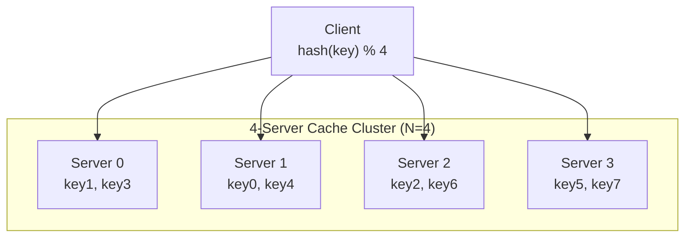

### The Catastrophe: What Happens When N Changes

Now server 1 goes down. `N` changes from 4 to 3. We apply `hash(key) % 3`:

| Key | hash(key) | hash(key) % 3 | NEW Server | OLD Server | Moved? |
|-----|-----------|----------------|------------|------------|--------|
| key0 | 18358617 | 0 | server 0 | server 1 | ✅ YES |
| key1 | 26143584 | 0 | server 0 | server 0 | ❌ no |
| key2 | 18131146 | 1 | server 1 | server 2 | ✅ YES |
| key3 | 35863496 | 2 | server 2 | server 0 | ✅ YES |
| key4 | 34085809 | 1 | server 1 | server 1 | ✅ YES |
| key5 | 27581703 | 0 | server 0 | server 3 | ✅ YES |
| key6 | 38164978 | 1 | server 1 | server 2 | ✅ YES |
| key7 | 22530351 | 0 | server 0 | server 3 | ✅ YES |

**7 out of 8 keys** moved to a different server. Only key1 stayed put.

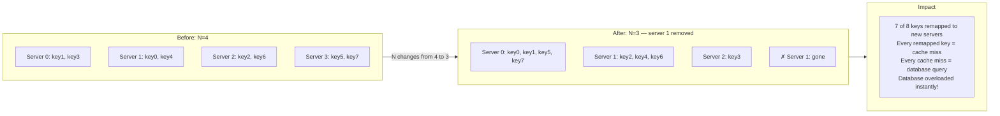

This is devastating in production. Every remapped key is a **cache miss**. Every cache miss is a **database query**. With millions of keys remapping simultaneously, your database gets a thundering herd of requests it was never designed to handle. The very moment you scale — the moment your system is under stress — traditional hashing makes everything worse.

This is the problem consistent hashing solves.

---

## Part 2 — Consistent Hashing: The Core Idea

From Wikipedia:
> *"Consistent hashing is a special kind of hashing such that when a hash table is re-sized and consistent hashing is used, only **k/n** keys need to be remapped on average, where k is the number of keys, and n is the number of slots."*

In plain English: instead of remapping nearly all keys when servers change, consistent hashing remaps only the minimum necessary fraction.

With 4 servers and 100 keys:
- **Traditional hashing:** ~75 keys remapped when 1 server removed
- **Consistent hashing:** ~25 keys remapped (only the ones that were on that server)

The ratio `k/n` means: with `k` keys and `n` servers, only `k/n` keys move — exactly the keys that *were* on the removed server. Everything else stays put.

---

## Part 3 — The Hash Ring: How It Works

### Step 1: Create the Hash Space

Using SHA-1 as our hash function, the output range goes from `0` to `2^160 - 1`. That's a number with 48 digits. We represent this as a linear space:

```
x0 ←──────────────────────────────────────────────────────────→ xn
0                                                          2^160-1
```

### Step 2: Bend It Into a Ring

Now the magic: we bend this linear space into a circle by connecting the two ends. `x0` and `xn` meet. We call this the **hash ring** (also called the hash circle or token ring).

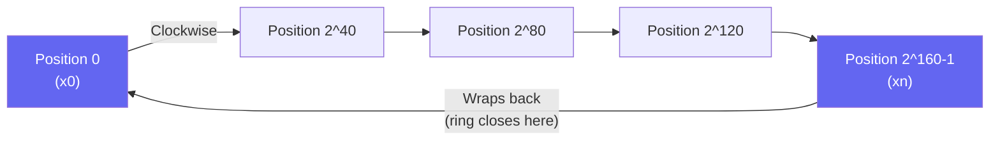

Think of it like a clock face — but instead of 0–12, the numbers go from 0 to 2^160. After 2^160-1, you wrap back to 0.

### Step 3: Place Servers on the Ring

We apply the same hash function to each server's IP address or name. Each server lands somewhere on the ring.

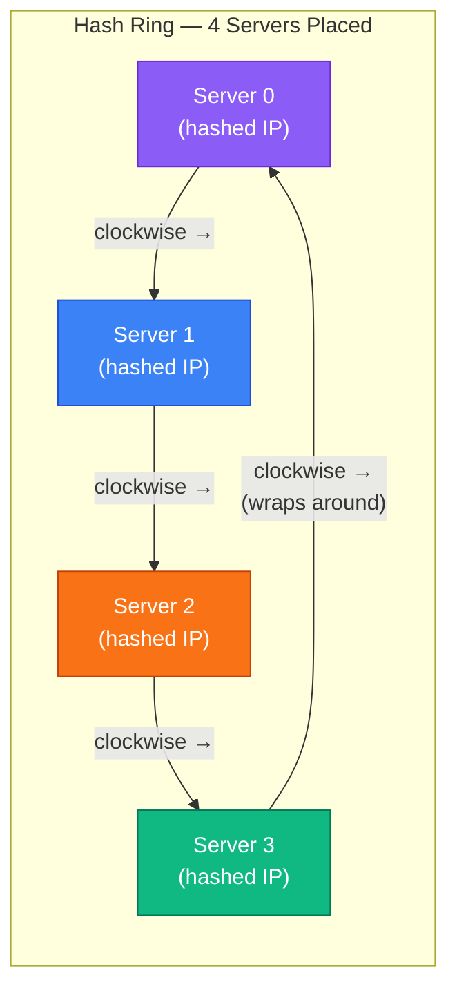

### Step 4: Place Keys on the Ring Too

We hash each data key with the exact same hash function. The key lands at some position on the ring.

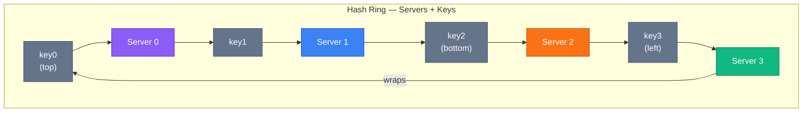

### Step 5: The Lookup Rule — Go Clockwise

To find which server a key belongs to: **start at the key's position on the ring, walk clockwise, and stop at the first server you encounter.**

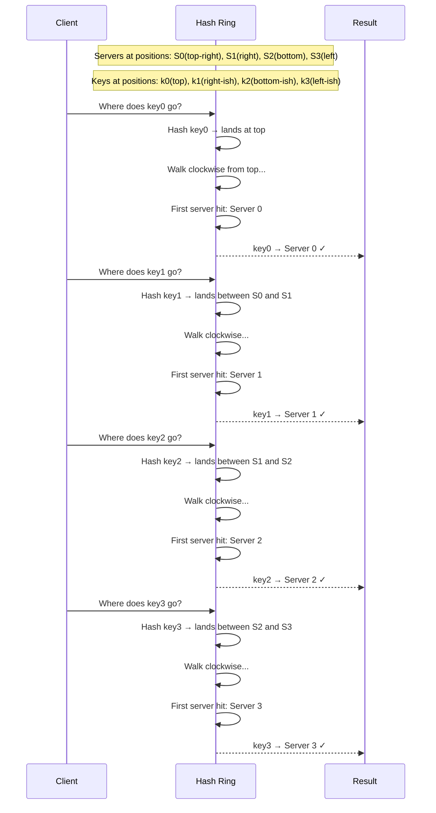

Simple rule: **clockwise to the nearest server.**

---

## Part 4 — Adding and Removing Servers

This is where consistent hashing proves its genius. Watch how few keys move when the cluster changes.

### Adding a Server

Let's say we add **Server 4** to the ring. It lands between Server 3 and Server 0.

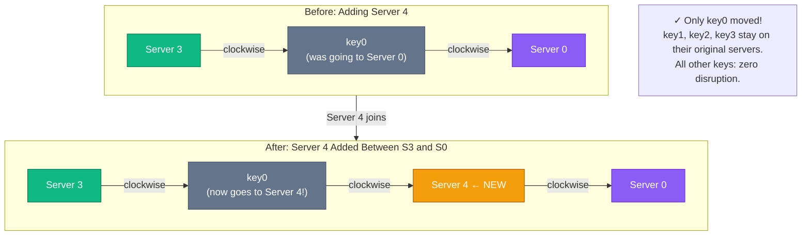

**Only key0 is affected** — because Server 4 inserted itself between Server 3 and Server 0, intercepting only the keys that were previously in that arc.

Before Server 4: key0 walked clockwise and hit Server 0 first.
After Server 4: key0 walks clockwise and hits Server 4 first. Server 4 is now responsible for key0.

The other keys (key1, key2, key3) are not in this arc — they continue routing to their original servers unchanged.

### Removing a Server

Now let's remove **Server 1** from the ring.

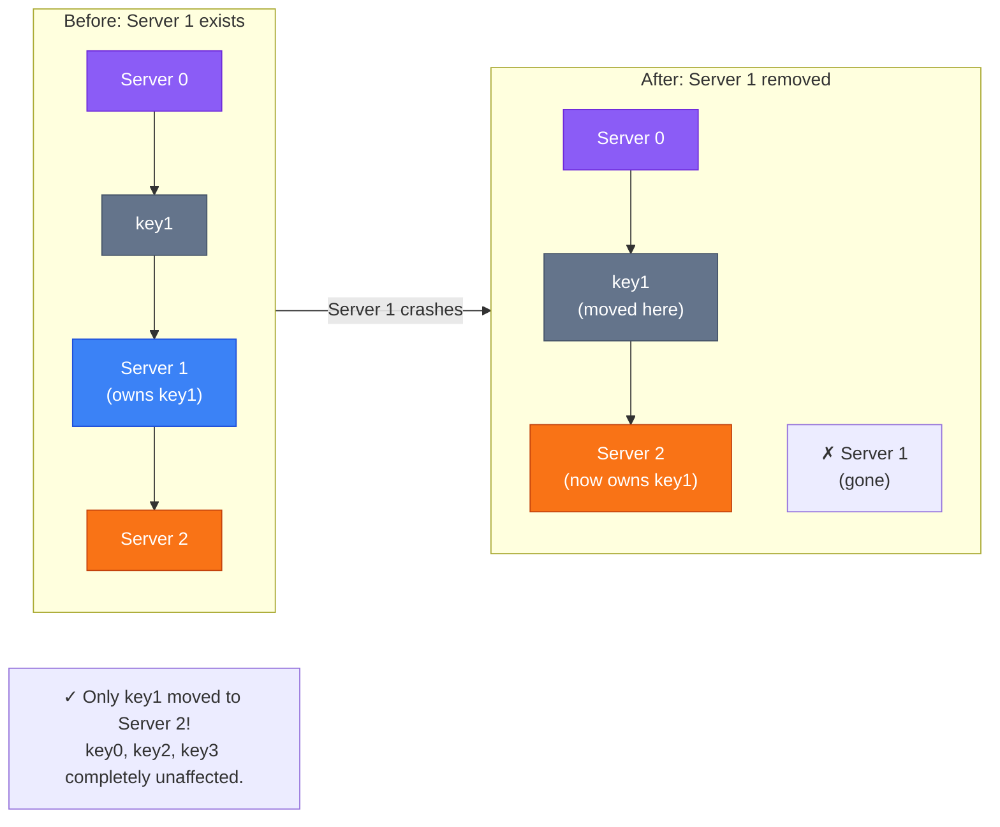

**Only key1 is affected.** Since Server 1 is gone, key1 now walks clockwise and lands on Server 2 instead. Every other key was never in Server 1's arc — they're untouched.

**The maths:** With `n` servers and `k` keys, consistent hashing moves only `k/n` keys on average when a server joins or leaves. With 4 servers and 100 keys, that's only 25 keys out of 100. Compare that to traditional hashing which would move ~75 keys.

---

## Part 5 — Two Problems with the Basic Approach

The basic consistent hashing algorithm was introduced by Karger et al. at MIT. It's brilliant, but it has two real-world problems that need solving before production use.

### Problem 1: Unequal Partition Sizes 📐

A **partition** is the arc of hash space between two adjacent servers. In an ideal world, all partitions are the same size — each server owns the same fraction of the ring.

But in practice, because server positions are determined by hashing their IP addresses, they can land anywhere. If servers cluster together on one side of the ring, the resulting partitions are wildly unequal.

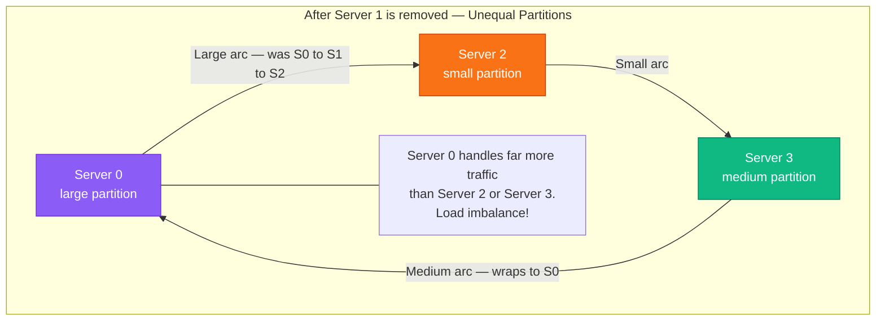

When Server 1 is removed, Server 2's partition grows to include Server 1's old arc. Server 0's partition is now twice as large as Server 3's. Server 2's partition is tiny. **Unbalanced load, hot servers, slow responses.**

### Problem 2: Non-Uniform Key Distribution 🎯

Even without removing servers, if servers happen to hash to positions that are clustered together, most keys will land on one server while others sit nearly empty.

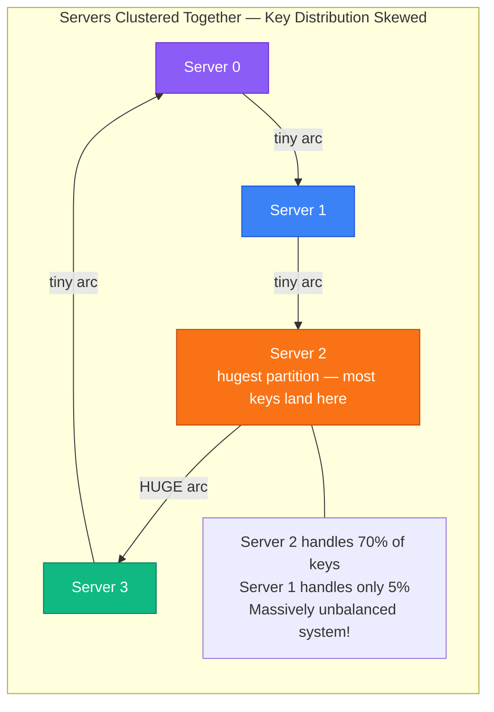

The book gives a real, relatable example:

> *"Imagine data for Katy Perry, Justin Bieber, and Lady Gaga all end up on the same shard. Excessive access to a specific shard could cause server overload."*

If three of the world's most-followed celebrities happen to hash to the same partition, that one server handles an insane share of traffic while others sit idle. This is called the **hotspot problem**.

Both of these problems have the same solution: **Virtual Nodes**.

---

## Part 6 — Virtual Nodes: The Real-World Solution

A **virtual node** (also called a replica or vnode) is a phantom copy of a server on the ring. Instead of each physical server appearing once, it appears many times at different positions.

### How Virtual Nodes Work

Instead of mapping `server0` to one position, we create multiple virtual nodes:
- `server0_0`, `server0_1`, `server0_2` → each hashes to a different position
- `server1_0`, `server1_1`, `server1_2` → each hashes to a different position

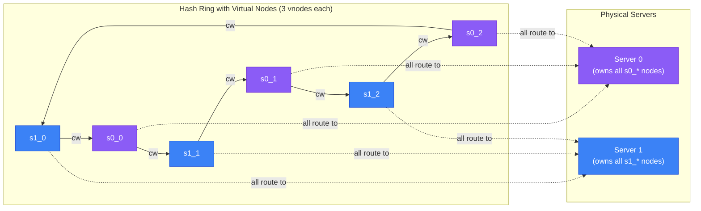

**The lookup still works the same way:** go clockwise from the key, find the first virtual node, then map that virtual node to its physical server.

### Why This Fixes Both Problems

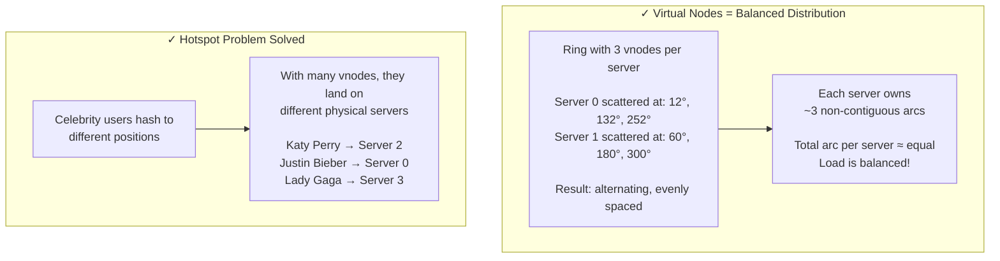

**With more virtual nodes, the load distribution gets mathematically better:**

| Virtual Nodes per Server | Standard Deviation of Load |
|---|---|
| 1 (no virtual nodes) | Very high (unpredictable) |
| 100 virtual nodes | ~10% of mean |
| 200 virtual nodes | ~5% of mean |
| 500+ virtual nodes | ~2% of mean |

This comes from research cited in the book. With 100–200 virtual nodes per server, the load distribution is so balanced that the variation is negligible in practice.

**Apache Cassandra defaults to 256 virtual nodes per physical node.** That's why Cassandra can add or remove nodes with almost zero impact on cluster performance.

### Heterogeneous Servers: Proportional Allocation

Virtual nodes give you a powerful bonus: you can allocate proportionally based on server capacity.

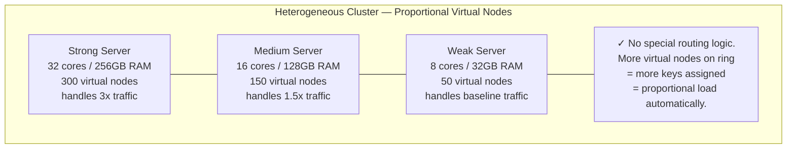

No custom routing logic. No configuration files. The ring handles it automatically. More virtual nodes = more arcs = more keys = more load. It's proportional by construction.

---

## Part 7 — Finding Affected Keys When Servers Change

When a server joins or leaves, which specific keys need to be moved? The answer comes from a simple anticlockwise scan rule.

### When a Server is Added

To find which keys move to the new server, start at the **new server's position** and scan **anticlockwise** until you hit another server. All keys in that anticlockwise arc belong to the new server.

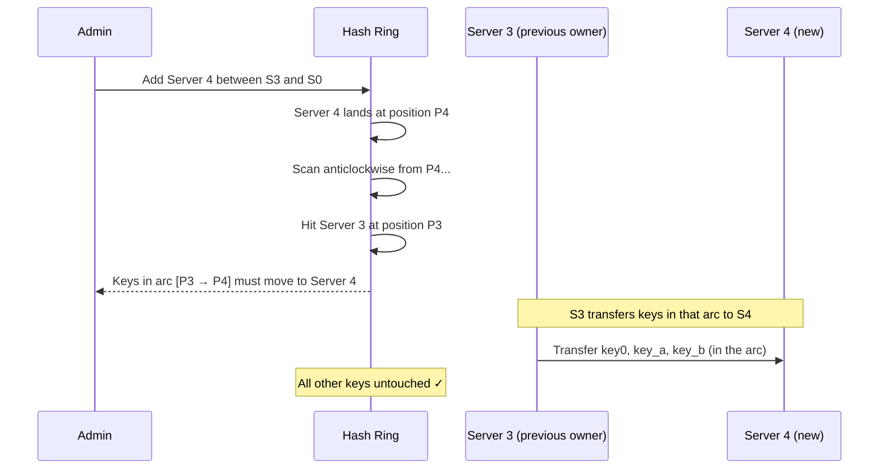

### When a Server is Removed

When a server fails, start at the **removed server's position** and scan **anticlockwise** until you hit another server. All keys in that anticlockwise arc must be redistributed to the next server clockwise.

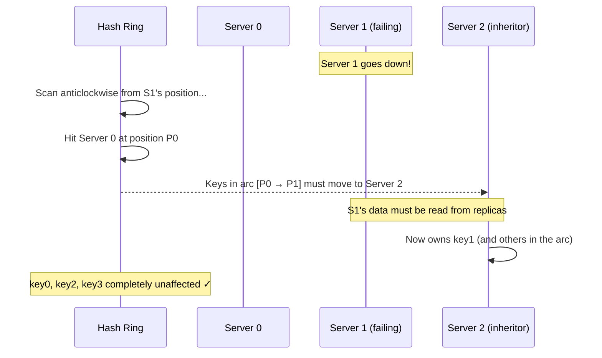

This is beautiful in its simplicity: **only the adjacent arc is ever affected**. The rest of the ring is immune.

---

## Part 8 — Data Replication with Consistent Hashing

In a production system, consistent hashing isn't just for routing — it's also used for **replication**. You don't store data on just one server; you store it on `N` servers (where N is the replication factor).

The replication strategy is elegant:

> After a key is hashed to a position, walk **clockwise** and store copies on the **next N unique physical servers**.

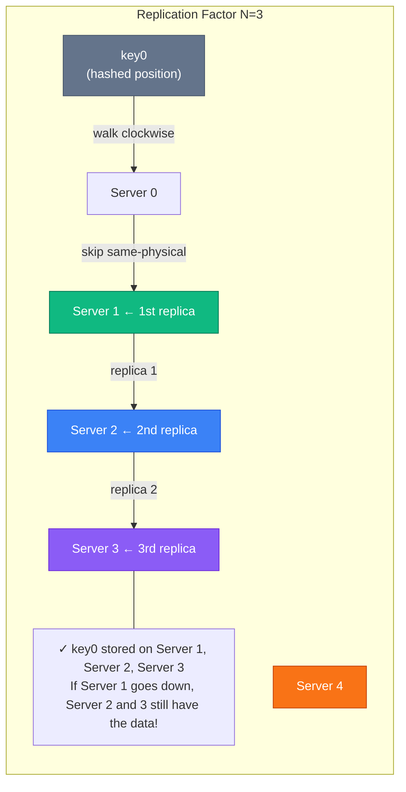

**Important:** With virtual nodes, you must skip virtual nodes that belong to the same physical server. If `s1_0` and `s1_1` are both for Server 1, you skip the second one — otherwise the same physical machine stores two "replicas," which defeats the purpose.

**For maximum resilience**, replicas are placed in **different data centers** — so a power outage, network failure, or natural disaster doesn't take down all copies of your data simultaneously.

---

## Part 9 — Where Consistent Hashing Lives in Production

Consistent hashing is not an academic exercise. It's running in systems you use every single day.

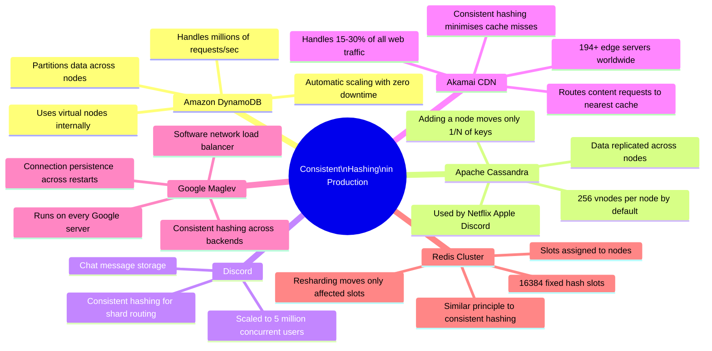

### Deep Dive: How Cassandra Uses It

When a new node joins a Cassandra cluster, here's what happens:

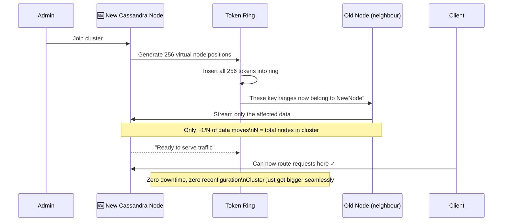

This is why Cassandra is famous for "zero downtime scaling." You literally just plug in a new node and the cluster self-heals.

---

## Part 10 — The Standard Deviation Math (Why More VNodes = Better)

This is worth understanding intuitively, even if you're not a maths person.

Imagine 3 darts thrown randomly at a circular dartboard. You'll likely get a lumpy distribution — some sections much larger than others. Now throw 300 darts. The sections become much more uniform. This is exactly the virtual node principle.

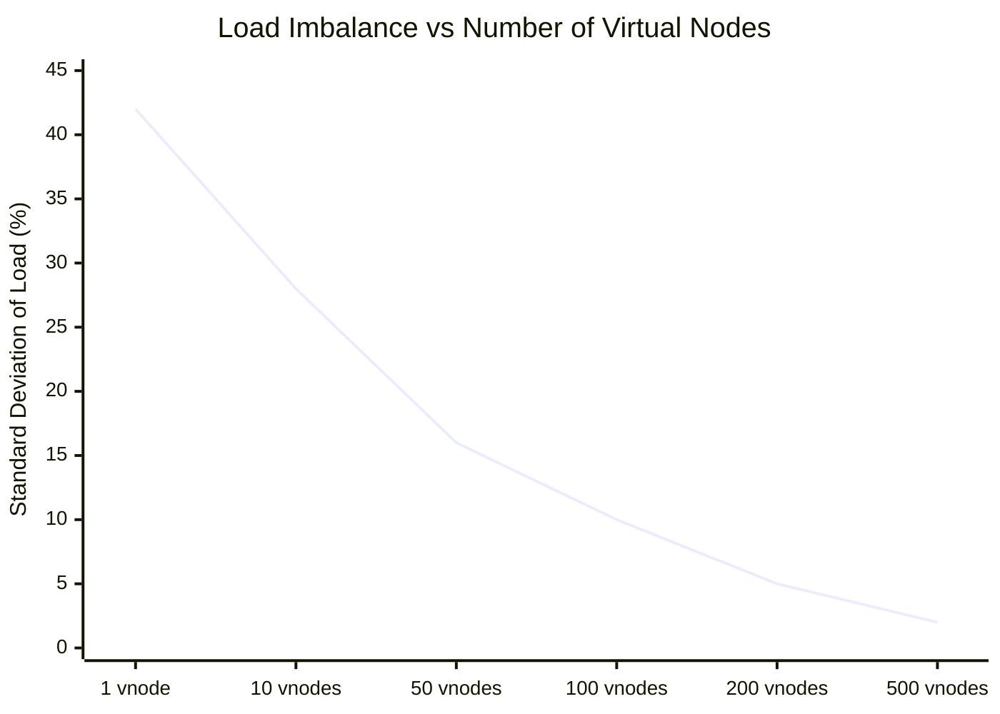

**The tradeoff:** More virtual nodes = more memory to store the ring metadata. Each virtual node entry requires about 100 bytes. With 200 vnodes and 100 servers, that's 200 × 100 × 100 bytes = 2MB of ring metadata per server. Very manageable.

Production systems typically use **150–300 virtual nodes per server** — the sweet spot between distribution quality and memory overhead.

---

## Part 11 — Consistent Hashing vs. Other Approaches

How does consistent hashing compare to other ways of routing keys to servers?

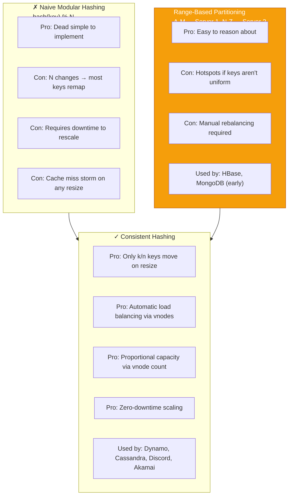

---

## Part 12 — Benefits: The Full Picture

Let's bring it all together. Why is consistent hashing so important?

```mermaid
graph LR
    CH["Consistent\nHashing"]

    CH --> B1["Minimal Key Redistribution\n\nOnly k/n keys move when\na server joins or leaves.\nWith 100 servers, adding 1\nmoves only 1% of keys."]

    CH --> B2["Horizontal Scaling\n\nAdd servers at any time\nwithout downtime or\nmanual data migration.\nThe ring self-balances."]

    CH --> B3["Hotspot Mitigation\n\nVirtual nodes spread\npopular keys across\nmany physical servers.\nNo more celebrity data\noverloading one shard."]

    CH --> B4["Heterogeneous Clusters\n\nPowerful servers get more\nvirtual nodes and serve\nmore traffic naturally.\nNo custom routing code."]

    CH --> B5["Automatic Replication\n\nN-replica replication\nfollows the same ring.\nFailure recovery is\nautomatically bounded."]

    style CH fill:#6366f1,color:#fff
    style B1 fill:#3B82F6,stroke:#1D4ED8,color:#fff
    style B2 fill:#10B981,stroke:#047857,color:#fff
    style B3 fill:#F59E0B,stroke:#B45309,color:#fff
    style B4 fill:#EC4899,stroke:#BE185D,color:#fff
    style B5 fill:#8B5CF6,stroke:#6D28D9,color:#fff
```

---

## The Algorithm in 6 Steps

Here's the complete consistent hashing algorithm, distilled:

```mermaid
flowchart TD
    STEP1["① Choose a hash function\n(SHA-1, MD5, MurmurHash)\nOutput range = 0 to 2^160-1"]
    STEP2["② Bend the range into a ring\nConnect x0 and x_max"]
    STEP3["③ Place each server on the ring\nhash(server_ip) → position\nRepeat M times per server (vnodes)"]
    STEP4["④ Place each key on the ring\nhash(key) → position\n(no modular operation!)"]
    STEP5["⑤ Lookup: go clockwise from key\nFind first virtual node → physical server\nThat server owns the key"]
    STEP6["⑥ On change: only adjacent arc affected\nAdding server: anticlockwise scan for keys to claim\nRemoving server: clockwise neighbour inherits keys"]

    STEP1 --> STEP2 --> STEP3 --> STEP4 --> STEP5 --> STEP6
```

---

## Interview Quick Reference

```mermaid
mindmap
  root(("Consistent\nHashing\nInterview"))
    The Problem
      hash key % N breaks on resize
      N changes → most keys remap
      Cache miss storm
      Thundering herd on DB
    The Solution
      Hash ring 0 to 2^160
      Servers placed on ring by IP hash
      Keys placed on ring by key hash
      Go clockwise → first server wins
    Key Properties
      Only k/n keys move on resize
      Adding server → only adjacent arc affected
      Removing server → only adjacent arc affected
    Virtual Nodes
      Each server has M positions on ring
      Solves unequal partition sizes
      Solves non-uniform key distribution
      More vnodes = better balance
      Cassandra uses 256 by default
    Replication
      Walk clockwise N servers for N replicas
      Skip vnodes of same physical server
      Place replicas in different data centres
    Real World
      DynamoDB partitioning
      Cassandra token ring
      Discord chat sharding
      Akamai CDN routing
      Google Maglev load balancer
    Tradeoffs
      More vnodes = more memory for ring metadata
      Sweet spot 150-300 vnodes per server
      Virtual nodes add implementation complexity
```

---

## Summary: What We Learned

1. **Traditional hashing** (`hash(key) % N`) is simple but catastrophic when `N` changes — it remaps ~75% of keys, causing a cache miss storm that overwhelms your database

2. **Consistent hashing** bends the hash space into a ring. Servers and keys are both placed on this ring using the same hash function. A key routes to the first server clockwise from its position

3. **On server add/remove**, only the adjacent arc of keys is affected. On average, only `k/n` keys move — the mathematical minimum

4. **Virtual nodes** (multiple positions per server) solve the two core problems of the basic algorithm: unequal partition sizes and non-uniform key distribution. More vnodes = more even load distribution

5. **Replication** uses the same ring: store copies on the next `N` unique physical servers clockwise from the key's position

6. **The whole ecosystem** runs on this: Amazon DynamoDB, Apache Cassandra, Discord, Akamai, Google Maglev. It's one of the most impactful algorithms in modern distributed systems

---

## References and Further Reading

**The original ideas**

- [Consistent hashing](https://en.wikipedia.org/wiki/Consistent_hashing) — Wikipedia, including Karger's original 1997 paper
- [Consistent Hashing](https://tom-e-white.com/2007/11/consistent-hashing.html) — Tom White. Still the clearest short explanation with code
- [CS168: Introduction and Consistent Hashing](http://theory.stanford.edu/~tim/s16/l/l1.pdf) — Tim Roughgarden's Stanford lecture, for the proofs

**Systems built on it**

- [Dynamo: Amazon's Highly Available Key-value Store](https://www.allthingsdistributed.com/files/amazon-dynamo-sosp2007.pdf) — SOSP 2007. The paper that made consistent hashing standard practice
- [Cassandra: A Decentralized Structured Storage System](https://www.cs.cornell.edu/projects/ladis2009/papers/lakshman-ladis2009.pdf) — Lakshman and Malik
- [How Discord scaled Elixir to 5,000,000 concurrent users](https://discord.com/blog/how-discord-scaled-elixir-to-5-000-000-concurrent-users) — consistent hashing in a real product

**The alternatives — worth knowing, and mostly absent from interview prep**

- [Maglev: A Fast and Reliable Software Network Load Balancer](https://static.googleusercontent.com/media/research.google.com/en//pubs/archive/44824.pdf) — Google. Better lookup speed and more even distribution than a ring
- [A Fast, Minimal Memory, Consistent Hash Algorithm](https://arxiv.org/pdf/1406.2294) — Google's jump consistent hash: no ring, no virtual nodes, five lines of code. Ideal when nodes are numbered 0..N-1
- [Rendezvous hashing](https://en.wikipedia.org/wiki/Rendezvous_hashing) — highest random weight. Predates consistent hashing, simpler to reason about, and gives naturally even distribution without virtual nodes

Being able to say "a ring is the classic answer, but jump hash or rendezvous hashing may suit better here, and here is why" is what separates a memorised answer from an engineering one.

---

## What's Next?

In **Chapter 6**, we'll design a **Key-Value Store** from scratch — diving into CAP theorem (Consistency, Availability, Partition Tolerance), data replication strategies, consistency models, conflict resolution, and how DynamoDB and Cassandra make these tradeoffs. Consistent hashing will be one of the building blocks!

*If this article helped you understand distributed systems better, share it with a fellow engineer. The more people understand these foundations, the better the systems we all build.*
