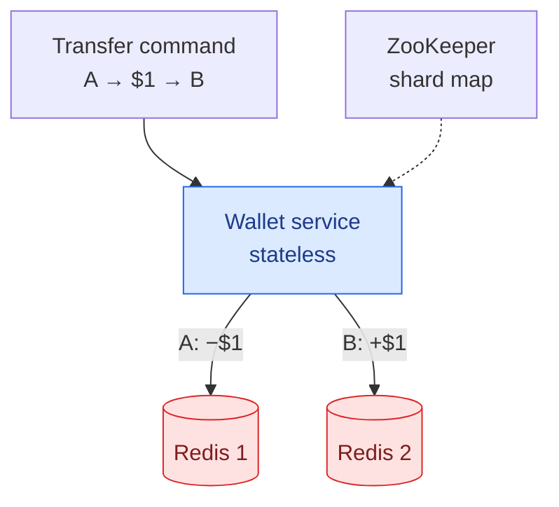
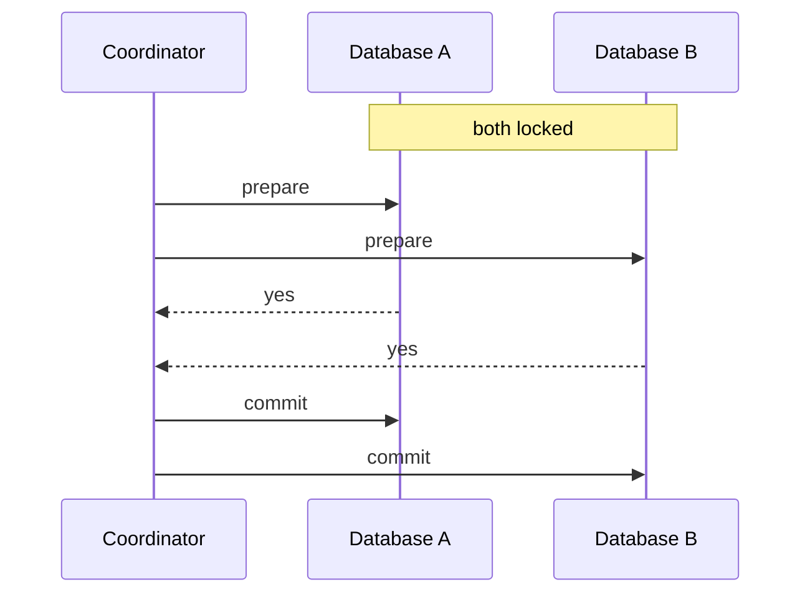
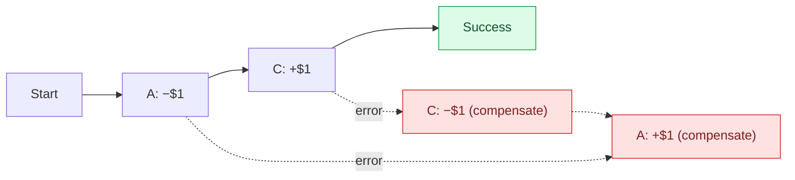
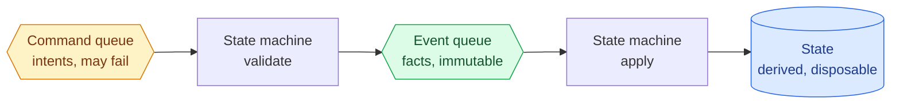
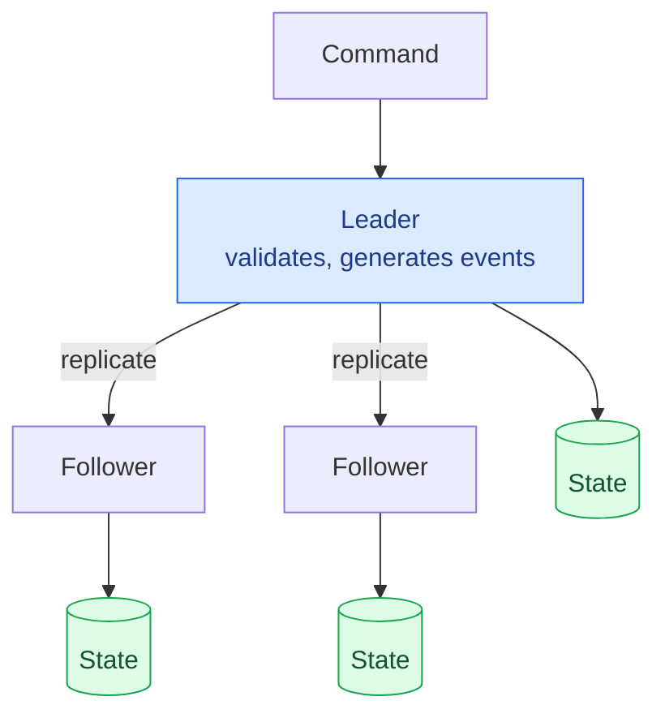

Move $1 from wallet A to wallet B. A million times a second.

That's the whole problem, and it is the best-structured chapter in this series — because rather than presenting one architecture, it walks through **four**, each one solving what the previous one broke:

1. **In-memory sharding** — fast, and loses money when a node crashes
2. **Distributed transactions** — correct, and you can't explain *why* a balance is what it is
3. **Event sourcing** — auditable, and too slow going over the network
4. **Distributed event sourcing** — fast, reliable, and shardable

Watching a design fail four times is more instructive than seeing the final answer, so that's how this is written.

---

## Step 1 — Scope

- **Balance transfers between two wallets** — nothing else
- **1,000,000 TPS**
- **99.99% reliability**
- **Transactional guarantees**
- **Reproducibility**

That last requirement is unusual and it drives everything after design two:

> Reconciliation only shows *that* there is a discrepancy, never *how* it arose. We want a system where historical balances can be **reconstructed by replaying data from the very beginning**.

### The arithmetic that sets the goal

Assume a database node handles 1,000 TPS. A million transfers a second therefore needs 1,000 nodes — except **each transfer is two operations**, a debit and a credit. So 2 million operations, and **2,000 nodes**.

| Per-node TPS | Nodes needed |
|---:|---:|
| 100 | 20,000 |
| 1,000 | 2,000 |
| 10,000 | 200 |

**Node count is inversely proportional to per-node throughput**, and hardware cost follows. So a design goal falls out of the estimate: *make each node do more*. That's what motivates the file-based optimisations later.

---

## The API

One endpoint. That is not a simplification for the sake of the chapter — it is what makes the rest of it hard.

```text
POST /v1/wallet/balance_transfer
```

| Parameter | Notes |
|---|---|
| `from_account`, `to_account` | The two sides of the transfer |
| `amount` | **A string**, not a float |
| `currency` | ISO code |
| `transaction_id` | Client-supplied, for idempotency |

```json
{
  "status": "success",
  "transaction_id": "01589980-2664-11ec-9621-0242ac130002"
}
```

Two of those fields carry the whole design.

**`amount` is a string.** Binary floating point cannot represent `0.10` exactly, and a rounding error in a wallet is a rounding error in someone's money. Send the decimal as text and parse it into a fixed-point or arbitrary-precision type at the boundary. Every payments system does this, and the ones that didn't have a story about why they do now.

**`transaction_id` comes from the client**, exactly as the reservation ID does in [the hotel chapter](/2026/06/design-hotel-reservation-system/). A retry after a timeout carries the same ID, so the second attempt is recognised rather than executed. **Without it, "did my transfer go through?" has no safe answer** — and every design below is built on being able to replay commands.

---

## Design 1 — In-memory sharding

Balances are a map from account to amount. Redis, sharded across nodes by `hash(accountID) % n`, with ZooKeeper holding the shard map. A stateless wallet service applies transfers.



Fast, horizontally scalable, and **wrong**.

Two Redis nodes, two updates, no atomicity. **If the wallet service crashes between them, $1 has been deducted and never arrives.** Money vanishes.

**A transfer is one logical operation and two physical writes.** Everything that follows is about closing that gap.

---

## Design 2 — Distributed transactions

Replace Redis with transactional relational databases. That makes each *local* update atomic and does nothing about the pair. Three ways to fix it.

### Two-phase commit

A coordinator asks every database to **prepare**; if all say yes it tells them to **commit**, otherwise **abort**.



It works, and it has two well-known problems. **Locks are held across network round trips**, which destroys throughput at a million TPS. And **the coordinator is a single point of failure** — if it dies after "prepare", every participant sits locked, waiting.

It's also a *low-level* solution requiring database support for the prepare step, via standards like X/Open XA.

### Try-Confirm/Cancel

TC/C looks similar and differs in one decisive way: **each phase is its own transaction, committed immediately.**

| Phase | Account A | Account C |
|---|---|---|
| **Try** | −$1 | nothing |
| **Confirm** | nothing | +$1 |
| **Cancel** | +$1 | nothing |

Nothing stays locked between phases. Failure is handled not by aborting but by **running a compensating transaction** — adding the dollar back.

Which produces something genuinely startling:

> **At the end of the Try phase, $1 does not exist.** A is down a dollar; C hasn't received it. The books do not balance.

In 2PC that intermediate state is hidden inside the database. In TC/C it's *visible to the application*, because the application is the one orchestrating it. **The inconsistency was always there — TC/C just stops pretending otherwise**, and makes you responsible for resolving it.

Two consequences worth their own paragraphs.

**Order matters, and only one order is valid.** Deduct first, then credit. Credit-first means someone could withdraw money that was never funded. Doing both concurrently means either can fail with the other already done.

**Out-of-order execution is possible.** A slow network can deliver a Cancel *before* the Try it cancels. So a node must be able to Cancel something it hasn't seen: it records an out-of-order flag, and a later Try checks that flag and fails. Which is why the phase status table needs one.

And because the coordinator can restart mid-transaction, its progress must be persisted — that's the **phase status table**, stored with the account being debited.

### Saga

Saga runs operations in a **linear sequence**, each a local transaction. On failure it rolls back in reverse order using compensating transactions. For *n* operations you write **2n**: the forward path and the undo path.



Coordination comes in two flavours: **choreography**, where services react to each other's events with no central authority, and **orchestration**, where one coordinator sequences everything. Choreography is fully decentralised and becomes very hard to reason about — each service needs its own state machine to interpret everyone else's events. **Orchestration is the usual choice here.**

### Choosing between them

| | 2PC | TC/C | Saga |
|---|---|---|---|
| **Level** | Database | Application | Application |
| **Locks held across phases** | ✓ | ✗ | ✗ |
| **Execution order** | Any | Any | **Linear** |
| **Parallel execution** | ✓ | ✓ | ✗ |
| **Partial state visible** | ✗ | ✓ | ✓ |

**TC/C can run operations in parallel; Saga cannot.** So: few services or no latency pressure → Saga, and you're aligned with microservice convention. Many services and latency-sensitive → TC/C.

### And it still isn't enough

The balance is correct. But it's a *number in a row*, overwritten on every transfer.

An auditor asks: what was this balance last Tuesday? Why did it change? Prove the logic was correct before the deploy.

**The design cannot answer any of them**, because updating a row destroys the history that would.

---

## Design 3 — Event sourcing

Stop storing balances. **Store the facts that produced them.**

Four terms:

- **Command** — an intent. *"Transfer $1 from A to C."* May be invalid. May involve randomness or I/O.
- **Event** — a validated fact. *"Transferred $1 from A to C."* Past tense, immutable, **deterministic**.
- **State** — balances, derived by applying events.
- **State machine** — validates commands into events, and applies events to state. **Must contain no randomness**, or replay wouldn't reproduce.



**The database stops being the source of truth and becomes a cached view.** The event log is the truth. State is a convenience — derivable, and therefore disposable.

### Replay it yourself

Below is an event log and the balances derived from it. Scrub through and watch state being *computed* rather than stored:

<div class="es-demo" id="es"><div class="es-row"><label for="es-n">Replay up to event <b><span id="es-nv">0</span></b> of 10</label><input type="range" id="es-n" min="0" max="10" value="0"></div><div class="es-cols"><div><div class="es-label">EVENT LOG — IMMUTABLE</div><table class="es-table"><tbody id="es-events"></tbody></table></div><div><div class="es-label">DERIVED STATE</div><div class="es-bal" id="es-bal"></div><p class="es-note">Nothing here is stored. Every balance is recomputed from the log above.</p></div></div></div>
<script>
(function () {
  var root = document.getElementById("es");
  if (!root) return;
  var EVENTS = [
    { d: "A funded",        m: { A: 100 } },
    { d: "B funded",        m: { B: 50 } },
    { d: "A → B  $30",      m: { A: -30, B: 30 } },
    { d: "C funded",        m: { C: 20 } },
    { d: "B → C  $45",      m: { B: -45, C: 45 } },
    { d: "A → C  $10",      m: { A: -10, C: 10 } },
    { d: "C → A  $25",      m: { C: -25, A: 25 } },
    { d: "B funded",        m: { B: 60 } },
    { d: "B → A  $15",      m: { B: -15, A: 15 } },
    { d: "A → B  $5",       m: { A: -5, B: 5 } }
  ];
  var n = document.getElementById("es-n"), nv = document.getElementById("es-nv"),
      evEl = document.getElementById("es-events"), balEl = document.getElementById("es-bal");
  function render() {
    var upto = +n.value;
    nv.textContent = upto;
    var h = "";
    for (var i = 0; i < EVENTS.length; i++) {
      var on = i < upto;
      h += '<tr class="' + (on ? "es-on" : "es-off") + '"><td class="es-i">' + (i + 1) + '</td>' +
           '<td>' + EVENTS[i].d + '</td><td class="es-tick">' + (on ? "applied" : "") + '</td></tr>';
    }
    evEl.innerHTML = h;
    var bal = { A: 0, B: 0, C: 0 };
    for (var j = 0; j < upto; j++) {
      var m = EVENTS[j].m;
      for (var k in m) bal[k] += m[k];
    }
    var bh = "";
    ["A", "B", "C"].forEach(function (k) {
      bh += '<div class="es-acct"><span class="es-name">wallet ' + k + '</span>' +
            '<span class="es-amt">$' + bal[k] + '</span></div>';
    });
    var total = bal.A + bal.B + bal.C;
    bh += '<div class="es-total">total in system <b>$' + total + '</b></div>';
    balEl.innerHTML = bh;
  }
  n.addEventListener("input", render);
  render();
})();
</script>

Drag it back and forth. **Every historical balance is available**, because nothing was overwritten — the state at event 6 is simply the first six events applied.

That answers all three auditor questions. *What was the balance on Tuesday?* Replay to Tuesday. *Is it correct?* Recompute it from the log. *Was the logic right before the deploy?* Run both versions of the code over the same events and compare.

**Reproducibility is not a feature bolted on. It is what you get for free when you stop destroying history.**

### CQRS

The wallet still has to tell users their balance, and the event log isn't a useful thing to query.

**Command Query Responsibility Segregation**: one state machine handles writes; **many read-only state machines** subscribe to the same event stream and build whatever view they need. Balances for the UI. A period-specific view for investigating a double charge. An audit trail for reconciliation.

Read models lag slightly and always catch up — **eventually consistent by construction**.

**Publishing events rather than state lets every consumer derive the shape they need.** Publish state and you've decided for them.

---

## Design 4 — Making it fast, reliable and shardable

Event sourcing over Kafka and a remote database means every command crosses the network several times. At a million TPS that's the bottleneck.

### Put everything on local disk

**Commands and events go to local files.** The event list is append-only, so writes are **sequential** — and sequential disk access can outperform random memory access. The same argument as [the message queue chapter](/2026/06/design-distributed-message-queue/), reached independently.

**`mmap`** maps the file into memory, so the OS caches recent content automatically. For append-only access, essentially everything hot is in memory.

**State goes local too** — SQLite, or **RocksDB**, whose LSM tree is write-optimised.

### Snapshots

Replaying from the beginning gets slower forever. So periodically freeze the state to a **snapshot** — an immutable view at a point in time. Replay resumes from the last snapshot instead of from zero.

Finance teams typically want one at 00:00 so the day's transactions can be verified in isolation.

### Which data actually needs to be durable?

This is the most elegant reasoning in the chapter, and it's worth following carefully. There are four kinds of data:

**State and snapshots** are derived from events. Lose them, replay, get them back. **No durability needed.**

**Commands** look like the root — events come from commands, so surely commands are what matter? **No.** Command→event generation may involve randomness or external I/O, so **replaying commands is not guaranteed to reproduce the same events.**

**Events** are deterministic, immutable historical facts, and everything else derives from them.

> **Only the event log requires a strong durability guarantee.** Everything else is recomputable.

That's a remarkably small surface to protect — and it's only small because of a property established pages earlier, that events must be deterministic. **The constraint bought the simplification.**

### Consensus

So replicate the event log with **Raft**. One leader accepts commands and converts them to events; followers receive replicated events. With 5 nodes the system tolerates 2 failures; with 3, one.



Every node — leader and followers — applies the event list and updates its own state. **Raft guarantees identical event lists; determinism guarantees identical states.** The two properties compose exactly.

If the leader dies mid-conversion, the client times out and resends to the new leader.

### Then shard

One Raft group has a capacity ceiling. Above it, partition accounts across groups — and now transfers can span groups, so you need distributed transactions again: **TC/C or Saga over event-sourced Raft groups.**

Also, CQRS's read path is asynchronous, so clients would have to poll for their result. A **reverse proxy** in front, with read-only state machines **pushing** status back as events arrive, restores a synchronous-feeling response.

---

## What has changed since the book

### The throughput estimate is very conservative

The whole node-count table rests on "assume a database node handles 1,000 TPS". That was cautious when written and is more so now — a well-tuned modern relational node on NVMe storage handles far more write throughput than that, and purpose-built stores like [TigerBeetle](/2026/06/design-payment-system/) target a million transfers a second on modest hardware.

The *reasoning* stands entirely — node count is inversely proportional to per-node throughput, and doubling per-node throughput halves your fleet. Only the constant has moved, and it has moved by an order of magnitude or more. **Rerun the arithmetic before quoting the fleet size.**

### 2PC lost; Saga won

Presented as three live options, this is now largely settled. **Two-phase commit is rare in new systems** — coordinator blocking and cross-network locking are disqualifying at scale, and XA support is patchy.

**Saga became the microservices default**, with orchestration preferred over choreography for exactly the reason given here: choreography's implicit state machines are unmaintainable past a handful of services.

TC/C remains a real option and is far less widely known, which makes it a genuinely useful thing to have in an interview — it gives you parallelism that Saga's linear ordering forbids.

### The outbox pattern is the missing piece

There's a gap the chapter doesn't address: how does an event get into the log *and* published to consumers atomically? Writing to your database and then to Kafka is a **dual write**, and the two can disagree — the database commits and the publish fails, or vice versa.

The **transactional outbox** solves it: write the event to an `outbox` table **in the same transaction as the state change**. They commit together, so they cannot disagree. A separate process — usually change data capture tailing the write-ahead log — forwards to the broker.

Same instinct as everything else here: **when two things must agree, put them in one transaction rather than sequencing them carefully.**

### Event sourcing is powerful and frequently overused

Worth saying plainly, because the chapter presents it as an unambiguous win.

Event sourcing costs real complexity. **Schema evolution is genuinely hard** — events are immutable, so a five-year-old event must still be interpretable by today's code, forever. Replay time grows without snapshot discipline. Eventual consistency in read models surprises people. And "just query the current state" becomes a design exercise.

It earns that cost when **the history is the product** — audit, regulation, financial reconciliation, "prove this number". A digital wallet is exactly that case, which is why it's the right answer here.

For a system where nobody will ever ask what a value was last Tuesday, a plain table and an audit log is usually the better engineering.

---

## What to take away

**Four designs, each fixing the last.** In-memory sharding loses money on crash. Distributed transactions fix atomicity and destroy history. Event sourcing restores history and is too slow remotely. Local files plus Raft fix that. **Each design is correct about the problem it was built for and wrong about the next one.**

**A transfer is one logical operation and two physical writes.** Every technique here — 2PC, TC/C, Saga, event sourcing — is a different way of closing that gap.

**TC/C makes the inconsistency visible rather than creating it.** At the end of the Try phase a dollar genuinely does not exist. 2PC hides that inside the database; TC/C hands it to you, along with responsibility for it.

**Store facts, derive state.** Overwriting a balance destroys the only record of why it changed. Keeping events makes every historical state recoverable, and every auditor's question answerable by replay.

**Determinism is what makes replication cheap.** Because events are deterministic, Raft only has to agree on the *log* — identical logs give identical states for free. And because state is derivable, only the log needs durability.

**Publish events, not state.** Consumers derive the view they need. Publishing state decides for them, and you'll be wrong for someone.

---

## References and Further Reading

**Distributed transactions**

<ul>
<li><a href="https://en.wikipedia.org/wiki/Two-phase_commit_protocol">Two-phase commit</a> · <a href="https://en.wikipedia.org/wiki/X/Open_XA">X/Open XA</a></li>
<li><a href="https://microservices.io/patterns/data/saga.html">The Saga pattern</a> · <a href="https://en.wikipedia.org/wiki/Compensating_transaction">Compensating transactions</a></li>
<li><a href="https://microservices.io/patterns/data/transactional-outbox.html">The transactional outbox pattern</a> · <a href="https://debezium.io/">Debezium</a></li>
</ul>

**Event sourcing and CQRS**

<ul>
<li><a href="https://martinfowler.com/eaaDev/EventSourcing.html">Event sourcing</a> — Martin Fowler</li>
<li><a href="https://martinfowler.com/bliki/CQRS.html">CQRS</a> — Martin Fowler, including when not to use it</li>
<li><a href="https://en.wikipedia.org/wiki/Domain-driven_design">Domain-driven design</a> — where both originate</li>
<li><a href="https://dataintensive.net/">Designing Data-Intensive Applications</a> — Chapter 11 on event streams and derived state</li>
</ul>

**Storage and consensus**

<ul>
<li><a href="https://raft.github.io/">Raft</a> — the consensus algorithm replicating the event log</li>
<li><a href="http://rocksdb.org/">RocksDB</a> · <a href="https://www.sqlite.org/index.html">SQLite</a> · <a href="https://en.wikipedia.org/wiki/Memory-mapped_file">mmap</a></li>
<li><a href="https://kafka.apache.org/">Apache Kafka</a> · <a href="https://zookeeper.apache.org/">ZooKeeper</a></li>
</ul>

**In this series**

<ul>
<li><a href="/guide/">The complete guide</a> — every article in order</li>
<li><a href="/2026/06/design-payment-system/">Design a Payment System</a> — the ledger this wallet sits beside</li>
<li><a href="/2026/06/design-distributed-message-queue/">Design a Distributed Message Queue</a> — append-only logs and sequential writes</li>
<li><a href="/2026/06/design-hotel-reservation-system/">Design a Hotel Reservation System</a> — why one database beat Saga there</li>
</ul>
