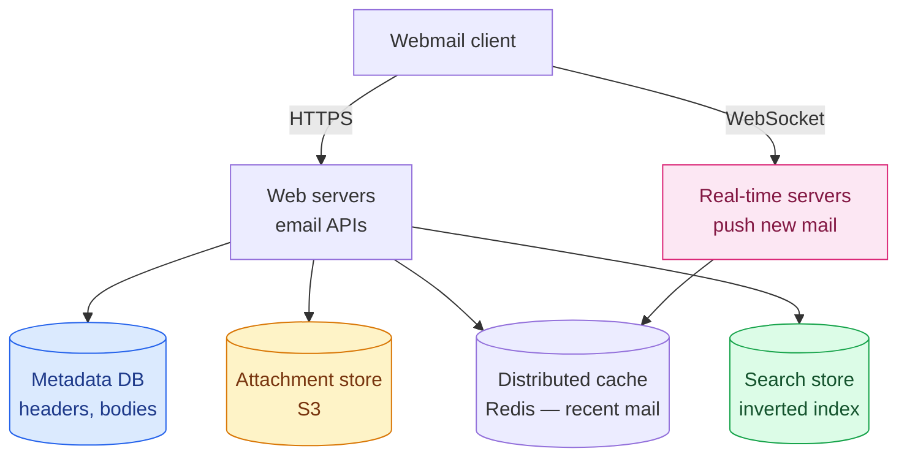
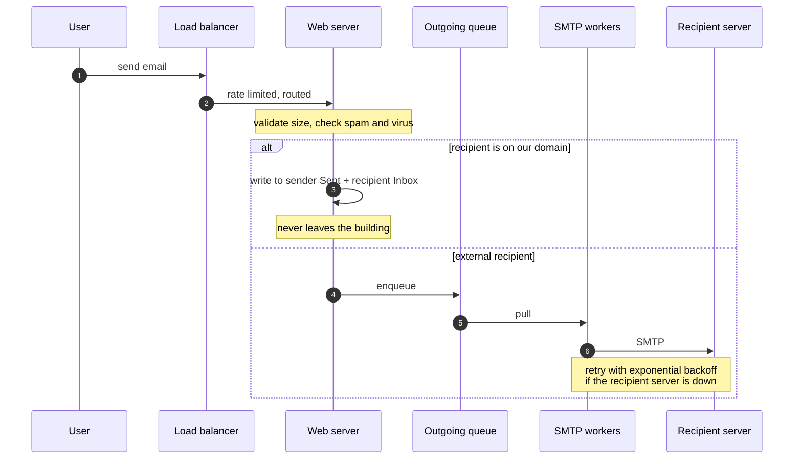
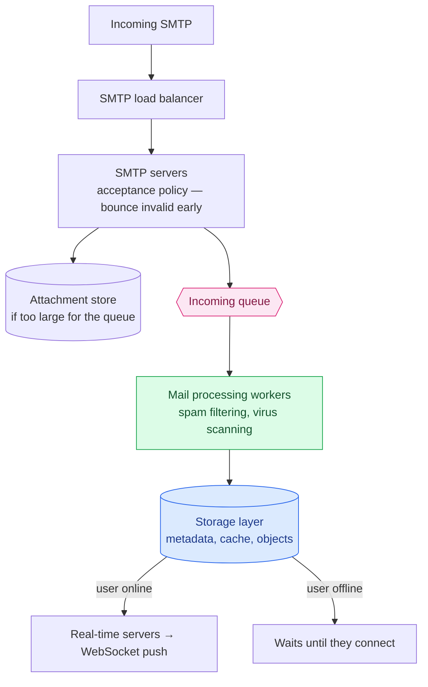
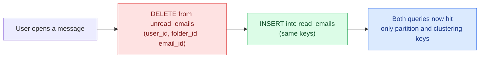

Email is the oldest system in this series by decades. SMTP was specified in 1982. POP and IMAP followed. Those protocols still carry the world's mail, and they were designed for an internet of a few thousand machines where you downloaded your messages and the server forgot them.

Now Gmail has over 1.8 billion users.

This chapter is about what happens when you keep the interface and replace everything behind it. And it produces the largest numbers we've seen — by a wide margin.

---

## Step 1 — Scope

### Requirements

- Send and receive emails
- Fetch all emails; **filter by read/unread**
- **Search** by subject, sender, and body
- Anti-spam and anti-virus
- Attachments

Client-to-server communication is over **HTTP**, not the legacy protocols — though servers still speak SMTP to each other, because that part is not negotiable.

### The numbers

This is where email distinguishes itself.

```
1 billion users
Sending:   1B × 10 emails/day  ÷ 10⁵  = 100,000 QPS
Receiving: 40 emails/day per user
```

Now storage, for **one year**:

```
Metadata:    1B users × 40/day × 365 × 50 KB          =   730 PB
Attachments: 1B × 40/day × 365 × 20% × 500 KB         = 1,460 PB
                                              Total   ≈ 2.2 EB
```

**Two exabytes per year.** For comparison, [Google Maps' entire global tile set](/2026/06/design-google-maps/) was about 100 PB — a *one-off* cost. Email adds twenty times that **every year**, and never deletes any of it.

**This is a storage system that happens to send messages.** Every other decision follows from that.

Worth being precise about one figure: the 50 KB "metadata" average includes the message body, which is why it's so much larger than a header. Bodies are what make email heavy — HTML mail routinely exceeds 100 KB.

---

## Step 2 — High-level design

### Why the old protocols don't fit

**SMTP** sends mail between servers. Still universal, still fine.

**POP** downloads messages to one device **and deletes them from the server**. That made sense when storage was expensive and you had one computer. It's incompatible with reading your mail on a phone, a laptop, and a watch.

**IMAP** keeps mail on the server and downloads on demand — much better, and still the dominant protocol for native clients.

But none of these were designed for threading, labels, full-text search across half a million messages, or push notification. They're **transfer protocols**, and modern email is a *database* with a transfer protocol attached.

Hence HTTP for the client, and a real storage layer behind it.

### The traditional design, and why it broke

Old mail servers used **Maildir**: one file per message, in per-user directories.

Simple, and it fails on three counts at scale. **Disk I/O becomes the bottleneck** — millions of small files is close to the worst case for a filesystem. **Backing up billions of files** is impractical. And **a single disk is a single point of failure**, which violates the one requirement email cannot compromise on: *do not lose mail*.

### Architecture



**Attachments go to object storage, not the database.** Cassandra technically supports blobs up to 2 GB, but the practical limit is under 1 MB — and large blobs destroy the row cache. Attachments reach 25 MB. They belong in S3, with only a reference stored alongside the message. ([Same reasoning as routing tiles in the maps chapter](/2026/06/design-google-maps/): store-and-fetch-by-key doesn't need a database.)

**Real-time servers are stateful**, holding WebSocket connections for push. Long polling is the fallback where WebSocket isn't available.

### Sending



Two details worth pulling out.

**Same-domain mail short-circuits entirely.** Gmail to Gmail never touches SMTP — it's two database writes. At Gmail's share of the market that's an enormous fraction of all mail avoiding the network path.

**The outgoing queue is the retry buffer.** Recipient servers go down; you cannot drop the message. Exponential backoff, and the queue depth becomes a health metric — a growing backlog means either a dead recipient or too few workers.

### Receiving



The queue does the same job in reverse: **it decouples accepting mail from processing it**, so a surge fills a buffer instead of dropping messages. And invalid recipients are bounced at the **SMTP connection level**, before any of the expensive processing — rejecting early is free, rejecting late is not.

---

## Step 3 — Deep dive

### Choosing a database, and admitting you can't

This is the rare case where working through the options honestly leads to **none of them fit**.

**Relational?** Indexes make search fast, but relational engines are tuned for small rows. A typical email exceeds a few KB and HTML mail passes 100 KB. `BLOB` exists, but you can't search a blob efficiently.

**Object storage?** Fine for backup. Hopeless for marking a message read, threading, or searching.

**NoSQL?** Gmail runs on **Bigtable** — so it's clearly viable — but Bigtable isn't open source and Google has never published how the search works. Cassandra is plausible; no large provider appears to use it.

**The honest conclusion is that large providers build custom databases.** What matters is naming the properties such a database needs:

- Single columns of several MB
- **Strong consistency** — losing or duplicating mail is unacceptable
- Designed to minimise disk I/O
- Highly available and fault tolerant
- Cheap **incremental backups**

**Being able to say "the right answer here is a custom system, and here's what it must do" is a stronger answer than forcing a familiar database into the role.**

### The data model, and a query NoSQL refuses

Partition by `user_id` — one user's mail lives on one shard. Mail isn't shared between users, so nothing is lost.

Then design a table per query:

**All folders for a user** — partition by `user_id`.

**All emails in a folder** — composite partition key `(user_id, folder_id)`, clustered by `email_id` as a `TIMEUUID` so messages sort chronologically for free.

**Fetch all unread emails** is where it gets interesting. In SQL:

```sql
SELECT * FROM emails_by_folder
WHERE user_id = ? AND folder_id = ? AND is_read = false
ORDER BY email_id;
```

**A NoSQL database will reject this**, because `is_read` is neither a partition key nor a clustering key. You can only query on the keys.

Fetching the whole folder and filtering in the application works for a small service and not for this one — some users have half a million messages.

**The answer is denormalisation: two tables.**

| `read_emails` | `unread_emails` |
|---|---|
| `user_id` (PK) | `user_id` (PK) |
| `folder_id` (PK) | `folder_id` (PK) |
| `email_id` (CK) | `email_id` (CK) |
| from, subject, preview | from, subject, preview |

Marking a message read becomes **delete from one table, insert into the other**:



That is more application code, more to keep correct, and two writes where there was one. It is also the standard NoSQL answer, and the underlying principle is worth stating plainly:

> **In a relational database you model the data and derive the queries. In NoSQL you enumerate the queries and derive the tables.** A query that doesn't fit the keys isn't a query the database will run slowly — it's a query it will refuse.

### Consistency: choosing unavailability on purpose

Almost every design in this series picks availability. This one doesn't.

**One primary per mailbox.** During a failover, that mailbox is **unreachable** — sync and update operations pause until it completes.

Deliberately trading availability for consistency, because the alternative is worse. A mailbox served by two primaries can lose a message, duplicate one, or resurrect a deleted one. **A brief outage is annoying; a lost email is a failure of the product's entire purpose.**

Note the granularity: it's per *mailbox*, not per system. One user's failover doesn't touch anyone else, which makes the availability cost tiny in aggregate.

### Search: writes vastly outnumber reads

Email search is the inverse of web search:

| | Google search | Email search |
|---|---|---|
| **Scope** | The whole web | One user's mailbox |
| **Sorting** | Relevance | Time, attachments, unread |
| **Accuracy** | Indexing lag is acceptable | **Must be near-real-time and exact** |

And critically: **every send, receive and delete requires reindexing, while a search only happens when someone clicks the button.** This is a write-heavy search system, which is unusual.

**Option 1: Elasticsearch.** Reindexing happens asynchronously via Kafka; queries are synchronous. Easy to integrate, well understood. The costs: **two copies of the data**, and keeping the primary store in sync with the index.

**Option 2: a custom engine.** At Gmail scale the bottleneck is disk I/O, and the answer is an **LSM tree** — the same structure behind Bigtable, Cassandra and RocksDB. Writes are buffered in memory and merged down in **sequential** batches, which is exactly what a write-heavy index needs. ([The same disk-access argument as the message queue chapter](/2026/06/design-distributed-message-queue/) — sequential writes are not slow.)

There's a second reason for LSM here that's easy to miss: **it separates data that changes from data that doesn't.** Message bodies never change; folder assignments change constantly with filter rules. Keeping them in separate sections means a folder move doesn't rewrite the message.

**Rule of thumb: Elasticsearch below a certain scale, a native embedded index above it.** The crossover is roughly where a dedicated team to run Elasticsearch becomes cheaper than a dedicated team to build a search engine.

---

## The part that isn't engineering

Here's what makes email genuinely different from everything else in this series.

**You can build a technically perfect mail server and still fail**, because your messages land in spam.

More than half of all email sent is spam. A brand-new server has **no reputation**, and receiving providers treat unknown senders with suspicion by default. The engineering is necessary and nowhere near sufficient.

**Dedicated IPs.** Providers are wary of new addresses with no history.

**Segregate traffic by category.** Marketing mail and password resets should not share an IP. If they do, one bad campaign gets your transactional mail filtered.

**Warm up slowly.** AWS SES estimates **two to six weeks** to build reputation on a new IP.

**Ban spammers fast**, before they damage your reputation.

**Process feedback loops** from ISPs, separating **hard bounces** (invalid address — stop sending), **soft bounces** (temporary — retry), and **complaints** (someone hit "report spam" — the most damaging signal).

### Authentication

Phishing and pretexting accounted for **93% of breaches** in Verizon's 2018 report. Three mechanisms answer it:

- **SPF** — which servers may send for your domain
- **DKIM** — a cryptographic signature proving the message wasn't altered
- **DMARC** — what to do when SPF or DKIM fails, and where to send reports

### Will your mail reach the inbox?

Since February 2024, Gmail and Yahoo **require** this for bulk senders — anyone sending around 5,000 messages a day or more to personal accounts. Set the switches and see:

<div class="deliv-check" id="dc"><div class="dc-label">SENDER SETUP</div><div class="dc-toggles" id="dc-toggles"><button data-k="spf" class="on">SPF</button><button data-k="dkim" class="on">DKIM</button><button data-k="dmarc" class="on">DMARC record</button><button data-k="unsub" class="on">One-click unsubscribe</button><button data-k="warm" class="on">IP warmed up</button></div><div class="dc-row"><label for="dc-rate">Spam complaint rate <b><span id="dc-rv">0.05</span>%</b></label><input type="range" id="dc-rate" min="0" max="100" step="1" value="5"></div><div class="dc-verdict" id="dc-verdict">—</div><ul class="dc-list" id="dc-list"></ul></div>
<script>
(function () {
  var root = document.getElementById("dc");
  if (!root) return;
  var state = { spf: true, dkim: true, dmarc: true, unsub: true, warm: true };
  var rate = document.getElementById("dc-rate"),
      rv = document.getElementById("dc-rv"),
      verdict = document.getElementById("dc-verdict"),
      list = document.getElementById("dc-list");
  function render() {
    var r = (+rate.value) / 100; // 0 to 1.00 percent
    rv.textContent = r.toFixed(2);
    var fail = [], warn = [];
    if (!state.spf) fail.push("<b>No SPF record.</b> Gmail and Yahoo require SPF and DKIM together for bulk senders.");
    if (!state.dkim) fail.push("<b>No DKIM signature.</b> Without it the message cannot pass DMARC alignment.");
    if (!state.dmarc) fail.push("<b>No DMARC record.</b> A policy of at least p=none is required on the From domain.");
    if (!state.unsub) fail.push("<b>No one-click unsubscribe.</b> The List-Unsubscribe header is mandatory for bulk mail.");
    if (r > 0.3) fail.push("<b>Complaint rate above 0.3%.</b> Google treats this as the hard ceiling; delivery is throttled or blocked.");
    else if (r > 0.1) warn.push("<b>Complaint rate above 0.1%.</b> Google's guidance is to stay below this; you are in the danger band.");
    if (!state.warm) warn.push("<b>Cold IP.</b> A new address with no sending history is filtered by default — warming takes two to six weeks.");
    var v, cls;
    if (fail.length) { v = "REJECTED OR SPAM FOLDER"; cls = "dc-bad"; }
    else if (warn.length) { v = "AT RISK — likely filtered"; cls = "dc-warn"; }
    else { v = "DELIVERED TO INBOX"; cls = "dc-ok"; }
    verdict.textContent = v;
    verdict.className = "dc-verdict " + cls;
    var html = "";
    fail.forEach(function (m) { html += '<li class="dc-f">' + m + "</li>"; });
    warn.forEach(function (m) { html += '<li class="dc-w">' + m + "</li>"; });
    if (!html) html = '<li class="dc-p">Authenticated, unsubscribable, warmed, and under the complaint threshold. This is the minimum bar for bulk mail — not an advantage.</li>';
    list.innerHTML = html;
  }
  var btns = root.querySelectorAll("#dc-toggles button");
  for (var i = 0; i < btns.length; i++) {
    btns[i].addEventListener("click", function () {
      var k = this.getAttribute("data-k");
      state[k] = !state[k];
      this.classList.toggle("on");
      render();
    });
  }
  rate.addEventListener("input", render);
  render();
})();
</script>

Notice that **passing every check earns you nothing** — it makes you eligible for the inbox, not welcome in it. And a **complaint rate of 0.3%** — three people in a thousand clicking "report spam" — is enough to get you blocked. Reputation is easy to lose and slow to rebuild.

---

## What has changed since the book

### JMAP is a real standard now

JMAP over WebSocket was a draft when this design was first written up. It is now a published IETF standard: **RFC 8620** (core) and **RFC 8621** (mail), both published in 2019, with **RFC 9610** covering contacts.

JMAP is the modern replacement for IMAP: **JSON over HTTP**, designed for efficient synchronisation, batching many operations into one round trip, and push. It is exactly the "custom protocol" the design above reaches for — except standardised rather than proprietary.

**Fastmail has run its entire production service on JMAP since 2019**, and Apache James and Cyrus both implement it.

So the design's instinct — HTTP for clients, keep SMTP between servers — has been formalised. The interesting part is *why* it hasn't displaced IMAP: **a protocol used by every mail client ever written cannot be replaced, only supplemented.** Backward compatibility is the strongest force in email.

### Authentication became mandatory

SPF, DKIM and DMARC used to be good practice. **They are now requirements.**

From **February 2024**, Google and Yahoo require every bulk sender — around 5,000 messages a day or more to personal accounts — to:

- Authenticate with **both SPF and DKIM**, aligned so the message passes DMARC
- Publish a **DMARC record** with at least `p=none`
- Support **one-click unsubscribe** via the `List-Unsubscribe` header
- Keep spam complaints **below 0.1%**, and never above **0.3%**

Two companies controlling enough of the mailbox market to make an optional standard compulsory is worth noticing. **The spec didn't change; the enforcement did.**

The wider stack has grown too: **MTA-STS** for enforced TLS between servers, **TLS-RPT** for reporting, **ARC** to preserve authentication across forwarders and mailing lists, and **BIMI** to display a verified logo — which is really a commercial incentive to deploy DMARC at enforcement.

### Storage got cheaper faster than mail grew

The 2.2 exabytes a year figure assumes you keep everything at full fidelity forever. In practice the same techniques from earlier chapters apply: **attachment deduplication** (check whether a blob already exists before storing a copy of the same file sent to fifty recipients), **tiered storage** moving old mail to colder, cheaper classes, and **compression** on bodies, which are text and compress extremely well.

The dedup point is larger than it looks. A 20 MB deck sent to a 200-person list is 4 GB stored naively and 20 MB stored once with 200 references. **Content-addressed storage** — hash the bytes, use the hash as the key — makes that automatic, and it's the same mechanism as [Google Drive's block deduplication](/2026/06/design-google-drive/).

---

## What to take away

**Email is a storage system wearing a messaging system's clothes.** Two exabytes a year against Google Maps' one-off 100 PB. When one resource dominates by an order of magnitude, it should dominate the design.

**In NoSQL, enumerate the queries and derive the tables.** `WHERE is_read = false` isn't slow — it's rejected. Denormalising into `read_emails` and `unread_emails` is more code and more writes, and it's the price of a database that only queries on keys.

**Sometimes the right answer is "build a custom one," and knowing the required properties is the real answer.** Naming what the database must do — multi-MB columns, strong consistency, low disk I/O, incremental backups — demonstrates more than picking a familiar name that doesn't fit.

**Availability is not always the right choice.** One primary per mailbox means a failover makes that mailbox briefly unreachable. For a product whose entire purpose is not losing messages, that's the correct trade — and per-mailbox granularity keeps the cost small.

**Backward compatibility is the strongest force in email.** JMAP is better than IMAP by every technical measure and has been a standard since 2019. IMAP is still everywhere, because every client ever written speaks it.

**The hardest part isn't the system.** You can build all of this correctly and still land in spam, because deliverability is reputation, relationships with ISPs, and a complaint rate below three in a thousand. Some problems aren't solved by better architecture.

---

## References and Further Reading

**Protocols**

<ul>
<li><a href="https://datatracker.ietf.org/doc/html/rfc8620">RFC 8620 — JMAP core</a> · <a href="https://datatracker.ietf.org/doc/html/rfc8621">RFC 8621 — JMAP for Mail</a></li>
<li><a href="https://jmap.io/">jmap.io</a> · <a href="https://www.fastmail.com/blog/jmap-new-email-open-standard/">Fastmail on running production on JMAP</a></li>
<li><a href="https://datatracker.ietf.org/doc/html/rfc5321">RFC 5321 — SMTP</a> · <a href="https://datatracker.ietf.org/doc/html/rfc1939">RFC 1939 — POP3</a> · <a href="https://datatracker.ietf.org/doc/html/rfc3501">RFC 3501 — IMAP4rev1</a></li>
<li><a href="https://datatracker.ietf.org/doc/html/rfc6154">RFC 6154 — special-use mailboxes</a> · <a href="https://en.wikipedia.org/wiki/MIME">MIME</a></li>
<li><a href="https://james.apache.org/">Apache James</a> — an open-source mail server implementing JMAP</li>
</ul>

**Deliverability and authentication**

<ul>
<li><a href="https://support.google.com/mail/answer/81126">Gmail sender guidelines</a> — the bulk sender requirements, first-hand</li>
<li><a href="https://en.wikipedia.org/wiki/Sender_Policy_Framework">SPF</a> · <a href="https://en.wikipedia.org/wiki/DomainKeys_Identified_Mail">DKIM</a> · <a href="https://en.wikipedia.org/wiki/DMARC">DMARC</a></li>
<li><a href="https://datatracker.ietf.org/doc/html/rfc8461">RFC 8461 — MTA-STS</a> · <a href="https://datatracker.ietf.org/doc/html/rfc8617">RFC 8617 — ARC</a> · <a href="https://bimigroup.org/">BIMI</a></li>
<li><a href="https://docs.aws.amazon.com/ses/latest/dg/dedicated-ip-warming.html">Warming dedicated IP addresses</a> — AWS SES</li>
<li><a href="https://www.statista.com/statistics/420391/spam-email-traffic-share/">Global spam volume</a></li>
</ul>

**Storage and search**

<ul>
<li><a href="https://en.wikipedia.org/wiki/Log-structured_merge-tree">Log-structured merge-tree</a> — the write-optimised index</li>
<li><a href="https://en.wikipedia.org/wiki/Inverted_index">Inverted index</a> · <a href="https://www.elastic.co/elasticsearch">Elasticsearch</a></li>
<li><a href="https://cwiki.apache.org/confluence/display/CASSANDRA2/CassandraLimitations">Cassandra limitations</a> — why attachments don't belong in it</li>
<li><a href="https://www.jwz.org/doc/threading.html">Message threading</a> — the JWZ algorithm</li>
</ul>

**In this series**

<ul>
<li><a href="/guide/">The complete guide</a> — every article in order</li>
<li><a href="/2026/06/design-google-drive/">Design Google Drive</a> — content-addressed storage and deduplication</li>
<li><a href="/2026/06/design-distributed-message-queue/">Design a Distributed Message Queue</a> — LSM trees and sequential writes</li>
<li><a href="/2026/06/design-search-autocomplete/">Design Search Autocomplete</a> — the other search problem in this series</li>
</ul>
