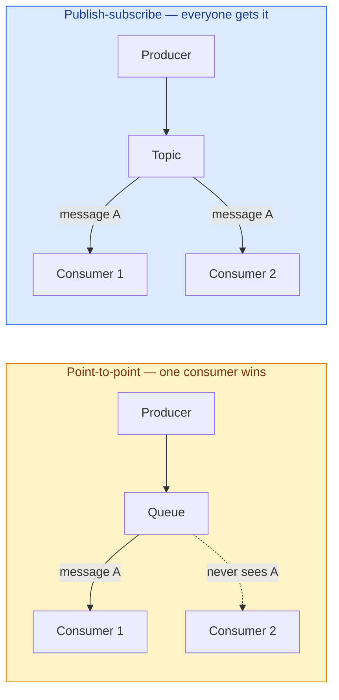
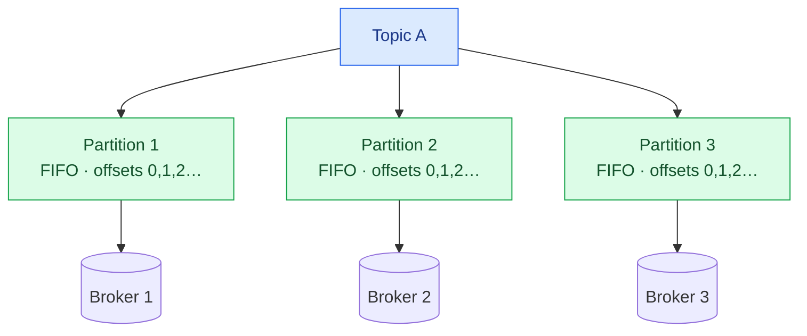
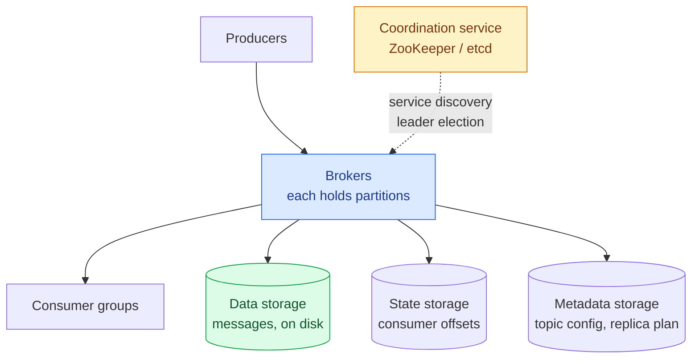
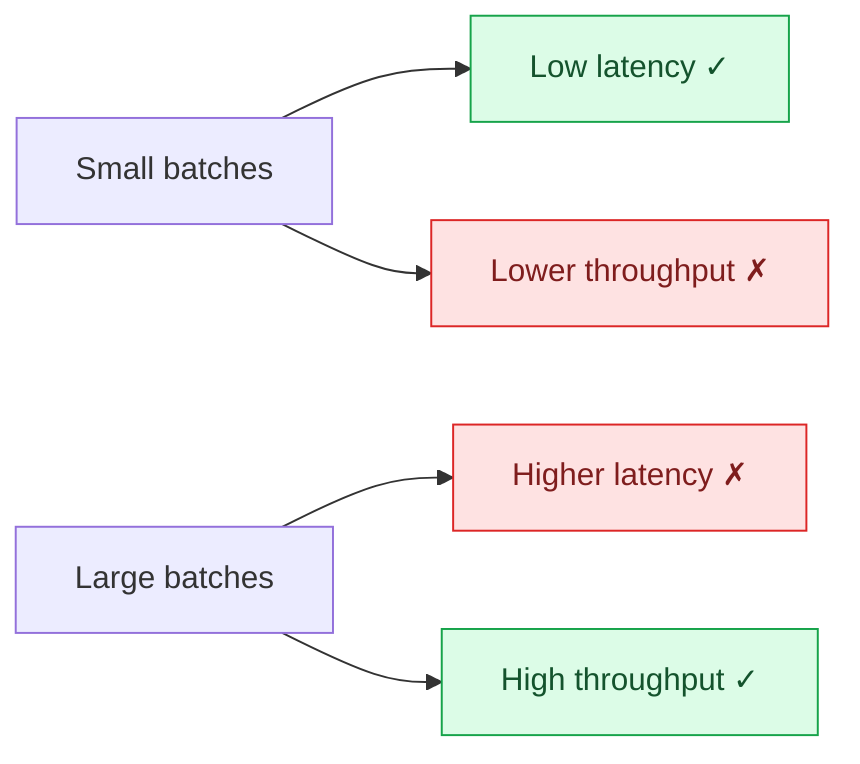
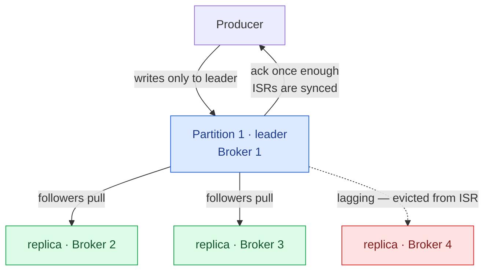

A message queue sits between two services so they don't have to know about each other. The producer writes and moves on; the consumer reads when it's ready. Neither has to be up when the other is.

That buys you four things: **decoupling**, independent **scaling** of each side, **availability** when one side is down, and **asynchronous** communication so nobody blocks.

Simple enough to describe in a sentence. The design is not simple at all, and the reason is that we're going to build the harder version: not just a queue that hands messages over and forgets them, but one that **retains everything for two weeks** and lets consumers read it again from any point.

That single requirement — retention — turns a networking problem into a **storage** problem, and it is what separates Kafka and Pulsar from RabbitMQ and ActiveMQ.

---

## Step 1 — Scope

### Requirements

**Functional**

- Producers send messages to a queue; consumers consume them.
- Messages can be consumed **repeatedly**, or only once.
- Historical data can be truncated.
- Messages are kilobyte-scale text.
- **Ordering**: messages can be delivered in the order they were added.
- **Delivery semantics** — at-most-once, at-least-once, exactly-once — are **configurable by the user**.

**Non-functional**

- High throughput **or** low latency, configurable per use case.
- Distributed and scalable, able to absorb sudden surges.
- **Persistent and durable** — on disk, replicated across nodes.

Two of those deserve a second look, because they're doing a lot of work.

**"High throughput or low latency, configurable."** Not both. These genuinely trade off, and the mechanism is batching. The design's job is not to pick a winner but to **expose the dial**.

**"Delivery semantics configurable."** Also a refusal to choose. Exactly-once costs real performance; at-most-once loses data. Different users want different points on that curve, so the system must support all three.

> **If you strip out retention, most of this design collapses.** A traditional queue like RabbitMQ keeps messages in memory only until consumed, with modest disk overflow, and doesn't guarantee ordering. Much simpler — and much less capable.

---

## Step 2 — High-level design

### Two messaging models

**Point-to-point.** A message goes to a queue and is consumed by exactly **one** consumer. Several consumers may be waiting, but each message goes to one of them. Once acknowledged, it's deleted. No retention.

**Publish-subscribe.** A message goes to a **topic** and every subscriber receives it. Two consumers subscribing to the same topic each get their own copy.



We'll build publish-subscribe, then **simulate point-to-point using consumer groups**. One mechanism, both models — which is a much better outcome than building two systems.

### Topics, partitions, brokers

A topic is a named category of messages. But what if one topic holds more data than a single machine can take?

**Partition it.** Split the topic into partitions and spread messages across them. Partitions are distributed across the servers in the cluster, which are called **brokers**.



Each partition is a FIFO queue. A message's position in it is its **offset**.

**This is the design's most important decision, and it's a trade.** Ordering is guaranteed *within* a partition and **not across partitions**. In exchange, you get horizontal scalability: add partitions, add capacity.

The escape hatch is the **message key**. Every message can carry an optional key — a user ID, an order ID — and all messages with the same key go to the same partition via `hash(key) % numPartitions`. No key means a random partition.

So you don't choose between "ordered" and "scalable". You choose **what to order by**. All events for one user stay strictly ordered; different users are independent and parallel. That's almost always what you actually need — nobody requires a global order across unrelated customers.

### Consumer groups

A **consumer group** is a set of consumers cooperating to consume a topic. Each group keeps its own offsets, so groups are completely independent — a billing group and an analytics group read the same topic without interfering.

Reading in parallel raises throughput, but naively it destroys ordering: two consumers reading the same partition have no defined order between them.

One constraint fixes it:

> **A partition can be consumed by only one consumer within a group.**

Now the ordering guarantee survives parallelism. The cost: **if a group has more consumers than the topic has partitions, the extras sit idle.** Partitions are the unit of parallelism, so provision enough of them up front.

And this is how one mechanism gives both models: **put every consumer in the same group and you have point-to-point**; put them in separate groups and you have publish-subscribe.

### The architecture



Three distinct kinds of state, and they have nothing in common:

- **Data storage** — the messages. Enormous, append-only, sequential.
- **State storage** — consumer offsets. Small, updated constantly, randomly accessed, must be consistent.
- **Metadata storage** — topic config and the replica plan. Tiny, rarely changed, must be consistent.

**Separating them by access pattern is what lets each one use the right technology.** Messages get an append-only log; offsets and metadata get a consistent key-value store.

---

## Step 3 — Deep dive

Three decisions carry the performance of the whole system:

1. An **on-disk structure built for sequential access**, exploiting the OS page cache.
2. A **message format that never changes in transit**, so nothing needs copying.
3. **Batching everywhere** — producer, broker, consumer.

### Where do messages actually go?

The workload is unusual: **write-heavy and read-heavy**, **no updates or deletes**, and **almost entirely sequential**.

**Option 1: a database.** A table per topic, or a collection with messages as documents.

It would work, and it's the wrong tool. Databases are built to support random access, updates, deletes, secondary indexes and transactions — none of which we need. We'd pay for all of it and use none of it. At this scale the database becomes the bottleneck.

**Option 2: a write-ahead log.** A plain file. New messages are **appended to the end**. Nothing else.

That's it. That's the storage engine.

```
Topic-A Partition-1
┌───┬───┬───┬───┬───┬───┬───┬───┬───┬───┬────┬────┬────┐
│ 0 │ 1 │ 2 │ 3 │ 4 │ 5 │ 6 │ 7 │ 8 │ 9 │ 10 │ 11 │ 12 │ ← appends here
└───┴───┴───┴───┴───┴───┴───┴───┴───┴───┴────┴────┴────┘
└──────── segment-1 ────────┘└──────── segment-2 ───────┘
                                   (active)
```

A single file can't grow forever, so the log is split into **segments**. Only the newest segment is active and takes writes; older segments are read-only and can be deleted wholesale when they age out. **Truncation becomes "delete a file"** rather than a delete query over billions of rows.

### The disk myth

The instinct is that disks are slow and this design must therefore be slow. That instinct is about **random** access.

Sequential access is a completely different regime. Spinning disks in a RAID configuration comfortably sustain **hundreds of MB/s** sequentially, and the cost per byte is excellent.

And the operating system helps enormously. Modern kernels cache disk data in free memory aggressively — an append-only log is exactly the access pattern that cache is best at. On a cluster where consumers are keeping up, **reads are served from page cache and never touch the disk at all.**

> **The lesson generalises beyond queues.** "Disk is slow" is not a fact, it's a statement about a workload. Design the access pattern to match the hardware and the hardware stops being the problem. This is the same insight behind LSM trees in [the key-value store chapter](/2026/05/design-a-key-value-store/).

### The message format

The message schema is a contract between producer, broker and consumer:

| Field | Type | Purpose |
|---|---|---|
| `key` | bytes | Determines the partition. **Not** unique like a KV-store key. |
| `value` | bytes | The payload — text or a compressed binary block. |
| `topic` | string | Topic name |
| `partition` | int | Partition ID |
| `offset` | long | Position in the partition |
| `timestamp` | long | When it was stored |
| `size` | int | Message size |
| `crc` | int | Integrity check |

`(topic, partition, offset)` uniquely identifies any message in the system.

The reason the format matters so much is subtle: **if producer, broker and consumer disagree about the layout, someone has to rewrite the message.** Rewriting means copying, and copying at millions of messages per second is ruinous. Agreeing on one format end to end means the bytes that arrive from the network are the bytes written to disk are the bytes sent to the consumer.

### Batching, everywhere

Batching appears at all three layers, and it's the single biggest performance lever:

- **The producer** buffers messages and sends larger requests, amortising network round trips.
- **The broker** writes large chunks, producing long sequential runs and better page-cache behaviour.
- **The consumer** fetches many messages per request.

The cost is latency. A bigger batch waits longer before it's sent.



This is why the requirement said "high throughput **or** low latency, configurable". Batch size is the knob, and it's the user's to turn.

### The producer: skip the routing layer

Which broker should a producer send to? A message belongs to a specific partition, which has a leader replica on a specific broker.

**The obvious answer — a routing layer** — takes messages and forwards them to the right broker. It works, and it has two problems: an extra network hop on every message, and no natural place to batch.

**The better answer: put the routing in the producer's client library.** The producer caches the replica plan, works out the partition itself, and connects directly to the leader.

That change buys three things: fewer hops, custom partitioning logic if the application wants it, and — crucially — **somewhere to put the buffer**. Once the producer knows where each message is going, it can accumulate a batch per destination.

**Moving logic into the client removed a network hop and enabled batching at the same time.** Client libraries doing real work, rather than being thin RPC wrappers, is a recurring pattern in high-throughput systems.

### The consumer: push or pull?

Should brokers push messages to consumers, or should consumers pull?

**Push** gives the lowest latency — the broker forwards the instant it has data. But the broker sets the pace, and it has no idea what the consumer can handle. A slow consumer gets overwhelmed. A fleet of consumers with different processing speeds is impossible to serve well.

**Pull** puts the consumer in charge. Real-time consumers poll constantly; batch consumers poll occasionally and take huge chunks. If consumption falls behind, add consumers or let them catch up later. And pull is naturally batch-friendly: a pull returns *everything* available after your current offset, up to a limit.

The downside is polling an empty broker, wasting round trips. **Long polling** fixes that: the request waits on the broker for a specified time until data arrives.

**Most message queues choose pull**, and the deciding argument is flow control. In a push system, backpressure has to be invented. In a pull system, it's automatic — a consumer that stops asking simply stops receiving.

### Consumer rebalancing

Consumers in a group coordinate through a **coordinator**, exchanging heartbeats. When membership changes, partitions are redistributed.

```mermaid
sequenceDiagram
    autonumber
    participant A as Consumer A
    participant CO as Coordinator
    participant B as Consumer B

    A->>CO: heartbeat
    B->>CO: JoinGroup
    A->>CO: heartbeat
    CO-->>A: rebalance needed — please rejoin
    A->>CO: JoinGroup
    CO-->>A: joined; you are the leader
    CO-->>B: joined
    A->>CO: SyncGroup (partition assignment plan)
    CO-->>A: consume partitions 1, 3
    CO-->>B: consume partitions 2, 4
```

The same flow handles three cases. A consumer **joins** by asking. A consumer **leaves** by announcing it. A consumer **crashes** and the coordinator notices the missing heartbeats and treats it as a departure.

Notice that a crash is handled by the *same* path as a graceful exit — the only difference is how the coordinator finds out. **Making failure a special case of a normal operation means one code path to get right instead of two.**

### Storing offsets and metadata

**Consumer offsets** are read and written constantly but are small in volume, randomly accessed, and **consistency matters** — a wrong offset means lost or duplicated messages.

**Metadata** — topic config, retention, the replica plan — is tiny, changes rarely, and also demands consistency.

Both fit a consistent key-value store, and ZooKeeper is the classic answer. It also handles **service discovery** (which brokers are alive) and **leader election** (one broker becomes the controller that assigns partitions).

### Replication

Disks fail. Each partition therefore has several replicas on different brokers — one **leader**, the rest **followers**.

Producers write only to the leader. Followers pull from it. Once enough replicas have the message, the leader commits and acknowledges.



Replicas must never all sit on one broker — that defends against nothing and wastes space.

### In-sync replicas, and the ACK dial

Which replicas count as "enough"? The **in-sync replica set (ISR)** is the replicas keeping up with the leader, within a configured lag. Fall behind and you're evicted; catch up and you rejoin.

**Why not just wait for every replica?** Because then a single slow machine makes the whole partition slow or unavailable. The ISR lets the system route around a straggler instead of being held hostage by it.

That gives the producer a durability dial:

| Setting | Behaviour | Trade |
|---|---|---|
| **`acks=all`** | Wait until every ISR has the message | Strongest durability, slowest — you wait for the slowest ISR |
| **`acks=1`** | Wait for the leader to persist | Faster. **If the leader dies right after acking and before replicating, the message is gone.** |
| **`acks=0`** | Don't wait at all, never retry | Lowest latency, real message loss. Fine for metrics and logs. |

**One configuration value moves the system between "never lose a payment" and "drop a metric, who cares".** Exposing that as a dial rather than a decision is the right design.

Consumers read from the leader too. That sounds like a bottleneck until you notice the constraint from earlier: one partition, one consumer per group. Connection counts stay low, and a hot topic is fixed by adding partitions. (Reading from a nearby replica is worth it across data centres, where the round trip dominates.)

---

## Delivery semantics

Now the part everyone gets asked about — and it's usually taught as three things to memorise. It isn't. **It's two independent choices, and the semantics fall out of them.**

**On the producer side:** does it wait for acknowledgement, and does it retry?

**On the consumer side:** does it commit its offset **before** processing, or **after**?

Commit before processing, crash mid-work, and the message is never reprocessed — **lost**. Commit after processing, crash between the work and the commit, and you'll do the work again — **duplicated**.

### Work it out yourself

Set the four knobs and see what you get:

<div class="sem-explorer" id="sem"><div class="sem-controls"><div class="sem-group"><div class="sem-label">Producer acks</div><div class="sem-opts" data-key="acks"><button data-v="0">acks=0</button><button data-v="1">acks=1</button><button data-v="all" class="on">acks=all</button></div></div><div class="sem-group"><div class="sem-label">Producer retries</div><div class="sem-opts" data-key="retry"><button data-v="off">off</button><button data-v="on" class="on">on</button></div></div><div class="sem-group"><div class="sem-label">Consumer commits offset</div><div class="sem-opts" data-key="commit"><button data-v="before">before processing</button><button data-v="after" class="on">after processing</button></div></div><div class="sem-group"><div class="sem-label">Idempotent producer + transactions</div><div class="sem-opts" data-key="txn"><button data-v="off" class="on">off</button><button data-v="on">on</button></div></div></div><div class="sem-result"><div class="sem-verdict" id="sem-verdict">At-least-once</div><div class="sem-badges"><span class="sem-badge" id="sem-loss">Can lose messages: —</span><span class="sem-badge" id="sem-dup">Can duplicate: —</span></div><p class="sem-why" id="sem-why"></p></div></div>
<script>
(function () {
  var root = document.getElementById("sem");
  if (!root) return;
  var state = { acks: "all", retry: "on", commit: "after", txn: "off" };
  var verdict = document.getElementById("sem-verdict"),
      lossEl = document.getElementById("sem-loss"),
      dupEl = document.getElementById("sem-dup"),
      whyEl = document.getElementById("sem-why");
  function evaluate() {
    var reasons = [];
    var pLoss = false, pDup = false;
    if (state.acks === "0") { pLoss = true; reasons.push("With <b>acks=0</b> the producer never learns whether the broker got the message, and never retries — so the retry setting has no effect."); }
    else if (state.acks === "1") { pLoss = true; reasons.push("With <b>acks=1</b> the leader acknowledges before followers have copied the message — if it dies in that window, the message is gone."); }
    if (state.acks !== "0" && state.retry === "off") { pLoss = true; reasons.push("With <b>retries off</b>, a failed or timed-out send is simply dropped."); }
    // acks=0 means the producer never waits and never retries, so the retry
    // setting cannot cause duplicates in that mode.
    if (state.acks !== "0" && state.retry === "on" && state.txn === "off") { pDup = true; reasons.push("A <b>retry</b> after a lost acknowledgement writes the message twice — the broker cannot tell it is the same one."); }
    var cLoss = state.commit === "before", cDup = state.commit === "after";
    if (cLoss) reasons.push("Committing the offset <b>before processing</b> means a crash mid-work skips the message forever.");
    if (cDup && state.txn === "off") reasons.push("Committing <b>after processing</b> means a crash between the work and the commit reprocesses the message.");
    if (state.txn === "on") {
      if (pDup) { pDup = false; }
      if (cDup) { cDup = false; }
      reasons.push("<b>Idempotence</b> tags each message with a producer ID and sequence number so the broker discards retried duplicates; <b>transactions</b> make the write and the offset commit atomic.");
    }
    var loss = pLoss || cLoss, dup = pDup || cDup;
    var name, cls;
    if (loss && dup) { name = "Neither guarantee"; cls = "sem-bad"; }
    else if (loss) { name = "At-most-once"; cls = "sem-warn"; }
    else if (dup) { name = "At-least-once"; cls = "sem-ok"; }
    else { name = "Exactly-once"; cls = "sem-best"; }
    verdict.textContent = name;
    verdict.className = "sem-verdict " + cls;
    lossEl.textContent = "Can lose messages: " + (loss ? "YES" : "no");
    lossEl.className = "sem-badge " + (loss ? "sem-b-bad" : "sem-b-good");
    dupEl.textContent = "Can duplicate: " + (dup ? "YES" : "no");
    dupEl.className = "sem-badge " + (dup ? "sem-b-bad" : "sem-b-good");
    if (!loss && !dup && state.txn === "on") reasons.push("Note the cost: transactions add coordination on every write, and throughput drops.");
    whyEl.innerHTML = reasons.length ? reasons.join(" ") : "Nothing can be lost and nothing can be duplicated.";
  }
  var groups = root.querySelectorAll(".sem-opts");
  for (var i = 0; i < groups.length; i++) {
    (function (g) {
      var key = g.getAttribute("data-key");
      var btns = g.querySelectorAll("button");
      for (var j = 0; j < btns.length; j++) {
        btns[j].addEventListener("click", function () {
          for (var k = 0; k < btns.length; k++) btns[k].classList.remove("on");
          this.classList.add("on");
          state[key] = this.getAttribute("data-v");
          evaluate();
        });
      }
    })(groups[i]);
  }
  evaluate();
})();
</script>

Try `acks=1` with `commit before processing`. You land in **"Neither guarantee"** — the quadrant nobody talks about. Messages can be lost *and* duplicated, and it is a completely reachable configuration. Plenty of production systems live there without anyone realising, because each setting was chosen separately and nobody looked at the pair.

The three named semantics:

**At-most-once** — may be lost, never redelivered. `acks=0`, commit before processing. Right for metrics and logs, where volume is huge and a gap is invisible.

**At-least-once** — never lost, may arrive twice. `acks=all` with retries, commit after processing. **The usual choice**, and it works because consumers can usually deduplicate — a unique key in each message turns a duplicate into a rejected insert.

**Exactly-once** — the expensive one. Right for payments and trading, especially when the downstream system isn't idempotent.

> **The practical takeaway: at-least-once plus an idempotent consumer is usually the right answer.** You get the durability of exactly-once at the cost of at-least-once, and you push the deduplication to the place that has the business key to do it with.

---

## Scaling and failure

**Producers** scale trivially — no coordination, just add instances.

**Consumers** scale via groups and rebalancing, which handles additions, removals and crashes.

**Brokers.** When one dies, the controller detects it, generates a new replica plan for the survivors, and new replicas catch up from their leaders.

Growing the cluster has a nice subtlety. The naive approach redistributes replicas immediately, which risks a window of reduced redundancy. Better: **temporarily allow more replicas than configured.** Add the new broker, start replicating to it, and only once it has caught up remove the now-redundant old replica. Redundancy never dips below target.

**Partitions.** Adding is easy — old messages stay put, new ones spread across all partitions. Producers get notified, consumers rebalance.

**Removing is not.** A decommissioned partition still holds unconsumed data, so it can't be deleted immediately. Producers stop writing to it, consumers keep reading from it, and only after the retention period expires can the space be reclaimed.

**Reducing partitions is not a way to reclaim disk.** That surprises people. The data has to age out regardless; the partition count has nothing to do with it.

---

## Advanced features

**Message filtering.** A consumer may want only some message subtypes. Building a separate topic per consumer couples producers to consumers and duplicates storage. Filtering on the consumer wastes bandwidth.

Filter on the broker — but **only on metadata, never the payload.** Deserialising or decrypting message bodies would wreck broker performance, and encrypted payloads shouldn't be readable there at all. Attach **tags** to each message and let the broker filter on those.

**Delayed and scheduled messages.** "Cancel this order if it isn't paid in 30 minutes." Send the message to **temporary storage** on the broker rather than the topic, and deliver it when the time comes. Two implementations: predefined **delay levels** (RocketMQ offers 1s, 5s, 10s, 30s, 1m … 2h) or a **hierarchical timing wheel**. Fixed levels avoid the general scheduling problem entirely by refusing arbitrary precision — a good example of narrowing a requirement to get a much simpler implementation.

---

## What has changed since the book

### Kafka removed ZooKeeper entirely

The single biggest update, and it invalidates part of the architecture above.

The design leans on ZooKeeper for metadata, offsets, service discovery and leader election. **Kafka no longer uses ZooKeeper at all.**

**KRaft** (KIP-500) moves cluster metadata into Kafka itself, stored in an internal topic managed by a Raft quorum of controller nodes. The timeline:

- **Kafka 3.3** — KRaft declared production-ready
- **Kafka 3.5** — ZooKeeper mode deprecated
- **Kafka 4.0** — **ZooKeeper support removed completely**

You cannot upgrade a ZooKeeper cluster straight to 4.0; you migrate to KRaft on a 3.x "bridge release" first.

Why it matters beyond Kafka: operating two distributed consensus systems to run one product is a permanent tax — two failure modes, two upgrade paths, two things to understand at 3 a.m. **The metadata store and the data store now use the same replication machinery.** Fewer moving parts is itself a feature.

(Kafka had already moved consumer offsets out of ZooKeeper years earlier, into an internal Kafka topic — the same instinct, applied first to the highest-traffic state.)

### Zero-copy is the mechanism the chapter gestures at

The design says the message format avoids copying, but doesn't name how.

Normally, sending a file to a socket costs **four copies**: disk → kernel buffer → user space → socket buffer → network card. The two trips through user space are pure overhead when the application isn't looking at the bytes.

The **`sendfile()`** system call eliminates them. Data goes from page cache to the network card **inside the kernel**, never entering the application. Two copies instead of four.

Combined with page cache, this is what makes the "disk is fine" claim hold up. Data is read into page cache **once** and served to every consumer from there. On a cluster where consumers are caught up, **the disks see no read traffic at all.**

That's the payoff for choosing an append-only log. The format is so simple that bytes can go from disk to network without the application ever touching them — and that is only possible because nothing needs rewriting in transit.

### How exactly-once actually works

The chapter calls exactly-once hard and moves on. The mechanism is two parts:

**Idempotent producer.** Each producer gets a **producer ID (PID)**, and each message carries a **sequence number** per partition. The broker remembers the last sequence number it saw from each PID. A retry arrives with a sequence number it has already written, so the broker **discards it silently**. Duplicates from retries disappear at the source.

**Transactions.** The producer's writes *and* its consumer offset commits are made **atomic**. In a read-process-write pipeline, either the output message and the offset commit both land, or neither does — closing the gap where a crash between processing and committing causes reprocessing.

Since Kafka 3.0, `acks=all` and idempotence are **on by default**. The safe configuration is now the one you get without asking.

Note what this does *not* solve: if your consumer writes to an external database, exactly-once inside Kafka doesn't extend there. You still need an idempotent write or a transactional outbox. **Exactly-once is a property of a boundary, not of a system.**

### Tiered storage makes retention cheap

The chapter's closing suggestion — archive old data to HDFS or object storage — is now a built-in feature.

**Tiered storage** (KIP-405, production-ready in Kafka 3.9) splits retention in two. Recent segments stay on broker disks; older ones are copied to **S3 or equivalent** and deleted locally. `local.retention.ms` governs the disk copy, `retention.ms` the remote one.

Consumers don't notice. Reading old data transparently fetches from object storage.

This changes the economics considerably. Retention used to be bounded by how much disk you were willing to attach to brokers; now it's bounded by an S3 bill. And it makes brokers much lighter, which means **rebalancing and recovery get faster** — less local state to move when a broker dies.

### Cooperative rebalancing

The rebalance protocol above is **stop-the-world**: every consumer gives up every partition and the whole group re-forms. With a large group and frequent membership changes, that hurts.

**Incremental cooperative rebalancing** revokes only the partitions that actually need to move. Consumers whose assignments are unchanged keep working straight through. Newer Kafka releases go further, moving coordination server-side so a single consumer joining doesn't disturb the rest.

---

## What to take away

**Partitioning turns "ordered" from a yes/no into a question of what to order by.** Global ordering doesn't scale. Per-key ordering does, and it's what applications actually need. The message key is the entire mechanism.

**Match the storage engine to the access pattern, not to habit.** The workload is append-only and sequential, so the answer is a file. A database would have supplied random access, updates and indexes we never use — and become the bottleneck for the privilege.

**"Disk is slow" is a statement about random access.** Sequential writes plus page cache plus `sendfile()` means an idle disk on a caught-up cluster. Shape the access pattern and the hardware stops mattering.

**Delivery semantics are derived, not chosen.** Two independent settings — producer acknowledgement and consumer commit order — produce four outcomes. Three have names. The fourth, where you get *neither* guarantee, is reachable by accident and is why you should reason about the pair rather than each setting alone.

**Expose the dial instead of picking a point.** Batch size, ack level, retention, delivery semantics — every one of these is a genuine trade-off with no universal answer. The design's job was to make them configurable, and that's why one system serves both log aggregation and financial transactions.

---

## References and Further Reading

**Kafka internals**

<ul>
<li><a href="https://kafka.apache.org/documentation/#design">Kafka design documentation</a> — sequential I/O, page cache and zero-copy, first-hand</li>
<li><a href="https://kafka.apache.org/documentation/#design_pull">Push vs pull</a> — Kafka's own argument for pull</li>
<li><a href="https://cwiki.apache.org/confluence/display/KAFKA/KIP-833%3A+Mark+KRaft+as+Production+Ready">KIP-833: Mark KRaft as production ready</a></li>
<li><a href="https://cwiki.apache.org/confluence/display/KAFKA/KIP-405%3A+Kafka+Tiered+Storage">KIP-405: Kafka tiered storage</a> · <a href="https://kafka.apache.org/41/operations/tiered-storage/">tiered storage operations guide</a></li>
<li><a href="https://developer.confluent.io/courses/architecture/transactions/">Kafka transactions and exactly-once</a> — Confluent</li>
<li><a href="https://strimzi.io/blog/2023/05/03/kafka-transactions/">Exactly-once semantics with Kafka transactions</a> — Strimzi</li>
<li><a href="https://www.confluent.io/blog/hands-free-kafka-replication-a-lesson-in-operational-simplicity/">Hands-free Kafka replication</a> — how ISR is maintained</li>
<li><a href="https://kafka.apache.org/protocol">Kafka protocol guide</a></li>
</ul>

**Other queues and protocols**

<ul>
<li><a href="https://www.rabbitmq.com/docs/streams">RabbitMQ Streams</a> — an append-only log in a traditional queue</li>
<li><a href="https://pulsar.apache.org/docs/concepts-architecture-overview/">Apache Pulsar architecture</a> — separated compute and storage via BookKeeper</li>
<li><a href="https://en.wikipedia.org/wiki/Advanced_Message_Queuing_Protocol">AMQP</a></li>
<li><a href="http://www.cs.columbia.edu/~nahum/w6998/papers/sosp87-timing-wheels.pdf">Hashed and hierarchical timing wheels</a> — the classic paper behind delayed messages</li>
</ul>

**Background**

<ul>
<li><a href="https://dataintensive.net/">Designing Data-Intensive Applications</a> — Chapter 5 on replication, Chapter 11 on streams</li>
<li><a href="https://zookeeper.apache.org/">Apache ZooKeeper</a> · <a href="https://etcd.io">etcd</a></li>
<li><a href="https://hadoop.apache.org/docs/r1.2.1/hdfs_design.html">HDFS design</a></li>
</ul>

**In this series**

<ul>
<li><a href="/guide/">The complete guide</a> — every article in order</li>
<li><a href="/2026/05/design-a-key-value-store/">Design a Key-Value Store</a> — replication, quorums and LSM trees</li>
<li><a href="/2026/05/design-notification-system/">Design a Notification System</a> — queues in anger, and why exactly-once is impossible end to end</li>
<li><a href="/2026/06/design-nearby-friends/">Design Nearby Friends</a> — Redis Pub/Sub, and what at-most-once really costs</li>
</ul>
