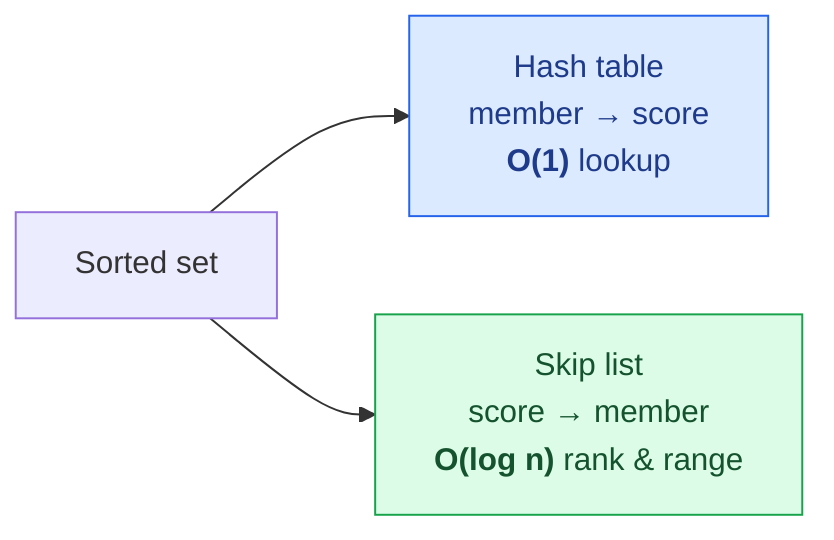
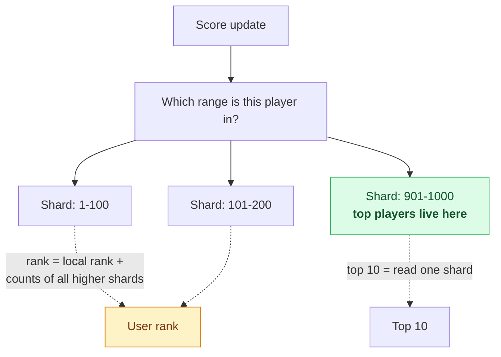
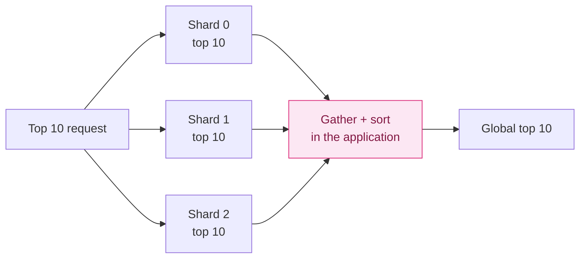

"Show me the top 10 players, and tell me where I rank."

Two sentences. They sound like the same problem and they are not, and the second one is why this design exists.

Finding the top 10 of anything is easy — you keep a small heap. But telling one player they are **#4,328,911 out of 25 million**, updated in real time as everyone else keeps scoring, is a genuinely hard query. There is no shortcut: to know someone's rank you have to know how many people are ahead of them, which means knowing about everyone.

The good news is that a data structure exists which does exactly this, and it is sitting inside Redis.

---

## Step 1 — Scope

**Requirements**

- Display the **top 10** players
- Show **a specific user's rank**
- Bonus: show the players **four places above and below** a given user
- A new leaderboard each month
- Ties share a rank
- **Real-time** — not a batched history

**Scale**: 5 million DAU, **25 million MAU**, each player averaging 10 matches a day.

### The numbers

```
Average users/sec  = 5,000,000 / 100,000  = 50
Peak (5×)                                  = 250
Score updates/sec  = 50 × 10 matches       = 500
Peak score updates                         = 2,500
Top-10 fetches/sec (once per session)      ≈ 50
```

**2,500 writes per second.** Modest — nothing here strains a modern server. As with [the hotel reservation system](/2026/06/design-hotel-reservation-system/), the difficulty is not volume. It's that **one specific query is expensive no matter how few of them you run.**

### One design decision before anything else

Who sets the score — the client or the server?

**The server. Always.** A client that reports its own score is trivially manipulated: proxy the request, change the number, become world champion. The game client tells the server *"I won"*; the server validates and updates the leaderboard.

**Anything a client can assert about itself is something an attacker can assert about themselves.** This is the same instinct that keeps [payment amounts off the client](/2026/06/design-ad-click-aggregation/) — the boundary of trust is the server.

---

## Step 2 — Why the obvious solution fails

Start with a table. `user_id`, `score`. Winning a match is:

```sql
UPDATE leaderboard SET score = score + 1 WHERE user_id = 'mary1934';
```

Perfect. Now find someone's rank:

```sql
SELECT *, (SELECT COUNT(*) FROM leaderboard lb2
           WHERE lb2.score >= lb1.score) AS rank
FROM leaderboard lb1
WHERE lb1.user_id = 'mary1934';
```

**That inner query counts every player with a higher score.** Over 25 million rows, per request. It takes **tens of seconds**.

And the usual escapes don't work:

**Add an index?** Helps the top-10 query with a `LIMIT`. Does nothing for "what is this specific person's rank" — you still have to count everyone above them.

**Cache it?** Cache what? The data changes 2,500 times a second, and any cached ranking is wrong immediately.

**Batch it?** That's a direct violation of the requirement. A leaderboard that updates hourly is a different product.

> **A relational database is excellent at "give me rows matching X" and poor at "tell me the position of this row in a global ordering."** Rank is a property of the whole set, not of a row — and B-trees index rows.

---

## The right data structure

Redis has a type built for precisely this: the **sorted set**.

Every member has a score. Members are unique, scores may repeat, and the set is **permanently ordered by score**. The ordering isn't computed on read — it's maintained on every write.

Internally a sorted set is **two structures kept in sync**:

- A **hash table** mapping member → score, for O(1) "what is this player's score?"
- A **skip list** mapping score → member, for O(log n) ordered operations



**Two indexes over the same data, each answering a different question.** Exactly the pattern from [the email chapter's read/unread tables](/2026/06/design-distributed-email-service/) — when one structure can't serve two access patterns, maintain two.

### What a skip list actually is

A sorted linked list has O(n) search — you walk it. A skip list fixes that by stacking **express lanes** on top.

```
level 2:  1 ──────────────────► 15 ──────────────► 60
level 1:  1 ──────► 8 ────────► 15 ────► 36 ─────► 60
base:     1 ► 4 ► 7 ► 8 ► 10 ► 15 ► 26 ► 36 ► 45 ► 60
```

Each level skips roughly half the nodes below it. Searching for 45 starts at the top and drops down when the next node would overshoot — the same halving that makes binary search fast, applied to a linked list.

The effect grows with size. In a list of 64 nodes, a linear walk visits **62 nodes**; a five-level skip list visits **11**.

And crucially, **a skip list supports rank directly.** Store how many nodes each express-lane pointer spans, and walking to a member sums those spans — giving its position without counting anything.

> That's the whole trick. The rank query is expensive in SQL because rank isn't stored anywhere. In a skip list it falls out of the search path.

### The commands

| Command | Purpose | Cost |
|---|---|---|
| `ZINCRBY key 1 member` | Add a point (creates the member if absent) | O(log n) |
| `ZRANGE key 0 9 REV WITHSCORES` | Top 10, highest first | O(log n + m) |
| `ZREVRANK key member` | A member's rank, highest first | **O(log n)** |
| `ZRANGE key 357 365 REV` | The window around a rank | O(log n + m) |

`ZREVRANK` is the one that matters. **The query that took tens of seconds in SQL is logarithmic here** — and it's logarithmic because the data structure was chosen to make it so.

### Play with it

Below is a real sorted set — the same operations, in the browser. Score some points and watch ranks reorder:

<div class="lb-demo" id="lb"><div class="lb-actions"><button id="lb-win">You win a match</button><button id="lb-sim">Simulate 25 matches</button><button id="lb-reset">Reset</button></div><div class="lb-cmd" id="lb-cmd">ZRANGE leaderboard_jun_2026 0 4 REV WITHSCORES</div><div class="lb-label">TOP 5</div><table class="lb-table"><tbody id="lb-top"></tbody></table><div class="lb-label">AROUND YOU — <span id="lb-rankline"></span></div><table class="lb-table"><tbody id="lb-near"></tbody></table></div>
<script>
(function () {
  var root = document.getElementById("lb");
  if (!root) return;
  var NAMES = ["happy_tomato","mary1934","golden_gate","pizza_or_bread","ocean","blue_yeti","fast_lane",
    "quiet_storm","red_panda","silver_fox","tiny_dancer","urban_myth","velvet","wandering",
    "xenon","yellow_kite","zebra_crossing","astro_cat","bright_side","cobalt","dune_rider","echo_park"];
  var ME = "night_owl";
  var set, cmd = document.getElementById("lb-cmd"),
      topEl = document.getElementById("lb-top"), nearEl = document.getElementById("lb-near"),
      rankLine = document.getElementById("lb-rankline");
  function reset() {
    set = NAMES.map(function (n, i) { return { m: n, s: 40 - i - Math.floor(Math.random() * 3) }; });
    set.push({ m: ME, s: 22 });
  }
  // sorted set ordering: score descending, member name ascending as the tiebreak
  function sorted() {
    return set.slice().sort(function (a, b) { return b.s - a.s || (a.m < b.m ? -1 : 1); });
  }
  // equal scores share a rank, exactly as the requirement asks
  function ranks(list) {
    var out = [], r = 0, prev = null;
    for (var i = 0; i < list.length; i++) {
      if (list[i].s !== prev) { r = i + 1; prev = list[i].s; }
      out.push(r);
    }
    return out;
  }
  function row(entry, rank, me) {
    return '<tr class="' + (me ? "lb-me" : "") + '"><td class="lb-r">' + rank + '</td>' +
           '<td class="lb-m">' + entry.m + (me ? ' <i>you</i>' : '') + '</td>' +
           '<td class="lb-s">' + entry.s + '</td></tr>';
  }
  function render(lastCmd) {
    var list = sorted(), rk = ranks(list);
    if (lastCmd) cmd.textContent = lastCmd;
    var html = "";
    for (var i = 0; i < 5; i++) html += row(list[i], rk[i], list[i].m === ME);
    topEl.innerHTML = html;
    var mi = 0;
    for (var j = 0; j < list.length; j++) if (list[j].m === ME) mi = j;
    rankLine.innerHTML = 'ZREVRANK &rarr; rank <b>' + rk[mi] + '</b> of ' + list.length;
    var lo = Math.max(0, mi - 2), hi = Math.min(list.length - 1, mi + 2);
    var h2 = "";
    for (var k = lo; k <= hi; k++) h2 += row(list[k], rk[k], list[k].m === ME);
    nearEl.innerHTML = h2;
  }
  function bump(member, by) {
    for (var i = 0; i < set.length; i++) if (set[i].m === member) { set[i].s += by; return; }
    set.push({ m: member, s: by });
  }
  document.getElementById("lb-win").addEventListener("click", function () {
    bump(ME, 1);
    render('ZINCRBY leaderboard_jun_2026 1 "night_owl"');
  });
  document.getElementById("lb-sim").addEventListener("click", function () {
    for (var i = 0; i < 25; i++) bump(NAMES[Math.floor(Math.random() * NAMES.length)], 1);
    render("25 x ZINCRBY leaderboard_jun_2026 1 <random player>");
  });
  document.getElementById("lb-reset").addEventListener("click", function () {
    reset();
    render("DEL leaderboard_jun_2026  +  ZADD ...");
  });
  reset();
  render();
})();
</script>

Notice two things. **Every one of those operations is O(log n)** — the display would behave identically with 25 million players instead of 24. And **ties genuinely share a rank**, which is the requirement, and which the naive `ORDER BY` position would get wrong.

### It fits on one server

```
25 million entries × 26 bytes (24-char id + 2-byte score) ≈ 650 MB
```

Double it for skip-list and hash overhead — **about 1.3 GB.** One Redis instance, comfortably, at 2,500 writes per second.

But **Redis is a cache, and the leaderboard is the product.** So MySQL holds the durable `user` and `point` tables, which serve match history *and* let you rebuild the entire sorted set after a failure. Redis persistence exists, but reloading a large instance from disk is slow — so run a read replica and promote it.

**In-memory speed with a durable source of truth behind it.** The fast thing is allowed to be lossy precisely because the slow thing isn't.

---

## Step 3 — Scaling, and the problem with no clean answer

At 5 million DAU one server is fine. At **500 million** — 65 GB and 250,000 QPS — it isn't.

Here the design hits something genuinely awkward: **a single sorted set cannot be split across shards.** Redis Cluster distributes *keys*, and the whole leaderboard is one key. Two options, and neither is clean.

### Fixed partition — shard by score range

Ten shards: scores 1–100, 101–200, and so on.



**Top 10 becomes trivial** — read the highest shard only.

**Rank stays cheap**: local rank within your shard, plus the total count of every higher shard. Those counts are O(1) per shard.

The costs are real, though. Scores must be **distributed evenly across ranges**, or one shard holds everyone. You need a secondary cache mapping user → current score so you know which shard to write to. And when a player's score crosses a boundary you must **delete them from the old shard and insert into the new one** — a migration on every threshold crossing, for every player.

### Hash partition — let Redis Cluster do it

Redis Cluster shards by hash slot: `CRC16(key) % 16384`, across 16,384 slots. Adding or removing nodes moves slots rather than rehashing everything.

Writes become trivial. Reads become **scatter-gather**: fetch the top 10 from every shard, then merge in the application.



Three problems, and the third is fatal for our requirements:

- **Large k is expensive** — top 1,000 means 1,000 rows back from every shard.
- **You wait for the slowest shard**, every time.
- **There is no straightforward way to get one user's rank.** Scatter-gather finds top-k; it cannot tell you that someone is #4,328,911 without counting across every shard.

**So: fixed partition.** Hash partitioning is simpler to operate and cannot answer the query the product is built around. **Pick the sharding scheme that serves your hardest query, not the one that's easiest to configure.**

### The NoSQL alternative

DynamoDB with a **global secondary index** also works: partition key `game#{year-month}`, sort key `score`.

Except that puts every current-month write into **one partition** — a textbook hot partition. The fix is **write sharding**: append a partition number to the key, `game#{year-month}#p{n}`, spreading writes across *n* partitions.

Which lands you back at scatter-gather for reads, with the same limitation. **The hot partition and the rank query pull in opposite directions**, and you cannot satisfy both with one key design. That tension is the whole reason this problem is interesting.

---

## What has changed since the book

### ZREVRANGE is deprecated

Small but worth knowing, and a direct echo of [the GEORADIUS deprecation in the proximity chapter](/2026/06/design-a-proximity-service/).

Since **Redis 6.2**, `ZRANGE` absorbed the whole family — `ZREVRANGE`, `ZRANGEBYSCORE`, `ZREVRANGEBYSCORE`, `ZRANGEBYLEX`, `ZREVRANGEBYLEX` — behind optional arguments:

```
ZRANGE leaderboard_jun_2026 0 9 REV WITHSCORES        # top 10
ZRANGE leaderboard_jun_2026 900 1000 BYSCORE          # a score band
```

The old commands still work for compatibility. `ZINCRBY` and `ZREVRANK` are unaffected — the consolidation was only for range queries.

### Small sorted sets aren't skip lists

The hash-table-plus-skip-list description is right for **large** sorted sets and wrong for small ones.

Below `zset-max-listpack-entries` (128) and `zset-max-listpack-value` (64 bytes), Redis stores a sorted set as a **listpack** — a flat, contiguous array. Linear scans, but on 128 entries a contiguous array beats pointer-chasing on cache locality alone. Cross either threshold and Redis converts to the skip-list encoding automatically.

**Asymptotic complexity is the wrong tool below a certain size**, and Redis encodes that judgement directly in its data types. A production leaderboard is always well past the threshold — but a per-guild or per-friends leaderboard may never cross it.

### Redis forked

The biggest ecosystem change, and it isn't technical.

In **March 2024** Redis Ltd. relicensed from BSD-3-Clause to SSPL/RSALv2, specifically to stop cloud providers selling managed Redis. Within days, contributors from **AWS, Google, Oracle and Ericsson** forked Redis 7.2 as **Valkey** and donated it to the **Linux Foundation** under the original BSD licence.

Valkey is **API-compatible** — same RESP protocol, same commands — so everything here works unchanged. It has since diverged on performance, with multi-threaded I/O being the headline.

For a design like this it changes nothing in the architecture and quite a lot in procurement. **"Use Redis" is now a licensing decision as well as a technical one**, and if you're on a managed cloud offering you may already be running Valkey.

### When exact rank stops being worth it

The design assumes every player deserves an exact global rank. At the largest scale, many games quietly abandon that.

Below the top few thousand, exact position carries almost no information — knowing you are #4,328,911 rather than #4,328,908 changes nothing. So the common pattern is **exact ranks for the leaderboard proper, and percentile or tier buckets** ("top 5%", "Gold III") for everyone else. Buckets are cheap: a count per band, no global ordering required.

**The expensive query is often expensive because of a requirement nobody examined.** Worth asking whether exact rank at position four million is a feature or an assumption.

---

## What to take away

**Rank is a property of the set, not the row.** That is why SQL struggles: B-trees index rows, and no index over rows makes "how many are above this one" cheap. The fix isn't a better query — it's a structure that maintains order on write.

**Skip lists get rank for free.** Storing span counts on the express-lane pointers means walking to a member also counts everything before it. The hard query falls out of the search path.

**Two structures, two access patterns.** A hash table for member → score, a skip list for score → member. When one index can't serve both questions, maintain both.

**Never let the client assert the score.** Anything a client can claim about itself, an attacker can claim about themselves.

**Shard for your hardest query.** Hash partitioning is easier to run and cannot answer "what is this user's rank". Fixed partitioning by score range is fiddlier — rebalancing, boundary migrations — and it answers both questions the product asks.

**Check whether the expensive requirement is real.** Exact global rank at position four million is enormously costly and tells the player nothing. Percentile buckets are almost free.

---

## References and Further Reading

**Redis and sorted sets**

<ul>
<li><a href="https://redis.io/docs/latest/develop/data-types/sorted-sets/">Redis sorted sets</a> — the data type, first-hand</li>
<li><a href="https://redis.io/docs/latest/commands/zrange/">ZRANGE</a> — including the REV and BYSCORE arguments that replaced the older commands</li>
<li><a href="https://redis.io/docs/latest/commands/zincrby/">ZINCRBY</a> · <a href="https://redis.io/docs/latest/commands/zrevrank/">ZREVRANK</a></li>
<li><a href="https://redis.io/docs/latest/operate/oss_and_stack/management/optimization/memory-optimization/">Redis memory optimization</a> — listpack thresholds and encoding conversion</li>
<li><a href="https://en.wikipedia.org/wiki/Skip_list">Skip list</a> — the structure behind the ordering</li>
<li><a href="https://redis.io/docs/latest/operate/oss_and_stack/management/scaling/">Redis Cluster</a> — hash slots and resharding</li>
</ul>

**Valkey**

<ul>
<li><a href="https://valkey.io/">Valkey</a> — the BSD-licensed fork</li>
<li><a href="https://www.linuxfoundation.org/press/linux-foundation-launches-open-source-valkey-community">Linux Foundation launches Valkey</a></li>
</ul>

**Alternatives**

<ul>
<li><a href="https://docs.aws.amazon.com/amazondynamodb/latest/developerguide/GSI.html">DynamoDB global secondary indexes</a></li>
<li><a href="https://aws.amazon.com/lambda/">AWS Lambda</a> · <a href="https://cloud.google.com/functions">Google Cloud Functions</a> · <a href="https://azure.microsoft.com/en-us/products/functions">Azure Functions</a></li>
</ul>

**In this series**

<ul>
<li><a href="/guide/">The complete guide</a> — every article in order</li>
<li><a href="/2026/06/design-a-proximity-service/">Design a Proximity Service</a> — Redis sorted sets doing a different job</li>
<li><a href="/2026/06/design-distributed-email-service/">Design a Distributed Email Service</a> — two indexes over the same data</li>
<li><a href="/2026/05/design-consistent-hashing/">Design Consistent Hashing</a> — why Redis Cluster uses hash slots instead</li>
</ul>
