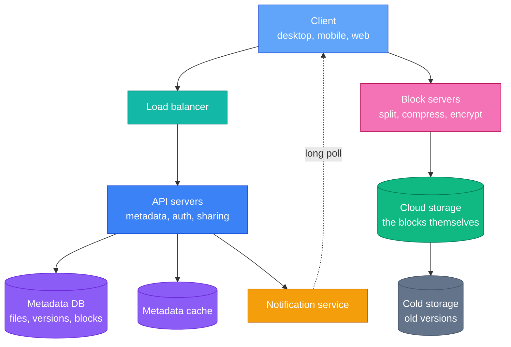
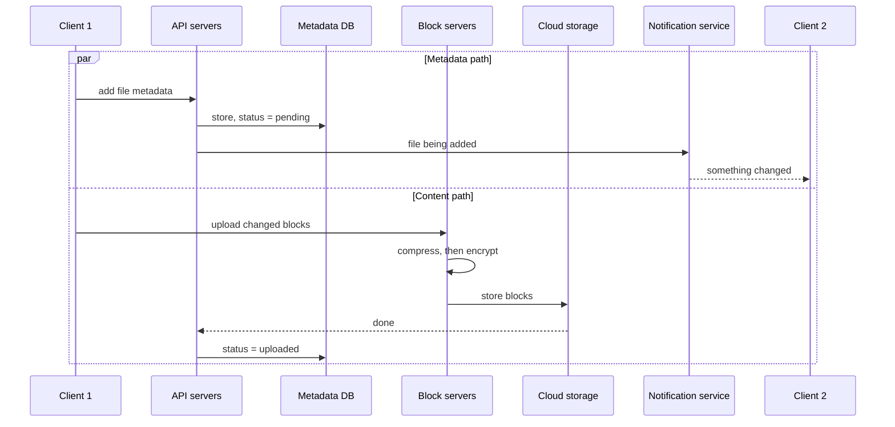
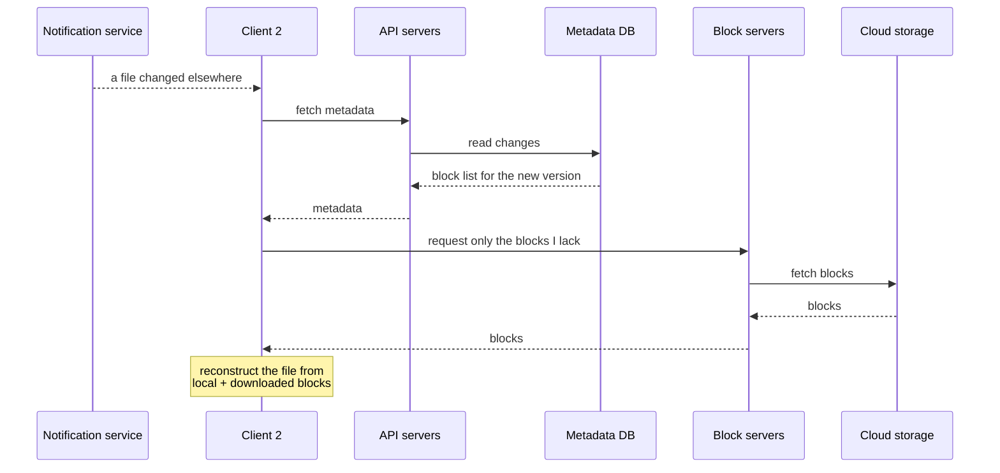
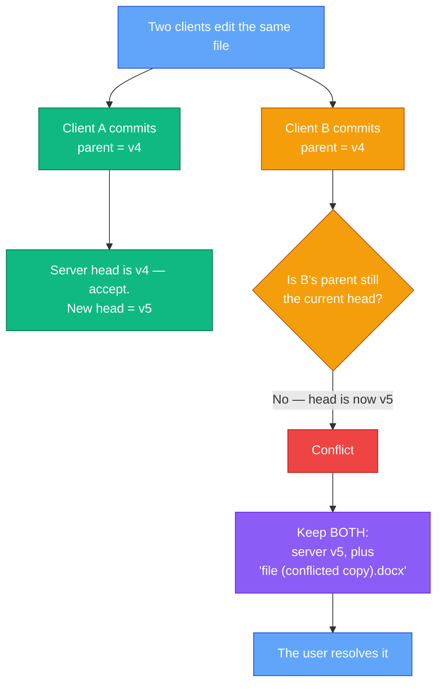

You have a 4 GB video file in your Drive folder. You change its title — a few dozen bytes near the start.

How many bytes should cross the network?

The naive answer is 4 GB. The right answer is a few hundred kilobytes, and getting from one to the other is what this chapter is about. Everything else — the API servers, the metadata database, the notification service — is machinery you have already seen. The distinctive problems here are three:

- **What actually changed?** Detecting it cheaply, without reading the whole file over the network.
- **What if two people change it at once?** And crucially: how do you resolve that *without ever losing someone's work*?
- **How do you not store the same bytes a million times?** Half your storage bill is duplicate data.

This is also the last design chapter in the book, and a good one to end on, because it makes explicit something implicit throughout: **for a storage product, losing data is the only unrecoverable failure.** Slow is survivable. Wrong is survivable. Gone is not.

---

## Step 1 — Understand the Problem and Establish Scope

> **Candidate:** Which features matter most?  
> **Interviewer:** Upload and download files, sync across devices, and notifications.
>
> **Candidate:** Mobile, web, or both?  
> **Interviewer:** Both.
>
> **Candidate:** Which file types?  
> **Interviewer:** Any.
>
> **Candidate:** Encryption?  
> **Interviewer:** Yes, files must be encrypted at rest.
>
> **Candidate:** File size limit?  
> **Interviewer:** 10 GB.
>
> **Candidate:** Scale?  
> **Interviewer:** 10 million daily active users.

In scope: adding and downloading files, sync across devices, revision history, sharing, and notifications. **Explicitly out of scope: real-time collaborative editing.** Two people typing in the same document simultaneously is a different problem — operational transforms or CRDTs — and conflating it with file sync is the fastest way to lose control of the answer. Confirm the boundary early.

The non-functional requirements are unusually pointed:

| Requirement | Why it dominates |
|---|---|
| **Reliability** | Data loss is unacceptable. Not "rare" — unacceptable |
| **Fast sync** | Slow sync makes the product feel broken |
| **Bandwidth** | Users on mobile data notice every wasted megabyte |
| **Scalability and availability** | The usual |

### Back-of-the-envelope

| Quantity | Working | Result |
|---|---|---|
| Total allocated storage | 50M signed-up users x 10 GB | **500 PB** |
| Uploads per second | 10M x 2 files / 86,400 | **~240 QPS** |
| Peak | 2x | **~480 QPS** |
| Read:write ratio | — | **~1:1** |

Look at the mismatch. **240 QPS is trivial** — a single database could serve that. **500 PB is enormous.** This is not a request-rate problem; it is a storage and bandwidth problem. Recognising that immediately tells you where to spend the interview.

---

## Step 2 — High-Level Design

The important structural decision is the **separation of metadata from content**. File names, folder structure, sharing permissions and version history live in a database — small, relational, queried constantly. The actual bytes live in object storage — enormous, immutable, and never queried, only fetched by key.

They scale differently, fail differently, and cost differently by orders of magnitude. Keeping them apart is what lets you serve 500 PB from a metadata database that fits comfortably on ordinary hardware.

---

## Step 3 — Design Deep Dive

### Block servers: never send the whole file

A file is not stored as a file. It is **split into blocks**, and each block is independently compressed, encrypted and uploaded.

That split enables the optimisation that defines the product: when a file changes, compare block hashes, and **upload only the blocks whose hashes changed**. Change a title in a 4 GB video and one or two blocks differ. You send those.

Add compression before encryption — note the order, because it matters. Compressed data has low entropy patterns that compress well; **encrypted data is indistinguishable from random and does not compress at all**. Compress first, then encrypt. Getting that order backwards is a real and common mistake.

### The problem the book glosses over: fixed-size blocks

The book says "split the file into blocks" and moves on. But *how* you choose the boundaries decides whether delta sync works at all.

With **fixed-size blocks** — every 4 MB, say — insert one byte at the beginning of the file and every subsequent boundary shifts by one byte. Every block's contents change. Every hash changes. You re-upload the entire 4 GB to add one character.

<svg viewBox="0 0 740 300" xmlns="http://www.w3.org/2000/svg" style="width:100%;max-width:740px;margin:2rem auto;display:block;">
  <text x="18" y="22" font-size="13" font-weight="700" fill="var(--dg-text)">Fixed-size blocks: insert one byte at the front and everything shifts</text>
  <text x="18" y="48" font-size="12" fill="var(--dg-muted)">original</text>
  <rect x="90" y="34" width="150" height="24" rx="4" fill="var(--dg-green)" fill-opacity="0.25" stroke="var(--dg-green)"/>
  <text x="165" y="51" font-size="11" text-anchor="middle" fill="var(--dg-text)">block 1</text>
  <rect x="244" y="34" width="150" height="24" rx="4" fill="var(--dg-green)" fill-opacity="0.25" stroke="var(--dg-green)"/>
  <text x="319" y="51" font-size="11" text-anchor="middle" fill="var(--dg-text)">block 2</text>
  <rect x="398" y="34" width="150" height="24" rx="4" fill="var(--dg-green)" fill-opacity="0.25" stroke="var(--dg-green)"/>
  <text x="473" y="51" font-size="11" text-anchor="middle" fill="var(--dg-text)">block 3</text>
  <rect x="552" y="34" width="150" height="24" rx="4" fill="var(--dg-green)" fill-opacity="0.25" stroke="var(--dg-green)"/>
  <text x="627" y="51" font-size="11" text-anchor="middle" fill="var(--dg-text)">block 4</text>
  <text x="18" y="90" font-size="12" fill="var(--dg-muted)">+1 byte</text>
  <rect x="90" y="76" width="16" height="24" rx="3" fill="var(--dg-orange)" stroke="var(--dg-orange)"/>
  <rect x="110" y="76" width="150" height="24" rx="4" fill="var(--dg-red)" fill-opacity="0.28" stroke="var(--dg-red)"/>
  <text x="185" y="93" font-size="11" text-anchor="middle" fill="var(--dg-red-tx)">all changed</text>
  <rect x="264" y="76" width="150" height="24" rx="4" fill="var(--dg-red)" fill-opacity="0.28" stroke="var(--dg-red)"/>
  <text x="339" y="93" font-size="11" text-anchor="middle" fill="var(--dg-red-tx)">all changed</text>
  <rect x="418" y="76" width="150" height="24" rx="4" fill="var(--dg-red)" fill-opacity="0.28" stroke="var(--dg-red)"/>
  <text x="493" y="93" font-size="11" text-anchor="middle" fill="var(--dg-red-tx)">all changed</text>
  <rect x="572" y="76" width="130" height="24" rx="4" fill="var(--dg-red)" fill-opacity="0.28" stroke="var(--dg-red)"/>
  <text x="637" y="93" font-size="11" text-anchor="middle" fill="var(--dg-red-tx)">all changed</text>
  <text x="18" y="126" font-size="12" font-weight="700" fill="var(--dg-red-tx)">Every boundary shifted. The whole file re-uploads.</text>
  <line x1="18" y1="146" x2="722" y2="146" stroke="var(--dg-border)" stroke-width="1.5"/>
  <text x="18" y="176" font-size="13" font-weight="700" fill="var(--dg-text)">Content-defined chunking: boundaries follow the data, not the offset</text>
  <text x="18" y="202" font-size="12" fill="var(--dg-muted)">original</text>
  <rect x="90" y="188" width="118" height="24" rx="4" fill="var(--dg-green)" fill-opacity="0.25" stroke="var(--dg-green)"/>
  <text x="149" y="205" font-size="11" text-anchor="middle" fill="var(--dg-text)">A</text>
  <rect x="212" y="188" width="176" height="24" rx="4" fill="var(--dg-green)" fill-opacity="0.25" stroke="var(--dg-green)"/>
  <text x="300" y="205" font-size="11" text-anchor="middle" fill="var(--dg-text)">B</text>
  <rect x="392" y="188" width="134" height="24" rx="4" fill="var(--dg-green)" fill-opacity="0.25" stroke="var(--dg-green)"/>
  <text x="459" y="205" font-size="11" text-anchor="middle" fill="var(--dg-text)">C</text>
  <rect x="530" y="188" width="172" height="24" rx="4" fill="var(--dg-green)" fill-opacity="0.25" stroke="var(--dg-green)"/>
  <text x="616" y="205" font-size="11" text-anchor="middle" fill="var(--dg-text)">D</text>
  <text x="18" y="244" font-size="12" fill="var(--dg-muted)">+1 byte</text>
  <rect x="90" y="230" width="134" height="24" rx="4" fill="var(--dg-red)" fill-opacity="0.28" stroke="var(--dg-red)"/>
  <text x="157" y="247" font-size="11" text-anchor="middle" fill="var(--dg-red-tx)">A' changed</text>
  <rect x="228" y="230" width="176" height="24" rx="4" fill="var(--dg-green)" fill-opacity="0.25" stroke="var(--dg-green)"/>
  <text x="316" y="247" font-size="11" text-anchor="middle" fill="var(--dg-text)">B unchanged</text>
  <rect x="408" y="230" width="134" height="24" rx="4" fill="var(--dg-green)" fill-opacity="0.25" stroke="var(--dg-green)"/>
  <text x="475" y="247" font-size="11" text-anchor="middle" fill="var(--dg-text)">C unchanged</text>
  <rect x="546" y="230" width="156" height="24" rx="4" fill="var(--dg-green)" fill-opacity="0.25" stroke="var(--dg-green)"/>
  <text x="624" y="247" font-size="11" text-anchor="middle" fill="var(--dg-text)">D unchanged</text>
  <text x="18" y="278" font-size="12" font-weight="700" fill="var(--dg-green-tx)">Only the chunk containing the edit changes. One chunk uploads.</text>
</svg>

The fix is **content-defined chunking**. Instead of cutting every N bytes, slide a **rolling hash** over the file and cut wherever the hash matches a pattern — for example, where its low 13 bits are all zero. Boundaries are then determined by the *content*, so inserting bytes shifts only the chunk containing the insertion. Everything after it re-aligns and its hashes are unchanged.

This is the core idea in **rsync** (Adler-32 rolling checksum), and in Rabin fingerprinting. It is what makes "edit a 4 GB file, upload 200 KB" actually true rather than aspirational. Published figures put delta sync's bandwidth saving at **60%+ for typical edit patterns**.

### Content-addressed storage

Once blocks are hashed, a natural model falls out:

- **A block is named by the hash of its contents.** Same bytes, same name, everywhere.
- **Blocks are immutable.** You never modify one; you write a new one.
- **A file is an ordered list of block hashes.** Editing produces a new list.

Version history becomes almost free: each version is another list, and versions share every block they have in common. Deduplication becomes automatic: two users uploading the same PDF produce the same hashes, so the second upload stores nothing.

### Consistency: why relational

The requirement is **strong consistency**, and the reasoning is concrete: it is unacceptable for one device to show a file that another device does not, or to show different contents. A user with a laptop and a phone must see the same thing.

That pushes toward a relational database with ACID guarantees for metadata. NoSQL stores can be made to do this, but you implement the guarantees yourself. Since the metadata is small and the QPS is ~240, there is no scaling reason to give up ACID. **Take the strong guarantees when they are cheap.**

Cache consistency needs the same care: invalidate on write, and keep replicas in step, or you will serve a stale file listing.

### The schema

| Table | Holds | Note |
|---|---|---|
| `user` | Account details | |
| `device` | Devices per user | `push_id` for notifications; one user, many devices |
| `namespace` | The user's root directory | |
| `file` | Current state of each file | |
| `file_version` | Version history | **Read-only rows** — never mutate history |
| `block` | Blocks per file version | Ordered; join them to reconstruct any version |

`file_version` being append-only is the important one. Revision history is worthless if it can be rewritten, and immutability is what makes "restore my file from Tuesday" a guarantee rather than a hope.

### Upload

The two paths run **in parallel**, and the `pending` status is what makes that safe: metadata exists before the bytes do, so the system knows a file is arriving and can tell other devices, without ever exposing a file whose blocks are missing.

### Download

Note what the client asks for: **only the blocks it does not already have.** The saving is symmetric — delta on upload, delta on download.

### Notifications: long polling, not WebSocket

[Chapter 12](/2026/06/design-chat-system/) chose WebSocket. Here the right answer is **long polling**, and being able to explain the difference is more valuable than knowing either in isolation:

- **Traffic is one-directional.** The server tells the client something changed; the client then fetches over normal HTTP. There is nothing to push upward.
- **Events are infrequent.** Chat is a continuous stream; file changes are occasional and bursty. A persistent connection per user is a poor trade for a handful of events a day.

Same requirement — "server must initiate" — different traffic shape, different answer. **That is the lesson: pick the mechanism from the traffic pattern, not from what is most capable.**

### Conflicts

Two people edit the same file. The book's rule: **first write processed wins; the second gets a conflict.** The loser is not discarded — the system keeps *both*, presenting the server version and the user's local copy so a human decides.

Two points worth making explicit, because the book leaves them implicit:

- **"First wins" needs a compare-and-set.** The client submits the version it edited *from*; the server accepts only if that is still the head. Without this check, two commits race and one silently overwrites the other. The parent-version test is the entire mechanism.
- **A conflicted copy is a feature, not a failure.** Automatic merging of arbitrary binary files is impossible, and guessing risks destroying work. Preserving both and asking is the only choice consistent with "data loss is unacceptable". This is why Dropbox has been creating `(conflicted copy)` files for twenty years — not a limitation, a deliberate refusal to guess.

### Storage costs

500 PB is the bill. Three levers:

1. **Deduplicate blocks.** Identical hash, store once. Published figures put savings at **30–50%** in consumer clouds — the same installers, PDFs and photos over and over.
2. **Limit version history.** Weight recent versions more heavily; do not keep all 1,000 saves of an actively edited document.
3. **Tier cold data to cheap storage.** Files untouched for years belong in something like Glacier, at a fraction of the price.

### Failure handling

| Component | Response |
|---|---|
| Load balancer | Secondary takes over, detected by heartbeat |
| Block server | Other servers pick up pending jobs |
| Cloud storage | Multi-region replication; fetch from another region |
| API server | Stateless — the load balancer routes elsewhere |
| Metadata cache | Replicated; replace the failed node |
| Metadata DB | Promote a replica to primary; rebuild the replica |

Nothing exotic. That is the point: by this stage in the book, failure handling is a checklist you can recite because every mechanism has appeared already.

---

## Beyond the Book

### Deduplication leaks information

Global deduplication — across *all* users, not just within an account — saves the most storage. It also creates a genuine security hole.

If the client asks "do you already have the block with hash X?" and skips the upload when the server says yes, then **an attacker learns whether any user anywhere has that exact file.** Upload a file you suspect someone possesses; if the upload completes suspiciously fast, they have it. This is the *confirmation-of-file attack*, and it has been demonstrated against real services.

Mitigations: deduplicate **within an account only**, never globally; or make the client upload regardless and deduplicate server-side, so timing reveals nothing.

### End-to-end encryption destroys deduplication

If files are encrypted client-side with a key the server never sees, then identical files produce **different ciphertext** for different users, so no blocks ever match and deduplication saves nothing. Storage costs rise substantially.

That is the real trade behind "zero-knowledge" storage providers costing more. The workaround, **convergent encryption** (derive the key from the content's hash so identical plaintext yields identical ciphertext), restores dedup but reintroduces exactly the confirmation attack above. There is no free lunch here, and saying so is a strong close.

### The upload that never happens

The cheapest sync is the one you skip. Before uploading anything, the client hashes the file and compares against the last synced version. Unchanged? Do nothing — no request, no bytes, no server load.

This sounds trivial and matters enormously, because sync clients rescan constantly and the overwhelming majority of what they examine has not changed. It is the same lesson as autocomplete's debouncing in [Chapter 13](/2026/06/design-search-autocomplete/): **the biggest win is usually on the client, before the request exists.**

---

## Interview Quick Reference

**The estimate that frames it:** ~240 QPS but **500 PB**. This is a storage and bandwidth problem, not a request-rate problem.

**The architecture:** metadata in a relational DB, content in object storage, and never confuse the two.

**Points that mark out a strong answer:**

- **Blocks, not files** — and hash them, so you sync only what changed.
- **Fixed-size chunking breaks on insertion.** Content-defined chunking with a rolling hash is what makes delta sync real.
- **Compress before encrypting.** Encrypted data will not compress.
- **Content-addressed, immutable blocks** make versioning and dedup nearly free.
- **`file_version` is append-only.** Rewritable history is not history.
- **Conflicts need a compare-and-set on the parent version**, and both copies must be kept.
- **Long polling, not WebSocket** — one-directional and infrequent.
- **Global dedup leaks file existence**; scope it per account.
- **E2E encryption kills dedup**, and convergent encryption trades the leak back in.
- **Hash locally first** and skip the upload entirely.

---

## Summary

| Idea | Why it matters |
|---|---|
| Separate metadata from content | They differ by orders of magnitude in size and access |
| Sync blocks, not files | The whole product rests on this |
| Boundaries must follow content | Fixed offsets shift on insertion and defeat delta sync |
| Immutable, content-addressed blocks | Versioning and dedup fall out for free |
| Take ACID when it is cheap | 240 QPS buys no reason to give up correctness |
| Never merge automatically | Keep both copies; ask the human |
| Match the mechanism to the traffic | Long polling here, WebSocket in chat |
| The cheapest sync is none | Hash locally and skip |

---

## References and Further Reading

**The algorithms**

- [The rsync algorithm](https://rsync.samba.org/tech_report/) — Tridgell and Mackerras, 1996. The rolling-checksum paper behind delta sync
- [librsync](https://github.com/librsync/librsync) — a readable implementation
- [Rolling hash](https://en.wikipedia.org/wiki/Rolling_hash) — including Rabin fingerprinting for content-defined chunking
- [ACID](https://en.wikipedia.org/wiki/ACID) — the guarantees the metadata layer relies on

**How the real systems work**

- [Dropbox security architecture](https://www.dropbox.com/business/trust/security/architecture) — how blocks, encryption and sync actually fit together. (The whitepaper the book cites has moved; this is its live successor.)
- [Rewriting the heart of our sync engine](https://dropbox.tech/infrastructure/rewriting-the-heart-of-our-sync-engine) — Dropbox on rebuilding sync, and what made it hard
- [Google Drive API: upload file data](https://developers.google.com/drive/api/guides/manage-uploads) — resumable uploads in practice
- [Amazon S3 Glacier](https://aws.amazon.com/s3/storage-classes/glacier/) — the cold tier for old versions

**The problem we excluded**

- [Differential synchronisation](https://neil.fraser.name/writing/sync/) — Neil Fraser, on real-time collaborative editing. Worth reading to see why it is a separate design

**Related chapters**

- [Chapter 12: Design a Chat System](/2026/06/design-chat-system/) — the same push requirement, answered differently
- [Chapter 6: Design a Key-Value Store](/2026/05/design-a-key-value-store/) — what sits behind the block store
- [Chapter 13: Design Search Autocomplete](/2026/06/design-search-autocomplete/) — the same "solve it on the client" lesson

**Books**

- *System Design Interview – An Insider's Guide* — Alex Xu. The chapter this article follows.
- *Designing Data-Intensive Applications* — Martin Kleppmann. Chapter 5 on replication and conflict resolution is the rigorous treatment of the conflict section above.

---

## What's Next?

That is the last design chapter in the book. Fifteen problems, and the striking thing in hindsight is how few distinct ideas they actually contain.

Caching, queues, sharding, replication, precomputation, fan-out, consistent hashing, a sortable ID. Every chapter after the first is a different arrangement of those pieces. The URL shortener was Chapter 7's ID generator in base62. The chat system's group inboxes were Chapter 11's fan-out with a cap on it. Autocomplete and this chapter both concluded that the cheapest work is the work the client never sends.

**That is what these questions are really testing.** Not whether you can recall an architecture, but whether you can recognise which of a small set of mechanisms fits the constraint in front of you — and say honestly what it costs.

*If you read the series in order, you now have the whole toolkit. The rest is practice, and reading engineering blogs from teams operating these systems for real.*
