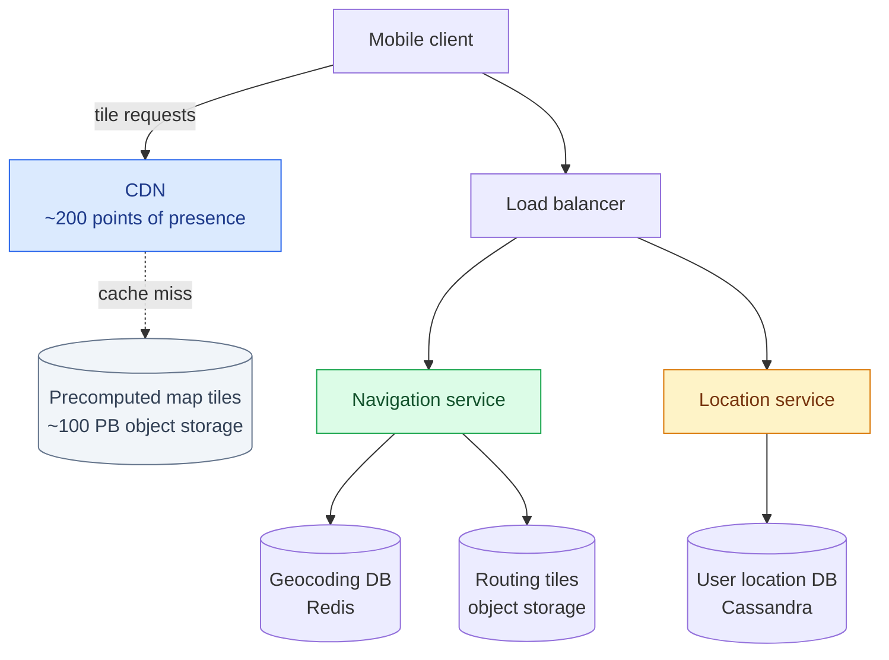
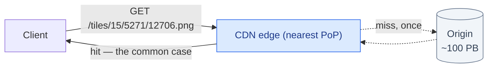
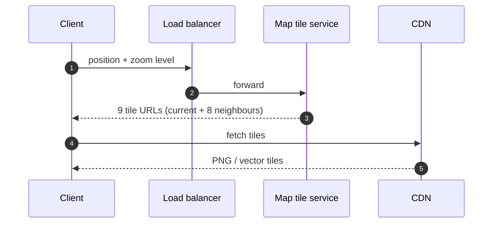
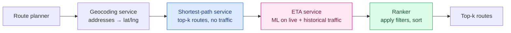
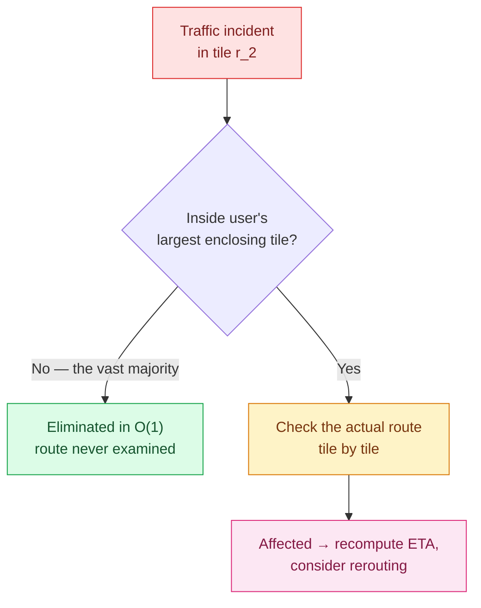
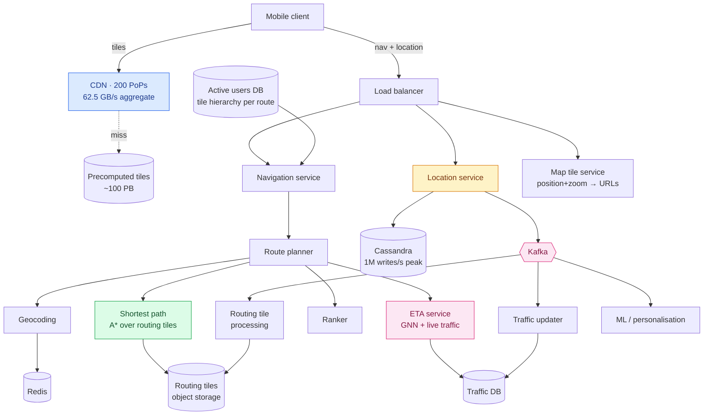

Google Maps has about **a billion daily active users**, covers 99% of the world, and takes in something like 25 million updates a day.

We're going to build a simplified version. Three features:

1. **Location updates** — the client reporting where you are
2. **Navigation** — a route from A to B, with an ETA
3. **Map rendering** — the actual map on your screen

Each one turns out to be a different kind of problem. Rendering is a **storage and CDN economics** problem. Navigation is a **graph algorithms** problem, and the graph is far too large to hold in memory. Location updates are a **write throughput** problem — a million per second at peak.

And there's a constraint running underneath all three that most system design problems don't have: **this runs on a phone, in a car, possibly on a weak signal, and it must not flatten the battery.** Every decision below is shaped by that.

---

## Map 101

Some groundwork, because the vocabulary matters.

### From a sphere to a screen

The Earth is a sphere; your screen is a rectangle. Getting from one to the other is **map projection**, and every projection distorts something — area, angle, or distance. You cannot have all three.

Web maps almost universally use **Web Mercator**. It preserves *angles*, which means shapes stay locally correct and north is always up — exactly what you want for navigation. The price is area: Greenland looks the size of Africa when it's about a fourteenth of it.

That trade is the right one here. When you're at a junction deciding whether to turn, local shape is everything and continental area is irrelevant.

### Geocoding

**Geocoding** turns an address into coordinates: "1600 Amphitheatre Parkway, Mountain View, CA" → `(37.423021, -122.083739)`. **Reverse geocoding** goes the other way, coordinates to a human-readable address.

Reads vastly outnumber writes — addresses rarely move — so this is a natural key-value store, and Redis is a reasonable choice.

### Tiling

The single most important idea in map rendering: **don't render one enormous image, cut the world into tiles.**

Each tile is a 256 × 256 pixel image. There are separate complete sets at each zoom level. The client downloads only the tiles covering its viewport at its current zoom, and stitches them together like a mosaic.

The zoom hierarchy is beautifully regular. Zoom 0 is the entire planet in one tile. Every zoom level doubles the tiles in each direction — so **four times as many tiles per level**, four times the pixels, four times the detail.

### Routing tiles — the same trick, different data

Navigation runs on a **graph**: intersections are nodes, roads are edges. Dijkstra and A\* both operate on that graph.

But their performance is brutally sensitive to graph size, and the world's road network as a single graph would not fit in memory — let alone run efficiently.

So apply the tiling idea again. Divide the world into grids, and for each grid build a small graph of the intersections and roads inside it. These are **routing tiles**, and each holds references to the tiles it connects to. The routing algorithm loads tiles on demand and stitches a larger graph together as it searches.

> Map tiles and routing tiles cover the same geography and are easy to confuse. **Map tiles are PNG images for display. Routing tiles are binary graph data for pathfinding.** Same subdivision idea, completely different payload.

### Hierarchical routing tiles

One more refinement, and it's the one that makes long-distance routing possible.

Running a route from London to Edinburgh over street-level tiles would be absurd — the graph would include every residential cul-de-sac in England. So there are **three sets of routing tiles at different levels of detail**:

- **Small tiles, local roads** — every street
- **Medium tiles, arterial roads** — the roads connecting districts
- **Large tiles, highways only** — the roads connecting cities

Crucially, there are **edges between levels**. A motorway slip road is an edge from a node in a small local tile to a node in a large highway tile. That's how the search can "get on the motorway": it climbs the hierarchy, crosses the country on a sparse graph, then descends again near the destination.

This mirrors how a person reads a map — local streets, then the motorway, then local streets again. The data structure encodes the strategy.

---

## Step 1 — Requirements and estimation

### Non-functional requirements

- **Accuracy.** Wrong directions are worse than no directions.
- **Smooth rendering.** Stutter while driving is unacceptable.
- **Minimal data and battery.** The binding constraint on mobile.
- **Availability and scalability.**

### How much storage do the map tiles need?

This is the calculation that shapes the rendering design, and it's worth doing carefully.

Google Maps uses **21 zoom levels**. At zoom 21 there are `4²¹` tiles — about **4.4 trillion**. At roughly 100 KB per compressed PNG:

```
4.4 trillion × 100 KB ≈ 440 PB
```

440 petabytes for one zoom level. That's not a storage plan, it's a reason to think again.

The saving grace: **about 90% of the Earth's surface is ocean, desert, ice and mountain** — uniform imagery that compresses extremely well. Conservatively that cuts the estimate by 80–90%, to roughly **44–88 PB**. Call it 50 PB.

Then every lower zoom level has 4× fewer tiles, so it costs a quarter as much:

```
50 + 50/4 + 50/16 + 50/64 + … = 50 × 4/3 ≈ 67 PB
```

**Around 100 PB for the complete set**, allowing for slack. The important conclusion isn't the number — it's that **the client can never hold this**, so tiles must be fetched on demand, which makes them a CDN problem.

### Play with the tile maths

The exponential blow-up is much easier to feel than to read. Drag the zoom slider:

<div class="tile-explorer" id="te"><div class="te-row"><label for="te-z">Zoom level <b><span id="te-zv">21</span></b></label><input type="range" id="te-z" min="0" max="21" value="21"></div><div class="te-grid"><div class="te-stat"><span class="te-num" id="te-count">4.4T</span><span class="te-lbl">Tiles worldwide</span></div><div class="te-stat"><span class="te-num" id="te-edge">19 m</span><span class="te-lbl">Tile edge at equator</span></div><div class="te-stat"><span class="te-num" id="te-res">7.5 cm</span><span class="te-lbl">Per pixel</span></div><div class="te-stat te-hot"><span class="te-num" id="te-size">440 PB</span><span class="te-lbl">Storage @ 100KB/tile</span></div></div><div class="te-addr"><div class="te-addr-head">TILE ADDRESS FOR A POINT</div><div class="te-fields"><div class="te-f"><label for="te-lat">Latitude</label><input type="number" id="te-lat" value="37.4220" step="0.0001" min="-85" max="85"></div><div class="te-f"><label for="te-lng">Longitude</label><input type="number" id="te-lng" value="-122.0840" step="0.0001" min="-180" max="180"></div></div><div class="te-url" id="te-url">…</div><div class="te-quad">Bing quadkey: <span id="te-qk">…</span></div></div><p class="te-note" id="te-note">Zoom 21 is the deepest level Google Maps serves.</p></div>
<script>
(function () {
  var z = document.getElementById("te-z");
  if (!z) return;
  var zv = document.getElementById("te-zv"),
      cnt = document.getElementById("te-count"),
      edge = document.getElementById("te-edge"),
      res = document.getElementById("te-res"),
      size = document.getElementById("te-size"),
      lat = document.getElementById("te-lat"),
      lng = document.getElementById("te-lng"),
      url = document.getElementById("te-url"),
      qk = document.getElementById("te-qk"),
      note = document.getElementById("te-note");
  function bignum(n) {
    if (n >= 1e12) return (n / 1e12).toFixed(1).replace(/\.0$/, "") + "T";
    if (n >= 1e9) return (n / 1e9).toFixed(1).replace(/\.0$/, "") + "B";
    if (n >= 1e6) return (n / 1e6).toFixed(1).replace(/\.0$/, "") + "M";
    if (n >= 1e3) return (n / 1e3).toFixed(0) + "K";
    return String(n);
  }
  function dist(m) {
    if (m >= 1000) return (m / 1000).toFixed(m >= 10000 ? 0 : 1) + " km";
    if (m >= 1) return m.toFixed(m >= 100 ? 0 : 1) + " m";
    return (m * 100).toFixed(1) + " cm";
  }
  function bytes(b) {
    var u = ["B", "KB", "MB", "GB", "TB", "PB"], i = 0;
    while (b >= 1000 && i < u.length - 1) { b /= 1000; i++; }
    return b.toFixed(b >= 100 || i === 0 ? 0 : 1) + " " + u[i];
  }
  function tileXY(la, ln, zoom) {
    var n = Math.pow(2, zoom);
    var x = Math.floor((ln + 180) / 360 * n);
    var r = la * Math.PI / 180;
    var y = Math.floor((1 - Math.asinh(Math.tan(r)) / Math.PI) / 2 * n);
    var max = n - 1;
    return [Math.min(Math.max(x, 0), max), Math.min(Math.max(y, 0), max)];
  }
  function quadkey(x, y, zoom) {
    var s = "";
    for (var i = zoom; i > 0; i--) {
      var d = 0, mask = 1 << (i - 1);
      if ((x & mask) !== 0) d += 1;
      if ((y & mask) !== 0) d += 2;
      s += d;
    }
    return s || "(root)";
  }
  function render() {
    var Z = +z.value;
    zv.textContent = Z;
    var tiles = Math.pow(4, Z);
    var mpp = 156543.03392 / Math.pow(2, Z);
    cnt.textContent = Z === 0 ? "1" : bignum(tiles);
    edge.textContent = dist(mpp * 256);
    res.textContent = dist(mpp);
    size.textContent = bytes(tiles * 100 * 1000);
    var la = parseFloat(lat.value), ln = parseFloat(lng.value);
    if (isNaN(la) || isNaN(ln) || la < -85 || la > 85 || ln < -180 || ln > 180) {
      url.textContent = "invalid coordinates"; qk.textContent = "—";
    } else {
      var t = tileXY(la, ln, Z);
      url.textContent = "/tiles/" + Z + "/" + t[0] + "/" + t[1] + ".png";
      qk.textContent = quadkey(t[0], t[1], Z);
    }
    if (Z >= 20) note.textContent = "Zoom 21 is the deepest level Google Maps serves — a tile is about the size of a bus.";
    else if (Z >= 16) note.textContent = "Street level. This is where most navigation happens.";
    else if (Z >= 10) note.textContent = "City and regional scale.";
    else if (Z >= 5) note.textContent = "Country scale.";
    else note.textContent = "Continental scale — the whole world in a handful of tiles.";
  }
  [z, lat, lng].forEach(function (e) { e.addEventListener("input", render); });
  render();
})();
</script>

Drag from 21 down to 15 and watch the storage fall from hundreds of petabytes to a hundred terabytes. **The bottom two zoom levels are essentially the entire storage bill.** That is why the compressibility of oceans matters so much — almost all the data is at maximum zoom, and most of maximum zoom is empty.

### Server throughput

**Navigation requests.** One billion DAU, ~35 minutes of navigation per user per week = 5 billion navigation-minutes per day.

**Location updates.** The naive approach sends a GPS fix every second:

```
5 billion minutes × 60 = 300 billion requests/day ≈ 3,000,000 QPS
```

Three million QPS, and every one of those requests is a radio wake-up on someone's phone.

But we don't need per-second fidelity on the server. **Buffer on the client and send a batch every 15 seconds:**

```
300 billion / 15 = 20 billion/day ≈ 200,000 QPS
Peak (5×) ≈ 1,000,000 QPS
```

**A 15× reduction from one client-side decision.** The client still records every second — the resolution isn't lost, just the round trips. And the win is bigger than the QPS number suggests: the cellular radio is one of the largest power draws on a phone, and keeping it asleep for 15 seconds at a time matters more to the user than it does to the server.

Batching can also adapt. Stuck in traffic? Slow the updates down. Nothing is changing.

---

## Step 2 — High-level design



Notice the client talks to **two different systems**. Tiles come straight from a CDN — they never touch application servers. Everything else goes through the load balancer. Separating the static bulk from the dynamic logic is the first and most important structural decision.

### Location service

Clients batch location updates and POST them every 15 seconds:

```
POST /v1/locations
  locs: JSON array of (latitude, longitude, timestamp)
```

**HTTP with keep-alive** is the right protocol here. The connection stays open across batches, so you avoid a TCP and TLS handshake every 15 seconds — which on a mobile network is both slow and expensive in power. There's no need for WebSocket: this traffic is one-directional and periodic, not conversational.

The database must absorb a million writes per second at peak, never updates them, and reads them mostly by user and time range. **Cassandra** fits precisely: `user_id` as partition key, `timestamp` as clustering key, so one user's trail lands together, sorted.

Location data is also more valuable than it first appears. It becomes live traffic, detects new and closed roads, and feeds ETA prediction — so it goes into **Kafka** as well as the database, and several downstream services consume that stream.

### Navigation service

```
GET /v1/nav?origin=1355+Market+St,SF&destination=Disneyland
```

Latency tolerance is moderate — a second is fine — but **accuracy is critical**. A route that's 30 seconds slower is fine; a route down a closed road is not.

### Map rendering: build tiles or precompute them?

**Option 1: generate tiles on the fly** from the client's position and zoom.

This fails on two counts. The server cluster would carry an enormous rendering load, and — worse — since every request is for a slightly different image, **nothing is cacheable**. You would be recomputing near-identical images forever.

**Option 2: precompute a fixed set of static tiles** on a fixed grid at each zoom level.

This is obviously right, and the reason is worth stating explicitly: **static content can be cached; dynamic content cannot.** By fixing the grid, we convert an infinite space of possible images into a finite set of files — and a finite set of files is a CDN's entire reason for existing.



Tiles are perfect CDN content: static, immutable, small, and requested by huge numbers of people in the same city. The first person to drive through a neighbourhood warms the cache for everyone after them.

### The CDN economics

Worth computing, because at this scale bandwidth *is* the architecture.

At 30 km/h and a zoom where each tile covers roughly 200 m × 200 m, a 1 km² area needs 25 tiles ≈ 2.5 MB. So:

```
30 km/h × 2.5 MB/km² ≈ 75 MB/hour ≈ 1.25 MB/minute
```

Across 5 billion navigation-minutes a day:

```
5 billion × 1.25 MB = 6.25 billion MB/day
÷ 100,000 seconds ≈ 62,500 MB/second
```

**62.5 GB per second, sustained.** Through one origin that is impossible. Spread across **200 points of presence**, each PoP serves a few hundred megabytes per second — entirely ordinary.

**The CDN is not an optimisation here. It is the only reason the system can exist.** And that's before client-side caching, which helps enormously in practice because people drive the same routes every day.

### How does the client know the tile URL?

The client has a latitude, longitude and zoom. It needs a URL. Two options, and the trade-off is a good one.

**Compute it on the client.** Fast, no round trip. But the algorithm is then **hardcoded into every app on every platform**, and shipping a change to mobile clients is slow and irreversible — old versions live in the wild for years. If you ever need to change the tile addressing scheme, you can't.

**Ask a tile service.** One extra call: the client sends position and zoom, and gets back nine URLs (the current tile and its eight neighbours) which it then fetches from the CDN.

That extra hop buys **operational freedom**: the addressing scheme becomes a server-side detail you can change on a Tuesday afternoon.



Nine tiles again — the same "your cell plus its eight neighbours" pattern from [the proximity service](/2026/06/design-a-proximity-service/), for the same reason: you're never neatly centred in a cell, and panning must not stall.

---

## Step 3 — Deep dive

### Where the routing tiles live

Road data arrives as terabytes of raw geographic data from various sources. It is not a graph, and routing algorithms cannot use it directly.

A periodic offline pipeline — the **routing tile processing service** — transforms it into the three-resolution tile sets. It reruns as road data changes.

Where to store the output? Not a database. You would be paying for indexes, transactions and query planning while using none of them — the access pattern is "give me this exact tile by ID."

Instead: **serialise the adjacency lists to binary files and put them in object storage**, keyed by tile ID, cached aggressively in the routing service's memory. Object storage is cheap, effectively infinite, and perfectly suited to immutable blobs fetched by key.

> Reach for a database when you need what a database does — queries, transactions, indexes. When you need "store this blob, give it back by name," object storage is cheaper and simpler. This same reasoning appears in [Design YouTube](/2026/06/design-youtube/) for video segments.

### The navigation pipeline



The separation is the clever part. **The shortest-path service ignores traffic entirely.**

That looks wrong at first — surely traffic matters? It does, but not *here*. Road geometry changes almost never, so paths computed from geometry alone are **highly cacheable**. Traffic changes constantly and would invalidate that cache every few minutes.

So: compute several candidate paths from the static graph, then score each with live traffic in a separate stage. The expensive graph search is cached; only the cheap scoring is recomputed.

**Separating the slow-changing part from the fast-changing part is how you make an expensive computation cacheable.** It's the same instinct as separating static tiles from dynamic requests, one layer down.

### The shortest-path search

The algorithm — a variation of A\* — works like this:

1. Convert origin and destination to tile IDs.
2. Load the origin routing tile from object storage (or local cache).
3. Traverse the graph, **hydrating neighbouring tiles on demand** as the search frontier expands.
4. Follow cross-level edges to climb into coarser tiles — this is how the search "gets on the motorway" instead of crawling street by street.
5. Continue until a set of good routes is found.

The memory advantage is the whole point: **only the tiles the search actually touches are ever loaded.** A route across the country loads a corridor of tiles, not a continent.

### Adaptive ETA and rerouting

Now the hard part, and the best piece of algorithmic thinking in the whole design.

Traffic changes. Millions of people are mid-journey. When an incident occurs in one routing tile, **which of those millions are affected?**

**The naive approach:** store each user's full route as a list of tiles, and on every incident scan every row.

```
user_1: r_1, r_2, r_3, …, r_k
user_2: r_4, r_6, r_9, …, r_n
```

With `n` users and average route length `m`, that's **O(n × m)** per incident. With millions of active routes and constant traffic changes, hopeless.

**The better approach** uses the tile hierarchy we already built. For each navigating user, store not just their current tile but **the chain of ever-larger enclosing tiles**, up to the one large enough to contain both origin and destination:

```
user_1, r_1, super(r_1), super(super(r_1)), …
```

Now checking whether a user could be affected is a **containment test against one entry** — the largest tile in their chain. If the incident isn't inside that tile, this user cannot possibly be affected, and you've eliminated them without looking at their route at all.



**A hierarchy built for one purpose — bounding memory during pathfinding — turns out to answer a completely different question.** Reusing an existing structure rather than adding a second index is usually the better move: one thing to build, one thing to keep correct.

The reverse case is subtler. If a jam **clears**, how does anyone find out? Their current route still works, so nothing triggers. The answer is to keep several candidate routes per user and periodically re-score them, notifying the user when a better one appears.

### Pushing updates to the client

The server must push reroutes to the client. Four candidates:

| Option | Verdict |
|---|---|
| **Mobile push notification** | No. iOS caps the payload at 4,096 bytes, and it doesn't work on the web. |
| **Long polling** | Works, but holds a server connection per client with far more overhead than the alternatives. |
| **Server-Sent Events** | Genuinely viable — lightweight, and updates are naturally server-to-client. |
| **WebSocket** | Chosen, because features like last-mile delivery need genuine bidirectional communication. |

SSE is the closer call than the table suggests. It's simpler, it reconnects automatically, and it fits a pure server-push pattern. WebSocket wins only if you need the return channel — so **the decision hinges on whether the client ever needs to say something urgent mid-route.** [The chat system chapter](/2026/06/design-chat-system/) makes the same choice for a much clearer reason.

### Vector tiles

The last rendering improvement is significant enough that it has since become the default.

Instead of shipping **rasterised PNGs**, ship **vector data** — paths and polygons — and let the client draw them with WebGL.

Two wins:

**Compression.** Vector data compresses far better than images. On a metered mobile connection this is the whole ball game.

**Zooming.** With raster tiles, zooming between levels is a blurry stretch until the new tile set arrives. With vectors, the client re-renders at any scale, continuously and sharply. Text stays crisp and correctly sized at every zoom, because it's drawn rather than baked in.

There's a third benefit that usually goes unmentioned: **the client can restyle without new downloads.** Dark mode, a different colour scheme, hiding a layer — all local rendering changes on data you already have. With raster tiles, every style is a complete second copy of the planet.

---

## What has changed, and one correction

### The tile URL is not a geohash

The obvious way to address a tile — and the one you will see suggested — is by geohash: `cdn.map-provider.com/tiles/9q9hvu.png`.

**No major map provider does this.** The universal convention — Google, OpenStreetMap, Mapbox, Apple — is the **slippy map** scheme:

```
/tiles/{z}/{x}/{y}.png
```

`z` is the zoom level; `x` and `y` are integer tile coordinates in Web Mercator. (The explorer above shows the real address for any point.) Microsoft Bing uses **quadkeys**, which interleave x and y into a single string — one character per zoom level, so the string length *is* the zoom.

Geohash and quadkeys are close cousins — both interleave coordinate bits — but geohash divides an *equirectangular* projection, while map tiles divide *Web Mercator*. They are different grids over different projections, so a geohash cell and a map tile do not correspond.

The principle is right: a tile ID is computed from position and zoom. The scheme is simply not geohash, and if you say "geohash tile URL" to someone who has worked on maps, it will land oddly.

### Production routers don't use plain A\*

Routing is usually described as "a variation of Dijkstra's or A\*", which was true in the 2000s. Modern engines mostly use **preprocessing-based** methods that are dramatically faster.

**Contraction Hierarchies** is the best known. It preprocesses the road network by repeatedly removing less important nodes and inserting **shortcut edges** that preserve the shortest distances between the nodes that remain. Queries then search a much smaller graph. The result: **OSRM answers continent-scale queries in under a millisecond** — a scale of speed plain A\* does not reach.

The trade-off is that preprocessing takes hours and must be redone when the network or its cost model changes — which is exactly why traffic isn't in the shortest-path stage. Valhalla, by contrast, keeps a **tiled bidirectional A\***, much closer to the design here, precisely because tiles are easier to update incrementally.

So the tiled architecture above is a real one, just not the fastest one — and the reason to prefer it is update flexibility, which is worth saying out loud.

### ETA is a graph neural network now

ETA prediction is usually waved through as "machine learning". The detail is interesting.

Google DeepMind's production system divides road networks into **Supersegments** — chains of adjacent road segments that share traffic volume — and models each as a graph, with segments as nodes and edges where segments connect. A **graph neural network** then predicts travel time.

The published result: Google Maps ETAs were already accurate for **over 97% of trips**, and the GNN cut the remaining error **by up to 50%** in cities including Berlin, Jakarta, São Paulo, Sydney, Tokyo and Washington D.C.

Note what that says about the problem. The last 3% is where all the difficulty lives, and closing half of it took a fundamentally different model class. **"Use ML for the ETA" is an answer that conceals most of the work.**

### Vector tiles won

Vector tiles are often framed as a "potential improvement." They are now standard. The **Mapbox Vector Tile specification** encodes tiles as protocol buffers, and it's the de facto interchange format across the industry, rendered by WebGL clients.

If you were building this today you would start with vector tiles and treat raster as the fallback for old clients.

---

## Final design



---

## What to take away

**One subdivision idea, three jobs.** Map tiles bound *bandwidth*. Routing tiles bound *memory*. The tile hierarchy also answers "who is affected by this incident" in constant time for most users. Finding a decomposition that serves several purposes is worth far more than finding three separate optimisations.

**Static content is cacheable; dynamic content is not.** Precomputing tiles on a fixed grid turned an infinite space of images into a finite set of files, which is what makes a CDN possible. The same reasoning splits the navigation pipeline: geometry is slow-changing and cached, traffic is fast-changing and applied afterwards.

**Batching on the client cut write load 15×.** No server change, no protocol change, no loss of resolution — the client still samples every second. On mobile, the radio is the expensive part, and the user benefits more than the backend does.

**Compute all the numbers, then look at which one is impossible.** 440 PB for one zoom level said "the client cannot hold this." 62.5 GB/s said "one origin cannot serve this." Both conclusions came from arithmetic, before any architecture existed.

**Reuse the structure you already have.** Adaptive rerouting needed a way to filter millions of routes fast. Rather than build a second index, it reused the routing tile hierarchy built for pathfinding. One structure to maintain instead of two that must agree.

---

## References and Further Reading

**Maps and projections**

<ul>
<li><a href="https://en.wikipedia.org/wiki/Web_Mercator_projection">Web Mercator</a> · <a href="https://en.wikipedia.org/wiki/Mercator_projection">Mercator</a> · <a href="https://en.wikipedia.org/wiki/Winkel_tripel_projection">Winkel tripel</a> · <a href="https://en.wikipedia.org/wiki/Gall%E2%80%93Peters_projection">Gall–Peters</a></li>
<li><a href="https://wiki.openstreetmap.org/wiki/Slippy_map_tilenames">Slippy map tilenames</a> — the real {z}/{x}/{y} scheme, with conversion formulas</li>
<li><a href="https://en.wikipedia.org/wiki/Address_geocoding">Address geocoding</a></li>
<li><a href="https://medium.com/google-design/google-maps-cb0326d165f5">Prototyping a Smoother Map</a> — Google Design on tile rendering</li>
</ul>

**Routing algorithms**

<ul>
<li><a href="https://en.wikipedia.org/wiki/Contraction_hierarchies">Contraction hierarchies</a> — what production routers actually use</li>
<li><a href="https://valhalla.github.io/valhalla/mjolnir/why_tiles/">Why tiles?</a> — Valhalla's own argument for tiled routing</li>
<li><a href="https://valhalla.github.io/valhalla/thor/path-algorithm/">Valhalla path algorithms</a> · <a href="https://wiki.openstreetmap.org/wiki/Open_Source_Routing_Machine">OSRM</a></li>
<li><a href="https://en.wikipedia.org/wiki/A*_search_algorithm">A* search</a> · <a href="https://en.wikipedia.org/wiki/Adjacency_list">Adjacency lists</a></li>
</ul>

**ETA prediction**

<ul>
<li><a href="https://deepmind.google/blog/traffic-prediction-with-advanced-graph-neural-networks/">Traffic prediction with advanced Graph Neural Networks</a> — DeepMind on Supersegments</li>
<li><a href="https://blog.google/products/maps/google-maps-101-how-ai-helps-predict-traffic-and-determine-routes/">How AI helps predict traffic and determine routes</a> — Google</li>
</ul>

**Tiles and rendering**

<ul>
<li><a href="https://mapbox.github.io/vector-tile-spec/">Mapbox Vector Tile specification</a> — the de facto vector tile format</li>
<li><a href="https://docs.mapbox.com/data/tilesets/guides/vector-tiles-introduction/">Vector tiles introduction</a></li>
<li><a href="https://developers.google.com/maps/documentation/directions/start">Google Directions API</a></li>
</ul>

**In this series**

<ul>
<li><a href="/guide/">The complete guide</a> — every article in order</li>
<li><a href="/2026/06/design-a-proximity-service/">Design a Proximity Service</a> — geohash, quadtrees and the nine-cell pattern</li>
<li><a href="/2026/06/design-nearby-friends/">Design Nearby Friends</a> — the same location data, moving in real time</li>
<li><a href="/2026/06/design-youtube/">Design YouTube</a> — the other design where CDN economics decide everything</li>
</ul>
