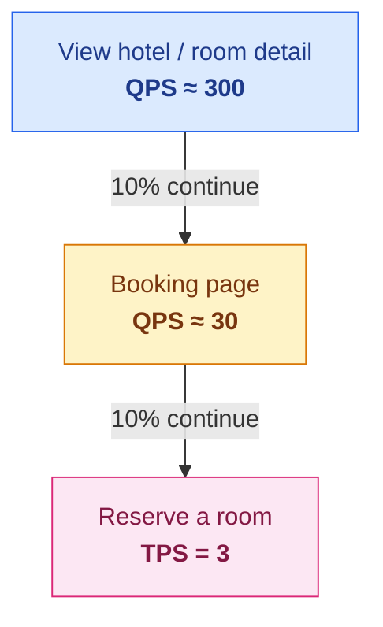
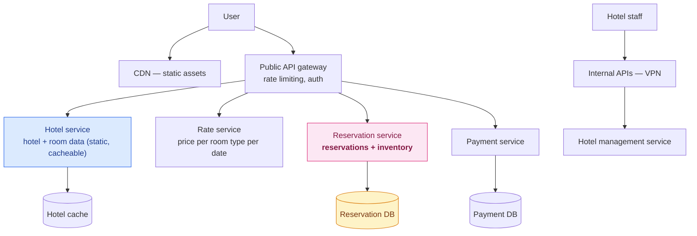
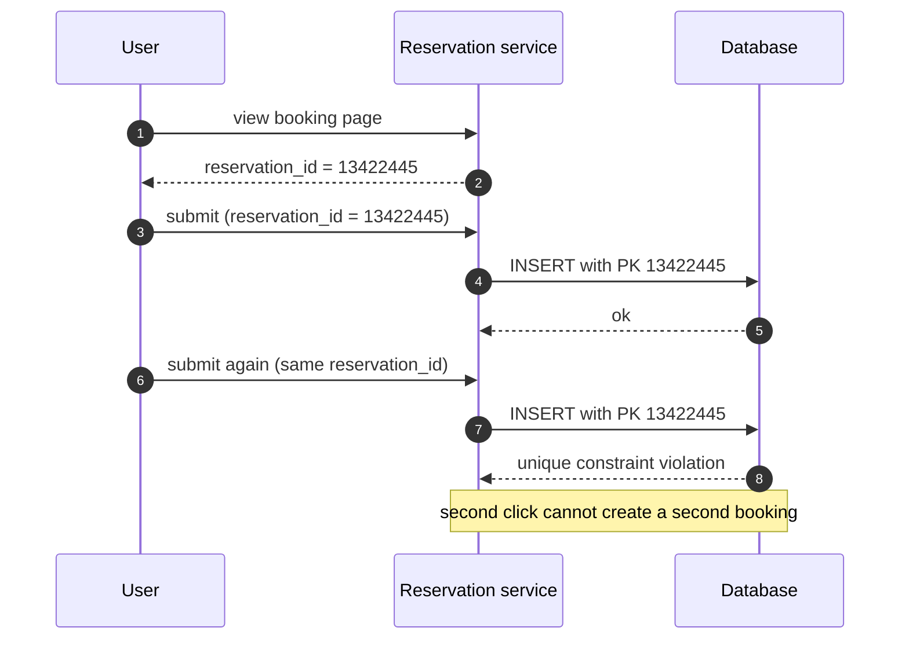
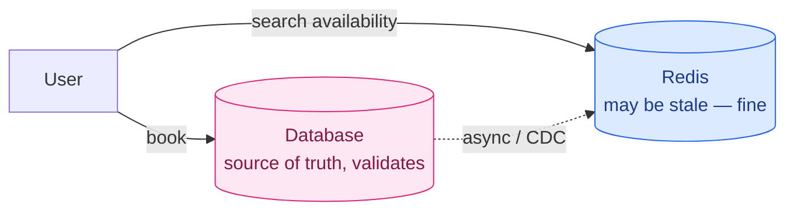

Here is the entire scale of this system:

```
5,000 hotels · 1 million rooms
240,000 reservations per day
= 3 reservations per second
```

**Three per second.** A Raspberry Pi could serve that. Every other design in this series has been about surviving volume — 13 million messages a second, 50,000 clicks a second, 100 petabytes of map tiles. This one has none of that.

And it is arguably the hardest.

Because for the first time, **being slightly wrong is not acceptable**. A dropped metric leaves a gap in a chart. A duplicated ad click costs someone money and gets fixed at reconciliation. But selling the same hotel room to two people is a real person arriving at midnight to find no room, and there is no batch job that fixes that.

The difficulty here isn't throughput. It's that **two people can click "Book" on the last room in the same millisecond**, and the obvious code sells it to both.

---

## Step 1 — Scope

### Requirements

- Show hotel and room detail pages
- **Reserve a room**
- Admin panel for hotel staff
- **Support 10% overbooking**
- Prices change daily — a room costs different amounts on different dates

That overbooking requirement looks strange until you see the logic. Hotels deliberately sell **more rooms than they have**, because some fraction of guests always cancel or fail to show. It's a business decision to trade a rare, expensive failure for consistently higher occupancy.

For us it's a gift: it means the constraint isn't `reserved ≤ inventory` but `reserved ≤ 1.1 × inventory`. **The interesting part is that the constraint still has to be enforced exactly** — 110% is a hard limit, not a suggestion.

### Non-functional

- **High concurrency.** Popular hotels during big events have many people competing for the same room.
- **Moderate latency.** A couple of seconds to confirm a booking is fine.

Note the shape of that pair: **low throughput, high contention, relaxed latency.** That combination is unusual, and it points directly at the solution. When you only need 3 transactions a second and can afford a second of latency, you can afford a database that gives real guarantees.

### The funnel

Work backwards from the 3 TPS of actual bookings, assuming 10% of viewers advance at each step:



**Reads outnumber writes by 100 to 1**, and only the writes need to be correct. That asymmetry shapes everything: cache the reads aggressively, and spend all your care on the tiny trickle of writes.

---

## Step 2 — High-level design

### Why a relational database

For once this isn't a close call:

**Read-heavy with infrequent writes.** NoSQL stores are generally optimised for write throughput. We have almost no write throughput to optimise.

**ACID.** This is the real reason. Atomicity, consistency, isolation and durability are exactly the properties that prevent double reservations, double charges and negative inventory. **You could build those guarantees on top of a store that doesn't have them. You would be rebuilding a relational database, badly.**

**The data is genuinely relational.** Hotels have rooms; rooms have types; types have rates per date. Stable, well-understood entities with clear relationships.

### The schema mistake worth making

The obvious model has a `reservation` row pointing at a `room_id`. Natural, and it's how Airbnb works — you book a *specific listing*.

**Hotels don't work that way.** You reserve a *king room*, not room 412. The actual room number is assigned at check-in. A guest who booked three weeks ago has no room until they walk up to the desk.

So the model needs a `room_type_inventory` table with **one row per hotel, room type, and date**:

| hotel_id | room_type_id | date | total_inventory | total_reserved |
|---|---|---|---|---|
| 211 | 1001 | 2026-06-01 | 100 | 80 |
| 211 | 1001 | 2026-06-02 | 100 | 82 |
| 211 | 1001 | 2026-06-03 | 100 | 100 |

A row per date looks wasteful. It is exactly right, because **every question this system asks is per-date**: is this room type available on each night of a stay? With one row per night, a date-range query is a simple `BETWEEN`, and the availability check is a scan of a handful of rows.

The volume is trivial:

```
5,000 hotels × 20 room types × 2 years × 365 days = 73 million rows
```

**73 million rows is a small table.** One database holds it comfortably — you replicate for availability, not for capacity. A scheduled daily job extends the horizon as dates advance.

And overbooking becomes a one-character change:

```sql
-- exact
if (total_reserved + rooms_wanted <= total_inventory)
-- with 10% overbooking
if (total_reserved + rooms_wanted <= 1.1 * total_inventory)
```

**Modelling data around the questions you'll ask beats modelling it around the objects that exist.** A row per room-type-per-night is not how a hotel thinks about itself, and it's exactly how the queries think.

### Services



One detail in there is deliberate and we'll return to it: **the reservation service owns both reservations and inventory**, in the same database. A microservice purist would split them. There's a good reason not to.

---

## The actual problem: double booking

Two failure modes, and they need different fixes.

### Failure 1: the user clicks twice

Impatient user, slow network, two identical reservations.

**Client-side fix?** Grey out the button after submit. This helps and is not a solution — you cannot trust a client you don't control.

**The real fix: an idempotency key.** Generate a `reservation_id` when the user reaches the confirmation page, before they click anything. Send it with the booking request. Make it the **primary key** of the reservation table.

Now the second click tries to insert a row with a primary key that already exists, and **the database's unique constraint rejects it**. Not application logic that might have a gap — a structural guarantee.



**The elegance is in generating the ID before the action, not after.** An ID assigned by the server on success can't deduplicate anything, because a retry has no ID to reuse.

### Failure 2: two users, one room

The hard one.

Ninety-nine of a hundred rooms are booked. Two people click "Book" simultaneously:

| | User 1 | User 2 |
|---|---|---|
| 1 | | reads: 99 reserved — 1 available ✓ |
| 2 | reads: 99 reserved — 1 available ✓ | |
| 3 | writes: reserved = 100 | |
| 4 | | writes: reserved = 100 |
| 5 | commits | |
| 6 | | commits |

Both checks passed. Both bookings committed. **The hotel has sold 101 rooms out of 100.**

Nothing here is a bug in the usual sense. Each transaction did exactly what it was told. The problem is the **gap between reading a value and writing based on it** — during which someone else read the same value.

### Break it yourself

Below is that exact scenario. Pick a strategy, set how many people are competing for the last room, and see what the hotel actually sells:

<div class="race-sim" id="rs"><div class="rs-label">STRATEGY</div><div class="rs-opts" id="rs-opts"><button data-v="none" class="on">No locking</button><button data-v="pess">Pessimistic</button><button data-v="opt">Optimistic</button><button data-v="constraint">DB constraint</button><button data-v="atomic">Atomic UPDATE</button></div><div class="rs-row"><label for="rs-n">People clicking at once, for <b>1</b> remaining room: <b><span id="rs-nv">5</span></b></label><input type="range" id="rs-n" min="2" max="40" value="5"></div><div class="rs-grid"><div class="rs-stat"><span class="rs-num" id="rs-sold">—</span><span class="rs-lbl">Rooms sold</span></div><div class="rs-stat"><span class="rs-num" id="rs-over">—</span><span class="rs-lbl">Oversold by</span></div><div class="rs-stat"><span class="rs-num" id="rs-trips">—</span><span class="rs-lbl">DB round trips</span></div></div><div class="rs-verdict" id="rs-verdict">—</div><p class="rs-note" id="rs-note"></p></div>
<script>
(function () {
  var root = document.getElementById("rs");
  if (!root) return;
  var strat = "none";
  var n = document.getElementById("rs-n"),
      nv = document.getElementById("rs-nv"),
      sold = document.getElementById("rs-sold"),
      over = document.getElementById("rs-over"),
      trips = document.getElementById("rs-trips"),
      verdict = document.getElementById("rs-verdict"),
      note = document.getElementById("rs-note");
  var info = {
    none: {
      calc: function (N) { return { sold: N, trips: 2 * N }; },
      bad: true,
      v: "OVERSOLD — the room is sold to everyone who clicked",
      t: "Every request reads 99 before any of them writes, so every check passes. This is the default behaviour of read-then-write code, and it is wrong at any level of contention above one."
    },
    pess: {
      calc: function (N) { return { sold: 1, trips: 2 * N }; },
      bad: false,
      v: "Correct — but every request queues",
      t: "SELECT ... FOR UPDATE locks the row, so requests are serialised. Correct, and the last person in the queue waits for everyone ahead of them. Long transactions holding locks is how a booking system stalls under load, and multiple locks invite deadlocks."
    },
    opt: {
      calc: function (N) { return { sold: 1, trips: 3 * N - 1 }; },
      bad: false,
      v: "Correct — at the cost of retries",
      t: "Everyone reads the same version number, one write wins, and the rest fail a version check and retry. Correct, and the retry storm grows with contention: at high concurrency almost every user does the work twice to be told no."
    },
    constraint: {
      calc: function (N) { return { sold: 1, trips: 2 * N }; },
      bad: false,
      v: "Correct — enforced by the database itself",
      t: "A CHECK constraint on (total_inventory - total_reserved >= 0) makes overselling structurally impossible. Simple and robust, though constraints are awkward to version-control and do not port cleanly between databases."
    },
    atomic: {
      calc: function (N) { return { sold: 1, trips: N }; },
      bad: false,
      v: "Correct — and one round trip each",
      t: "Put the condition inside the UPDATE, then check how many rows changed. The database takes a row lock and re-evaluates the WHERE clause under it, so the read and the write can never be separated. No version column, no explicit lock, no retry."
    }
  };
  function render() {
    var N = +n.value;
    nv.textContent = N;
    var s = info[strat], r = s.calc(N);
    sold.textContent = r.sold;
    over.textContent = (r.sold - 1) > 0 ? "+" + (r.sold - 1) : "0";
    trips.textContent = r.trips;
    verdict.textContent = s.v;
    verdict.className = "rs-verdict " + (s.bad ? "rs-bad" : "rs-ok");
    note.textContent = s.t;
    over.parentNode.className = "rs-stat" + (s.bad ? " rs-hot" : "");
  }
  var btns = root.querySelectorAll("#rs-opts button");
  for (var i = 0; i < btns.length; i++) {
    btns[i].addEventListener("click", function () {
      for (var k = 0; k < btns.length; k++) btns[k].classList.remove("on");
      this.classList.add("on");
      strat = this.getAttribute("data-v");
      render();
    });
  }
  n.addEventListener("input", render);
  render();
})();
</script>

With **no locking**, the oversell scales directly with contention — 40 people clicking means 40 rooms sold. Every other strategy sells exactly one. What separates them is **what correctness costs**.

---

## The three textbook options

### Pessimistic locking

Lock the row the moment anyone touches it. In MySQL, `SELECT ... FOR UPDATE`. Everyone else waits.

**It works, and it doesn't scale.** Transactions serialise, so the last person in a queue of forty waits for thirty-nine. Hold locks across several rows and you invite deadlocks, which are genuinely difficult to write around.

**Not recommended here.** The cost is real and there are cheaper correct answers.

### Optimistic locking

Add a `version` column. Read it, and on write require that the version is still what you read. If someone else got there first, the version moved and your write is rejected — so you retry.

**Faster when conflicts are rare**, because nothing is ever locked. But when many people want the same room, everyone reads the same version, one wins, and everyone else retries — only to fail again on the next round.

Still, **contention here is low.** Three bookings a second across five thousand hotels means genuine collisions are rare. Optimistic locking is a good fit.

### Database constraints

```sql
CONSTRAINT check_room_count CHECK (total_inventory - total_reserved >= 0)
```

Now overselling is **impossible by construction**. Any transaction that would break the invariant is rejected by the database.

Simple and robust. Two caveats: constraints don't version-control alongside application code, and they don't port cleanly between database engines.

---

## The option that usually gets left out

All three options above are about managing the gap between the read and the write.

**There's a fourth approach: don't have a gap.**

```sql
UPDATE room_type_inventory
SET    total_reserved = total_reserved + :rooms
WHERE  hotel_id     = :hotel
  AND  room_type_id = :room_type
  AND  date BETWEEN :start AND :end
  AND  total_reserved + :rooms <= 1.1 * total_inventory;
```

Then check the **affected row count**. If it equals the number of nights, the booking succeeded. If it's less, someone else took the last room and you tell the user so.

This works because of how `UPDATE` executes: the database takes a **row lock and re-evaluates the `WHERE` clause while holding it**. The check and the increment happen inside one statement, under one lock, and **no other transaction can slip between them because there is no between.**

Compare what each approach needs:

| | Extra column | Explicit lock | Retry loop | Round trips |
|---|---|---|---|---|
| Pessimistic | — | ✓ | — | 2 per request |
| Optimistic | ✓ `version` | — | ✓ | up to 3 per request |
| DB constraint | — | — | — | 2 per request |
| **Atomic UPDATE** | — | — | — | **1 per request** |

**When a read-then-write race appears, the first question should be whether the whole operation can be expressed as one statement.** Very often it can, and then there is no race to manage. Locking strategies are for when it genuinely can't — when real business logic has to happen between reading and writing.

The three textbook options are all correct. This one is simpler than all of them, and it's what most production inventory systems actually do.

---

## Scaling, if you ever need to

At 3 TPS you don't. But if this were Booking.com rather than one hotel chain, QPS could be a thousand times higher.

**The services are stateless** and scale by adding machines. The database holds all the state.

**Shard by `hotel_id`.** Nearly every query filters by hotel first, so it's the natural key — and unlike `ad_id` in [the click aggregation chapter](/2026/06/design-ad-click-aggregation/), hotel traffic is far less skewed. At 30,000 QPS across 16 shards, each handles under 2,000 — comfortable for a single MySQL instance.

**Archive old reservations.** Only current and future bookings are queried regularly. History moves to cold storage.

### Caching, and an inconsistency that doesn't matter

Reads outnumber writes 100:1, so put Redis in front:

```
key:   hotelID_roomTypeID_date
value: number of available rooms
```

Inventory data has a natural expiry — nobody books last year — so TTL and LRU eviction fit perfectly.

Writes go to the database first, then propagate to the cache asynchronously (via application code or change data capture with something like Debezium). Which means **the cache is sometimes wrong**.

Normally that would be alarming. Here it genuinely doesn't matter, and the reason is worth internalising:

**The cache serves availability *searches*. The database validates the *booking*.**

If the cache says a room is free when it isn't, the user tries to book, the database rejects it, and they see "someone just booked the last room" — which is *true*, and a message every traveller has seen. If the cache says full when a room is free, they miss an opportunity that a refresh will reveal.

**A stale cache in front of an authoritative check is not a correctness problem, it's a UX detail.** What would be fatal is caching the *decision* rather than the *hint*.



---

## Consistency across services

Now the deliberate choice from earlier.

In a **monolith**, reserving a room and decrementing inventory happen in one transaction. ACID does the work.

In a **pure microservice architecture**, each service owns its database — so those become two transactions in two databases, and if the second fails you must undo the first. One happy path, many failure paths.

The industry answers are known and both expensive:

**Two-phase commit** guarantees atomicity across nodes, and blocks: a single failed participant halts progress until it recovers.

**Saga** is a sequence of local transactions, each publishing an event that triggers the next, with **compensating transactions** to unwind when a step fails. Eventual consistency instead of atomicity — and you now write and test every compensation path.

**The design deliberately declines both.** Reservations and inventory live in one service, in one database, so a single ACID transaction covers the operation that must be atomic.

That is the right call, and worth stating plainly: **"each service owns its own database" is a good default, not a law.** When two pieces of state must change atomically, putting them in one database is not a failure of purity — it's choosing a real guarantee over an architectural aesthetic. The complexity of Saga is justified when services genuinely must be independent. Splitting reservations from inventory buys nothing and costs a great deal.

---

## What has changed, and what's worth adding

### Isolation levels are the missing context

The race above quietly assumes the isolation level is not serializable. That assumption is doing a lot of work.

The race above is a **lost update** — two transactions read the same value and both write based on it. Whether it's possible depends on isolation level:

- **Read Committed** (PostgreSQL's default) — the race happens.
- **Repeatable Read** (MySQL InnoDB's default) — reads are stable, but the write still overwrites.
- **Serializable** — the race is prevented; PostgreSQL's Serializable Snapshot Isolation detects the conflict and aborts one transaction.

So there's a fifth option: **turn the isolation level up.** It's correct, and it's a blunt instrument — serializable applies to every transaction, including the many that don't need it, and it moves your retry problem from one query into your whole application.

**Knowing your isolation level is a prerequisite for reasoning about any of this.** The same code is correct on one database and wrong on another.

### The outbox pattern

If you *do* need to publish an event when a reservation is made — to notify a payment service or an analytics pipeline — you hit the **dual-write problem**: writing to your database and publishing to a broker are two operations that can disagree. The database commits and the publish fails, so the event is lost; or the publish succeeds and the transaction rolls back, so consumers see a booking that doesn't exist.

The **transactional outbox** solves it neatly: write the event to an `outbox` table **in the same transaction as the business data**. Because they commit together, they cannot disagree. A separate process reads the outbox and forwards to the broker — most cleanly by **change data capture** tailing the write-ahead log rather than polling.

It's the same instinct as the atomic UPDATE above: **when two things must agree, put them in one transaction rather than trying to sequence them correctly.**

### Idempotency keys are now standard practice

The `reservation_id` trick above is now an industry convention. Stripe's `Idempotency-Key` header is the reference implementation, and the pattern is the same: the client generates a key, the server stores the result against it, and a repeat with the same key returns the original result rather than performing the action twice.

Worth noting a subtlety that is easy to skip: **a primary-key collision tells you the request is a duplicate but not what happened the first time.** A production implementation stores the *response* against the key, so a retry gets the original confirmation number instead of an error.

---

## What to take away

**Scale and difficulty are not the same thing.** Three transactions a second, and it's the hardest problem in the series — because correctness under concurrency doesn't get easier when traffic is low. It only gets rarer, and therefore harder to catch in testing.

**Every read-then-write is a race waiting to happen.** The gap between checking and acting is where two users both see the last room. Before reaching for a locking strategy, ask whether the operation can be one statement — very often it can.

**Generate idempotency keys before the action, not after.** A server-assigned ID can't deduplicate a retry, because the retry has no ID to present.

**Model the data around the questions, not the objects.** A row per room-type-per-night isn't how a hotel describes itself, and it's exactly how every query wants the data.

**Stale caches are fine in front of an authoritative check.** Cache the hint, never the decision. The failure mode becomes "someone just booked that" — a true statement — rather than a double booking.

**"Each service owns its data" is a default, not a law.** When two pieces of state must change atomically, one database and one transaction beats Saga and its compensation paths. Purity is not a guarantee.

---

## References and Further Reading

**Concurrency and transactions**

<ul>
<li><a href="https://en.wikipedia.org/wiki/Isolation_(database_systems)">Isolation levels</a> — read committed, repeatable read, serializable</li>
<li><a href="https://www.postgresql.org/docs/current/transaction-iso.html">PostgreSQL transaction isolation</a> — including Serializable Snapshot Isolation</li>
<li><a href="https://dev.mysql.com/doc/refman/8.0/en/innodb-locking-reads.html">MySQL locking reads</a> — SELECT ... FOR UPDATE and FOR SHARE</li>
<li><a href="https://en.wikipedia.org/wiki/Optimistic_concurrency_control">Optimistic concurrency control</a> · <a href="https://en.wikipedia.org/wiki/Record_locking">Pessimistic locking</a></li>
<li><a href="https://blog.pjam.me/posts/atomic-operations-in-sql/">Atomic increment and decrement in SQL</a> — the single-statement approach, in depth</li>
<li><a href="https://dataintensive.net/">Designing Data-Intensive Applications</a> — Chapter 7 on transactions and write skew</li>
</ul>

**Distributed transactions**

<ul>
<li><a href="https://microservices.io/patterns/data/saga.html">The Saga pattern</a> · <a href="https://en.wikipedia.org/wiki/Two-phase_commit_protocol">Two-phase commit</a></li>
<li><a href="https://microservices.io/patterns/data/transactional-outbox.html">The transactional outbox pattern</a> · <a href="https://docs.aws.amazon.com/prescriptive-guidance/latest/cloud-design-patterns/transactional-outbox.html">AWS prescriptive guidance</a></li>
<li><a href="https://debezium.io/">Debezium</a> — change data capture</li>
<li><a href="https://developers.redhat.com/articles/2021/09/21/distributed-transaction-patterns-microservices-compared">Five patterns for dual writes</a> — Red Hat</li>
</ul>

**APIs and idempotency**

<ul>
<li><a href="https://docs.stripe.com/api/idempotent_requests">Stripe idempotent requests</a> — the reference implementation</li>
<li><a href="https://grpc.io/">gRPC</a> — inter-service communication</li>
<li><a href="https://microservices.io/">microservices.io</a> — the pattern catalogue</li>
</ul>

**In this series**

<ul>
<li><a href="/guide/">The complete guide</a> — every article in order</li>
<li><a href="/2026/05/design-a-key-value-store/">Design a Key-Value Store</a> — consistency from the other direction</li>
<li><a href="/2026/06/design-ad-click-aggregation/">Ad Click Event Aggregation</a> — exactly-once as a transaction boundary</li>
<li><a href="/2026/05/design-unique-id-generator/">Design a Unique ID Generator</a> — where reservation IDs come from</li>
</ul>
