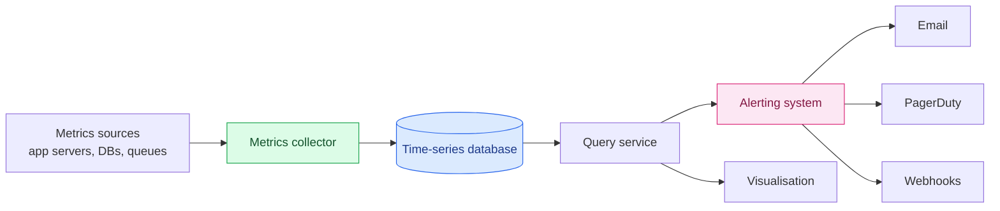
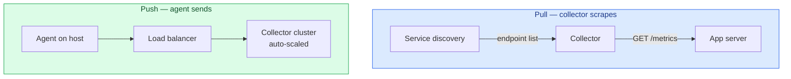
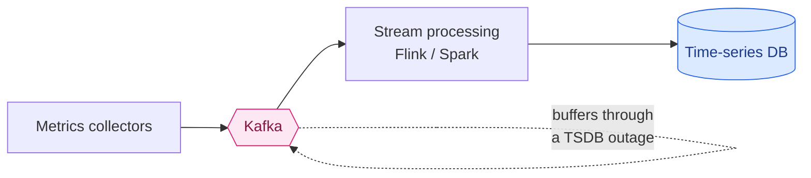
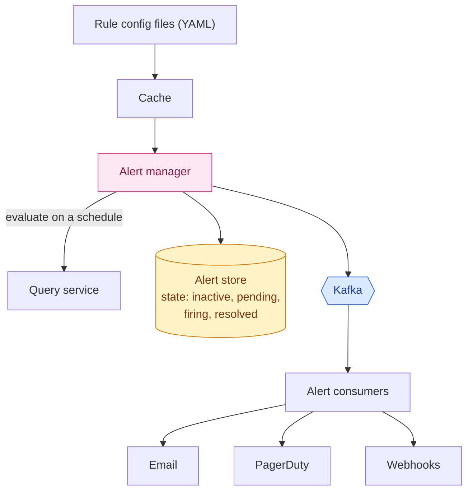

Monitoring is the system that tells you every *other* system is broken. Which means when it fails, it fails at exactly the moment you need it — and it fails silently, because the thing that would have told you is the thing that's down.

We're building an internal metrics platform: **1,000 server pools, 100 machines per pool, 100 metrics per machine — roughly 10 million metrics**, retained for a year.

The interesting thing about this design is how much of it is an argument for **not building it**. Several components have excellent off-the-shelf answers, and a good engineer says so. But the parts you *do* have to understand — the storage engine, the collection model, and cardinality — are where monitoring systems actually die.

---

## Step 1 — Scope

### The conversation

**Who is this for?** Internal use, not a SaaS product like Datadog or Splunk.

**Which metrics?** Operational: CPU load, memory, disk usage — and higher-level ones like requests per second or pool size. **Not** business metrics.

**Retention?** One year — but with **reduced resolution over time**:

| Age | Resolution |
|---|---|
| 0–7 days | Raw |
| 7–30 days | 1 minute |
| 30 days – 1 year | 1 hour |

**Alert channels?** Email, phone, PagerDuty, and webhooks.

**Logs? Distributed tracing?** No and no — both out of scope.

That resolution ladder is worth pausing on. It encodes something true about how monitoring gets used: **nobody debugging a nine-month-old incident needs per-second data.** You need fine detail for the last few days and shape for the rest. Building that into the requirements turns a storage problem into a manageable one before any design exists.

### Non-functional requirements

- **Scalability** — metric and alert volume only grows.
- **Low latency** for dashboard and alert queries.
- **Reliability** — a missed critical alert is the whole system failing.
- **Flexibility** — the pipeline should absorb new technologies without a rewrite.

### Out of scope

**Log monitoring** (the ELK stack's territory) and **distributed tracing** (Dapper, Zipkin). Related, genuinely different problems.

---

## Step 2 — High-level design

### Five components

Every metrics system has the same five pieces:

1. **Collection** — get metrics from the sources
2. **Transmission** — move them to the system
3. **Storage** — organise and keep them
4. **Alerting** — detect problems, notify humans
5. **Visualisation** — dashboards

### The data model

Metrics are **time series**: a named sequence of values with timestamps, plus a set of labels.

```
cpu.load  host=webserver01,region=us-west  1613707265  50
cpu.load  host=webserver01,region=us-west  1613707295  62
cpu.load  host=webserver02,region=us-west  1613707265  43
```

Each series is uniquely identified by **its name plus its labels**. That last sentence is the most consequential in the whole chapter, and we'll come back to it with a calculator.

| Component | Type |
|---|---|
| Metric name | string |
| Labels/tags | list of `key:value` pairs |
| Values | array of `(value, timestamp)` |

### The access pattern

Two facts, and they point in opposite directions:

**Writes are constant and heavy.** Ten million metrics, scraped continuously, never stopping. There is no quiet period — monitoring runs at 4 a.m. exactly as hard as at peak.

**Reads are spiky.** Dashboards get opened. Alerts evaluate on a schedule. An incident starts and thirty engineers load the same dashboard at once — which is precisely when the write load is *also* elevated, because the systems being monitored are misbehaving.

**Relentless writes with bursty reads is an unusual profile, and it's what disqualifies most storage engines.**

### Why not a normal database?

**Relational.** In theory it works. In practice you'd fight it constantly.

Time-series queries map badly onto SQL. A rolling average — a completely routine thing to want from a metric — looks like this:

```sql
select id, temp, avg(temp) over (partition by group_nr order by time_read) as rolling_avg
from (
  select id, temp, time_read, interval_group,
         id - row_number() over (partition by interval_group order by time_read) as group_nr
  from (
    select id, time_read,
           'epoch'::timestamp + '900 seconds'::interval *
             (extract(epoch from time_read)::int4 / 900) as interval_group,
           temp
    from readings
  ) t1
) t2
order by time_read;
```

The same thing in Flux, a language built for this:

```
from(db:"telegraf")
  |> range(start:-1h)
  |> filter(fn: (r) => r._measurement == "foo")
  |> exponentialMovingAverage(size:-10s)
```

You'd also need an index per tag, and relational engines are poor under sustained heavy writes. At our scale you'd spend enormous effort tuning and still lose.

**NoSQL.** Cassandra or Bigtable *can* store time series — but you'd need deep knowledge of their internals to design a schema that queries efficiently. You'd be hand-building a time-series database on top of a general-purpose one.

**Which is the point.** Purpose-built time-series databases exist — InfluxDB, Prometheus, OpenTSDB, Timestream — and they handle the same volume on far fewer servers, with query languages designed for the job and **retention and downsampling built in**.

> **Recognising that a specialised tool already exists is a legitimate design decision, not a cop-out.** The skill being tested isn't "can you reinvent InfluxDB" — it's whether you understand *why* the workload needs something specialised.

### Architecture



---

## Step 3 — Deep dive

### Collection: pull or push?

The oldest argument in monitoring, and there is genuinely no winner.

**Pull.** Collectors periodically scrape a known HTTP endpoint (`/metrics`) on each service. This is Prometheus's model.

The immediate problem: the collector must know every endpoint. Hardcoding a list is untenable when servers come and go constantly. **Service discovery** — etcd, ZooKeeper — solves it: services register, and the collector is notified when the set changes.

At our scale one collector can't scrape thousands of machines, so you need a pool — and now two collectors might scrape the same target and produce duplicates. The fix is familiar: **put collectors on a consistent hash ring** and map each monitored server to exactly one collector. ([Same mechanism as Chapter 5 of Volume 1](/2026/05/design-consistent-hashing/), doing the same job.)

**Push.** An agent on each machine collects locally and pushes to the collector. This is CloudWatch and Graphite.

The agent can **pre-aggregate** — turning a minute of counter increments into one number — which cuts transmitted volume substantially. If the collector rejects a push, the agent can buffer locally and retry. Though note the trap: **in an auto-scaling group, a buffering agent on a machine about to be terminated is holding data that's about to vanish.**



The honest comparison:

| | Pull | Push |
|---|---|---|
| **Debugging** | **Wins.** `/metrics` is a URL — curl it from your laptop | Harder to inspect |
| **Health checks** | **Wins.** No response to a scrape *is* a down signal | Silence is ambiguous: dead app or dead network? |
| **Short-lived jobs** | Loses. A batch job may finish before it's scraped (pushgateways patch this) | **Wins.** The job pushes before exiting |
| **Firewalls / multi-DC** | Loses. Every endpoint must be reachable from collectors | **Wins.** Push out from anywhere |
| **Access control** | **Wins.** You scrape a configured list, so sources are authentic | Anyone can push unless you authenticate |

The health-check row is the elegant one: in a pull system, **failing to answer a scrape is itself a metric.** You get liveness free, from a mechanism you needed anyway.

**A large organisation ends up supporting both.** Serverless functions have nowhere to install an agent and may not live long enough to be scraped — that's what pushgateways are for.

### Transmission: put a queue in the middle

If the time-series database goes down, metrics collected during the outage are lost — and an outage is exactly when you most want them.

Put **Kafka** between collection and storage:



Three benefits: collection and storage are **decoupled**, Kafka absorbs bursts, and **a database outage no longer loses data** — it just delays it.

Kafka's partitioning also gives scaling levers: partition by metric name so consumers aggregate cleanly, subdivide by label, and **prioritise** — page-worthy metrics processed ahead of dashboard filler.

**But be ready to defend it.** Running production Kafka is a serious undertaking, and you've just made your monitoring system depend on a distributed system that itself needs monitoring. Facebook's **Gorilla** took the opposite route: an in-memory TSDB designed to stay available for writes through partial network failure, with no intermediate queue. Both are defensible.

### Where should aggregation happen?

Three places, three different trades:

**In the agent.** Simple aggregation only — a counter summed per minute. Cheap, reduces traffic at the source.

**In the ingestion pipeline.** Stream processing before the write. **Massively reduces write volume** since only results are stored. Two costs: late-arriving events become genuinely hard, and **you no longer have the raw data** — so a question you didn't anticipate can't be answered retroactively.

**At query time.** Aggregate raw data on read. Nothing is lost and any question is answerable, but queries are slower because they run over everything.

**This is the classic precompute-versus-query-time trade, and monitoring has an unusual twist:** the queries you most urgently need are the ones you didn't anticipate, during an incident. Aggregating away raw data optimises for the questions you already knew about.

### The query service — and the case against it

A query service in front of the TSDB decouples dashboards and alerting from the storage engine, and gives you somewhere to cache.

The book then argues against its own component, and it's right to: **most industrial visualisation and alerting tools already have first-class plugins for the popular time-series databases.** A wrapper adds a hop, a deployment, and a thing to page someone about — to abstract a database you're unlikely to swap.

### Storage: where it gets interesting

**85% of queries hit recent data.** Facebook measured it: at least 85% of all queries to their operational data store were for data from **the past 26 hours**. That single statistic justifies an entire architecture — Gorilla holds 26 hours in memory and lets an on-disk store handle the rest. Fast path for the common case, slow path for the tail.

#### Compression

The book shows **delta-of-delta** encoding for timestamps. Scrapes happen at regular intervals, so consecutive timestamps differ by almost exactly the same amount:

```
absolute:        1610087371, 1610087381, 1610087390, 1610087401
delta:           1610087371, +10, +10, +9, +11
delta-of-delta:  1610087371, 10, 0, -1, +2   ← mostly zeros
```

Ten seconds fits in **4 bits** instead of a 32-bit timestamp. In the common case the delta-of-delta is exactly **zero**, which costs a single bit.

Gorilla's other half — which the chapter omits — is **XOR compression for the values**. Consecutive readings of a metric are usually similar, and similar IEEE-754 doubles share most of their leading bits. XOR two of them and you get a value with long runs of zeros, which is cheap to encode.

Together, the published result is remarkable: **16 bytes per point down to an average of 1.37 bytes — a 12× reduction.** That's what let Facebook keep 26 hours of production monitoring data in RAM.

#### Downsampling

Compression shrinks each point. Downsampling deletes points you no longer need:

```
Raw (10s):  19, 21, 17, 24, 26, 25   →   30s rollup:  19, 25
```

Retention becomes a policy, not a capacity problem: raw for 7 days, 1-minute for 30 days, 1-hour for a year. Older data than that goes to **cold storage**, where it costs almost nothing.

### Alerting



Rules live in version-controlled YAML:

```yaml
- name: instance_down
  rules:
    # Alert for any instance unreachable for > 5 minutes.
    - alert: instance_down
      expr: up == 0
      for: 5m
      labels:
        severity: page
```

The alert manager evaluates rules on a schedule and does three things that matter more than the evaluation:

**Filter, merge, deduplicate.** Three "disk above 90%" events from the same host in a minute are **one** alert. Without this the system pages you fifty times for one problem, and the fiftieth page is the one you'll ignore.

**Access control.** Silencing an alert is a dangerous operation. Restrict it.

**Retry.** Alerts go through Kafka with state tracked in a store, guaranteeing **at-least-once** delivery. This is the right choice here: a duplicate page is annoying, a missed page is an outage.

Notice `for: 5m`. Alerting on an instantaneous threshold generates noise from every transient blip. **Requiring a condition to persist is the difference between an alert system people trust and one they mute.**

### Visualisation

Build a dashboarding system, or use Grafana?

Use Grafana. A high-quality visualisation system is genuinely hard, and this one integrates with every time-series database you'd consider.

---

## The cardinality bomb

Here is the thing that kills real monitoring systems, and it gets one sentence in the chapter: *keep each label low cardinality*.

That's correct and it dramatically undersells the danger.

Remember: **a time series is uniquely identified by its name plus its labels.** So the number of series isn't the number of metric names — it's the **product of every label's cardinality**.

```
series = metric_names × card(label₁) × card(label₂) × card(label₃) × …
```

Multiplicative. Add one label with a million distinct values and you multiply your entire system by a million.

### Try to break it

Start from a realistic setup, then add labels a well-meaning engineer might add:

<div class="card-calc" id="cc"><div class="cc-row"><label for="cc-metrics">Metric names <b><span id="cc-metrics-v">100</span></b></label><input type="range" id="cc-metrics" min="10" max="500" step="10" value="100"></div><div class="cc-row"><label for="cc-hosts">Hosts <b><span id="cc-hosts-v">100,000</span></b></label><input type="range" id="cc-hosts" min="1000" max="200000" step="1000" value="100000"></div><div class="cc-labels-head">ADD LABELS — CLICK TO TOGGLE</div><div class="cc-labels" id="cc-labels"><button data-c="5" class="on">region <span>×5</span></button><button data-c="6">http_method <span>×6</span></button><button data-c="10">status_code <span>×10</span></button><button data-c="200">endpoint <span>×200</span></button><button data-c="5000" class="cc-danger">customer_id <span>×5,000</span></button><button data-c="1000000" class="cc-danger">user_id <span>×1,000,000</span></button><button data-c="10000000" class="cc-danger">request_id <span>×10,000,000</span></button></div><div class="cc-grid"><div class="cc-stat"><span class="cc-num" id="cc-series">50M</span><span class="cc-lbl">Active time series</span></div><div class="cc-stat"><span class="cc-num" id="cc-ram">175 TB</span><span class="cc-lbl">RAM at ~3.5 KB/series</span></div></div><div class="cc-verdict" id="cc-verdict">—</div></div>
<script>
(function () {
  var m = document.getElementById("cc-metrics");
  if (!m) return;
  var h = document.getElementById("cc-hosts"),
      mv = document.getElementById("cc-metrics-v"),
      hv = document.getElementById("cc-hosts-v"),
      seriesEl = document.getElementById("cc-series"),
      ramEl = document.getElementById("cc-ram"),
      verdict = document.getElementById("cc-verdict"),
      btns = document.querySelectorAll("#cc-labels button");
  function human(n) {
    var u = [["Q", 1e15], ["T", 1e12], ["B", 1e9], ["M", 1e6], ["K", 1e3]];
    for (var i = 0; i < u.length; i++) {
      if (n >= u[i][1]) { var x = n / u[i][1]; return (x >= 100 ? x.toFixed(0) : x.toFixed(1).replace(/\.0$/, "")) + u[i][0]; }
    }
    return Math.round(n).toString();
  }
  function bytes(b) {
    var u = ["B", "KB", "MB", "GB", "TB", "PB", "EB"], i = 0;
    while (b >= 1024 && i < u.length - 1) { b /= 1024; i++; }
    return (b >= 100 ? b.toFixed(0) : b.toFixed(1).replace(/\.0$/, "")) + " " + u[i];
  }
  function render() {
    var metrics = +m.value, hosts = +h.value;
    mv.textContent = metrics;
    hv.textContent = hosts.toLocaleString();
    var mult = 1;
    for (var i = 0; i < btns.length; i++) {
      if (btns[i].classList.contains("on")) mult *= +btns[i].getAttribute("data-c");
    }
    var series = metrics * hosts * mult;
    seriesEl.textContent = human(series);
    ramEl.textContent = bytes(series * 3500);
    var v, cls;
    if (series <= 5e6) { v = "Comfortable. A single well-provisioned server handles this."; cls = "cc-good"; }
    else if (series <= 5e7) { v = "Large but real. You are into federated or clustered territory."; cls = "cc-ok"; }
    else if (series <= 1e9) { v = "This does not fit anywhere. Expect out-of-memory crashes and lost observability."; cls = "cc-warn"; }
    else { v = "There is not enough RAM on Earth. This is the cardinality bomb — and it usually arrives as one innocuous new label."; cls = "cc-bad"; }
    verdict.textContent = v;
    verdict.className = "cc-verdict " + cls;
  }
  for (var i = 0; i < btns.length; i++) {
    btns[i].addEventListener("click", function () { this.classList.toggle("on"); render(); });
  }
  m.addEventListener("input", render);
  h.addEventListener("input", render);
  render();
})();
</script>

The defaults are already a large installation. Now click **`user_id`**.

The label seems entirely reasonable — *"I'd like to see request latency per user"* is a sentence somebody says in a planning meeting every week. It multiplies your series count by a million and there is no hardware anywhere that survives it.

**This is how monitoring systems die in practice.** Not from steady growth, but from a single deploy adding one label. Memory climbs, the TSDB is killed by the OOM reaper, and **you lose all observability at exactly the moment you need it to explain what just happened.**

Two things follow:

**Never put an unbounded identifier in a label.** User IDs, request IDs, session IDs, email addresses, full URL paths with parameters. If the set of values grows with your traffic, it is not a label.

**High-cardinality questions belong in a different tool.** "What happened to *this specific request*?" is a **tracing** question, and tracing systems are built for exactly that shape of data. Metrics answer "what is happening in aggregate". Trying to make metrics answer per-entity questions is the mistake, and cardinality is how the system tells you.

---

## What has changed since the book

### OpenTelemetry became the standard

The largest change in this space, and it's about the collection layer.

Every vendor used to ship a proprietary agent, so moving from one backend to another meant re-instrumenting every service. **OpenTelemetry** replaced that with a vendor-neutral standard: SDKs in your code, the **OTLP** wire protocol, and the **Collector** as a processing proxy.

It **graduated from the CNCF in May 2026** — the highest maturity level — with more than 26,000 contributors and around 5,100 contributing companies, making it the **second-highest-velocity CNCF project after Kubernetes itself**. Datadog, New Relic, Grafana, Honeycomb, Dynatrace and Splunk all support it natively.

For this design, the "metrics collector" is now an **OTel Collector**, and it does more than the chapter's version: it handles metrics, traces and logs through one pipeline, with processors that can filter, batch, and — importantly — **drop high-cardinality labels before they ever reach storage.**

That last capability is the cardinality bomb's most practical defence: a central place to enforce label hygiene that doesn't require fixing every service.

### Prometheus scales differently now

The chapter treats the TSDB as a single component. In practice a single Prometheus doesn't scale to 10 million series, and the ecosystem answered with **remote write** plus long-term storage: **Thanos**, **Cortex**, **Grafana Mimir**, and **VictoriaMetrics**.

These are essentially the chapter's "query service and cache layer" as real products — a query layer that fans out across many Prometheus instances, deduplicates overlapping data, and keeps history in object storage rather than local disk.

**The instinct in the design was right; the industry just built it for you.** Which reinforces the build-versus-buy thread: components you'd have to invent in an interview usually exist by the time you'd ship them.

### Alert on symptoms and burn rate, not thresholds

`up == 0 for 5m` is a **cause-based** alert: it fires on a specific mechanism failing. Modern practice — from Google's SRE work — prefers **symptom-based** alerts on **SLOs**.

Rather than "CPU above 90%", you define an objective — "99.9% of requests succeed within 300ms" — and alert on the **error budget burn rate**: how fast you're consuming your allowance of failure.

Two advantages. **Fewer false pages**: high CPU that nobody notices is not an incident, and paging for it teaches people to ignore pages. And **better coverage**: a symptom alert catches failures whose cause you never anticipated, while a threshold alert only catches the ones you predicted.

The usual implementation is **multi-window, multi-burn-rate**: a fast window catches sudden severe outages, a slow window catches gradual degradation, and requiring both to agree suppresses noise.

### Managed is now the default

Since the book, running your own monitoring stack has become the unusual choice. Amazon Managed Prometheus, Grafana Cloud, Datadog, Honeycomb — all remove the operational burden of the component that must stay up when everything else is down.

**Which sharpens the build-versus-buy argument the chapter keeps making.** The question is no longer "should we build the visualisation layer" but "should we operate any of this at all". For most organisations the answer is no, and the design skill being tested is knowing *why* the pieces are shaped the way they are — which is exactly what lets you evaluate a vendor properly.

---

## What to take away

**Encode the usage pattern in the requirements.** The retention ladder — raw for a week, minutes for a month, hours for a year — reflects how monitoring data is actually used. It made a year of 10 million metrics tractable before any design existed. Requirements that describe reality are worth more than any later optimisation.

**Constant heavy writes with bursty reads is a specialised workload.** That profile is what rules out relational and general-purpose NoSQL engines. Knowing *why* the workload is unusual matters more than naming a database.

**Cardinality is multiplicative, and that is the failure mode.** One label with a million values multiplies the entire system by a million. It usually arrives as a reasonable-sounding feature request. If a label's value set grows with traffic, it isn't a label — and the question you're asking probably belongs to tracing.

**Aggregating early destroys the answers you didn't know you'd need.** Pre-aggregation slashes write volume, and the queries you most need during an incident are the ones you never anticipated. Keep raw data longer than feels necessary.

**Alerting quality is deduplication and hysteresis, not detection.** Detecting a threshold breach is trivial. Merging duplicates, requiring a condition to persist, and alerting on symptoms rather than causes is what makes people trust the pager instead of muting it.

**"Buy this part" is a real answer.** Grafana for dashboards, an existing TSDB for storage, a managed alert manager. The chapter argues against several of its own components and is right each time.

---

## References and Further Reading

**Time-series storage**

<ul>
<li><a href="https://www.vldb.org/pvldb/vol8/p1816-teller.pdf">Gorilla: A Fast, Scalable, In-Memory Time Series Database</a> (VLDB 2015) — delta-of-delta and XOR compression, 16 bytes to 1.37</li>
<li><a href="https://prometheus.io/docs/introduction/overview/">Prometheus</a> · <a href="https://prometheus.io/docs/concepts/data_model/">its data model</a></li>
<li><a href="https://www.influxdata.com/">InfluxDB</a> · <a href="https://docs.influxdata.com/influxdb/v2.0/reference/internals/storage-engine/">storage engine internals</a></li>
<li><a href="http://opentsdb.net/">OpenTSDB</a> · <a href="https://aws.amazon.com/timestream/">Amazon Timestream</a> · <a href="https://victoriametrics.com/">VictoriaMetrics</a></li>
</ul>

**Collection and the push/pull debate**

<ul>
<li><a href="https://prometheus.io/blog/2016/07/23/pull-does-not-scale-or-does-it/">Pull doesn't scale — or does it?</a> — Prometheus's own defence</li>
<li><a href="https://github.com/prometheus/pushgateway">Prometheus Pushgateway</a> — pull's answer to short-lived jobs</li>
<li><a href="https://opentelemetry.io/">OpenTelemetry</a> · <a href="https://www.cncf.io/projects/opentelemetry/">CNCF project page</a></li>
<li><a href="https://aws.amazon.com/cloudwatch/">Amazon CloudWatch</a> · <a href="https://graphiteapp.org/">Graphite</a></li>
</ul>

**Cardinality**

<ul>
<li><a href="https://blog.cloudflare.com/how-cloudflare-runs-prometheus-at-scale/">How Cloudflare runs Prometheus at scale</a> — cardinality problems at real scale</li>
</ul>

**Scaling Prometheus**

<ul>
<li><a href="https://thanos.io/">Thanos</a> · <a href="https://grafana.com/oss/mimir/">Grafana Mimir</a> · <a href="https://cortexmetrics.io/">Cortex</a></li>
<li><a href="https://grafana.com/oss/grafana/">Grafana</a> · <a href="https://play.grafana.org/">the public demo</a></li>
</ul>

**Alerting practice**

<ul>
<li><a href="https://sre.google/workbook/alerting-on-slos/">Alerting on SLOs</a> — multi-window, multi-burn-rate, from the Google SRE Workbook</li>
<li><a href="https://www.pagerduty.com/">PagerDuty</a></li>
</ul>

**Adjacent problems, deliberately out of scope**

<ul>
<li><a href="https://research.google/pubs/pub36356/">Dapper</a> — Google's distributed tracing paper</li>
<li><a href="https://www.elastic.co/elastic-stack">The Elastic stack</a> — log monitoring</li>
</ul>

**In this series**

<ul>
<li><a href="/guide/">The complete guide</a> — every article in order</li>
<li><a href="/2026/06/design-distributed-message-queue/">Design a Distributed Message Queue</a> — the Kafka layer in the middle of this pipeline</li>
<li><a href="/2026/05/design-consistent-hashing/">Design Consistent Hashing</a> — how collectors divide up targets</li>
<li><a href="/2026/05/design-notification-system/">Design a Notification System</a> — the delivery half of alerting</li>
</ul>
