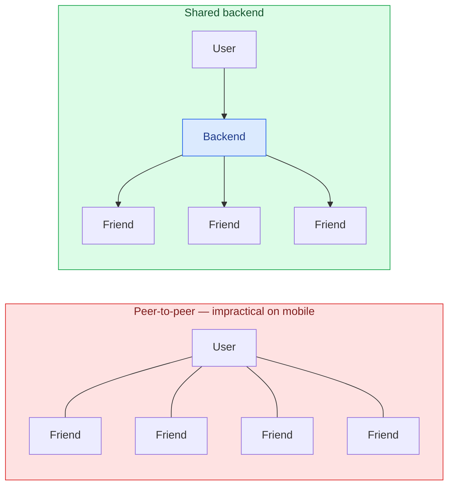
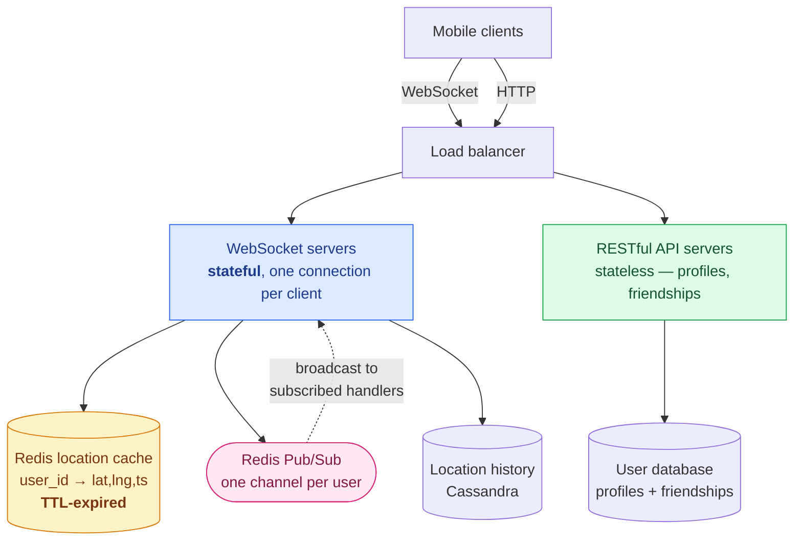
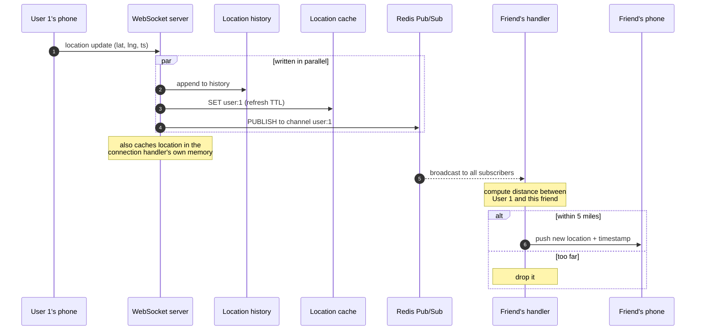
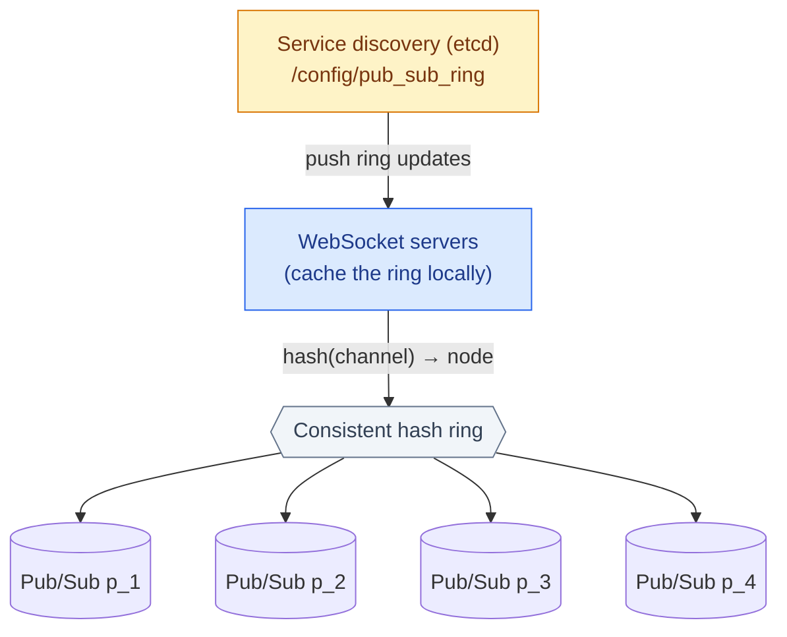
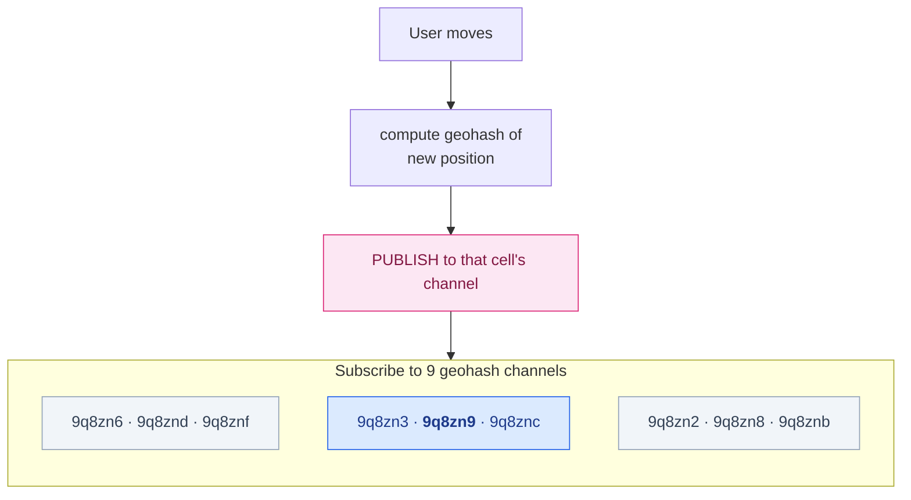
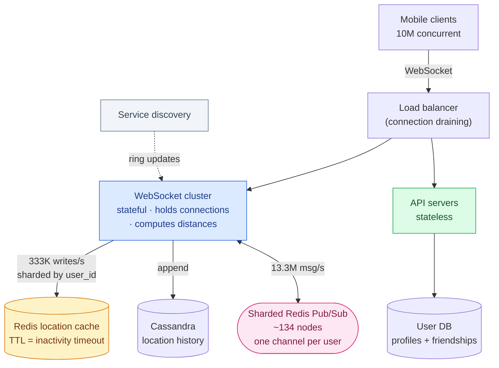

In [the last chapter](/2026/06/design-a-proximity-service/) we found restaurants near you. This one looks almost identical — find *friends* near you — and it is a completely different problem.

Restaurants do not move. A restaurant's location is written once and read a billion times, which is why that design could precompute an index, cache it globally, and rebuild it overnight.

People move. Every user is emitting a new location every thirty seconds, and every one of those updates has to reach a few hundred other people *right now*. The index is obsolete before you finish building it.

Here is the number that defines the chapter. With 10 million concurrent users updating every 30 seconds, the system takes **333,000 location updates per second**. But each update has to be forwarded to every online, nearby friend — and that turns it into roughly **13.3 million outbound messages per second**.

**The input is not the problem. The amplification is.** Everything below follows from that one ratio.

---

## Step 1 — Scope the problem

### The conversation

**How close is "nearby"?** 5 miles, and it should be configurable.

**Straight-line distance?** Yes. A river between two people might make the walk much longer, but straight-line is a reasonable simplification.

**How many users?** A billion in the app, about 10% using this feature.

**Do we store location history?** Yes — it's valuable for machine learning and other downstream uses.

**What about friends who go inactive?** If someone hasn't reported a location in about 10 minutes, drop them from the list rather than showing a stale position.

**Privacy, GDPR, CCPA?** *"For simplicity, don't worry about it for now."*

Hold onto that last answer. It is the standard interview simplification, and it is also — as we'll see at the end — the exact reason the real product no longer exists.

### Requirements

**Functional**

- Users see a list of nearby friends, each with a distance and a "last updated" timestamp.
- The list refreshes every few seconds.

**Non-functional**

- **Low latency.** A location that arrives a minute late is worthless.
- **Reliability**, but *occasional data point loss is acceptable*. If one update in a thousand vanishes, the next one is 30 seconds behind it. This is a genuinely rare licence in system design and we will spend it deliberately.
- **Eventual consistency.** No need for strong consistency on location data.

### Back-of-the-envelope

- 1 billion app users, **100 million** use this feature daily
- Concurrent users ≈ 10% of DAU = **10 million**
- Location refresh interval: **30 seconds** — walking pace is 3–4 mph, so a fresher update tells you nothing new
- Average **400 friends** per user, of whom perhaps **10%** are online and nearby

```
Location update QPS = 10,000,000 / 30 ≈ 333,000
```

333K writes per second is a large but tractable number. Now the fan-out:

```
Outbound messages = 333,000 × 400 × 10% ≈ 13,300,000 per second
```

**Thirteen million messages per second.** The system amplifies its own input by roughly 40×, and every architectural decision from here is about surviving that multiplication.

### Play with the numbers

The amplification is the whole chapter, so it is worth feeling how sensitive it is. Change any assumption and watch what happens:

<div class="fanout-calc" id="fo-calc"><div class="fo-row"><label for="fo-dau">Daily active users on the feature <b><span id="fo-dau-v">100</span>M</b></label><input type="range" id="fo-dau" min="10" max="500" step="10" value="100"></div><div class="fo-row"><label for="fo-conc">Concurrent, as % of DAU <b><span id="fo-conc-v">10</span>%</b></label><input type="range" id="fo-conc" min="1" max="50" step="1" value="10"></div><div class="fo-row"><label for="fo-int">Refresh interval <b><span id="fo-int-v">30</span>s</b></label><input type="range" id="fo-int" min="5" max="300" step="5" value="30"></div><div class="fo-row"><label for="fo-fr">Average friends <b><span id="fo-fr-v">400</span></b></label><input type="range" id="fo-fr" min="50" max="2000" step="50" value="400"></div><div class="fo-row"><label for="fo-on">Friends online <i>and</i> nearby <b><span id="fo-on-v">10</span>%</b></label><input type="range" id="fo-on" min="1" max="100" step="1" value="10"></div><div class="fo-grid"><div class="fo-stat"><span class="fo-num" id="fo-in">333K</span><span class="fo-lbl">Inbound updates / sec</span></div><div class="fo-stat fo-hot"><span class="fo-num" id="fo-out">13.3M</span><span class="fo-lbl">Outbound messages / sec</span></div><div class="fo-stat"><span class="fo-num" id="fo-amp">40×</span><span class="fo-lbl">Amplification</span></div><div class="fo-stat"><span class="fo-num" id="fo-srv">133</span><span class="fo-lbl">Pub/Sub servers needed</span></div></div><p class="fo-note" id="fo-note">Server count assumes a conservative 100,000 subscriber pushes per second per node.</p></div>
<script>
(function () {
  var ids = ["dau", "conc", "int", "fr", "on"];
  var el = {};
  ids.forEach(function (k) {
    el[k] = document.getElementById("fo-" + k);
    el[k + "v"] = document.getElementById("fo-" + k + "-v");
  });
  var outIn = document.getElementById("fo-in"),
      outOut = document.getElementById("fo-out"),
      outAmp = document.getElementById("fo-amp"),
      outSrv = document.getElementById("fo-srv"),
      note = document.getElementById("fo-note");
  if (!el.dau) return;
  function human(n) {
    if (n >= 1e9) return (n / 1e9).toFixed(1).replace(/\.0$/, "") + "B";
    if (n >= 1e6) return (n / 1e6).toFixed(1).replace(/\.0$/, "") + "M";
    if (n >= 1e3) return Math.round(n / 1e3) + "K";
    return Math.round(n).toString();
  }
  function render() {
    var dau = +el.dau.value * 1e6,
        conc = +el.conc.value / 100,
        intv = +el.int.value,
        fr = +el.fr.value,
        on = +el.on.value / 100;
    el.dauv.textContent = el.dau.value;
    el.concv.textContent = el.conc.value;
    el.intv.textContent = el.int.value;
    el.frv.textContent = el.fr.value;
    el.onv.textContent = el.on.value;
    var concurrent = dau * conc;
    var inbound = concurrent / intv;
    var outbound = inbound * fr * on;
    var servers = Math.ceil(outbound / 100000);
    outIn.textContent = human(inbound);
    outOut.textContent = human(outbound);
    outAmp.textContent = Math.round(fr * on) + "×";
    outSrv.textContent = servers.toLocaleString();
    if (outbound > 5e7) {
      note.textContent = "At this fan-out a single Pub/Sub layer is no longer plausible — you would push filtering to the edge or drop the refresh rate.";
      note.className = "fo-note fo-warn";
    } else {
      note.textContent = "Server count assumes a conservative 100,000 subscriber pushes per second per node.";
      note.className = "fo-note";
    }
  }
  ids.forEach(function (k) { el[k].addEventListener("input", render); });
  render();
})();
</script>

Two things are worth noticing while you drag those sliders.

**Halving the refresh interval doubles everything.** 30 seconds isn't a rounded-off guess — it's derived from human walking speed. Going to 15 seconds costs twice the infrastructure and shows the user nothing they didn't already know.

**Friend count multiplies directly into the fan-out.** This is why the design assumes a *friendship* model with a cap, not a follower model. One celebrity with ten million followers would produce, by themselves, more fan-out than the rest of the system combined.

---

## Step 2 — High-level design

Unusually, we design the architecture *before* the API here. The client/server protocol isn't plain request/response — the server has to **push** to the client — and until that's settled you can't say what the API looks like.

### Why not peer-to-peer?

Conceptually, each user could hold a direct connection to every nearby friend. No server in the middle, minimal latency.

On mobile, this is hopeless. A phone would maintain hundreds of persistent connections over a flaky cellular link, each one draining battery, all of them tearing down and rebuilding every time the network hiccups or the user walks into a lift.

But it does point at the right shape: **what we need is efficient message passing**, with a shared backend playing the role of the mesh.



The backend's job is small to describe and hard to do at scale:

1. Receive location updates from every active user.
2. For each update, find the active friends who should see it and forward it.
3. If two users are further apart than the threshold, don't forward at all.

### The components



**WebSocket servers** are the heart of it. Each client holds one long-lived, bidirectional connection. These servers are **stateful**, which makes them the most operationally awkward component in the system — a fact we'll pay for in the deep dive.

**Redis location cache** holds only the *latest* position per user, with a **TTL on every entry**. This is a lovely piece of design: the TTL *is* the inactivity timeout. You never write code to expire idle users, never run a sweeper job. A user who stops reporting simply evaporates from the cache, and "is this friend still active?" becomes "is this key still there?"

**Redis Pub/Sub** is the routing layer. Every user gets a channel. Their friends' connection handlers subscribe to it.

**Location history database** stores the full trail. Write-heavy, horizontally scalable — Cassandra is a natural fit, and sharding by user ID spreads the load evenly.

### Why Pub/Sub channels, and why one per user

Redis Pub/Sub channels are extraordinarily cheap. A channel springs into existence when someone subscribes; publishing to a channel with no subscribers costs almost nothing, because the message is simply dropped. All Redis keeps per channel is a hash table and a linked list of subscribers.

That cheapness enables a decision that looks wasteful and isn't:

> **Subscribe to every friend's channel at startup — online or not.**

The alternative is to subscribe when a friend comes online and unsubscribe when they go offline. That means tracking presence transitions for hundreds of friends per user, across a distributed system, with all the races that implies.

Instead, subscribe to all 400 friends once, at connection time, and never think about it again. Offline friends cost a little memory and **zero CPU**, because they publish nothing.

**Trading memory for the elimination of an entire class of state transitions is almost always the right trade.** The memory is cheap and predictable; the state machine is neither.

### The location update flow



Two details in there matter more than they look.

**Steps 3–5 run in parallel.** History, cache and publish are independent. Doing them in sequence would triple the latency of the hot path for no reason.

**The distance check happens at the subscriber, not the publisher.** Each connection handler already holds its own user's latest position in memory, so when a friend's update arrives, computing the distance is arithmetic on two in-memory values — no lookup, no network call. The publisher can't do this filtering, because it would need every subscriber's current position.

This is the reason 13 million messages per second is survivable at all: **the expensive work is distributed across the same servers that hold the connections.**

### The API

Everything real-time goes over WebSocket:

| Direction | Message | Payload |
|---|---|---|
| Client → Server | Periodic location update | latitude, longitude, timestamp |
| Server → Client | Friend location update | friend location + timestamp |
| Client → Server | Connection initialisation | client's location |
| Server → Client | Initialisation response | all nearby friends' locations |
| Server ↔ Server | Subscribe to a new friend | friend ID → their latest location |
| Server ↔ Server | Unsubscribe from a friend | friend ID |

The ordinary CRUD — profiles, friend requests — goes over plain HTTP to the stateless API servers. There is no reason to put it on the WebSocket.

### Data model

**Location cache** — one row per active user:

| key | value |
|---|---|
| `user_id` | `{latitude, longitude, timestamp}` |

**Why not a database for this?** Because we only ever need the *current* location, the data is tiny, and it does not need to be durable at all.

That last point deserves stating plainly, because it's a rare luxury: **if the Redis instance dies, you can replace it with an empty one.** Users miss an update cycle or two while it refills from the incoming stream, and then everything is normal again. No restore, no replay, no data loss that anyone can perceive — because every client is about to send a fresh location anyway.

**Location history** — append-only:

| user_id | latitude | longitude | timestamp |
|---|---|---|---|

Heavy writes, no updates, easily sharded by user ID.

---

## Step 3 — Deep dive: what breaks

### Stateless servers: easy

The RESTful API tier autoscales on CPU or load like any stateless cluster. Nothing to see.

### WebSocket servers: stateful, and it shows

You can autoscale these too, but **removing a node is not free**. Every connection on it belongs to a user who is actively using the feature.

The procedure is connection draining:

1. Mark the node **draining** at the load balancer so it receives no new connections.
2. Wait for existing connections to close naturally, or until a generous timeout.
3. Only then remove the node.

**Deploying new code needs exactly the same care.** A rolling restart that ignores draining will disconnect a large fraction of users at once — and every one of them will immediately reconnect, hitting the remaining servers with a synchronised reconnection storm on top of their existing load.

Good cloud load balancers handle draining natively. It's worth confirming yours does before you need it.

### Client initialisation

When a client connects, the handler does seven things:

1. Update the user's location in the cache.
2. Cache that location in the handler's own memory for later distance maths.
3. Load the user's friend list from the user database.
4. **Batch-fetch** all friends' locations from the cache in one round trip.
5. For each location returned, compute the distance and send back the ones within range.
6. Subscribe to every friend's Pub/Sub channel.
7. Publish the user's own location to their own channel.

Step 4's batching matters: 400 individual cache lookups at connection time, multiplied across a reconnection storm, is how you turn a small incident into an outage.

And notice how the TTL keeps paying: **a friend who is inactive simply isn't in the cache.** There is no `is_active` flag to read, no separate presence service to consult. Absence *is* the answer.

### Location cache: 333K writes/sec

10 million users at 100 bytes each is about 1 GB — trivial for one Redis server on memory grounds.

But **333,000 writes per second** is too much for a single node. Fortunately this data shards perfectly: every user's location is independent of every other's, so shard by user ID and the load spreads evenly. Add a standby replica per shard for failover.

### Redis Pub/Sub: which resource runs out first?

Here is the most instructive calculation in the chapter, because the obvious answer is wrong.

**Memory.** 100 million channels, an average of 100 friends using the feature, ~20 bytes of pointers per subscriber:

```
100M channels × 20 bytes × 100 friends / 10 ≈ 200 GB
→ about 2 servers with 100 GB each
```

**CPU.** 13.3 million pushes per second, and — conservatively — 100,000 pushes per second per node:

```
13,300,000 / 100,000 → 134 servers
```

**Two servers for memory. A hundred and thirty-four for CPU.**

The bottleneck is not the thing you'd size first. Memory is what you *think* about when someone says "millions of channels," and it's off by a factor of seventy. **Always compute every resource dimension, then let the largest number pick your architecture.**

### Distributing Pub/Sub across 130+ servers

Channels are independent, so shard them — by publisher's user ID, on a **consistent hash ring**. (Same mechanism as [Chapter 5](/2026/05/design-consistent-hashing/), doing the same job: minimising how much moves when the cluster changes.)

The ring itself lives in a **service discovery** component — etcd or ZooKeeper — which needs to do only two things:

1. Store the ring: `/config/pub_sub_ring → ["p_1", "p_2", "p_3", "p_4"]`
2. Let WebSocket servers **subscribe to changes** to it.



Each WebSocket server keeps a local copy of the ring for speed, and updates it when notified. To publish, it hashes the channel name, finds the owning node, and publishes there. Subscribing works identically.

### Pub/Sub is stateful — in the part that matters

A tempting mistake: since Pub/Sub messages aren't persisted anywhere, treat the cluster as stateless and scale it up and down daily like a web tier.

**Don't.** The *messages* are stateless. The **subscriber list per channel is not.**

Move a channel to a different node — because you resized the ring, or replaced a dead server — and every subscriber must unsubscribe from the old node and resubscribe on the new one. That's coordination across the entire WebSocket fleet.

So treat this cluster like a storage cluster: **over-provision for peak, resize rarely and deliberately.** When you must resize:

- Many channels move at once, and service discovery fans the update out to every WebSocket server, producing **a flood of resubscriptions**.
- During that flood, some location updates get missed. Acceptable here — remember requirement two — but not something to do casually.
- **Resize at the daily traffic minimum.**

Replacing a *single* dead node is far safer: only that node's channels move. Which is good, since servers die on their own schedule.

### Adding and removing friends

The client registers a callback in the wider app. When a friendship is created, it tells the WebSocket server to subscribe to the new friend's channel — and the server replies with that friend's current location, so the new friend appears immediately rather than after their next update.

Removing a friend unsubscribes. The same hook handles someone opting in or out of location sharing.

### Users with many friends

Could a user with thousands of friends create a hotspot?

Mostly no, and the reason is structural. Their subscribers are **spread across the whole WebSocket fleet**, so the fan-out work is distributed by default. Their own channel does place extra load on one Pub/Sub node, but with 130+ nodes, these "whales" scatter across the cluster.

This works **only because friendship is bidirectional and capped** — Facebook's limit is 5,000. A follower model breaks it instantly: one account with ten million followers would put ten million subscribers on a single channel on a single node. That is [the celebrity problem from the news feed chapter](/2026/06/design-news-feed-system/), and the fix there — a hybrid push/pull model — would be needed here too.

### Extra credit: nearby strangers

What if you want to show *anyone* who has opted in, not just friends?

The friend model doesn't work — there's no friendship to subscribe through. But [Chapter 1](/2026/06/design-a-proximity-service/) hands us the answer: **create a channel per geohash cell** instead of per user.

Publish your location to the channel for the cell you're standing in. Everyone in that cell is subscribed, so they receive it.

And the boundary problem returns, with the same fix: someone standing near a cell edge would miss people just across the line, so **subscribe to your cell plus its eight neighbours.**



The routing layer doesn't change at all. Only the channel naming scheme does — which is a sign the Pub/Sub abstraction was the right one.

### The Erlang alternative

The book makes a claim worth taking seriously: **Erlang would be a better fit than all of this.**

The argument rests on one property. A BEAM process — Erlang's unit of concurrency — costs roughly **300 bytes**, and an idle one consumes no CPU whatsoever. Compare that with an OS thread at 1–8 MB.

At that price, you can model **every one of the 10 million active users as its own process.** Each user-process receives its own location updates and subscribes directly to its friends' processes. Subscription is native to OTP. The Redis Pub/Sub cluster, the hash ring, and the service discovery component all disappear — replaced by a mesh of cheap processes that the runtime already knows how to distribute.

This isn't theoretical. **WhatsApp famously ran over 2 million concurrent connections on a single server** with this model — the same approach that made [the chat system chapter](/2026/06/design-chat-system/) possible.

The catch is hiring. Erlang expertise is scarce, and an architecture your team can't operate at 3 a.m. is not a better architecture. If you have the expertise, though, this is the stronger design.

---

## What has changed since the book

### Redis 7 made a whole section of this chapter obsolete

The most consequential update. That entire apparatus — consistent hash ring, etcd, WebSocket servers caching the ring and resubscribing on change — existed to solve one problem: **classic Redis Pub/Sub in cluster mode broadcasts every message to every node.** On a 20-node cluster, a message with one subscriber still crosses 19 cluster-bus links.

**Redis 7.0 shipped sharded Pub/Sub**, which fixes this in the server. `SPUBLISH` and `SSUBSCRIBE` assign channels to hash slots using the same algorithm Redis already uses for keys, and messages propagate **only within the owning shard**:

```
SSUBSCRIBE user:12345      # subscribe to a shard channel
SPUBLISH  user:12345 "..."  # publishes only within that shard
```

Redis now scales Pub/Sub horizontally by adding shards, natively. You would still want service discovery for other reasons, but you would no longer hand-roll a hash ring for channel placement.

One limitation to know: **pattern subscriptions (`PSUBSCRIBE`) don't work in sharded mode.** If your design leans on channel-name wildcards, sharding will break it.

### Redis Pub/Sub loses messages, by design

The book relies on "occasional data point loss is acceptable" without saying how much loss the technology actually implies. It's worth being precise, in Redis's own words:

> Redis' Pub/Sub exhibits **at-most-once** message delivery semantics… If the subscriber is unable to handle the message (for example, due to an error or a network disconnect) **the message is forever lost.**

No buffering, no replay, no acknowledgement. A subscriber that blips for two seconds during a mobile handover loses everything published in that window, permanently.

For this feature that's genuinely fine — another update lands in 30 seconds. But it makes the requirement load-bearing rather than decorative. **If you had chosen Pub/Sub for something where loss mattered, the technology would have silently betrayed you.**

Where you do need guarantees, Redis Streams persist messages and support at-least-once delivery with consumer groups. The cost is memory and complexity — you now own retention policy and consumer lag.

### The privacy answer aged worst

Recall the one question waved away in Step 1: *"Do we need to worry about GDPR or CCPA?" — "For simplicity, don't worry about it for now."*

**Facebook shut down Nearby Friends on 31 May 2022**, along with background location and location history, deleting the collected data by that August. The stated reason was low usage. Users had become wary of sharing continuous location with Facebook specifically — and Snapchat, whose Snap Map had a clearer social contract, won the category instead.

The engineering in this chapter is sound. The feature died anyway, on the axis the interview question explicitly excluded.

That's worth carrying beyond this design. A system that continuously ingests precise location for a hundred million people has requirements that aren't optional garnish: **retention limits, granular consent, regional data residency, and a real answer to "delete everything about me."** In the EU, location is special-category personal data. Those constraints reshape the architecture — the history database in particular acquires a retention policy, a deletion path, and probably a per-region deployment.

Waving it away is fine for a 45-minute interview. It is not fine for a product.

---

## Putting it together



---

## What to take away

**Moving data and static data are different problems.** Chapter 1 could precompute an index and cache it globally because restaurants stay put. Here the data is obsolete in 30 seconds, so there is nothing to precompute — the architecture is a routing problem, not an indexing one. When requirements look similar, check whether the *write* pattern is similar. It usually isn't.

**Size every resource, then let the biggest number choose.** Memory said two servers. CPU said a hundred and thirty-four. Had we sized only the dimension that came to mind first, we would have under-provisioned by 60×.

**"Stateless" is a property of specific data, not of a system.** Redis Pub/Sub messages are stateless; its subscriber lists are not. That single distinction is the difference between "scale it daily like a web tier" and "over-provision and resize at 4 a.m." Ask *which* state, not *whether* state.

**Trade memory for eliminated state transitions.** Subscribing to all 400 friends including offline ones looks wasteful, and it removes an entire distributed presence-tracking problem. Memory is cheap and predictable. Distributed state machines are neither.

**A TTL can be a feature, not a cleanup mechanism.** Setting an expiry equal to the inactivity timeout meant "is this user active?" was answered by whether a key existed. No presence service, no sweeper job, no flag to keep consistent.

**The requirement you're allowed to skip may be the one that kills the product.** The design works. The feature shipped, ran for eight years, and was switched off — over the exact concern the problem statement set aside.

---

## References and Further Reading

**Real-time messaging**

<ul>
<li><a href="https://redis.io/docs/latest/develop/pubsub/">Redis Pub/Sub</a> — including the at-most-once delivery semantics and sharded Pub/Sub</li>
<li><a href="https://redis.io/docs/latest/commands/spublish/">SPUBLISH</a> · <a href="https://redis.io/docs/latest/commands/ssubscribe/">SSUBSCRIBE</a> — Redis 7 sharded Pub/Sub</li>
<li><a href="https://redis.io/docs/latest/develop/data-types/streams/">Redis Streams</a> — when at-most-once isn't enough</li>
<li><a href="http://web.archive.org/web/20221105014022/https://making.pusher.com/redis-pubsub-under-the-hood/">Redis Pub/Sub under the hood</a> — Pusher, via the Wayback Machine</li>
<li><a href="https://developer.mozilla.org/en-US/docs/Web/API/WebSockets_API">The WebSocket API</a> — MDN</li>
</ul>

**Erlang and the BEAM**

<ul>
<li><a href="https://www.erlang.org/">Erlang</a> · <a href="https://elixir-lang.org/">Elixir</a></li>
<li><a href="https://www.erlang.org/blog/a-brief-beam-primer/">A brief BEAM primer</a> — why processes cost ~300 bytes</li>
<li><a href="https://www.erlang.org/doc/design_principles/des_princ.html">OTP design principles</a></li>
<li><a href="https://www.slideshare.net/slideshow/scaling-to-millions-of-simultaneous-connections-by-rick-reed-from-whatsapp/52848143">Scaling to Millions of Simultaneous Connections</a> — Rick Reed, WhatsApp</li>
</ul>

**Coordination**

<ul>
<li><a href="https://etcd.io">etcd</a> · <a href="https://zookeeper.apache.org/">Apache ZooKeeper</a></li>
<li><a href="https://en.wikipedia.org/wiki/Consistent_hashing">Consistent hashing</a> · <a href="/2026/05/design-consistent-hashing/">the hash ring explained in this series</a></li>
</ul>

**What happened to the feature**

<ul>
<li><a href="https://techcrunch.com/2014/04/17/facebook-nearby-friends/">Facebook launches Nearby Friends</a> (2014)</li>
<li><a href="https://techcrunch.com/2022/05/09/facebook-to-shutter-its-nearby-friends-service-having-lost-the-friend-finding-market/">Facebook shutters Nearby Friends</a> (2022) — eight years later</li>
<li><a href="https://gdpr-info.eu/art-9-gdpr/">GDPR Article 9</a> — special categories of personal data</li>
</ul>

**In this series**

<ul>
<li><a href="/guide/">The complete guide</a> — every article in order</li>
<li><a href="/2026/06/design-a-proximity-service/">Design a Proximity Service</a> — the static counterpart, and where geohash comes from</li>
<li><a href="/2026/06/design-chat-system/">Design a Chat System</a> — WebSocket connection management in depth</li>
<li><a href="/2026/06/design-news-feed-system/">Design a News Feed System</a> — the celebrity fan-out problem</li>
<li><a href="/2026/05/design-consistent-hashing/">Design Consistent Hashing</a> — the hash ring, properly</li>
</ul>
