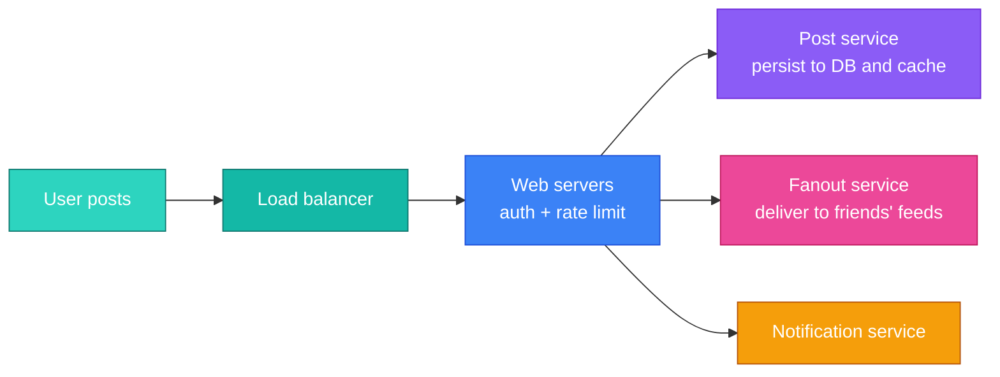
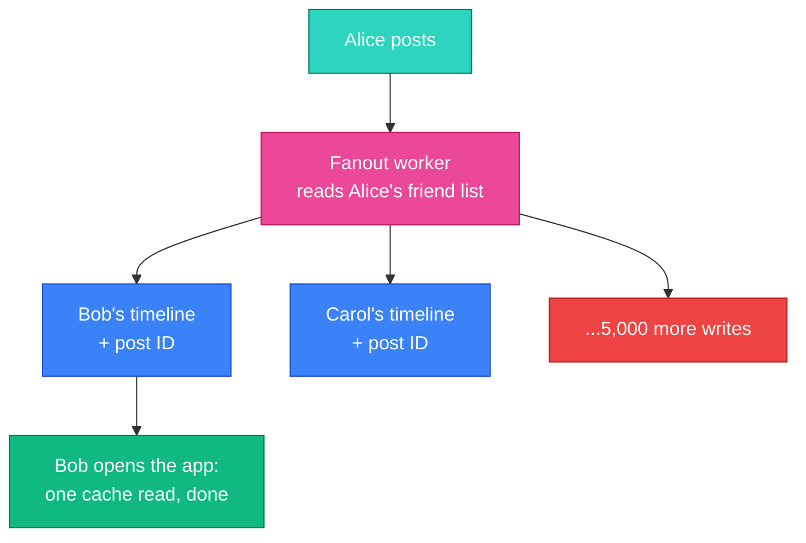
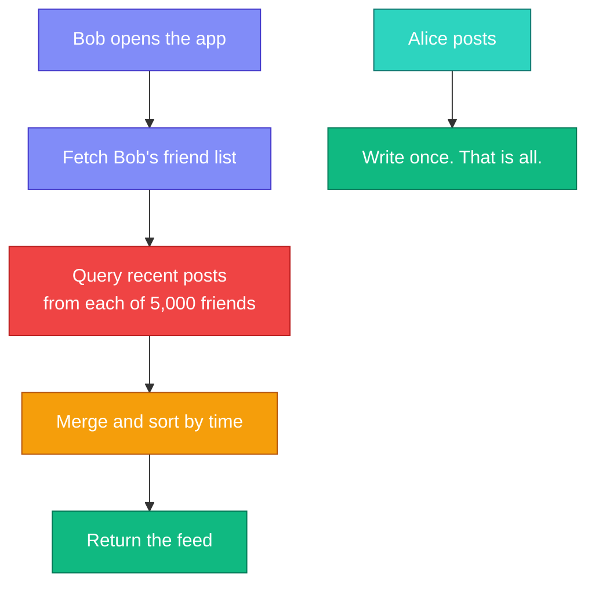
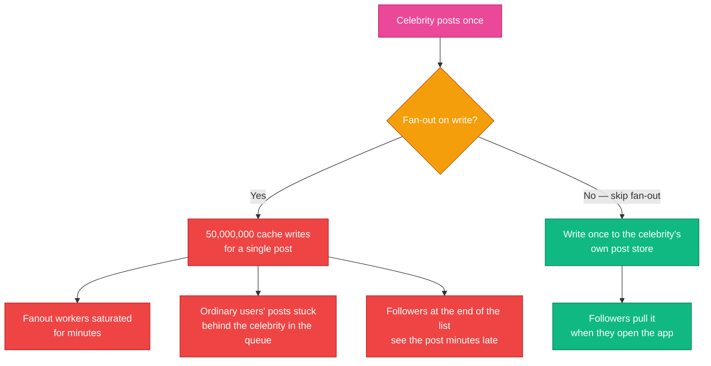
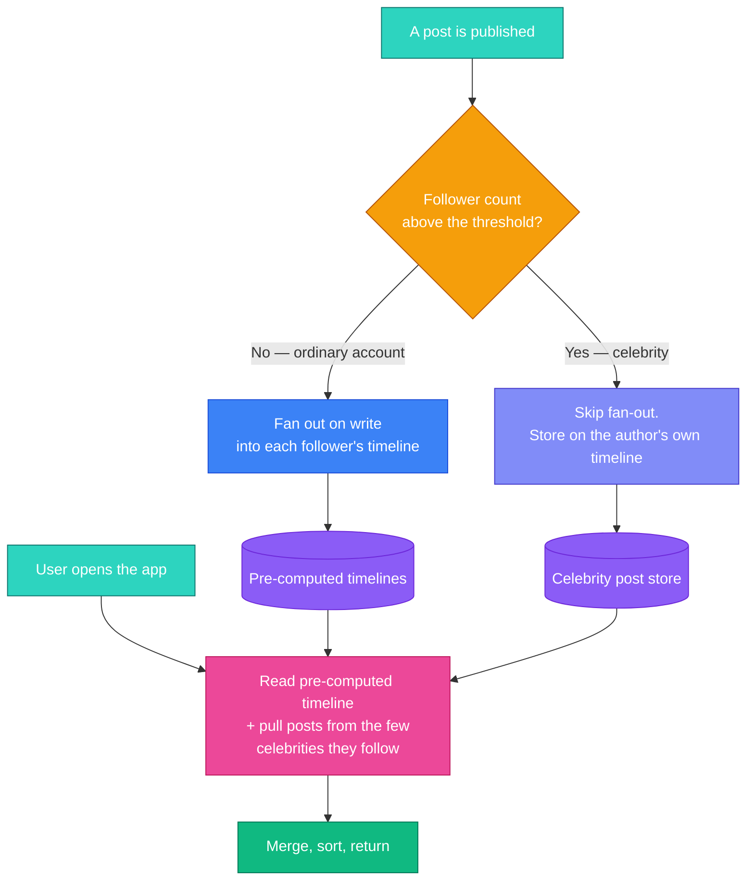
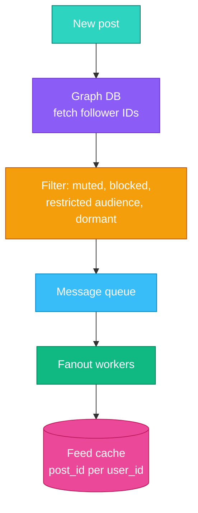
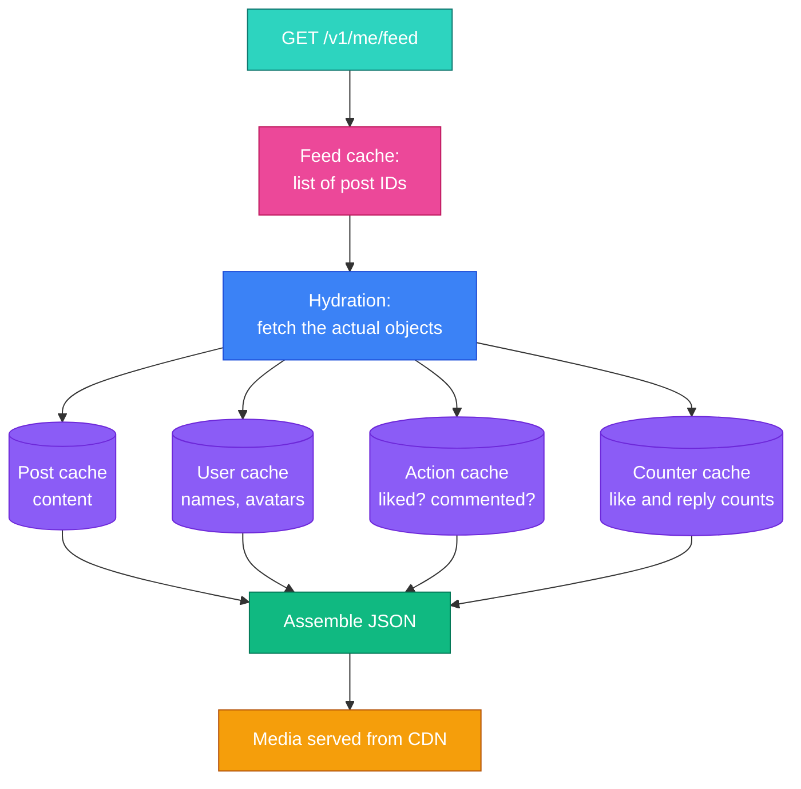

Every social product has the same question at its centre, and it has exactly two answers:

**Do you build a user's feed when someone posts, or when that user opens the app?**

That is it. Everything else — the caches, the queues, the graph database — follows from which side you pick. And the reason this is a great interview question is that **both answers are wrong**, in ways that only become visible when you do the arithmetic.

Pick "when someone posts" and one celebrity with 50 million followers generates 50 million writes for a single post. Pick "when the user opens the app" and every feed load turns into a fan of hundreds of queries while the user stares at a spinner.

The real answer is that you do both, on different accounts, and hide the seam. Let's build up to why.

---

## Step 1 — Understand the Problem and Establish Scope

> **Candidate:** Mobile app, web, or both?  
> **Interviewer:** Both.
>
> **Candidate:** What are the core features?  
> **Interviewer:** A user can publish a post, and see their friends' posts on the feed.
>
> **Candidate:** Is the feed reverse-chronological, or ranked by some score?  
> **Interviewer:** Reverse chronological, to keep it simple.
>
> **Candidate:** How many friends can a user have?  
> **Interviewer:** Up to 5,000.
>
> **Candidate:** Traffic?  
> **Interviewer:** 10 million daily active users.
>
> **Candidate:** Does a post contain media?  
> **Interviewer:** Yes — images and video.

Two of those answers deserve a flag, because interviewers plant them deliberately:

- **"Reverse chronological" is a simplification, and you should say so.** No major feed has worked that way for a decade. Accept it to keep the design tractable, but note that a ranking layer slots in at read time — we come back to where it goes.
- **"Up to 5,000 friends" quietly bounds the problem.** With a hard ceiling of 5,000, pure fan-out-on-write is survivable. The moment the product allows *followers* rather than mutual friends, that ceiling disappears and the celebrity problem appears. Asking about this distinction is a strong move.

### What the numbers say

| Quantity | Working | Result |
|---|---|---|
| Feed reads | 10M DAU x ~10 refreshes | **~100M reads/day, ~1,200/s** |
| Posts | 10M DAU x ~2 posts | **~20M writes/day, ~230/s** |
| Read:write ratio | 100M : 20M | **~5:1, read-heavy** |
| Fan-out writes | 20M posts x avg friends | **billions of timeline writes/day** |

The last row is the whole chapter. **A modest number of posts becomes an enormous number of writes, because every post is copied into every friend's feed.** This is *write amplification*, and it is the cost you pay for fast reads.

---

## Step 2 — High-Level Design

Two flows, and it is worth keeping them mentally separate throughout:

- **Feed publishing** — a user posts; the post reaches their friends' feeds.
- **Feed retrieval** — a user opens the app; their feed is assembled and returned.

### The APIs

```
POST /v1/me/feed          publish a post
     params: content, auth_token

GET  /v1/me/feed          retrieve the feed
     params: auth_token, cursor
```

Note `cursor`, not `page`. Offset pagination (`?page=2`) is broken for feeds: new posts arrive between requests, so page 2 shifts down and the user sees items they already saw, or misses items entirely. **Cursor pagination** — "give me what comes after post ID X" — is stable under insertion. It is a small detail that signals you have built a feed rather than read about one.

### Publishing



The fan-out service is where all the difficulty lives. Everything else is routine.

---

## Step 3 — The Central Trade-off

### Fan-out on write (push)

When a user posts, immediately write that post's ID into every friend's cached timeline. The feed is **pre-computed** — reading it is a single cache lookup.



**Good:** reads are as fast as they can possibly be — one lookup of a pre-built list. Posts appear in real time.

**Bad:** writes are amplified by the friend count. And you do this work for **every** friend, including the ones who have not opened the app in eight months. At 10M DAU, a large fraction of fan-out work is delivering posts to feeds nobody will ever load.

### Fan-out on read (pull)

Write nothing at post time. When a user opens the app, fetch their friend list, query recent posts from each, merge, sort, return.



**Good:** writing a post is one write. Dormant users cost nothing. No hot-key problem.

**Bad:** every feed load becomes hundreds or thousands of queries plus a merge — and this happens on the read path, which is the path with a user waiting on it, and which we established is **5x more frequent than writes**.

### Side by side

| | Fan-out on write (push) | Fan-out on read (pull) |
|---|---|---|
| Work at post time | **High** — one write per follower | One write |
| Work at read time | One cache read | **High** — fan-in and merge |
| Feed latency | Excellent | Poor |
| Wasted effort | Fanning out to dormant users | None |
| Breaks when | An account has millions of followers | Everyone has many friends |
| Best suited to | Ordinary accounts | Celebrity accounts |

The last row gives away the answer.

---

## The Celebrity Problem

This is the part to be able to derive on the spot, because the arithmetic makes the argument for you.

An account with **50 million followers** posts once. Under fan-out on write:

```
1 post  x  50,000,000 followers  =  50,000,000 timeline writes
```

For **one** post. Post ten times a day and that single account generates **500 million writes** daily. Now consider that a platform has thousands of such accounts.



The damage is not confined to the celebrity. Because fan-out workers are shared, **one celebrity post delays every ordinary user's post** sitting behind it in the queue. A single account degrades the product for everyone — the same head-of-line blocking we saw with notification queues in [Chapter 10](/2026/05/design-notification-system/), wearing a different hat.

### The hybrid

Split accounts by follower count and treat them differently:



Why this works is a distribution argument, and it is worth stating explicitly:

- **Almost every account is ordinary.** The overwhelming majority of posts take the cheap push path.
- **Almost every user follows only a handful of celebrities.** So the read-time merge pulls from perhaps five or ten sources, not five thousand. The expensive path stays small *because celebrities are rare*.

The threshold is a tuning knob, commonly somewhere around **10,000 followers**. It is not a constant of nature — it is where, on your infrastructure, the cost of fanning out exceeds the cost of merging at read time.

Two refinements that show operational thinking:

- **Do not fan out to dormant accounts.** If a user has not opened the app in 30 days, skip their timeline and rebuild it on demand when they return. On a mature platform this removes a large share of all fan-out work.
- **The threshold should be dynamic.** An account that crosses it mid-crisis should switch modes automatically, not wait for someone to notice.

---

## Step 4 — Design Deep Dive

### Inside the fan-out service



Three details that matter:

- **A graph database holds the social graph.** Friend-of-friend traversals are painful in SQL and natural in a graph store.
- **Filtering happens before the queue, not after.** Muted users, blocked users and restricted-audience posts are removed up front, so you never pay to write a post into a timeline that must not show it.
- **Store IDs only, and cap the list.** The feed cache holds post IDs, not post bodies — storing full objects would multiply memory by the number of followers. Cap each timeline at a few hundred entries: nobody scrolls to post 3,000, and the cap makes memory predictable. In Redis this is `LPUSH` followed by `LTRIM`.

### Retrieval and hydration



**Hydration is the step people forget.** The timeline is a list of IDs; the screen needs author names, avatars, text, counts, and whether *you* liked each post. That is several cache lookups per post, batched — and it is why the cache tier is layered rather than monolithic:

| Layer | Holds | Why separate |
|---|---|---|
| **Feed** | Post IDs per user | Small, hot, written by fan-out |
| **Content** | Post bodies | Large; popular posts in a hot subset |
| **Social graph** | Follower and following lists | Read on every fan-out |
| **Action** | Did this user like this post | Per user-post pair, huge cardinality |
| **Counter** | Like and reply totals | Write-heavy, updated constantly |

They are separated because their access patterns and update rates differ by orders of magnitude. Counters change constantly; post bodies almost never do. Sharing one cache would force the worst policy on all of them.

**Media never passes through your servers.** Images and video go to a CDN, and the feed JSON carries URLs. Serving a video through your application tier is a classic and expensive mistake.

---

## Beyond the Book

### Real feeds are ranked, not chronological

The interviewer's "reverse chronological" simplification has not matched a production feed since roughly 2015. Real feeds score every candidate post and sort by predicted engagement.

That changes where the work goes: fan-out still assembles the **candidate set**, but a ranking service scores it at read time before returning. The architecture above survives — you insert a scoring step between hydration and response — but two things shift:

- **The timeline cap must be generous.** Ranking needs candidates to choose among, so you keep more than the 20 you will display.
- **Ranking is on the read path**, so it has a latency budget. This is where feed systems actually spend their milliseconds today.

Say this out loud even when the interviewer specified chronological. It shows you know the simplification is a simplification.

### Edits, deletes, and the cost of denormalisation

Fan-out on write is denormalisation: one post now exists in millions of timelines. So what happens when it is deleted?

You do not chase it through millions of timelines. Because **the timeline stores only IDs**, you delete the post from the content store, and hydration simply finds nothing and skips it. This is the quiet payoff of storing IDs rather than bodies — it turns a distributed deletion problem into a no-op.

The same logic covers edits, blocks applied after the fact, and privacy changes: **resolve at hydration, not at fan-out**.

### What to monitor

- **Fan-out lag** — time from publish to the post landing in the last follower's timeline. This is the number that degrades first under load.
- **Feed load p99**, not the mean. Means hide the users with 5,000 friends and twelve celebrity follows.
- **Cache hit rate per layer.** A drop in the counter cache and a drop in the feed cache mean completely different things.

---

## Interview Quick Reference

**The core question:** build the feed at write time or read time?

| | Push (write) | Pull (read) | **Hybrid** |
|---|---|---|---|
| Post cost | High | Low | Low for celebrities, high for the rest |
| Read cost | Low | High | Low, plus a small merge |
| Celebrity safe | No | Yes | **Yes** |
| Used in production | Rarely alone | Rarely alone | **Yes** |

**The celebrity arithmetic:** 1 post x 50M followers = 50M writes. Ten posts a day = 500M writes for one account — and the shared fan-out workers delay everyone else's posts too.

**The hybrid, in one line:** push for ordinary accounts, skip fan-out for celebrities, merge both at read time. It works because celebrities are rare, so the expensive path stays small.

**Details that mark out a strong answer:**

- **Cursor pagination, not offsets** — feeds shift under you between requests.
- **Store post IDs, not post bodies**, and cap timeline length.
- **Filter before the queue** — never fan out a post that must not be shown.
- **Skip dormant users** and rebuild their feed on return.
- **Hydration is a real step**, and it drives the five-layer cache split.
- **Deletion is free** because timelines hold IDs — resolve at hydration.
- **Real feeds rank at read time**; chronological is the interviewer's simplification.

---

## Summary

| Idea | Why it matters |
|---|---|
| Two choices only | Precompute at write, or assemble at read |
| Write amplification | 20M posts becomes billions of timeline writes |
| Neither pure model works | Push breaks on celebrities, pull breaks on latency |
| The hybrid works on distribution | Celebrities are rare, so the costly path stays small |
| Store IDs, not objects | Bounds memory and makes deletion trivial |
| Hydration is the hidden cost | A timeline of IDs is not a screen |
| Resolve at read, not at write | Edits, deletes and privacy stay correct without rewriting history |

---

## References and Further Reading

**The primary sources**

- [How News Feed Works](https://www.facebook.com/help/1155510281178725/) — Facebook's own explanation of what a feed is meant to do
- [The Infrastructure Behind Twitter: Scale](https://blog.twitter.com/engineering/en_us/topics/infrastructure/2017/the-infrastructure-behind-twitter-scale) — the timeline architecture, from the team that built it
- [Facebook's TAO: The Power of the Graph](https://engineering.fb.com/2013/06/25/core-infra/tao-the-power-of-the-graph/) — the graph store behind the social graph

**Fan-out in depth**

- [Twitter's fan-out strategy at scale](https://dev.to/gabrielanhaia/twitters-fanout-strategy-at-scale-the-trade-off-most-designs-miss-55oa) — the hybrid and the threshold, with numbers
- [Fan-out on write vs fan-out on read](https://wittycoder.in/courses/news-feed/fan-out-strategies) — the trade-off laid out plainly
- [Redis lists](https://redis.io/docs/latest/develop/data-types/lists/) — `LPUSH` and `LTRIM`, the two commands a timeline cache is built from

**Related chapters**

- [Chapter 10: Design a Notification System](/2026/05/design-notification-system/) — the same head-of-line blocking problem, in a different guise
- [Chapter 1: Scale From Zero to Millions of Users](/2026/05/scale-from-zero-to-millions/) — the caching and CDN tiers this design assumes
- [Chapter 5: Design Consistent Hashing](/2026/05/design-consistent-hashing/) — distributing the hot keys fan-out creates

**Books**

- *System Design Interview – An Insider's Guide* — Alex Xu. The chapter this article follows.
- *Designing Data-Intensive Applications* — Martin Kleppmann. Chapter 1 works through this exact Twitter fan-out example as its opening case study, and is the best treatment in print.

---

## What's Next?

In **Chapter 12** we design a **chat system** — where the constraint inverts. A feed can be seconds stale and nobody minds; a chat message that arrives late, twice, or out of order is a visible bug. That pushes the design towards long-lived connections, per-conversation ordering, and delivery state that both participants can see.

*The move in this chapter generalises. When one workload is cheap for almost everyone and ruinous for a rare few, do not design for the average — classify, and run two strategies. The threshold between them is a tuning knob, not an architecture.*
