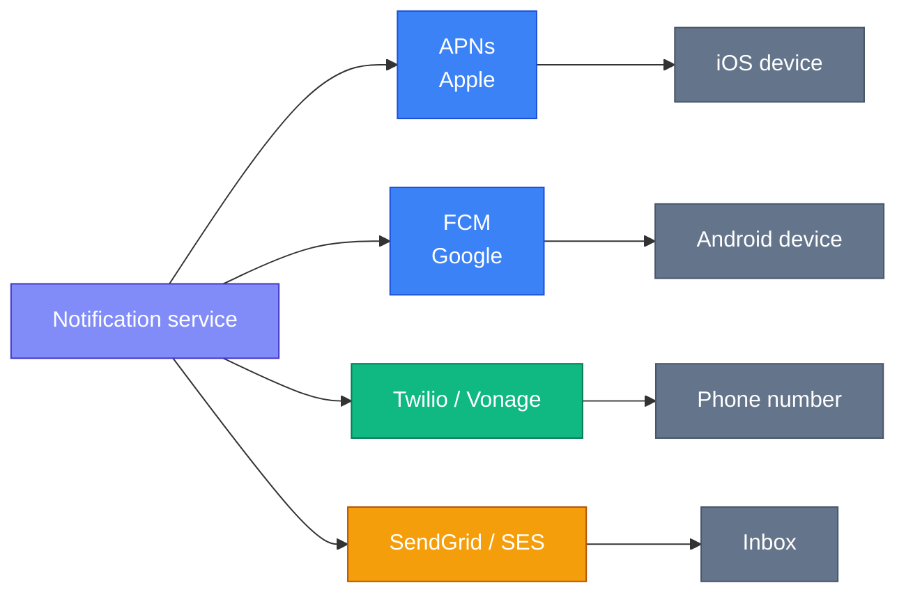
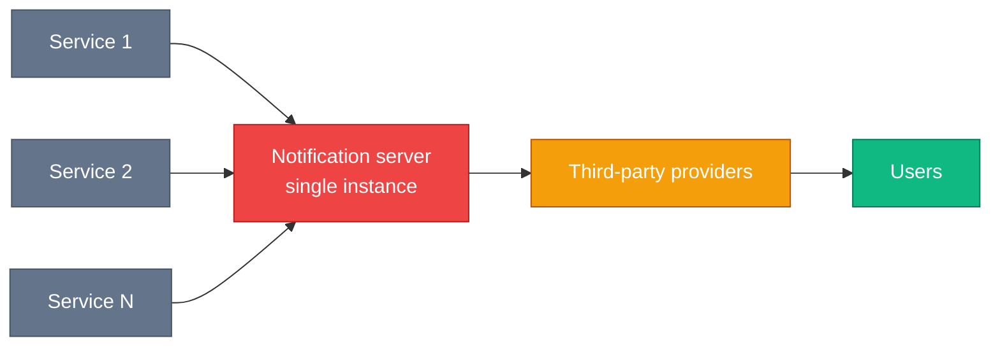
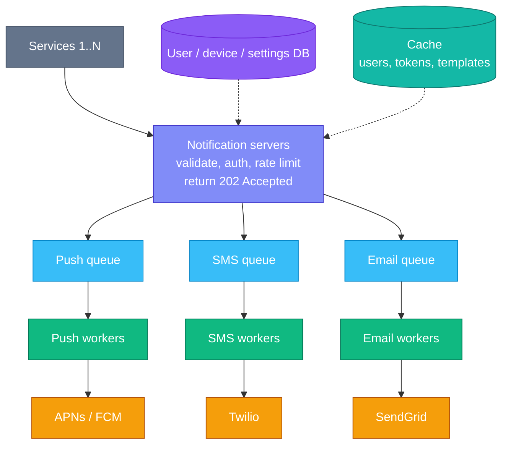
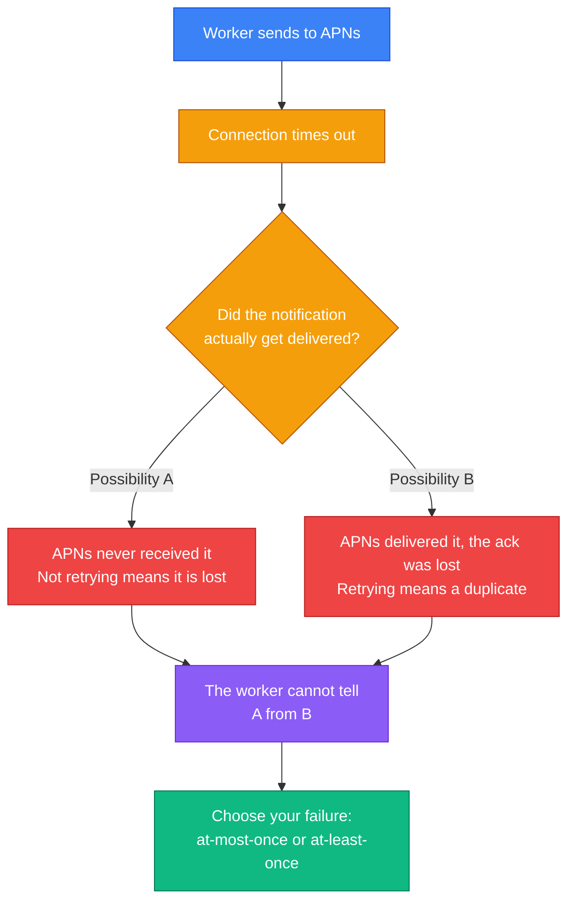
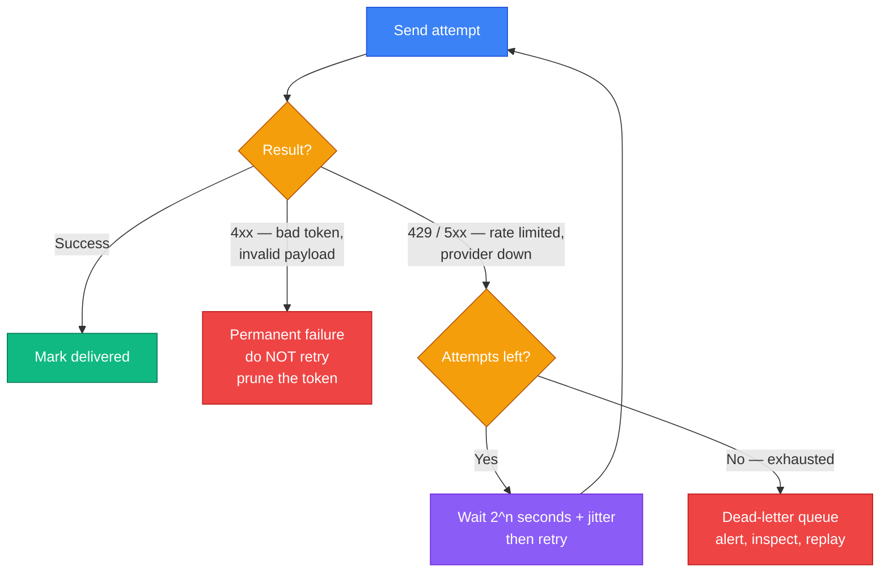
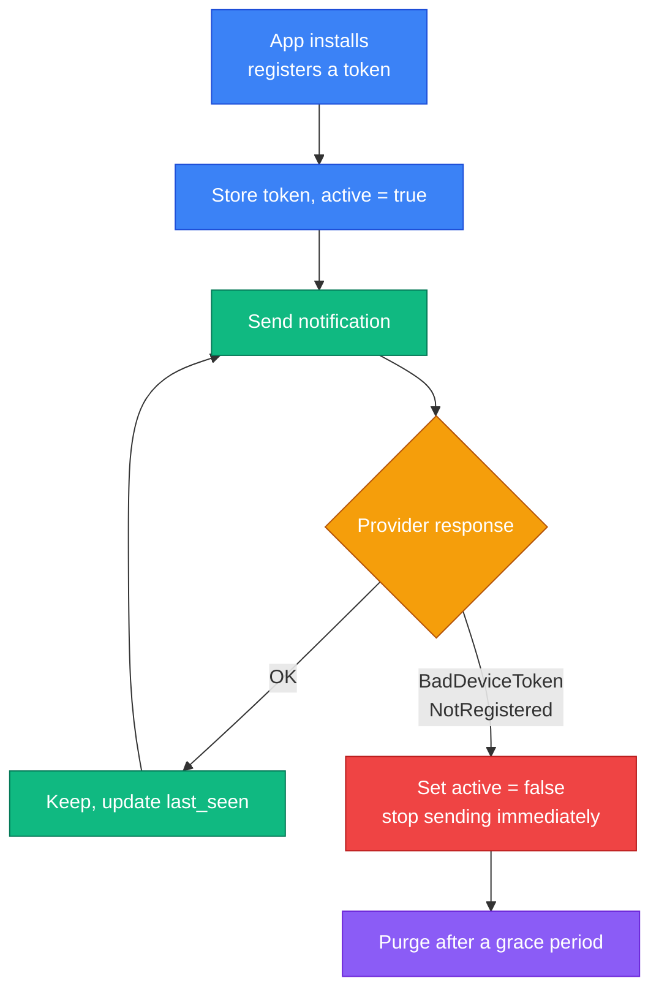
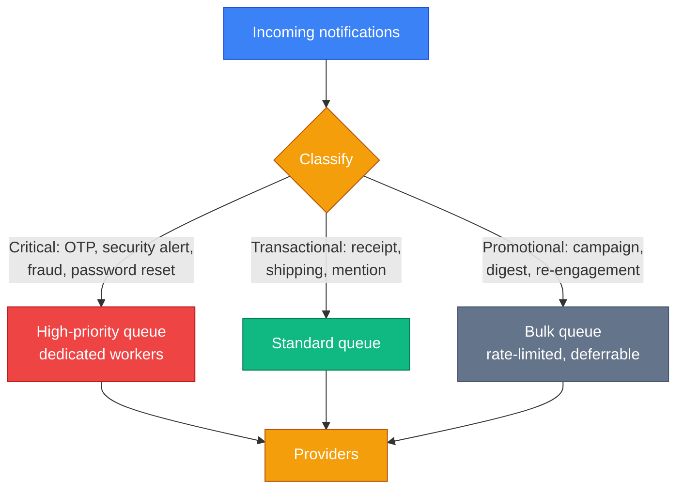

Sending a notification is one HTTP call to Apple or Google. That is the entire mechanism, and you can demo it in five minutes.

The system design question is not about that call. It is about what happens when you make it sixteen million times a day, to devices that may have been wiped, through providers that fail in ways you do not control, for users who will uninstall your app if you get it wrong.

Three problems define the design, and none of them are "how do I send a message":

- **Exactly-once delivery is impossible.** Not difficult — impossible, for a reason worth understanding precisely. So what do you build instead?
- **A quarter of your device tokens are dead** and will never tell you. Your delivery rate decays silently unless you actively prune them.
- **A password-reset code must not queue behind a marketing blast.** One is worthless in ten minutes; the other can wait an hour. Treating them identically is the most common design failure.

---

## Step 1 — Understand the Problem and Establish Scope

> **Candidate:** Which notification types do we support?  
> **Interviewer:** Push notifications, SMS, and email.
>
> **Candidate:** Does it need to be real time?  
> **Interviewer:** Soft real time. As soon as possible, but a slight delay under load is acceptable.
>
> **Candidate:** Which devices?  
> **Interviewer:** iOS, Android, and desktop.
>
> **Candidate:** What triggers a notification?  
> **Interviewer:** Client applications, and server-side scheduled jobs.
>
> **Candidate:** Can users opt out?  
> **Interviewer:** Yes, and opted-out users must stop receiving them.
>
> **Candidate:** What volume?  
> **Interviewer:** 10 million push, 1 million SMS, 5 million emails per day.

### What the volumes actually tell you

16 million a day averages about **185 per second** — unremarkable. That average is a trap, and saying so early is worth a lot.

Notifications are **not** uniformly distributed. They arrive in bursts: a product launch, a football result, a service outage. A campaign to 10 million users is not 185/second, it is *as fast as you can go*, and the system must absorb that spike without dropping anything or melting the third-party providers.

**The design is shaped by burst absorption, not by average throughput.** That is why message queues appear so early below.

The three channels are also wildly different, which the single word "notification" conceals:

| | Push | SMS | Email |
|---|---|---|---|
| Cost per message | Effectively free | **~1000x more than push** | Very cheap |
| Latency | Seconds | Seconds | Seconds to minutes |
| Delivery guarantee | Best effort | Carrier-dependent | Greylisting, spam filters |
| Fails silently when | Token is dead | Number reassigned | Filtered to spam |

The cost column matters. An accidental loop that sends a million extra pushes is embarrassing; a loop that sends a million extra SMS messages is a five-figure incident.

---

## Step 2 — High-Level Design

### How each channel actually works

You never talk to a phone. You talk to a provider that owns a persistent connection to it.



For push you supply a **device token** — a unique identifier for one app installation on one device — plus a JSON payload. APNs or FCM does the rest.

Two consequences follow immediately, and they run through the whole design:

- **Everything past your boundary is someone else's uptime.** You cannot make APNs faster or more reliable. You can only decide how you behave when it misbehaves.
- **Providers are regional.** FCM is unavailable in China, so services there use JPush or similar. Your architecture must let you swap providers per market without redesigning anything.

### Gathering contact information

You cannot notify anyone you have no address for. On signup and app install, collect and store it:

| Table | Fields | Note |
|---|---|---|
| `user` | `id`, `email`, `phone`, `country`, `timezone` | One row per user |
| `device` | `id`, `user_id`, `token`, `platform`, `last_seen`, `active` | **Many rows per user** |

The one-to-many relationship on `device` is the detail to get right. A user with a phone, a tablet and a laptop has three tokens, and a push to that user means three sends. The `active` flag is what makes token pruning possible — more on that below.

### The naive design, and why it fails

Start simple: one notification server that services call, which talks to the providers.



Three problems, and they are the reason the real design looks the way it does:

1. **Single point of failure.** One server means no notifications at all when it dies.
2. **Cannot scale the parts independently.** Rendering an HTML email is CPU work; waiting on APNs is IO wait. Bundling them means scaling both to fix either.
3. **Blocking on third parties.** If SendGrid slows to five seconds a call, that latency backs up into every push notification too. **One slow provider degrades every channel.**

### The improved design

Pull the state out, add queues, and split the work:



**Why a queue per channel, not one shared queue?** This is the highest-value detail in the diagram. Separate queues mean a Twilio outage backs up the SMS queue *only*. Push and email keep flowing. With one shared queue, the stuck channel's messages sit at the head and block everything behind them — the classic head-of-line blocking failure, and it converts one provider's bad day into your total outage.

**Why does the API return `202 Accepted`?** The caller's job is to hand you the event, not to wait while you talk to Apple. Accept it, persist it, acknowledge it, and process asynchronously. Any other choice couples every calling service to your slowest provider.

---

## Step 3 — Design Deep Dive

### Reliability: never lose a notification

The requirement is asymmetric and worth stating precisely: **notifications may be delayed or reordered, but never lost.** That tolerance is what makes queues and retries acceptable answers.

Persist every notification to a log database on receipt, before acknowledging. If a worker dies mid-send, the record survives and can be retried.

### Exactly-once delivery is impossible

Candidates promise this constantly. It cannot be done, and knowing *why* is the strongest moment available in this question.

Consider a worker sending to APNs. It makes the call, and the connection times out.



The worker cannot distinguish "never arrived" from "arrived, acknowledgement lost". No amount of engineering resolves this — it is the [Two Generals' Problem](https://en.wikipedia.org/wiki/Two_Generals%27_Problem), and it is provably unsolvable over an unreliable channel.

So you choose a failure mode:

- **At-most-once** — never retry. You lose notifications. Unacceptable, given the requirement above.
- **At-least-once** — always retry. You sometimes duplicate. **This is the correct choice**, because a duplicate is recoverable and a loss is not.

Then you make duplicates rare with **idempotency**. Every notification carries a unique event ID; before sending, the worker atomically claims it:

```
SET notif:sent:{event_id} 1 NX EX 86400
  -> 1  : this worker claimed it, send now
  -> nil: someone already sent it, discard
```

`NX` makes the check-and-set atomic, which matters because two workers may process the same message concurrently. The TTL bounds memory — after a day, a redelivery is not plausible.

Be honest about what this buys you: it makes duplicates **rare, not impossible**. A crash between the `SET` and the actual send still loses one. The precise claim to make is *at-least-once delivery with best-effort deduplication*, and the receiving app should tolerate a repeat.

### Retries: backoff, jitter, and a dead-letter queue

"Retry on failure" is where the book stops and where real systems get interesting. Retrying immediately, in a tight loop, across a thousand workers, is how you turn a provider's brief wobble into a self-inflicted denial-of-service — and then you get rate-limited on top of it.



Three rules the diagram encodes:

- **Separate permanent from transient failures.** A `400` for a malformed payload will fail identically forever; retrying it wastes quota and delays real work. A `503` will probably succeed in ten seconds.
- **Exponential backoff with jitter.** Without random jitter, every worker that failed at the same instant retries at the same instant — a synchronised thundering herd that re-breaks the provider the moment it recovers.
- **A dead-letter queue, not infinite retries.** After N attempts, park the message somewhere a human can look. Silent infinite retry is how a queue backs up for six hours before anyone notices.

### Device tokens rot, and nobody tells you

This is absent from the textbook treatment and it is the single most common cause of a notification system quietly getting worse.

A device token is invalidated when a user uninstalls the app, wipes the device, restores from a backup, revokes notification permission, or simply leaves the app unopened long enough. **None of these events reach your server.** The user is gone; you keep sending; APNs discards it.

The providers do tell you, but only in the send response:

| Provider | Response | Meaning |
|---|---|---|
| APNs | `410` + `BadDeviceToken` / `Unregistered` | Token is dead |
| FCM | `NotRegistered` / `InvalidRegistration` | Token is dead |



If you never act on those errors, dead tokens accumulate forever. You burn quota on them, your measured delivery rate falls year over year, and every dashboard looks like a slow mysterious regression. **Feed the error response back into the device table.** It is a few lines of code and it is the difference between a system that ages well and one that does not.

### Priority: a one-time password must never queue behind a marketing blast

Also missing from the book, and the failure is severe.

Picture a campaign to 10 million users. Ten million messages enter the push queue. Thirty seconds later, a user requests a password reset. Their code lands at position 10,000,001.

That code is worthless by the time it arrives, and the user cannot log in. Meanwhile nothing is technically broken — no errors, no alerts, queues draining normally.



Separate queues with **dedicated workers**, not just priority ordering within one queue — if bulk work can occupy every worker, priority ordering does not save you. The critical lane should be permanently under-utilised. That idle capacity *is* the feature.

### Not sending is a feature

Users who feel spammed do not opt out of one campaign. They disable notifications entirely, and that is unrecoverable — you have lost the channel for that user permanently.

Four controls, checked before sending:

- **Opt-out per channel and category.** A `notification_setting` row of `(user_id, channel, category, opt_in)`. Check it every time; never cache a stale opt-out.
- **Frequency caps.** A ceiling on promotional messages per user per day. Transactional messages follow real events and are exempt — a receipt should never be suppressed because a marketing cap was hit.
- **Quiet hours, in the user's timezone.** This is why `timezone` is on the user table. A 3am marketing push is how you get uninstalled. Critical alerts override; nothing else does.
- **Digesting.** Twenty likes in an hour is one notification saying "20 people liked your post", not twenty notifications. Batching is a delivery strategy, not just a nicety.

### Templates, security, and observability

- **Templates.** Millions of similar messages differing only in parameters. Store the template, substitute the values. Consistent formatting, fewer mistakes, and marketing can edit copy without a deploy.
- **Security.** The send API must be internal-only or authenticated with `appKey`/`appSecret`. An open notification endpoint is a spam relay wearing your brand.
- **Queue depth is your key metric.** A growing backlog means workers are not keeping up, and it is the leading indicator that predicts a delivery delay *before* users feel it. Alert on the derivative, not just the absolute number.
- **Track the funnel** — sent, delivered, opened, clicked. "Sent" is not "delivered", and the gap between them is exactly where dead tokens and spam filters live.

---

## Interview Quick Reference

**Volumes:** 10M push + 1M SMS + 5M email = 16M/day, ~185/s average — **but bursty**, and the bursts are what you design for.

**The architecture in one line:** thin API returning `202` → per-channel queues → per-channel workers → providers, with the database and cache outside the servers.

**The points that separate a strong answer:**

- **A queue per channel**, so one provider's outage cannot head-of-line block the others.
- **Exactly-once is impossible** — Two Generals. Choose at-least-once, then deduplicate with an idempotency key and `SET NX EX`.
- **Separate permanent from transient failures.** Backoff with **jitter**, then a dead-letter queue.
- **Device tokens rot.** Feed `BadDeviceToken` and `NotRegistered` back into the device table or delivery decays silently.
- **Priority lanes with dedicated workers**, so an OTP never queues behind a 10-million-message campaign.
- **Quiet hours and frequency caps**, because the real failure is the user disabling notifications forever.
- **SMS costs ~1000x push.** A retry bug is expensive in a way a push bug is not.

---

## Summary

| Idea | Why it matters |
|---|---|
| Design for bursts, not averages | 185/s average hides a 10M-message campaign |
| One queue per channel | Isolates a provider outage to one channel |
| Return 202 immediately | Callers must not wait on your slowest provider |
| At-least-once, then dedupe | Exactly-once is provably impossible; loss is worse than duplication |
| Retry with jitter, then a DLQ | Synchronised retries re-break a recovering provider |
| Prune dead tokens | Otherwise delivery rate decays and nothing alerts |
| Priority lanes | An OTP behind a marketing blast is a failure with no error |
| Not sending is a feature | A user who disables notifications is lost for good |

---

## References and Further Reading

**Provider documentation**

- [Sending notification requests to APNs](https://developer.apple.com/documentation/usernotifications/sending-notification-requests-to-apns) — Apple, including the error codes that tell you a token is dead
- [Firebase Cloud Messaging](https://firebase.google.com/docs/cloud-messaging) — Google's equivalent, and its error semantics
- [Twilio Messaging](https://www.twilio.com/docs/messaging) and [SendGrid](https://www.twilio.com/docs/sendgrid) — the SMS and email side

**The theory behind the impossibility**

- [Two Generals' Problem](https://en.wikipedia.org/wiki/Two_Generals%27_Problem) — why exactly-once delivery cannot exist over an unreliable channel
- [You Cannot Have Exactly-Once Delivery](https://bravenewgeek.com/you-cannot-have-exactly-once-delivery/) — Tyler Treat, the clearest practical write-up
- [Idempotency](https://stripe.com/docs/api/idempotent_requests) — Stripe's implementation, the reference design for idempotency keys

**Operating it**

- [Exponential backoff and jitter](https://aws.amazon.com/builders-library/timeouts-retries-and-backoff-with-jitter/) — AWS Builders' Library, on why jitter is not optional
- [Scaling APNs in production](https://bugfender.com/blog/advanced-ios-push-notifications/) — token invalidation and rate limits in practice

**Related chapters**

- [Chapter 4: Design a Rate Limiter](/2026/05/design-a-rate-limiter/) — the per-user frequency caps above
- [Chapter 1: Scale From Zero to Millions of Users](/2026/05/scale-from-zero-to-millions/) — the message-queue decoupling this chapter leans on

**Books**

- *System Design Interview – An Insider's Guide* — Alex Xu. The chapter this article follows.
- *Designing Data-Intensive Applications* — Martin Kleppmann. Chapter 11 on message brokers, and Chapter 8 on why distributed acknowledgements are unreliable.

---

## What's Next?

In **Chapter 11** we design a **news feed system** — where the central decision is whether to compute a user's feed when they write or when they read, and where the answer for a celebrity with 100 million followers is different from the answer for everyone else.

*Notice what carried over. The queues came from Chapter 1, the frequency caps are Chapter 4's rate limiter, and the dedupe key is Chapter 7's unique ID. By this point in the book you are no longer learning new mechanisms — you are learning which ones to reach for.*
