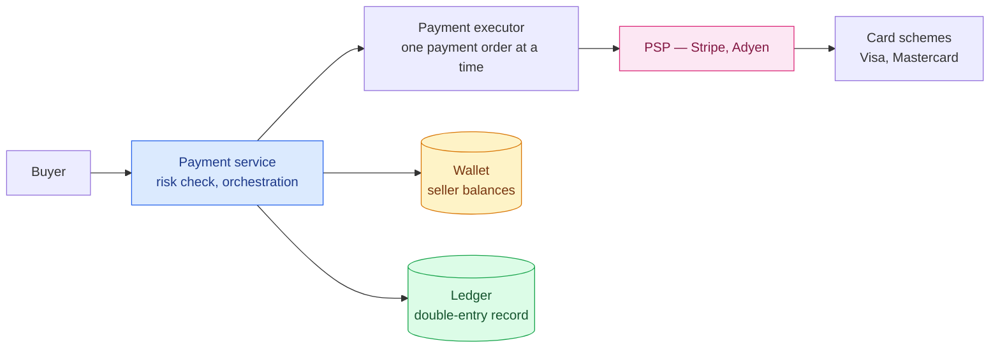
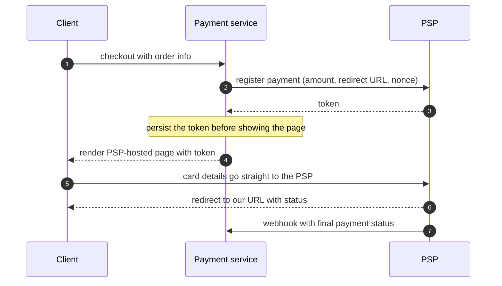
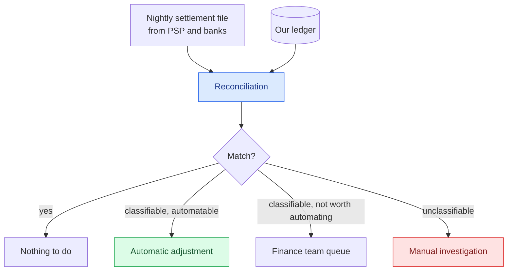
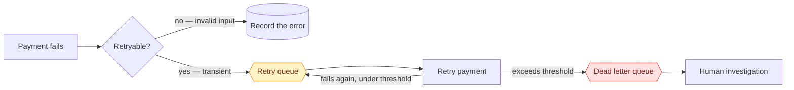

Here is the throughput requirement for a payment backend serving an Amazon-sized store:

```
1,000,000 transactions/day ÷ 100,000 seconds = 10 TPS
```

**Ten transactions per second.** Less than [the hotel reservation system](/2026/06/design-hotel-reservation-system/), which was already the smallest number in this series.

And payments are harder than either. Because the failure mode is not a slow page or a stale metric — it's **charging someone twice**, or taking their money and not paying the seller. There is a real person, a real bank statement, and in many jurisdictions a regulator.

The whole design is about correctness under failure. Throughput never comes up again.

---

## Step 1 — Scope

**What we're building**: a payment backend for an e-commerce site. Credit cards as the example.

**What we're not building**: card processing itself. We use a third-party **Payment Service Provider** — Stripe, Braintree, Adyen — and critically:

> **We do not store card numbers.** PCI DSS compliance is expensive and risky enough that almost everyone hands sensitive card data straight to a PSP.

**Two flows:**

- **Pay-in** — money from the buyer into the platform's account
- **Pay-out** — money from the platform to sellers

**And a requirement that turns out to be central:** a **reconciliation** process that asynchronously verifies payment information is consistent across internal services and external providers.

That last one is not a nice-to-have. It is the acknowledgement, written into the requirements, that **everything else will sometimes be wrong**.

---

## Step 2 — High-level design

### Money doesn't go where you think

The obvious mental model is that a buyer's money goes to the seller. It doesn't.

Money moves from the buyer's card into the **platform's** bank account. The platform holds it as **custodian**. Later — when goods are delivered and conditions are met — the balance moves to the seller.

**Pay-in and pay-out are separate flows, separated in time, and the platform is holding other people's money in between.** That custody period is why the accounting has to be exact.

### The components



**Payment service** orchestrates, and starts with a **risk check** — AML and counter-terrorist-financing compliance, usually via a specialist third party.

**Payment executor** handles a single payment order. One checkout can produce several: buy from three sellers, get three payment orders.

**Wallet** holds seller balances. **Ledger** holds the financial record — and it is the component worth the most attention.

### One small API detail that matters

```json
{
  "seller_account": "acct_123",
  "amount": "129.00",
  "currency": "USD",
  "payment_order_id": "..."
}
```

**`amount` is a string, not a number.**

Floating point cannot represent 0.1 exactly. Different languages and serialisation formats round differently. And the range is enormous — Japan's GDP is about 5 × 10¹⁴ yen; a satoshi is 10⁻⁸ BTC.

**Keep money as a string in transit and storage; parse it only at the moment of calculation or display.** A rounding error that appears in one service and not another is exactly the kind of discrepancy that takes weeks to trace.

The `payment_order_id` is globally unique and doubles as the **idempotency key** the PSP uses to deduplicate. We'll come back to that.

### Choosing a database, on unusual criteria

The selection criteria here are not the ones used anywhere else in this series. Performance is barely mentioned. Instead:

1. **Proven stability** — has it been used by large financial firms for five-plus years with good results?
2. **Tooling** — monitoring and investigation tools, because you *will* be investigating.
3. **The DBA job market** — can you actually hire people who know how to operate it?

The answer is a boring relational database with ACID transactions.

**When correctness dominates, "boring and widely understood" is a technical requirement.** The ability to hire someone who has debugged this exact database before is worth more than better benchmarks.

---

## Double-entry bookkeeping

This is the oldest idea in the design — it predates computing by about five hundred years — and it is the single most important one.

**Every transaction is recorded twice: once as a debit, once as a credit, for the same amount.**

| Account | Debit | Credit |
|---|---:|---:|
| Buyer | $1 | |
| Seller | | $1 |

Which produces the invariant:

> **The sum of all entries must be zero.**

A cent that leaves one account arrives in another. Money is never created or destroyed by a bug — it can only be **misfiled**, and a misfiling is visible because the books still balance while an account looks wrong.

**This is not an accounting convention that engineers must tolerate. It is an error-detection scheme.** A single-entry system that just decrements one balance and increments another can silently lose money if the second write fails. Double-entry makes that impossible to represent: an unbalanced transaction is not a valid transaction.

### Build one

Below is a real double-entry ledger. Run a checkout through it and watch the invariant hold:

<div class="ledger-demo" id="ld"><div class="ld-actions"><button data-a="payin">Buyer pays $100</button><button data-a="fee">Platform takes $10 fee</button><button data-a="payout">Pay seller $90</button><button data-a="refund">Refund $100</button><button data-a="reset" class="ld-sec">Reset</button></div><table class="ld-table"><thead><tr><th>Description</th><th>Account</th><th class="ld-n">Debit</th><th class="ld-n">Credit</th></tr></thead><tbody id="ld-rows"></tbody></table><div class="ld-balances" id="ld-bal"></div><div class="ld-check" id="ld-check"></div></div>
<script>
(function () {
  var root = document.getElementById("ld");
  if (!root) return;
  var rows = [];
  // Each action posts exactly two entries of equal value, so the books
  // cannot be left unbalanced by construction.
  var ACTIONS = {
    payin:  { d: "Buyer pays for order",   a: 100, dr: "Platform cash",  cr: "Seller payable" },
    fee:    { d: "Platform commission",    a: 10,  dr: "Seller payable", cr: "Platform revenue" },
    payout: { d: "Pay-out to seller",      a: 90,  dr: "Seller payable", cr: "Platform cash" },
    refund: { d: "Refund to buyer",        a: 100, dr: "Seller payable", cr: "Platform cash" }
  };
  var rowsEl = document.getElementById("ld-rows"),
      balEl = document.getElementById("ld-bal"),
      checkEl = document.getElementById("ld-check");
  function money(n) { return "$" + n.toFixed(2); }
  function render() {
    if (!rows.length) {
      rowsEl.innerHTML = '<tr><td colspan="4" class="ld-empty">No entries yet — run a checkout above.</td></tr>';
    } else {
      var h = "";
      for (var i = 0; i < rows.length; i++) {
        var r = rows[i];
        h += '<tr class="' + (i % 2 ? "ld-alt" : "") + '"><td>' + (r.first ? r.d : "") + '</td><td class="ld-acct">' + r.acct + '</td>' +
             '<td class="ld-n ld-dr">' + (r.dr ? money(r.amt) : "") + '</td>' +
             '<td class="ld-n ld-cr">' + (r.dr ? "" : money(r.amt)) + '</td></tr>';
      }
      rowsEl.innerHTML = h;
    }
    var bal = {}, td = 0, tc = 0;
    for (var j = 0; j < rows.length; j++) {
      var e = rows[j];
      bal[e.acct] = (bal[e.acct] || 0) + (e.dr ? e.amt : -e.amt);
      if (e.dr) td += e.amt; else tc += e.amt;
    }
    var bh = "";
    Object.keys(bal).forEach(function (k) {
      bh += '<span class="ld-badge"><i>' + k + '</i>' + money(bal[k]) + '</span>';
    });
    balEl.innerHTML = bh || '<span class="ld-badge ld-muted">no balances yet</span>';
    var diff = td - tc;
    checkEl.className = "ld-check " + (diff === 0 ? "ld-ok" : "ld-bad");
    checkEl.innerHTML = "&Sigma; debits " + money(td) + " &minus; &Sigma; credits " + money(tc) +
      " = <b>" + money(diff) + "</b>" + (diff === 0 ? " &nbsp;— balanced" : " &nbsp;— BROKEN");
  }
  root.querySelectorAll(".ld-actions button").forEach(function (b) {
    b.addEventListener("click", function () {
      var k = this.getAttribute("data-a");
      if (k === "reset") { rows = []; render(); return; }
      var a = ACTIONS[k];
      rows.push({ d: a.d, acct: a.dr, amt: a.a, dr: true, first: true });
      rows.push({ d: a.d, acct: a.cr, amt: a.a, dr: false, first: false });
      render();
    });
  });
  render();
})();
</script>

Run **pay-in, fee, pay-out** in order and you end with platform cash at $10, seller payable at $0, and platform revenue at −$10 — the platform holds $10 of cash which it has earned. Every intermediate state balances.

**You cannot break it**, and that's the point. There is no sequence of buttons that produces a non-zero sum, because every action posts two equal entries. The invariant isn't checked afterwards — it's structural.

---

## Step 3 — Deep dive

### The hosted payment page

Since we don't touch card numbers, the PSP supplies the form.



Two details are load-bearing.

**The nonce.** A UUID — usually the payment order ID — ensuring the payment is registered exactly once. It becomes the PSP's idempotency key, so a repeated registration returns the original rather than creating a second charge.

**The token is persisted before the page renders.** If you show the payment page and *then* try to save the token, a crash in between leaves a payment the user can complete and you have no record of.

**Write down what you're about to do before you do it.** The same instinct as a write-ahead log.

### Reconciliation

All nine steps of that flow can fail. There is no retry strategy that covers every case, and asynchronous communication guarantees nothing.

So: **every night, the PSP and the banks send a settlement file** — the account balance plus every transaction of the day. A reconciliation process parses it and compares against the ledger.



Note the three tiers of mismatch, and that **two of them end at a human**. Not every discrepancy is worth automating; some aren't understood well enough to automate.

Reconciliation also runs **internally** — the ledger and the wallet can diverge, and nothing else would notice.

> **Reconciliation is the last line of defence**, and its existence is an admission: in a system spanning multiple companies over unreliable networks, you cannot prevent every inconsistency. You can only guarantee you'll **find** it.

### Exactly-once, decomposed

The worst thing a payment system can do is charge someone twice. So payments must execute **exactly once**, which sounds impossible — until you split it:

> **exactly-once = at-least-once + at-most-once**

And each half has a well-understood mechanism.

**At-least-once is retry.** A payment fails on a flaky network; you retry until it succeeds. Strategies range from immediate retry to **exponential backoff** — 1s, 2s, 4s — which is the right default when the problem is unlikely to clear quickly. Aggressive retries waste resources and can push a struggling service over.

**At-most-once is idempotency.** The client generates an **idempotency key** — a UUID, often the shopping cart ID — and sends it in the HTTP header. The server makes it a **primary key**:

1. Try to insert a row keyed by the idempotency key.
2. Insert succeeds → new request, process it.
3. Insert fails on the unique constraint → **already seen**, return the previous result.

**The database's unique constraint does the deduplication.** Not application logic that might have a race — a structural guarantee, exactly as in [the reservation chapter](/2026/06/design-hotel-reservation-system/).

Concurrent requests with the same key: one is processed, the rest get `429 Too Many Requests`.

And the same idea protects the second scenario — the PSP charged the card but the response never arrived. The retry sends the **same nonce**, so the PSP returns the original result rather than charging again. **Idempotency has to hold across the boundary, not just inside it.**

### Failed payments



**Classify before retrying.** A transient network error deserves a retry; an invalid card number will fail identically forever, and retrying it is pure waste.

The **dead letter queue** is where messages go after repeated failure — isolated for inspection rather than discarded or retried endlessly.

### Synchronous or asynchronous?

**Synchronous** is simpler and degrades badly: one slow service slows everything, a PSP failure breaks the client's response, and there's no buffer for a traffic spike.

**Asynchronous** splits into two shapes:

- **Single receiver** — a shared queue, message consumed once. Right for "execute this payment".
- **Multiple receivers** — Kafka, where the same message is read by several consumers independently. Right for a completed payment that must reach notifications, analytics and billing.

At payment scale with many third-party dependencies, **asynchronous wins** — trading design simplicity for scalability and failure isolation.

### Consistency across five stateful things

Payment service, ledger, wallet, PSP, and database replicas. Any pair can lose contact.

**Internally**, exactly-once processing is the tool. **Externally**, idempotency plus reconciliation — and the design says something worth repeating:

> Even if an external service supports idempotent APIs, **reconciliation is still needed, because we shouldn't assume the external system is always right.**

Replication lag gets two options: serve everything from the primary (simple, wastes replicas), or use consensus — Raft, or a consensus-based database like CockroachDB or YugabyteDB.

---

## What has changed since the book

### Authentication became mandatory in Europe

3D Secure appears here as an occasional extra step. In the EU and UK it is **required**.

**PSD2** mandates **Strong Customer Authentication** for remote electronic card payments: at least two independent factors from something the cardholder **knows**, **has**, or **is**. **EMV 3DS2** is the mechanism that satisfies it for card-not-present transactions, and it applies across all 27 EU states plus Iceland, Liechtenstein and Norway.

The interesting part for a designer is the **exemptions**, because they're where the friction goes:

- **Low value** — under €30, with cumulative caps
- **Recurring payments** — SCA on the first charge, exempt thereafter
- **Trusted merchants** — customers whitelist you
- **Transaction risk analysis** — low-risk transactions, judged by the PSP's fraud engine

That last one is the important one architecturally. **The lower your fraud rate, the more transactions you may push through without a challenge** — so fraud performance becomes a *conversion* lever, not just a loss-prevention one. Regulation reshaped the incentive.

### The double-entry ledger became a product category

Square's immutable double-entry accounting service was cited as an example of building one. There are now databases that do nothing else.

**TigerBeetle** is an OLTP database built exclusively for double-entry accounting. It doesn't have tables you design — it has **accounts and transfers**, with the debit/credit schema native. Strict serializability, deterministic execution, no deletes and no history rewriting — which, as its own documentation observes, is exactly what auditors want. It targets on the order of **a million transfers per second**, which is five orders of magnitude beyond the 10 TPS here.

Why it exists is more interesting than what it does. General-purpose databases spend enormous effort on flexible schemas and arbitrary queries. **A ledger needs neither.** It needs two entity types, one invariant, and absolute certainty. Narrowing the problem that far buys correctness guarantees and performance a general database cannot match.

The same instinct as [the message queue's append-only log](/2026/06/design-distributed-message-queue/): when the access pattern is narrow enough, a purpose-built store beats a general one on every axis at once.

### Network tokens replaced stored card numbers

Not storing card numbers has gone further. **Network tokens**, issued by the card schemes themselves, replace the card number with a merchant-specific token that **updates automatically when the card is reissued**.

A card expiring used to break every subscription on it. With network tokens, the token survives and authorisation rates improve measurably. **Tokenisation stopped being purely a security measure and became a revenue one.**

### Idempotency keys have subtleties worth knowing

The design uses a database unique constraint, which is right. Production implementations add two things:

**Store the response, not just the key.** A constraint violation tells you the request is a duplicate but not what happened the first time. Stripe stores the original response and replays it, so a retry gets the original charge ID rather than an error.

**Expire keys.** Stripe's last 24 hours. Keys kept forever become an unbounded table, and a key reused months later almost certainly means a different intent.

---

## What to take away

**Throughput is not the problem; correctness under failure is.** Ten transactions per second, and this is among the hardest designs in the series. When money is involved, the interesting number is how many ways a request can half-succeed.

**Double-entry is an error-detection scheme, not accounting bureaucracy.** Sum-to-zero means a lost cent is structurally impossible to represent. Single-entry can silently lose money when the second write fails; double-entry cannot express that state.

**exactly-once = at-least-once + at-most-once.** Retry gives the first, idempotency the second. Neither is sufficient alone, and the combination has to hold across every boundary — including the PSP's.

**Let the database enforce uniqueness.** An idempotency key as a primary key turns deduplication from application logic with a race window into a structural guarantee.

**Money is a string until you need to do arithmetic.** Floating point cannot represent 0.1, different runtimes round differently, and the range spans satoshis to national GDPs.

**Assume you will be inconsistent, and build the thing that finds it.** Reconciliation exists because prevention is impossible across companies and unreliable networks. Two of its three mismatch categories end at a human, and that's the correct design.

**"Boring and widely understood" can be a technical requirement.** Choosing a database on proven stability, tooling maturity, and whether you can hire a DBA is the right call when the cost of an unusual failure is money someone actually lost.

---

## References and Further Reading

**Payments**

<ul>
<li><a href="https://docs.stripe.com/api/idempotent_requests">Stripe idempotent requests</a> — the reference implementation, including key expiry</li>
<li><a href="https://docs.stripe.com/api">Stripe API reference</a> · <a href="https://developer.paypal.com/api/rest/">PayPal REST APIs</a></li>
<li><a href="https://stripe.com/guides/strong-customer-authentication">Strong Customer Authentication</a> — PSD2, SCA and the exemptions</li>
<li><a href="https://en.wikipedia.org/wiki/3-D_Secure">3-D Secure</a> · <a href="https://www.pcisecuritystandards.org/">PCI Security Standards Council</a></li>
<li><a href="https://en.wikipedia.org/wiki/ISO_4217">ISO 4217</a> — currency codes</li>
</ul>

**Ledgers and accounting**

<ul>
<li><a href="https://en.wikipedia.org/wiki/Double-entry_bookkeeping">Double-entry bookkeeping</a> — five centuries old and still the answer</li>
<li><a href="https://docs.tigerbeetle.com/concepts/debit-credit/">TigerBeetle: debit/credit as the schema for OLTP</a></li>
<li><a href="https://jepsen.io/analyses/tigerbeetle-0.16.11">Jepsen analysis of TigerBeetle</a></li>
</ul>

**Reliability**

<ul>
<li><a href="https://en.wikipedia.org/wiki/Idempotence">Idempotence</a> · <a href="https://en.wikipedia.org/wiki/Exponential_backoff">Exponential backoff</a></li>
<li><a href="https://en.wikipedia.org/wiki/Dead_letter_queue">Dead letter queue</a></li>
<li><a href="https://www.cockroachlabs.com/">CockroachDB</a> · <a href="https://www.yugabyte.com/">YugabyteDB</a> · <a href="https://raft.github.io/">Raft</a></li>
</ul>

**In this series**

<ul>
<li><a href="/guide/">The complete guide</a> — every article in order</li>
<li><a href="/2026/06/design-hotel-reservation-system/">Design a Hotel Reservation System</a> — idempotency keys and unique constraints</li>
<li><a href="/2026/06/design-distributed-message-queue/">Design a Distributed Message Queue</a> — exactly-once as a transaction boundary</li>
<li><a href="/2026/06/design-ad-click-aggregation/">Ad Click Event Aggregation</a> — reconciliation as the correctness backstop</li>
</ul>
