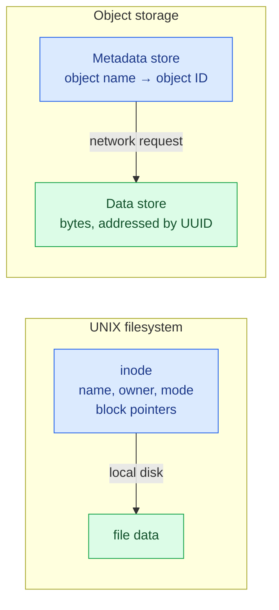
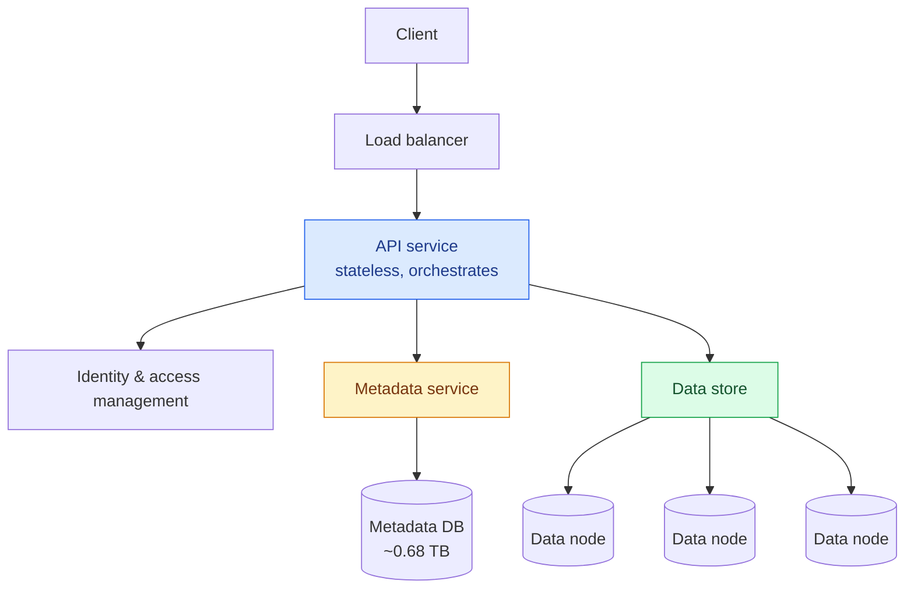
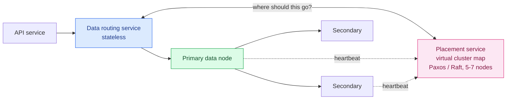
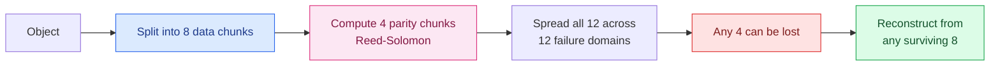

Amazon S3 launched in 2006. By 2013 it held two trillion objects; by 2021, **over a hundred trillion**.

It is the substrate under a remarkable amount of this series — [routing tiles](/2026/06/design-google-maps/), [video segments](/2026/06/design-youtube/), [email attachments](/2026/06/design-distributed-email-service/), [Kafka's tiered storage](/2026/06/design-distributed-message-queue/). Every time an earlier design said "put it in object storage and forget about it," this is what it was leaning on.

So the interesting question is: **how do you promise eleven nines of durability on hardware that fails constantly?**

---

## Storage 101

Three kinds of storage, and the distinctions matter.

**Block storage** came first, in the 1960s. It hands the server **raw blocks** — a volume with no structure. The server formats it, or an application manages the blocks directly to extract every drop of performance. Databases and VM engines do exactly that. Fastest and most flexible; also the most work.

**File storage** is built on block storage and adds a **hierarchical directory structure**. Files and folders, shared over NFS or SMB. The general-purpose answer, and the reason it's ubiquitous inside organisations.

**Object storage** is the newcomer, and it makes a **deliberate trade: it sacrifices performance for durability, scale, and cost.** Data lives as objects in a **flat** structure — no directories — accessed over a RESTful API. It targets relatively cold data.

| | Block | File | Object |
|---|---|---|---|
| **Mutable** | ✓ | ✓ | ✗ — replace whole, never edit |
| **Cost** | High | Medium–high | **Low** |
| **Performance** | Very high | Medium–high | Low–medium |
| **Access** | iSCSI, FC | NFS, SMB | RESTful API |
| **Scalability** | Medium | High | **Vast** |

**Immutability is the design's foundation.** You can delete an object or replace it entirely, but you cannot change part of it. That single constraint is what makes everything else — replication, erasure coding, deduplication, aggressive caching — dramatically simpler. Nothing you have already written can change underneath you.

---

## Step 1 — Scope

**Features**: create buckets, upload and download objects, object versioning, list objects in a bucket.

**Scale**: 100 PB in a year. **Six nines of durability** (99.9999%), **four nines of availability** (99.99%).

Both tiny objects (tens of KB) and enormous ones (several GB) must work well.

### The estimate

Object storage bottlenecks on either **disk capacity** or **IOPS**. Assume 20% small objects (<1 MB), 60% medium (1–64 MB), 20% large (>64 MB), and a 40% storage usage ratio:

```
100 PB = 10¹¹ MB
weighted average object ≈ 0.2(0.5) + 0.6(32) + 0.2(200) = 59.3 MB
objects ≈ 10¹¹ × 0.4 / 59.3 ≈ 0.68 billion
metadata at 1 KB each ≈ 0.68 TB
```

**680 million objects, and only 0.68 TB of metadata.** Note the asymmetry: 100 petabytes of data, well under a terabyte of metadata. They are different problems and want different systems — which is exactly how the design splits.

---

## Step 2 — High-level design

### The properties that shape everything

**Objects are immutable.** Replace or delete, never edit in place.

**It's a key-value store.** The object URI is the key; the bytes are the value.

**Write once, read many.** LinkedIn measured **95% of requests as reads**.

### The inode analogy

The cleanest way to see the architecture is by analogy with the UNIX filesystem.

When you save a file locally, the **name and the data are stored separately**. The name lives in an **inode**, along with pointers to the disk blocks holding the content.

Object storage does the same thing across a network:



The payoff is a clean split of responsibilities:

- The **data store** holds **immutable** bytes, addressed only by UUID. It never knows an object's name.
- The **metadata store** holds **mutable** data — names, versions, permissions.

**Separating the mutable index from the immutable payload lets you build and optimise each independently.** The data store can be tuned purely for durability and sequential throughput; the metadata store purely for query patterns.

### Architecture



Uploading walks through it: create the bucket (metadata write), then `PUT` the object — the API service checks permissions, sends the bytes to the data store which returns a **UUID**, then writes a metadata row mapping `(bucket, object_name) → UUID`.

Downloading reverses it: resolve the name to a UUID in the metadata store, then fetch bytes by UUID from the data store.

---

## Step 3 — Deep dive

### Inside the data store



The **placement service** decides which nodes hold which object, maintaining a **virtual cluster map** of the physical topology — which node is in which rack, in which data centre. That topology awareness is what keeps replicas **physically separated**, and physical separation is what durability actually rests on.

It's run as a **5 or 7 node cluster using Paxos or Raft**, so it survives losing a minority of its members. If a data node misses heartbeats for 15 seconds, it's marked down.

**A service that everything depends on must not be a single point of failure — so it gets consensus, and an odd number of nodes.**

### The consistency-latency dial

When does a write count as done?

| | Waits for | Consistency | Latency |
|---|---|---|---|
| All three | primary + both secondaries | Strongest | Highest — you wait for the slowest |
| Quorum | primary + one secondary | Medium | Medium |
| Primary only | primary | Weakest | Lowest |

The same dial as [the message queue's ack levels](/2026/06/design-distributed-message-queue/), doing the same job for the same reason.

### Small files waste disks

Here's a genuinely non-obvious problem.

The obvious implementation is **one file per object**. It works, and it fails badly on small objects, for two reasons.

**Block waste.** Filesystems allocate in fixed blocks, typically 4 KB. A 500-byte object still consumes a whole block. Millions of small objects waste most of the space they occupy.

**Inode exhaustion.** The number of inodes is fixed when a volume is formatted. Millions of tiny files can exhaust them — at which point the disk reports "full" with space remaining.

**The fix is to stop treating objects as files.** Append many small objects into one large file, exactly like a write-ahead log. When the read-write file hits a few GB it is **sealed read-only**, and a new one takes over.

```
read-only /data/a    read-only /data/b    read-write /data/c
[obj][obj][obj]      [obj][obj][obj]      [obj][obj][obj] ← appends here
```

Which raises the obvious question: with thousands of objects inside one file, how do you find one? A lookup table per node:

| object_id | file_name | start_offset | object_size |
|---|---|---|---|
| `30a3e98e…` | `/data/c` | `0x25283` | 512 |

**And where does that table live?** RocksDB is fast to write, slower to read; a relational engine on a B+ tree is the reverse. The access pattern is **write once, read many** — so the read-optimised choice wins.

Then the elegant part: **this mapping is local to one node.** Nothing else needs it. So rather than a shared cluster, put a small **SQLite** file on each data node. A distributed problem that turned out not to be distributed at all.

> **Before designing a distributed system for something, check whether the data actually needs to be shared.** Per-node state that nobody else reads should stay per-node.

### Durability: replication or erasure coding?

Now the heart of it.

**Replication.** Store three copies on three separate failure domains. With an annual drive failure rate of 0.81%, losing all three is `0.0081³` — about **six nines**. Simple, fast, and it costs **200% overhead**: 3 TB of disk for 1 TB of data.

**Erasure coding** does something cleverer. Split the data into `k` chunks, compute `m` parity chunks with Reed-Solomon, and spread all `k+m` across separate failure domains. Any `k` of them can reconstruct the original.



An (8+4) scheme stores 12 chunks for 8 chunks of data — **50% overhead** instead of 200%.

### Work out the trade yourself

Erasure coding is usually presented as strictly better: cheaper *and* more durable. That isn't true, and the calculator shows why:

<div class="dur-calc" id="du"><div class="du-label">SCHEME</div><div class="du-opts" id="du-opts"><button data-v="r2">2-copy</button><button data-v="r3" class="on">3-copy</button><button data-v="4-2">(4+2)</button><button data-v="6-3">(6+3)</button><button data-v="8-4">(8+4)</button><button data-v="10-4">(10+4)</button><button data-v="12-4">(12+4)</button></div><div class="du-grid"><div class="du-stat"><span class="du-num" id="du-over">—</span><span class="du-lbl">Storage overhead</span></div><div class="du-stat"><span class="du-num" id="du-tol">—</span><span class="du-lbl">Failures tolerated</span></div><div class="du-stat"><span class="du-num" id="du-read">—</span><span class="du-lbl">Nodes read per fetch</span></div><div class="du-stat du-hot"><span class="du-num" id="du-nines">—</span><span class="du-lbl">Nines of durability</span></div></div><div class="du-bar"><div class="du-bar-fill" id="du-fill"></div><div class="du-bar-txt" id="du-bartxt"></div></div><p class="du-note" id="du-note"></p></div>
<script>
(function () {
  var root = document.getElementById("du");
  if (!root) return;
  var P = 0.0081; // annual drive failure rate
  function comb(n, k) { var r = 1; for (var i = 0; i < k; i++) r = r * (n - i) / (i + 1); return r; }
  var schemes = {
    r2:    { label: "2-copy replication", n: 2, tol: 1, over: 100, read: 1, rep: true },
    r3:    { label: "3-copy replication", n: 3, tol: 2, over: 200, read: 1, rep: true },
    "4-2": { label: "(4+2) erasure coding", n: 6, tol: 2, over: 50, read: 4, k: 4, m: 2 },
    "6-3": { label: "(6+3) erasure coding", n: 9, tol: 3, over: 50, read: 6, k: 6, m: 3 },
    "8-4": { label: "(8+4) erasure coding", n: 12, tol: 4, over: 50, read: 8, k: 8, m: 4 },
    "10-4":{ label: "(10+4) erasure coding", n: 14, tol: 4, over: 40, read: 10, k: 10, m: 4 },
    "12-4":{ label: "(12+4) erasure coding", n: 16, tol: 4, over: 33, read: 12, k: 12, m: 4 }
  };
  var cur = "r3";
  var over = document.getElementById("du-over"), tol = document.getElementById("du-tol"),
      read = document.getElementById("du-read"), nines = document.getElementById("du-nines"),
      fill = document.getElementById("du-fill"), bartxt = document.getElementById("du-bartxt"),
      note = document.getElementById("du-note");
  function pLoss(s) {
    var p = 0;
    for (var i = s.tol + 1; i <= s.n; i++) p += comb(s.n, i) * Math.pow(P, i) * Math.pow(1 - P, s.n - i);
    return p;
  }
  function render() {
    var s = schemes[cur], pl = pLoss(s), nn = -Math.log10(pl);
    over.textContent = s.over + "%";
    tol.textContent = s.tol;
    read.textContent = s.read;
    nines.textContent = nn.toFixed(1);
    var pct = Math.max(4, Math.min(100, (nn / 8) * 100));
    fill.style.width = pct + "%";
    bartxt.textContent = s.label;
    var base = -Math.log10(pLoss(schemes.r3));
    var msg;
    if (cur === "r3") msg = "The baseline. Three full copies — simple, fast to read, and you pay for three times the disk you use.";
    else if (cur === "r2") msg = "Cheaper than three copies and a full two nines worse. Two copies tolerate only one failure.";
    else if (nn < base) msg = "Cheaper than 3-copy — and less durable. It tolerates the same two failures but spreads across six nodes, so there are simply more ways to lose enough of them. Erasure coding is not automatically safer.";
    else msg = "Cheaper than 3-copy and more durable. Wider stripes win on both axes — the price is that every read must gather " + s.read + " nodes instead of 1.";
    note.textContent = msg;
  }
  var btns = root.querySelectorAll("#du-opts button");
  for (var i = 0; i < btns.length; i++) {
    btns[i].addEventListener("click", function () {
      for (var k = 0; k < btns.length; k++) btns[k].classList.remove("on");
      this.classList.add("on");
      cur = this.getAttribute("data-v");
      render();
    });
  }
  render();
})();
</script>

The result worth pausing on: **(4+2) is cheaper than 3-copy replication and *less* durable.** Both tolerate exactly two failures, but (4+2) spreads across six nodes rather than three — more nodes means more ways to lose three of them.

You need a **wider stripe** — (8+4) — before erasure coding wins on both cost and durability. And then the cost appears elsewhere: a replicated read touches **one** node, while an (8+4) read must gather **eight**.

That's the real trade, and it isn't "cheaper versus safer":

| | Replication | Erasure coding |
|---|---|---|
| **Storage** | 200% overhead | 33–50% overhead |
| **Read path** | One node | k nodes, always |
| **CPU** | None | Parity computation on every write |
| **Degraded reads** | Serve from another replica | Reconstruct before responding |

**Replication wins on latency; erasure coding wins on cost.** Which is why replication dominates hot paths and erasure coding dominates archives — and why this design uses replication while noting the alternative.

*(The calculator assumes independent annual drive failures, the same simple model that gives 3-copy its six nines. Published figures using repair-time models come out considerably higher, because a failed drive is replaced in hours rather than left dead for a year.)*

### Corruption you can't see

A dead disk is easy — you notice, and you rebuild. **Silent corruption is worse**: a bit flips in memory or on the wire and the data is wrong while looking fine.

The answer is **checksums** at every process boundary. Append a checksum to each object, and a checksum of the whole file when it's sealed read-only. On read: fetch data and checksum, recompute, compare. Mismatch means reconstruct from elsewhere.

**Durability is not only about surviving failures you can detect.** Replication happily preserves corrupted data forever unless something checks.

### Listing objects in a bucket

Buckets are **flat** — there are no directories. The hierarchy you see is a convention: `s3://mybucket/abc/d/e/file.txt` has bucket `mybucket` and object name `abc/d/e/file.txt`. Slashes are just characters.

Listing works by **prefix**, and it's easy with one database:

```sql
SELECT * FROM object
WHERE bucket_id = '123' AND object_name LIKE 'abc/%'
ORDER BY object_name OFFSET 0 LIMIT 10
```

Sharding breaks it. The object table is sharded by `hash(bucket_name, object_name)` — right for lookups, which are always by URI, and wrong for listing, because matching objects are scattered across every shard.

You can query all shards and merge, but **pagination becomes miserable**: each shard returns a different number of matches, so the server must track a separate offset per shard inside the cursor. With hundreds of shards, that's hundreds of offsets.

The solution is to notice what the product actually requires: **object storage is tuned for scale and durability, and listing is rarely the hot path.** Every commercial object store has comparatively slow listing. So **denormalise into a separate listing table sharded by bucket ID**, used only for listing. Slower than a perfect index, and it turns a hundred-shard scatter-gather into a single-shard query.

**When a query fights your sharding scheme, check whether it's important enough to reshape the design.** Often the honest answer is to give it its own slow, simple path.

### Versioning

Rather than overwriting metadata, insert a **new row with the same `(bucket, object_name)` but a new `object_id` and `object_version`**. Version is a `TIMEUUID`, so the current version is simply the largest one.

Deleting inserts a **delete marker** — a new version that happens to mean "gone". A `GET` returns 404, and every earlier version is still there.

**Immutable data plus an append-only metadata log means "delete" is a write.** Nothing is destroyed until garbage collection decides to reclaim it.

### Multipart upload

A 5 GB upload over a flaky connection will fail, and restarting from zero is unacceptable.

Split it: initiate an upload to get an `uploadID`, send parts independently — each returning an **ETag** (an MD5 of that part) — then send a completion request listing every part number and ETag. The store reassembles.

Failed parts are retried individually. And the leftover parts after reassembly become garbage, which is why the design needs a collector.

### Garbage collection

Three sources of garbage: **lazily deleted objects**, **orphaned data** from abandoned uploads, and **corrupted data** that failed checksum verification.

Collection is **compaction**: copy live objects from sealed files into a new file, skipping anything flagged deleted, then update the mapping table — in a transaction, so the location never disagrees with reality.

The collector waits until there are many read-only files to compact, so it doesn't create a pile of small ones. **Which would recreate the exact problem the whole file-packing scheme was built to avoid.**

---

## What has changed since the book

### S3 is strongly consistent — and that table is out of date

The comparison table above, reproduced from the standard treatment, lists object storage as **eventually consistent**. That has been wrong since **December 2020**.

S3 now provides **strong read-after-write consistency**, in AWS's words: "After a successful write of a new object, or an overwrite or delete of an existing object, any subsequent read request immediately receives the latest version of the object."

It covers **all GET, PUT and LIST operations**, plus tag, ACL and metadata changes — in every region, for every object, **at no additional cost and with no performance penalty**.

That matters more than a footnote suggests. Eventual consistency forced an entire generation of workarounds: data pipelines that slept before reading, "S3 consistency layers" like S3Guard maintaining a separate consistent index, and a standing warning never to read-after-write. **All of that machinery evaporated.** If you learned S3 before 2021, this is the single most important thing to unlearn.

### Object storage stopped being slow

The premise here — object storage trades performance for cost and durability — is weakening.

**S3 Express One Zone**, announced in late 2023, delivers **consistent single-digit millisecond** request latency: roughly **10× faster data access** than S3 Standard with **50% lower request costs**, in exchange for living in a single availability zone.

The trade is explicit and inverted: you give up multi-AZ redundancy to get latency. Object storage as a **primary** store for latency-sensitive work, rather than an archive.

### Conditional writes made S3 a coordination primitive

In August 2024, S3 gained **conditional writes**:

- **`If-None-Match: *`** — write only if the key does not exist. A losing writer gets `412 Precondition Failed`.
- **`If-Match: <etag>`** — write only if the object still has the ETag you read. A **compare-and-swap**.

That second one is more significant than it looks. Compare-and-swap is the primitive you build locks and atomic commits from, and it is **exactly the mechanism the reservation chapter needed** to avoid double booking. S3 now offers it natively.

This is why open table formats — Iceberg, Delta Lake — can commit safely to object storage without a separate coordination service. **The store became a coordination primitive, not just a bucket of bytes.**

### Erasure coding won for cold data

The design "mainly focuses on replication," noting erasure coding complicates the data node considerably. That was the right call for a chapter and is no longer how large systems are built: erasure coding is standard for anything not latency-critical, and hyperscalers use wider stripes than (8+4) — the arithmetic in the calculator explains why. Every extra data chunk at fixed parity lowers overhead, and only wider stripes recover the durability that spreading over more nodes costs you.

---

## What to take away

**Immutability is what makes the rest tractable.** Objects can be replaced but never edited, so nothing you've written can change beneath you. Replication, erasure coding, deduplication and caching all become dramatically simpler.

**Separate the mutable index from the immutable payload.** 100 PB of data and 0.68 TB of metadata are different problems with different access patterns. Splitting them lets each be optimised alone.

**Erasure coding is not automatically better.** (4+2) is cheaper than 3-copy *and less durable* — same failures tolerated, twice as many nodes to lose them on. You need a wide stripe to win on both, and even then every read gathers k nodes instead of one.

**Check whether a distributed problem is actually distributed.** The object-to-offset mapping looked like it needed a cluster. It's local to one node, so a SQLite file per node does the job.

**When a query fights your sharding scheme, give it its own path.** Listing scattered across every shard makes pagination miserable. A separate denormalised table sharded by bucket is slower in theory and vastly simpler in practice — and listing was never the hot path.

**Durability includes corruption you can't see.** Replication faithfully preserves corrupted bytes. Only checksums at every boundary turn "we still have the data" into "we still have the *right* data".

---

## References and Further Reading

**Storage fundamentals**

<ul>
<li><a href="https://en.wikipedia.org/wiki/Erasure_code">Erasure coding</a> · <a href="https://en.wikipedia.org/wiki/Reed%E2%80%93Solomon_error_correction">Reed–Solomon error correction</a></li>
<li><a href="https://www.backblaze.com/blog/cloud-storage-durability/">Cloud storage durability</a> — Backblaze's calculation, including repair time</li>
<li><a href="https://en.wikipedia.org/wiki/Inode">inode</a> · <a href="https://en.wikipedia.org/wiki/Checksum">Checksum</a> · <a href="https://en.wikipedia.org/wiki/B%2B_tree">B+ tree</a></li>
<li><a href="https://en.wikipedia.org/wiki/Fibre_Channel">Fibre Channel</a> · <a href="https://en.wikipedia.org/wiki/ISCSI">iSCSI</a> · <a href="https://en.wikipedia.org/wiki/Network_File_System">NFS</a> · <a href="https://en.wikipedia.org/wiki/Server_Message_Block">SMB</a></li>
</ul>

**S3 and its evolution**

<ul>
<li><a href="https://aws.amazon.com/s3/consistency/">S3 strong consistency</a> — the correction that matters most</li>
<li><a href="https://aws.amazon.com/about-aws/whats-new/2023/11/amazon-s3-express-one-zone-storage-class">S3 Express One Zone</a> — single-digit millisecond object storage</li>
<li><a href="https://docs.aws.amazon.com/AmazonS3/latest/userguide/conditional-writes.html">S3 conditional writes</a> — If-None-Match and If-Match</li>
<li><a href="https://aws.amazon.com/s3/sla/">S3 service level agreement</a></li>
</ul>

**Real implementations**

<ul>
<li><a href="https://docs.ceph.com/en/latest/radosgw/">Ceph RADOS Gateway</a> — object storage with no standalone metadata store</li>
<li><a href="https://assured-cloud-computing.illinois.edu/files/2014/03/Ambry-LinkedIns-Scalable-GeoDistributed-Object-Store.pdf">Ambry</a> — LinkedIn's geo-distributed object store</li>
<li><a href="https://www.sqlite.org/index.html">SQLite</a> · <a href="https://github.com/facebook/rocksdb">RocksDB</a></li>
<li><a href="https://raft.github.io/">Raft</a> · <a href="https://en.wikipedia.org/wiki/Paxos_(computer_science)">Paxos</a></li>
</ul>

**In this series**

<ul>
<li><a href="/guide/">The complete guide</a> — every article in order</li>
<li><a href="/2026/06/design-google-drive/">Design Google Drive</a> — content-addressed chunking on top of object storage</li>
<li><a href="/2026/06/design-hotel-reservation-system/">Design a Hotel Reservation System</a> — the compare-and-swap S3 now provides natively</li>
<li><a href="/2026/06/design-distributed-message-queue/">Design a Distributed Message Queue</a> — sealed segments and tiered storage</li>
</ul>
