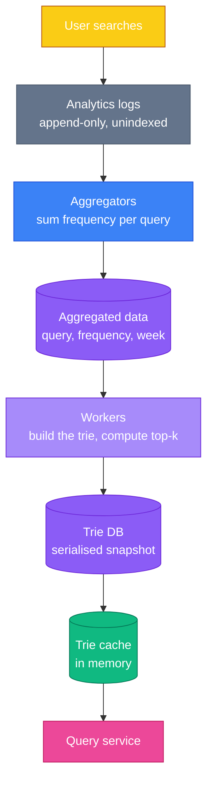
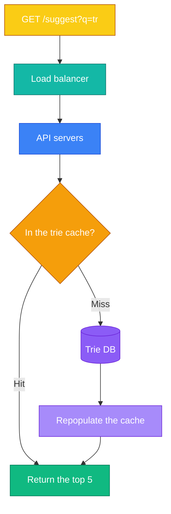
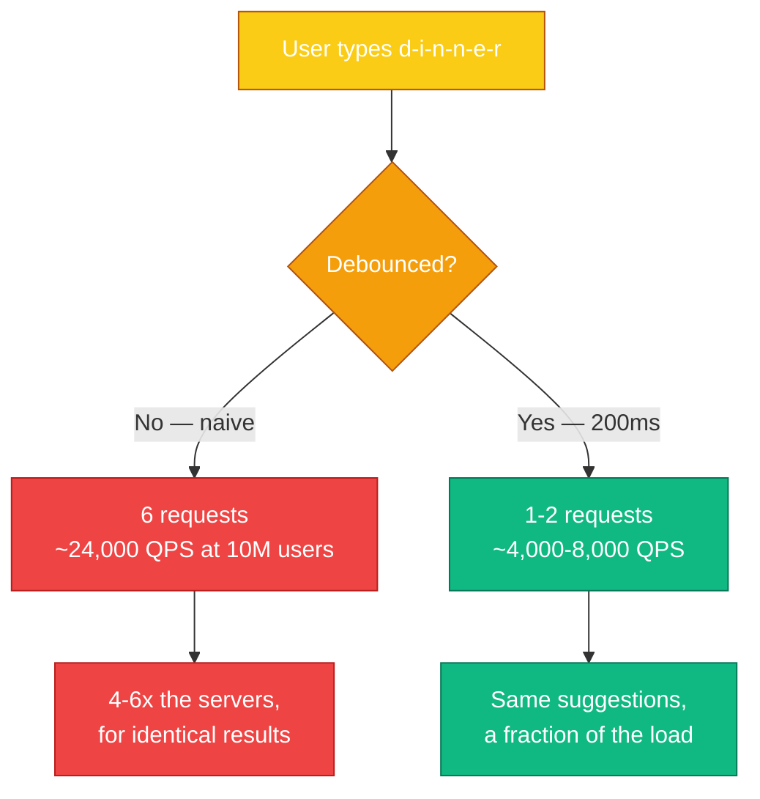
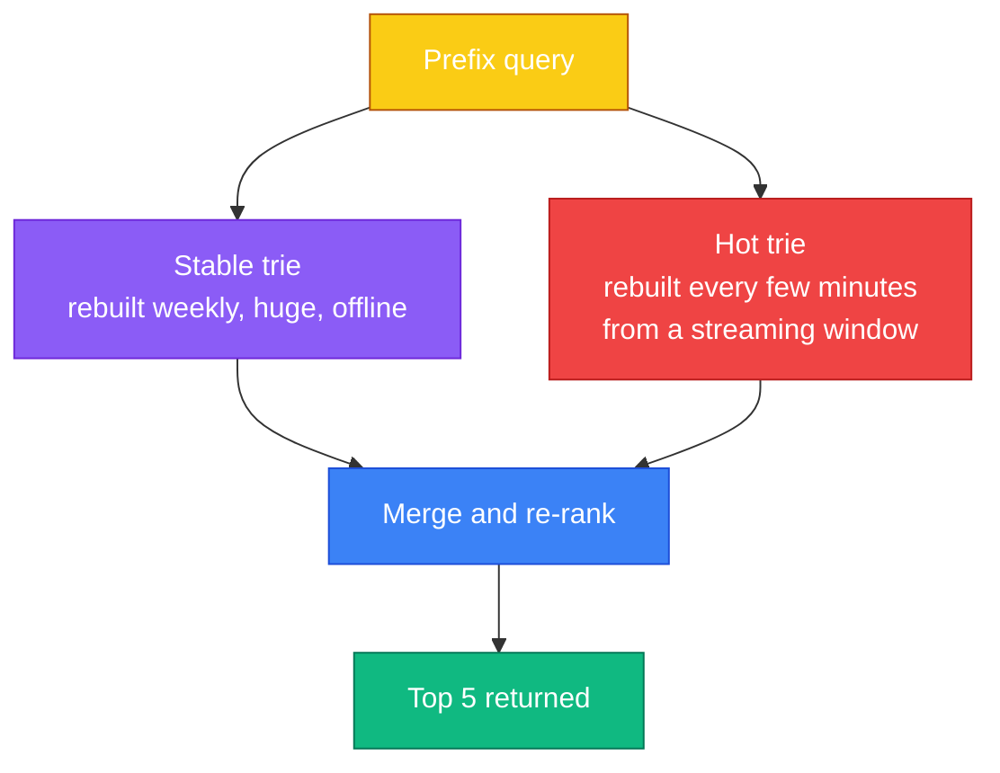

Autocomplete looks like a lookup. Type a prefix, return matching strings, sort by popularity. A `LIKE 'tr%'` query and an `ORDER BY`.

Two facts destroy that:

**It runs on every keystroke.** Not once per search — once per *character*. Typing "dinner" issues six requests. Across 10 million users that is roughly **24,000 queries per second** for a feature nobody considers a feature.

**The budget is about 100 milliseconds.** Facebook's typeahead team put the threshold there: slower and the suggestions visibly lag your typing, which feels worse than having none at all. That budget covers the network round trip, so the server has perhaps a few tens of milliseconds.

You cannot rank millions of queries in tens of milliseconds. So you do not. **Everything expensive happens hours before the user types**, and the request itself becomes a memory lookup. This chapter is precompute-and-cache taken further than anywhere else in the book.

---

## Step 1 — Understand the Problem and Establish Scope

> **Candidate:** Do we match only at the start of the query, or anywhere in it?  
> **Interviewer:** Only at the beginning.
>
> **Candidate:** How many suggestions?  
> **Interviewer:** Five.
>
> **Candidate:** How do we decide which five?  
> **Interviewer:** Popularity, from historical query frequency.
>
> **Candidate:** Spell check or autocorrect?  
> **Interviewer:** Not supported.
>
> **Candidate:** Capitalisation and special characters?  
> **Interviewer:** Assume lowercase letters only.
>
> **Candidate:** Scale?  
> **Interviewer:** 10 million daily active users.

**"Only at the beginning" is the answer that makes this tractable.** Prefix matching has a data structure purpose-built for it. Substring matching ("anywhere in the query") is a different and much harder problem needing an inverted index or n-grams. Confirm this early, because the entire design hinges on it.

### Back-of-the-envelope

| Quantity | Working | Result |
|---|---|---|
| Searches per day | 10M users x 10 searches | 100M |
| Requests per search | ~20 characters typed | **20x amplification** |
| Queries per second | 100M x 20 / 86,400 | **~24,000 QPS** |
| Peak | 2x average | **~48,000 QPS** |
| New data per day | 100M x 20 bytes x 20% new | **~0.4 GB/day** |

The **20x amplification** is the number that defines the system. A search product that handles 1,200 searches/second must handle 24,000 autocomplete requests/second. Autocomplete is an order of magnitude more traffic than the search it assists.

Note also how *little* new data arrives: 0.4 GB/day. **Reads are enormous, writes are tiny.** That asymmetry is what licenses the whole precompute approach.

---

## Step 2 — The Obvious Design, and Why It Fails

Keep a frequency table: `query`, `frequency`. On each keystroke:

```sql
SELECT query, frequency FROM frequency_table
WHERE query LIKE 'tr%'
ORDER BY frequency DESC
LIMIT 5;
```

Correct, and fine for a small dataset. At scale it fails on both axes: the `LIKE 'tr%'` scan touches every row sharing that prefix — potentially millions — and it does so **24,000 times a second**. You are running a sort over a large result set on every keystroke of every user.

The fix is not a faster database. It is to stop computing the answer at request time.

---

## Step 3 — Design Deep Dive

### The trie

A trie (from *retrieval*, and pronounced "try") stores strings by shared prefix. Each node is a character; the path from the root spells a prefix.

<div class="diagram"><svg viewBox="0 0 740 300" xmlns="http://www.w3.org/2000/svg" style="width:100%;max-width:740px;margin:2rem auto;display:block;">
  <defs>
    <marker id="t13" markerWidth="7" markerHeight="6" refX="6" refY="3" orient="auto">
      <polygon points="0 0,7 3,0 6" fill="var(--dg-border2)"/>
    </marker>
  </defs>
  <text x="370" y="22" text-anchor="middle" font-size="13" font-weight="700" fill="var(--dg-text)">Every node caches its own top-k — so a lookup never traverses below it</text>
  <circle cx="70" cy="120" r="19" fill="var(--dg-panel)" stroke="var(--dg-border2)" stroke-width="2"/>
  <text x="70" y="126" text-anchor="middle" font-size="13" font-weight="700" fill="var(--dg-muted)">root</text>
  <line x1="89" y1="120" x2="151" y2="120" stroke="var(--dg-border2)" stroke-width="2" marker-end="url(#t13)"/>
  <circle cx="172" cy="120" r="19" fill="var(--dg-blue)" fill-opacity="0.2" stroke="var(--dg-blue)" stroke-width="2"/>
  <text x="172" y="126" text-anchor="middle" font-size="15" font-weight="800" fill="var(--dg-blue-tx)">t</text>
  <line x1="191" y1="120" x2="253" y2="120" stroke="var(--dg-border2)" stroke-width="2" marker-end="url(#t13)"/>
  <circle cx="274" cy="120" r="19" fill="var(--dg-blue)" fill-opacity="0.35" stroke="var(--dg-blue)" stroke-width="2.5"/>
  <text x="274" y="126" text-anchor="middle" font-size="15" font-weight="800" fill="var(--dg-blue-tx)">r</text>
  <text x="274" y="160" text-anchor="middle" font-size="12" font-weight="700" fill="var(--dg-blue-tx)">prefix "tr"</text>
  <rect x="330" y="86" width="188" height="72" rx="9" fill="var(--dg-green)" fill-opacity="0.15" stroke="var(--dg-green)" stroke-width="2"/>
  <text x="424" y="106" text-anchor="middle" font-size="12" font-weight="700" fill="var(--dg-green-tx)">cached top-k at this node</text>
  <text x="346" y="127" font-size="13" font-weight="650" fill="var(--dg-text)">true 35</text>
  <text x="424" y="127" font-size="13" font-weight="650" fill="var(--dg-text)">try 29</text>
  <text x="346" y="147" font-size="13" font-weight="650" fill="var(--dg-text)">tree 10</text>
  <line x1="293" y1="120" x2="326" y2="120" stroke="var(--dg-green)" stroke-width="2.5" marker-end="url(#t13)"/>
  <line x1="288" y1="134" x2="330" y2="196" stroke="var(--dg-border)" stroke-width="1.5" stroke-dasharray="4 4"/>
  <line x1="288" y1="134" x2="410" y2="196" stroke="var(--dg-border)" stroke-width="1.5" stroke-dasharray="4 4"/>
  <line x1="288" y1="134" x2="490" y2="196" stroke="var(--dg-border)" stroke-width="1.5" stroke-dasharray="4 4"/>
  <circle cx="330" cy="210" r="16" fill="var(--dg-panel)" stroke="var(--dg-border2)" stroke-width="1.5"/>
  <text x="330" y="215" text-anchor="middle" font-size="12" fill="var(--dg-muted)">u</text>
  <circle cx="410" cy="210" r="16" fill="var(--dg-panel)" stroke="var(--dg-border2)" stroke-width="1.5"/>
  <text x="410" y="215" text-anchor="middle" font-size="12" fill="var(--dg-muted)">y</text>
  <circle cx="490" cy="210" r="16" fill="var(--dg-panel)" stroke="var(--dg-border2)" stroke-width="1.5"/>
  <text x="490" y="215" text-anchor="middle" font-size="12" fill="var(--dg-muted)">e</text>
  <text x="410" y="252" text-anchor="middle" font-size="12" fill="var(--dg-muted)">the subtree below — never visited at query time</text>
  <text x="370" y="284" text-anchor="middle" font-size="12" fill="var(--dg-muted)">Walk p characters, read the cached list, return. Both steps are O(1).</text>
</svg></div>

Add the frequency to each terminal node and you can rank. But the naive lookup is:

1. Walk to the prefix node — **O(p)**
2. Traverse the entire subtree to collect candidates — **O(c)**
3. Sort them and take the top k — **O(c log c)**

Step 2 is the killer. For the prefix `"a"`, that subtree is a large fraction of every query ever searched. You cannot do that in 20 milliseconds.

### Two optimisations that make it O(1)

**Cap the prefix length.** Nobody types a 500-character search. Cap at, say, 50, and `O(p)` becomes `O(1)` — a constant-bounded walk.

**Cache the top-k at every node.** This is the idea worth remembering from this chapter. Instead of computing the top 5 for `"tr"` on demand, **store the answer at the `"tr"` node itself**, precomputed. The lookup becomes: walk to the node, read the list, return.

```
Before:  O(p) + O(c) + O(c log c)     — traverse and sort a subtree
After:   O(1) + O(1)                  — walk a bounded path, read a list
```

The cost is space: every node stores five strings, and there is a node for every prefix of every query. That is a large multiplier. **You are trading storage for latency, deliberately and heavily**, and that is the correct trade when the budget is 100 ms and storage is cheap.

Say this trade-off out loud. Recognising which resource to spend is more of the answer than the data structure itself.

### Where the trie comes from

If updating the trie on every search is impossible — billions of writes, each touching every ancestor node — then the trie must be built **offline**, on a schedule.



The rebuild cadence is a product decision, and worth raising explicitly: **weekly is fine for Google-scale general queries**, which barely move week to week. It is hopeless for Twitter, where what people search changes hourly. Ask which you are building.

Two ways to persist the trie:

- **Document store** — serialise the whole trie, snapshot it. Simple; the unit of update is the entire structure.
- **Key-value store** — map each prefix to its cached top-k list. `"tr"` → `[true:35, try:29, tree:10]`. This is really a hash table, and it is what most production systems use, because the query becomes a single key lookup rather than a tree walk.

That second option is worth pausing on: **once every node caches its top-k, the tree structure has no job left at query time.** You keep the trie to *build* the answers and store the answers in a flat hash.

### Serving a request



Then three optimisations that cut load before it reaches you:

- **Browser caching.** Suggestions barely change minute to minute, so let the browser hold them. Google returns `Cache-Control: private, max-age=3600` — cached for an hour, and `private` so no shared proxy stores one user's suggestions.
- **Data sampling.** You do not need every query logged to know what is popular. Log 1 in N. Popularity is a statistical property, and sampling preserves it while cutting logging cost by orders of magnitude.
- **AJAX**, so a suggestion request never reloads the page.

### Updating and deleting

**Updating** has two modes. Replace the whole trie weekly — simple, atomic, and the usual choice. Or update individual nodes, which is slow because changing one query's frequency means updating **every ancestor's cached top-k** all the way to the root. That ancestor cascade is the direct cost of the caching optimisation, and it is why incremental updates are avoided.

**Deleting** matters more than it sounds. Autocomplete has to *not* suggest hateful, violent or dangerous completions, and the trie is built from what people actually typed — which includes all of that.

The answer is a **filter layer between the cache and the API**, applied at query time. Filtering at build time alone is not enough: when you discover a bad suggestion you need it gone in seconds, not at the next weekly rebuild. Remove it from the corpus asynchronously so the next build is clean, but block it at read time immediately.

### Sharding

The trie will not fit on one machine. The naive shard is by first letter: a–m on one server, n–z on another.

This does not work, and the reason is worth stating precisely: **letter frequency is wildly uneven.** Far more English queries begin with `c` or `s` than with `x` or `z`. Shard alphabetically and one server melts while another idles.

The fix is a **shard map manager**: analyse historical distribution and assign ranges by *volume* rather than by alphabet. If `s` alone carries as much traffic as `u` through `z` combined, then `s` gets its own shard and `u–z` share one. The map is data-driven and updated as language use shifts.

---

## Beyond the Book

### Debounce first — it is the largest win available

The estimate above assumes one request per character: 20 per search, 24,000 QPS. **No production autocomplete does this**, and the book never mentions the fix.

Clients **debounce**: wait until the user pauses typing — 150–300 ms — before issuing a request. Someone typing "dinner" fluently produces one or two requests, not six.



Two related client-side wins: **cancel in-flight requests** when a new keystroke supersedes them, and **discard out-of-order responses** — the reply for `"din"` can arrive after the reply for `"dinn"`, and rendering it puts stale suggestions under a longer prefix.

Raising debouncing early is high-signal, because it shows you look for the cheapest place to solve a problem before scaling hardware at it.

### Trending queries: the weekly rebuild's blind spot

A news event breaks. Everyone starts searching a name that did not exist in the corpus. The weekly trie has never heard of it, and will not until the next build.

The book calls this out of scope. It is not hard to sketch, and the sketch is a strong answer:



Two tries, merged at query time. The **stable** one holds the long tail and is expensive to build. The **hot** one covers a rolling window of the last few hours, is tiny because recent traffic concentrates on few queries, and can be rebuilt from a stream every few minutes. Merging two small ranked lists is cheap enough to stay inside the latency budget.

This is the same shape as [Chapter 11's](/2026/06/design-news-feed-system/) hybrid fan-out: one path optimised for the common bulk case, a second for the rare expensive case, combined at read time.

### Personalisation breaks the shared cache

Every design above assumes suggestions are **the same for everyone** — which is what makes one cached list per prefix serve all 10 million users.

Personalised suggestions destroy that. A per-user trie is impossible: 10 million users times every prefix is not a cache, it is a database bigger than the corpus.

The practical compromise is to blend at read time: serve the shared global list, then **re-rank it against a small per-user history** kept on the client or in a compact per-user store. The expensive global computation stays shared; personalisation is a cheap reordering of five items.

### Do not suggest what only one person searched

A privacy constraint that follows directly from the design, and that candidates almost never raise.

The corpus is built from real user queries, some of which contain names, addresses, medical questions or credentials pasted by accident. Suggesting a query typed by **one** person can expose that person.

The standard defence is a **frequency floor**: never suggest a query unless at least *N* distinct users have issued it, with N in the tens or hundreds. This is a k-anonymity threshold, and it costs nothing — a query that rare would not have made the top five anyway. Combined with sampling and log retention limits, it is what keeps an autocomplete corpus from becoming a data-leak surface.

### What you would actually deploy

You would probably not hand-roll the trie. **Elasticsearch's completion suggester** is built on a finite state transducer — a compressed automaton with the same prefix-lookup properties as a trie but far smaller in memory — and it is what most teams reach for. Knowing that a production answer exists, and that it is an FST rather than a naive trie, is worth mentioning after you have shown you understand the underlying structure.

---

## Interview Quick Reference

**The two facts that shape everything:** one request per keystroke (**20x amplification**, ~24,000 QPS) and a **~100 ms** budget.

**The core move:** precompute the ranked answer for every prefix offline, cache it at that prefix, and make the request a memory lookup.

| | Naive | Optimised |
|---|---|---|
| Find the prefix | O(p) | O(1) — prefix length capped |
| Get the top k | O(c) + O(c log c) | **O(1)** — cached at the node |
| Cost | CPU at request time | Storage, paid in advance |

**Points that mark out a strong answer:**

- **Prefix-only matching is what makes a trie viable.** Confirm it in the first minute.
- **Cache top-k at every node** — the whole design, in one sentence.
- **Once you do that, the tree is redundant at query time** — store prefix → list in a hash.
- **Updates cascade to every ancestor**, which is why you rebuild rather than patch.
- **Debounce on the client** and cut traffic 4–6x before scaling anything.
- **Alphabetical sharding is unbalanced** — shard by measured volume via a shard map.
- **Filter at query time, not just build time**, so a bad suggestion dies in seconds.
- **A frequency floor** stops one person's query becoming everyone's suggestion.
- **Trending needs a second, hot trie** merged at read time.

---

## Summary

| Idea | Why it matters |
|---|---|
| Every keystroke is a request | 20x amplification makes this bigger than search itself |
| Reads enormous, writes tiny | 0.4 GB/day of new data licenses heavy precomputation |
| Trade storage for latency | Cache the answer at every prefix, deliberately |
| Move ranking offline | Nothing expensive may happen inside 100 ms |
| The trie becomes a hash | Cached top-k makes tree traversal unnecessary at read |
| Rebuild, do not patch | Ancestor cascades make incremental updates costly |
| Shard by volume, not alphabet | Letter frequency is deeply uneven |
| The cheapest fix is client-side | Debouncing beats any amount of server capacity |

---

## References and Further Reading

**The primary sources**

- [The life of a typeahead query](https://web.archive.org/web/2019/https://www.facebook.com/notes/facebook-engineering/the-life-of-a-typeahead-query/389105248919/) — Facebook engineering, and the origin of the 100 ms figure. Via the Internet Archive; Facebook retired Notes in 2020
- [How we built Prefixy](https://medium.com/@prefixyteam/how-we-built-prefixy-a-scalable-prefix-search-service-for-powering-autocomplete-c20f98e2eff1) — a complete prefix-search service, written up honestly
- [Prefix Hash Tree](https://web.archive.org/web/2020/https://people.eecs.berkeley.edu/~sylvia/papers/pht.pdf) — Berkeley, on indexing prefixes over a distributed hash table. Archived; the original host no longer responds

**The data structures**

- [Trie](https://en.wikipedia.org/wiki/Trie) — the structure and its complexity
- [Elasticsearch completion suggester](https://www.elastic.co/docs/reference/elasticsearch/rest-apis/search-suggesters) — what you would actually deploy, built on an FST
- [Finite state transducers in Lucene](https://blog.mikemccandless.com/2010/12/using-finite-state-transducers-in.html) — why an FST beats a plain trie on memory

**Streaming, for the trending case**

- [Apache Kafka](https://kafka.apache.org/documentation/) and [Spark Streaming](https://spark.apache.org/streaming/) — building the hot trie from a live window

**Related chapters**

- [Chapter 11: Design a News Feed System](/2026/06/design-news-feed-system/) — the same "two paths merged at read time" shape
- [Chapter 2: Back-of-the-Envelope Estimation](/2026/05/back-of-the-envelope-estimation/) — where the 24,000 QPS came from
- [Chapter 6: Design a Key-Value Store](/2026/05/design-a-key-value-store/) — the store behind prefix → top-k

**Books**

- *System Design Interview – An Insider's Guide* — Alex Xu. The chapter this article follows.
- *Introduction to Information Retrieval* — Manning, Raghavan and Schütze. Chapter 3 covers tolerant retrieval and wildcard queries, and is free online.

---

## What's Next?

In **Chapter 14** we design **YouTube** — where the numbers change scale entirely. A single video can be gigabytes, transcoding is a pipeline rather than a step, and the interesting problems move from databases to storage, encoding and the CDN.

*This chapter is the clearest example in the book of a general move: when the latency budget will not accommodate the computation, do the computation earlier. Autocomplete does not answer your question quickly — it answered it last Tuesday and merely looked it up.*
