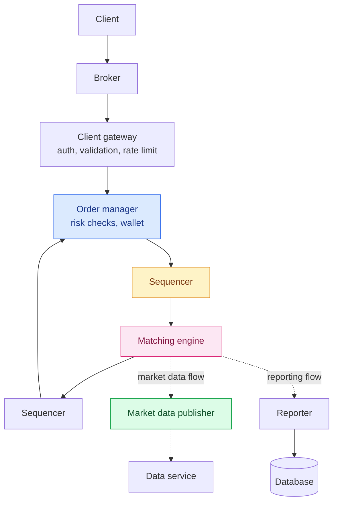
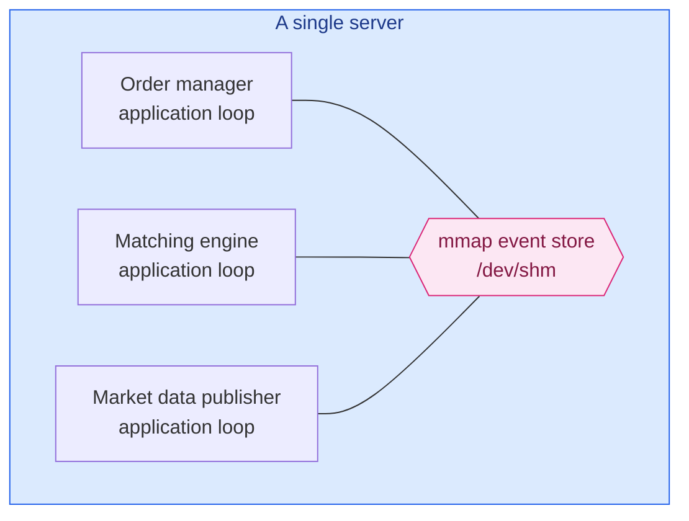
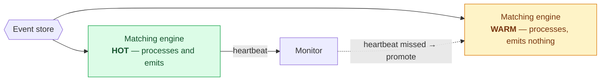

Every design in this series so far has scaled **out**. More partitions, more replicas, more nodes.

This one scales **in**.

The fastest exchanges in the world run almost everything — order manager, matching engine, market data publisher — **on a single server**, sometimes in a single process. Not because they can't afford more machines, but because the network hop between two machines costs more than the machine does.

That inversion is what makes this chapter worth reading. Everything you've been taught about distributing work stops applying when a round trip costs more than your entire latency budget.

---

## Step 1 — Scope

**Functionality**: place a limit order, cancel an order, view real-time executions and the order book. Risk checks. Wallet balance verification with funds withheld on open orders.

**Scale**: 100 symbols, tens of thousands of concurrent users, **a billion orders per day**.

```
1,000,000,000 orders ÷ (6.5 hours × 3,600) ≈ 43,000 QPS
Peak (5×)                                  ≈ 215,000 QPS
```

Note the 6.5 hours — markets open at 9:30 and close at 16:00. Volume is heavily concentrated at both ends.

**Non-functional**, and this is where it gets unusual:

- **99.99% availability** — 8.64 seconds of downtime per day
- **Millisecond round-trip latency**, measured at the **99th percentile**

> A persistently high 99th percentile causes a terrible experience for a small number of users — and in trading, those users are the ones who notice.

**Average latency is nearly meaningless here.** A system averaging 200 microseconds with occasional 50-millisecond stalls is unusable, because the stalls land on real trades and someone loses real money. **Consistency of latency matters more than its magnitude.**

---

## The order book

Everything in an exchange revolves around one data structure.

An order book is the list of resting buy and sell orders for a symbol, organised by price level. **Bid** is the highest price a buyer will pay; **ask** is the lowest a seller will accept; the gap between them is the **spread**.

The requirements are demanding:

- **O(1)** placing, cancelling, matching
- Constant-time lookup of volume at a price level
- Query best bid/ask instantly
- Iterate price levels in order

### Watch it match

A market buy consumes the ask side from the best price upward. Drag the quantity and watch it walk the book:

<div class="ob-demo" id="ob"><div class="ob-row"><label for="ob-q">Market buy <b><span id="ob-qv">0</span></b> shares</label><input type="range" id="ob-q" min="0" max="3000" step="20" value="0"></div><div class="ob-book"><div class="ob-side"><div class="ob-label ob-ask-l">ASKS — SELL SIDE</div><table class="ob-t"><tbody id="ob-asks"></tbody></table></div><div class="ob-spread" id="ob-spread"></div><div class="ob-side"><div class="ob-label ob-bid-l">BIDS — BUY SIDE</div><table class="ob-t"><tbody id="ob-bids"></tbody></table></div></div><div class="ob-fills" id="ob-fills"></div></div>
<script>
(function () {
  var root = document.getElementById("ob");
  if (!root) return;
  // price levels, best ask first
  var ASKS = [
    { p: "100.10", o: [260, 400, 1100, 100] },
    { p: "100.11", o: [900] },
    { p: "100.12", o: [300] },
    { p: "100.13", o: [190, 200] }
  ];
  var BIDS = [
    { p: "100.08", o: [500, 600, 900] },
    { p: "100.07", o: [100, 700] },
    { p: "100.06", o: [800, 300, 200] },
    { p: "100.05", o: [500, 100] }
  ];
  var q = document.getElementById("ob-q"), qv = document.getElementById("ob-qv"),
      asksEl = document.getElementById("ob-asks"), bidsEl = document.getElementById("ob-bids"),
      spreadEl = document.getElementById("ob-spread"), fillsEl = document.getElementById("ob-fills");
  function render() {
    var want = +q.value;
    qv.textContent = want;
    var left = want, fills = [], bestAsk = null;
    // walk the ask side from the best price upward, filling order by order
    var view = ASKS.map(function (lvl) {
      var rem = [];
      lvl.o.forEach(function (sz) {
        if (left >= sz) { left -= sz; fills.push({ p: lvl.p, s: sz, full: true }); }
        else if (left > 0) { fills.push({ p: lvl.p, s: left, full: false }); rem.push(sz - left); left = 0; }
        else rem.push(sz);
      });
      return { p: lvl.p, o: rem, total: rem.reduce(function (a, b) { return a + b; }, 0) };
    });
    for (var i = 0; i < view.length; i++) if (view[i].total > 0 && bestAsk === null) bestAsk = view[i].p;
    var h = "";
    for (var j = view.length - 1; j >= 0; j--) {
      var l = view[j], cleared = l.total === 0;
      h += '<tr class="' + (cleared ? "ob-gone" : (l.p === bestAsk ? "ob-best" : "")) + '">' +
           '<td class="ob-p">' + l.p + '</td><td class="ob-o">' +
           (l.o.length ? l.o.map(function (s) { return '<i>' + s + '</i>'; }).join("") : "&mdash;") +
           '</td><td class="ob-tot">' + l.total + '</td></tr>';
    }
    asksEl.innerHTML = h;
    var b = "";
    BIDS.forEach(function (l, k) {
      var tot = l.o.reduce(function (a, c) { return a + c; }, 0);
      b += '<tr class="' + (k === 0 ? "ob-best" : "") + '"><td class="ob-p">' + l.p + '</td>' +
           '<td class="ob-o">' + l.o.map(function (s) { return '<i>' + s + '</i>'; }).join("") +
           '</td><td class="ob-tot">' + tot + '</td></tr>';
    });
    bidsEl.innerHTML = b;
    var sp = bestAsk ? (parseFloat(bestAsk) - 100.08).toFixed(2) : "—";
    spreadEl.innerHTML = 'best bid <b>100.08</b> &nbsp;·&nbsp; best ask <b>' + (bestAsk || "none") +
      '</b> &nbsp;·&nbsp; spread <b>' + sp + '</b>';
    if (!fills.length) { fillsEl.innerHTML = '<span class="ob-none">No executions yet.</span>'; return; }
    var f = '<div class="ob-flabel">EXECUTIONS GENERATED — ' + fills.length + '</div>';
    fills.forEach(function (x) {
      f += '<span class="ob-fill">' + x.s + ' @ ' + x.p + (x.full ? "" : " <i>partial</i>") + '</span>';
    });
    if (left > 0) f += '<span class="ob-fill ob-unfilled">' + left + ' unfilled — book exhausted</span>';
    fillsEl.innerHTML = f;
  }
  q.addEventListener("input", render);
  render();
})();
</script>

Push it to **2,700**. The entire 100.10 level is consumed, then most of 100.11 — and the **best ask moves up a level while the spread widens from $0.02 to $0.03.**

That's price impact, visible directly. A large order doesn't execute at one price; it **walks the book**, paying progressively worse prices. Which is why institutional clients need order splitting: submitting the whole thing at once moves the market against you.

### Getting to O(1)

The natural implementation:

```java
class PriceLevel {
    Price limitPrice;
    long totalVolume;
    List<Order> orders;      // ← the problem
}
class OrderBook {
    Book<Buy> buyBook;
    Book<Sell> sellBook;
    PriceLevel bestBid, bestOffer;
    Map<OrderID, Order> orderMap;
}
```

**A plain list makes cancellation O(n)** — you'd traverse to find the order's predecessor.

Two changes fix it:

**Make `orders` a doubly-linked list.** Placing appends to the tail: O(1). Matching removes from the head: O(1).

**Keep `Map<OrderID, Order>`.** Cancellation looks the order up in O(1), and because the list is doubly-linked, the order already knows its predecessor — unlink without traversing.

**All three operations become O(1)**, and the second one is the interesting trick: a hash map alongside a linked list, each covering the other's weakness. Exactly the pairing behind [Redis sorted sets](/2026/06/design-gaming-leaderboard/), for the same reason.

---

## Step 2 — High-level design

Three flows with very different requirements.



**The trading flow is the critical path** — gateway → order manager → sequencer → matching engine — and it must be microseconds.

**Market data and reporting are not.** They can lag. Separating them by latency requirement is the first architectural decision, and it's what lets the critical path stay minimal.

### The sequencer

The most important component you wouldn't think to invent.

It stamps every incoming order with a **sequential ID** before the matching engine sees it, and stamps every outgoing execution too. Sequential, so gaps are detectable.

That single act buys three things:

**Timeliness and fairness** — order of arrival is recorded, not inferred.

**Deterministic replay** — given the same input sequence, the matching engine produces the same output sequence. Always.

**Exactly-once** — sequence gaps reveal loss.

> **Determinism is the foundation of everything that follows.** High availability, fast recovery, and hot-warm failover all work *because* replaying the log reproduces the state exactly. Without the sequencer, none of it holds.

Crucially there is **exactly one** sequencer per event store. Multiple writers would contend for the right to write, and in a system this hot, lock contention is the whole budget. **A single writer is faster than a lock.**

---

## Step 3 — Deep dive: making it fast

Latency decomposes simply:

```
latency = Σ execution time along the critical path
```

Two levers: **fewer tasks on the path**, and **less time per task**. The exchange pulls both, hard — even **logging is removed from the critical path**.

### Why one server

Components on separate machines communicate over the network. **A round trip is roughly 500 microseconds.** Several hops on the critical path and you're into single-digit milliseconds before doing any work. Add disk-backed event persistence and you're at tens of milliseconds.

Respectable in 2005. Uncompetitive now.

So the design collapses: **put every critical-path component on one server.**



**`mmap` over `/dev/shm`** is the mechanism. `/dev/shm` is a memory-backed filesystem, so mapping a file there gives shared memory between processes with **no disk access at all**. A message on this bus takes **sub-microsecond**.

The result is microservices — separate processes, clean boundaries, independent deployment — **communicating a thousand times faster than a network call.** You keep the architectural benefits and delete the transport cost.

### Application loops and CPU pinning

Each component runs an **application loop**: a single thread in a `while` loop, polling for work, **pinned to a fixed CPU core**.

Two benefits, both aimed at the tail:

**No context switches.** The core belongs to that loop.

**No locks, therefore no lock contention** — only one thread mutates the state.

The cost is real: every task must be analysed for how long it occupies the loop, because a slow task blocks everything behind it. **You are hand-managing the scheduler**, which is only worth it when a scheduler decision costing 50 microseconds is a bug.

### Event sourcing again

The event store is an immutable log of state-changing events, and the same design as [the digital wallet](/2026/06/design-digital-wallet/) — but here the motivation is **speed and recovery** rather than audit.

Two changes make it fit an exchange.

**The order manager becomes a library**, embedded in several components rather than a service they call. Order state is needed by the matching engine, the reporter and the market data publisher; making them call a shared service would put network hops back on the path. Instead each embeds the library and **derives identical state from identical events** — guaranteed by determinism.

**The sequencer shrinks.** No longer a message store, just a single writer stamping sequence IDs — pulling from each component's local **ring buffer** and writing to the event store.

### Hot-warm failover



The warm instance consumes **the same events** and computes **the same state** — it simply doesn't emit. On failure it takes over immediately, already warm, no state transfer.

This works **only because of determinism**. Same events in, same state out, guaranteed.

Beyond one server, **Raft** replicates the event store across machines and elects a leader — with a Raft cluster of 5, you tolerate 2 failures.

And two honest cautions about failover that most designs skip:

**False alarms cause unnecessary failovers**, which are themselves risky.

**A bug that killed the primary will kill the backup too.** Failover protects against hardware and environment, not logic. So: **manual failover at first**, automating only once you have operational confidence — with chaos engineering to build it faster.

### Latency determinism

Two kinds of determinism matter, and only one gets discussed.

**Functional determinism** — same events, same results. Handled by the sequencer.

**Latency determinism** — nearly the same latency *every time*. Measured at p99, or p99.99.

The classic culprit in a JVM exchange is **stop-the-world garbage collection**. Everything is fast, then a collection pauses the world for milliseconds, and those milliseconds land on somebody's trade.

**A system with a great average and a bad tail is a bad system here.** Which is why exchange engineers obsess over allocation-free code paths, pre-allocated ring buffers, and cache-line padding — all techniques for eliminating *variance*, not just cost.

---

## Fairness as an engineering requirement

Here is something no other design in this series has: **fairness is a regulated obligation**, and it shows up in implementation details.

**Subscriber ordering.** If the market data publisher holds a list of subscribers and sends in list order, whoever connects first gets data first — and therefore gets to trade on it first. So clients race to connect at market open. The fixes: **multicast**, so everyone receives simultaneously, or **randomised subscriber order**.

Multicast uses UDP, which is unreliable, so retransmission schemes like NACK-oriented reliable multicast are needed.

**Colocation.** Exchanges rent rack space in their own data centre. Latency then becomes **proportional to cable length**. That sounds like the opposite of fair, and it's generally accepted as legitimate because it's *equally available to anyone who pays* — a VIP service rather than a hidden advantage.

**A design detail as small as "which order do we iterate subscribers in" becomes a fairness question when the data is worth money.** Very few systems have that property.

---

## What has changed since the book

### The single-server design is a real, named lineage

The one-big-server conclusion sounds like an oddity. It's an established school of thought with public engineering behind it.

**LMAX** — an exchange — open-sourced the **Disruptor**, the ring buffer at the centre of exactly this architecture, and published extensively on mechanical sympathy: writing code that matches how CPUs, caches and memory actually behave. **Aeron**, from the same lineage, is the reliable UDP messaging library the chapter alludes to for cross-machine replication.

Worth knowing because it makes the design **checkable**. This isn't a thought experiment; you can read the code.

### Crypto exchanges went the other way

An interesting counterpoint. Many cryptocurrency exchanges run on **cloud infrastructure** rather than colocated bare metal.

They accept latency that a traditional exchange would consider disqualifying, in exchange for elasticity and a far lower barrier to entry. Crypto markets trade 24/7 with different participants and different latency sensitivity — so the trade lands differently.

And decentralised exchanges built on **automated market makers** dispense with the order book altogether, pricing from a formula over pooled liquidity. **The central data structure of this entire chapter turns out to be optional** if you change the market's mechanism.

### Nanoseconds, and hardware

The chapter targets microseconds. The competitive frontier is now **nanoseconds**, and it has left software behind.

**FPGAs** implement matching and market data handling in hardware, cutting the operating system out of the path entirely. **Kernel bypass** — DPDK, Solarflare OpenOnload — lets user-space code talk to the network card directly, skipping the kernel's network stack.

The principle is unchanged and pushed to its limit: **remove work from the critical path.** First services, then network hops, then disk, then the kernel, then the CPU itself.

### The p99 discipline spread

Latency determinism used to be exotic. It is now standard practice across the industry — **HdrHistogram**, which the chapter cites, is widely used, and p99/p99.9 are normal SLO targets rather than trading-floor exotica.

Modern JVMs help too: **ZGC** and **Shenandoah** target sub-millisecond pauses regardless of heap size, which removes the specific fear that shaped a generation of allocation-free Java. It doesn't remove the discipline — it lowers the cost of not having it.

---

## What to take away

**Sometimes the answer is to scale in.** Every other design here distributes work. This one collapses onto a single server, because a 500-microsecond round trip is larger than the entire latency budget. **Distribution is a technique, not a goal.**

**Determinism is the foundation, and everything is built on it.** The sequencer exists so replay reproduces state exactly — and that one property gives you hot-warm failover, fast recovery, exactly-once, and embedded order state without a shared service. **One property, bought early, paid off five times.**

**A single writer beats a lock.** One sequencer, one thread per core, no contention. When contention is your budget, removing the possibility of it beats optimising it.

**Pair a hash map with a linked list.** The list gives ordered O(1) insert and removal; the map gives O(1) lookup. Neither is sufficient; together they satisfy every requirement the order book has.

**The tail is the number that matters.** A great average with occasional 50ms stalls is unusable, because the stalls land on real trades. Optimise for *variance*, not just magnitude.

**Failover protects against hardware, not logic.** The bug that killed the primary will kill the backup. Start with manual failover and earn the automation.

**Fairness can be an engineering requirement.** Which order you iterate subscribers in becomes a regulated question when the data is worth money. Most systems never face this; it's worth recognising when yours does.

---

## References and Further Reading

**Low-latency architecture**

<ul>
<li><a href="https://lmax-exchange.github.io/disruptor/">The LMAX Disruptor</a> — the ring buffer behind the single-server design</li>
<li><a href="https://martinfowler.com/articles/lmax.html">The LMAX Architecture</a> — Martin Fowler on why one thread beat a cluster</li>
<li><a href="https://github.com/real-logic/aeron/wiki/Design-Overview">Aeron</a> — reliable UDP messaging from the same lineage</li>
<li><a href="https://gist.github.com/jboner/2841832">Latency numbers every programmer should know</a></li>
<li><a href="https://en.wikipedia.org/wiki/Memory-mapped_file">mmap</a> · <a href="https://en.wikipedia.org/wiki/Context_switch">Context switching</a></li>
<li><a href="http://hdrhistogram.org/">HdrHistogram</a> — measuring the tail properly</li>
</ul>

**Exchange mechanics**

<ul>
<li><a href="https://en.wikipedia.org/wiki/Order_book">Order book</a> · <a href="https://www.investopedia.com/terms/o/order-book.asp">and on Investopedia</a></li>
<li><a href="https://www.fixtrading.org/">FIX protocol</a> — the standard for transmitting trade information</li>
<li><a href="https://en.wikipedia.org/wiki/Market_impact">Market impact</a> — why large orders walk the book</li>
<li><a href="https://www.investopedia.com/terms/d/dark-pool.asp">Dark pools</a> · <a href="https://en.wikipedia.org/wiki/IEX">IEX</a>, an exchange built around fairness</li>
</ul>

**Reliability**

<ul>
<li><a href="https://raft.github.io/">Raft</a> — leader election and log replication</li>
<li><a href="https://en.wikipedia.org/wiki/Chaos_engineering">Chaos engineering</a> — earning confidence in failover</li>
<li><a href="https://en.wikipedia.org/wiki/NACK-Oriented_Reliable_Multicast">NACK-oriented reliable multicast</a></li>
<li><a href="https://martinfowler.com/eaaDev/EventSourcing.html">Event sourcing</a></li>
</ul>

**In this series**

<ul>
<li><a href="/guide/">The complete guide</a> — every article in order</li>
<li><a href="/2026/06/design-digital-wallet/">Design a Digital Wallet</a> — event sourcing, for audit rather than speed</li>
<li><a href="/2026/06/design-gaming-leaderboard/">Real-time Gaming Leaderboard</a> — the same hash-map-plus-list pairing</li>
<li><a href="/2026/06/design-payment-system/">Design a Payment System</a> — the other design where money makes correctness non-negotiable</li>
</ul>
