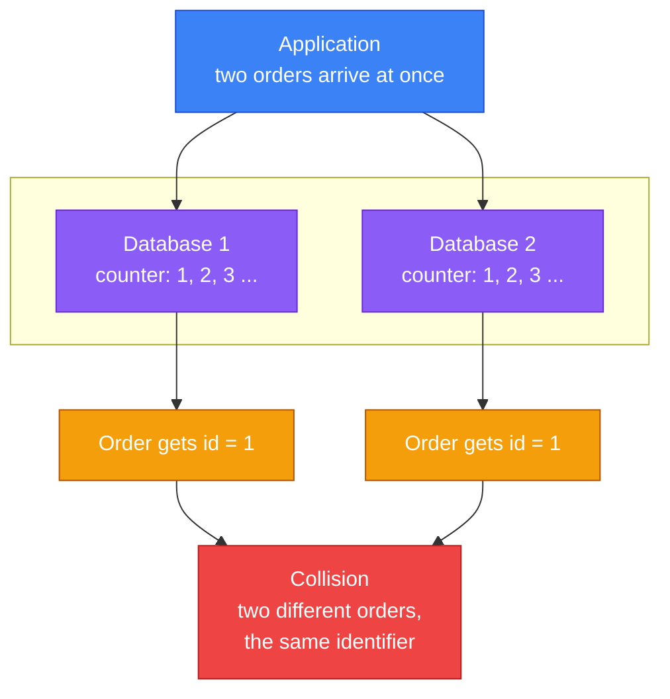
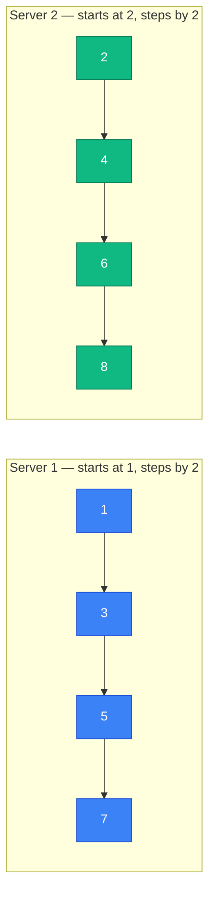
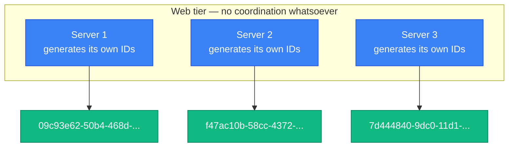
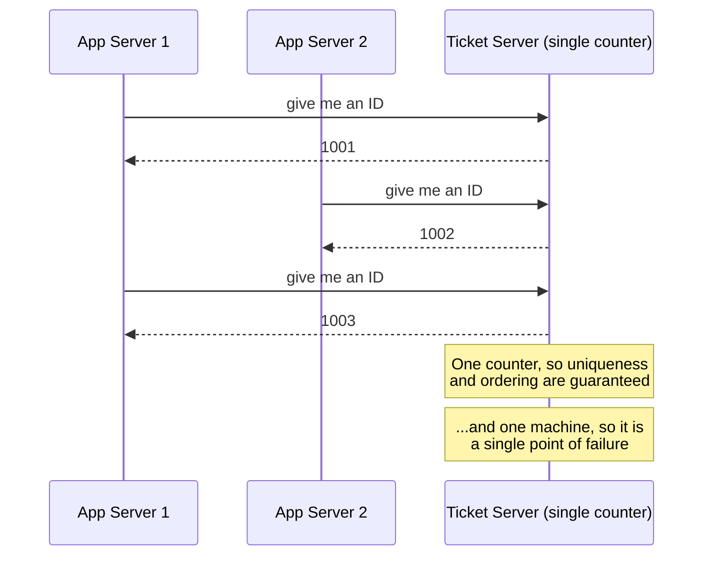
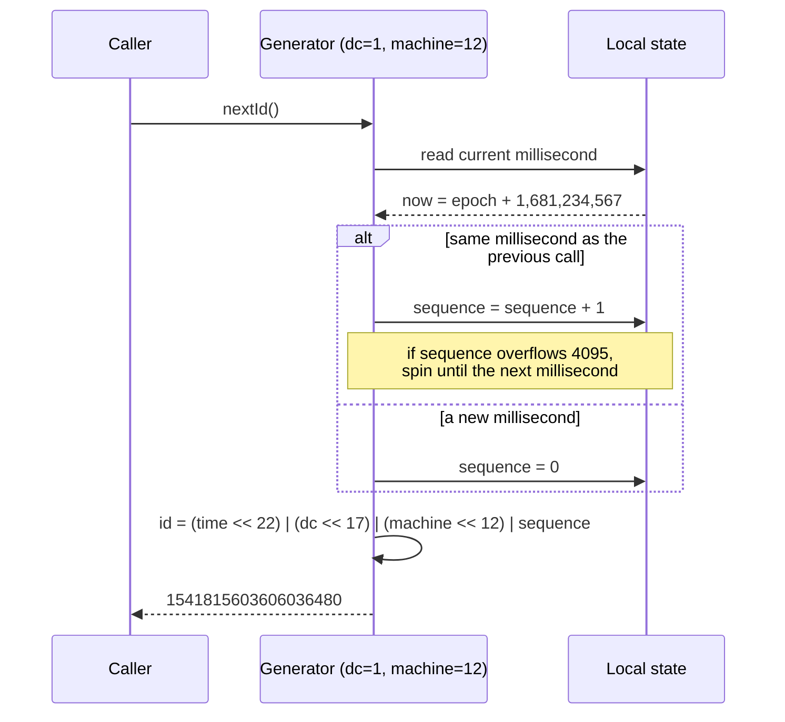
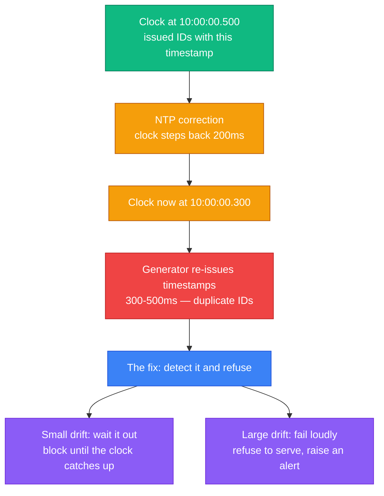
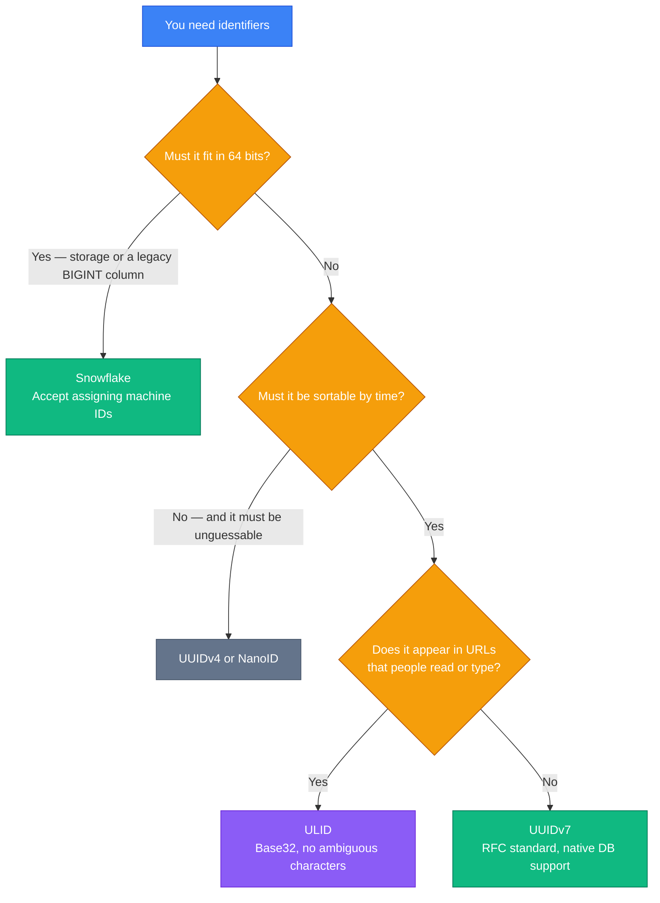

Every row in your database needs a name. For years that name came from one line of SQL:

```sql
CREATE TABLE orders (
  id BIGINT PRIMARY KEY AUTO_INCREMENT,
  ...
);
```

The database hands out 1, 2, 3, 4. They are unique, they are sortable, they are small. It is a solved problem — right up until the moment you have **two** databases.

Then it stops working, quietly and catastrophically. Both databases happily hand out ID `1`. Two different orders, same identifier. Your foreign keys now point at the wrong rows, and no error was raised anywhere.

That is the problem this chapter solves: generating identifiers that are **globally unique**, **sortable by time**, **numeric**, **64 bits**, and produced at **10,000+ per second** — with no central coordinator to slow you down or fall over.

By the end you will understand four classic approaches, why three of them fail our requirements, exactly how Twitter's **Snowflake** works down to the individual bit, and — because this chapter was written in 2020 and the world moved on — what **UUIDv7** changed in 2024 and which scheme you should actually reach for today.

---

## Why `AUTO_INCREMENT` Breaks

Start with the failure, because understanding it precisely tells you what a real solution must provide.

A single database keeps a counter. Hand out a number, add one. Because there is exactly one counter, there can be no duplicates. **The uniqueness comes from the fact that there is only one of it** — and that is also the ceiling on how fast you can go, and a single point of failure.

Add a second database and the guarantee evaporates:



There is no clever configuration that fixes this. The counter is local state, and local state cannot be globally unique without coordination. Every solution below is a different answer to one question: **where does uniqueness come from once you cannot rely on a single counter?**

---

## Step 1 — Understand the Problem and Establish Scope

As always, start by asking. A realistic exchange:

> **Candidate:** What are the characteristics of these IDs?  
> **Interviewer:** They must be unique and sortable.
>
> **Candidate:** For each new record, does the ID increment by exactly 1?  
> **Interviewer:** It increments with time, but not necessarily by 1. An ID created in the evening must be larger than one created that morning.
>
> **Candidate:** Numeric only?  
> **Interviewer:** Yes.
>
> **Candidate:** Any length requirement?  
> **Interviewer:** It must fit in 64 bits.
>
> **Candidate:** What scale?  
> **Interviewer:** At least 10,000 IDs per second.

Which gives us:

| # | Requirement | Why it matters |
|---|---|---|
| 1 | IDs must be **unique** | The whole point — no two records may collide, ever |
| 2 | IDs are **numeric only** | Fits an integer column; compares and indexes cheaply |
| 3 | IDs fit in **64 bits** | A `BIGINT` is 8 bytes; a UUID is 16. At billions of rows that difference is real money |
| 4 | IDs are **ordered by date** | You can sort by ID instead of adding a timestamp index, and range-scan by time |
| 5 | **10,000+ IDs per second** | Rules out anything requiring a network round trip per ID |

Requirement 4 is the one people underestimate. "Sortable" is not decoration — it means **the ID itself is a timestamp index**. `ORDER BY id DESC LIMIT 20` becomes your "most recent" query with no extra index, and inserts land at the right-hand edge of the B-tree instead of scattering across it. We will come back to why that matters enormously.

---

## Step 2 — Four Candidate Designs

### Option 1 — Multi-Master Replication

If the problem is that every database starts at 1 and steps by 1, then change the step. With `k` databases, each server steps by `k` and starts at a different offset.



Server 1 produces odd numbers, server 2 produces even ones. No collisions, and no coordination on the hot path.

It works, and it is genuinely used. But it fails us on three counts:

- **It does not scale elastically.** `k` is baked into every server's configuration. Adding a ninth server to a pool of eight means changing `k` everywhere, and any server still using the old `k` will start colliding. This is a coordinated, error-prone deployment for what should be a routine capacity change.
- **IDs do not order correctly across servers.** Server 1 might be at 1,000,001 while server 2 is at 12. An ID of 12 was created *later* but sorts *earlier*. Requirement 4 is broken.
- **Multiple data centres make it worse**, since you now need globally coordinated offsets across regions.

### Option 2 — UUID

A **UUID** is a 128-bit value generated locally with no coordination at all. Uniqueness comes not from a counter but from **sheer improbability**: a v4 UUID is 122 random bits, and you would need to generate a billion UUIDs per second for about 100 years before reaching a 50% chance of a single collision.



This is beautifully simple. Servers never talk to each other, so the design scales perfectly and has no single point of failure.

Against our requirements, though: it is **128 bits, not 64**; it is **not numeric**; and a v4 UUID is **not sortable** — it is random, so consecutive IDs have no relationship.

**The cost nobody mentions in interviews.** That last point is not merely an aesthetic failure, and saying so out loud will distinguish you. A database primary key is usually a B-tree. With a time-ordered key, every insert lands at the right-hand edge of the tree — the same few pages stay hot in memory and the tree grows tidily. With a **random** key, every insert lands in a random leaf page. The database must fetch that page from disk, split it when full, and the working set becomes the *entire index* rather than its rightmost edge. On a large table this shows up as write amplification, index fragmentation and a buffer pool that will not stay warm.

That single problem is why UUIDv7 was eventually standardised. We will get there.

### Option 3 — Ticket Server

Flickr's approach: keep a single `AUTO_INCREMENT` counter, but move it into a dedicated service that does nothing else.



The IDs are numeric, compact and perfectly ordered. For small and medium systems this is a genuinely good answer, and it is far more common in production than interview candidates assume.

Its weaknesses are structural. It is a **single point of failure** — if the ticket server dies, nothing in your platform can create anything. It also puts a **network round trip on the critical path of every insert**, which at 10,000 IDs/second is 10,000 extra round trips per second.

You can run two ticket servers with odd/even offsets — which is exactly Option 1 again, with its problems.

### Option 4 — Twitter Snowflake

None of the three fits. So instead of generating an ID as one opaque value, **divide it into sections and let each section come from a different source of uniqueness**.

<div class="diagram"><svg viewBox="0 0 740 250" xmlns="http://www.w3.org/2000/svg" style="width:100%;max-width:740px;margin:2rem auto;display:block;">
  <defs>
    <marker id="s7a" markerWidth="8" markerHeight="6" refX="7" refY="3" orient="auto">
      <polygon points="0 0,8 3,0 6" fill="var(--dg-muted)"/>
    </marker>
  </defs>
  <text x="370" y="24" text-anchor="middle" font-size="14" font-weight="700" fill="var(--dg-text)">A 64-bit Snowflake ID</text>
  <line x1="40" y1="46" x2="700" y2="46" stroke="var(--dg-muted)" stroke-width="1.5"/>
  <line x1="40" y1="40" x2="40" y2="52" stroke="var(--dg-muted)" stroke-width="1.5"/>
  <line x1="700" y1="40" x2="700" y2="52" stroke="var(--dg-muted)" stroke-width="1.5"/>
  <text x="370" y="40" text-anchor="middle" font-size="12" fill="var(--dg-muted)" style="paint-order:stroke" stroke="var(--dg-panel)" stroke-width="6">64 bits total</text>
  <rect x="40" y="62" width="26" height="66" rx="6" fill="var(--dg-muted)" fill-opacity="0.18" stroke="var(--dg-muted)" stroke-width="2"/>
  <text x="53" y="92" text-anchor="middle" font-size="14" font-weight="700" fill="var(--dg-muted2)">1</text>
  <text x="53" y="110" text-anchor="middle" font-size="12" fill="var(--dg-muted)">sign</text>
  <rect x="70" y="62" width="330" height="66" rx="6" fill="var(--dg-blue)" fill-opacity="0.18" stroke="var(--dg-blue)" stroke-width="2"/>
  <text x="235" y="92" text-anchor="middle" font-size="14" font-weight="700" fill="var(--dg-blue-tx)">41 bits</text>
  <text x="235" y="110" text-anchor="middle" font-size="12" fill="var(--dg-muted)">timestamp — milliseconds since a custom epoch</text>
  <rect x="404" y="62" width="80" height="66" rx="6" fill="var(--dg-purple)" fill-opacity="0.18" stroke="var(--dg-purple)" stroke-width="2"/>
  <text x="444" y="92" text-anchor="middle" font-size="14" font-weight="700" fill="var(--dg-purple-tx)">5</text>
  <text x="444" y="110" text-anchor="middle" font-size="12" fill="var(--dg-muted)">datacenter</text>
  <rect x="488" y="62" width="80" height="66" rx="6" fill="var(--dg-purple)" fill-opacity="0.18" stroke="var(--dg-purple)" stroke-width="2"/>
  <text x="528" y="92" text-anchor="middle" font-size="14" font-weight="700" fill="var(--dg-purple-tx)">5</text>
  <text x="528" y="110" text-anchor="middle" font-size="12" fill="var(--dg-muted)">machine</text>
  <rect x="572" y="62" width="128" height="66" rx="6" fill="var(--dg-orange)" fill-opacity="0.18" stroke="var(--dg-orange)" stroke-width="2"/>
  <text x="636" y="92" text-anchor="middle" font-size="14" font-weight="700" fill="var(--dg-orange-tx)">12 bits</text>
  <text x="636" y="110" text-anchor="middle" font-size="12" fill="var(--dg-muted)">sequence</text>
  <line x1="235" y1="136" x2="235" y2="164" stroke="var(--dg-muted)" stroke-width="1.5" marker-end="url(#s7a)"/>
  <text x="235" y="182" text-anchor="middle" font-size="12" font-weight="650" fill="var(--dg-blue-tx)">unique in time</text>
  <text x="235" y="200" text-anchor="middle" font-size="12" fill="var(--dg-muted)">~69 years of milliseconds</text>
  <line x1="486" y1="136" x2="486" y2="164" stroke="var(--dg-muted)" stroke-width="1.5" marker-end="url(#s7a)"/>
  <text x="486" y="182" text-anchor="middle" font-size="12" font-weight="650" fill="var(--dg-purple-tx)">unique in space</text>
  <text x="486" y="200" text-anchor="middle" font-size="12" fill="var(--dg-muted)">32 x 32 = 1,024 machines</text>
  <line x1="636" y1="136" x2="636" y2="164" stroke="var(--dg-muted)" stroke-width="1.5" marker-end="url(#s7a)"/>
  <text x="636" y="182" text-anchor="middle" font-size="12" font-weight="650" fill="var(--dg-orange-tx)">unique within</text>
  <text x="636" y="200" text-anchor="middle" font-size="12" fill="var(--dg-muted)">one millisecond</text>
  <text x="370" y="232" text-anchor="middle" font-size="12" fill="var(--dg-muted)">Two IDs collide only if the same machine emits more than 4,096 in the same millisecond.</text>
</svg></div>

That diagram is the entire idea, so it is worth stating plainly. **Uniqueness is assembled from three independent guarantees:**

- The **timestamp** makes an ID unique across *time* — a different millisecond means a different ID.
- The **datacenter and machine IDs** make it unique across *space* — two machines can use the same millisecond because their machine bits differ.
- The **sequence number** makes it unique *within* a millisecond on one machine.

No machine ever needs to ask another machine anything. Coordination happens exactly once, at startup, when a machine learns its ID. After that, generating an ID is arithmetic on local variables — nanoseconds, no network, no lock.

### Comparing the four

| | Multi-master | UUID (v4) | Ticket server | **Snowflake** |
|---|---|---|---|---|
| Unique | Yes | Effectively | Yes | Yes |
| Numeric | Yes | No | Yes | **Yes** |
| 64-bit | Yes | No (128) | Yes | **Yes** |
| Time-sortable | No | No | Yes | **Yes** |
| Coordination per ID | None | None | **Network round trip** | None |
| Single point of failure | No | No | **Yes** | No |
| Elastic scaling | Poor | Excellent | Poor | Good |

Only Snowflake satisfies all five requirements. That is the design we take forward.

---

## Step 3 — Design Deep Dive

### The timestamp — 41 bits, and where "69 years" comes from

The timestamp occupies the most significant bits, immediately after the sign. That placement is deliberate: because the largest bits are the timestamp, **comparing two IDs numerically compares them chronologically**. Sorting by ID *is* sorting by time. This is the property the whole design exists to deliver.

Why 41 bits gives 69 years:

```
2^41 - 1            = 2,199,023,255,551 ms
        / 1000      = 2,199,023,255 seconds
        / 3600      = 610,839 hours
        / 24        = 25,451 days
        / 365       = ~69.7 years
```

A crucial detail: those 69 years are counted **from an epoch you choose**, not from 1970. Twitter used `1288834974657` (4 November 2010, 01:42:54 UTC) — the day they deployed it.

This matters more than it looks. If you used the Unix epoch, you would have burned 56 of your 69 years before writing a line of code, and your IDs would overflow in 2039. Setting the epoch to your launch date buys the full 69 years from that day. **Set it once, write it down, and never change it** — changing the epoch afterwards regenerates IDs that collide with ones you already issued.

### Datacenter and machine IDs — 10 bits

Five bits each: 2^5 = 32 datacenters, 32 machines each, so **1,024 generator nodes**. These are assigned at startup and then fixed.

How a node learns its ID is the part the book skips and interviewers probe:

- **Static configuration** — simplest, and fine when nodes are long-lived. Painful with autoscaling.
- **A coordination service** — ZooKeeper or etcd hands out a lease on a free ID at startup. This is what most production implementations do.
- **Derived from the environment** — the last octets of the pod IP, or a Kubernetes StatefulSet ordinal. Elegant, but you must be certain the derivation cannot collide.

The failure mode is nasty and silent: **two live nodes with the same machine ID will emit identical IDs** within the same millisecond and sequence, and nothing will complain. Whichever method you choose, it must make duplicate assignment impossible, not merely unlikely.

### The sequence number — 12 bits

Twelve bits gives 2^12 = **4,096 IDs per machine per millisecond**, which is 4.096 million per second per machine. The counter resets to zero every millisecond.

Against our requirement of 10,000 IDs/second, one node is over-provisioned by a factor of 400. With 1,024 nodes the theoretical ceiling is about **4.2 billion IDs per second** — comfortably more than any real system needs.

### Generating one ID, step by step



The final line is the whole algorithm — three shifts and three ORs:

```java
public synchronized long nextId() {
    long now = System.currentTimeMillis();

    if (now < lastTimestamp) {
        // The clock moved backwards. See the section below — never just carry on.
        throw new IllegalStateException(
            "Clock moved backwards by " + (lastTimestamp - now) + "ms");
    }

    if (now == lastTimestamp) {
        sequence = (sequence + 1) & MAX_SEQUENCE;   // MAX_SEQUENCE = 4095
        if (sequence == 0) {                        // 4,096 used this millisecond
            now = waitUntilNextMillis(lastTimestamp);
        }
    } else {
        sequence = 0;
    }

    lastTimestamp = now;

    return ((now - CUSTOM_EPOCH) << 22)   // 5 + 5 + 12 = 22 bits to the left
         | (datacenterId << 17)           // 5 + 12 = 17
         | (machineId    << 12)           // 12
         |  sequence;
}
```

Read the shift amounts as "how many bits sit to my right". The timestamp shifts left by 22 because the datacenter (5), machine (5) and sequence (12) fields occupy the 22 bits below it.

---

## Step 4 — Production Concerns

The book lists these as optional talking points. In practice they are where a Snowflake implementation actually breaks, so they deserve better than a footnote.

### Clock drift is the real enemy

The entire design assumes time only moves forwards. It does not. NTP corrections, virtual machine migrations and leap-second handling can all step a server's clock **backwards**.

If the clock goes back, the generator starts re-issuing timestamps it has already used — and with the same machine ID and a reset sequence, it produces **IDs it has already handed out**. Silent duplicates in your primary key.



The standard handling: if the clock has moved back by a few milliseconds, **block** until it catches up. If it has moved back further than a small threshold, **refuse to generate and alert**. Never carry on regardless — a brief outage is vastly cheaper than duplicate primary keys you will not discover for weeks.

Two practical mitigations: run NTP in **slew** mode so it speeds or slows the clock rather than stepping it, and prefer a **monotonic** clock source where your language offers one.

### Sequential IDs leak business information

Rarely discussed, and worth raising because it shows product judgement as well as engineering.

If your public URLs are `/orders/1052` and `/orders/1101`, anyone can order twice a day for a week and read your growth rate straight off the identifiers. This is the [German tank problem](https://en.wikipedia.org/wiki/German_tank_problem) — competitors and journalists have used it on real companies.

Snowflake IDs are *partly* protected, because the timestamp dominates and the low bits are opaque. But two IDs still reveal the interval between the events that created them.

If that matters, the answer is not to abandon sortable IDs — it is to **separate the internal key from the public one**. Keep the Snowflake ID as your primary key, and expose a random, opaque slug externally.

### The rest of the checklist

- **Tune the field widths to your workload.** The 41/5/5/12 split is Twitter's, not scripture. A system with fewer than 32 machines but a need for a longer lifetime can move bits from the machine field into the timestamp. Discord uses a 42-bit timestamp with 5+5 worker/process bits and 12 sequence bits; Sonyflake uses 39 bits of *centiseconds*, buying 174 years at coarser resolution.
- **The generator is mission-critical.** If it stops, nothing in your platform can create a record. Run it as a library inside each service where you can — this removes the network hop and the shared failure domain entirely — rather than as a central service.
- **Time resolution is a design lever.** Milliseconds are conventional, not required. Coarser ticks stretch the lifetime; finer ticks raise the per-node ceiling.

---

## Beyond Snowflake: What Changed Since 2020

Snowflake dates from 2010, and the source chapter from 2020. The most important development in this area has happened since, and mentioning it marks you out as someone who has kept current.

### UUIDv7 — the standard that fixed UUID's real flaw

In **May 2024, [RFC 9562](https://www.rfc-editor.org/rfc/rfc9562.html) replaced RFC 4122** and added three new UUID versions. The significant one is **UUIDv7**.

Recall UUIDv4's problem: it is random, so it destroys B-tree index locality. UUIDv7 fixes precisely that by putting **a 48-bit Unix millisecond timestamp in the most significant bits**, filling the remainder with randomness:

<div class="diagram"><svg viewBox="0 0 740 210" xmlns="http://www.w3.org/2000/svg" style="width:100%;max-width:740px;margin:2rem auto;display:block;">
  <text x="18" y="26" font-size="13" font-weight="700" fill="var(--dg-text)">UUIDv4 — 122 random bits</text>
  <rect x="18" y="36" width="620" height="34" rx="6" fill="var(--dg-red)" fill-opacity="0.18" stroke="var(--dg-red)" stroke-width="2"/>
  <text x="328" y="58" text-anchor="middle" font-size="13" font-weight="650" fill="var(--dg-red-tx)">random — no ordering, scatters across the index</text>
  <text x="652" y="58" font-size="12" fill="var(--dg-muted)">128 bits</text>
  <text x="18" y="102" font-size="13" font-weight="700" fill="var(--dg-text)">UUIDv7 — time-ordered (RFC 9562, 2024)</text>
  <rect x="18" y="112" width="232" height="34" rx="6" fill="var(--dg-blue)" fill-opacity="0.2" stroke="var(--dg-blue)" stroke-width="2"/>
  <text x="134" y="134" text-anchor="middle" font-size="13" font-weight="700" fill="var(--dg-blue-tx)">48-bit ms timestamp</text>
  <rect x="254" y="112" width="384" height="34" rx="6" fill="var(--dg-green)" fill-opacity="0.18" stroke="var(--dg-green)" stroke-width="2"/>
  <text x="446" y="134" text-anchor="middle" font-size="13" font-weight="650" fill="var(--dg-green-tx)">74 random bits (plus version and variant)</text>
  <text x="652" y="134" font-size="12" fill="var(--dg-muted)">128 bits</text>
  <text x="18" y="178" font-size="12" fill="var(--dg-muted)">Same locality benefit as Snowflake, and still zero coordination — but 16 bytes rather than 8,</text>
  <text x="18" y="196" font-size="12" fill="var(--dg-muted)">and it does not identify which machine produced it.</text>
</svg></div>

The trade-off against Snowflake is clean:

- UUIDv7 needs **no machine-ID assignment at all** — no ZooKeeper, no config, no risk of two nodes sharing an ID. Uniqueness still comes from randomness, so nothing has to be coordinated.
- Snowflake is **half the size** (8 bytes vs 16) and tells you which machine emitted an ID, which is genuinely useful when debugging.

### The wider family

| Scheme | Size | Sortable | Coordination | Notable for |
|---|---|---|---|---|
| **UUIDv4** | 128-bit | No | None | Maximum unpredictability; poor as a primary key |
| **UUIDv7** | 128-bit | Yes | None | The 2026 default for new systems |
| **Snowflake** | 64-bit | Yes | Machine ID at startup | Smallest sortable option; identifies its origin |
| **ULID** | 128-bit | Yes | None | Base32, URL-safe, case-insensitive |
| **KSUID** | 160-bit | Yes | None | Second-resolution timestamp, very large random part |
| **NanoID** | Configurable | No | None | Short, URL-safe, for public-facing slugs |

### Which should you actually use?



The honest summary for 2026: **if you are starting fresh and 16 bytes is acceptable, use UUIDv7.** It gives you Snowflake's index locality with none of Snowflake's operational burden, and it is now an IETF standard with native database support.

Reach for Snowflake when the 8-byte size genuinely matters — an enormous table, a hot index that must stay in memory, or an existing `BIGINT` column you cannot change.

Interviews are a partial exception: this chapter's question usually *specifies* 64 bits, which mandates Snowflake. Design the Snowflake, then note that you would evaluate UUIDv7 if the width requirement were negotiable. That answers the question asked while showing you know the current landscape.

---

## Interview Quick Reference

**The requirements that drive everything:** unique, numeric, 64-bit, time-sortable, 10,000+/second.

**Why the obvious answers fail:**

| Approach | Fails because |
|---|---|
| `AUTO_INCREMENT` | One counter — cannot scale, single point of failure |
| Multi-master | Not sortable across servers; adding a node is a coordinated change |
| UUIDv4 | 128-bit, non-numeric, not sortable, wrecks index locality |
| Ticket server | Single point of failure and a network hop per ID |

**Snowflake, in one breath:** 1 sign bit, 41 timestamp bits from a custom epoch (~69 years), 5 datacenter + 5 machine bits (1,024 nodes), 12 sequence bits (4,096 per node per millisecond). Uniqueness comes from time, space and an intra-millisecond counter combined.

**The numbers to remember:**

| Quantity | Value | Derivation |
|---|---|---|
| Lifetime | ~69 years | 2^41 ms |
| Nodes | 1,024 | 2^5 x 2^5 |
| IDs per node per ms | 4,096 | 2^12 |
| Theoretical ceiling | ~4.2 billion/sec | 1,024 x 4,096 x 1,000 |

**Points that lift an answer above the memorised one:**

- Sortable IDs preserve **B-tree insert locality** — this is the real cost of UUIDv4, not just the missing ordering.
- **Clock drift** produces silent duplicates; block on small drift, refuse and alert on large drift.
- **Machine ID assignment** is the operational hard part — name ZooKeeper, etcd or a StatefulSet ordinal.
- **UUIDv7 (RFC 9562, 2024)** solves the same problem with no coordination, at 16 bytes.
- Sequential public IDs **leak business volume**; separate the internal key from the public one.

---

## Summary

| Idea | Why it matters |
|---|---|
| Uniqueness needs a source | One counter, randomness, or a partitioned space — pick one deliberately |
| Divide and conquer the bits | Snowflake composes time, space and a counter into one 64-bit value |
| Timestamp goes in the high bits | This is what makes numeric comparison equal chronological ordering |
| Sortable keys protect the index | Random keys scatter B-tree inserts and destroy cache locality |
| Coordinate once, at startup | The hot path must never make a network call |
| Time is not trustworthy | Clocks step backwards; handle it explicitly or ship silent duplicates |
| The field is not frozen | UUIDv7 standardised in 2024 and is the sensible default for new systems |

---

## References and Further Reading

**The primary sources**

- [Announcing Snowflake](https://blog.twitter.com/engineering/en_us/a/2010/announcing-snowflake) — Twitter's original 2010 post
- [twitter-archive/snowflake](https://github.com/twitter-archive/snowflake/tree/snowflake-2010) — the original Scala implementation, small enough to read in one sitting
- [Ticket Servers: Distributed Unique Primary Keys on the Cheap](https://code.flickr.net/2010/02/08/ticket-servers-distributed-unique-primary-keys-on-the-cheap/) — Flickr, the source of Option 3
- [Universally unique identifier](https://en.wikipedia.org/wiki/Universally_unique_identifier) — including the collision-probability arithmetic

**The modern standard**

- [RFC 9562: Universally Unique IDentifiers (UUIDs)](https://www.rfc-editor.org/rfc/rfc9562.html) — May 2024, replaced RFC 4122 and defined v6, v7 and v8
- [Time-sortable identifiers: UUIDv7, ULID and Snowflake compared](https://www.authgear.com/post/time-sortable-identifiers-uuidv7-ulid-snowflake/) — a careful side-by-side
- [ULID specification](https://github.com/ulid/spec) — the Base32, URL-safe alternative

**Production implementations worth reading**

- [Sharding & IDs at Instagram](https://web.archive.org/web/2023/https://instagram-engineering.com/sharding-ids-at-instagram-1cf5a71e5a5c) — Snowflake-style IDs generated inside PostgreSQL with a stored procedure. Linked via the Internet Archive; the original engineering blog no longer serves it
- [Sonyflake](https://github.com/sony/sonyflake) — 39 bits of centiseconds for a 174-year lifetime
- [Discord snowflakes](https://discord.com/developers/docs/reference#snowflakes) — a documented, live variant of the format

**The things that bite you**

- [Network Time Protocol](https://en.wikipedia.org/wiki/Network_Time_Protocol) — why clocks move backwards
- [Leap second](https://en.wikipedia.org/wiki/Leap_second) — and why Google smears them instead
- [German tank problem](https://en.wikipedia.org/wiki/German_tank_problem) — how sequential IDs leak volume

**Books**

- *System Design Interview – An Insider's Guide* — Alex Xu. The chapter this article follows.
- *Designing Data-Intensive Applications* — Martin Kleppmann. Chapter 8 on unreliable clocks is the rigorous treatment of the drift problem above.

---

## What's Next?

In **Chapter 8** we design a **URL shortener** — where the identifier *is* the product. It picks up directly from here: how do you turn an ID into the shortest possible URL-safe string, and should that string be generated from a counter, a hash, or something else entirely?

*Notice the pattern forming. Consistent hashing decided where data lives; a key-value store decided how it is replicated; unique IDs decide what to call it. These are not separate puzzles — they are the same handful of ideas rearranged.*
