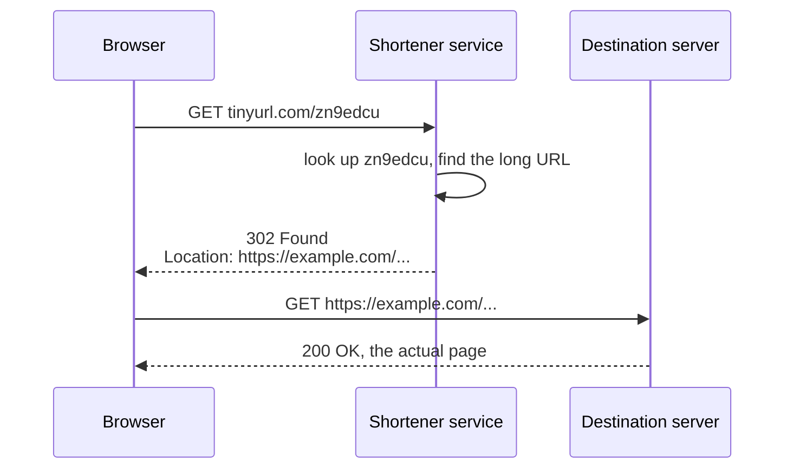
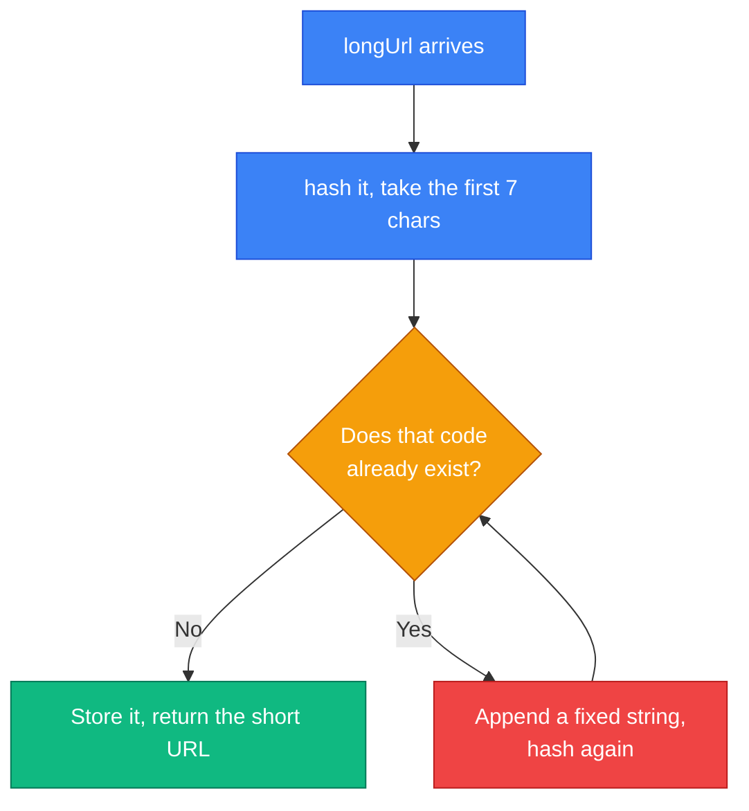
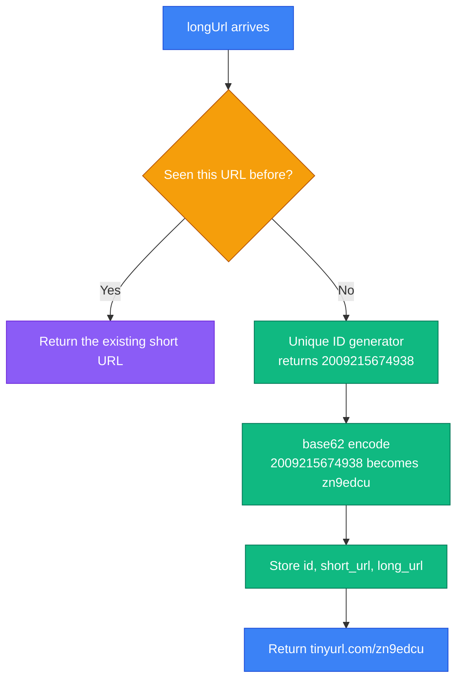
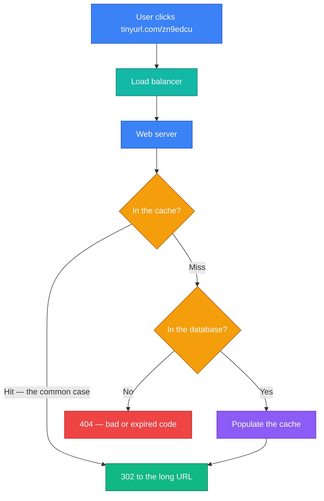
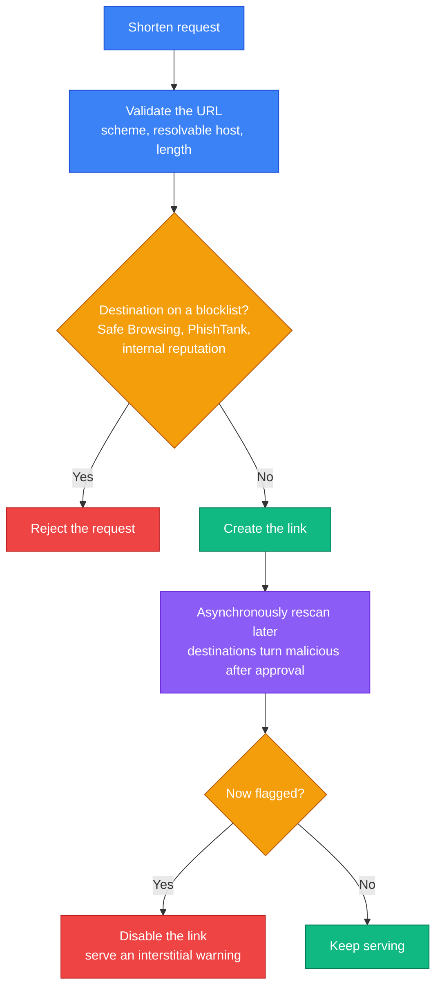
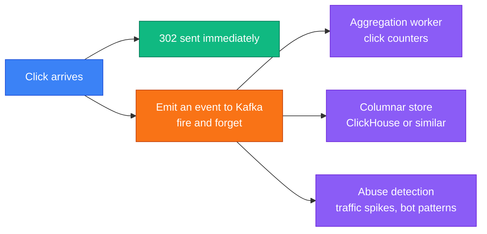

A URL shortener looks like the easiest system design question you will ever get. Store a mapping, hand back a short string, redirect. You could write it in an afternoon.

That is exactly why it gets asked. The naive version really is trivial — so the interview is not about whether you can build it. It is about whether you notice the four decisions hiding inside the triviality:

1. **How short can the code be?** Not a guess — an arithmetic answer from the traffic estimate.
2. **How do you generate the code?** Hash the URL, or encode a counter? They fail in completely different ways.
3. **301 or 302?** One of these silently destroys your analytics and makes links impossible to change. Most candidates pick it.
4. **What stops your service becoming a phishing tool?** Every real shortener spends more engineering effort here than on the shortening.

We will build it properly, in the order an interviewer expects, and then cover the production concerns the textbook treatment leaves out.

---

## Step 1 — Understand the Problem and Establish Scope

> **Candidate:** Can you give me an example of how the shortener should work?  
> **Interviewer:** A long URL like `https://www.systeminterview.com/q=chatsystem&c=loggedin&v=v3&l=long` becomes something like `https://tinyurl.com/y7keocwj`. Clicking the short one redirects to the long one.
>
> **Candidate:** What is the traffic volume?  
> **Interviewer:** 100 million URLs created per day.
>
> **Candidate:** How long should the short URL be?  
> **Interviewer:** As short as possible.
>
> **Candidate:** Which characters are allowed?  
> **Interviewer:** Digits and letters — `0-9`, `a-z`, `A-Z`.
>
> **Candidate:** Can links be deleted or updated?  
> **Interviewer:** Assume not, for simplicity.

Three use cases fall out:

1. **Shortening** — long URL in, short URL out.
2. **Redirecting** — short URL in, redirect to the long one.
3. **High availability, scalability, fault tolerance.**

### Back-of-the-envelope

These numbers are not decoration. Every design decision below is derived from them, and the code length comes directly out of the last line.

| Quantity | Working | Result |
|---|---|---|
| Writes per second | 100M / 24 / 3600 | **~1,160/s** |
| Reads per second | assume 10:1 read/write | **~11,600/s** |
| Records over 10 years | 100M x 365 x 10 | **365 billion** |
| Storage | 365B x 100 bytes | **~365 TB** |

Two observations worth saying aloud, because they shape everything after:

- **This is a read-heavy system, roughly 10:1.** The redirect path is the hot path. Optimising the shortening path is close to pointless; optimising the redirect path is the whole job.
- **365 billion records is the number that sizes the short code.** Hold on to it.

---

## Step 2 — High-Level Design

### API

Two endpoints. That is genuinely all:

```
POST /api/v1/data/shorten
     body:     { "longUrl": "https://example.com/very/long/path" }
     returns:  { "shortUrl": "https://tinyurl.com/zn9edcu" }

GET  /{shortUrl}
     returns:  301 or 302 redirect to the long URL
```

Note that the redirect endpoint is not `/api/v1/...`. It sits at the domain root, because every character in the path is a character the user has to look at. This is a system where **the URL is the product**, and that constraint reaches all the way into the API design.

### The redirect flow



The service never proxies content. It answers with a redirect and steps out of the way — which is why one modest server can handle a great deal of traffic.

### 301 versus 302 — the decision most candidates get wrong

This is the single highest-signal moment in the whole question.

| | **301 Permanent** | **302 Found (temporary)** |
|---|---|---|
| Browser caches it | Yes, aggressively and for a long time | No, by default |
| Later clicks reach your server | **No** | Yes |
| Server load | Much lower | Higher |
| Click analytics | **Broken** — you see the first click only | Complete |
| Can you change the destination? | **Effectively no** | Yes, immediately |
| Can you disable a malicious link? | **No** — already cached in browsers | Yes, immediately |

The textbook answer is "301 if you care about load, 302 if you care about analytics". That is true but incomplete, and stopping there is what costs candidates marks.

**In production, essentially everyone uses 302** — Bitly and TinyURL included. Two reasons the load argument does not survive contact with reality:

- **Analytics is frequently the entire business model.** A shortener that cannot count clicks has nothing to sell. Choosing 301 optimises away the product.
- **301 is unrevocable, and that is a safety problem.** If a link is reported for phishing, a 302 lets you disable it instantly. With a 301, every browser that has ever resolved that link keeps redirecting to the malicious destination, and you have no way to reach them. You have shipped a permanent redirect to an attacker.

Say this and you have answered a question they did not ask: you understand that the cheap option carries a liability the expensive one does not.

The load worry is real but solvable. Serve `302` with a short `Cache-Control: max-age`, and you get most of the caching benefit while keeping revocation and per-click visibility:

```
HTTP/1.1 302 Found
Location: https://example.com/very/long/path
Cache-Control: private, max-age=300
```

---

## Step 3 — Design Deep Dive

### Data model

The hash table from the high-level sketch will not survive 365 TB. Use a database table:

| Column | Type | Notes |
|---|---|---|
| `id` | BIGINT, primary key | The unique ID; the short code is derived from it |
| `short_url` | VARCHAR(7), unique index | What the user sees |
| `long_url` | VARCHAR(2048) | The destination |
| `created_at` | TIMESTAMP | For expiry and analytics |

### How long must the code be?

Now the estimate pays off. Our alphabet is `0-9`, `a-z`, `A-Z` — **62 characters**. Find the smallest `n` where `62^n` covers 365 billion records:

| Length `n` | `62^n` | Enough for 365 billion? |
|---|---|---|
| 4 | ~14.8 million | No |
| 5 | ~916 million | No |
| 6 | ~56.8 billion | No |
| **7** | **~3.5 trillion** | **Yes — with ~10x headroom** |
| 8 | ~218 trillion | Yes, but wastes a character |

**Seven characters.** Not a preference — an answer derived from the traffic estimate. Being able to produce that derivation on demand is the point of Chapter 2.

Why base62 rather than base64? Base64's alphabet includes `+` and `/`, which have reserved meanings in a URL and must be percent-encoded. That makes the "short" URL longer and uglier. Base62 is the largest alphabet that is safe in a URL path with no escaping.

### Approach A — hash and resolve collisions

Hash the long URL, keep the first 7 characters:

| Hash function | Output for `https://en.wikipedia.org/wiki/Systems_design` |
|---|---|
| CRC32 | `5cb54054` |
| MD5 | `5a62509a84df9ee03fe1230b9df8b84e` |
| SHA-1 | `0eeae7916c06853901d9ccbefbfcaf4de57ed85b` |

Even the shortest is too long, so you truncate — and truncation creates collisions. Resolving them requires checking the database before every write:



It works, but that loop contains **a database read on the write path, potentially several**, at 1,160 writes/second. A [Bloom filter](https://en.wikipedia.org/wiki/Bloom_filter) in front helps a great deal — it answers "definitely not present" in memory, so only possible hits reach the database — but the fundamental awkwardness remains.

It has one genuine advantage worth naming: hashing is **deterministic**, so the same long URL always yields the same code and you never store a duplicate.

### Approach B — base62 encode a unique ID

Do not hash anything. Take a globally unique ID and change its base.

Converting `11157` to base 62:

```
11157 / 62 = 179 remainder 59   ->  59 = 'X'
  179 / 62 =   2 remainder 55   ->  55 = 'T'
    2 / 62 =   0 remainder  2   ->   2 = '2'

read the remainders bottom-up:  2TX
```

The mapping is `0-9` → `0..9`, `a-z` → `10..35`, `A-Z` → `36..61`. So `11157` becomes `2TX`.

The full shortening flow:



That "unique ID generator" is not hand-waving — it is exactly the Snowflake design from [Chapter 7](/2026/05/design-unique-id-generator/). The chapters compose: Chapter 7 produces a unique 64-bit number with no coordination, and Chapter 8 renders it in base62.

### Comparing the two

| | Hash + collision resolution | **Base62 encoding** |
|---|---|---|
| Code length | Fixed 7 | Grows as IDs grow |
| Needs a unique ID generator | No | Yes |
| Collisions possible | Yes — must resolve | **Never** |
| DB read before write | Yes | No |
| Same URL gives the same code | Yes | No, unless you look it up |
| Codes are guessable | No | **Yes — sequential** |

Base62 is the standard answer, and the one to take forward. Its weakness is the last row, and we deal with it below.

### The redirect path, with caching

Reads outnumber writes 10:1, so this is where engineering effort belongs:



The access pattern here is unusually friendly. Link popularity is **extremely skewed** — a newly shared link takes an enormous burst of traffic within hours and then goes almost silent forever. A small LRU cache therefore captures a very high hit rate, because the working set is "links shared recently", not "all 365 billion links".

Mappings are also **immutable** once written, which removes cache invalidation as a concern entirely. That is a rare luxury; say so, because interviewers notice when you spot that a hard problem does not apply.

---

## Step 4 — What the Textbook Leaves Out

The book ends with a short list of "additional talking points". Every one of them is where a real shortener actually spends its engineering budget, so they deserve more than a sentence each.

### Sequential codes are enumerable, and that is a data leak

Base62-encoding a counter means `zn9edcu` is followed by `zn9edcv`. Anyone can walk the whole keyspace and harvest every link your users have ever created — including the ones they assumed were private because the URL was unguessable.

This is not theoretical. Researchers have scraped shortener keyspaces and recovered private cloud-storage documents and shared medical files, precisely because "nobody can guess the URL" was doing the security work.

Three defences, in increasing order of strength:

- **Do not use a plain counter.** A Snowflake ID has a timestamp in its high bits, so consecutive IDs are not consecutive integers — though they are still correlated.
- **Permute the ID before encoding.** Apply a reversible mapping (a Feistel network or a multiply-and-XOR over the ID space) so sequential IDs scatter across the keyspace. Codes stay unique and decodable, but the next one is unpredictable.
- **Add random bits.** Six base62 characters of counter plus a random seventh gives 62 candidate codes per ID, so enumeration costs 62x more for one extra character.

The honest framing: a short URL is **an obscure identifier, not an access control**. If content is sensitive, it needs authentication behind the redirect.

### Abuse is the hard problem

Shorteners are attractive to attackers for one reason: **they hide the destination.** A user cannot tell `tinyurl.com/zn9edcu` from a phishing page, and the shortener's reputable domain lends the link credibility that the real destination would not get.

A production design needs a pipeline the interview answer usually omits:



Two details that matter and are easy to miss:

- **Checking only at creation time is insufficient.** Attackers submit a benign page, get it approved, then change what that page serves. Rescanning has to be continuous.
- **This is why 302 is not negotiable.** Every mitigation above depends on being able to intercept the next click. A 301 removes that ability permanently.

Also guard against **open redirect**: validate that the destination is an absolute `http`/`https` URL with a resolvable host, and refuse `javascript:`, `data:` and links pointing back at your own domain (which attackers chain to launder a trusted domain into a phishing flow).

### Analytics must never block the redirect

Analytics is usually the product, but the redirect is on the user's critical path. Writing a click row synchronously puts your database between the user and their destination.



Send the redirect first, emit the event asynchronously. If the analytics pipeline is down, links keep working and you lose some counts — the correct trade, and worth stating explicitly.

### Custom aliases

Users want `tinyurl.com/my-product` rather than `zn9edcu`. Custom aliases change the design in three ways:

- They need a **uniqueness check on the write path** — the thing base62 encoding was designed to avoid. A Bloom filter absorbs most of this cheaply.
- They need a **reserved-word list**: `login`, `admin`, `api`, `settings`, and anything that collides with your own routes.
- They must live in the **same keyspace** as generated codes, or a custom alias will eventually collide with one. The usual fix is a length or character convention that generated codes never produce.

### Link rot and expiry

The book assumes links are never deleted. Real services cannot.

365 TB of links accumulated over ten years is mostly links nobody has clicked in years. Add a `created_at` and an optional `expires_at`, tier cold rows to cheaper storage, and consider a TTL for free-tier links. The counter-consideration is reputational: **a shortener whose links stop resolving breaks every page that ever embedded one.** That is the "link rot" that has followed several shutdowns, and it is why paid tiers usually promise permanence.

### Scaling the rest

- **Web tier** — stateless, so scale horizontally. Nothing interesting here, which is itself worth saying.
- **Database** — the read path is a single-key lookup, so this shards beautifully by short code. There are no joins and no range queries to complicate it.
- **Rate limiting** — cap creation per IP and per account, or someone will mint links for a spam campaign. See [Chapter 4](/2026/05/design-a-rate-limiter/).
- **Geography** — redirect latency is user-visible on every click. Put read replicas and caches near users, and serve the redirect from the nearest region.

---

## Interview Quick Reference

**The estimate, and what it decides:**

| Quantity | Value | What it determines |
|---|---|---|
| Writes | ~1,160/s | Modest — one database can absorb it |
| Reads | ~11,600/s | The hot path; drives caching |
| 10-year records | 365 billion | **Sets the code length at 7** |
| Storage | ~365 TB | Drives sharding and tiering |

**Why 7 characters:** 62 URL-safe characters, `62^6` = 56.8 billion (too few), `62^7` = 3.5 trillion (about 10x headroom over 365 billion).

**The two generation strategies:**

| | Hash + resolve | Base62 of a unique ID |
|---|---|---|
| Collisions | Possible | None |
| DB read before write | Required | Not required |
| Guessable | No | **Yes — mitigate it** |

**Points that separate a strong answer:**

- **302, not 301** — and the reason is revocation and analytics, not just load. A 301 you cannot recall is a permanent redirect handed to an attacker.
- **7 characters is derived**, not chosen. Show the `62^n` arithmetic.
- **Base62 not base64**, because `+` and `/` need escaping in a URL.
- **Sequential codes are enumerable** — permute the ID before encoding, and never treat a short URL as access control.
- **Cache hit rates are unusually high** because popularity is skewed and mappings are immutable, so there is no invalidation problem.
- **Analytics goes on a queue**, never on the redirect path.
- **Abuse scanning must be continuous**, not just at creation.

---

## Summary

| Idea | Why it matters |
|---|---|
| Derive the code length | `62^7` covers 365 billion with headroom — arithmetic, not taste |
| Base62, not base64 | `+` and `/` are not safe in a URL path |
| Encode an ID, do not hash | No collisions and no database read before writing |
| Chapters compose | The unique ID from Chapter 7 becomes the short code here |
| 302 keeps you in the loop | Analytics, changeable destinations, and the ability to kill a bad link |
| Immutable mappings | No cache invalidation — a genuinely rare simplification |
| Obscurity is not security | Sequential codes are enumerable; sensitive content needs real auth |
| Abuse is the real work | Blocklists at creation, continuous rescanning, and an interstitial |

---

## References and Further Reading

**The building blocks**

- [Bloom filter](https://en.wikipedia.org/wiki/Bloom_filter) — the membership test that makes collision checks and alias lookups cheap
- [A RESTful tutorial](https://www.restapitutorial.com/) — background on the API conventions used above
- [Chapter 7: Design a Unique ID Generator](/2026/05/design-unique-id-generator/) — where the ID behind the short code comes from
- [Chapter 4: Design a Rate Limiter](/2026/05/design-a-rate-limiter/) — stopping bulk link creation

**Redirects, properly**

- [RFC 9110 §15.4 — Redirection 3xx](https://www.rfc-editor.org/rfc/rfc9110.html#section-15.4) — what 301, 302, 307 and 308 actually specify
- [MDN: 301 Moved Permanently](https://developer.mozilla.org/en-US/docs/Web/HTTP/Status/301) and [302 Found](https://developer.mozilla.org/en-US/docs/Web/HTTP/Status/302) — including the caching behaviour that breaks analytics

**Security and abuse**

- [Google Safe Browsing](https://developers.google.com/safe-browsing) — the blocklist API most services check against
- [OWASP: Unvalidated redirects and forwards](https://cheatsheetseries.owasp.org/cheatsheets/Unvalidated_Redirects_and_Forwards_Cheat_Sheet.html) — the open-redirect class of bug
- [URL shorteners and phishing](https://www.captaindns.com/en/blog/url-shorteners-security-risks-phishing-attack-vector) — why shortener domains get flagged wholesale

**Production write-ups**

- [Short URL best practices](https://bitly.com/blog/short-url-best-practices/) — Bitly, from the operator's side
- [Design a URL shortener](https://algomaster.io/learn/system-design-interviews/design-url-shortener) — a thorough alternative walkthrough

**Books**

- *System Design Interview – An Insider's Guide* — Alex Xu. The chapter this article follows.
- *Designing Data-Intensive Applications* — Martin Kleppmann. Chapter 6 on partitioning covers sharding this key space properly.

---

## What's Next?

In **Chapter 9** we design a **web crawler** — a system that must be polite, parallel and effectively infinite, and where the hardest problems are not fetching pages but deciding which page to fetch next and how to avoid downloading the same content a thousand times.

*This chapter was mostly composition. The unique ID generator came from Chapter 7, the caching from Chapter 1, the rate limiter from Chapter 4. That is what senior design looks like — not inventing mechanisms, but recognising which ones you already have.*
