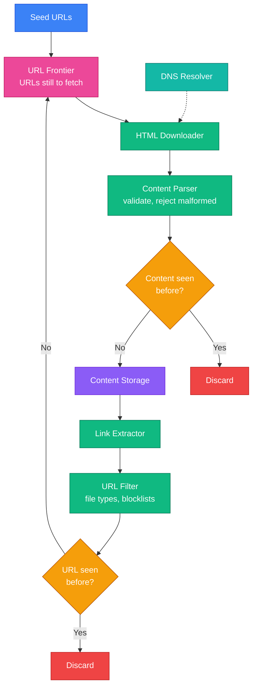
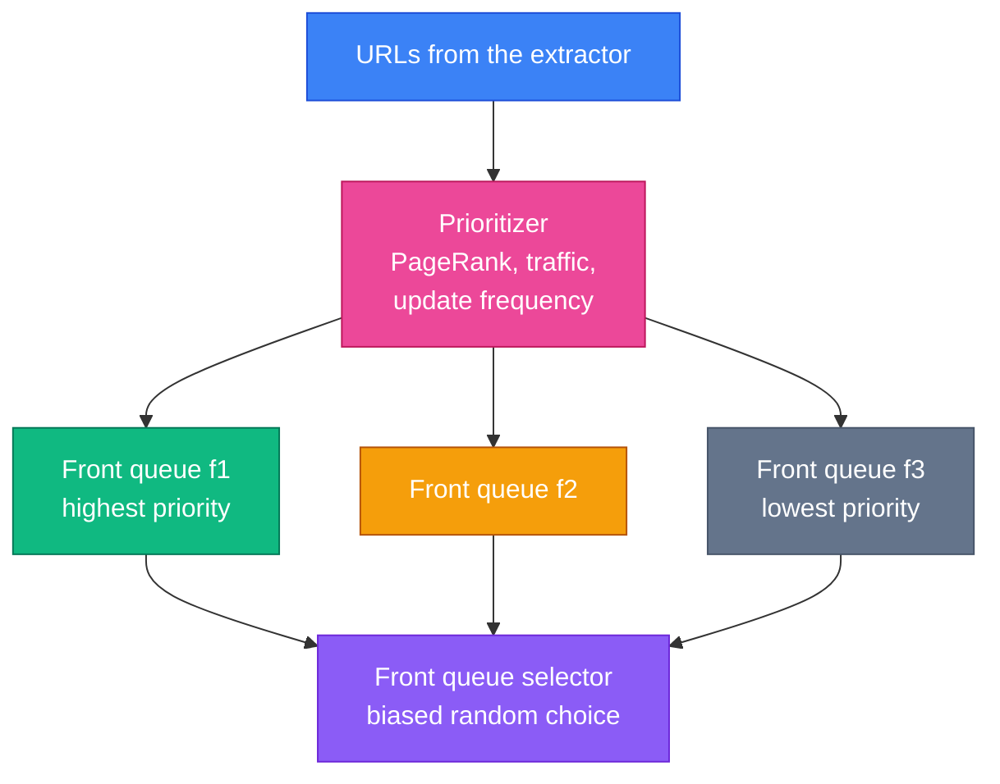
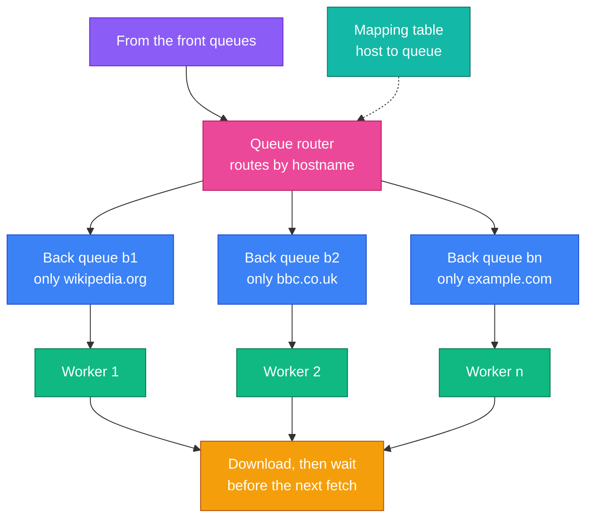
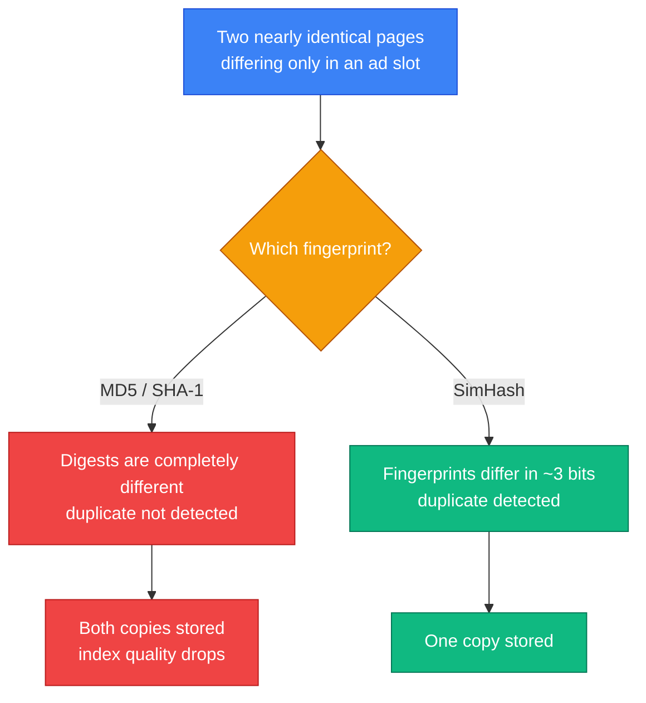

The algorithm for a web crawler fits on a napkin:

1. Take a URL off a queue.
2. Download the page.
3. Extract its links.
4. Put the new ones back on the queue. Repeat.

Write that and you have a crawler. Point it at the open web and within about ten minutes you will have been rate-limited, IP-banned, trapped in an infinitely deep calendar page, and served the same article eleven times under eleven different URLs.

Every hard part of this system is a consequence of the web being **hostile, redundant and effectively infinite**. The interesting design work is not fetching pages — HTTP libraries do that. It is answering three questions:

- **Which URL next?** Not all pages are worth the same, and the obvious queue order is the impolite one.
- **How fast, per site?** Crawl one host too aggressively and you have written a denial-of-service tool.
- **Have I seen this already?** About a third of the web is duplicated, and exact-match hashing catches less of it than you would expect.

---

## Step 1 — Understand the Problem and Establish Scope

> **Candidate:** What is the crawler for — search indexing, data mining, something else?  
> **Interviewer:** Search engine indexing.
>
> **Candidate:** How many pages per month?  
> **Interviewer:** 1 billion.
>
> **Candidate:** Which content types? HTML only, or PDFs and images too?  
> **Interviewer:** HTML only.
>
> **Candidate:** Do we need to re-crawl pages that change?  
> **Interviewer:** Yes, newly added and edited pages matter.
>
> **Candidate:** Do we store the HTML we download?  
> **Interviewer:** Yes, for up to five years.
>
> **Candidate:** What about duplicate content?  
> **Interviewer:** Ignore it.

Four properties define a good crawler, and each maps to a section below:

| Property | What it means |
|---|---|
| **Scalability** | The web is billions of pages. Crawling must be massively parallel |
| **Robustness** | Bad HTML, dead servers, redirect loops, malicious pages — all routine |
| **Politeness** | Never hammer one host. This is the constraint that shapes the architecture |
| **Extensibility** | Adding image or PDF crawling should not mean a redesign |

### Back-of-the-envelope

| Quantity | Working | Result |
|---|---|---|
| Pages per second | 1B / 30 / 24 / 3600 | **~400 QPS** |
| Peak | 2x average | **~800 QPS** |
| Storage per month | 1B x 500 KB | **500 TB** |
| Storage over 5 years | 500 TB x 12 x 5 | **30 PB** |

400 pages/second sounds modest. It is not, once politeness enters: if you may only fetch one page per second from a host, sustaining 400 QPS means having **at least 400 distinct hosts in flight simultaneously**. That single sentence explains why the queue design below is as elaborate as it is.

---

## Step 2 — High-Level Design



Notice the shape: it is **a loop, not a pipeline**. Links extracted from a page feed back into the frontier, and that feedback is what makes the system self-sustaining — and what makes it capable of running away from you.

Two components deserve immediate comment.

**Two "seen?" checks, not one.** `URL seen?` stops you queueing the same address twice. `Content seen?` stops you *storing* the same page fetched under two different addresses. They catch different problems: the first saves bandwidth, the second saves storage and index quality. Candidates routinely design only one.

**Seed selection is a real decision.** Seeds determine what your crawler can ever reach — anything not linked, directly or transitively, from a seed is invisible to you. The usual strategies are geographic (popular sites differ by country) and topical (shopping, news, academia). It is open-ended, and interviewers want to hear you reason rather than produce a definitive answer.

---

## Step 3 — Design Deep Dive

### Why BFS, and why plain BFS is still wrong

Model the web as a directed graph: pages are nodes, links are edges. Crawling is graph traversal.

**Depth-first is unusable.** The web has no meaningful depth limit, so DFS wanders arbitrarily far down one path and may never come back.

**Breadth-first is right in principle** — a FIFO queue, crawl outward in rings. But a naive FIFO has two failures:

- **It is accidentally impolite.** Most links on a page point to the same host. Pop a Wikipedia page and you enqueue 200 more Wikipedia URLs. A FIFO will now hammer one server with hundreds of parallel requests — indistinguishable from an attack.
- **It ignores value.** A forum comment and a newspaper front page are dequeued in arrival order. They are not worth the same.

Both problems belong to one component.

### The URL frontier

The frontier is not "a queue". It is the piece of the design that reconciles two goals that pull in opposite directions: **fetch valuable pages first** (priority), and **never overload a host** (politeness). It solves them in two stages.

**Stage 1 — front queues handle priority.**



The selector picks randomly but **biased** toward high-priority queues. The bias, rather than strict ordering, is deliberate: strict priority starves low-priority URLs forever, and a crawler that never revisits the long tail slowly rots.

**Stage 2 — back queues handle politeness.**



The invariant is the whole trick: **each back queue holds URLs from exactly one host, and each worker thread owns exactly one back queue.** A worker fetches, waits, fetches again. Because only one worker ever touches a given host, politeness is guaranteed *structurally* — there is no shared counter to get wrong and no race to lose.

This is why 400 QPS requires hundreds of hosts in flight. Throughput comes from **breadth across hosts**, never from depth within one.

**Storage.** Hundreds of millions of URLs will not fit in memory, and pure disk is too slow to keep workers fed. The standard answer is hybrid: the bulk on disk, with in-memory enqueue and dequeue buffers flushed periodically.

### Politeness in detail: robots.txt

Before fetching anything from a host, fetch `/robots.txt` and obey it. Cache the result — re-fetching it per URL would itself be impolite.

```
User-agent: Googlebot
Disallow: /creatorhub/*
Disallow: /gp/aw/cr/
```

**What changed since this chapter was written.** Robots.txt was an informal convention for 25 years. It became a real standard — **[RFC 9309](https://datatracker.ietf.org/doc/html/rfc9309), September 2022** — and the specifics are exactly the kind of detail that separates someone who has built a crawler from someone who has read about one:

- **Longest match wins**, not first match. Given `Disallow: /a/` and `Allow: /a/b/`, the path `/a/b/c` is *allowed*, because the more specific rule governs. Implement first-match and you will silently crawl forbidden paths.
- **Wildcards are standard**: `*` for any sequence, `$` to anchor the end of a URL.
- **An unreachable robots.txt means "disallow everything".** If the server returns a 5xx, you must assume you are not welcome. Treating a failed fetch as permission is the single most common — and most rude — implementation bug.
- **`Crawl-delay` is not part of the standard.** Bing and Yandex honour it; Google ignores it. Do not rely on it for your politeness policy; enforce your own delay.
- **`Sitemap:` lines are a gift.** A sitemap is a curated list of canonical URLs, which is a far better discovery channel than link-following.

### The downloader, and why DNS is the bottleneck

Four optimisations, in rough order of impact:

1. **Distribute the crawl.** Partition the URL space across servers, each running many threads. [Consistent hashing](/2026/05/design-consistent-hashing/) assigns hosts to downloaders so servers can be added and removed without reshuffling everything.
2. **Cache DNS.** This is the one people miss. DNS resolution takes 10–200 ms and many resolver APIs are synchronous, so a lookup blocks a thread. At 400 pages/second an uncached resolver becomes the limiting factor before bandwidth does. Keep your own host-to-IP cache with periodic refresh.
3. **Exploit locality.** Put crawl servers near the sites they fetch. Fetching European sites from Europe is simply faster, and the same reasoning applies to your caches and storage.
4. **Use short timeouts.** Some servers never respond. Cap the wait and move on — one hung host must not occupy a worker indefinitely.

### Duplicate detection: hashing is not enough

Roughly **29% of the web is duplicate content**. The book suggests comparing hashes rather than documents, which is right and necessary — but only catches *byte-identical* pages.

Real duplication is rarely byte-identical. The same article appears with a different ad, a rotating timestamp, a different session ID in the footer. A cryptographic hash is maximally sensitive to exactly that: **one changed byte gives a completely different digest**, so MD5 or SHA-1 will happily store all eleven copies.

The production answer is a **similarity-preserving hash** — a fingerprint where near-identical documents produce near-identical values. [SimHash](https://en.wikipedia.org/wiki/SimHash) is the classic, and [Google published on using it for exactly this](https://research.google.com/pubs/archive/33026.pdf) in 2007:



The rule: near-duplicates differ in only a handful of bit positions, so "is this a duplicate?" becomes "is the Hamming distance below a threshold?" Naming SimHash, and explaining *why* a cryptographic hash cannot do this job, is a strong moment in an interview.

For the `URL seen?` check the requirement is different — exact membership over hundreds of millions of entries — so a **Bloom filter** backed by a hash table is the right tool. It answers "definitely not seen" in memory and only consults storage on a possible hit.

### Spider traps and other hostile terrain

A **spider trap** is a page — usually unintentional — that generates infinite unique URLs. An infinitely deep directory, or a calendar with a "next month" link forever:

```
example.com/cal/2026/06
example.com/cal/2026/07
example.com/cal/2026/08   ... and so on, indefinitely
```

There is no general solution, which is worth saying plainly rather than inventing one. Practical defences:

- **Cap URL length and path depth.** Crude, and it works.
- **Cap pages per host.** A site yielding millions of URLs is either genuinely enormous or a trap; either way it deserves a budget.
- **Detect near-identical content across a URL pattern.** Your SimHash work already tells you the pages are the same.
- **Maintain a manual blocklist.** Unglamorous, and every real crawler has one.

Alongside traps, filter **data noise** — advertisements, spam pages, boilerplate — which costs storage and degrades the index without adding information.

### Robustness and extensibility

- **Consistent hashing** to distribute hosts across downloaders, so capacity changes do not reshuffle the world.
- **Checkpoint crawl state**, so a crash resumes rather than restarting a month of work.
- **Handle exceptions per URL.** One malformed page must never take down a worker.
- **Extend by plugging in modules.** A PNG downloader or a copyright monitor attaches to the same pipeline. This is why the content parser is a separate component rather than living inside the downloader.

---

## Beyond the Book: Crawling in 2026

Two things changed materially after this chapter was written.

**robots.txt became a standard.** RFC 9309 (2022) turned a 1994 convention into a specification with normative parsing rules — covered above, and worth citing by number.

**The crawler population changed completely.** For twenty years "crawler" meant a search engine. Since 2023 a large and growing share of crawl traffic comes from **AI crawlers**: GPTBot (OpenAI), ClaudeBot (Anthropic), Google-Extended, PerplexityBot, Bytespider. As of 2026 there are at least twenty operating at scale.

This matters for a crawler designer in three ways:

- **Your user-agent is now a reputational asset.** Sites increasingly allow or deny by name. A crawler that misbehaves gets its user-agent blocked across large parts of the web, and that is not recoverable by changing IPs.
- **Sites defend more aggressively than they used to.** Cloudflare-style bot management, proof-of-work challenges and per-user-agent rules are ordinary now. Politeness is no longer merely courteous — it is what keeps you unblocked.
- **There is a distinction worth knowing.** *Crawlers* fetch broadly and are expected to honour robots.txt. *User-triggered fetchers* — where a person asked a question about a specific page — often deliberately do not, because a human requested that page. Knowing that this distinction is contested shows genuine currency with the field.

The honest position: robots.txt is a request, not a control. It excludes polite crawlers, which are typically the ones a site benefits from. That asymmetry is an unsolved problem, and being able to state it clearly is more valuable than pretending it is settled.

---

## Interview Quick Reference

**The estimate:** 1B pages/month → ~400 QPS average, ~800 peak, 500 TB/month, 30 PB over five years.

**The one insight to lead with:** politeness limits you to roughly one request per host at a time, so 400 QPS requires **hundreds of hosts in flight simultaneously**. Throughput comes from breadth, never depth.

**The frontier, in two layers:**

| Layer | Job | Mechanism |
|---|---|---|
| Front queues | Priority | Prioritizer + biased random selection |
| Back queues | Politeness | One host per queue, one queue per worker |

**Component checklist:** seeds → frontier → downloader (+ DNS cache) → parser → `content seen?` → storage → link extractor → URL filter → `URL seen?` → back to the frontier.

**Points that lift an answer:**

- **Two separate dedup checks** — `URL seen?` saves bandwidth, `content seen?` saves storage.
- **Cryptographic hashes miss near-duplicates.** Name SimHash and explain why.
- **DNS is the surprise bottleneck** — 10–200 ms, often synchronous. Cache it.
- **robots.txt is RFC 9309** — longest match wins, and an unreachable file means disallow everything.
- **Biased selection, not strict priority**, or the long tail starves.
- **Spider traps have no general solution** — budget per host and cap depth.

---

## Summary

| Idea | Why it matters |
|---|---|
| Politeness drives the architecture | One host at a time forces breadth-first parallelism across hosts |
| The frontier is two systems | Front queues rank; back queues pace |
| Structure beats coordination | One host per queue makes politeness an invariant, not a check |
| BFS with priority, not plain BFS | Naive FIFO is both impolite and value-blind |
| Dedup twice, differently | Exact match for URLs, similarity for content |
| SimHash over MD5 | Near-duplicates are the real duplicates |
| Cache DNS | It is the bottleneck before bandwidth is |
| The web is adversarial | Traps, noise and bot defences are the default condition |

---

## References and Further Reading

**The standards**

- [RFC 9309 — Robots Exclusion Protocol](https://datatracker.ietf.org/doc/html/rfc9309) — the 2022 standardisation, including longest-match and failure semantics
- [Google's robots.txt documentation](https://developers.google.com/search/docs/crawling-indexing/robots/robots_txt) — how the largest crawler actually interprets it
- [Sitemaps protocol](https://www.sitemaps.org/protocol.html) — the discovery channel that beats link-following

**The foundational papers**

- [Detecting Near-Duplicates for Web Crawling](https://research.google.com/pubs/archive/33026.pdf) — Manku, Jain and Das Sarma, WWW 2007. The SimHash paper
- [SimHash](https://en.wikipedia.org/wiki/SimHash) — the technique in brief
- [The Anatomy of a Large-Scale Hypertextual Web Search Engine](http://infolab.stanford.edu/~backrub/google.html) — Brin and Page, 1998. Google's original crawler and PageRank
- [Bloom filter](https://en.wikipedia.org/wiki/Bloom_filter) — the membership test behind `URL seen?`

**Crawling as it is now**

- [Common Crawl](https://commoncrawl.org/) — a petabyte-scale open crawl you can inspect and download
- [The AI crawler landscape](https://www.humansecurity.com/learn/blog/crawlers-list-known-bots-guide/) — who is crawling in 2026 and what they want

**Related chapters**

- [Chapter 5: Design Consistent Hashing](/2026/05/design-consistent-hashing/) — distributing hosts across downloaders
- [Chapter 2: Back-of-the-Envelope Estimation](/2026/05/back-of-the-envelope-estimation/) — where the 30 PB came from

**Books**

- *System Design Interview – An Insider's Guide* — Alex Xu. The chapter this article follows.
- *Introduction to Information Retrieval* — Manning, Raghavan and Schütze. Chapter 20 is the rigorous treatment of web crawling, and free online.

---

## What's Next?

In **Chapter 10** we design a **notification system** — push, SMS and email at scale, where the interesting problems are third-party providers that fail unpredictably, exactly-once delivery that cannot actually be guaranteed, and how not to send the same alert eleven times.

*The frontier in this chapter is worth remembering beyond crawling. Whenever you must be fast in aggregate but gentle to each individual downstream, the answer has this shape: partition by the thing you must protect, then parallelise across partitions.*
