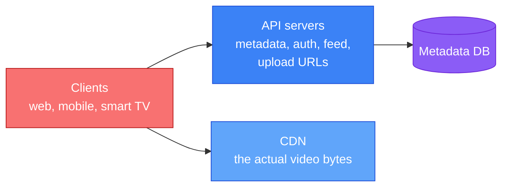
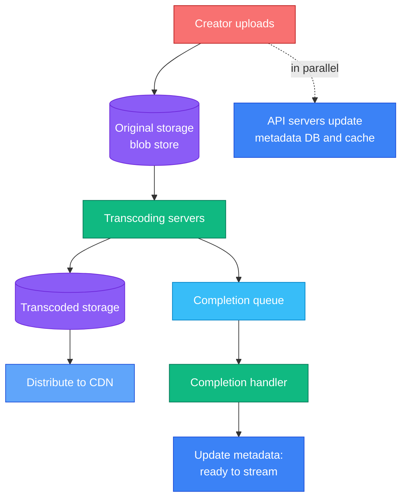
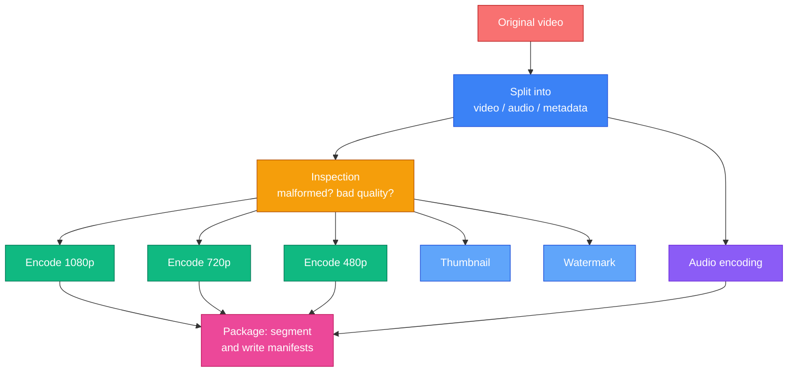
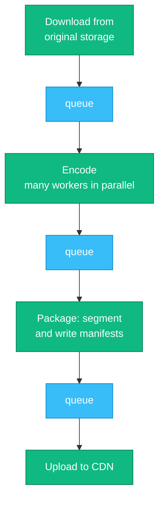
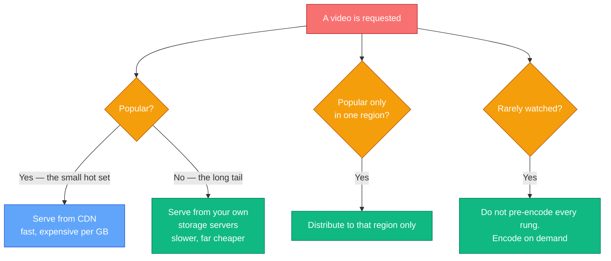

Every previous chapter optimised for latency, throughput or correctness. This one optimises for **money**, and that changes which answers are right.

Do the estimate before anything else. Five million daily users watching five videos of 300 MB each, served from a CDN at roughly $0.02/GB:

```
5,000,000 users x 5 videos x 0.3 GB x $0.02 = $150,000 per day
```

**Fifty-five million dollars a year, in bandwidth alone.** No database, no compute, no salaries — just moving bytes to viewers. That single number outweighs every other cost in the system, and it means a design that is elegant but bandwidth-hungry is simply a worse design.

So the interesting questions here are not "how do we store it" or "how do we scale it". They are:

- **How do you avoid sending bytes at all?** Caching, popularity, regionality.
- **How do you send fewer bytes for the same picture?** Codecs and per-title encoding.
- **How do you send them more cheaply?** Peering and your own CDN.

---

## Step 1 — Understand the Problem and Establish Scope

> **Candidate:** Which features matter?  
> **Interviewer:** Upload a video, and watch a video.
>
> **Candidate:** Which clients?  
> **Interviewer:** Mobile apps, web browsers, and smart TVs.
>
> **Candidate:** Scale?  
> **Interviewer:** 5 million daily active users, about 30 minutes each per day.
>
> **Candidate:** International?  
> **Interviewer:** Yes, a large share of users are outside our home region.
>
> **Candidate:** Which resolutions and formats?  
> **Interviewer:** Accept most of them.
>
> **Candidate:** Maximum file size?  
> **Interviewer:** 1 GB. Small and medium videos.
>
> **Candidate:** Can we use cloud services rather than building everything?  
> **Interviewer:** Yes — that is the sensible choice.

That last exchange is worth having explicitly. **Nobody builds their own blob storage or CDN in an interview answer, and almost nobody should in reality.** Netflix runs on AWS; Facebook used Akamai. Saying "S3 and CloudFront" and moving on is the correct level of abstraction — the interviewer wants to see you allocate your time to what is actually distinctive about this problem.

### Back-of-the-envelope

| Quantity | Working | Result |
|---|---|---|
| Uploads per day | 5M x 10% x 1 video | 500,000 |
| Storage per day | 500,000 x 300 MB | **150 TB/day** |
| Videos watched | 5M x 5 | 25M/day |
| CDN egress | 25M x 0.3 GB | **7.5 PB/day** |
| **CDN cost** | 7.5 PB x $0.02/GB | **~$150,000/day** |

Two numbers, two very different problems. **150 TB/day of storage** is a large but ordinary object-storage bill. **7.5 PB/day of egress** is the entire business.

Note the asymmetry: you store each video once and serve it thousands of times. Optimising storage saves you a little; optimising egress saves you everything.

---

## Step 2 — High-Level Design

Three pieces, and the split matters:



**Video bytes never touch your API servers.** Playback goes client → CDN, directly. Your servers handle metadata, auth and signed URLs — kilobytes, not gigabytes. Routing 7.5 PB/day through your application tier would be absurd, and recognising that immediately is the first thing an interviewer is checking.

### The upload flow



Two things run **in parallel**: the bytes go to storage while the metadata (title, description, size) goes to the database. There is no reason to make the creator wait for one before the other starts.

The video is not watchable when the upload finishes — it is watchable when **transcoding** finishes, which is why the completion queue and handler exist. That gap is why every platform shows "processing" after upload.

---

## Step 3 — Design Deep Dive

### Why transcode at all

The source file is whatever the creator's camera produced: possibly 4K, possibly an exotic codec, certainly not what a phone on 3G can play. Transcoding converts it into a **ladder** of renditions.

<div class="diagram"><svg viewBox="0 0 740 320" xmlns="http://www.w3.org/2000/svg" style="width:100%;max-width:740px;margin:2rem auto;display:block;">
  <text x="370" y="22" text-anchor="middle" font-size="13" font-weight="700" fill="var(--dg-text)">Adaptive bitrate: the player switches rungs mid-playback as bandwidth changes</text>

  <rect x="18" y="40" width="150" height="40" rx="8" fill="var(--dg-red)" fill-opacity="0.18" stroke="var(--dg-red)" stroke-width="2"/>
  <text x="93" y="65" text-anchor="middle" font-size="13" font-weight="700" fill="var(--dg-red-tx)">source 4K</text>

  <text x="200" y="65" font-size="13" font-weight="650" fill="var(--dg-muted)">encode once into</text>

  <rect x="330" y="38" width="392" height="26" rx="5" fill="var(--dg-blue)" fill-opacity="0.30" stroke="var(--dg-blue)"/>
  <text x="342" y="56" font-size="12" font-weight="700" fill="var(--dg-text)">1080p</text>
  <text x="712" y="56" font-size="11" text-anchor="end" fill="var(--dg-muted)">5.0 Mbps</text>

  <rect x="330" y="70" width="316" height="26" rx="5" fill="var(--dg-blue)" fill-opacity="0.24" stroke="var(--dg-blue)"/>
  <text x="342" y="88" font-size="12" font-weight="700" fill="var(--dg-text)">720p</text>
  <text x="636" y="88" font-size="11" text-anchor="end" fill="var(--dg-muted)">2.5 Mbps</text>

  <rect x="330" y="102" width="240" height="26" rx="5" fill="var(--dg-blue)" fill-opacity="0.18" stroke="var(--dg-blue)"/>
  <text x="342" y="120" font-size="12" font-weight="700" fill="var(--dg-text)">480p</text>
  <text x="560" y="120" font-size="11" text-anchor="end" fill="var(--dg-muted)">1.1 Mbps</text>

  <rect x="330" y="134" width="176" height="26" rx="5" fill="var(--dg-blue)" fill-opacity="0.13" stroke="var(--dg-blue)"/>
  <text x="342" y="152" font-size="12" font-weight="700" fill="var(--dg-text)">360p</text>
  <text x="496" y="152" font-size="11" text-anchor="end" fill="var(--dg-muted)">0.6 Mbps</text>

  <line x1="176" y1="60" x2="322" y2="60" stroke="var(--dg-muted)" stroke-width="1.5"/>
  <line x1="322" y1="51" x2="322" y2="147" stroke="var(--dg-muted)" stroke-width="1.5"/>

  <text x="18" y="196" font-size="13" font-weight="700" fill="var(--dg-text)">Each rendition is cut into 2-6 second segments</text>
  <text x="18" y="216" font-size="12" fill="var(--dg-muted)">A manifest lists what exists; the player picks a rung per segment.</text>

  <rect x="18" y="230" width="704" height="34" rx="6" fill="var(--dg-panel)" stroke="var(--dg-border)"/>
  <text x="34" y="252" font-size="12" font-weight="700" fill="var(--dg-green-tx)">720p</text>
  <text x="96" y="252" font-size="12" font-weight="700" fill="var(--dg-green-tx)">720p</text>
  <text x="158" y="252" font-size="12" font-weight="700" fill="var(--dg-orange-tx)">480p</text>
  <text x="220" y="252" font-size="12" font-weight="700" fill="var(--dg-red-tx)">360p</text>
  <text x="282" y="252" font-size="12" font-weight="700" fill="var(--dg-orange-tx)">480p</text>
  <text x="344" y="252" font-size="12" font-weight="700" fill="var(--dg-green-tx)">720p</text>
  <text x="406" y="252" font-size="12" font-weight="700" fill="var(--dg-green-tx)">1080p</text>
  <text x="478" y="252" font-size="12" font-weight="700" fill="var(--dg-green-tx)">1080p</text>
  <text x="560" y="252" font-size="12" fill="var(--dg-muted)">... one choice per segment, made by the player</text>

  <text x="18" y="292" font-size="12" fill="var(--dg-muted)">The viewer sees quality dip on a bad train connection and recover afterwards, without the video ever stopping.</text>
</svg></div>

That is **adaptive bitrate streaming**. Encode once into many rungs, cut each into short segments, publish a manifest describing them, and let the **player** decide which rung to fetch next based on measured bandwidth. Quality degrades instead of buffering — which viewers tolerate far better.

### Transcoding as a DAG

Transcoding is not one operation. Different creators need different things: a watermark, a supplied thumbnail, extra resolutions. Hard-coding a pipeline means changing code for every new requirement.

The answer, which Facebook's streaming video engine uses, is a **directed acyclic graph** — declare the tasks and their dependencies, and let a scheduler run whatever can run in parallel:



The graph structure *is* the parallelism: the three encodes have no dependency on each other, so they run simultaneously on different workers. Adding "also produce a vertical crop for mobile" becomes a new node, not a rewrite.

Around that sits a small orchestration system — a **preprocessor** that splits the video, a **DAG scheduler** that dispatches ready tasks, a **resource manager** that allocates workers, and **task workers** that do the encoding.

### Speed: chunk the upload

A 1 GB upload that fails at 95% and restarts from zero is a terrible experience, and on mobile it may never succeed.

Split the video into chunks aligned to **GOP boundaries** — a Group of Pictures is a self-contained run of frames, so a chunk boundary there is independently decodable. Then:

- **Failures resume** from the last completed chunk rather than the beginning.
- **Chunks upload in parallel**, saturating available bandwidth.
- **Transcoding starts before the upload finishes**, because early chunks are already complete.

That last point is the one people miss, and it materially shortens the time from "upload" to "ready".

Two more speed levers: put **upload endpoints near creators** (the same CDN edge, working in reverse), and **decouple every pipeline stage with a queue** so download, encode and package do not block on each other.



Chained directly, each stage idles waiting for the one before it, and the whole pipeline runs at the speed of its slowest step. With a queue between each pair, the encode workers pull whatever is ready instead of waiting on a specific download — so every stage stays busy and each scales independently.

### Safety: pre-signed URLs and content protection

Clients upload **directly to blob storage**, never through your servers — otherwise every byte of every upload transits your application tier. But you cannot hand out write access to your bucket.

A **pre-signed URL** solves it: the client asks your API for permission, you return a URL that grants write access to one specific object for a short window, and the client uploads straight to storage. Your servers stay on the control path and off the data path.

For protecting the content itself: **DRM** (FairPlay, Widevine, PlayReady) for licensed material, **AES encryption** with an authorisation policy for a lighter approach, and **visible watermarking** as a deterrent rather than a control.

### Cost: the only optimisation that matters at this scale

Video popularity follows a **long tail** — a small number of videos take most of the views, and an enormous number are watched almost never. That distribution is the lever.



Four moves, in increasing order of ambition:

1. **CDN only for the hot set.** Serve the long tail from your own storage. Slower for those videos, and nobody is watching them anyway.
2. **Do not pre-encode everything.** A video with 40 lifetime views does not need six renditions sitting in storage. Encode rare ones on demand.
3. **Distribute regionally.** A video popular only in Brazil need not occupy cache space in Tokyo.
4. **Build your own CDN and peer with ISPs**, as Netflix does with Open Connect. Enormous undertaking, and at this bill it eventually pays for itself.

### Error handling

Split failures in two, because they need opposite responses:

- **Recoverable** — a segment fails to transcode, a chunk upload times out. Retry a bounded number of times.
- **Non-recoverable** — the file is malformed or the codec is unsupported. Stop immediately, cancel related tasks, and return a clear error. Retrying will never help and burns encoding capacity.

---

## Beyond the Book

### How adaptive bitrate actually works

The book names HLS and DASH and moves on. The mechanics are simple and worth knowing:

- **Segments** — each rendition is cut into 2–6 second files.
- **A manifest** — `.m3u8` for HLS, `.mpd` for DASH — lists the renditions and their segments.
- **The player decides.** It measures throughput and buffer level and picks the next segment's rung. All the adaptation logic lives on the client; the server just serves files.

That last point explains why this scales: **the CDN is serving static files.** There is no session, no state, no per-viewer work. It is the reason one origin can back millions of concurrent viewers.

**HLS or DASH?** In practice, both — HLS for Apple devices, DASH elsewhere. Historically that meant encoding everything twice. **CMAF** removes that tax by letting both manifests point at the *same* segment files, so you pay once for encoding and storage and publish two manifests over it. Naming CMAF is a strong, current detail.

Low-latency variants (LL-HLS, LL-DASH with chunked transfer) now reach roughly **2–5 seconds** glass-to-glass, which is what makes live sports viable.

### Per-title encoding: the same picture for a fraction of the bytes

A fixed ladder gives every video the same rungs. But a static cartoon and a football match do not need the same bitrate for the same perceived quality — the cartoon has far less to encode.

Netflix's **per-title encoding** analyses each video's complexity and builds a ladder for *it*. The published results are striking: a title whose top rung needs **1.9 Mbps** to reach a given quality score would have been served at **15 Mbps** by a fixed ladder. That is roughly an **87% cut in egress for that title** with no visible quality loss.

Against a $150,000/day CDN bill, this is the highest-leverage engineering available. It is also a nice illustration of a general principle: **spend more compute once to spend far less bandwidth forever.**

### Codecs: AV1 changes the arithmetic

The 2020 book predates AV1's arrival at scale. As of 2026 it is mainstream: device support has passed **88%**, YouTube encodes over **75%** of its catalogue in it, and Netflix delivers around **30%** of streaming hours with it.

AV1 delivers roughly **30% lower bitrate at equivalent quality** than H.264. At this scale that is 30% off the largest line item in the business.

The catch is encoding cost — AV1 is far more expensive to encode — which points at the standard production pattern:

| Codec | Serve to | Trade-off |
|---|---|---|
| **AV1** | Modern devices with hardware decode | Cheapest to deliver, dearest to encode |
| **HEVC** | The middle tier | Moderate on both |
| **H.264** | Everything else | Universal, largest files |

**Storage roughly triples; delivery savings dominate anyway.** That is the right call whenever you serve a file far more often than you store it — which is exactly the asymmetry the estimate showed at the top.

---

## Interview Quick Reference

**Lead with the estimate.** 7.5 PB/day of egress, ~$150,000/day. State it early — it justifies everything that follows.

**The architecture in one line:** clients get metadata and signed URLs from your API servers, and video bytes from the CDN directly. Bytes never transit your application tier.

**Upload:** pre-signed URL → chunked, GOP-aligned, resumable upload → DAG transcoding → completion queue → CDN.

**Playback:** the CDN serves static segments; the *player* picks the rendition per segment.

**Points that mark out a strong answer:**

- **Video never passes through your servers.** Say it in the first minute.
- **Chunk uploads at GOP boundaries** — resumable, parallel, and transcoding can start early.
- **Transcoding is a DAG**, so parallelism and extensibility come from the structure.
- **Pre-signed URLs** keep you on the control path and off the data path.
- **The long tail is the cost lever** — CDN the hot set, self-host the rest.
- **CMAF** lets HLS and DASH share segments instead of encoding twice.
- **Per-title encoding** can cut egress dramatically for the same quality.
- **AV1 is ~30% fewer bytes**, at higher encoding cost — a trade that pays when you serve far more than you store.
- **Split errors into recoverable and not.** Retrying a malformed file forever is a bug.

---

## Summary

| Idea | Why it matters |
|---|---|
| Egress is the business | $150k/day dwarfs storage and compute combined |
| Keep bytes off your servers | Client to CDN, always |
| Transcode into a ladder | One upload, many renditions, chosen by the player |
| Model transcoding as a DAG | Parallelism and extensibility fall out of the structure |
| Chunk at GOP boundaries | Resumable, parallel, and starts transcoding sooner |
| Pre-signed URLs | Control path yours, data path direct |
| Exploit the long tail | Most videos are barely watched — do not pay CDN rates for them |
| Compute once, save bandwidth forever | Per-title encoding and AV1 are the same trade |

---

## References and Further Reading

**Pipelines in production**

- [Netflix per-title encode optimization](https://netflixtechblog.com/per-title-encode-optimization-7e99442b62a2) — the source of the fixed-vs-per-title ladder numbers
- [Netflix Open Connect](https://openconnect.netflix.com/en/) — what building your own CDN and peering with ISPs looks like
- [SVE: Distributed Video Processing at Facebook Scale](https://blog.acolyer.org/2017/11/27/sve-distributed-video-processing-at-facebook-scale/) — the SOSP '17 paper behind the DAG model, summarised. Facebook's DAG averages **153 tasks per upload**
- [FFmpeg at Meta: media processing at scale](https://engineering.fb.com/2026/03/02/video-engineering/ffmpeg-at-meta-media-processing-at-scale/) — the 2026 successor, on running this pipeline today
- [Google's video infrastructure and AV1](https://blog.youtube/inside-youtube/new-era-video-infrastructure/) — YouTube on its own transcoding hardware

**Streaming formats**

- [HTTP Live Streaming, RFC 8216](https://www.rfc-editor.org/rfc/rfc8216) — the HLS specification
- [MPEG-DASH](https://en.wikipedia.org/wiki/Dynamic_Adaptive_Streaming_over_HTTP) — the open alternative
- [CMAF](https://www.wowza.com/blog/what-is-cmaf) — one set of segments serving both HLS and DASH
- [AV1](https://aomedia.org/av1-features/) — the royalty-free codec and its adoption

**Storage and delivery**

- [Amazon S3 pre-signed URLs](https://docs.aws.amazon.com/AmazonS3/latest/userguide/PresignedUrlUploadObject.html) — direct-to-storage uploads
- [CloudFront pricing](https://aws.amazon.com/cloudfront/pricing/) — where the $0.02/GB comes from

**Related chapters**

- [Chapter 1: Scale From Zero to Millions of Users](/2026/05/scale-from-zero-to-millions/) — the CDN and blob-storage tiers this builds on
- [Chapter 10: Design a Notification System](/2026/05/design-notification-system/) — the same queue-decoupling and retry patterns

**Books**

- *System Design Interview – An Insider's Guide* — Alex Xu. The chapter this article follows.
- *High Performance Browser Networking* — Ilya Grigorik. The chapters on delivery and streaming are free online and excellent.

---

## What's Next?

In **Chapter 15** we design **Google Drive** — file sync rather than file streaming. The hard parts move again: detecting which bytes changed, resolving two people editing the same file, and never losing a version anyone cared about.

*The lesson of this chapter is that at a certain scale the dominant cost stops being a technical constraint and becomes the design brief. Per-title encoding and AV1 are not performance work — they are the difference between a viable business and an unviable one, achieved by spending compute you have to save bandwidth you cannot afford.*
