You just landed an on-site interview at your dream company. The schedule lands in your inbox. Most sessions look manageable — coding, behavioural, a hiring manager chat. Then you see it: **System Design Interview**.

Your stomach drops.

*"Design Twitter."*  
*"Build a URL shortener."*  
*"How would you architect YouTube?"*

These questions feel impossibly broad. How could anyone design a system that took hundreds of engineers years to build — in 45 minutes? Here's the secret that most engineers miss:

> **Nobody expects you to design the real system. They expect you to demonstrate how you think.**

The system design interview is a simulation of real engineering work. Two engineers sit down with an ambiguous problem and figure it out together. The final design is almost irrelevant. What the interviewer is measuring is your **process** — how you think, communicate, navigate trade-offs, and handle ambiguity under pressure.

This post gives you a complete, repeatable framework for any system design question. Follow it every single time and you will never freeze up again.

---

## What Interviewers Are Actually Evaluating

Before learning the framework, understand the scoreboard. Interviewers aren't grading you on whether your architecture matches the real Twitter. They're evaluating four dimensions:

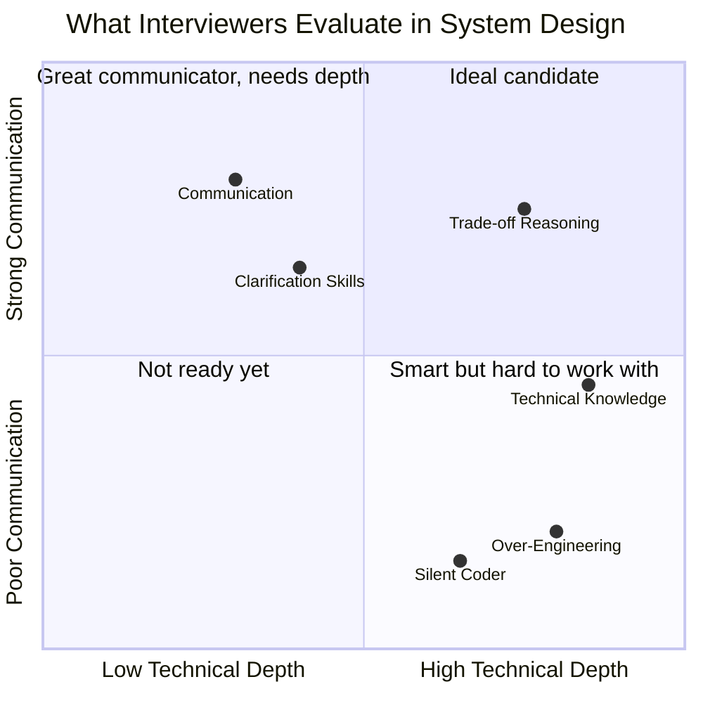

The four things every interviewer is watching for:

1. **Technical breadth** — Do you know the building blocks? (databases, caches, queues, CDNs, load balancers)
2. **Technical depth** — Can you go deep when needed? (explain how consistent hashing works, when to shard)
3. **Communication** — Are you thinking out loud? Treating the interviewer as a collaborator?
4. **Trade-off awareness** — Can you compare approaches and justify choices? (SQL vs NoSQL, push vs pull)

A huge red flag interviewers watch for is **over-engineering** — jumping to the most complex solution without understanding requirements. Many engineers are so proud of their knowledge that they design a distributed, multi-region, micro-service system for a problem that could be solved with a single PostgreSQL database. Companies pay real money for over-engineered systems. Don't demonstrate that tendency.

---

## The 4-Step Framework — Overview

Every system design interview can be navigated with exactly four steps. The time allocation for a 45-minute session:

```mermaid
gantt
    title 45-Minute System Design Interview Timeline
    dateFormat mm
    axisFormat %M min

    section Step 1
    Understand & Scope (3–10 min)         :active, s1, 00, 10m

    section Step 2
    High-Level Design (10–15 min)         :active, s2, 10, 15m

    section Step 3
    Design Deep Dive (10–25 min)          :active, s3, 25, 15m

    section Step 4
    Wrap Up (3–5 min)                     :active, s4, 40, 5m
```

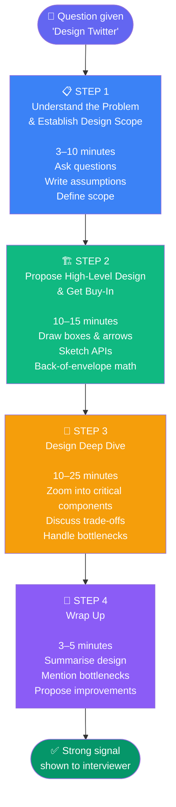

Let's go deep on each step.

---

## Step 1: Understand the Problem and Establish Design Scope

*Time: 3–10 minutes*

### The "Jimmy" trap

Imagine a student named Jimmy. Whenever the teacher asks a question, Jimmy shoots his hand up immediately and blurts out an answer — right or wrong, he loves being first.

**Don't be Jimmy.**

In a system design interview, jumping straight to a solution without understanding the requirements is the single biggest mistake. You'll end up designing the wrong system with great confidence, which is far worse than asking a few questions first.

When an interviewer says "Design Instagram," they could mean:
- A simple photo-sharing app for 1,000 users
- A globally distributed platform with 2 billion users, Reels, Stories, Shopping, DMs, and a recommendation engine

These require **completely different architectures**. You must clarify before you draw a single box.

### What to ask in Step 1

Use this mental checklist every time:

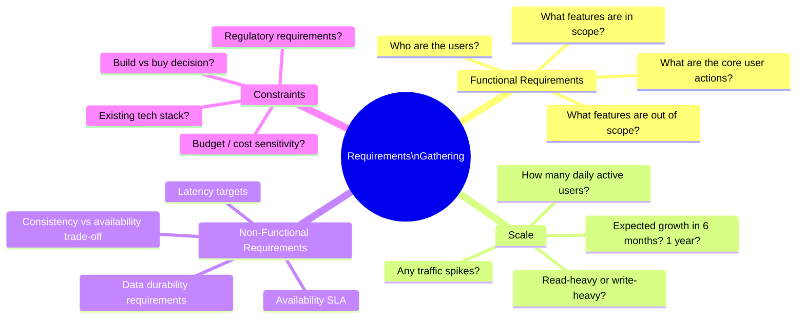

**Functional requirements** — *What* the system must do.
- What specific features are we building?
- What are the most important ones? (Don't design everything)
- What is explicitly out of scope?

**Non-functional requirements** — *How well* the system must do it.
- Latency: Does this need to be real-time (< 100ms) or is eventual consistency OK?
- Availability: 99.9% or 99.999%? (That's the difference between 8 hours and 5 minutes downtime per year)
- Consistency: Can users see slightly stale data? (Twitter feed vs. bank balance — very different)

**Scale** — drives every architecture decision.
- How many users? (1K vs 10M vs 1B is not the same system)
- What's the read/write ratio? (Facebook News Feed: ~1000:1 reads to writes)

### The news feed example — how a good Step 1 sounds

Here is what a strong candidate conversation looks like:

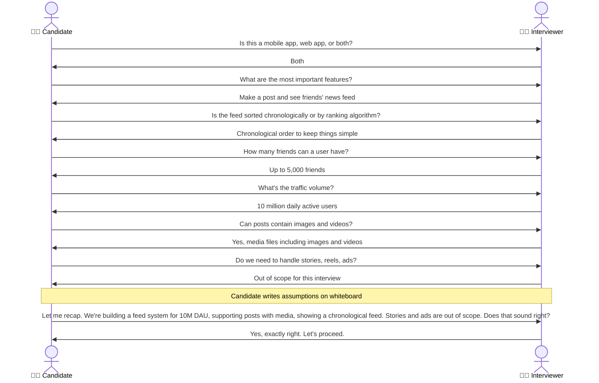

Notice what the candidate did:
- Asked **specific, targeted** questions — not vague ones
- Covered functional AND non-functional AND scale
- **Recapped the scope** at the end to confirm alignment
- Was **collaborative**, not combative

> **Key insight:** The interviewer *wants* you to ask questions. When you ask the right questions, they light up — because it shows you think like a senior engineer who understands that requirements drive architecture.

### Writing down your assumptions

After your questions, write your assumptions clearly on the whiteboard before drawing anything. This is not busywork — it is a professional habit. In real engineering, design documents always start with assumptions. If an assumption is wrong, you want to know *before* you've designed 30 minutes of architecture around it.

**Example assumptions to write:**
```
Assumptions
───────────
- 10M DAU
- Read:Write ratio = 100:1 (feed reads dominate)
- Posts can contain text (max 500 chars) and media (max 5MB)
- Feed shows last 20 posts from friends, chronological order
- Friend relationship is bidirectional (not follow/follower)
- No strong consistency required — eventual is fine
- 99.9% availability target
```

---

## Step 2: Propose a High-Level Design and Get Buy-In

*Time: 10–15 minutes*

You've established scope. Now it's time to sketch the architecture. The goal here is not perfection — it's **direction**. You're proposing a rough blueprint and getting the interviewer's buy-in before you invest time in details.

### Three things to do in Step 2

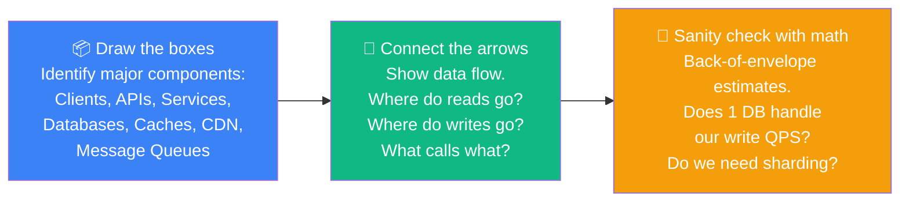

### The standard building blocks

Every system design is composed of some combination of these:

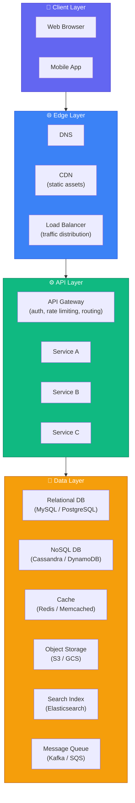

Not every system needs all of these. Part of good design is knowing which to include and why. A junior engineer adds everything. A senior engineer adds only what's justified.

### High-level design: News Feed System — Feed Publishing

Let's continue our news feed example. Feed publishing = when a user creates a post:

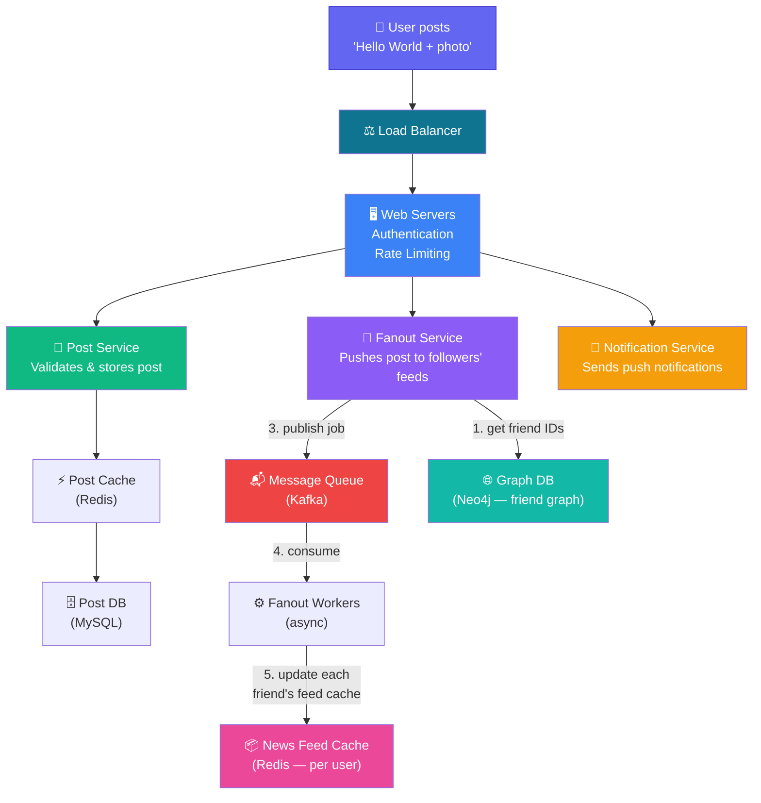

### High-level design: News Feed System — Feed Reading

When a user opens their app and loads their feed:

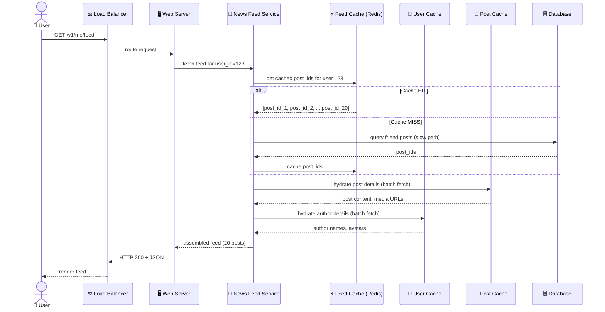

This sequence diagram shows something important: the **feed is pre-computed and cached** (the Fanout Service populates it when posts are created). Reading the feed is just a cache lookup — it doesn't need to touch the database at all on the hot path. This is why Facebook, Instagram, and Twitter all use this pattern.

### When to include back-of-envelope estimates

After sketching the high-level design, do a quick sanity check:

```
For our news feed:
DAU = 10M
Feed reads per user per day = 5 (open app 5 times)
Total reads/day = 50M → ~580 read QPS average → ~1,200 peak

Write QPS = 10M × 2 posts/day / 86,400 = ~230 QPS

One MySQL master can handle 1,000 write QPS → single DB is fine for writes
One Redis node can handle 100,000 read QPS → cache easily handles reads

Conclusion: we need DB sharding later at 100M+ users, not now.
```

This is powerful because it shows you don't over-engineer. You say *"right now we don't need sharding — here's the math proving it."*

---

## Step 3: Design Deep Dive

*Time: 10–25 minutes*

By the end of Step 2, you and the interviewer have agreed on the big picture. Now you zoom into the most interesting or challenging parts. This is where senior candidates shine.

At the start of Step 3, you should have:
- ✅ Agreed on overall goals and feature scope
- ✅ A high-level blueprint on the whiteboard
- ✅ Feedback from the interviewer on the high-level design
- ✅ Initial ideas about what areas to focus on

### How to choose what to deep-dive into

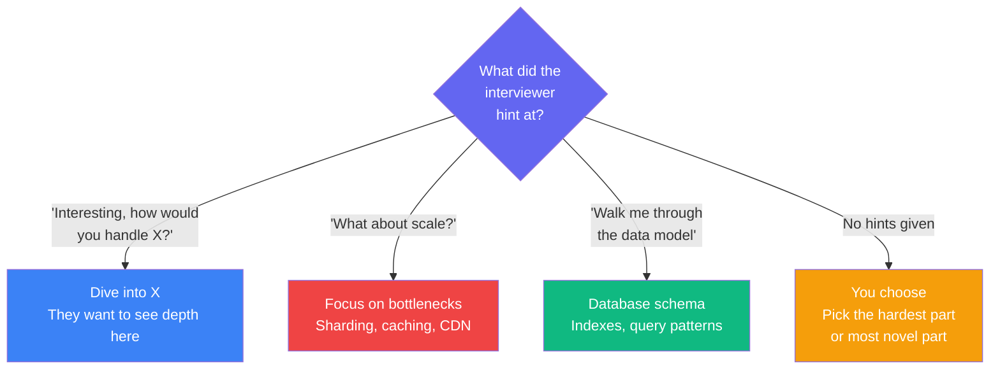

**Common deep-dive areas by system type:**

| System | Interesting Deep Dives |
|--------|----------------------|
| Chat (WhatsApp) | WebSocket connection management, message delivery guarantees, online/offline status |
| URL Shortener | Hash function design, collision handling, redirect caching |
| News Feed | Fanout-on-write vs fanout-on-read, handling celebrity users |
| Search Autocomplete | Trie data structure, caching prefix results, ranking |
| Rate Limiter | Token bucket vs sliding window, distributed counters in Redis |
| Video Platform | Chunked upload, video transcoding pipeline, adaptive bitrate streaming |

### Deep dive example: Fanout-on-write vs Fanout-on-read

This is a classic deep-dive topic for any social feed system. Let's explore both approaches:

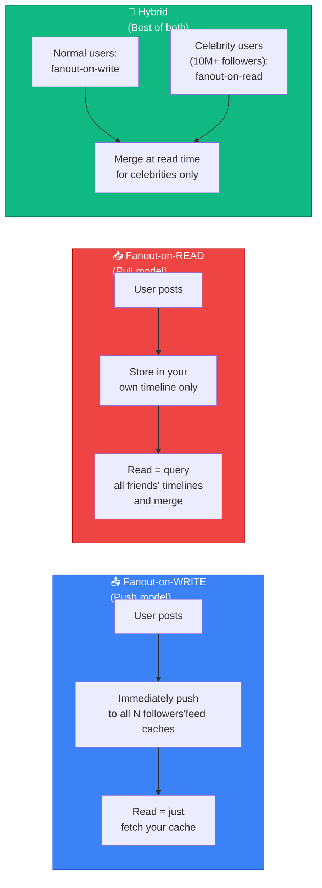

| | Fanout-on-Write | Fanout-on-Read | Hybrid |
|---|---|---|---|
| **Read speed** | ⚡ Instant (cache hit) | 🐌 Slow (merge N timelines) | ⚡ Fast |
| **Write speed** | 🐌 Slow (N writes) | ⚡ Fast (1 write) | Moderate |
| **Celebrity problem** | ❌ 10M cache writes per post | ✅ No issue | ✅ Solved |
| **Stale data** | Fresh | Fresh | Fresh |
| **Used by** | Facebook, Instagram (most users) | Old Twitter pull | Twitter, Instagram (celebrities) |

> **The right answer in an interview:** "For most users we use fanout-on-write because reads are 100× more frequent than writes. For users with over 1 million followers, we switch to fanout-on-read to avoid the write amplification problem. We merge the two at read time."

This answer shows you understand trade-offs, know real production patterns, and can reason about edge cases (the celebrity problem).

### Deep dive: Data model

A good data model discussion shows database design maturity:

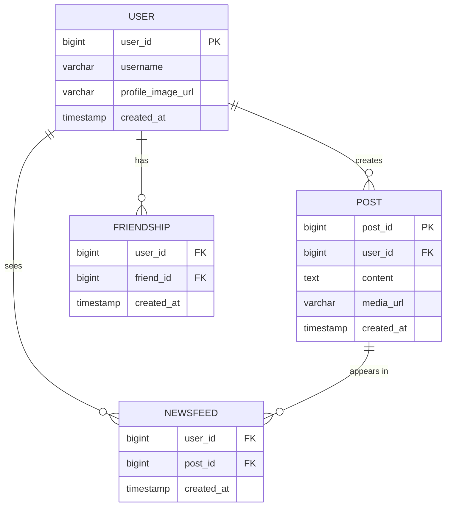

Key design decisions to discuss:
- `post_id` uses **Snowflake ID** (Twitter's algorithm) — a time-sortable 64-bit integer that works across distributed systems without coordination
- `NEWSFEED` table is actually a Redis sorted set in production (score = timestamp), not a SQL table
- `FRIENDSHIP` table needs indexes on both `user_id` and `friend_id` for bidirectional lookup

---

## Step 4: Wrap Up

*Time: 3–5 minutes*

Don't just stop and say "I'm done." The wrap-up is an opportunity to leave a strong final impression.

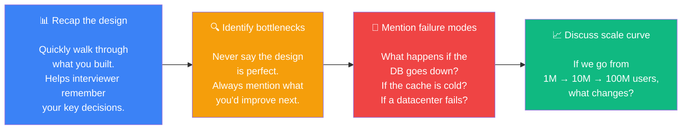

### Strong wrap-up phrases

Instead of "I'm done," try:

- *"Let me do a quick recap of what we've designed..."*
- *"The main bottlenecks I see are... I'd address them by..."*
- *"If we needed to scale from 10M to 100M DAU, the first thing I'd change is..."*
- *"One thing I didn't cover that could be interesting is..."*

### Example wrap-up for the news feed

> "To summarise — we've built a news feed system for 10M DAU. Users can post text and media, and see a chronological feed of their friends' posts. We use a load balancer to distribute traffic across stateless web servers, a Fanout Service that asynchronously pre-computes feeds using Kafka workers, Redis for both feed caches and post caches, and MySQL for persistent storage.
>
> The biggest bottleneck I see is the Fanout Service at scale — if a user has 5,000 friends and posts frequently, we generate 5,000 cache writes per post. For users with very large friend counts, I'd switch to a hybrid fanout-on-read approach. 
>
> For failure modes: if Redis goes down, we fall back to the database (slower, but correct). If the Fanout workers fall behind, users see stale feeds temporarily, which is acceptable given our eventual consistency requirement.
>
> If traffic grew to 100M DAU, I'd add database sharding by user_id, introduce a CDN for media delivery, and add more Redis nodes with consistent hashing."

That's a 90-second wrap-up that demonstrates critical thinking, awareness of failure modes, and understanding of scale — all things that leave a lasting positive impression.

---

## The Complete 45-Minute Picture

Here's the full flow from start to finish, including how the two sides of the conversation should feel:

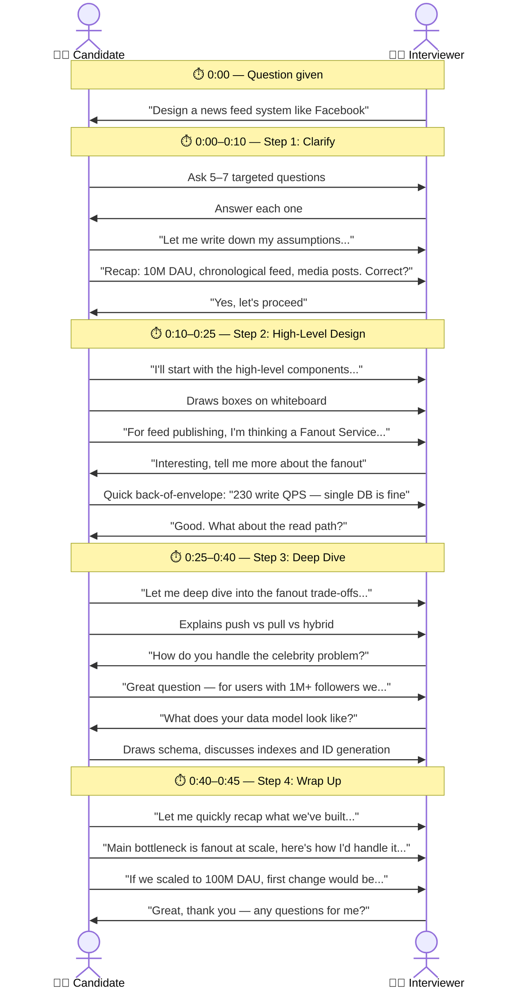

---

## Dos and Don'ts: The Complete List

These are the exact behaviours that separate candidates who get offers from those who don't.

### ✅ Always Do These

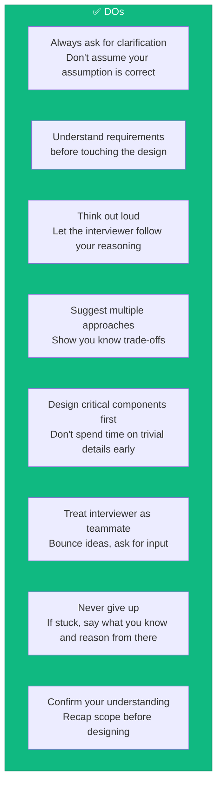

### ❌ Never Do These

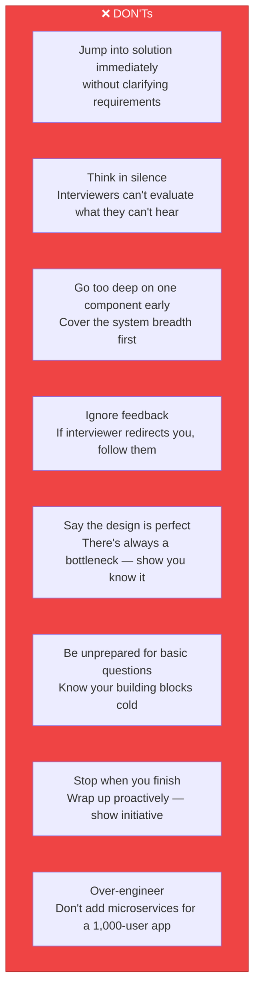

---

## Red Flags That Kill Good Candidates

Even technically strong candidates fail interviews for non-technical reasons. Watch for these:

**🚩 Narrow-mindedness** — "We should use Kafka. Period." vs "We could use Kafka or RabbitMQ or SQS — here's when I'd choose each..."

**🚩 Stubbornness** — The interviewer hints you're going down the wrong path. You defend your choice instead of exploring theirs. This signals you'd be difficult to work with.

**🚩 Silence** — You're thinking hard but not talking. The interviewer is sitting there with no signal. They can't give partial credit for thoughts you never expressed.

**🚩 Premature optimization** — You spend 15 minutes designing a globally distributed caching layer for a system that hasn't been asked to scale yet.

**🚩 No questions asked** — If you started designing immediately without a single clarifying question, it signals you don't think about requirements in real work either.

---

## Interview Preparation Checklist

Before your interview, make sure you can do all of these from memory:

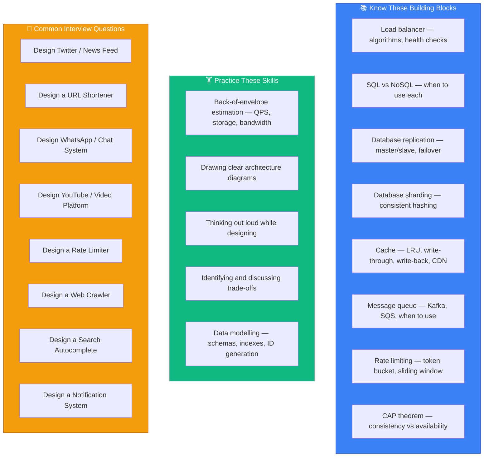

---

## The One-Page Cheat Sheet

Print this. Internalize it. Use it in every mock interview until it's automatic:

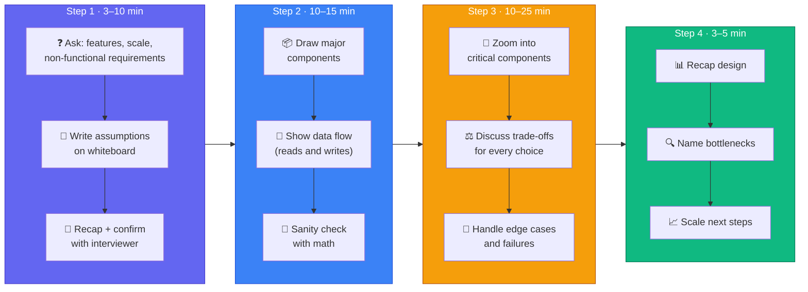

---

## What's Next

Now that you have the framework, the next posts apply it to real systems — starting with the most commonly asked interview question of all time:

- **Next:** Design a Rate Limiter — token bucket, sliding window, distributed Redis counters
- **Coming soon:** Design a URL Shortener — hash functions, redirect caching, analytics
- **Coming soon:** Design a Chat System — WebSockets, message delivery, presence

Master the framework first. Then the specific systems become much easier — they're all just different combinations of the same building blocks.
