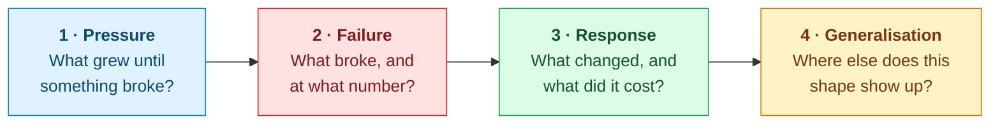
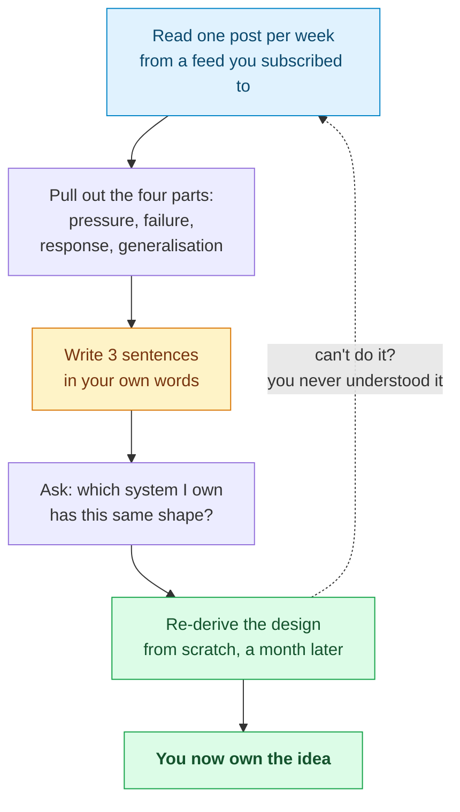

Twenty-eight designs down. So — what now?

The usual answer is a list of engineering blogs. Here is one, further down the page. But a list on its own will not make you better, and it is worth being honest about why.

Try this. Think of the last engineering post you read. Can you say what problem the team had, what number it broke at, and what the fix cost them?

Most people can't. What survives is a brand and a technology: *"Discord uses ScyllaDB."* That is the one detail in the whole article you will never be able to use.

So let's start with how to read, and then get to what.

---

## How to read an engineering blog post

Every good post is telling the same four-part story, whether or not the author lays it out that way. Your job is to pull those four parts out.

Step 4 is the whole point. Steps 1–3 are about someone else's system. Step 4 is about yours.

### Worked example: Discord, twice

Discord has written about the same database table twice, six years apart. Two posts, two completely different problems — which makes them a perfect pair to practise on.

**[The 2017 post](https://discord.com/blog/how-discord-stores-billions-of-messages)** — billions of messages, on Cassandra.

> **Pressure.** A channel collects messages forever. Its Cassandra partition just keeps growing.
> **Failure.** Huge partitions choke garbage collection during compaction. And, as the post puts it, "the data in it cannot be distributed around the cluster."
> **Response.** Put time in the partition key: `(channel_id, bucket)`, with roughly 10-day buckets. Now no partition can exceed about 100 MB, by construction.
> **Generalisation.** Any partition key built from something that accumulates forever, with nothing to bound it, will eventually blow up.

That last line is the part you keep. It has nothing to do with Cassandra — it applies just as well to Kafka topics, DynamoDB, or a sharded MySQL cluster. One post, read this way, hands you a lens you will reuse for years.

**[The 2023 post](https://discord.com/blog/how-discord-stores-trillions-of-messages)** — trillions of messages, moving to ScyllaDB.

Here is the twist, and it is a good one. Bucketing had capped how *big* a partition could get. It did nothing about how *busy* one could get.

A channel on a server with hundreds of thousands of members gets orders of magnitude more reads than a channel among five friends. Those partitions ran hot no matter how small they were. And the fix was not a cleverer key — it was a Rust service in front of the database that collapses simultaneous requests for the same row into a single query.

> **Generalisation.** Capping the *size* of a partition says nothing about capping the *load* on it. Two different problems — and solving the first one can hide the second.

### Three habits that make this stick

**Read the numbers, skip the adjectives.** "Massive scale" tells you nothing. "177 nodes down to 72, p99 for old messages from 40–125 ms to 15 ms" tells you everything: how big this system is, and whether yours is anywhere near it. Most posts describe systems a hundred times larger than yours, and their solution is often wrong for you.

**Hunt for the sentence where they admit a cost.** "This increased write amplification." "We accepted eventual consistency here." Every honest post has one, and it is where the real engineering is hiding. A post without one is a recruiting ad.

**Ask what they turned down.** The options a team rejected tell you more about their constraints than the one they picked. Good posts say so outright. For the rest, work it out yourself — that is the same muscle an interviewer is testing.

---

## In a hurry? Read these three

The rest of this page is long. If you close the tab after this section, take these:

| | What | Why |
|---|---|---|
| **1** | [The Dynamo paper](https://www.read.seas.harvard.edu/~kohler/class/cs239-w08/decandia07dynamo.pdf) (an evening) | Almost everything in [Chapter 6](/2026/05/design-a-key-value-store/) comes from here. Read it and half the field clicks into place. |
| **2** | [*Designing Data-Intensive Applications*](https://dataintensive.net/) (a few months) | The single best book in this space. Nothing else is close. |
| **3** | [Cloudflare's blog](https://blog.cloudflare.com/) (weekly) | The most consistently excellent engineering writing published anywhere right now. |

Everything below is elaboration on those three.

---

## Papers worth your evenings

A paper is slower going than a blog post and worth far more. Blog posts get rewritten, migrated and quietly deleted; papers sit still for twenty years.

Each of these introduced something you have already met in this series — which means you are reading them with the answers in hand, and that is much easier than it sounds.

- **[Dynamo: Amazon's Highly Available Key-value Store](https://www.read.seas.harvard.edu/~kohler/class/cs239-w08/decandia07dynamo.pdf)** (SOSP 2007) — consistent hashing, vector clocks, quorums, hinted handoff, Merkle-tree anti-entropy. If you read one paper from this list, read this one; [Chapter 6](/2026/05/design-a-key-value-store/) is essentially an exposition of it.
- **[The Google File System](https://static.googleusercontent.com/media/research.google.com/zh-CN/us/archive/gfs-sosp2003.pdf)** (SOSP 2003) — the single-master-plus-chunkservers design that every distributed filesystem since has argued with.
- **[Bigtable: A Distributed Storage System for Structured Data](https://static.googleusercontent.com/media/research.google.com/en//archive/bigtable-osdi06.pdf)** (OSDI 2006) — the LSM-tree-backed wide-column model behind HBase and Cassandra.
- **[Finding a Needle in Haystack: Facebook's Photo Storage](https://www.usenix.org/legacy/event/osdi10/tech/full_papers/Beaver.pdf)** (OSDI 2010) — what happens when the *metadata* becomes the bottleneck, not the data.
- **[TAO: Facebook's Distributed Data Store for the Social Graph](https://cs.uwaterloo.ca/~brecht/courses/854-Emerging-2014/readings/data-store/tao-facebook-distributed-datastore-atc-2013.pdf)** (ATC 2013) — a read-optimised graph cache in front of sharded MySQL. Directly relevant to [the news feed chapter](/2026/06/design-news-feed-system/).
- **[Scaling Memcache at Facebook](https://www.cs.bu.edu/~jappavoo/jappavoo.github.com/451/papers/memcache-fb.pdf)** (NSDI 2013) — the definitive treatment of cache stampedes, leases, and regional invalidation.
- **[MapReduce: Simplified Data Processing on Large Clusters](https://research.google/pubs/mapreduce-simplified-data-processing-on-large-clusters/)** (OSDI 2004) — historically decisive, and still the clearest statement of the "move computation to data" idea.
- **[Spanner: Google's Globally-Distributed Database](https://static.googleusercontent.com/media/research.google.com/en//archive/spanner-osdi2012.pdf)** (OSDI 2012) — external consistency bought with atomic clocks. The strongest counter-argument to "you must give up consistency at scale," and the reason CockroachDB and Spanner-likes exist.
- **[In Search of an Understandable Consensus Algorithm (Raft)](https://raft.github.io/raft.pdf)** (ATC 2014) — consensus explained so that you can actually implement it. The reason etcd, Consul and CockroachDB exist.

## Architecture write-ups

Want the shape of a whole system rather than one mechanism? These are the ones to read.

High Scalability catalogued production architectures for over a decade. It no longer publishes, but the archive is one of the best surveys of how large systems were actually assembled — and unusually, it covers the *unglamorous* decisions.

- [Amazon Architecture](https://highscalability.com/amazon-architecture/) — the origin of "every service is a service," pre-dating the word microservices.
- [Google Architecture](https://highscalability.com/google-architecture/)
- [YouTube Architecture](https://highscalability.com/youtube-architecture/) — pairs with [Chapter 14](/2026/06/design-youtube/).
- [A 360 Degree View of the Entire Netflix Stack](https://highscalability.com/a-360-degree-view-of-the-entire-netflix-stack/)
- [The Architecture Twitter Uses to Deal With 150M Active Users](https://highscalability.com/the-architecture-twitter-uses-to-deal-with-150m-active-users/) — the canonical fan-out discussion behind [Chapter 11](/2026/06/design-news-feed-system/).
- [Scaling Twitter: Making Twitter 10000 Percent Faster](https://highscalability.com/scaling-twitter-making-twitter-10000-percent-faster/)
- [The WhatsApp Architecture Facebook Bought For $19 Billion](https://highscalability.com/the-whatsapp-architecture-facebook-bought-for-19-billion/) — millions of connections on a handful of Erlang boxes; read alongside [Chapter 12](/2026/06/design-chat-system/).
- [How Uber Scales Their Real-Time Market Platform](https://highscalability.com/how-uber-scales-their-real-time-market-platform/)
- [Scaling Pinterest](https://highscalability.com/scaling-pinterest-from-0-to-10s-of-billions-of-page-views-a/) and the [architecture update](https://highscalability.com/pinterest-architecture-update-18-million-visitors-10x-growth/)
- [Instagram Architecture](https://highscalability.com/instagram-architecture-14-million-users-terabytes-of-photos/) — 14 million users on three engineers.
- [Flickr Architecture](https://highscalability.com/flickr-architecture/)
- [Facebook Timeline: Brought To You By The Power Of Denormalization](https://highscalability.com/facebook-timeline-brought-to-you-by-the-power-of-denormaliza/)

## Talks

Sometimes an engineer explaining their own system out loud beats anything written down.

- **[Scale at Facebook](https://www.infoq.com/presentations/Scale-at-Facebook/)** — an operations-culture talk more than an architecture talk, and better for it.
- **[Timelines at Scale](https://www.infoq.com/presentations/Twitter-Timeline-Scalability/)** — Raffi Krikorian on Twitter's timeline. Still the best single explanation of hybrid fan-out.
- **[YouTube Scalability](https://www.youtube.com/watch?v=w5WVu624fY8)** (Seattle Conference on Scalability)
- **[How We've Scaled Dropbox](https://www.youtube.com/watch?v=PE4gwstWhmc)**
- **[Erlang at Facebook](http://www.erlang-factory.com/upload/presentations/31/EugeneLetuchy-ErlangatFacebook.pdf)** — how Facebook Chat was actually built, in a language chosen specifically for holding millions of idle connections. Pairs with [Chapter 12](/2026/06/design-chat-system/).
- **[Differential Synchronization](https://neil.fraser.name/writing/sync/)** — Neil Fraser on the algorithm behind Google Docs. Short, and it will change how you think about [conflict resolution](/2026/06/design-google-drive/).

---

## Company engineering blogs

Company blogs are recruiting instruments as much as technical ones, so they vary enormously. These are the ones that consistently publish something with a number in it.

### Consistently excellent

| Blog | Why it earns the subscription |
|---|---|
| [Cloudflare](https://blog.cloudflare.com/) | Unmatched on networking, DDoS, TLS and edge compute. Publishes real postmortems with real numbers. |
| [Meta Engineering](https://engineering.fb.com/) | Successor to `code.facebook.com`. Storage, ML infrastructure, and the largest-scale problems anyone writes about publicly. |
| [Netflix TechBlog](https://netflixtechblog.com/) | Streaming, chaos engineering, personalisation. The origin of a great deal of standard practice. |
| [Uber Engineering](https://www.uber.com/blog/engineering/) | Real-time geospatial systems, and the most candid migration write-ups in the industry. |
| [Discord](https://discord.com/blog/tag/engineering) | Rare and specific: millions of concurrent WebSocket connections, described honestly. |
| [Dropbox Tech](https://dropbox.tech/) | Sync, storage, and the famous move off S3. Directly relevant to [Chapter 15](/2026/06/design-google-drive/). |
| [Stripe](https://stripe.dev/blog/topic/engineering) | Idempotency, correctness under partial failure, API design as a discipline. |

### Strong and current

| Blog | Focus |
|---|---|
| [GitHub](https://github.blog/engineering/) | Git at scale, MySQL, availability |
| [Shopify](https://shopify.engineering/) | Flash-sale traffic spikes, Ruby at scale, sharding |
| [Instacart](https://tech.instacart.com/) | Logistics, search, ML systems |
| [Pinterest](https://medium.com/pinterest-engineering) | Recommendations, storage, home feed |
| [Grab](https://engineering.grab.com/) | Real-time systems in Southeast Asia; excellent on geo |
| [Airbnb](https://medium.com/airbnb-engineering) | Search, payments, data infrastructure |
| [Yelp](https://engineeringblog.yelp.com/) | Search ranking, data pipelines |
| [Spotify](https://engineering.atspotify.com/) | Event delivery, ML, developer platforms |
| [Slack](https://slack.engineering/) | Real-time messaging, mobile sync |
| [LinkedIn](https://www.linkedin.com/blog/engineering) | Kafka's birthplace; graph and feed systems |
| [Canva](https://www.canva.dev/blog/engineering/) | Newer, unusually concrete on media processing |
| [AWS Architecture](https://aws.amazon.com/blogs/architecture/) | Reference patterns and well-argued trade-offs |

### Individuals, who are often better than the companies

Company blogs are recruiting instruments with engineering content attached. These are just engineers writing.

- **[Marc Brooker](https://brooker.co.za/blog/)** (AWS) — short essays on distributed systems that are frequently better than the papers they discuss. Start with anything on timeouts or retries.
- **[Werner Vogels — All Things Distributed](https://www.allthingsdistributed.com/)** — Amazon's CTO, writing since 2004.
- **[Dan Luu](https://danluu.com/)** — empirical, contrarian, heavily footnoted. His work on latency and on the actual cost of complexity will change decisions you make.
- **[Jepsen](https://jepsen.io/analyses)** — Kyle Kingsbury breaking distributed databases and documenting exactly how. Read one analysis of a database you use; it is a bracing experience.
- **[Murat Demirbas](https://muratbuffalo.blogspot.com/)** — a distributed systems researcher's paper reviews. The fastest way to decide whether a paper is worth your evening.
- **[The Pragmatic Engineer](https://newsletter.pragmaticengineer.com/)** — Gergely Orosz on how engineering organisations actually operate. Adjacent to system design, and the adjacency matters.

## Books, courses and the deep end

Blogs tell you what one company did on one Tuesday. These tell you why any of it works.

**Books**

- **[Designing Data-Intensive Applications](https://dataintensive.net/)** — Martin Kleppmann. If you read exactly one book after this series, read this one. It supplies the theory every chapter here assumed: replication, partitioning, transactions, consensus, and the failure modes underneath.
- **[Google SRE books](https://sre.google/books/)** — free online. *Site Reliability Engineering* and *The SRE Workbook* cover the half of system design that interviews ignore and production does not: SLOs, error budgets, on-call, and what a real postmortem contains.

**Courses**

- **[MIT 6.824 — Distributed Systems](https://pdos.csail.mit.edu/6.824/)** — lectures and labs are public. You implement Raft. Nothing else produces the same depth of understanding.
- **[CMU 15-721 — Advanced Database Systems](https://www.cs.cmu.edu/~15721-f25/)** — Andy Pavlo on modern database internals, with recorded lectures.

**Papers, ongoing**

- **[USENIX conference proceedings](https://www.usenix.org/conferences/byname/131)** (OSDI, NSDI, ATC) — open access, and where most of the systems above were first published.
- **[Google Research publications](https://research.google/pubs/)** and **[Microsoft Research](https://www.microsoft.com/en-us/research/publications/)**
- **[VLDB](https://www.vldb.org/pvldb/)** — the database systems venue.

**Aggregators**

- **[System Design Primer](https://github.com/donnemartin/system-design-primer)** — still the most-starred system design resource on GitHub, and still a good index.
- **[Awesome Scalability](https://github.com/binhnguyennus/awesome-scalability)** — a curated, actively maintained architecture list. The closest thing to a living version of this page.
- **[Martin Fowler's architecture guide](https://martinfowler.com/architecture/)** — patterns and vocabulary, precisely defined.

---

## Turning reading into competence

It is entirely possible to read constantly and learn nothing. Plenty of people manage it. What separates them from everyone else is what happens after the tab closes.

That re-derivation step is the one everybody skips. It is also the only one that proves anything.

Here is the test. A month after reading the Dynamo paper, close the tab and explain why hinted handoff exists and what breaks without it. If you can't, you do not know the paper — you remember *having read* it. Those feel identical from the inside and are worth wildly different amounts.

**A concrete cadence that works:**

| Frequency | Practice |
|---|---|
| Weekly | One blog post, read for the four parts. Three sentences written down. |
| Monthly | One paper, slowly. Keep Kleppmann next to you as a decoder ring. |
| Quarterly | Re-derive one design from memory, then compare against the original. |
| Whenever you're stuck | Hit a problem at work? Go find who has already written about it. Someone has. |

That last row is worth more than the other three combined. Reading about consistent hashing on a quiet Sunday is mildly interesting. Reading about it the week you are staring at one shard carrying 40% of your traffic is how it becomes permanent.

---

## One last thing

Looking back over twenty-eight designs, the striking thing is **how few ideas there actually were.**

Partition to distribute load. Replicate to survive failure. Cache to avoid repeating work. Queue to decouple producers from consumers. Denormalise to trade write cost for read speed. Batch to amortise. Version to detect conflict.

Seven ideas. That is very nearly the whole vocabulary.

YouTube, Google Drive, a news feed and a chat system are all the same seven, mixed in different proportions under different pressures. A rate limiter and a URL shortener look like completely different problems. They are the same problem in different clothes: bounded state, enormous read volume, and enough tolerance for approximation to get away with it.

This is why reading compounds. Each new architecture is not another thing to memorise — it is one more data point on how those same seven behave under a pressure you had not seen before.

Around the twentieth post, something shifts. You stop reading them as stories and start reading them as **variations**. That is when system design stops being an interview topic and starts being a way of looking at things.

The list above is a starting point, and starting points go stale. The method is what lasts.

---

## References and Further Reading

**Papers**

<ul>
<li>DeCandia et al., <a href="https://www.read.seas.harvard.edu/~kohler/class/cs239-w08/decandia07dynamo.pdf">Dynamo: Amazon's Highly Available Key-value Store</a>, SOSP 2007</li>
<li>Ghemawat et al., <a href="https://static.googleusercontent.com/media/research.google.com/zh-CN/us/archive/gfs-sosp2003.pdf">The Google File System</a>, SOSP 2003</li>
<li>Chang et al., <a href="https://static.googleusercontent.com/media/research.google.com/en//archive/bigtable-osdi06.pdf">Bigtable: A Distributed Storage System for Structured Data</a>, OSDI 2006</li>
<li>Beaver et al., <a href="https://www.usenix.org/legacy/event/osdi10/tech/full_papers/Beaver.pdf">Finding a Needle in Haystack</a>, OSDI 2010</li>
<li>Bronson et al., <a href="https://cs.uwaterloo.ca/~brecht/courses/854-Emerging-2014/readings/data-store/tao-facebook-distributed-datastore-atc-2013.pdf">TAO: Facebook's Distributed Data Store for the Social Graph</a>, ATC 2013</li>
<li>Nishtala et al., <a href="https://www.cs.bu.edu/~jappavoo/jappavoo.github.com/451/papers/memcache-fb.pdf">Scaling Memcache at Facebook</a>, NSDI 2013</li>
<li>Corbett et al., <a href="https://static.googleusercontent.com/media/research.google.com/en//archive/spanner-osdi2012.pdf">Spanner: Google's Globally-Distributed Database</a>, OSDI 2012</li>
<li>Ongaro and Ousterhout, <a href="https://raft.github.io/raft.pdf">In Search of an Understandable Consensus Algorithm</a>, ATC 2014</li>
<li>Dean and Ghemawat, <a href="https://research.google/pubs/mapreduce-simplified-data-processing-on-large-clusters/">MapReduce</a>, OSDI 2004</li>
</ul>

**Books and courses**

<ul>
<li>Martin Kleppmann, <a href="https://dataintensive.net/">Designing Data-Intensive Applications</a></li>
<li><a href="https://sre.google/books/">Google SRE books</a> — free online</li>
<li><a href="https://pdos.csail.mit.edu/6.824/">MIT 6.824: Distributed Systems</a></li>
<li><a href="https://www.cs.cmu.edu/~15721-f25/">CMU 15-721: Advanced Database Systems</a></li>
</ul>

**Ongoing sources**

<ul>
<li><a href="https://www.usenix.org/conferences/byname/131">USENIX proceedings</a> (OSDI, NSDI, ATC)</li>
<li><a href="https://research.google/pubs/">Google Research</a> · <a href="https://www.microsoft.com/en-us/research/publications/">Microsoft Research</a> · <a href="https://www.vldb.org/pvldb/">VLDB</a></li>
<li><a href="https://jepsen.io/analyses">Jepsen analyses</a> · <a href="https://brooker.co.za/blog/">Marc Brooker</a> · <a href="https://danluu.com/">Dan Luu</a> · <a href="https://muratbuffalo.blogspot.com/">Murat Demirbas</a></li>
<li><a href="https://github.com/donnemartin/system-design-primer">System Design Primer</a> · <a href="https://github.com/binhnguyennus/awesome-scalability">Awesome Scalability</a> · <a href="https://martinfowler.com/architecture/">Martin Fowler on architecture</a></li>
</ul>

**In this series**

<ul>
<li><a href="/guide/">The complete guide</a> — every article in order</li>
<li><a href="/2026/05/scale-from-zero-to-millions/">Chapter 1: Scale From Zero to Millions of Users</a></li>
<li><a href="/2026/05/design-a-key-value-store/">Chapter 6: Design a Key-Value Store</a> — the Dynamo paper, worked through</li>
<li><a href="/2026/06/design-google-drive/">Chapter 15: Design Google Drive</a></li>
</ul>
