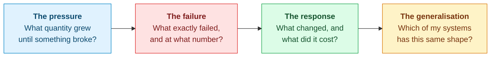
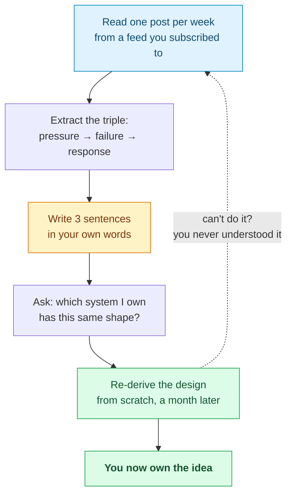

The last chapter of *System Design Interview* is not a design. It is a list of links — real-world architectures and company engineering blogs — with the advice that reading them regularly makes you a better engineer.

That advice is correct. The list is not.

I checked every one of its **70 reading-list links** in September 2026. Eight return an error. Nine redirect somewhere that is no longer an engineering blog. Several more survive only because a URL shortener is still forwarding them to a page that has itself moved twice. The book was published in 2020; that is what five years does to a bibliography.

So this chapter does two things the original could not. It rebuilds the list with every link verified. And — more usefully — it argues that a list is the least valuable part of a reading habit. **What matters is the method you bring to a post once you open it.**

---

## What link rot actually looks like

Here is the audit, because the shape of the decay is itself instructive:

| Outcome | Count | What it means |
|---|---:|---|
| Reachable | 53 | Resolves to something real (17 of these block automated checks but are live) |
| Silently redirected | 9 | Returns 200, but the destination is not the thing that was linked |
| Error | 8 | 400, 404 or 500 |

The eight errors are worth naming, because each one failed in a different way:

- **Three Facebook links** now land on a login wall. Two were Facebook *Notes* — a product that was discontinued in 2020, taking its published engineering writing with it. One pointed at `code.facebook.com`, retired in favour of `engineering.fb.com`, with no redirect for deep links.
- **Two LinkedIn links** — including "A Brief History of Scaling LinkedIn," a genuinely good post — 404. The blog moved to `linkedin.com/blog/engineering` and the old paths were not preserved.
- **`blogs.dropbox.com/tech`** 404s; the content lives at `dropbox.tech`.
- **BitTorrent's engineering blog** returns a 500. It has effectively been abandoned.

The nine silent redirects are the more dangerous category, because nothing *looks* broken:

- **`engineering.pinterest.com`** now forwards to a **recruiting page**. The engineering blog itself moved to Medium.
- **`redditblog.com`** forwards to `redditinc.com/news` — corporate press releases, not engineering.
- **`developer.atlassian.com/blog`** lands on an unbranded WPEngine placeholder.

A reader following the book today would conclude that Pinterest stopped publishing engineering content. Pinterest publishes constantly. The link just rotted.

**The lesson that generalises:** a reading list is infrastructure, and infrastructure decays. Subscribe to feeds rather than bookmarking URLs — a feed follows the publisher when they migrate; a bookmark does not.

---

## How to read an engineering blog post

This is the part the original chapter skips, and it is the part that decides whether reading pays off.

Most engineers read a post like Discord's [How Discord Stores Trillions of Messages](https://discord.com/blog/how-discord-stores-trillions-of-messages) the way they read news: absorb the narrative, remember "they moved to ScyllaDB," move on. Six months later, the only retrievable fact is the database name — which is the single *least* transferable thing in the article.

The useful read extracts a **problem-pressure-response triple**:

Discord has in fact written two posts about the same table, six years apart, and each contains a different triple. That makes them an unusually good worked example.

From the earlier [How Discord Stores Billions of Messages](https://discord.com/blog/how-discord-stores-billions-of-messages) (2017):

> **Pressure:** a single channel accumulates messages forever, so its Cassandra partition grows without bound.
> **Failure:** large partitions create GC pressure during compaction and cluster expansion — and, as the post puts it, "the data in it cannot be distributed around the cluster."
> **Response:** add a time dimension to the partition key — `(channel_id, bucket)`, roughly 10-day buckets — keeping partitions under about 100 MB by construction.
> **Generalisation:** *any* partition key built from an entity that accumulates over time, with no bounding dimension, will eventually produce an unbounded partition.

That last line is the asset. It applies to Kafka topics, to DynamoDB, to a sharded MySQL cluster — none of which are Cassandra. One post, read this way, gives you a lens you will reuse for years.

The 2023 sequel is a *different* problem wearing similar clothes, which is exactly why reading both is instructive. Bucketing bounded partition **size**, but not partition **traffic**: a channel on a server with hundreds of thousands of members takes orders of magnitude more reads than one among friends, so specific partitions ran hot regardless of how small they were. The fix was not a better key — it was a Rust data-services layer that *coalesces* concurrent requests for the same row into a single database query, with routing by channel ID so that coalescing actually lands.

> **Generalisation:** bounding the size of a partition says nothing about bounding the load on it. Those are two separate design problems, and solving the first can disguise the second.

Three habits make this concrete:

1. **Read the numbers, not the adjectives.** "Massive scale" is worthless. Discord's "177 nodes down to 72, with p99 latency for historical messages falling from 40–125 ms to 15 ms" is worth the whole post: it tells you the regime the design was built for, and lets you check whether your problem is even in the same one. Most posts describe systems 100× larger than yours, and the design that follows is frequently wrong for you.
2. **Find the sentence where they admit a cost.** Every honest post has one — "this increased write amplification," "we accepted eventual consistency here." That sentence is where the actual engineering is. A post without one is marketing.
3. **Ask what they rejected.** The alternatives *not* taken tell you more about the constraints than the choice itself. The best posts state them; for the rest, reconstruct them yourself. That reconstruction is the same skill an interviewer is testing.

---

## Real-world system architectures

The book's list, verified and updated. Where the original link died I have substituted the canonical source — usually the paper, which outlives the blog post.

### The foundational papers

These are the documents the rest of the field is built on. Each one introduced a mechanism you have already met in this series.

- **[Dynamo: Amazon's Highly Available Key-value Store](https://www.read.seas.harvard.edu/~kohler/class/cs239-w08/decandia07dynamo.pdf)** (SOSP 2007) — consistent hashing, vector clocks, quorums, hinted handoff, Merkle-tree anti-entropy. If you read one paper from this list, read this one; [Chapter 6](/2026/05/design-a-key-value-store/) is essentially an exposition of it.
- **[The Google File System](https://static.googleusercontent.com/media/research.google.com/zh-CN/us/archive/gfs-sosp2003.pdf)** (SOSP 2003) — the single-master-plus-chunkservers design that every distributed filesystem since has argued with.
- **[Bigtable: A Distributed Storage System for Structured Data](https://static.googleusercontent.com/media/research.google.com/en//archive/bigtable-osdi06.pdf)** (OSDI 2006) — the LSM-tree-backed wide-column model behind HBase and Cassandra.
- **[Finding a Needle in Haystack: Facebook's Photo Storage](https://www.usenix.org/legacy/event/osdi10/tech/full_papers/Beaver.pdf)** (OSDI 2010) — what happens when the *metadata* becomes the bottleneck, not the data.
- **[TAO: Facebook's Distributed Data Store for the Social Graph](https://cs.uwaterloo.ca/~brecht/courses/854-Emerging-2014/readings/data-store/tao-facebook-distributed-datastore-atc-2013.pdf)** (ATC 2013) — a read-optimised graph cache in front of sharded MySQL. Directly relevant to [the news feed chapter](/2026/06/design-news-feed-system/).
- **[Scaling Memcache at Facebook](https://www.cs.bu.edu/~jappavoo/jappavoo.github.com/451/papers/memcache-fb.pdf)** (NSDI 2013) — the definitive treatment of cache stampedes, leases, and regional invalidation.
- **[MapReduce: Simplified Data Processing on Large Clusters](https://research.google/pubs/mapreduce-simplified-data-processing-on-large-clusters/)** (OSDI 2004) — historically decisive, and still the clearest statement of the "move computation to data" idea.
- **[Spanner: Google's Globally-Distributed Database](https://static.googleusercontent.com/media/research.google.com/en//archive/spanner-osdi2012.pdf)** (OSDI 2012) — external consistency bought with atomic clocks. Not in the book, and it should be: it is the strongest counter-argument to "you must give up consistency at scale."
- **[In Search of an Understandable Consensus Algorithm (Raft)](https://raft.github.io/raft.pdf)** (ATC 2014) — consensus explained so that you can actually implement it. The reason etcd, Consul and CockroachDB exist.

### Architecture write-ups

High Scalability catalogued production architectures for over a decade. **Its last post was in May 2024** — the archive is dormant but still valuable, and the links below are the current, working URLs after the site's 2024 migration.

- [Amazon Architecture](https://highscalability.com/amazon-architecture/) — the origin of "every service is a service," pre-dating the word microservices.
- [Google Architecture](https://highscalability.com/google-architecture/)
- [YouTube Architecture](https://highscalability.com/youtube-architecture/) — pairs with [Chapter 14](/2026/06/design-youtube/).
- [A 360 Degree View of the Entire Netflix Stack](https://highscalability.com/a-360-degree-view-of-the-entire-netflix-stack/)
- [The Architecture Twitter Uses to Deal With 150M Active Users](https://highscalability.com/the-architecture-twitter-uses-to-deal-with-150m-active-users/) — the canonical fan-out discussion behind [Chapter 11](/2026/06/design-news-feed-system/).
- [Scaling Twitter: Making Twitter 10000 Percent Faster](https://highscalability.com/scaling-twitter-making-twitter-10000-percent-faster/)
- [The WhatsApp Architecture Facebook Bought For $19 Billion](https://highscalability.com/the-whatsapp-architecture-facebook-bought-for-19-billion/) — millions of connections on a handful of Erlang boxes; read alongside [Chapter 12](/2026/06/design-chat-system/).
- [How Uber Scales Their Real-Time Market Platform](https://highscalability.com/how-uber-scales-their-real-time-market-platform/)
- [Scaling Pinterest](https://highscalability.com/scaling-pinterest-from-0-to-10s-of-billions-of-page-views-a/) and the [architecture update](https://highscalability.com/pinterest-architecture-update-18-million-visitors-10x-growth/)
- [Instagram Architecture](https://highscalability.com/instagram-architecture-14-million-users-terabytes-of-photos/) — 14 million users on three engineers.
- [Flickr Architecture](https://highscalability.com/flickr-architecture/)
- [Facebook Timeline: Brought To You By The Power Of Denormalization](https://highscalability.com/facebook-timeline-brought-to-you-by-the-power-of-denormaliza/)

### Talks

- **[Scale at Facebook](https://www.infoq.com/presentations/Scale-at-Facebook/)** — an operations-culture talk more than an architecture talk, and better for it.
- **[Timelines at Scale](https://www.infoq.com/presentations/Twitter-Timeline-Scalability/)** — Raffi Krikorian on Twitter's timeline. Still the best single explanation of hybrid fan-out.
- **[YouTube Scalability](https://www.youtube.com/watch?v=w5WVu624fY8)** (Seattle Conference on Scalability)
- **[How We've Scaled Dropbox](https://www.youtube.com/watch?v=PE4gwstWhmc)**
- **[Erlang at Facebook](http://www.erlang-factory.com/upload/presentations/31/EugeneLetuchy-ErlangatFacebook.pdf)** — how Facebook Chat was actually built. The book's two companion links to Facebook Notes are both dead; this slide deck survives.
- **[Differential Synchronization](https://neil.fraser.name/writing/sync/)** — Neil Fraser on the algorithm behind Google Docs. Short, and it will change how you think about [conflict resolution](/2026/06/design-google-drive/).

---

## Company engineering blogs

The book listed 36. Below are the ones I verified as **actively publishing in 2026** — each date is the most recent post at the time of writing, taken from the blog's own feed.

### Consistently excellent

| Blog | Latest post | Why it earns the subscription |
|---|---|---|
| [Cloudflare](https://blog.cloudflare.com/) | Sep 2026 | Unmatched on networking, DDoS, TLS and edge compute. Publishes real postmortems with real numbers. |
| [Meta Engineering](https://engineering.fb.com/) | Sep 2026 | Successor to `code.facebook.com`. Storage, ML infrastructure, and the largest-scale problems anyone writes about publicly. |
| [Netflix TechBlog](https://netflixtechblog.com/) | Aug 2026 | Streaming, chaos engineering, personalisation. The origin of a great deal of standard practice. |
| [Uber Engineering](https://www.uber.com/blog/engineering/) | 2026 | Real-time geospatial systems, and the most candid migration write-ups in the industry. |
| [Discord](https://discord.com/blog/tag/engineering) | Aug 2026 | Rare and specific: millions of concurrent WebSocket connections, described honestly. |
| [Dropbox Tech](https://dropbox.tech/) | Aug 2026 | Sync, storage, and the famous move off S3. Directly relevant to [Chapter 15](/2026/06/design-google-drive/). |
| [Stripe](https://stripe.dev/blog/topic/engineering) | Aug 2026 | Idempotency, correctness under partial failure, API design as a discipline. |

### Strong and current

| Blog | Latest post | Focus |
|---|---|---|
| [GitHub](https://github.blog/engineering/) | Sep 2026 | Git at scale, MySQL, availability |
| [Shopify](https://shopify.engineering/) | Sep 2026 | Flash-sale traffic spikes, Ruby at scale, sharding |
| [Instacart](https://tech.instacart.com/) | Sep 2026 | Logistics, search, ML systems |
| [Pinterest](https://medium.com/pinterest-engineering) | Sep 2026 | Recommendations, storage, home feed |
| [Grab](https://engineering.grab.com/) | Sep 2026 | Real-time systems in Southeast Asia; excellent on geo |
| [Airbnb](https://medium.com/airbnb-engineering) | Aug 2026 | Search, payments, data infrastructure |
| [Yelp](https://engineeringblog.yelp.com/) | Aug 2026 | Search ranking, data pipelines |
| [Spotify](https://engineering.atspotify.com/) | Aug 2026 | Event delivery, ML, developer platforms |
| [Slack](https://slack.engineering/) | Jul 2026 | Real-time messaging, mobile sync |
| [LinkedIn](https://www.linkedin.com/blog/engineering) | 2026 | Kafka's birthplace; graph and feed systems |
| [Canva](https://www.canva.dev/blog/engineering/) | 2026 | Newer, unusually concrete on media processing |
| [AWS Architecture](https://aws.amazon.com/blogs/architecture/) | 2026 | Reference patterns and well-argued trade-offs |

### Individual writers worth more than most company blogs

Company blogs are, ultimately, recruiting instruments. These are not.

- **[Marc Brooker](https://brooker.co.za/blog/)** (AWS) — short essays on distributed systems that are frequently better than the papers they discuss. Start with anything on timeouts or retries.
- **[Werner Vogels — All Things Distributed](https://www.allthingsdistributed.com/)** — Amazon's CTO, writing since 2004.
- **[Dan Luu](https://danluu.com/)** — empirical, contrarian, heavily footnoted. His work on latency and on the actual cost of complexity will change decisions you make.
- **[Jepsen](https://jepsen.io/analyses)** — Kyle Kingsbury breaking distributed databases and documenting exactly how. Read one analysis of a database you use; it is a bracing experience.
- **[Murat Demirbas](https://muratbuffalo.blogspot.com/)** — a distributed systems researcher's paper reviews. The fastest way to decide whether a paper is worth your evening.
- **[The Pragmatic Engineer](https://newsletter.pragmaticengineer.com/)** — Gergely Orosz on how engineering organisations actually operate. Adjacent to system design, and the adjacency matters.

### What the book listed that is no longer worth following

Named explicitly so you do not go looking:

- **BitTorrent Engineering** — returns a 500; abandoned.
- **Atlassian Developer Blog** — now a WPEngine placeholder.
- **Yahoo Engineering (Tumblr)** — long dormant.
- **Reddit** — `redditblog.com` now forwards to corporate press releases.
- **Mixpanel, Groupon, Nextdoor, Thumbtack** — technically alive, but publishing rarely enough that a subscription costs more attention than it returns.
- **High Scalability** — no new posts since May 2024. Read the archive; do not wait for updates.

---

## Beyond blogs

Blogs tell you what one company did. These tell you why it works.

**Books**

- **[Designing Data-Intensive Applications](https://dataintensive.net/)** — Martin Kleppmann. If you read exactly one book after this series, read this one. It supplies the theory every chapter here assumed: replication, partitioning, transactions, consensus, and the failure modes underneath.
- **[Google SRE books](https://sre.google/books/)** — free online. *Site Reliability Engineering* and *The SRE Workbook* cover the half of system design that interviews ignore and production does not: SLOs, error budgets, on-call, and what a real postmortem contains.

**Courses**

- **[MIT 6.824 — Distributed Systems](https://pdos.csail.mit.edu/6.824/)** — lectures and labs are public. You implement Raft. Nothing else produces the same depth of understanding.
- **[CMU 15-721 — Advanced Database Systems](https://www.cs.cmu.edu/~15721-f25/)** — Andy Pavlo on modern database internals, with recorded lectures.

**Papers, ongoing**

- **[USENIX conference proceedings](https://www.usenix.org/conferences/byname/131)** (OSDI, NSDI, ATC) — open access, and where most of the systems above were first published.
- **[Google Research publications](https://research.google/pubs/)** and **[Microsoft Research](https://www.microsoft.com/en-us/research/publications/)**
- **[VLDB](https://www.vldb.org/pvldb/)** — the database systems venue.

**Aggregators**

- **[System Design Primer](https://github.com/donnemartin/system-design-primer)** — still the most-starred system design resource on GitHub, and still a good index.
- **[Awesome Scalability](https://github.com/binhnguyennus/awesome-scalability)** — a curated, maintained architecture list. Effectively the living version of this chapter.
- **[Martin Fowler's architecture guide](https://martinfowler.com/architecture/)** — patterns and vocabulary, precisely defined.

---

## Turning reading into competence

Reading widely and learning nothing is a common outcome. The difference is what you do after you close the tab.

The re-derivation step is the one everyone skips, and it is the only one that proves anything. A month after reading the Dynamo paper, can you explain — without looking — why hinted handoff exists, and what breaks without it? If not, you have a memory of having read it, which is a different asset entirely, and worth much less.

**A concrete cadence that works:**

| Frequency | Practice |
|---|---|
| Weekly | One engineering blog post, read for the triple. Three sentences written down. |
| Monthly | One paper. Slowly. Kleppmann's book as a decoder ring when it gets hard. |
| Quarterly | Re-derive one design from memory, then compare against the original. |
| Continuously | When you hit a problem at work, find who has published about it. Someone has. |

That last row is the highest-yield habit in the table. Reading about consistent hashing in the abstract is mildly interesting. Reading about it the week you are staring at an unbalanced shard is how it becomes permanent.

---

## A closing note on the series

Fifteen chapters, and the striking thing in retrospect is **how few distinct mechanisms there actually are.**

Partition to distribute load. Replicate to survive failure. Cache to avoid repeating work. Queue to decouple producers from consumers. Denormalise to trade write cost for read speed. Batch to amortise. Version to detect conflict.

That is close to the whole vocabulary. YouTube, Google Drive, a news feed and a chat system are all built from those seven ideas, combined in different proportions under different constraints. A rate limiter and a URL shortener look like different problems and are the same problem — bounded state, high read volume, tolerance for approximation — wearing different clothes.

This is why the reading habit compounds. Each new architecture you read is not a new thing to memorise; it is another data point on how the same seven mechanisms behave under a constraint you had not seen before. After twenty such posts, you stop reading them as stories and start reading them as **variations**. That is the point at which system design stops feeling like an interview topic and starts feeling like a way of seeing.

The list above is a starting point that will itself rot — that is what lists do. The method is what lasts.

---

## References and Further Reading

**Papers**

<ul>
<li>DeCandia et al., <a href="https://www.read.seas.harvard.edu/~kohler/class/cs239-w08/decandia07dynamo.pdf">Dynamo: Amazon's Highly Available Key-value Store</a>, SOSP 2007</li>
<li>Ghemawat et al., <a href="https://static.googleusercontent.com/media/research.google.com/zh-CN/us/archive/gfs-sosp2003.pdf">The Google File System</a>, SOSP 2003</li>
<li>Chang et al., <a href="https://static.googleusercontent.com/media/research.google.com/en//archive/bigtable-osdi06.pdf">Bigtable: A Distributed Storage System for Structured Data</a>, OSDI 2006</li>
<li>Beaver et al., <a href="https://www.usenix.org/legacy/event/osdi10/tech/full_papers/Beaver.pdf">Finding a Needle in Haystack</a>, OSDI 2010</li>
<li>Bronson et al., <a href="https://cs.uwaterloo.ca/~brecht/courses/854-Emerging-2014/readings/data-store/tao-facebook-distributed-datastore-atc-2013.pdf">TAO: Facebook's Distributed Data Store for the Social Graph</a>, ATC 2013</li>
<li>Nishtala et al., <a href="https://www.cs.bu.edu/~jappavoo/jappavoo.github.com/451/papers/memcache-fb.pdf">Scaling Memcache at Facebook</a>, NSDI 2013</li>
<li>Corbett et al., <a href="https://static.googleusercontent.com/media/research.google.com/en//archive/spanner-osdi2012.pdf">Spanner: Google's Globally-Distributed Database</a>, OSDI 2012</li>
<li>Ongaro and Ousterhout, <a href="https://raft.github.io/raft.pdf">In Search of an Understandable Consensus Algorithm</a>, ATC 2014</li>
<li>Dean and Ghemawat, <a href="https://research.google/pubs/mapreduce-simplified-data-processing-on-large-clusters/">MapReduce</a>, OSDI 2004</li>
</ul>

**Books and courses**

<ul>
<li>Martin Kleppmann, <a href="https://dataintensive.net/">Designing Data-Intensive Applications</a></li>
<li><a href="https://sre.google/books/">Google SRE books</a> — free online</li>
<li><a href="https://pdos.csail.mit.edu/6.824/">MIT 6.824: Distributed Systems</a></li>
<li><a href="https://www.cs.cmu.edu/~15721-f25/">CMU 15-721: Advanced Database Systems</a></li>
</ul>

**Ongoing sources**

<ul>
<li><a href="https://www.usenix.org/conferences/byname/131">USENIX proceedings</a> (OSDI, NSDI, ATC)</li>
<li><a href="https://research.google/pubs/">Google Research</a> · <a href="https://www.microsoft.com/en-us/research/publications/">Microsoft Research</a> · <a href="https://www.vldb.org/pvldb/">VLDB</a></li>
<li><a href="https://jepsen.io/analyses">Jepsen analyses</a> · <a href="https://brooker.co.za/blog/">Marc Brooker</a> · <a href="https://danluu.com/">Dan Luu</a> · <a href="https://muratbuffalo.blogspot.com/">Murat Demirbas</a></li>
<li><a href="https://github.com/donnemartin/system-design-primer">System Design Primer</a> · <a href="https://github.com/binhnguyennus/awesome-scalability">Awesome Scalability</a> · <a href="https://martinfowler.com/architecture/">Martin Fowler on architecture</a></li>
</ul>

**In this series**

<ul>
<li><a href="/guide/">The complete guide</a> — all sixteen chapters in order</li>
<li><a href="/2026/05/scale-from-zero-to-millions/">Chapter 1: Scale From Zero to Millions of Users</a></li>
<li><a href="/2026/05/design-a-key-value-store/">Chapter 6: Design a Key-Value Store</a> — the Dynamo paper, worked through</li>
<li><a href="/2026/06/design-google-drive/">Chapter 15: Design Google Drive</a></li>
</ul>
